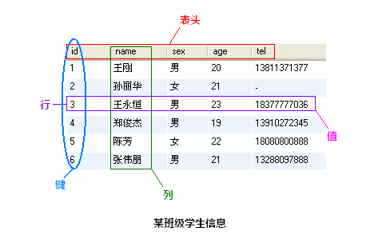

### MySQL中的数据类型

MySQL有三大类数据类型, 分别为数字、日期\时间、字符串, 这三大类中又更细致的划分了许多子类型:
- 数字类型
  整数: tinyint、smallint、mediumint、int、bigint
  浮点数: float、double、real、decimal
- 日期和时间: date、time、datetime、timestamp、year
- 字符串类型
  字符串: char、varchar
  文本: tinytext、text、mediumtext、longtext
  二进制(可用来存储图片、音乐等): tinyblob、blob、mediumblob、longblob

### 创建数据库

(MySQL语句以分号作为语句结尾，若不加分号，命令符会以 -> 提示你继续输入)

`create database 数据库名 [其他选项]`;

`create database samp_db character set gbk;`

`show databases;`查看已经创建了哪些数据库

`use `

### 增

#### 向表中插入数据

`insert [into] 表名 [(列名1, 列名2, 列名3, ...)] values (值1, 值2, 值3, ...);`

按列的顺序插：

`insert into students values(NULL, "王刚", "男", 20, "13811371377");`

若只插部分数据，或者不按列的顺序插

`insert into students (name, sex, age) values("孙丽华", "女", 21);`

### 删

delete 语句用于删除表中的数据, 基本用法为:

`delete from 表名称 where 删除条件;`

删除id为2的行: 

`delete from students where id=2;`

删除所有年龄小于21岁的数据: 

`delete from students where age<20;`

删除表中的所有数据: 

`delete from students;`

### 改

#### 更新表中数据的内容（更改内容）

`update 表名称 set 列名称=新值 where 更新条件;`

将id为5的手机号改为默认的"-": 

`update students set tel=default where id=5;`

将所有人的年龄增加1: 

`update students set age=age+1;`

将手机号为 13288097888 的姓名改为 "张伟鹏", 年龄改为 19: 

`update students set name="张伟鹏", age=19 where tel="13288097888";`

#### 创建表后对表的修改（更改表）

添加列基本形式:

`alter table 表名 add 列名 列数据类型 [after 插入位置];`

在表的最后追加列address: 

`alter table students add address char(60);`

在名为 age 的列后插入列 birthday:

`alter table students add birthday date after age;`

#### 修改列

基本形式: 

`alter table 表名 change 列名称 列新名称 新数据类型;`

将表 tel 列改名为 telphone: 

`alter table students change tel telphone char(13) default "-";`

将 name 列的数据类型改为 char(16): 

`alter table students change name name char(16) not null;`

#### 删除列
基本形式: 

`alter table 表名 drop 列名称;`

删除 birthday 列: 

`alter table students drop birthday;`

#### 重命名表
基本形式: 

`alter table 表名 rename 新表名;`

重命名 students 表为 workmates:

`alter table students rename workmates;`

### 查

`select 列名称 from 表名称 [查询条件];`

返回列 name 和 age 的所有信息：

`select name, age from students;`

以查询所有性别为女的信息为例, 输入查询语句:

`select * from students where sex="女";`

查询年龄在21岁以上的所有人信息: 

`select * from students where age > 21;`

查询名字中带有 "王" 字的所有人信息: 

`select * from students where name like "%王%";`

查询id小于5且年龄大于20的所有人信息:

`select * from students where id<5 and age>20;`

### 参考

- [21分钟 MySQL 入门教程](https://www.cnblogs.com/mr-wid/archive/2013/05/09/3068229.html#c1)
- [数据库多表联合查询附简单例子](https://blog.csdn.net/linan_pin/article/details/70158259)
- [学生表创建与查询](https://blog.csdn.net/hello_syt_2018/article/details/80344460)
- [MySQL等 SQL语句在线练习](https://blog.csdn.net/zytbft/article/details/84504348)

