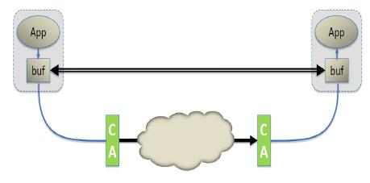
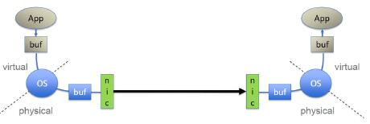
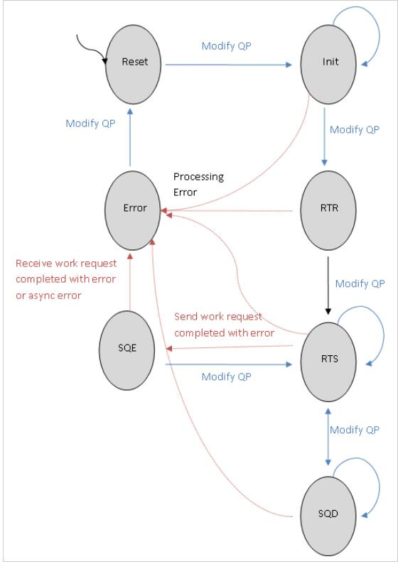
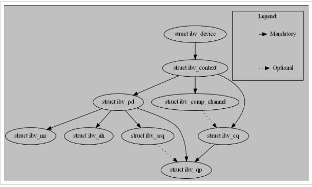

# RDMA 编程手册

# 术语

| 缩写    | 英文全名                                          | 中文全名                   | 描述                                                         |
| :------ | :------------------------------------------------ | :------------------------- | :----------------------------------------------------------- |
|         | Access Layer                                      | 接入层                     | 用于访问互连结构(VPI™、InfiniBand®、以太网、FCoE)的低级操作系统基础设施(管道)。它包括支持上层网络协议、中间件和管理代理所需的所有基本传输服务。 |
| AH      | Address Handle                                    | 地址句柄                   | 在UD QP中用于描述达远程端的路径的对象                        |
| CA      | Channel Adapter                                   | 通道适配器                 | 一种终止无限带宽链接并执行传输层功能的设备                   |
| CI      | Channel Interface                                 | 通道接口                   | 通过网络适配器，相关固件和设备驱动程序软件的组合实现的面向动词消费者的通道描述 |
| CM      | Communication Manager                             | 通信管理器                 | 负责建立、维护和释放通信的实体，用于RC和UC QP服务类型。<br  />服务ID解析协议使UD服务的用户能够找到支持其所需服务的QP。<br  />终端节点的每个IB端口中都有一个CM。 |
|         | Compare & Swap                                    | 比较和交换                 | 指示远程QP读取64位值，将其与提供的比较数据进行比较，如果相等，则将其替换为QP中提供的交换数据。 |
| CQ      | Completion Queue                                  | 完成队列                   | 包含CQEs的队列（FIFO）                                       |
| CQE     | Completion Queue Entry                            | 完成队列条目               | CQ中的一项，描述有关已完成WR的信息（状态大小等）             |
| DMA     | Direct Memory Access                              | 直接内存访问               | 允许硬件绕过CPU直接将数据块移入和移出内存                    |
|         | Fetch & Add                                       | 取回和添加                 | 指示远程QP读取64位值，并将其替换为QP中提供的数据值与该64位值之和。 |
| GUID    | Globally Unique IDentifier                        | 全局唯一标识符             | 一个唯一标识子网中设备或组件的64位数字                       |
| GID     | Global IDentifier                                 | 全局标识符                 | 128位标识符，用于标识网络适配器上的端口，路由器上的端口或多播组。<br  />GID是有效的128位IPv6地址（根据RFC 2373），在IBA中定义了其他属性/限制，以促进有效的发现，通信和路由。 |
| GRH     | Global Routing Header                             | 全局路由头部               | 数据包头，用于跨子网边界传递数据包，也用于传递多播消息。<br  />此数据包头基于IPv6协议。 |
|         | Network Adapter                                   | 网络适配器                 | 一种允许在网络中的计算机之间进行通信的硬件设备。             |
|         | host                                              | 主机                       | 一种运行了操作系统的计算机平台，该操作系统可以控制一个或多个网络适配器 |
| HCA     | Host Channel Adapter                              | 主机通道适配器             |                                                              |
| IB      | InfiniBand                                        | 无限带宽技术               |                                                              |
|         | Join operation                                    | 加入操作                   | IB端口必须显式通过向SA发送请求来加入多播组以接收多播数据包。 |
|         | lkey                                              | 本地密钥                   | 注册MR时接收到的数字，它将在本地被WR用于标识存储区域及其关权限。 |
| LID     | Local IDentifier                                  | 本地标识符                 | 子网管理器分配给终端节点的16位地址。每个LID在其子网内都是唯一的。 |
| LLE     | Low Latency Ethernet                              | 低延时以太网               | 基于CEE（融合增强型以太网）的RDMA服务，允许通过以太网进行IB传输。 |
| NA      | Network Adapter                                   | 网络适配器                 | 终止链接并执行传输层功能的设备。                             |
| MGID    | Multicast Group ID                                | 多播组ID                   | IB多播组用MGID标识，并由SM管理。 SM将MLID与每个MGID关联，并在结构中对IB交换机进行显式编程，以确保加入多播组的所有端口均接收到数据包。 |
| MR      | Memory Region                                     | 内存区域                   | 一组连续的内存缓冲区，这些缓冲区已经通过访问权限进行了注册。这些缓冲区需要注册，以便网络适配器使用它们。在注册期间，将创建L_Key和R_Key并将其与创建的内存区域关联 |
| MTU     | Maximum Transfer Unit                             | 最大传输单元               | 可以从端口发送/接收的数据包的有效载荷（不包括头部）的最大大小 |
| NIC     | network interface controller                      | 网络接口控制器             | 一块被设计用来允许计算机在计算机网络上进行通讯的计算机硬件。 |
| MW      | Memory Window                                     | 内存窗口                   | 一个被分配的资源，在绑定到现有“内存注册”中的指定区域后即可启用远程访问。每个内存窗口都有一个关联的窗口句柄，访问权限集和当前的R_Key。 |
|         | Outstanding Work Request                          | 未完成工作请求             | WR已发布到工作队列，但它的完成没有查询到                     |
| pkey    | Partition key                                     | 分区密钥                   | pkey标识端口所属的分区。 pkey大致类似于以太网网络中的VLAN ID。它用于指向端口的分区密钥（pkey）表中的条目。子网管理器（SM）为每个端口分配至少一个pkey。 |
| PD      | Protection Domain                                 | 保护域                     | 其组件只能彼此交互的对象。 AHs与QPs交互，而MRs与WQs交互。    |
| QP      | Queue Pair                                        | 队列对                     | 一对独立的WQs（发送队列和接收队列）打包在一个对象中，目的是在网络节点之间传输数据。<br  />发布是用于启动数据的发送或接收。 <br  />QP有三种类型：UD不可靠数据报，不可靠连接和可靠连接。 |
| RC      | Reliable Connection                               | 可靠连接                   | 基于面向连接的协议的QP传输服务类型。<br  />一个QP（队列对）与另一个单个QP相关联。消息以可靠的方式发送（就信息的正确性和顺序而言）。 |
| RDMA    | Remote Direct Memory Access                       | 远程内存直接访问           | 在不调用远程CPU的情况下访问远程端的内存                      |
| RDMA_CM | Remote Direct Memory Access Communication Manager | 远程直接内存访问通信管理器 | 用于设置可靠的、连接的和不可靠的数据报数据传输的API。 它提供用于建立连接的RDMA传输中立接口。 该API基于套接字，但适用于基于队列对（QP）的语义：通信必须通过特定的RDMA设备进行，并且数据传输基于消息。 |
|         | Requestor                                         | 请求者                     | 连接中，将启动数据传输一侧（通过发布发送请求）               |
|         | Responder                                         | 响应者                     | 连接中，将响应来自请求者的命令的一侧，其中可能包括写响应者内存或读响应者内存的请求，以及最后请求响应者接收消息的命令。 |
|         | rkey                                              | 远端密钥                   | 注册MR时收到的数字，用于对传入的RDMA操作强制执行权限检查     |
| RNR     | Receiver Not Ready                                | 接收器未就绪               | 在RC QP流中，通信的两边之间有连接，但接收端不存在RR          |
| RQ      | Receive Queue                                     | 接收队列                   | 保留用户发布的RRs的工作队列                                  |
| RR      | Receive Request                                   | 接收请求                   | 发布到RQ的WR，其中使用发送操作码描述将输入数据写入何处。另请注意，一个即时的RDMA write将消耗一个RR。 |
| RTR     | Ready To Receive                                  | 准备接收                   | 一个QP状态，该状态下可以发布和处理RR                         |
| RTS     | Ready To Send                                     | 准备发送                   | 一个QP状态，该状态下可以发布和处理SR                         |
| SA      | Subnet Administrator                              | 子网管理器                 | 查询和操作子网管理数据的接口                                 |
| SGE     | Scatter /Gather Elements                          | 分散/聚集元素              | 指向本地注册内存块的全部或一部分的指针的条目。这个条目保存块的起始地址，大小和lkey（及其关联的权限）。 |
|         | S/G Array                                         | S/G数组                    | WR中存在的一个S/G元素数组，根据所使用的操作码，该WR可以从多个缓冲区收集数据并将其作为单个流发送，也可以将单个流分解为多个缓冲区 |
| SM      | Subnet Manager                                    | 子网管理器                 | 配置和管理子网的实体。<br  />发现网络拓扑。<br  />分配LID。确定路由方案并设置路由表。<br  />一个主SM，可能还有几个从SM（备用模式）。<br  />管理交换机路由表，从而建立通过结构的路径。 |
| SQ      | Send Queue                                        | 发送队列                   | 保存用户发布的SRs的工作队列                                  |
| SR      | Send Request                                      | 发送请求                   | 已发布到SQ的WR，其中描述了将要传输多少数据，其方向和方式（操作码将指定传输） |
| SRQ     | Shared Receive Queue                              | 共享接收队列               | 一个队列，其中持有来自与其相关联的任何RC/UC/UD QP中的传入消息的WQE。<br />一个SRQ可以关联多个QP。 |
| TCA     | Target Channel Adapter                            | 目标适配器                 | 不需要支持动词的通道适配器，通常在I/O设备中使用              |
| UC      | Unreliable Connection                             | 不可靠的连接               | 基于面向连接的协议的QP传输服务类型，其中QP（队列对）与另一个单个QP相关联。 QPs无法执行可靠的协议，消息可能会丢失。 |
| UD      | Unreliable Datagram                               | 不可靠数据报               | 一种QP传输服务类型，其中消息可以是一个包的长度，并且每个UD QP可以从子网中的另一个UD QP发送/接收消息。<br />消息可能会丢失，不能保证顺序。 UD QP是唯一支持多播消息的类型。 UD数据包的消息大小限于路径MTU |
|         | Verbs                                             | 动词                       | 网络适配器功能的抽象描述.<br />使用动词，任何应用程序都可以创建/管理使用RDMA进行数据传输所需的对象。 |
| VPI     | Virtual Protocol Interface                        | 虚拟协议接口               | 允许用户更改端口的第2层协议。                                |
| WQ      | Work Queue                                        | 工作队列                   | 发送队列或接收队列之一。                                     |
| WQE     | Work Queue Element                                | 工作队列元素               | WQE，发音为“ wookie”，是工作队列中的一个元素。               |
| WR      | Work Request                                      | 工作请求                   | 用户发布到工作队列的请求。                                   |
|         | input parameter                                   | 输入参数                   | 传入了数据的参数。                                           |
|         | output parameter                                  | 输出参数                   | 传出了数据的参数。                                           |

# 架构概述

## 1 InfiniBand

InfiniBand（IB）是一种高速，低延迟，低CPU开销，高效且可扩展的服务器和存储互连技术。 InfiniBand的关键功能之一是它对本机远程直接内存访问（RDMA）的支持。 InfiniBand支持服务器之间以及服务器与存储之间的数据传输，而在数据路径中无需调用主机CPU。 InfiniBand使用I/O通道进行数据通信（每台主机最多1600万个），其中每个通道提供虚拟化NIC或HCA的语义（安全性，隔离性等）。 InfiniBand使用铜缆和光纤连接，可提供各种技术或解决方案速度，范围从每个端口10Gb/s（SDR）到最高56Gb/s（FDR）。 InfiniBand的效率和可扩展性使其成为全球领先的高性能计算，云，Web 2.0，存储，数据库以及金融数据中心和应用程序的最佳性能和成本/性能互连解决方案。 InfiniBand是由IBTA组织定义和规范的标准技术。


## 2 虚拟协议互连（VPI）

Mellanox虚拟协议互连（VPI）架构为支持InfiniBand和以太网语义的网络适配器和交换机之间的通信提供了高性能，低延迟和可靠的方式。 可以将VPI适配器或交换机设置为在每个端口上传递InfiniBand或以太网语义。 例如，可以将双端口VPI适配器配置为以下选项之一：

* 具有两个InfiniBand端口的适配器（HCA）
* 具有两个以太网端口的NIC
* 一个适配器，该适配器同时具有一个InfiniBand端口和一个以太网端口

同样，VPI交换机可以仅有InfiniBand的端口，仅有以太网的端口，或具有同时工作的InfiniBand和以太网端口的混合。

基于Mellanox的VPI适配器和交换机同时支持InfiniBand RDMA和以太网RoCE解决方案。

## 3  基于聚合以太网的RDMA（RoCE）

RoCE是以太网RDMA的标准，也是IBTA组织定义和规范的标准。 RoCE为以太网提供了真正的RDMA语义，因为它不需要复杂且性能低下的TCP传输（例如，iWARP需要TCP）。

RoCE是当今最高效的低延迟以太网解决方案。 它需要非常低的CPU开销，并利用数据中心桥接以太网中的优先级流控制来实现无损连接。 自OFED 1.5.1发布以来，Open Fabrics软件已完全支持RoCE。

## 4 RDMA技术的比较

当前，共有三种支持RDMA的技术：InfiniBand，以太网RoCE和以太网iWARP。 这三种技术共享本文档中定义的通用用户API，但是具有不同的物理层和链接层。

谈到以太网解决方案，RoCE在性能，吞吐量和CPU开销方面都比iWARP具有明显的性能优势。 RoCE得到了许多领先解决方案的支持，并集成在Windows Server软件（以及InfiniBand）中。

RDMA技术基于传统网络中的网络概念，但是它们与IP网络中的对等技术有所不同。 关键区别在于RDMA提供消息传递服务，应用程序可以使用该消息传递服务直接访问远程计算机上的虚拟内存。 消息传递服务可用于进程间通信（IPC），与远程服务器的通信以及使用上层协议（ULP）与存储设备进行通信，例如RDMA的iSCSI扩展（ISER）和SCSI RDMA协议（SRP），存储消息 Block（SMB），Samba，Lustre，ZFS等。

RDMA通过堆栈绕过和避免复制提供了低的延迟，降低了CPU利用率，减少了内存带宽瓶颈，并提供了高带宽利用率。 RDMA传递的主要好处来自将RDMA消息传递服务呈现给应用程序的方式以及用于传输和传递这些消息的基础技术。 RDMA提供基于通道的IO。 该通道允许使用RDMA设备的应用程序直接读写远程虚拟内存。

在传统的套接字网络中，应用程序通过API来从操作系统请求网络资源，该API代表它们进行事务处理。 但是，RDMA使用OS建立通道，然后允许应用程序直接交换消息，而无需进一步的OS干预。 消息可以是RDMA  READ，RDMA WRITE操作或 SEND/REVICE操作。 IB和RoCE都支持多播传输。

IB链路层提供功能，例如用于拥塞控制的基于信用的流量控制机制。 它还允许使用虚拟通道（VL），从而简化高层协议和高级服务质量。 它保证了VL中沿给定路径的强有序性。 IB传输层提供可靠性和交付保证。

IB使用的网络层具有的功能使即使在物理上位于不同服务器上的应用程序之间也可以轻松地在应用程序的虚拟内存之间直接传输消息。 因此，最好将IB传输层与软件传输接口的组合视为RDMA消息传输服务。包括软件传输接口在内的整个堆栈都包含IB消息传递服务。



最重要的一点是，每个应用程序都可以直接访问结构中设备的虚拟内存。 这意味着应用程序不需要向操作系统发出传输消息的请求。 与此形成对比的是传统网络环境，在传统网络环境中，共享网络资源由操作系统拥有，而用户应用程序无法访问。 因此，应用程序必须依赖于操作系统的参与，才能将数据从应用程序的虚拟缓冲区空间中移出，并通过网络堆栈移到网线上。 同样，在另一端，应用程序必须依靠操作系统来代表它在网络上检索数据并将其放置在其虚拟缓冲区空间中。



TCP/IP /以太网是面向字节流的传输，用于在套接字应用程序之间传递信息字节。 TCP/IP在设计上是有损的，但使用传输控制协议（TCP）来实现可靠性方案。 TCP/IP需要对每个操作进行操作系统（OS）干预，包括在线路两端复制缓冲区。 在面向字节流的网络中，丢失了消息边界的观点。 当应用程序要发送数据包时，操作系统将字节放入属于操作系统的主内存中的匿名缓冲区中，当字节传输完成时，操作系统会将其缓冲区中的数据复制到应用程序的接收缓冲区中。 每次到达数据包时都会重复此过程，直到接收到整个字节流为止。 TCP负责重新传输由于拥塞而丢失的任何数据包。

在IB中，完整的消息直接传递到应用程序。 一旦应用程序请求传输RDMA读或写，IB硬件就会根据需要将出站消息划分为大小由结构路径最大传输单元确定的数据包。 这些数据包通过IB网络传输，并直接传递到接收应用程序的虚拟缓冲区中，在此将它们重新组合为完整的消息。 一旦接收到整个消息，就会通知接收应用程序。 因此，直到整个消息传递到接收应用程序的缓冲区之前，发送应用程序和接收应用程序都不会涉及。

## 5  关键组件

仅在部署IB和RoCE的优势的背景下介绍这些内容。我们不讨论电缆和连接器。

**主机通道适配器**

HCAs提供了IB终端节点（例如，服务器）连接到IB网络的点。这些等效于以太网（NIC）卡，但它们的功能更多。 HCA在操作系统的控制下提供地址转换机制，该机制允许应用程序直接访问HCA。相同的地址转换机制是HCA代表用户级应用程序访问内存的方式。该应用程序引用虚拟地址，而HCA可以将这些地址转换为物理地址，以影响实际的消息传输。

**范围扩展器**

InfiniBand范围扩展是通过将InfiniBand流量封装到WAN链路上并扩展足够的缓冲区信用来确保WAN上的完整带宽来实现的。

**子网管理器**

InfiniBand子网管理器为连接到InfiniBand结构的每个端口分配本地标识符（LID），并根据分配的LID开发路由表。 IB子网管理器是软件定义网络（SDN）的概念，它消除了互连的复杂性，并允许创建超大规模的计算和存储基础结构。

**交换机**

IB交换机在概念上类似于标准网络交换机，但旨在满足IB性能要求。 它们实现了IB链路层的流控制，以防止数据包丢失，并支持避免拥塞和自适应路由功能以及高级服务质量。 许多交换机都包含一个子网管理器。 至少需要一个Subnet Manager才能配置IB结构。

## 6 对现有的应用程序和ULPs的支持

使用IB上的IP（IPoIB）或IB上的以太网（EoIB）或RDS ULP，可以使IP应用程序在InfiniBand架构上运行。 通过iSER，SRP，RDS，NFS，ZFS，SMB等支持存储应用程序。 MPI和Network Direct也都支持ULP，但不在本文档范围之内。

## 7 引用

* IBTA Intro to IB for End Users
  <http://members.infinibandta.org/kwspub/Intro_to_IB_for_End_Users.pdf>
* Mellanox InfiniBandFAQ_FQ_100.pdf
  <http://www.mellanox.com/pdf/whitepapers/InfiniBandFAQ_FQ_100.pdf>
* Mellanox WP_2007_IB_Software_and_Protocols.pdf
  <http://www.mellanox.com/pdf/whitepapers/WP_2007_IB_Software_and_Protocols.pdf>
* Mellanox driver software stacks and firmware are available for download from Mellanox
  Technologies’ Web pages: <http://www.mellanox.com>

# 编程概述

## 0 简介

VPI架构允许直接以用户模式访问硬件。 Mellanox提供了一个动态加载的库，可通过动词API创建对硬件的访问。本文档包含动词及其相关输入，输出，描述和功能都通过操作系统编程接口公开。

注意：本编程手册及其动词仅对用户空间有效。有关内核空间动词，请参见头文件。

使用动词进行编程可以自定义和优化RDMA-Aware网络。只有具有VPI系统高级知识和经验的程序员才能进行这种自定义和优化。

为了执行RDMA操作，首先需要建立到远程主机的连接以及适当的权限。完成此任务的机制是队列对（QP）。对于那些熟悉标准IP堆栈的人来说，QP大致等同于套接字。 QP需要在连接的两端进行初始化。在实际设置QP之前，可以使用Communication Manager（CM）来交换有关QP的信息。


一旦建立了QP，动词API即可用于执行RDMA读取，RDMA写入和原子操作。也可以执行类似于套接字read/write的序列化send/receive操作。

## 1 可用的通信操作

### 1.1 发送/带立即数发送

通过发送操作，您可以将数据发送到远程QP的接收队列。 接收者必须事先发布接收缓冲区才能接收数据。 发送方无法控制数据在远程主机中的驻留位置。

可选地是，4字节的立即数可与数据缓冲区一起发送。 该立即数作为接收通知的一部分提供给接收者，不包含在数据缓冲区中。

### 1.2 接收

这是发送操作的对应操作。 接收主机被通知数据缓冲区已经被接受，可能带有内联的立即数。 接收应用程序负责接收缓冲区的维护和发布。

### 1.3 RDMA读

从远程主机读取一段内存。 调用者指定远程虚拟地址以及将要复制到的本地内存地址。 在执行RDMA操作之前，远程主机必须提供适当的权限来访问其内存。 一旦设置了这些权限，就可以进行RDMA读取操作，而不会向远程主机发出任何通知。 对于RDMA读和写，远程端都不知道此操作已完成（除了准备许可和资源外）。

### 1.4 RDMA写/带立即数的RDMA写

类似于RDMA读取，但是数据被写入远程主机。 执行RDMA写操作时不会通知远程主机。 但是，带立即数的RDMA写操作确实会将立即数通知给远程主机。


### 1.5 原子取回和添加/原子比较和交换

这些是RDMA操作的原子扩展。

原子取回和添加操作原子地将指定虚拟地址处的值增加指定量。 增加之前的值将返回给调用方。

原子比较和交换将原子比较指定虚拟地址处的值与指定值，如果它们相等，则指定值将存储在该地址处。

## 2 传输模式

在建立QP时，您可以在几种不同的传输模式中选择一种。每种模式下可用的操作如下表所示。libibverbs不支持RD API。

| 操作                          |   UD   |    UC    |   RC   |   RD   |
| :---------------------------- | :----: | :------: | :----: | :----: |
| SEND（带立即数 )              |   V    |    V     |   V    |   V    |
| RECV                          |   V    |    V     |   V    |   V    |
| RDMA WRITE（带立即数）        |        |    V     |   V    |   V    |
| RDMA READ                     |        |          |   V    |   V    |
| atomic：取回和添加/比较和交换 |        |          |   V    |   V    |
| 最大消息大小                  |  MTU   |   2GB    |  2GB   |  2GB   |
| 可靠性                        | 不可靠 |  不可靠  |  可靠  |  可靠  |
| 连接类型                      | 无连接 | 有连接的 | 有连接 | 无连接 |
| 多播                          |  支持  |  不支持  | 不支持 |  支持  |

详细信息见ibv_post_send。

### 2.1 可靠连接（RC）

一个QP仅与另一个QP相关联。

一个QP的发送队列发送的消息被可靠地传递到另一个QP的接收队列。

数据包按顺序传送。

RC连接与TCP连接非常相似。

### 2.2 不可靠连接（UC）

一个QP仅与另一个QP相关联。

连接不可靠，因此数据包可能会丢失。

传输层不会重试带有错误的消息，并且错误处理必须由更高级别的协议提供。

### 2.3 不可靠数据报（UD）

QP可以向/从任何其他UD QP发送/接收单个数据包的消息。

无法保证顺序和交付，并且接收方可能会丢弃已交付的数据包。

支持多播消息（一对多）。

UD连接与UDP连接非常相似。

## 3 关键慨念

### 3.1 发送请求（SR）

SR定义了使用RDMA从何处将多少数据怎样发送到何地。`struct ibv_send_wr`用于实现SR。

### 3.2 接受请求（RR）

RR定义了用于非RDMA操作（即发送/接收操作）的接收数据的缓冲区。 如果未定义缓冲区，并且本地端传输层企图进行一个带有立即数的发送或RDMA写操作，则远端会发送一个接受未就绪（RNR）错误。 `struct ibv_recv_wr`用于实现RR。

### 3.3 完成队列（CQ）

完成队列是包含已发布到工作队列（WQ，包括SQ和RQ）中的已完成工作请求（发送请求和接收请求）的对象。 完成队列的每个元素表示指定的工作请求已完成（包括成功完成的工作请求和未成功完成工作请求）。

完成队列是一种机制，用于通知应用程序关于已结束的工作请求的信息（状态，操作码，大小，源）。

CQs具有n个完成队列条目（CQE）。CQE的数量是创建CQ时指定的。

当一个CQE被轮询到时，会将其从CQ中删除。

CQ是CQE的FIFO。

CQ可以为发送队列、接收队列、发送队列和接收队列提供服务。

来自多个QPs的工作队列可以与单个CQ相关联。

`struct ibv_cq`用于实现CQ。

### 3.4 内存注册（MR）

内存注册是一种机制，它允许应用程序将虚拟地址将到网络适配器的一组虚拟连续内存位置或一组物理连续内存位置描述为使用虚拟地址的虚拟连续缓冲区。

注册过程将内存页面固定（以防止页面换出并保持物理地址与虚拟地址映射关系）。

在注册过程中，操作系统会检查被注册内存块的权限。

注册过程将虚拟地址到物理地址的转换表写入网络适配器。

注册内存时，将为该区域设置权限。权限包括本地写入，远程读取，远程写入，原子和绑定。

每个MR都有一个远程密钥和一个本地密钥（r_key，l_key）。本地HCA使用本地密钥来访问本地内存，例如在接收操作期间。在RDMA操作期间，将远程密钥分配给远程HCA，以允许远程进程访问系统内存。

同一内存缓冲区可以注册多次（甚至具有不同的访问权限），并且每次注册都会生成不同密钥对。

`struct ibv_mr`用于实现内存注册。


### 3.5 内存窗口（MW）

内存窗口使应用程序可以更灵活地控制对其内存的远程访问。

内存窗口适用于以下情况：

* 希望以动态方式授予和撤销对已注册区域的远程访问权限，与使用注销/注册或重注册相比，其性能损失要小一些。

* 希望向不同的远程代理授予不同的远程访问权限，或在注册区域内的不同范围内授予不同的权限。

将内存窗口与内存注册区相关联的操作称为绑定。

不同的内存窗口可以重叠同一内存注册区（甚至具有不同访问权限）。

### 3.6 地址向量/地址句柄（AV/AH）

地址向量是一个对象，它描述从本地节点到远程节点的路由。

在每个UC/RC QP中，QP上下文中都有一个地址向量。

在UD QP中，应在每个发布的发送请求中定义地址向量。

`struct ibv_ah`用于实现地址向量。

### 3.7 全局路由头部（GRH）

GRH用于子网之间的路由。 使用RoCE时，GRH用于子网内的路由，因此是必需的、强制的。 为了使应用程序同时支持IB和RoCE，必须强制使用GRH。

在UD QPs上使用全局路由时，接收缓冲区的前40个字节中将包含GRH。 该区域用于存储全局路由信息，因此可以生成适当的地址向量以响应接收到的数据包。 如果GRH与UD一起使用，则接收请求应始终为GRH提供额外的40字节。

`struct ibv_grh`用于实现GRH。

### 3.8 保护域（PD）

保护域是组件只能彼此交互的对象。 这些组件可以是AH，QP，MR和SRQ。

保护域用于将QP与MR和MW相关联，作为启用和控制网络适配器对主机系统内存的访问的一种方式。

保护域还用于将UD QPs与地址句柄相关联，作为控制对UD目标的访问的一种方式。

`struct ibv_pd`用于实现保护域。

### 3.9 异步事件

网络适配器可以发送异步事件以通知SW有关系统中发生的事件。

异步事件有两种类型：


* **相关事件**：个体对象（CQ，QP，SRQ）发生的事件。 这些事件将被发送到特定的进程。

* **独立事件**：全局对象发生的事件（网络适配器，端口错误）。 这些事件将发送到所有进程。

### 3.10 分散集中（S/G）

使用分散集中元素(SGE)来收集/分散数据，SGE包括：

* 地址：将要从中收集或把数据分散到的本地数据缓冲区的地址。

* 大小：将从该地址读取 或 将写入该地址的数据的大小。

* L_key：已注册到此缓冲区的内存注册区的本地密钥。

`struct ibv_sge`实现分散收集元素。

### 3.11 轮询

轮询完成队列（CQ）将获取已发布的工作请求（发送或接收）的有关详细信息。

如果在一个工作请求中，工作完成的状态为bad，则其余的工作完成的状态都将是bad（并且工作队列将转移至错误状态）。

每个没有工作完成的工作请求仍然是未完成的。

仅在工作请求有一个工作完成后，才可以使用/重用/释放 发送/接收缓冲区。

应该始终检查工作完成的状态。

轮询CQE时，会将其从CQ中删除。

轮询是通过`ibv_poll_cq`操作完成的。

## 4 QP状态

由于QP是RDMA中的重要对象之一，我将在接下来的几篇文章中处理它。

### 4.1 QP状态转变

在QP生命周期中，可能的状态为:

* 重置（Reset）
* 初始化 (Init)
* 准备接收 (RTR)
* 准备发送 (RTS)
* 发送队列耗尽(SQD)
* 发送队列出错 (SQE)
* 出错（Error）

QP可以通过两种可能的方式从一种状态转变到另一种状态:

1. 显式调用ibv_modify_qp()。
2. 在处理错误时由设备自动转变。

QP被创建时处于重置状态。

任何状态的任何QP都可以通过调用ibv_modify_qp()转变为为Reset或Error状态。



### 4.2 Reset状态

**描述**

QP被创建时处于重置状态。 在此状态下，QP的所有所需资源都已经分配了。

为了重用QP，可以通过调用ibv_modify_qp（）将其从任何状态转换为重置状态。 如果在此状态转换之前，该QP的发送或接收队列中有任何WR或完成，则会从队列中将其清除。

**工作请求**

工作请求不应发布到发送或接收队列。 尝试这样做将导致立即错误。

发送和接收队列中的工作请求都不会被处理。

**包**

目标为此QP的传入数据包将被静默丢弃。

该QP不会发送任何数据包。

### 4.3 Init状态

**描述**

为了转变到这个状态，必须在Reset状态调用ibv_modify_qp()。

**工作请求**

工作请求仅可以发布到接收队列中。 尝试将工作请求发布到发送队列将导致立即错误。

发送和接收队列中的工作请求都不会被处理。

**包**

目标为此QP的传入数据包将被静默丢弃。

该QP不会发送任何数据包。

### 4.4 RTR状态

**描述**

为了转变到这个状态，必须在Init状态调用ibv_modify_qp()。

在RTR状态下，QP只能用作响应者。

**工作请求**

工作请求可以发布到接收队列中。 尝试将工作请求发布到发送队列将导致立即错误。

仅接收队列中的工作请求会被处理。

**包**

目标为此QP的传入数据包将被保存。 QP将以响应者从该QP发送数据包（即数据，acks和nacks）。

### 4.5 RTS状态

**描述**

为了转变到这个状态，必须在RTR或SQD状态调用ibv_modify_qp()。

在RTS状态下，QP可以用作响应者或请求者。

**工作请求**

工作请求可以发布到接收队列和发送队列中。

接收队列和发布队列中的工作请求都会被处理。

**包**

目标为此QP的传入数据包将被保存。 QP将以响应者从该QP发送数据包（即数据，acks和nacks）。

QP可以作为请求者发出数据包。

### 4.6  SQD状态

**描述**

为了转变到这个状态，必须在RTS状态调用ibv_modify_qp()。

此状态仅影响发送队列: 已经开始处理的WR会继续处理直到完成，新的WR将不会被处理。

这种状态分为两种内部状态:

* 正在消耗——发送队列中仍有将要处理的工作请求。
* 已耗尽——发送队列中没有任何将要处理的工作请求。

仅当QP的内部状态为已耗尽时，才可以将该QP的状态转换为RTS或SQD。

**工作请求**

工作请求可以发布到接收队列和发送队列中。

接收队列中的工作请求将被处理。

已开始处理的发送队列中的工作请求将继续处理直到完成，新工作请求将不被处理。


**包**

目标为此QP的传入数据包将被保存。 QP将以响应者从该QP发送数据包（即数据，存acks和nacks）。

QP可以作为请求者发出数据包。

### 4.7 SQE状态

**描述**

除了RC QPs，对于所有处于RTS状态且发送队列处理了工作请求并以完成错误结束的QP类型，设备姿容转变为SQE状态。该工作请求的状态是未定义的（如果工作请求已经部分或完全处理，则是未知的），并且本地或远程缓冲区的内容（取决于所使用的操作码）是未定义的。

发送队列中的所有后续工作请求将因为错误而被刷新。

可以调用ibv_modify_qp（）返回到RTS状态以恢复发送队列。

**工作请求**

工作请求可以发布到接收队列和发送队列中。

仅接收队列中的工作请求将被处理。

发送队列中的所有后续工作请求将因为错误而被刷新。

**包**

目标为此QP的传入数据包将被保存。QP将以响应者从该QP发送数据包（即数据，存acks和nacks）。

### 4.8 Error状态

**描述**

这是QP状态机中的最后一个状态。

如果RC QP中发送队列中的工作请求因错误完成，或任意QP中接收队列中的工作请求因错误完成，则设备可能会自动将QP自动转变为此状态。 或从任何状态调用ibv_modify_qp（）也可以转为本状态。

如果QP状态自动转换，则此工作请求的状态是未定义的（如果工作请求已经部分或完全处理，则是未知的），并且本地或远程缓冲区的内容（取决于所使用的操作码）是未定义的。

**工作请求**


工作请求可以发布到接收队列和发送队列中。

如果QP自动转换到此状态，则第一个因错误完成的工作请求将指示错误原因。 该队列中的所有后续工作请求，另一个队列中的所有工作请求以及发布到两个队列中的新工作请求都将因错误而被刷新。

如果使用ibv_modify_qp（）将QP转换为此状态，则发送和接收请求中所有未完成的工作请求都将因错误而被刷新。

**包**

目标为此QP的传入数据包将被静默丢弃。

该QP不会发送任何数据包。

### 4.9 总结

在本节，我们讨论了QP的各种状态以及QP的行为。

下表总结了QP的行为取决于它的状态:

|                | Reset    | Init     | RTR    | RTS  | SQD          | SQE        | Error      |
| :------------- | :------- | :------- | :----- | :--- | :----------- | :--------- | :--------- |
| 发布到接收队列 | 禁止     | 允许     | 允许   | 允许 | 允许         | 允许       | 允许       |
| 发布到发送队列 | 禁止     | 禁止     | 禁止   | 允许 | 允许         | 允许       | 允许       |
| 接收请求处理   | 不处理   | 不处理   | 处理   | 处理 | 处理         | 处理       | 因错误刷新 |
| 发送请求处理   | 不处理   | 不处理   | 不处理 | 处理 | 新的WR不处理 | 因错误刷新 | 因错误刷新 |
| 传入的包       | 静默丢弃 | 静默丢弃 | 处理   | 处理 | 处理         | 处理       | 静默丢弃   |
| 响应的包       | 无       | 无       | 有     | 有   | 有           | 有         | 无         |
| 传出的包       | 无       | 无       | 无     | 发出 | 发出         | 无         | 无         |

## 5 使用QP状态

在2.4中，我们讨论了各种QP状态。在本节中，我将尝试解释为什么需要这些状态，以及如何在每个状态中使用QP。

### 5.1 Reset状态

QP可以通过两种方式转为Reset状态:

* 创建
* 通过调用ibv_modify_qp()将它从任何其他状态转变为Reset状态

当创建QP时，会花费一些时间（存在上下文切换，工作队列缓冲区的内存分配，QP编号分配等）。

如果需要在快速路径中使用新的QP，以下内容：

* 创建一个QP
* 使用QP（修改为RTS并发送/接收数据）
* 销毁QP

的更好的替代方法是：只创建一次QP，然后在需要时执行以下操作:

* 使用QP（修改为RTS并发送/接收数据）
* 修改QP为Reset状态，以供以后使用

当QP不再需要时，它可以被销毁。

重用相同的QP可能比每次创建它更快。 将QP从任何其他状态转变为Reset状态将清除先前事务中的所有遗留物（例如发送和接收队列中的工作请求和完成）。

但是，不建议在同一节点之间使用相同的QP，因为可能会发生意外结果（数据包丢失）。

将QP移到“reset”状态将阻止QP发送或接收数据包。

### 5.2 Init状态

将QP转变为RTR状态时，QP将处理传入的数据包。 如果在转变到RTR状态后由于某种原因（例如：OS调度程序没有给该进程分配时间），工作请求没有被发布到该QP的接收队列中，则那些数据包的请求者可能发生接收器未就绪（RNR）错误 。 为了防止这种情况的发生，可以将接收请求发布到处于Init状态的QP。 在将QP转换为RTR状态之前，不会处理那些工作请求。

### 5.3 RTR状态

在这种状态下，QP处理传入的数据包。 如果不将QP用作请求者（工作请求不被发布到它的发送队列中），则QP可能会保持RTR状态。

### 5.4 RTS状态

在大多数应用程序中，QP将转变为RTS状态。 在这种状态下，QP可以作为请求者发送数据包并处理传入数据包。

即使您的QP不会充当请求者，也可以将其转换为此状态。

### 5.5 SQD状态

如果希望更改某些发送队列属性，则应将QP转换为SQD状态，修改所需的属性，然后将QP转变回RTS状态以使其能够继续发送数据包。

### 5.6 SQE状态

只有在发送队列中的工作请求因错误而完成的情况下，设备才能自动将QP转换为此状态。 在这种状态下，发送队列无法作为请求者发送数据包。 如果希望从该状态恢复QP，则应将QP修改回RTS状态。

### 5.7 Error状态

QP可以通过两种方式移动到Error状态：

1. RDMA设备在因错误而完成时，自动转变
2. 从其他任何状态将QP转为Error状态

如果发生错误，则在队列（发送或接收队列）的完成队列中第一次获得错误的完成将保持指示错误原因的状态。 该队列和其他队列中的其余工作请求将因错误刷新。

此状态对于回收所有工作请求以释放其缓冲区很有用（例如，如果工作请求中的属性wr_id指定了此工作请求使用的缓冲区）。

将QP转变为“Error”状态将阻止QP发送或接收数据包。

### 5.8 销毁QP

这本身并不是一个QP状态，但是当用户完成了QP的工作，并且希望阻止QP发送或接收数据包时，他可以销毁它。

## 6 典型应用

本文档提供了两个程序示例:

* 第一个代码，RDMA_RC_example，使用VPI动词API，说明如何执行RC：发送，接收，RDMA读取和RDMA写入操作。
* 第二个代码，多播示例，使用RDMA_CM动词API，演示了多播UD。

典型应用程序的结构如下。 编程示例中实现每个步骤的函数以粗体显示。

1. 获取设备列表：
   首先你必须或者本地主机上可用IB设备的列表。列表中的每一个设备都含有一个名字和一个GUID。比如设备名可能是：mthca0, mlx4_1。
   在编程示例中由**8.1.4 resources_create**实现。

2. 打开请求的设备：
   遍历设备列表，根据其GUID或名称选择一个设备并打开它。
   在编程示例中由**8.1.4 resources_create**实现。

3. 查询设备功能：          
   设备功能使用户可以了解支持的功能（APM，SRQ）和打开的设备的功能。
   在编程示例中由**8.1.4 resources_create**实现。

4. 分配一个保护域来包含您的资源：
   保护域(PD)允许用户限制哪些组件只能相互交互。这些组件可以是AH、QP、MR、MW和SRQ。
   在编程示例中由**8.1.4 resources_create**实现。

5. 注册内存区：
   VPI仅适用于已注册的内存。在进程的虚拟空间中有效的任何内存缓冲区都可被注册。 在注册过程中，用户设置内存许可权，并接收本地和远程密钥（lkey / rkey），这些密钥稍后将用于引用此内存缓冲区。
   在编程示例中由**8.1.4 resources_create**实现。

6. 创建一个完成队列（QP）：
   CQ包含完成的工作请求（WR）。 每个WR将生成一个放置在CQ上的完成队列条目（CQE）。 CQE将指示WR是否成功完成。
   在编程示例中由**8.1.4 resources_create**实现。

7. 创建队列对（QP）：
   创建QP还将创建关联的发送队列和接收队列。
   在编程示例中由**8.1.4 resources_create**实现。

8. 培养一个QP：
   创建的QP在经过多个状态转换之前仍然无法使用，最终进入准备发送（RTS）。 这提供了QP用来发送/接收数据所需的信息。
   在编程示例中由**8.1.6 connect_qp、8.1.7 modify_qp_to_init、8.1.8 post_receive、8.1.10 modify_qp_to_rtr,、8.1.11 modify_qp_to_rts实现**。
9. 发布工作请求和轮询完成：
   使用创建的QP进行通信操作。
   在编程示例中由**8.1.12 post_send和8.1.13 poll_completion实现**。

10. 清理：
    按照与创建对象相反的顺序销毁对象：
    删除QP
    删除CQ
    注销MR
    解除分配PD
    关闭设备
    在编程示例中由**8.1.14 resources_destroy**实现。

# 运行环境

## 发行包（Ubuntu）

rdma-core

* 描述：RDMA核心用户空间基础设施和文档
  * 该软件包为系统使用Linux内核的远程直接内存访问（RDMA）子系统提供基本的启动时支持，该子系统包括InfiniBand，iWARP和基于聚合以太网（RoCE）的RDMA。
  * 包括几个内核RDMA支持守护程序：
    * 监视RDMA设备更改和/或主机名更改并基于这些更改更新RDMA设备的节点描述的rdma-ndd守护程序。
    * iWARP端口映射程序守护程序（iwpmd），它在用户空间中为iWARP驱动程序提供内核支持服务，以通过标准套接字接口声明TCP端口。
* 依赖：lsb-base , udev, perl, libc6, libnl-3-200 , libsystemd0, libudev1

rdmacm-utils

* 描述：基于librdmacm1开发的实用程序。比如rping和 udaddy。
* 依赖：libc6，libibverbs1，librdmacm1

librdmacm1

* 描述：
  * librdmacm是一个库，使用RDMA适配器时，该库允许应用程序设置可靠的连接和不可靠的数据报传输。它提供了与传输无关的接口，相同的代码可用于InfiniBand和iWARP适配器。该接口基于套接字，但适用于队列对（QP）的基本语义：通信必须使用特定的RDMA设备，并且数据传输基于消息。
  * librdmacm仅提供通信管理（连接设置和拆除），并与libibverbs提供的动词接口配合使用，后者提供用于实际传输数据的接口。
* 依赖：libibverbs1， libc6

librdmacm-dev

* 描述：librdmacm1的开发文件
* 依赖：libibverbs-dev， librdmacm1

libibverbs1

* 描述：允许用户空间进程使用《InfiniBand架构规范》和《RDMA协议动词规范》中描述的动词。iWARP以太网卡基于硬件卸载的TCP/ IP支持RDMA，而InfiniBand是一种高吞吐量，低延迟的网络技术。 InfiniBand主机通道适配器（HCA）和iWARP NIC通常支持从用户空间进行直接硬件访问（内核旁路），且libibverbs可用时支持此操作。
* 依赖：adduser，libc6，libnl-3-200，libnl-route-3-200 

libibverbs-dev

* 描述：libibverbs1的开发文件
* 依赖：libibverbs1 和ibverbs-providers

ibverbs-providers

* 描述：RMDA驱动分为用户空间部分和内核空间部分。这个包主要是用户空间部分的驱动：
  - bnxt_re: Broadcom NetXtreme-E RoCE HCAs
  - cxgb3: Chelsio T3 iWARP HCAs
  - cxgb4: Chelsio T4 iWARP HCAs
  - hfi1verbs: Intel Omni-Path HFI
  - hns: HiSilicon Hip06 SoC
  - i40iw: Intel Ethernet Connection X722 RDMA
  - ipathverbs: QLogic InfiniPath HCAs
  - mlx4: Mellanox ConnectX-3 InfiniBand HCAs
  - mlx5: Mellanox Connect-IB/X-4+ InfiniBand HCAs
  - mthca: Mellanox InfiniBand HCAs
  - nes: Intel NetEffect NE020-based iWARP adapters
  - ocrdma: Emulex OneConnect RDMA/RoCE device
  - qedr: QLogic QL4xxx RoCE HCAs
  - rxe: A software implementation of the RoCE protocol
  - vmw_pvrdma: VMware paravirtual RDMA device
* 依赖：libc6和libibverbs1

ibverbs-utils：

* 描述：基于libibverbs1开发的实用程序。比如ibv_devinfo,，可以显示IB设备的信息。
* 依赖：libc6和libibverbs1

libibmad5

* 描述：InfiniBand管理数据报库。它提供了InfiniBand 诊断和管理程序使用的底层InfiniBand管理数据报功能，包括Management Datagrams (MAD), Subnet Administration (SA), Subnet Management Packets (SMP)和其他基本功能.
* 依赖：libc6，libibumad3

libibmad-dev

* 描述：libibumad5的开发文件。
* 依赖：libibumad5

libibumad3

* 描述：InfiniBand用户空间管理数据报库。它提供用户空间管理数据报功能。这些功能位于内核中的uMAD模块之上，这些功能由InfiniBand诊断和管理工具使用。
* 依赖：libc6

libibumad-dev 

* 描述：libibumad的开发文件。
* 依赖：libibumad3 

# libibverbs 库

## 1 libibverbs介绍

### 1.1 概述

libibverbs是Infiniband（根据Infiniband规范）和iWARP（根据iWARP动词规范）的RDMA动词的一种实现。它处理创建、修改、查询和销毁资源的控制路径（control path），例如保护域（Protection Domain，PD），完成队列（Completion Queue，CQ），队列对（Queue Pair，QP），共享接收队列（Shared Receive Queue，SRQ），地址句柄（Address Handle，AH），内存区域（Memory Region， MR）。它还处理被发布到QP和SRQ的发送数据和接收数据，并使用轮询和完成事件从CQ中获取工作完成。

控制路径是通过对uverbs内核模块的系统调用来实现的，该模块进一步调用了底层硬件驱动程序。数据路径是通过对底层硬件库的调用来实现的，在大多数情况下，这些库与硬件直接交互，从而提供了内核和网络堆栈旁路（保存上下文/模式切换）以及零拷贝和异步I/O模型。

通常，在网络编程和RDMA编程中，存在涉及与远程对等方（例如地址解析和连接建立）和远程实体（例如IB下的路由解析和加入多播组）交互的操作，其中通过IB动词管理的资源(如QP或AH)最终将在此交互中被创建或被实现。在这种情况下，其寻址语义是基于IP的应用程序可以使用与libibverbs协同工作的**librdmacm**。

### 1.2 线程安全

该库是线程安全的库，动词可以被进程中的每个线程调用，甚至相同资源可以被不同的线程处理（保证操作的原子性）。 但是，在资源被销毁(由同一线程或任何其他线程销毁)之后，由用户决定停止使用该资源，不这样做可能会导致分段错误。

### 1.3 fork安全

一般来说，在使用libibvebrs时，应该避免使用fork()，无论是显式地调用它或隐式地调用它(通过调用fork()的其他系统调用，如system()、popen()等)。

如果必须使用fork()，请阅读ibv_fork_init()的文档。

 ### 1.4 库API

库中的函数应当声明为函数，有些函数可能声明为宏。

为了使用libibvebrs，源代码中必须包含头文件verbs.h:

```cpp
#include <infiniband/verbs.h>
```

### 1.5 资源创建依赖



 ### 1.6 静态链接

如果libibverbs被静态链接到应用程序，则所有供应商驱动程序也必须被静态链接。 使用静态链接时，该库不会加载动态链接的供应商驱动程序。

要静态链接供应商驱动程序，请在编译应用程序时，将RDMA_STATIC_PROVIDERS定义设置为所需供应商程序的逗号分隔列表。 特殊关键字“all”将静态链接所有受支持的libibverbs供应商驱动程序。

它旨在与pkg-config(1)一起使用，用来为libibverbs链接设置适当的标志。

 如果不这样做，那么ibv_get_device_list将始终返回一个空列表。

 强烈建议对libibverbs应用程序只使用动态链接。

### 1.7 典型错误消息

以下是执行libibverb应用程序时可能打印到stderr的典型错误消息列表，以及解决方法:

 **libibverbs: Fatal: couldn't read uverbs abi version**

 * 原因：libibverb找不到表示内核和libibverbs之间ABI(应用程序二进制接口)版本的文件(/sys/class/infiniband_verb /abi_version)。
 * 来源：这通常发生在模块ib_uverb未加载时。
 * 解决办法：：如果安装了RDMA包(OFED) ，重新启动计算机。否则，使用适当的服务文件加载RDMA堆栈驱动程序。

**libibverbs: Fatal: kernel ABI version X doesn't match library version Y**

 * 原因：可用的RDMA内核堆栈不被libibverbs支持(这就是ABI的错误含义)。
 * 来源：这通常发生在内核部分和libibverbs不是来自同一个源(i.e. OFED/inbox/built manually)时。
 * 解决办法：卸载当前的RDMA包，并安装一个新的OFED发行版或Linux发行版中的包。

**libibverbs: Warning: couldn't open config directory '/etc/libibverbs.d'**

* 原因：libibverb未能打开保存有已安装的用户空间低级驱动程序库信息的目录。
* 来源：这通常是在使用了与用户空间低级驱动程序库不同的参数（为“ configure”提供--sysconfdir）配置和编译libibverbs时发生。
* 解决办法：卸载用户空间底层驱动程序和libibverb，并从一致的源安装它们，或者使用相同的参数重新编译所有库。

**libibverbs: Warning: fork()-safety requested but init failed**

* 原因：根据用户的请求，libibverbs尝试在fork()安全模式下工作，但失败了。
* 来源：这通常发生在旧的Linux内核中(比2.6.12更老)
* 解决办法：迁移到更新的Linux内核或禁用fork()请求环境变量/动词。

**libibverbs: Warning: no userspace device-specific driver found**

* 原因：libibverb未能找到特定RDMA设备的用户空间低级驱动程序。
* 来源：缺少此RDMA设备的用户空间低级驱动程序。
* 解决办法：根据计算机中存在的硬件安装丢失的低级驱动程序(lspci可能很方便)。

**libibverbs Warning: couldn't load driver**

* 原因：libibverb未能加载特定RDMA设备的用户空间低级驱动程序库。
* 来源：这通常发生在RDMA设备的用户空间低级驱动程序库(.so文件）丢失了、损坏了或者与libibverbs不一致(就支持的特性而言)。
* 解决办法：如果这个RDMA设备的用户空间底层驱动程序库丢失:安装它。如果已经安装了，卸载并从libibverb的相同源重新安装它。

**libibverbs: Warning: RLIMIT_MEMLOCK is 32768 bytes**

 * 原因：libibverb验证了正在运行的进程可以锁定的内存量，并检测到该值为32KB或更少。。
 * 来源：使用RDMA需要固定（即锁定）系统内存。当创建完成队列、队列对、共享接收队列或内存区域时，低的可被锁定的内存量会导致失败。
 * 解决办法：增加可被任何进程锁定的内存量到一个更高的值(“unlimited”是首选)。

## 2 初始化

### 2.1 ibv_fork_init

**函数原型：**

```cpp
int ibv_fork_init(void)
```

**输入参数：** 无。

**输出参数：** 无。

**返回值：** 成功，返回0；失败，返回errno（表示错误原因）。

* EINVAL——调用函数太晚。
* ENOMEM——内存不足，无法完成操作。
* ENOSYS——没有对RDMA的内核支持。

**说明：**

在调用libibverb中的任何其他函数之前，应该先调用ibv_fork_init()。

ibv_fork_init初始化libibverbs的数据结构以安全地处理fork()函数，并避免数据损坏，无论fork()是显式调用还是隐式调用，（例如在 system(), popen(),调用中）。

在RDMA技术中，RDMA设备知道虚拟地址<->物理地址映射。 当进程显式或隐式调用fork()函数时，由于Linux内核的“写时复制”策略，父进程和子进程虚拟页面都将映射到相同的物理内存页面。 当其中一个进程（第一个）写入这样的页面时，它将获得一个具有相同内容的新物理页面。 RDMA设备不知道对于该进程虚拟地址->物理地址的转换已经更改，因此可能会尝试访问旧的物理地址（该地址现在甚至可以由其他进程或内核使用）。 这可能导致数据损坏甚至更糟——内核崩溃。

为了防止此问题的发生，libibverbs添加了fork()保护支持。 它指示Linux内核将原始物理页面保持映射到父进程，而不管两个进程中的哪个首先写入页面。

libibverbs中的fork()支持并不完整，它假定只有父进程会执行RDMA操作。 如果子进程之一将尝试执行RDMA操作，则可能会遇到各种问题。

如果所有父进程线程始终被阻塞，直到所有子进程结束或通过exec()操作更改地址空间，则不必调用ibv_fork_init。

如果将在不调用ibv_fork_init()的情况下使用fork()，则可能会遇到数据损坏，段错误，缺少工作请求完成或任何其他现象的情况。

此函数在支持madvise()的MADV_DONTFORK标志的Linux内核上起作用（2.6.17及更高版本）。

将环境变量RDMAV_FORK_SAFE或IBV_FORK_SAFE设置为任何值都具有与调用ibv_fork_init()相同的效果。

将环境变量RDMAV_HUGEPAGES_SAFE设置为任何值都会告诉该库检查内核用于内存区域的基础页面大小。如果通过libhugetlbfs之类的库直接或间接地创建页面，则需要这样做。

调用ibv_fork_init()会降低性能，这是因为每个内存注册都要进行额外的系统调用，以及分配给跟踪内存区域的额外内存。确切的性能影响取决于工作负载，通常不会很明显。

没有任何函数调用与设置环境变量RDMAV_HUGEPAGES_SAFE具有相同的效果。

设置RDMAV_HUGEPAGES_SAFE会增加所有内存注册的开销。

**常见问题：**

Q：如果我不启用fork()支持而仍然使用fork()，会发生什么?
A：可能会发生不好的事情，比如(但不限于)：数据损坏、丢失工作完成、段错误。

Q：调用ibv_fork_init()或设置环境变量RDMAV_FORK_SAFE有关系吗?
A：没有，完全等效。

Q：我将哪个值赋给环境变量RDMAV FORK是有关系的吗？
A：没有，任何值都可以。

Q：我使用的页面很大，并且只启用了RDMAV_FORK_SAFE，fork可以工作吗？
A：不能，任何值也应被设置给环境变量RDMAV_HUGEPAGES_SAFE。

Q：我不知道是否需要fork()支持，为了安全起见，是否可以启用fork()支持？
A：是的,你可以。只需注意，在启用fork支持时将消耗额外的内存

Q：我没有显式调用fork()，仅调用了可能会调用fork()的其他系统调用，我是否仍需要启用fork()支持？
A：是的，您需要启用fork()支持，无论是直接调用fork()还是任何其他系统调用隐式调用fork()。

Q：我只向我的客户提供一个库，他调用fork()，仍然需要fork()支持吗？
A：是的，如果进程调用fork()，则需要启用fork()支持，无论调用它的人是谁都没关系。 如果用户有时会使用fork()，则可以设置环境变量RDMAV_FORK_SAFE。

Q：我调用了ibv fork init()，它失败了，这是什么意思呢？
A：这意味着您的内核不支持madvise()，您应该咨询支持或更新您的内核。

Q：调用fork()后能否继承RDMA资源？
A：libibverbs有几个文件说明符，在调用fork()之后，它们仍可在子进程中使用。 但是，强烈建议不要尝试使用它们，因为这可能会导致不良后果。

**示例：**

在bash中为fork()保护设置环境变量，以下所有行具有相同的效果:

```bash
# export RDMAV_FORK_SAFE
# export RDMAV_FORK_SAFE=0
# export RDMAV_FORK_SAFE=1
# export RDMAV_FORK_SAFE="no"
# export RDMAV_FORK_SAFE="yes"
# export IBV_FORK_SAFE=0
# export IBV_FORK_SAFE=1
# export IBV_FORK_SAFE="no"
```

在使用大页面时为fork()保护设置环境变量(在bash中)

```bash
# export RDMAV_FORK_SAFE
# export RDMAV_HUGEPAGES_SAFE
```

在C源代码中为fork()保护调用函数:

```cpp
int rc;

rc = ibv_fork_init()
if (rc)
        exit(rc);
```

### 3 获取和释放设备列表

以下命令用于一般设备操作，允许用户查询有关系统上设备的信息以及打开和关闭特定设备。

#### 3.1 ibv_get_device_list

**函数原型：**

```cpp
struct ibv_device **ibv_get_device_list(int *num_devices)
```

**输入参数：** 无。

**输出参数：** num_devices——(可选)如果非空，则数组中返回的设备数量将存储在这里。

**返回值：** ibv_get_device_list()成功时返回可用的RDMA设备的数组，这个数组以NULL终止。如果失败，则返回NULL并设置errno显示错误原因。 如果未找到任何设备，则将num_devices设置为0，并返回non-NULL。可能的错误码是：

* EPERM——权限拒绝。
* ENOMEM——内存不足，无法完成操作。
* ENOSYS ——没有对RDMA的内核支持。

**说明：**

在调用libibverb中的任何其他函数之前，应该先调用ibv fork init()。

ibv_get_device_list()返回当前可用的RDMA设备的以NULL终止的数组。数组中每个条目都是指向struct ibv_device的指针。应使用ibv_free_device_list()释放该数组。

数组条目不应直接访问。 相反，它们应与以下服务动词一起使用：ibv_get_device_name()，ibv_get_device_guid()和ibv_open_device()。

在调用ibv_free_device_list()之前，用户代码应该用ibv_open_device()打开所有它打算的使用的RDMA设备。一旦使用 ibv_free_device_list()释放设备数组，则只有打开的设备才能使用，指向未打开设备的指针不再合法。

如果发现内核动词设备但未找到相应的用户空间驱动程序时，设置环境变量**IBV_SHOW_WARNINGS**将导致在向stderr发出警告。

ibv_device结构体的数组将保持有效，直到该数组被释放。 调用ibv_get_device_list之后，用户应打开任何所需的设备，并通过ibv_free_device_list命令迅速释放数组。

struct ibv_device定义为：

```cpp
struct ibv_device
{
	struct	_ibv_device_ops		ops;							//设备操作函数
	enum	ibv_node_type		node_type;						//节点类型，一个枚举值，详细信息见下文
	enum	ibv_transport_type	transport_type;					//传输层类型，一个枚举值，详细信息见下文	
	char						name[IBV_SYSFS_NAME_MAX];		//内核设备名如“mthca0”
	char						dev_name[IBV_SYSFS_NAME_MAX];	//uverb设备名如“uverbs0”
	char						dev_path[IBV_SYSFS_PATH_MAX];	//向sysfs中infiniband_verb类设备的路径
	char						ibdev_path[IBV_SYSFS_PATH_MAX];	//在sysfs中到infiniband类设备的路径
};
```

```cpp
enum
{
	IBV_SYSFS_NAME_MAX	= 64,
	IBV_SYSFS_PATH_MAX	= 256
};
```

struct \_ibv_device_ops定义如下：

```cpp
struct _ibv_device_ops
{
	struct ibv_context	*(*_dummy1)(struct ibv_device *device, int cmd_fd);
	void				 (*_dummy2)(struct ibv_context *context);
};
```

enum ibv_node_type定义如下：

```cpp
enum ibv_node_type
{
	IBV_NODE_UNKNOWN	= -1,	//未知类型
	IBV_NODE_CA			= 1,	//通道适配器
	IBV_NODE_SWITCH,			//交换机
	IBV_NODE_ROUTER,			//路由器
	IBV_NODE_RNIC,				//RDMA网卡
	IBV_NODE_USNIC,				//
	IBV_NODE_USNIC_UDP,			//
};
```

enum ibv_transport_type定义如下：

```cpp
enum ibv_transport_type
{
	IBV_TRANSPORT_UNKNOWN	= -1,		//未知类型
	IBV_TRANSPORT_IB		= 0,		//IB
	IBV_TRANSPORT_IWARP,				//IWARP
	IBV_TRANSPORT_USNIC,
	IBV_TRANSPORT_USNIC_UDP,
};
```

**示例：** 参见ibv_query_port。

**常见问题：**

Q：我调用了ibv_get_device_list()，它返回NULL，这是什么意思?
A：这是一个不应该失败的基本动词，请检查是否加载了ib_uverb模块。

Q：我调用了ibv_get_device_list()，它根本没有找到任何RDMA设备(空列表)，这是什么意思?
A：驱动程序找不到任何RDMA设备。

* 如果您的机器中有任何RDMA设备，使用`lspci`检查。
* 使用`lsmod`检查RDMA设备的低级驱动程序是否已加载。
* 检查`dmesg/var/log/messages`是否有错误。

#### 3.2 ibv_free_device_list

**函数原型：**

```cpp
void ibv_free_device_list(struct ibv_device **list)
```

**输入参数：** list——ibv_get_device_list()返回的RDMA设备数组。

**输出参数：** 无。

**返回值：** 无，表示此函数总是成功的。

**说明：** ibv_free_device_list释放由ibv_get_device_list提供的ibv_device结构体数组。 一旦数组被释放，指向没有使用ibv_open_device()打开的设备的指针不在有效。 释放数组后，数组上的所有struct ibv_device结构体都将无效，无法再使用。

**示例：** 参见ibv_query_port。

## 4 基于设备的操作

### 4.1 获取设备信息

#### 4.1.1 ibv_get_device_name

**函数原型：**

```cpp
const char *ibv_get_device_name(struct ibv_device *device)
```

**输入参数：** device——RDMA设备，由ibv_get_device_list()返回的struct ibv_device数组元素。


**输出参数：** 无

**返回值：** 成功，返回指向的设备名称的字符串指针；失败，返回NULL。

**说明：**

ibv_get_device_name返回指向ibv_device结构体中包含的设备名称的指针。名称由以下字段组成:

* 前缀——说明RDMA设备供应商和模型。
  * cxgb3——Chelsio通信，T3 RDMA系列
  * cxgb4——Chelsio 通信, T4 RDMA系列
  * ehca—— IBM, eHCA 系列
  * ipathverbs——QLogic
  * mlx4——Mellanox 技术，ConnectX系列
  * mthca——Mellanox 技术，InfiniHost 系列
  * nes——Intel, Intel-NE系列
* 索引——一个数字，有助于区分同一台计算机中同一供应商和系列的几种设备

此名称在特定机器内是唯一的(同一名称不能分配给多个设备)。

然而，这个名字在InfiniBand网络中并不是唯一的(这个名字可以在不同的机器中找到)。

当计算机中有多个RDMA设备时，更改计算机中设备的位置（即在PCI总线中）可能会导致与设备关联的名称发生更改。 为了区分设备，建议使用由ibv_get_device_guid()返回的设备GUID。

**示例：** 参见ibv_query_port。

#### 4.1.2 ibv_get_device_guid

**函数原型：**

```cpp
__be64 ibv_get_device_guid(struct ibv_device *device)
```

**输入参数：** device——ibv_get_device_list()返回的struct ibv_device数组元素。

**输出参数：** 无。

**返回值：** 成功，返回64位GUID，失败返回0并设置errno来指示失败原因。EMFILE——这个进程打开了太多的文件。

**说明：**

ibv_get_device_guid以网络字节顺序返回RDMA设备的64位全局惟一标识符(GUID)。

这个GUID在制造过程中由其供应商分配给这个设备，它是唯一的，可以用作RDMA设备的标识符。

从RDMA设备GUID的前缀，可以谁是该设备的供应商，使用[IEEE OUI](http://standards.ieee.org/develop/regauth/oui/oui.txt)查询。

**示例：** 参见ibv_query_port。

### 4.2 打开和关闭设备

#### 4.2.1 ibv_open_device

**函数原型：**

```cpp
struct ibv_context *ibv_open_device(struct ibv_device *device)
```

**输入参数：** device——RMDA设备，由ibv_get_device_list()返回的struct ibv_device数组的元素。

**输出参数：** 无。

**返回值：** 成功，返回指向设备上下文的指针，可用于设备上的未来操作；失败，返回NULL。

**说明：**

ibv_open_device()为RDMA设备设备创建一个上下文。 该上下文稍后将用于查询其资源或用于创建资源，并且应使用ibv_close_device()释放。

与动词名称不同，它实际上并没有打开设备，该设备是由内核低级驱动程序打开的，并且可以由其他用户/内核级代码使用。 该动词仅打开上下文，以允许用户级别的应用程序使用它。

当内核资源已被释放时，设置环境变量**RDMAV_ALLOW_DISASSOC_DESTROY**可以告诉该库将destroy命令中的EIO关联为成功。 这是为了防止在解除设备关联时用户空间区域中的内存泄漏。 当调用与对象销毁函数的同时，使用此标志的应用程序不能在调用对象销毁函数的同时调用ibv_get_cq_event或ibv_get_async_event。

struct ibv_context定义如下：

```cpp
struct ibv_context
{
	struct ibv_device		*device;			//RDMA设备结构体，详细信息见ibv_get_device_list
	struct ibv_context_ops	ops;				//设备上下文操作函数，详细信息见下文
	int						cmd_fd;	
	int						async_fd;			//用于(内部)读取异步事件的文件说明符。
	int						num_comp_vectors;	//此RDMA设备可用的完成向量(即MSI-X向量)的数量。
	pthread_mutex_t			mutex;				//互斥锁
	void					*abi_compat;		//应用二进制接口兼容性
};
```

struct ibv_context_ops定义如下：

```cpp
struct ibv_context_ops
{
	void *(*_compat_query_device)(void);//查询设备
	int	  (*_compat_query_port)(struct ibv_context *context,uint8_t port_num,
				struct _compat_ibv_port_attr *port_attr);	//查询端口，port_attr详细信息见下文
	void *(*_compat_alloc_pd)(void);		//分配PD
	void *(*_compat_dealloc_pd)(void);		//释放PD
	void *(*_compat_reg_mr)(void);			//注册MR
	void *(*_compat_rereg_mr)(void);		//重注册MR
	void *(*_compat_dereg_mr)(void);		//注销MR
	
	struct ibv_mw *(*alloc_mw)(struct ibv_pd *pd, enum ibv_mw_type type);					//分配MW
	int	  (*bind_mw)(struct ibv_qp *qp, struct ibv_mw *mw, struct ibv_mw_bind *mw_bind);	//绑定MW
	int	  (*dealloc_mw)(struct ibv_mw *mw);													//释放MW
	
	void *(*_compat_create_cq)(void);												//创建CQ
	int	  (*poll_cq)(struct ibv_cq *cq, int num_entries, struct ibv_wc *wc);	//轮询CQ
	int	  (*req_notify_cq)(struct ibv_cq *cq, int solicited_only);				//通知CQ
	void *(*_compat_cq_event)(void);												//
	void *(*_compat_resize_cq)(void);												//修改CQ的容量
	void *(*_compat_destroy_cq)(void);												//销毁CQ
	
	void *(*_compat_create_srq)(void);		//创建SRQ
	void *(*_compat_modify_srq)(void);		//修改SRQ
	void *(*_compat_query_srq)(void);		//查询SRQ
	void *(*_compat_destroy_srq)(void);		//销毁SRQ
	int	  (*post_srq_recv)(struct ibv_srq *srq, struct ibv_recv_wr *recv_wr,
								struct ibv_recv_wr **bad_recv_wr);		//发布RR到SRQ

	void *(*_compat_create_qp)(void);		//创建QP
	void *(*_compat_query_qp)(void);		//查询QP
	void *(*_compat_modify_qp)(void);		//修改QP
	void *(*_compat_destroy_qp)(void);		//销毁QP
	int	  (*post_send)(struct ibv_qp *qp, struct ibv_send_wr *wr,
							struct ibv_send_wr **bad_wr);		//发布WR到SQ
	int	  (*post_recv)(struct ibv_qp *qp, struct ibv_recv_wr *wr,
							struct ibv_recv_wr **bad_wr);		//发布WR到RQ
									
	void *(*_compat_create_ah)(void);		//创建AH
	void *(*_compat_destroy_ah)(void);		//销毁AH
	
	void *(*_compat_attach_mcast)(void);	//加入多播
	void *(*_compat_detach_mcast)(void);	//离开多播
	
	void *(*_compat_async_event)(void);
};

```

struct \_compat_ibv_port_attr 定义如下：

```cpp
struct _compat_ibv_port_attr		//详细信息参见ibv_query_port
{
	enum ibv_port_state		state;
	enum ibv_mtu			max_mtu;
	enum ibv_mtu			active_mtu;
	int						gid_tbl_len;	//
	uint32_t				port_cap_flags;
	uint32_t				max_msg_sz;
	uint32_t				bad_pkey_cntr;
	uint32_t				qkey_viol_cntr;
	uint16_t				pkey_tbl_len;
	uint16_t				lid;
	uint16_t				sm_lid;
	uint8_t					lmc;
	uint8_t					max_vl_num;
	uint8_t					sm_sl;
	uint8_t					subnet_timeout;
	uint8_t					init_type_reply;
	uint8_t					active_width;
	uint8_t					active_speed;
	uint8_t					phys_state;
	uint8_t					link_layer;
	uint8_t					flags;
};
```

**示例：** 参见ibv_query_port。

#### 4.2.2 ibv_close_device

**函数原型：**

```cpp
int ibv_close_device(struct ibv_context *context)
```

**输入参数：** context——ibv_open_device()返回的RDMA设备上下文。


**输出参数：** 无

**返回值：** 成功，返回0；出错返回-1。

**说明：**

ibv_close_device关闭先前使用ibv_open_device打开的动词上下文。

ibv_close_device()不会释放与此上下文关联的资源。 用户在调用该动词之前释放它们，以防止资源（例如内存，文件说明符，RDMA对象编号）泄漏。 使用这些孤立资源可能会导致段错误。

但是，当该进程结束时，这些资源将由操作系统自动清除。

**示例：** 见ipv_query_port。

## 5 基于设备上下文的操作

打开设备后，将使用以下命令。 这些命令使您可以获取有关设备或其端口之一的更多特定信息，创建完成队列（CQ），完成通道（CC）和保护域（PD），以用于进一步的操作。

### 5.1 查询设备的RDMA属性

####  5.1.1 ibv_query_device

**函数原型：**

```cpp
int ibv_query_device(struct ibv_context *context, struct ibv_device_attr *device_attr)
```

**输入参数：** context——RDMA设备上下文，由ibv_open_device()返回。

**输出参数：** device_attr——表示设备属性的。结构体详细信息见下文。

**返回值：** 成功，返回0；失败返回errno指示失败的原因。ENOMEM——内存不足。

**说明：**

ibv_query_device检索与设备关联的各种属性。 用户应malloc一个struct ibv_device_attr，并将其传递给该命令，在成功返回后它将被填充。 ***用户负责释放此结构体***。

由ibv_query_device()返回的RDMA设备属性是恒定的，不会被设备或SM更改，因此程序可以调用此动词并将其保存以备后面使用。

ibv_query_device()返回的最大值是设备支持的资源的上限。 但是，可能无法使用这些最大值，因为可以创建的任何资源的实际数量可能会受到计算机配置，主机内存量，用户权限以及其他用户或进程已经在使用的资源量的限制。

struct ibv_device_attr的定义如下:

```cpp
struct ibv_device_attr
{
	char				fw_ver[64];					//固件版本
	__be64				node_guid;					//节点全局唯一标识符(GUID，网络字节序)
	__be64				sys_image_guid;				//系统映像GUID（网络字节序）
	uint64_t			max_mr_size;				//可以注册的最大的连续内存块
	uint64_t			page_size_cap;				//支持的页面大小
	uint32_t			vendor_id;					//供应商ID，根据IEEE
	uint32_t			vendor_part_id;				//供应商提供的部件ID
	uint32_t			hw_ver;						//硬件版本
	int					max_qp;						//队列对(QP)的最大数量
	int					max_qp_wr;					//任意工作队列未完成工作请求(WR)的最大数量
	unsigned int		device_cap_flags;			//HCA功能掩码，enum ibv_device_cap_flags的枚举值按位或得到
	int					max_sge;					//非RDMA read QP的RQ和SQ中的每个WR的分散/聚合条目（SGE）的最大数量
	int					max_sge_rd;					//RRDMA read QP的每个WR的SGE的最大数量
	int					max_cq;						//支持的CQ的最大数量
	int					max_cqe;					//每个CQ的CQE的最大数量
	int					max_mr;						//支持的MR的最大数量
	int					max_pd;						//支持的保护域（PD）的最大数量
	int					max_qp_rd_atom;				//每个QP的未完成的RDMA读取和原子操作的最大数量
	int					max_ee_rd_atom;				//每个EEC的未完成的RDMA读取和原子操作的最大数量
	int					max_res_rd_atom;			//此HCA作为目标用于RDMA读取和原子操作的最大资源数
	int					max_qp_init_rd_atom;		//用于发起RDMA读和原子操作的每个QP的最大深度
	int					max_ee_init_rd_atom;		//用于发起RDMA读和原子操作的每个EEC的最大深度
	enum ibv_atomic_cap	atomic_cap;					//原子操作支持级别，详细信息见下文
	int					max_ee;						//支持的EE上下文的最大数量
	int					max_rdd;					//支持的RD域的最大数量
	int					max_mw;						//支持的内存窗口（MW）的最大数量
	int					max_raw_ipv6_qp;			//支持的原始IPv6数据报QP的最大数量
	int					max_raw_ethy_qp;			//支持的以太网数据报QP的最大数量
	int					max_mcast_grp;				//支持的多播组的最大数量
	int					max_mcast_qp_attach;		//每个多播组可以附加的QP的最大数量
	int					max_total_mcast_qp_attach;	//可以附加到多播组的QP的最大数量
	int					max_ah;						//支持的地址句柄（AH）的最大数量
	int					max_fmr;					//支持的快速内存注册（FMR）的最大数量
	int					max_map_per_fmr;			//需要unmap操作之前，每个FMR的（重）映射的最大数量
	int					max_srq;					//支持的共享接收队列（SRQ）的最大数量
	int					max_srq_wr;					//每个SRQ的WR的最大数量
	int					max_srq_sge;				//每个SRQ的SGE的最大数量
	uint16_t			max_pkeys;					//分区的最大数量
	uint8_t				local_ca_ack_delay;			//本地CA ack延迟
	uint8_t				phys_port_cnt;				//物理端口数
}

```

下面是对struct ibv_device_attr的完整说明：

| 成员名                    | 说明                                                         |
| :------------------------ | :----------------------------------------------------------- |
| fw_ver                    | 一个NULL终止的字符串，用于RDMA设备的固件版本                 |
| node_guid                 | 与RDMA设备关联的GUID（以网络字节顺序）。 这与ibv_get_device_guid()返回的GUID相同 |
| sys_image_guid            | 与此RDMA设备和作为单个系统一部分的其他设备相关联的GUID(按网络字节顺序)。例如:同一个核心交换机中有多个交换芯片 |
| max_mr_size               | 此设备可以注册的最大连续内存块的大小（以字节为单位）         |
| page_size_cap             | 该设备支持的内存页大。                                       |
| vendor_id                 | IEEE分配的设备供应商。                                       |
| vendor_part_id            | 设备的部件ID，由供应商提供                                   |
| hw_ver                    | 设备的硬件版本，由供应商提供                                 |
| max_qp                    | UD/UC/RC传输类型下，QP的最大数量                             |
| max_qp_wr                 | 任意发送或接收队列上的未完成工作请求的最大数量               |
| device_cap_flags          | 设备支持的功能，由enum ibv_device_cap_flags的枚举值按位或得到，见下面详细叙述 |
| max_sge                   | 非RDMA read QP中，每个发送或接收工作请求的分散/收集条目的最大数量 |
| max_sge_rd                | RDMA read QP中，每个发送或接收工作请求的最大分散/收集条目数，如果不支持RDMA read，则值为0 |
| max_cq                    | 此设备支持的CQ的最大数量                                     |
| max_cqe                   | 此设备支持的每个CQ的CQE的最大数量                            |
| max_mr                    | 此设备支持的MR的最大数量                                     |
| max_pd                    | 此设备支持的PD的最大数量                                     |
| max_qp_rd_atom            | 以此设备为目标的每个QP中的未完成的RDMA读取和原子操作的最大数量（如果支持的话） |
| max_ee_rd_atom            | 以此设备为目标的每个EEC中的未完成的RDMA读取和原子操作的最大数量（如果支持的话） |
| max_res_rd_atom           | 以此设备为目标的，用于RDMA读取和原子操作的资源的最大总数（如果支持的话） |
| max_qp_init_rd_atom       | 用于通过此设备发起RDMA读和原子操作的每个QP的最大深度(如果支持的话) |
| max_ee_init_rd_atom       | 用于通过此设备发起RDMA读和原子操作的每个EEC的最大深度(如果支持的话) |
| atomic_cap                | 设备支持的原子操作级别。值为enum ibv_atomic_cap中定义的枚举值之一。见下面详细叙述 |
| max_ee                    | 此设备支持的EE上下文的最大数量，如果此设备不支持RD，则值为0  |
| max_rdd                   | 此设备支持的RD域的最大数量，如果此设备不支持RD，则值为0      |
| max_mw                    | 此设备支持的MW的最大数量。如果此设备不支持MW，则值为0.       |
| max_raw_ipv6_qp           | 此设备支持的原始IPv6数据报QP的最大数量。如果该设备不支持原始IPv6数据报QP，则值为0。 |
| max_raw_ethy_qp           | 此设备支持的原始以太网数据报QP的最大数量。如果该设备不支持原始原始以太网数据报QP，则值为0。 |
| max_mcast_grp             | 此设备支持的多播组的最大数量。如果此设备不支持不可靠的多播，则值为0。 |
| max_mcast_qp_attach       | 每个多播组的可添加的QP的最大数量。 如果此设备不支持不可靠的多播，则值为0。 |
| max_total_mcast_qp_attach | 此设备可添加到多播组的QP的最大总数。如果此设备不支持不可靠多播，则此值为0。 |
| max_ah                    | 此设备支持的AH的最大数量                                     |
| max_fmr                   | 此设备支持的FMR的最大数量。如果该设备不支持FMR，则该值为0。  |
| max_map_per_fmr           | 每个FMR映射的最大数量。如果该设备不支持FMR，则该值为0。      |
| max_srq                   | 此设备支持的SRQ的最大数量。如果此设备不支持SRQ，则该值为0    |
| max_srq_wr                | SRQ中未完成工作请求的最大数量                                |
| max_srq_sge               | 在一个SRQ中，每个接收工作请求的分散数据区的最大数量          |
| max_pkeys                 | 此设备支持的分区的最大数量                                   |
| local_ca_ack_delay        | 本地CA ACK延迟。此值指定在本地设备接收到消息与传输关联的ACK或NAK之间的最大预期时间间隔。 |
| phys_port_cnt             | 此设备上的物理端口数                                         |

>注意：rd究竟是RDMA Read的缩写还是reliable Datagram的缩写一直不是很清楚，倾向于前者。

enum ibv_device_cap_flags定义如下：

```cpp
enum ibv_device_cap_flags
{
	IBV_DEVICE_RESIZE_MAX_WR			= 1,		//设备支持修改QP的未完成工作请求的最大数量
	IBV_DEVICE_BAD_PKEY_CNTR			= 1 <<  1,	//设备支持每个端口的错误P_Key计数
	IBV_DEVICE_BAD_QKEY_CNTR			= 1 <<  2,	//设备支持每个端口的无效Q_Key计数
	IBV_DEVICE_RAW_MULTI				= 1 <<  3,	//设备支持原始数据包多播
	IBV_DEVICE_AUTO_PATH_MIG			= 1 <<  4,	//设备支持自动路径迁移
	IBV_DEVICE_CHANGE_PHY_PORT			= 1 <<  5,	//设备支持从SQD状态转换到SQD状态时更改QP的主端口号
	IBV_DEVICE_UD_AV_PORT_ENFORCE		= 1 <<  6,	//设备支持AH端口号强制
	IBV_DEVICE_CURR_QP_STATE_MOD		= 1 <<  7,	//设备支持调用ibv_modify_qp()修改当前QP状态
	IBV_DEVICE_SHUTDOWN_PORT			= 1 <<  8,	//设备支持关闭端口
	IBV_DEVICE_INIT_TYPE				= 1 <<  9,	//设备支持设置InitType和InitTypeReply
	IBV_DEVICE_PORT_ACTIVE_EVENT		= 1 << 10,	//设备支持IBV_EVENT_PORT_ACTIVE事件产生
	IBV_DEVICE_SYS_IMAGE_GUID			= 1 << 11,	//设备支持System Image GUID
	IBV_DEVICE_RC_RNR_NAK_GEN			= 1 << 12,	//设备支持为RC QPs生成RNR-NAK
	IBV_DEVICE_SRQ_RESIZE				= 1 << 13,	//设备支持修改SRQ的未完成工作请求的最大数量
	IBV_DEVICE_N_NOTIFY_CQ				= 1 << 14,	//设备支持当向CQ添加N个完成(而不是一个)时生成一个请求完成通知
	IBV_DEVICE_MEM_WINDOW				= 1 << 17,	//
	IBV_DEVICE_UD_IP_CSUM				= 1 << 18,	//
	IBV_DEVICE_XRC						= 1 << 20,	//
	IBV_DEVICE_MEM_MGT_EXTENSIONS		= 1 << 21,	//
	IBV_DEVICE_MEM_WINDOW_TYPE_2A		= 1 << 23,	//
	IBV_DEVICE_MEM_WINDOW_TYPE_2B		= 1 << 24,	//
	IBV_DEVICE_RC_IP_CSUM				= 1 << 25,	//
	IBV_DEVICE_RAW_IP_CSUM				= 1 << 26,	//
	IBV_DEVICE_MANAGED_FLOW_STEERING	= 1 << 29	//
};
```

enum ibv_atomic_cap定义如下：

```cpp
enum ibv_atomic_cap
{
	IBV_ATOMIC_NONE,	//根本不支持原子操作
	IBV_ATOMIC_HCA,		//仅在此设备上的QP之间保证原子性
	IBV_ATOMIC_GLOB		//保证此设备与任何其他组件（例如CPU，IO设备和其他RDMA设备）之间的原子性
};
```

**常见问题：**

Q：ibv_query_device()显示我可以从资源创建X个元素，但是我只能创建Y（其中Y小于X），这对吗？
A：是的，可能会发生这种情况，因为ibv_query_device()报告的值是设备支持的上限。 如果任何其他进程/模块也从该资源创建了元素，则该资源的可用数量将减少。

Q：我可以知道一个资源有多少个元素可以创建吗？
A：不能。这个值取决于很多因素。

Q：我可以知道资源的多少元素是由其他进程/模块创建的吗？
A：不能。当前RDMA堆栈不支持此功能。


#### 5.1.2 ibv_query_device_ex

**函数原型：**

```cpp
 int ibv_query_device_ex(struct ibv_context *context, const struct ibv_query_device_ex_input *input,
							struct ibv_device_attr_ex *attr);
```

**输入参数：**

* context——RDMA设备上下文，由ibv_open_device()返回。
* input——查询属性的掩码，是一个可扩展的输入结构，用于将来可能的扩展。当前无效。

**输出参数：** attr——RDMA设备的扩展属性。结构体详细信息见下文。

**返回值：** 成功，返回0；失败返回errno，指示失败的原因。

**说明：**

ibv_query_device_ex()获取设备上下文的扩展属性，用户应分配一个 struct ibv_device_attr_ex，并传入函数，他将在成功调用时被填充。***用户负责释放此结构体***。

该函数返回的最大值是设备支持的资源上限。 但是，可能无法使用这些最大值，因为可以创建的任何资源的实际数量可能会受到计算机配置，主机内存量，用户权限以及已被其他用户/进程使用的资源量的限制。

struct ibv_query_device_ex_input 定义如下：

```cpp
struct ibv_query_device_ex_input
{
	uint32_t	comp_mask;				//可扩展的输入结构，用于将来可能的扩展
};
```

 struct ibv_device_attr_ex 定义如下：

```cpp
struct ibv_device_attr_ex
{
	struct ibv_device_attr			orig_attr;					//设备原始属性，结构体详细信息见 ibv_query_device
	uint32_t						comp_mask;					//兼容性掩码，定义以下哪些字段有效，当前未定义
	struct ibv_odp_caps				odp_caps;					//按需分页功能
	uint64_t						completion_timestamp_mask;	//完成时间戳掩码，0=不支持
	uint64_t						hca_core_clock;				//HCA的频率，以kHZ为单位，0=不支持
	uint64_t						device_cap_flags_ex;		//扩展设备功能标志，当前未定义
	struct ibv_tso_caps				tso_caps;					//TCP分段卸载功能
	struct ibv_rss_caps				rss_caps;					//RSS功能
	uint32_t						max_wq_type_rq;				//RQ类型的最大工作队列
	struct ibv_packet_pacing_caps	packet_pacing_caps;			//数据包步调功能
	uint32_t						raw_packet_caps;			//原始数据包功能，使用枚举ibv_raw_packet_caps
	struct ibv_tm_caps				tm_caps;					//标签匹配功能
	struct ibv_cq_moderation_caps	cq_mod_caps;				//CQ moderation max capabilities
	uint64_t						max_dm_size;				//可分配的最大设备内存大小，以字节为单位
	struct ibv_pci_atomic_cap		pci_atomic_caps;			//PCI原子操作功能，使用枚举ibv_pci_atomic_op_size
	uint32_t						xrc_odp_caps;				//支持的操作，枚举ibv_odp_transport_cap_bits按位或
};
```

 struct ibv_odp_caps定义如下:

```cpp
struct ibv_odp_caps
{
	uint64_t general_odp_caps;			//一般的按需分页功能，使用枚举ibv_odp_general_caps
	struct
	{
		uint32_t rc_odp_caps;			//RC的按需分页支持的操作，使用枚举 ibv_odp_transport_cap_bits
		uint32_t uc_odp_caps;			//UC的按需分页支持的操作，使用枚举 ibv_odp_transport_cap_bits
		uint32_t ud_odp_caps;			//UD的按需分页支持的操作，使用枚举 ibv_odp_transport_cap_bits
	} per_transport_caps;
};
```

enum ibv_odp_general_cap_bits定义如下：

```cpp
enum ibv_odp_general_caps
{
	IBV_ODP_SUPPORT				= 1 << 0,	/* 支持按需分页功能 */
	IBV_ODP_SUPPORT_IMPLICIT	= 1 << 1,	/* 支持隐式的按需分页功能 */
};
```

enum ibv_odp_transport_cap_bits定义如下：

```cpp
enum ibv_odp_transport_cap_bits
{
	IBV_ODP_SUPPORT_SEND		= 1 << 0,	/* Send操作支持按需分页 */
	IBV_ODP_SUPPORT_RECV		= 1 << 1,	/* Receive操作支持按需分页*/
	IBV_ODP_SUPPORT_WRITE		= 1 << 2,	/* RDMA-Write 操作支持按需分页 */
	IBV_ODP_SUPPORT_READ		= 1 << 3,	/* RDMA-Read 操作支持按需分页 */
	IBV_ODP_SUPPORT_ATOMIC		= 1 << 4,	/* RDMA-Atomic操作支持按需分页paging */
	IBV_ODP_SUPPORT_SRQ_RECV	= 1 << 5,	/* SRQ receive 操作支持按需分页*/
};

```

struct ibv_tso_caps定义如下：

```cpp
struct ibv_tso_caps
{
	uint32_t max_tso;			/* TSO引擎的分段的最大负载（以字节为单位）*/
	uint32_t supported_qpts;	/* 位图显示哪些QP类型支持TOS */
};

```

 struct ibv_rss_caps定义如下：

```cpp
struct ibv_rss_caps
{
	uint32_t supported_qpts;					/* 显示哪些QP类型支持RSS的位图 */
	uint32_t max_rwq_indirection_tables;		/* 最大接收工作队列间接表* / */
	uint32_t max_rwq_indirection_table_size;	/* 最大接收工作队列间接表大小 */
	uint64_t rx_hash_fields_mask;				/* 哪个输入数据包的字段可以参与RX哈希，
													使用枚举ibv_rx_hash_fields,
													详细信息见ibv_create_qp_ex */
	uint8_t  rx_hash_function;					/* 支持哪些hash函数，
													使用枚举ibv_rx_hash_function_flags，
													详细信息见ibv_create_qp_ex */
};
```

struct ibv_packet_pacing_caps 定义如下：


```cpp
struct ibv_packet_pacing_caps
{
	uint32_t qp_rate_limit_min;	/* 最小速率限制， kbps */
	uint32_t qp_rate_limit_max;	/* 最大速率限制， kbps */
	uint32_t supported_qpts;		/* 按位或，显示支持哪些QP类型。 */
};

```

enum ibv_raw_packet_caps定义如下：

```cpp
enum ibv_raw_packet_caps
{
	IBV_RAW_PACKET_CAP_CVLAN_STRIPPING	= 1 << 0,	/* 支持 CVLAN stripping  */
	IBV_RAW_PACKET_CAP_SCATTER_FCS		= 1 << 1,	/* 支持 FCS scattering */
	IBV_RAW_PACKET_CAP_IP_CSUM			= 1 << 2,	/* 支持 IP CSUM offload */
	IBV_RAW_PACKET_CAP_DELAY_DROP		= 1 << 3,
};
```

 struct ibv_tm_caps 定义如下：

```cpp
 struct ibv_tm_caps
 {
	uint32_t	max_rndv_hdr_size;	/* 集合请求标头的最大大小 */
	uint32_t	max_num_tags;		/* TM-SRQ匹配列表中标记缓冲区的最大数量 */
	uint32_t	flags;				/* 来自枚举ibv_tm_cap_flags */
	uint32_t	max_ops;			/* 未完成列表操作的最大数量 */
	uint32_t	max_sge;			/* 标记缓冲区中SGE的最大数量 */
};
```

enum ibv_tm_cap_flags 定义如下：

```cpp
enum ibv_tm_cap_flags
{
	IBV_TM_CAP_RC   = 1 << 0,	/* 支持RC传输上的标签匹配 */
};
```

struct ibv_cq_moderation_caps定义如下：

```cpp
struct	ibv_cq_moderation_caps
{
	uint16_t	max_cq_count;
	uint16_t	max_cq_period; //usec
};
```

 struct ibv_pci_atomic_caps定义如下：

```cpp
struct ibv_pci_atomic_caps
{
	uint16_t fetch_add;			/* 原子获取和添加操作支持的大小，使用enum ibv_pci_atomic_op_size */
	uint16_t swap;				/* 原子无条件交换操作支持的大小，使用enum ibv_pci_atomic_op_size  */
	uint16_t compare_swap;		/* 原子比较和交换操作支持的大小，使用enum ibv_pci_atomic_op_size */
};
```

enum ibv_pci_atomic_op_size定义如下：

```cpp
enum ibv_pci_atomic_op_size
{
	IBV_PCI_ATOMIC_OPERATION_4_BYTE_SIZE_SUP	= 1 << 0,
	IBV_PCI_ATOMIC_OPERATION_8_BYTE_SIZE_SUP	= 1 << 1,
	IBV_PCI_ATOMIC_OPERATION_16_BYTE_SIZE_SUP	= 1 << 2,
};
```

扩展设备功能标志（device_cap_flags_ex），不能扩展枚举ibv_device_cap_flags，因为在某些系统/编译器中，枚举范围限制为4个字节。：

```cpp
#define IBV_DEVICE_RAW_SCATTER_FCS (1ULL << 34)
#define IBV_DEVICE_PCI_WRITE_END_PADDING (1ULL << 36)
```

表示设备支持将PCI写填充到完整的缓存行。

将数据包填充到完整的高速缓存行可以减少内存控制器所需的流量，但要在PCI-E端口上创建更多流量。

具有高CPU内存负载和低PCI-E利用率的工作负载将受益于此功能，而具有高PCI-E利用率和小数据包的工作负载将受到损害。

例如，对于128字节的缓存行大小，任何小于128字节的数据包的传输都将需要在PCI上进行完整的128传输，从而可能使所需的PCI-E带宽增加一倍。

可以通过IBV_QP_CREATE_PCI_WRITE_END_PADDING或IBV_WQ_FLAGS_PCI_WRITE_END_PADDING标志在QP或WQ上启用此功能。

#### 5.1.3 ibv_query_port

**函数原型：**

```cpp
int ibv_query_port(struct ibv_context *context, uint8_t port_num, struct ibv_port_attr *port_attr)
```

**输入参数：**

* context——RDMA设备上下文，由ibv_open_device()返回。
* port_num——物理端口号，1是第一个端口。

**输出参数：** port_attr——表示端口属性的。结构体详细信息见下文。

**返回值：** 成功，返回0；出错返回errno，指示失败的原因。

* EINVAL——port_num无效
* ENOMEM——内存不足

**说明：**

ibv_query_port检索与端口关联的各种属性。 用户应分配一个struct ibv_port_attr，并将其传递给命令，在成功，返回后它将被填充。 ***用户负责释放此结构体***。

bv_query_port()返回的大多数端口属性不是恒定的，可能会更改，主要是通过SM（在InfiniBand中）或由硬件更改。 强烈建议避免保存此查询的结果，或在新的SM（重新）配置子网时刷新它们。

struct ibv_port_attr定义如下：

```cpp
struct ibv_port_attr
{
	enum ibv_port_state		state;				//逻辑端口状态， enum ibv_port_state枚举值之一
	enum ibv_mtu			max_mtu;			//端口支持的最大传输单元(MTU)。			
	enum ibv_mtu			active_mtu;			//实际使用的MTU
	int						gid_tbl_len;		//源全局ID (GID)表的长度
	uint32_t				port_cap_flags;		//该端口支持的功能，enum ibv_port_cap_flags按位或
	uint32_t				max_msg_sz;			//最大消息大小
	uint32_t				bad_pkey_cntr;		//bad p_key计数器
	uint32_t				qkey_viol_cntr;		//Q_Key无效计数器
	uint16_t				pkey_tbl_len;		//分区表长度
	uint16_t				lid;				//分配给该端口的第一个本地标识符(LID)
	uint16_t				sm_lid;				//子网管理器的LID
	uint8_t					lmc;				//LID掩码控制（当多个LID被赋给端口时使用）
	uint8_t					max_vl_num;			//虚拟通道（VL）最大值
	uint8_t					sm_sl;				//SM服务级别（SL）。没找到定义。
	uint8_t					subnet_timeout;		//子网传播延迟
	uint8_t					init_type_reply;	//SM执行的初始化类型
	uint8_t					active_width;		//当前活动链接宽度
	uint8_t					active_speed;		//当前活动链接速度
	uint8_t					phys_state;			//物理端口状态。没找到定义
	uint8_t					link_layer;			//端口的链路层协议，使用匿名枚举值
	uint8_t					flags;				//端口标志，没找到定义
	uint16_t				port_cap_flags2;	//端口功能，enum ibv_port_cap_flags2中按位或
};
````

下面是struct ibv_port_attr的完整说明：

| 成员名          | 协议          | 说明                                                         |
| :-------------- | :------------ | :----------------------------------------------------------- |
| state           | IB/IBoE/iWARP | 逻辑端口状态，它是 enum ibv_port_state枚举值之一，见下面详述 |
| max_mtu         | IB/IBoE/iWARP | 端口支持的MTU的最大值。它是 enum ibv_mtu枚举值之一，见下面详述 |
| active_mtu      | IB/IBoE/iWARP | 此端口上允许发送和接收的MTU的真实最大值。 它可以是上述max_mtu指定的枚举值之一。 此值指定可以在UC/RC QP中配置的最大消息大小以及UD QP可以传输的最大消息大小 |
| gid_tbl_len     | IB/IBoE/iWARP | 此端口的源GID表的长度                                        |
| port_cap_flags  | IB/IBoE/iWARP | 端口支持功能， 其值enum ibv_port_cap_flags中的枚举值按位或。见下面详述 |
| max_msg_sz      | IB/IBoE/iWARP | 此端口支持的最大消息大小                                     |
| bad_pkey_cntr   | IB/IBoE       | 端口的错误P_Key计数器（如果设备支持）（在dev_cap.device_cap_flags中设置了IBV_DEVICE_BAD_PKEY_CNTR） |
| qkey_viol_cntr  | IB/IBoE       | 端口的无效P_Key计数器（如果设备支持）（在dev_cap.device_cap_flags中设置了IBV_DEVICE_BAD_QKEY_CNTR ） |
| pkey_tbl_len    | IB/IBoE/iWARP | 该端口分区表的长度                                           |
| lid             | IB            | 此端口的基本LID，仅在状态为IBV_PORT_ARMED或IBV_PORT_ACTIVE时有效 |
| sm_lid          | IB            | 管理这个端口的SM的LID                                        |
| lmc             | IB            | 此端口的端口LID掩码（用于多路径），仅在状态为IBV_PORT_ARMED或IBV_PORT_ACTIVE时有效 |
| max_vl_num      | IB            | 此端口支持的最大虚拟连接数。该值不是枚举值，数值见下面详述   |
| sm_sl           | IB            | 管理这个端口的SM的服务级别                                   |
| subnet_timeout  | IB            | 指定期望的到达子网中的任何其他端口的最大子网传播延迟，该延迟取决于交换机的配置，并且还用于确定SubnTrap()从该端口可以发送的最大速率。持续时间的计算基于：4.096\*2^subnet_timeout^ |
| init_type_reply | IB            | 如果设备支持，则在将端口状态更改为IBV_PORT_ACTIVE或IBV_PORT_ARMED状态之前由SM配置的值，表示执行的初始化类型（在dev_cap.device_cap_flags中设置了IBV_DEVICE_INIT_TYPE） |
| active_width    | IB/IBoE/iWARP | 该端口的激活链路宽度。 此值不是枚举值，数值见下面详述        |
| active_speed    | IB/IBoE/iWARP | 该端口的激活链路速度。 此值不是枚举值，数值见下面详述        |
| phys_state      | IB            | 物理链接状态。该值不是枚举值，数值见下面详述                 |
| link_layer      | IB/IBoE/iWARP | 该端口使用的链路层协议。此值是匿名的枚举，见下面详述         |
| flags           | ？            | 端口标志                                                     |
| port_cap_flags2 | ？            | 端口支持功能 。 其值enum ibv_port_cap_flags2中的枚举值按位或。见下面详述 |

 enum ibv_port_state定义如下：

```cpp
enum ibv_port_state
{
	IBV_PORT_NOP				= 0,	//保留
	IBV_PORT_DOWN				= 1,	//逻辑链路中断
	IBV_PORT_INIT				= 2,	//逻辑链接正在初始化
	IBV_PORT_ARMED				= 3,	//逻辑链接已经装备
	IBV_PORT_ACTIVE				= 4,	//逻辑链接是激活的
	IBV_PORT_ACTIVE_DEFER		= 5		//逻辑链接处于“激活延期”状态
};
```

下面是 enum ibv_port_state的完整说明：

| 枚举值                | 说明                                                         |
| :-------------------- | :----------------------------------------------------------- |
| IBV_PORT_NOP          | 保留值，不应该被观察到                                       |
| IBV_PORT_DOWN         | 逻辑链路中断。该端口的物理链接没有建立。在这种状态下，链路层丢弃所有呈现给它的数据包 |
| IBV_PORT_INIT         | 逻辑链接正在初始化。 端口的物理链路已建立，但是SM尚未配置逻辑链路。 在这种状态下，链路层只能接收和发送SMP和流控链路数据包，呈现给它的其他类型的数据包将被丢弃 |
| IBV_PORT_ARMED        | 逻辑链接已经装备。 端口的物理链路已建立，但SM尚未完全配置逻辑链路。 在这种状态下，链路层可以接收和发送SMP和流控制链路数据包，可以接收其他类型的数据包，但会丢弃用于发送的非SMP数据包 |
| IBV_PORT_ACTIVE       | 逻辑链接是激活的。链路层可以传输和接收所有的数据包类型       |
| IBV_PORT_ACTIVE_DEFER | 逻辑链接处于“激活延期”状态。 逻辑链接为激活的，但物理链接出现故障。 如果错误将在超时前恢复，则逻辑链接将返回到IBV_PORT_ACTIVE，否则它将移动到IBV_PORT_DOWN |

 enum ibv_mtu定义如下：

```cpp
enum ibv_mtu
{
	IBV_MTU_256		= 1,	//MTU 是256 bytes
	IBV_MTU_512		= 2,	//MTU 是512 bytes
	IBV_MTU_1024	= 3,	//MTU 是1024 bytes
	IBV_MTU_2048	= 4,	//MTU 是2048 bytes
	IBV_MTU_4096	= 5		//MTU 是4096 bytes
};
```

enum ibv_port_cap_flags定义如下：

```cpp
enum ibv_port_cap_flags
{
	IBV_PORT_SM							= 1 <<  1,	//管理该子网的SM从该端口发送数据包
	IBV_PORT_NOTICE_SUP					= 1 <<  2,
	IBV_PORT_TRAP_SUP					= 1 <<  3,
	IBV_PORT_OPT_IPD_SUP				= 1 <<  4,
	IBV_PORT_AUTO_MIGR_SUP				= 1 <<  5,
	IBV_PORT_SL_MAP_SUP					= 1 <<  6,
	IBV_PORT_MKEY_NVRAM					= 1 <<  7,
	IBV_PORT_PKEY_NVRAM					= 1 <<  8,
	IBV_PORT_LED_INFO_SUP				= 1 <<  9,
	IBV_PORT_SYS_IMAGE_GUID_SUP			= 1 << 11,
	IBV_PORT_PKEY_SW_EXT_PORT_TRAP_SUP	= 1 << 12,
	IBV_PORT_EXTENDED_SPEEDS_SUP		= 1 << 14,
	IBV_PORT_CAP_MASK2_SUP				= 1 << 15,
	IBV_PORT_CM_SUP						= 1 << 16,
	IBV_PORT_SNMP_TUNNEL_SUP			= 1 << 17,	//SNMP隧道代理正在监听此端口
	IBV_PORT_REINIT_SUP					= 1 << 18,
	IBV_PORT_DEVICE_MGMT_SUP			= 1 << 19,	//设备管理代理正在监听此端口
	IBV_PORT_VENDOR_CLASS_SUP			= 1 << 20,	//供应商的指定代理正在监听此端口
	IBV_PORT_DR_NOTICE_SUP				= 1 << 21,
	IBV_PORT_CAP_MASK_NOTICE_SUP		= 1 << 22,
	IBV_PORT_BOOT_MGMT_SUP				= 1 << 23,
	IBV_PORT_LINK_LATENCY_SUP			= 1 << 24,
	IBV_PORT_CLIENT_REG_SUP				= 1 << 25,	//这个端口能够生成IBV_EVENT_CLIENT_REREGISTER异步事件
	IBV_PORT_IP_BASED_GIDS				= 1 << 26
};
```

max_vl_num的完整说明如下：

| 值   | 说明                |
| :--- | :------------------ |
| 1    | 1VL，VL~0~          |
| 2    | 2VL,  VL~0~,VL~1~   |
| 3    | 4VL,   VL~0~-VL~3~  |
| 4    | 8VL,   VL~0~-VL~7~  |
| 5    | 15VL,  VL~0~-VL~14~ |

active_width的完整说明如下：

| 值   | 说明 |
| :--- | :--- |
| 1    | 1x   |
| 2    | 4x   |
| 4    | 8x   |
| 8    | 12x  |

active_speed的完整说明如下：

| 值   | 说明    |
| :--- | :------ |
| 1    | 2.5Gbps |
| 2    | 5Gbps   |
| 4    | 105Gbps |
| 8    | 10Gbps  |
| 16   | 14Gbps  |
| 32   | 25Gbps  |

phys_state的完整说明如下：

| 值   | 说明                                                         |
| :--- | :----------------------------------------------------------- |
| 1    | sleep：端口将其输出驱动到静态电平，并且不响应接收到的数据。 在这种状态下，链路会在不关闭端口电源的情况下 变为不激活 |
| 2    | polling：端口发送训练序列，并响应接收训练序列。              |
| 3    | Disabled：端口将其输出驱动到静态电平，并且不响应接收数据     |
| 4    | PortConfigurationTraining：发送器和接收器均处于激活状态，并且端口正在尝试配置并转变为LinkUp状态 |
| 5    | LinkUp：该端口可用于发送和接收数据包                         |
| 6    | LinkErrorRecovery：端口尝试重新同步链接并使它恢复正常操作    |
| 7    | Phytest：端口允许发送器和接收电路由外部测试设备进行测试，以符合发射器和接收器的规范 |


link_layer的定义如下：

```cpp
enum
{
	IBV_LINK_LAYER_UNSPECIFIED,		//遗留值，用于表示链路层协议是InfiniBand
	IBV_LINK_LAYER_INFINIBAND,		//链路层协议是InfiniBand
	IBV_LINK_LAYER_ETHERNET,		//链路层协议是以太网，因此可以使用IBoE或RoCE
};
```


下面是flags的取值的完整说明：

| 值                   | 说明                                                |
| :------------------- | :-------------------------------------------------- |
| IBV_QPF_GRH_REQUIRED | 设置此标志后，应用程序必须用配置的GRH来创建所有的AH |


 enum ibv_port_cap_flags2定义如下：

```cpp
enum ibv_port_cap_flags2 
{
	IBV_PORT_SET_NODE_DESC_SUP				= 1 << 0,
	IBV_PORT_INFO_EXT_SUP					= 1 << 1,
	IBV_PORT_VIRT_SUP						= 1 << 2,
	IBV_PORT_SWITCH_PORT_STATE_TABLE_SUP	= 1 << 3,
	IBV_PORT_LINK_WIDTH_2X_SUP				= 1 << 4,
	IBV_PORT_LINK_SPEED_HDR_SUP				= 1 << 5,
};
```

**示例：**

```cpp
#include <stdio.h>
#include <infiniband/verbs.h>

int main(void)
{
	struct ibv_context *ctx;
	struct ibv_device **device_list;
	int num_devices;
	int i;
	int rc;

	device_list = ibv_get_device_list(&num_devices);
	if (!device_list)
	{
		fprintf(stderr, "Error, ibv_get_device_list() failed\n");
		return -1;
	}

	printf("%d RDMA device(s) found:\n\n", num_devices);

	for (i = 0; i < num_devices; ++ i)
	{
		struct ibv_device_attr device_attr;
		int j;

		ctx = ibv_open_device(device_list[i]);
		if (!ctx)
		{
			fprintf(stderr, "Error, failed to open the device '%s'\n",
				ibv_get_device_name(device_list[i]));
			rc = -1;
			goto out;
		}

		rc = ibv_query_device(ctx, &device_attr);
		if (rc)
		{
			fprintf(stderr, "Error, failed to query the device '%s' attributes\n",
				ibv_get_device_name(device_list[i]));
			goto out_device;
}

		printf("The device '%s' has %d port(s)\n", ibv_get_device_name(ctx->device),
				device_attr.phys_port_cnt);

		for (j = 1; j <= device_attr.phys_port_cnt; ++j)
		{
			struct ibv_port_attr port_attr;

			rc = ibv_query_port(ctx, j, &port_attr);
			if (rc)
			{
				fprintf(stderr, "Error, failed to query port %d attributes in device '%s'\n",
					j, ibv_get_device_name(ctx->device));
				goto out_device;
			}

			printf("RDMA device %s, port %d state %s active\n", ibv_get_device_name(ctx->device), j,
				(port_attr.state == IBV_PORT_ACTIVE) ? "is" : "isn't");
		}

		rc = ibv_close_device(ctx);
		if (rc)
		{
			fprintf(stderr, "Error, failed to close the device '%s'\n",
				ibv_get_device_name(ctx->device));
			goto out;
		}
	}
		
	ibv_free_device_list(device_list);

	return 0;

out_device:
	ibv_close_device(ctx);

out:
	ibv_free_device_list(device_list);
	return rc;
}
```

**常见问题：**

Q：我正在使用iWarp/IBoE，是否需要ibv_query_port()返回的所有值？
A：不。检查协议列，以了解哪些属性与您相关。

Q：我使用的是IB，是否需要ibv_query_port()返回的所有值？
A：不。有些字段您会经常使用（例如state），某些字段可能在调试问题时使用（计数器），而某些字段对于其他服务很有帮助。

Q：当我需要端口属性时，每次调用ibv_query_port()都会花费一些时间，我可以缓存某些属性吗？
A：	是。 表示端口支持的属性（例如，支持的表长度和功能）的属性不会更改，但是由SM配置的其他属性可能会更改，例如state和计数器。如果需要，可以在InfiniBand中缓存返回的结构体，并仅在发生无关的异步事件时查询它（稍后将在章节讨论）。


#### 5.1.4 ibv_query_gid

**函数原型：**

```cpp
int ibv_query_gid(struct ibv_context *context, uint8_t port_num, int index, union ibv_gid *gid)
```

**输入参数：**

* context——RDMA设备上下文，由ibv_open_device()返回。
* port_num——物理端口号，1是第一个端口，取值范围为1~dev_cap.phys_port_cnt。
* index——返回GID表中的哪一项（0是第一个），取值范围为0~port_attr.gid_tbl_len-1

**输出参数：** gid——包含gid信息的union ibv_gid。联合体详细信息见下文。

**返回值：** 成功，返回0；失败返回errno指示失败的原因。EMFILE——该进程打开太多文件。

**说明：**

ibv_query_gid在端口的全局标识符（GID）表中检索条目。 子网管理器（SM）为每个端口分配至少一个GID。 GID是有效的IPv6地址，由全球唯一标识符（GUID）和SM分配的前缀组成。 GID [0]是唯一的，并且包含端口的GUID，它是RDMA设备制造商的卖方提供的恒定值。

仅当port_attr.state为IBV_PORT_ARMED或IBV_PORT_ACTIVE时，GID表的内容才有效。 对于端口的其他状态，GID表的值不确定。

配置此表的实体(条目0除外)是SM。

用户应分配一个union ibv_gid，并将其传递给命令，在成功，返回后它将被填充。 ***用户负责释放该联合体***。


union ibv_gid的定义如下：

```cpp
union ibv_gid
{
	uint8_t raw[16];
	struct
	{
		__be64 subnet_prefix;
		__be64 interface_id;
	} global;
};
```

**示例：**

```cpp
union ibv_gid gid;

rc = ibv_query_gid(ctx, 1, 2, &gid);
if (rc) {
	fprintf(stderr, "Error, failed to query GID index %d of port %d in device '%s'\n",
		2, 1, ibv_get_device_name(ctx->device));
	return -1;
}
```

**常见问题：**

Q：GID有什么好处？
A：GID是在不同子网之间发送包时的全局地址。每个GID有128位，它的值由两部分组合而成：

* 高64位：子网前缀。 标识一组由通用SM管理的终端端口。
* 低64位：GID前缀。由SM配置的EUI-64值。

Q：我在用iWARP/IBoE，我会用这个动词吗?
A：这个动词与InfiniBand和IBpE有关。

Q：当需要GID索引值时，每次调用ibv_query_gid()都需要花费时间，我可以缓存这个值吗?
A：实际上，是的。GID表是由SM配置的，SM可以在初始配置之后更改GID，但大多数情况下不会这样做。如果缓存GID表的值，则在发生IBV_EVENT_GID_CHANGE事件时，应该刷新这些值。

#### 5.1.5 ibv_query_pkey

**函数原型：**

```cpp
int ibv_query_pkey(struct ibv_context *context, uint8_t port_num, int index, __be16 *pkey)
```

**输入参数：**

* context——RDMA设备上下文，由ibv_open_device()返回。
* port_num——物理端口号，1是第一个端口，取值范围为1~dev_cap.phys_port_cnt。
* index——返回pkey表中的哪一项（0是第一个），取值范围为0~port_attr.pkey_tbl_len-1。

**输出参数：** pkey——期望的pkey。

**返回值：** 成功，返回0；失败返回errno指示失败的原因。EMFILE——该进程打开太多文件。

**说明：**

ibv_query_pkey在端口的分区密钥（pkey）表中检索条目。 子网管理器（SM）为每个端口分配至少一个pkey。 pkey标识端口所属的分区。 pkey大致类似于以太网网络中的VLAN ID。

仅当port_attr.state为IBV_PORT_ARMED或IBV_PORT_ACTIVE时，P_Key表的内容才有效。 对于端口的其他状态，分区表的值取决于实现。

配置该表的实体是SM，因此ibv_query_pkey()仅与InfiniBand相关。

用户传入一个指向uint16的指针，该指针将被请求的pkey填充。 ***用户负责释放释放此uint16***。

**示例：**

```cpp
uint16_t pkey;

rc = ibv_query_pkey(ctx, 1, 2, &pkey);
if (rc) {
	fprintf(stderr, "Error, failed to query P_Key index %d of port %d in device '%s'\n",
		2, 1, ibv_get_device_name(ctx->device));
	return -1;
}
```

**常见问题：**

Q：P_Key有什么好处?
A：P_Key允许在物理网络上创建虚拟网络(就像以太网中的vlan)。每个P_Key有16位，它的值由两部分组成:

* 高1位：定义成员级别:
  * 1：完全成员
  * 0：受限成员
* 低15位：定义P_Key键值

&emsp;使用它的规则非常简单:每个QP都与一个P_Key关联。

&emsp;仅当满足以下两个条件时，QP X（与P_Key值PX相关联）才能与QP Y（与P_Key值PY相关联）进行通信：

* PX.membership == 1 || PY.membership == 1
* PX.key == PY.key


&emsp;这意味着，如果PX和PY的成员资格都受限，则即使它们的键值相等，它们也无法通信。

Q：我正在使用iWARP/IBoE，会使用这个动词吗？
A：不。这个动词只与IB有关。

Q：当我需要P_Key索引的值时每次调用ibv_query_pkey()都会花费时间，我可以缓存该值吗？
A：是。 P_Key表是由SM配置的，SM可以更改它，但是大多数时候不是。 如果缓存P_Key表的值，则在发生IBV_EVENT_PKEY_CHANGE事件的情况下，应刷新这些值。

#### 5.1.6 ibv_get_pkey_index

**函数原型：**

```cpp
int ibv_get_pkey_index(struct ibv_context *context, uint8_t port_num, __be16 *pkey)
```

**输入参数：**

* context——RDMA设备上下文，由ibv_open_device()返回。
* port_num——物理端口号，1是第一个端口，取值范围为1~dev_cap.phys_port_cnt。
* index——分区密钥

**输出参数：** 无。

**返回值：** 成功，返回P_key索引；失败返回-1，并设置errno指示失败的原因。EMFILE——该进程打开太多文件。

**说明：**

每个InfiniBand HCA都为其端口中的每个端口维护一个P_Key表，这些端口按整数索引并且每个端口中都有一个P_Key。 某些与P_Keys配合使用的InfiniBand数据结构期望使用P_Key索引，例如 struct ibv_qp_attr和struct ib_mad_addr。 因此，函数ibv_get_pkey_index()接受网络字节顺序的P_Key并返回P_Key表中的索引作为结果。

### 5.2 获取和确认异步事件

#### 5.2.1 ibv_get_async_event

**函数原型：** 

```c
int ibv_get_async_event(struct ibv_context *context, struct ibv_async_event *event);
```

**输入参数：** 

* context——设备上下文，来自ibv_opend_device。

**输出参数：** event——指向寻找到的异步事件的指针。详细信息见下文。

**返回值：** 成功，返回0；失败，返回-1，并设置errno显示失败原因。

**说明：** 

ibv_get_async_event获取RDMA设备上下文context的下一个异步事件，并通过指针event返回它，它是一个ibv_async_event结构体。 最后必须通过ibv_ack_async_event确认由ibv_get_async_event返回的所有异步事件。为避免竞争，销毁对象（CQ，SRQ或QP）将等待所有相关事件被确认。 这样可以避免应用程序在销毁相应对象之后检索关联事件。

调用ibv_open_device()之后，所有异步事件都将排队到该上下文，并且调用ibv_get_async_event()将按它们的顺序逐个读取它们。 即使在事件生成很长时间之后才调用ibv_get_async_event()，它仍将首先读取较旧的事件。 不幸的是，事件没有任何时间概念，并且用户无法知道事件何时发生。

缺省情况下，ibv_get_async_event()是一个阻塞函数，如果没有要读取的异步事件，它将等待直到生成下一个事件。 使用一个专用线程等待下一个事件发生会很有用。 但是，如果希望以非阻塞方式读取事件，则可以这样做。 可以使用fcntl()将设备上下文中的事件文件的文件描述符配置为非阻塞，然后使用read()/poll()/epoll()/ select()读取此文件描述符，以便确定是否有等待读取的事件。请参看示例。

调用ibv_get_async_event()是原子的，即使在多个线程中调用它，也可以确保同一事件不会被多个线程读取。也就是说，如果多个线程同时调用此函数，则在发生异步事件时，只有一个线程将接收该函数，并且无法预测哪个线程将接收它。

使用ibv_get_async_event()接收到的每个事件都必须使用ibv_ack_async_event()进行确认。

struct ibv_async_event定义如下：

```cpp
struct ibv_async_event
{
	union
	{									/* 结构体成员element的哪一个成员将是有效的，具体取决于结构体成员event_type */
		struct ibv_cq		*cq;		/* CQ事件： 此字段有效，指向获得事件的CQ，详细信息见ibv_create_cq */
		struct ibv_qp		*qp;		/* QP事件：此字段有效，指向获得事件的QP，详细信息见ibv_create_qp */
		struct ibv_srq		*srq;		/* SRQ事件：此字段有效，指向获得事件的SRQ，详细信息见ibv_create_srq */
		struct ibv_wq		*wq;		/* WQ事件：此字段有效，指向获得事件的WQ，详细信息见ibv_create_wq */
		int					port_num;	/* 端口事件： 此字段有效，指向获得事件的端口号*/
	} element;							/* RDMA设备事件：没有字段有效*/
	enum ibv_event_type	event_type;		/* 事件类型 */
};

```

enum ibv_event_type定义如下：

```cpp
enum ibv_event_type
{
	IBV_EVENT_CQ_ERR,				//CP事件，CQ错误，CQ溢出
	IBV_EVENT_QP_FATAL,				//QP事件，QP发生错误，并转换为Error状态
	IBV_EVENT_QP_REQ_ERR,			//QP事件，无效的请求本地工作队列错误
	IBV_EVENT_QP_ACCESS_ERR,		//QP事件，本地访问违背错误
	IBV_EVENT_COMM_EST,				//QP事件，QP上的通信已建立
	IBV_EVENT_SQ_DRAINED,			//QP事件，进程中的发送队列中被未完成消息耗尽
	IBV_EVENT_PATH_MIG,				//QP事件，连接已迁移到备用路径
	IBV_EVENT_PATH_MIG_ERR,			//QP事件，连接无法迁移到备用路径
	IBV_EVENT_DEVICE_FATAL,			//CA事件，CA处于FATAL状态
	IBV_EVENT_PORT_ACTIVE,			//端口事件，端口上的链接变为激活
	IBV_EVENT_PORT_ERR,				//端口事件，端口上的链接不可用
	IBV_EVENT_LID_CHANGE,			//端口事件，端口上的LID已更改
	IBV_EVENT_PKEY_CHANGE,			//端口事件，端口上的P_key表已更改
	IBV_EVENT_SM_CHANGE,			//端口事件，端口上的SM已更改
	IBV_EVENT_SRQ_ERR,				//SRQ事件，SRQ出现错误
	IBV_EVENT_SRQ_LIMIT_REACHED,	//SRQ事件，达到SRQ限制
	IBV_EVENT_QP_LAST_WQE_REACHED,	//QP事件，上一个WQE到达与SRQ相关联的QP
	IBV_EVENT_CLIENT_REREGISTER,	//端口事件，SM向端口发送了CLIENT_REREGISTER请求
	IBV_EVENT_GID_CHANGE,			//端口事件，端口上GID表已更改
	IBV_EVENT_WQ_FATAL,				//WQ事件，WQ处于FATAL状态
};
```

下面是对struct ibv_device_attr的完整说明：

下面是QPs可能发生的关联事件的描述。对于这些事件，字段 event->element.qp包含获得这个异步事件的QP的句柄。这些事件只会在QP所属的代码上下文中生成。

| 枚举值                        | 说明                                                         |
| :---------------------------- | :----------------------------------------------------------- |
| IBV_EVENT_QP_FATAL            | QP遇到了一个错误，该错误阻止了在访问或处理工作队列（发送或接收队列）时生成完成。<br /><br /> 如果导致此事件的问题出在该工作队列的CQ中，则相应的CQ也将获得IBV_EVENT_CQ_ERR事件。 |
| IBV_EVENT_QP_REQ_ERR          | RDMA设备的传输层在响应方检测到传输错误违反。 该错误可能是以下之一：<br /><br />&emsp;1.不支持或保留的操作码<br />&emsp;2.操作码乱序<br /><br /> 这些错误很少发生，并且可能在子网出现问题或RDMA设备发送非法数据包时发生。 <br /><br /> 发生这种情况时，RDMA设备会自动将QP转换为IBV_QPS_ERR状态。<br /><br /> 此事件仅与RC QP有关。 |
| IBV_EVENT_QP_ACCESS_ERR       | RDMA设备的传输层在响应方检测到请求错误违反。 该错误可能是以下之一：<br /><br /> &emsp;1.不一致的原子请求；<br />&emsp;2.太多RDMA读或原子请求<br />&emsp;3.R_key违规<br />&emsp;4.没有即时数据的长度错误<br /><br /> 这些错误通常是由于用户代码中的错误造成的。<br /><br /> 发生这种情况时，RDMA设备会自动将QP转换为IBV_QPS_ERR状态。<br /><br /> 此事件仅与RC QP相关。 |
| IBV_EVENT_COMM_EST            | 状态为IBV_QPS_RTR的QP接收了其接收队列中的第一个数据包，并且已对其进行了正确处理。<br /><br /> 此事件主要仅与面向连接的QP有关，即RC和UC QP。 UD QP也可能发生，这是驱动实现的特性。 |
| IBV_EVENT_SQ_DRAINED          | 当要求状态更改时，其状态从IBV_QPS_RTS更改为IBV_QPS_SQD的QP已完成发送其发送队列中所有进行中的未完成消息。 对于RC QP，这意味着所有这些消息都收到确认（如果适用）。<br /><br /> 在大多数情况下，当（内部）QP状态从SQD.draining更改为SQD.drained时，将生成此事件。 但是，如果由于（由RDMA设备或由用户）转换为IBV_QPS_SQE，IBV_QPS_ERR或IBV_QPS_RESET QP状态而中止了向状态IBV_QPS_SQD的转换，也可能生成此事件。<br /><br /> 此事件发生后，QP处于IBV_QPS_SQD状态，对于用户来说，可以安全地开始修改发送队列属性，并且没有进行中的消息发送。 |
| IBV_EVENT_PATH_MIG            | 表示连接已迁移到备用路径。 此事件仅与面向连接的QP有关，即RC和UC QP。<br /><br />这意味着备用路径属性现在被用作主要路径属性。 如果要求将加载另一个备用路径属性，则用户现在可以设置这些属性。 |
| IBV_EVENT_PATH_MIG_EER        | 加载了备用路径属性的QP试图由RDMA设备或由用户显式执行路径迁移更改，并且出现了一个阻止移动到该备用路径错误。<br /><br /> 如果双方的备用路径属性不一致，通常会发生此错误。 |
| IBV_EVENT_QP_LAST_WQE_REACHED | 与SRQ相关联的QP已由RDMA设备自动或由用户明确转换为IBV_QPS_ERR状态，并且发生以下情况之一：<br /><br />&emsp;1.为上一个WQE生成了一个有错误的完成<br />&emsp;2.QP转换为IBV_QPS_ERR状态，并且该QP的接收队列上不再有WQE<br /><br />此事件实际上意味着此QP将不再从SRQ中使用WQE。<br /><br />如果QP发生错误且未生成此事件，则用户必须销毁与此SRQ关联的所有QP和SRQ本身，以便回收与该QP关联的所有WQE。 |

下面是CPs可能发生的关联事件的描述。对于这些事件，字段 event->element.cq包含获得这个异步事件的CQ的句柄。这些事件只会在CP所属的代码上下文中生成。

| 枚举值           | 说明                                                         |
| :--------------- | :----------------------------------------------------------- |
| IBV_EVENT_CQ_ERR | 当将完成写入CQ时发生错误。 当存在保护错误（极少数情况）或CQ溢出（最可能）时，可能发生此事件。<br /><br />当CQ出错时，不能保证可以从该CQ中提取完成。 所有与此CQ关联的QP（在其RQ或SQ）也会获得IBV_EVENT_QP_FATAL事件。 |

下面是SRQs可能发生的关联事件的描述。对于这些事件，字段 event->element.srq包含获得这个异步事件的SRQ的句柄。这些事件只会在SRQ所属的代码上下文中生成。

| 枚举值                      | 说明                                                         |
| :-------------------------- | :----------------------------------------------------------- |
| IBV_EVENT_SRQ_LIMIT_REACHED | 一个已配置的SRQ，并且该SRQ中的RR数量降至该SRQ的限制值以下。 生成此事件时，SRQ的限值将设置为零。<br /><br />最有可能的是，当此事件发生时，用户将向该SRQ发布更多的RR，并再次重新配置SRQ。 |
| IBV_EVENT_SRQ_ERR           | 发生错误，这个错误阻止RDMA设备从该SRQ使RR出队并报告接收完成<br /><br />如果SRQ遇到此错误，则与此SRQ相关联的所有QP都将转换为IBV_QPS_ERR状态，并将为其生成IBV_EVENT_QP_FATAL异步事件。 |

下面是RDMA设备端口可能发生的非关联事件的描述。对于这些事件，字段 event->element.port_num包含获得这个异步事件的端口号。端口获得此事件的RDMA设备的所有上下文都会生成此事件。

| 枚举值                      | 说明                                                         |
| :-------------------------- | :----------------------------------------------------------- |
| IBV_EVENT_PORT_ACTIVE       | 链接变为激活状态，现在可用于发送/接收数据包。<br /><br />port_attr.state处于以下状态之一：IBV_PORT_DOWN，IBV_PORT_INIT，IBV_PORT_ARMED，并且已移至以下状态IBV_PORT_ACTIVE或IBV_PORT_ACTIVE_DEFER之一。 当SM配置端口时，可能会发生这种情况<br /><br />仅当在dev_cap.device_cap_flags中设置IBV_DEVICE_PORT_ACTIVE_EVENT时，设备才会生成此事件。 |
| IBV_EVENT_PORT_ERR          | 链接变为非活动状态，现在无法发送/接收数据包。<br /><br />port_attr.state处于IBV_PORT_ACTIVE或IBV_PORT_ACTIVE_DEFER状态，并且已移至以下状态之一：IBV_PORT_DOWN，IBV_PORT_INIT，IBV_PORT_ARMED。 当链接存在问题时（例如：电缆已拔出），可能会发生这种情况。<br /><br />这不会影响与此端口状态关联的QP状态。 尽管如果QP是可靠并且尝试发送数据，QP可能会遇到重试次数超出限制的情况。 |
| IBV_EVENT_LID_CHANGE        | SM已在端口上更改了LID。 如果这不是SM首次配置端口LID，则可能表明子网中存在新的SM，或者SM重新配置了子网。 发送/接收数据的QP可能会遇到连接故障（如果子网中的LID已更改）。 |
| IBV_EVENT_PKEY_CHANGE       | SM在端口上更改了P_Key表。 由于QP使用的是P_Key表索引而不是绝对值，因此建议客户检查其QP使用的P_Key索引是否未更改。 |
| IBV_EVENT_SM_CHANGE         | 该端口所属的子网中有一个新的SM，客户应该重新注册以前从该端口请求的所有订阅，例如（但不限于）加入多播组。 |
| IBV_EVENT_CLIENT_REREGISTER | SM请求客户端重新注册以前从该端口请求的所有订阅，例如（但不限于）加入多播组。 当SM发生故障（导致其丢失记录）或子网中存在新的SM时，可能会生成此事件。<br /><br />仅当在port_attr.port_cap_flags中设置了表示支持客户端重新注册的位时，设备才会生成此事件。 |
| IBV_EVENT_GID_CHANGE        | SM在端口上更改了GID表。 由于QP使用的是GID表索引而不是绝对值（作为源GID），因此建议客户端检查其QP使用的GID索引是否未更改。 |

下面是RDMA设备中可能发生的非关联事件。获得此事件的RDMA设备的所有上下文都将产生此事件。

| 枚举值                 | 说明                                                         |
| :--------------------- | :----------------------------------------------------------- |
| IBV_EVENT_DEVICE_FATAL | RDMA设备遭受了与上述异步事件之一无关的错误。 发生此事件时，RDMA设备的行为是不确定的，强烈建议立即关闭该进程，因为销毁RDMA资源的尝试可能会失败。 |

下面是对异步事件行为的总结：

| 事件名                        | 元素类型 | 事件类型 | 协议            |
| :---------------------------- | :------- | :------- | :-------------- |
| IBV_EVENT_COMM_EST            | QP       | Info     | IB, RoCE        |
| IBV_EVENT_SQ_DRAINED          | QP       | Info     | IB, RoCE        |
| IBV_EVENT_PATH_MIG            | QP       | Info     | IB, RoCE        |
| IBV_EVENT_QP_LAST_WQE_REACHED | QP       | Info     | IB, RoCE        |
| IBV_EVENT_QP_FATAL            | QP       | Error    | IB, RoCE, iWARP |
| IBV_EVENT_QP_REQ_ERR          | QP       | Error    | IB, RoCE, iWARP |
| IBV_EVENT_QP_ACCESS_ERR       | QP       | Error    | IB, RoCE, iWARP |
| IBV_EVENT_PATH_MIG_ERR        | QP       | Error    | IB, RoCE        |
| IBV_EVENT_CQ_ERR              | CQ       | Error    | IB, RoCE, iWARP |
| IBV_EVENT_SRQ_LIMIT_REACHED   | SRQ      | Info     | IB, RoCE, iWARP |
| IBV_EVENT_SRQ_ERR             | SRQ      | Error    | IB, RoCE, iWARP |
| IBV_EVENT_PORT_ACTIVE         | Port     | Info     | IB, RoCE, iWARP |
| IBV_EVENT_LID_CHANGE          | Port     | Info     | IB              |
| IBV_EVENT_PKEY_CHANGE         | Port     | Info     | IB              |
| IBV_EVENT_GID_CHANGE          | Port     | Info     | IB, RoCE        |
| IBV_EVENT_SM_CHANGE           | Port     | Info     | IB              |
| IBV_EVENT_CLIENT_REREGISTER   | Port     | Info     | IB              |
| IBV_EVENT_PORT_ERR            | Port     | Error    | IB, RoCE, iWARP |
| IBV_EVENT_DEVICE_FATAL        | Device   | Error    | IB, RoCE, iWARP |

**示例：** 见ibv_ack_async_event。

**常见问题：**

Q：我必须读取异步事件吗?
A：不。异步事件机制是一种提供有关CQ，QP，SRQ，端口，设备中发生的事情的额外信息的方法。 用户不必使用它，但强烈建议这样做。

Q：我是否可以偶尔读取事件（例如，每隔几分钟）
A：是的，你可以。 不利的一面是，您将不知道事件何时发生，并且此信息可能不再重要。

Q：这个动词是线程安全的吗?
A：是的，这个动词是线程安全的（就像其他动词一样）。

Q：我收到了QP/CQ/SRQ事件。 其他进程也会获得此事件吗？
A：不会。关联事件将仅在此资源所属的上下文中生成。 其他上下文甚至都不知道发生了此事件。

#### 5.2.2 ibv_ack_async_event

**函数原型：** 

```c
void ibv_ack_async_event(struct ibv_async_event *event);
```

**输入参数：** event——异步事件，由ibv_get_async_event返回。

**输出参数：** 无。

**返回值：** 无。

**说明：** 

ibv_ack_async_event()确认使用ibv_get_async_event()读取的异步事件。

为了防止争用，必须使用ibv_ack_async_event()确认使用ibv_get_async_event()读取的所有异步事件。 调用ibv_ack_async_event()时，重要的是向其提供已读取的事件（或事件的精确副本），而不进行任何更改，否则内部数据结构可能包含错误的信息，并且销毁RDMA对象的调用可能永远不会结束。

**示例:**

读取异步事件(阻塞方式)并打印其上下文:

```cpp
/* the actual code that reads the events in the loop and prints it */
int ret;
 
while (1)
{
	/* wait for the next async event */
	ret = ibv_get_async_event(ctx, &event);
	if (ret)
	{
		fprintf(stderr, "Error, ibv_get_async_event() failed\n");
		return -1;
	}
 
	/* print the event */
	print_async_event(ctx, &event);//打印异步事件的内容
 
	/* ack the event */
	ibv_ack_async_event(&event);
}
```

下面的代码示例演示了一种在非阻塞模式下处理异步事件的可能方法。 它执行以下步骤：

1. 将异步事件队列工作模式设置为非阻塞
2. 轮询队列，直到发生异步事件
3. 获取异步事件并确认

```cpp
int flags;
int ret;
 
printf("Changing the mode of events read to be non-blocking\n");
 
/* change the blocking mode of the async event queue */
flags = fcntl(ctx->async_fd, F_GETFL);
ret = fcntl(ctx->async_fd, F_SETFL, flags | O_NONBLOCK);
if (ret < 0)
{
	fprintf(stderr, "Error, failed to change file descriptor of async event queue\n");
	return -1;
}
 
while (1)
{
	struct pollfd my_pollfd;
	int ms_timeout = 100;
 
	/*
	 * poll the queue until it has an event and sleep ms_timeout
	 * milliseconds between any iteration
	 */
	my_pollfd.fd      = ctx->async_fd;
	my_pollfd.events  = POLLIN;
	my_pollfd.revents = 0;
	do
	{
		ret = poll(&my_pollfd, 1, ms_timeout);
	} while (ret == 0);
	if (ret < 0)
	{
		fprintf(stderr, "poll failed\n");
		return -1;
	}
 
	/* we know that there is an event, so we just need to read it */
	ret = ibv_get_async_event(ctx, &event);
	if (ret)
	{
		fprintf(stderr, "Error, ibv_get_async_event() failed\n");
		return -1;
	}
 
	/* print the event */
	print_async_event(ctx, &event);
 
	/* ack the event */
	ibv_ack_async_event(&event);
}
```

**常见问题：**

Q：为什么我需要调用ibv_ack_async_event()呢?
A：此动词用于防止内部竞争。

Q：如果我不确认所有异步事件会怎样？
A：如果所有使用ibv_get_async_event()读取的异步事件都不被确认，那么销毁适当的RDMA资源（QP事件的QP，CQ事件的CQ，SRQ事件的SRQ）的调用将永远阻塞。 使用此行为是为了防止对已被销毁的资源进行确认。

Q：如果我读取一个异步事件，并且在确认该事件之前我的进程被有意地终止（例如，通过调用exit()）或无意地终止（例如，由于段错误），将会发生什么？
A：即使有任何未确认的异步事件，当进程终止时，无论原因如何，所有资源都将被清除。

### 5.3 创建和销毁CC

#### 5.3.1 ibv_create_comp_channel

**函数原型：**

```cpp
struct ibv_comp_channel *ibv_create_comp_channel(struct ibv_context *context)
```

**输入参数：** context——来自ibv_open_device的struct ibv_context。

**输出参数：** 无。

**返回值：** 成功，返回指向创建的CC的指针；失败，返回NULL。并设置errno指示失败原因：

* EMFILE——该进程打开太多文件。
* ENOMEM——没有足够的内存。

**说明：**

ibv_create_comp_channel为RMDA设备上下文创建一个完成事件通道。

此完成事件通道是libibverbs引入的抽象，在InfiniBand体系结构动词规范或RDMA协议动词规范中不存在。完成事件通道实质上是文件说明符，用于将“工作完成”通知传送到用户空间进程。当为完成队列（CQ）生成“工作完成”事件时，该事件通过附加到该CQ的完成事件通道传递。通过使用多个完成事件通道或将不同的优先级赋予不同的CQ，这可能有助于将完成事件引导到不同的线程。

一个或多个完成队列可以与同一完成事件通道关联。

struct ibv_comp_channel 定义如下：

```cpp
struct ibv_comp_channel
{
	struct ibv_context	*context;	//上下文
	int					fd;			//文件说明符
	int					refcnt;		//通道的引用计数
};
```

**示例：** 见ibv_destroy_comp_channel。

**常见问题：**

Q：完成事件通道有什么好处？
A：完成事件通道是一个对象，它在用户空间进程中使用事件模式而不是轮询模式来帮助处理工作完成。

Q：为什么要在事件模式下读取工作完成?
A：如果您的进程不需要低延迟，或者需要降低CPU使用率，那么在事件模式下读取工作完成是非常有用的；您的进程将进入睡眠状态，当一个新的工作完成在与完成事件通道关联的CQ中可用时，你的进程并将被内核唤醒。

Q：可以将多个CQ与同一个完成事件通道关联吗?
A：是的。 多个CQ可以与同一完成事件通道相关联。 一个进程可以使用多个完成事件通道来“聚合”不同的CQ。 通过使用多个完成事件通道或将不同的优先级赋予不同的CQ，这可能有助于将完成事件引导到不同的线程。

Q：我如何使用多个完成事件通道来为不同的CQ分配不同的优先级？
A：您可以将具有相同优先级的所有CQ与相同的完成事件通道相关联，并根据CQs组的优先级来处理“工作完成”事件。

#### 5.3.2 ibv_destroy_comp_channel

**函数原型：**

```cpp
int ibv_destroy_comp_channel(struct ibv_comp_channel *channel)
```

**输入参数：** channel——来自 ibv_create_comp_channel的struct ibv_comp_channel。

**输出参数：** 无。

**返回值：** 成功，返回0；失败返回errno指示失败的原因。EBUSY——CQs仍然与这个完成事件通道相关联。

**说明：** ibv_destroy_comp_channel释放完成通道。 如果仍然有任何完成队列（CQ）与该完成通道关联，则此命令将失败。

**示例：**

```cpp
struct ibv_comp_channel *event_channel;

event_channel = ibv_create_comp_channel(context);
if (!event_channel)
{
	fprintf(stderr, "Error, ibv_create_comp_channel() failed\n");
	return -1;
}

if (ibv_destroy_comp_channel(event_channel))
{
	fprintf(stderr, "Error, ibv_destroy_comp_channel() failed\n");
	return -1;
}
```

**常见问题：**
Q：ibv_destroy_comp_channel()失败了，与它相关的cq会发生什么变化?
A：什么变化都没有。你可以使用他们，没有任何副作用。

Q：ibv_destroy_comp_channel()失败了，我能知道哪些cq与它相关并导致了失败吗?
A：不，目前RDMA堆栈没有这个功能。

### 5.4 创建、修改、销毁CQ

####  5.4.1 ibv_create_cq

**函数原型：**

```cpp
struct ibv_cq *ibv_create_cq(struct ibv_context *context, int cqe, void *cq_context,
					struct ibv_comp_channel *channel, int comp_vector)
```

**输入参数：**

* context——来自ibv_open_device的struct ibv_context。
* cqe——CQ将支持的条目的最小值。取值为：1~dev_cap.max_cqe
* cq_context——（可选）用户定义的上下文，将在cq->cq_context中可用。当使用动词ibv_get_cq_event()等待完成事件通知时，将返回此上下文。
* channel——（可选）来自ibv_create_comp_channel的完成事件通道，用于指示新工作完成添加到此CQ中。NULL表示不使用完成事件通道。
* comp_vector——（可选）MSI-X完成向量。将用于发送完成事件的信号。如果将这些中断的IRQ关联掩码配置为将每个MSI-X中断分散到不同的核上处理，则可以使用此参数将完成工作负载分散到多个核上。值可以是0~context->num_comp_vectors。

**输出参数：** 无。

**返回值：** 成功，返回指向创建的CQ的指针；失败，返回NULL。并设置errno指示失败原因.

* EINVAL——cqe，channel，comp_vector无效。
* ENOMEM——内存不足。

**说明：**

ibv_create_cq创建完成队列（CQ）。完成队列包含完成队列条目（CQE）。

每个队列对（QP）都有一个关联的发送CQ和接收CQ。一个CQ可以共享用于发送和接收，也可以在多个QP之间共享。工作完成持有信息以指出QP编号和它来自的队列（发送或接收）。

当发送或接收队列中的未完成工作请求完成时，会将工作完成添加到该工作队列的CQ中。 此工作完成指示未完成的工作请求已完成（不再视为未完成），并提供有关此请求的详细信息（状态，方向，操作码等）。

参数cqe定义队列的最小值。队列的实际大小可能大于或等于指定的值。

参数cq_context是用户定义的值。如果在CQ创建期间指定了该值，那么在使用完成通道（CC）时，该值将作为ibv_get_cq_event中的参数返回。

参数 channel用于指定CC。 CQ只是一个没有内置通知机制的队列。当使用轮询范例进行CQ处理时，CC是不必要的。用户只需定期轮询CQ。但是，如果您希望使用挂起范例，则需要CC。 CC是一种机制，它允许用户通知新的CQE出现在CQ上。

参数comp_vector用于指定用于通知完成事件的完成向量。它必须是0~context->num_comp_vectors。

```cpp
struct ibv_cq {
	struct ibv_context			*context;				//设备上下文，由ibv_create_cq传入
	struct ibv_comp_channel	*channel;				//事件通道，由ibv_create_cq传入
	void						*cq_context;			//用户传入的自定义上下文，由ibv_create_cq传入
	uint32_t					handle;					//句柄
	int							cqe;					//CQ中的CQE数量
	pthread_mutex_t				mutex;					//锁
	pthread_cond_t				cond;					//条件变量
	uint32_t					comp_events_completed;	//已经完成的完成事件
	uint32_t					async_events_completed;	//已经完成的异步事件
};
```

pthread_mutex_t定义如下:

```cpp
//位于<bits/pthreadtypes.h>
typedef union {
	struct __pthread_mutex_s	__data;
	char						__size[__SIZEOF_PTHREAD_MUTEX_T];
	long int					__align;
} pthread_mutex_t;
```

pthread_cond_t定义如下:

```cpp
//位于<bits/pthreadtypes.h>
typedef union {
	struct __pthread_cond_s			__data;
	char								__size[__SIZEOF_PTHREAD_COND_T];
	__extension__ long long int		__align;
} pthread_cond_t;

```

**示例：** 见ibv_destroy_cq。

**常见问题：**

Q：CQ有什么好处？
A：CQ用于为已完成并应产生工作完成的任何工作请求保存工作完成，并提供有关工作完成的详细信息。

Q：我可以在同一QP中对发送/接收队列使用不同的CQ吗？
A：是的。在任何QP中，发送队列的CQ和接收队列的CQ可能相同，也可能不同。这是灵活的，由用户决定。

Q：几个QP可以与同一个CQ相关联吗？
A：是。 多个QP可以在它们的发送或接收队列中或在两个队列中与同一个CQ相关联。

Q：CQ的尺寸应该是多少?
A：一个CQ应该有足够的空间来容纳与该CQ相关的队列中未完成的工作请求的所有工作完成，因此CQ的大小不应小于可能未完成的工作请求的总数。

Q：如果我选择的CQ尺寸太小会怎样？
A：如果出现CQ满的情况，并且向该CQ添加新的工作完成，则CQ会溢出。 带有错误的完成将添加到CQ，并且将生成异步事件IBV_EVENT_CQ_ERR。

Q：我可以使用哪个值作为cq_context?
A：由于cq_context为void*，因此您可以输入所需的任何值。

#### 5.4.2 ibv_create_cq_ex

**函数原型：**

```cpp
struct ibv_cq_ex *ibv_create_cq_ex(struct ibv_context *context, struct ibv_cq_init_attr_ex *cq_attr)
```

**输入参数：**

* context——RDMA设备上下文。由ibv_open_device返回。
* cq_attr——CQ扩展属性。详细信息见下文。

**输出参数：** 无。

**返回值：** 成功，返回指向创建的CQ_ex的指针；失败，返回NULL。并设置errno指示失败原因。ENOSYS——RDMA设备不支持扩展CQ。

**说明：**

ibv_create_cq_ex根据cq_attr请求的属性为RDMA设备山西该文context创建一个CQ。创建的cq的大小可能大于或等于请求的大小。检查返回的CQ中的cqe可以获得实际大小。

struct ibv_cq_init_attr_ex定义如下：

```cpp
struct ibv_cq_init_attr_ex {
	int							cqe;			/* CQ的CQE的最小数量*/
	void						*cq_context;	/* 完成事件返回的用户定义上下文 */
	struct ibv_comp_channel	*channel;		/* 完成通道。如果不使用完成事件则为NULL，
													详细信息见ibv_create_comp_channel*/
	int							comp_vector;	/* 用于通知完成事件的完成向量。
													[0~context-> num_comp_vectors) */
	uint64_t					wc_flags;		/* 应该在ibv_poll_cq_ex中返回的wc_flags。
													按位或enum ibv_create_cq_wc_flags，详细信息见下文 */
	uint32_t					comp_mask;		/* 兼容性掩码（扩展动词），
													按位或enum ibv_cq_init_attr_mask ，详细信息见下文  */
	uint32_t					flags			/* 按位或enum ibv_create_cq_attr_flags，详细信息见下文 */
};
```

enum ibv_create_cq_wc_flags定义如下：

```cpp
enum ibv_create_cq_wc_flags {
	IBV_WC_EX_WITH_BYTE_LEN							= 1 << 0,		/* 在WC中需要字节长度 */
	IBV_WC_EX_WITH_IMM								= 1 << 1,		/* 在WC中需要立即数据 */
	IBV_WC_EX_WITH_QP_NUM							= 1 << 2,		/* 在WC中需要QP编号 */
	IBV_WC_EX_WITH_SRC_QP							= 1 << 3,		/* 在WC中需要源QP */
	IBV_WC_EX_WITH_SLID								= 1 << 4,		/* 在WC中需要slid */
	IBV_WC_EX_WITH_SL								= 1 << 5,		/* 在WC中需要sl */
	IBV_WC_EX_WITH_DLID_PATH_BITS					= 1 << 6,		/* 在WC中需要dlid路径位 */
	IBV_WC_EX_WITH_COMPLETION_TIMESTAMP				= 1 << 7,		/* 在WC中需要完成设备时间戳 */
	IBV_WC_EX_WITH_CVLAN							= 1 << 8,		/* 在WC中需要VLAN信息  */
	IBV_WC_EX_WITH_FLOW_TAG							= 1 << 9,		/* 在WC中需要流标签 */
	IBV_WC_EX_WITH_TM_INFO							= 1 << 10,
	IBV_WC_EX_WITH_COMPLETION_TIMESTAMP_WALLCLOCK	= 1 << 11,	/* 在WC中需要wallclock时间戳 */
};

enum {
	IBV_WC_STANDARD_FLAGS = IBV_WC_EX_WITH_BYTE_LEN		|
	IBV_WC_EX_WITH_IMM										|
	IBV_WC_EX_WITH_QP_NUM									|
	IBV_WC_EX_WITH_SRC_QP									|
	IBV_WC_EX_WITH_SLID										|
	IBV_WC_EX_WITH_SL										|
	IBV_WC_EX_WITH_DLID_PATH_BITS
};

enum {
	IBV_CREATE_CQ_SUP_WC_FLAGS = IBV_WC_STANDARD_FLAGS		|
	IBV_WC_EX_WITH_COMPLETION_TIMESTAMP						|
	IBV_WC_EX_WITH_CVLAN									|
	IBV_WC_EX_WITH_FLOW_TAG									|
	IBV_WC_EX_WITH_TM_INFO									|
	IBV_WC_EX_WITH_COMPLETION_TIMESTAMP_WALLCLOCK
};
```

enum ibv_cq_init_attr_mask定义如下：

```cpp
enum ibv_cq_init_attr_mask {
	IBV_CQ_INIT_ATTR_MASK_FLAGS = 1 << 0,
};
```

enum ibv_create_cq_attr_flags定义如下：

```cpp
enum ibv_create_cq_attr_flags {
	IBV_CREATE_CQ_ATTR_SINGLE_THREADED	= 1 << 0,	//此CQ是单线程使用的，因此不需要锁定
	IBV_CREATE_CQ_ATTR_IGNORE_OVERRUN	= 1 << 1,	/*如果溢出，此CQ不会进入错误状态，CQE始终将写入下一个条目
														必须将应用程序设计为避免CQ溢出，否则CQE可能会丢失。*/
};
```

struct ibv_cq_ex定义如下：

```cpp
struct ibv_cq_ex {
	struct ibv_context			*context;			//设备上下午文，来自ibv_
	struct ibv_comp_channel	*channel;
	void						*cq_context;
	uint32_t					handle;
	int							cqe;

	pthread_mutex_t				mutex;
	pthread_cond_t				cond;
	uint32_t					comp_events_completed;
	uint32_t					async_events_completed;

	uint32_t					comp_mask;
	enum ibv_wc_status			status;		//WC状态，详细信息见下文
	uint64_t					wr_id;
	int							(*start_poll)(struct ibv_cq_ex *current, struct ibv_poll_cq_attr *attr);
	int							(*next_poll)(struct ibv_cq_ex *current);
	void						(*end_poll)(struct ibv_cq_ex *current);
	enum ibv_wc_opcode			(*read_opcode)(struct ibv_cq_ex *current);
	uint32_t					(*read_vendor_err)(struct ibv_cq_ex *current);
	uint32_t					(*read_byte_len)(struct ibv_cq_ex *current);
	__be32						(*read_imm_data)(struct ibv_cq_ex *current);  //__be32 表示大端32位
	uint32_t					(*read_qp_num)(struct ibv_cq_ex *current);
	uint32_t					(*read_src_qp)(struct ibv_cq_ex *current);
	unsigned int				(*read_wc_flags)(struct ibv_cq_ex *current);
	uint32_t					(*read_slid)(struct ibv_cq_ex *current);
	uint8_t						(*read_sl)(struct ibv_cq_ex *current);
	uint8_t						(*read_dlid_path_bits)(struct ibv_cq_ex *current);
	uint64_t					(*read_completion_ts)(struct ibv_cq_ex *current);
	uint16_t					(*read_cvlan)(struct ibv_cq_ex *current);
	uint32_t					(*read_flow_tag)(struct ibv_cq_ex *current);
	void						(*read_tm_info)(struct ibv_cq_ex *current, struct ibv_wc_tm_info *tm_info);
	uint64_t					(*read_completion_wallclock_ns)(struct ibv_cq_ex *current);
};
```

  enum ibv_wc_status 定义如下：

```cpp
enum ibv_wc_status {
	IBV_WC_SUCCESS,
	IBV_WC_LOC_LEN_ERR,
	IBV_WC_LOC_QP_OP_ERR,
	IBV_WC_LOC_EEC_OP_ERR,
	IBV_WC_LOC_PROT_ERR,
	IBV_WC_WR_FLUSH_ERR,
	IBV_WC_MW_BIND_ERR,
	IBV_WC_BAD_RESP_ERR,
	IBV_WC_LOC_ACCESS_ERR,
	IBV_WC_REM_INV_REQ_ERR,
	IBV_WC_REM_ACCESS_ERR,
	IBV_WC_REM_OP_ERR,
	IBV_WC_RETRY_EXC_ERR,
	IBV_WC_RNR_RETRY_EXC_ERR,
	IBV_WC_LOC_RDD_VIOL_ERR,
	IBV_WC_REM_INV_RD_REQ_ERR,
	IBV_WC_REM_ABORT_ERR,
	IBV_WC_INV_EECN_ERR,
	IBV_WC_INV_EEC_STATE_ERR,
	IBV_WC_FATAL_ERR,
	IBV_WC_RESP_TIMEOUT_ERR,
	IBV_WC_GENERAL_ERR,
	IBV_WC_TM_ERR,
	IBV_WC_TM_RNDV_INCOMPLETE,
};
```

**轮询扩展的CQ** ：为了有效地轮询扩展的CQ，用户可以使用以下函数。

*  **完成迭代函数：**
   * `int ibv_start_poll(struct ibv_cq_ex *cq, struct ibv_poll_cq_attr *attr)`
     开始轮询一批工作完成。给出attr是为了使此函数在将来易于扩展。如果成功，此函数将返回0，否则返回错误代码。当CQ上没有可用的完成时，将返回ENOENT，但CQ保持有效状态。成功后，可以使用下面说明的查询函数来查询完成的属性。如果给出了错误代码，则不应调用end_poll。
   * `int ibv_next_poll(struct ibv_cq_ex *cq)`
     调用此函数是为了获取下一个工作完成。 必须在start_poll之后和end_poll之前调用它。 如果成功，此函数将返回0，否则返回错误代码。 当CQ上没有可用的完成时，将返回ENOENT，但CQ保持有效状态。 成功后，可以使用下面说明的查询函数来查询完成的属性。 如果给出了错误代码，则仍应调用end_poll，表明这是轮询批处理的结尾。
   * `void ibv_end_poll(struct ibv_cq_ex *cq)`
     此函数指示工作完成的轮询批处理的结束。 调用此函数后，用户应通过调用start_poll开始新的批处理。
*  **在完成中轮询字段：** 下面的成员和函数用于轮询当前完成。 当前完成是迭代器指向的完成（start_poll和next_poll使该迭代器前进）。 只能查询用户通过ibv_create_cq_ex中的wc_flags请求的字段。 此外，某些字段仅在某些操作码和状态码中有效。
   * `uint64_t wr_id`
     可以从struct bv_cq_ex直接访问。
   * `enum ibv_wc_status`
     可以从struct ibv_cq_ex直接访问。
   * `enum ibv_wc_opcode ibv_wc_read_opcode(struct ibv_cq_ex *cq);`
     从当前完成中获取操作码。
    * `uint32_t ibv_wc_read_vendor_err(struct ibv_cq_ex *cq);`
      从当前完成中获取供应商错误。
    * `uint32_t ibv_wc_read_byte_len(struct ibv_cq_ex *cq);`
      从当前完成中获取字节长度。
    * ` __be32 ibv_wc_read_imm_data(struct ibv_cq_ex *cq);`
      从当前完成中获取立即数据字段。
    * `uint32_t ibv_wc_read_invalidated_rkey(struct ibv_cq_ex *cq);`
      从当前完成中获取SEND_INVAL的无效的rkey。
    * `uint32_t ibv_wc_read_qp_num(struct ibv_cq_ex *cq);`
      从当前完成中获取QP编号字段。
    * ` uint32_t ibv_wc_read_src_qp(struct ibv_cq_ex *cq);`
      从当前完成中获取源QP编号字段。
    * `int ibv_wc_read_wc_flags(struct ibv_cq_ex *cq);`
      从当前完成中获取QP标志字段。
    * `uint16_t ibv_wc_read_pkey_index(struct ibv_cq_ex *cq);`
      从当前完成中获取Pkey索引字段。
    * `uint32_t ibv_wc_read_slid(struct ibv_cq_ex *cq);`
      从当前完成中获取slid字段。
    * `uint8_t ibv_wc_read_sl(struct ibv_cq_ex *cq);`
      从当前完成中获取sl字段。
    * `uint8_t ibv_wc_read_dlid_path_bits(struct ibv_cq_ex *cq);`
      从当前完成中获取dlid_path_bits字段。
    * `uint64_t ibv_wc_read_completion_ts(struct ibv_cq_ex *cq);`
      从当前完成中获取的完成时间戳，单位为HCA时钟。
    * `uint64_t ibv_wc_read_completion_wallclock_ns(struct ibv_cq_ex *cq);`
      从当前完成中获取完成时间戳，并将其由HCA时钟单位转为 wallclock 纳秒。
    * `uint16_t ibv_wc_read_cvlan(struct ibv_cq_ex *cq);`
      从当前完成中获取CLAN字段。
    * `uint32_t ibv_wc_read_flow_tag(struct ibv_cq_ex *cq); `
      从当前完成中获取流标签。
    * `void ibv_wc_read_tm_info(struct ibv_cq_ex *cq, struct ibv_wc_tm_info *tm_info);`
      从当前完成中获取标签匹配信息。

struct ibv_wc_tm_info 定义如下：

```cpp
struct ibv_wc_tm_info {
	uint64_t tag;		/* 来自TMH的标签 */
	uint32_t priv;		/* 来自TMH的不透明用户数据 */
};
```

struct ibv_poll_cq_attr 定义如下

```cpp
struct ibv_poll_cq_attr {
	uint32_t comp_mask;
};
```

#### 5.4.3 ibv_cq_ex_to_cq

  **函数原型：**

```cpp
static inline struct ibv_cq *ibv_cq_ex_to_cq(struct ibv_cq_ex *cq)
```

**输入参数：** cq——扩展cq。由ibv_create_cq_ex返回。

**输出参数：** 无。‘

**返回值：** 成功，返回说明WC状态的字符串。失败返回NULL。

**说明：** 将扩展cq转为普通cq。

#### 5.4.4 ibv_resize_cq

**函数原型：**

```cpp
int ibv_resize_cq(struct ibv_cq *cq, int cqe)
```

**输入参数：**

* cq——要重新分配大小的CQ。由ibv_create_cq返回。
* cqe——CQ将支持的条目的最小值。

**输出参数：** 无。

**返回值：** 成功，返回0；失败返回errno指示失败的原因。

* EINVAL——无效的cqe。
* ENOMEM——内存不足。
* ENOSYS——设备不支持调整CQ大小。

**说明：**
ibv_resize_cq调整完成队列（CQ）的大小。

如果CQ为空或包含尚未由ibv_poll_cq()轮询的工作完成，则可以调整CQ的大小。 如果在创建任何通知事件之前使用ibv_req_notify_cq()请求了通知请求，则可以调整其大小。 如果一个或多个QP与之关联或没关联，则可以调整它的大小。

如果要减小CQ大小，则新大小会有一些限制：

* 它不能小于CQ中当前存在的“工作完成”数量
* 足以容纳可能会进入此CQ的工作完成数量，否则，CQ会溢出。

用户可以定义CQ的最小大小。 实际大小可以等于或大于此值。 cq的cqe成员将更新为实际大小。

ibv_resize_cq()可以分配大于或等于请求的大小的CQ大小。因此，调用ibv_resize_cq()可能不会做任何事情，因为此动词仅保证将CQ调整为至少与请求的大小一样大的大小。


**示例：** 见ibv_destroy_cq。

**常见问题：**

Q：ibv_resize_cq()失败，与此相关的QP会发生什么？
A：没事 您可以继续使用，而不会产生任何副作用。

Q：ibv_resize_cq()失败，我可以知道此CQ中存在多少工作完成吗？
A：不，RDMA堆栈没有这个功能(它在规范中没有定义)。

Q：我可以调整其中包含工作完成的CQ的大小吗？
A：是的，可以。


Q：我在CQ上调用了ibv_req_notify_cq()，但没有得到任何完成事件。 我可以调整该CQ的大小吗？
A：是的，只要新的尺寸不小于该CQ中当前的工作完成数量即可。

Q：我调用了ibv_resize_cq()并尝试减小CQ大小，但是CQ大小没有改变。 发生了什么？
A：这可能发生。 规则是用户可以定义CQ的最小大小，并且实际大小可以等于或大于此值。 尝试减小CQ大小可能会导致无济于事。 这取决于（低级驱动程序的）实现。

#### 5.4.5 ibv_modify_cq

**函数原型：**

```cpp
int ibv_modify_cq(struct ibv_cq *cq, struct ibv_modify_cq_attr *cq_attr。)
```

**输入参数：**

* cq——将要修改的CQ。来自ibv_create_cq。
* cq_attr——cq属性。详细信息见下文。

**输出参数：** cq_attr——cq属性。CQ修改后的实际属性。

**返回值：** 成功，返回0；失败返回errno指示失败的原因。ENOSYS——设备不支持修改CQ属性。

**说明：**

ibv_modify_cq基于cq_attr->attr_mask修改CQ属性。

struct ibv_modify_cq_attr定义如下：

```cpp
struct ibv_modify_cq_attr {
	uint32_t				attr_mask ;	//要修改的属性的掩码，使用enum ibv_cq_attr_mask，详细信息见下文.
	struct ibv_moderate_cq	moderate;
};
```

struct ibv_moderate_cq定义如下：

```cpp
struct ibv_moderate_cq {
	uint16_t cq_count;		//CQ计数
	uint16_t cq_period;	//CQ周期，微秒
};

```

enum ibv_cq_attr_mask定义如下：

```cpp
enum ibv_cq_attr_mask {
	IBV_CQ_ATTR_MODERATE	= 1 << 0,
	IBV_CQ_ATTR_RESERVED	= 1 << 1,
};
```

#### 5.4.6 ibv_destroy_cq

**函数原型：**

```cpp
int ibv_destroy_cq(struct ibv_cq *cq)
```

**输入参数：** cq，将要销毁的CQ。

**输出参数：** 无。

**返回值：** 成功，返回0；失败返回errno指示失败的原因。EBUSY——一个或多个WQ仍然与此CQ关联。

**说明：**

ibv_destroy_cq释放完成队列（CQ）。 如果有任何队列对（QP）仍与指定的CQ关联，则此命令将失败。

如果使用ibv_get_async_event()读取了该CQ上的任何关联异步事件，但仍未使用ibv_ack_async_event()进行确认，则在确认该事件之前，对ibv_destroy_cq()的调用将永远不会结束。

如果CQ为空或包含ibv_poll_cq()尚未轮询的工作完成，则可以销毁CQ。 如果在创建任何通知事件之前使用ibv_req_notify_cq()请求了通知请求，则也可以销毁它。

**示例：**

```cpp
struct ibv_cq *cq;

cq = ibv_create_cq(context, 100, NULL, NULL, 0);
if (!cq) {
	fprintf(stderr, "Error, ibv_create_cq() failed\n");
	return -1;
}

if (ibv_resize_cq(cq, 2000)) {
	fprintf(stderr, "Error, ibv_resize_cq() failed\n");
	return -1;
}

if (ibv_destroy_cq(cq)) {
	fprintf(stderr, "Error, ibv_destroy_cq() failed\n");
	return -1;
}
```

**常见问题：**

Q：ibv_destroy_cq()失败，与此相关的QP会发生什么？
A：没事 您可以继续使用，而不会产生任何副作用。

Q：ibv_destroy_cq()失败，我可以知道哪些QP与之相关并导致了此失败吗？
A：不，目前RDMA堆栈没有这个功能。

Q：我可以销毁带有工作完成的CQ吗？
A：是的，你可以。当CQ被摧毁时，它是否包含工作完成并不重要。

Q：我在CQ上调用了ibv_req_notify_cq()，但没有得到任何完成事件。 我可以销毁该CQ吗？
A：是的，你可以。


Q：我调用了ibv_destroy_cq()，但是它没有结束。 发生了什么？
A：该CQ上至少有一个关联的异步事件被读取，但没有确认。

### 5.5 分配和释放PD

####  5.5.1 ibv_alloc_pd

**函数原型：**

```cpp
struct ibv_pd *ibv_alloc_pd(struct ibv_context *context)
```

**输入参数：** context——来自ibv_open_device的struct ibv_context。

**输出参数：** 无。

**返回值：** 成功，返回指向创建的保护域的指针；失败，返回NULL。

**说明：**

ibv_alloc_pd为RDAMA设备上下文创建保护域（PD）。创建的PD被用于：创建 AH, SRQ, QP、注册 MR、分配 MW。

PD限制了哪些队列对（QP）可以访问哪些内存区域，从而提供了一定程度的保护，防止未经授权的访问。 用户必须创建至少一个PD才能使用动词。


```cpp
struct ibv_pd
{
	struct ibv_context		*context;	//设备上下文
	uint32_t				handle;		//句柄
};

```

**示例：** 见 ibv_dealloc_pd。

**常见问题：**

Q：PD有什么好处？
A：PD是一种保护手段，可帮助您创建一组可以一起工作的对象。 如果使用PD1创建了多个对象，而使用PD2创建了其他对象，则将来自group1的对象与来自group2的对象一起使用将最终以错误结束。

#### 5.5.2 ibv_dealloc_pd

**函数原型：**

```cpp
int ibv_dealloc_pd(struct ibv_pd *pd)
```

**输入参数：** pd——来自ibv_dealloc_pd的struct ibv_pd。

**输出参数：** 无。

**返回值：** 成功，返回0；失败返回errno，指示失败的原因。

* EINVAL——PD的设备上下文无效。
* EBUSY——还有RDMA资源与PD关联。	

**说明：** ibv_dealloc_pd释放保护域（PD）。 如果当前有任何其他对象与指定的PD相关联，则该命令将失败。在那种情况下，PD或那些资源的状态将不会更改。PD可以关联的资源有：AH、QP、SRQ、MW、MR。一旦所有这些资源都被销毁，PD就会被销毁。

**示例：**

```cpp
struct ibv_context *context;
struct ibv_pd *pd;

pd = ibv_alloc_pd(context);
if (!pd)
{
	fprintf(stderr, "Error, ibv_alloc_pd() failed\n");
	return -1;
}

if (ibv_dealloc_pd(pd))
{
	fprintf(stderr, "Error, ibv_dealloc_pd() failed\n");
	return -1;
}
```

**常见问题：**

Q：我可以通过一个动词调用销毁PD和与其相关的所有RDMA资源吗？
A：不行，libibverbs不支持它。 如果用户希望释放PD，则需要在调用ibv_dealloc_pd()之前销毁与之关联的所有RDMA资源。

Q：ibv_dealloc_pd()失败，我可以知道分配了哪些RDMA资源并导致此失败吗？
A：不可以，目前RDMA堆栈不具备此功能。

### 5.6 分配和释放DM

#### 5.6.1 ibv_adlloc_dm

**函数原型：**

```cpp
struct ibv_dm *ibv_alloc_dm(struct ibv_context *context, struct ibv_alloc_dm_attr *attr)
```

**输入参数：**

* context——设备上下文，由ibv_open_device创建。
* attr——设备内存属性，详细信息见下文。

**输出参数：** 无。

**返回值：** 成功，返回指向ibv_dm结构体的指针；失败，返回NULL。并设置errno显示失败原因。

**说明：**

ibv_alloc_dm()为RMDA设备上下文context分配一个设备内存缓冲区。

struct ibv_alloc_dm_attr定义如下：

```cpp
struct ibv_alloc_dm_attr {
	size_t		length;			/*期望的设备内存缓冲区的长度 */
	uint32_t	log_align_req;	/*与log2地址对齐要求的 log 2*/
	uint32_t	comp_mask;		/*兼容性掩码，定义了哪些跟随的变量有效 */
};
```

在使用设备内存执行RDMA原子操作的情况下，可能需要地址对齐。

在这种情况下，用户可以使用分配属性结构体中的log_align_req参数指定设备内存的起始地址对齐方式。

如果设备没有剩余的可用设备内存，则ibv_alloc_dm()可能会失败，其中最大的已分配内存量是由ibv_device_attr_ex结构中的max_dm_size属性提供的。


struct ibv_dm定义如下：

```cpp
struct ibv_dm {
	struct ibv_context	*context;													//动词上下文
	int					(*memcpy_to_dm)(struct ibv_dm *dm, uint64_t dm_offset,
										const void *host_addr, size_t length);	//从主机内存拷贝到设备内存
	int					(*memcpy_from_dm)(void *host_addr, struct ibv_dm *dm,
										uint64_t dm_offset, size_t length);		//从设备内存拷贝到主机内存
	uint32_t			comp_mask;													//兼容性掩码
};
```

#### 5.6.2 ibv_dealloc_dm

**函数原型：**

```cpp
 int ibv_free_dm(struct ibv_dm *dm)
```

**输入参数：** ibv_dm——设备内存，来自ibv_alloc_dm。

**输出参数：** 无。

**返回值：** 成功，返回0；失败，返回errno以显示错误原因。

**说明：** 释放设备内存。如果如果任何其他资源（例如MR）仍然与DM关联，则调用失败。

### 5.7 分配和释放TD

#### 5.7.1 ibv_alloc_td

**函数原型：**

```cpp
struct ibv_td *ibv_alloc_td(struct ibv_context *context, struct ibv_td_init_attr *init_attr);
```

**输入参数：**

* context——动词上下文，来自ibv_open_device。
* init_attr——初始属性。

**输出参数：** 无。

**返回值：** 成功，返回指向struct ibv_td的指针；失败，返回NULL，并设置errno显示失败原因。

**说明：**

ibv_alloc_td()为RDMA设备上下文context分配一个线程域。

线程域对象定义动词库和驱动程序将如何使用锁和其他硬件功能来获得最佳性能，以处理多线程或单线程保护。 应用程序在创建动词对象时将动词资源分配给线程域。

如果指定了ibv_td对象，则在该线程域下创建的所有对象都将禁用内部锁，该内部锁定旨在防止多个用户线程同时访问该对象。 默认情况下，无论是否指定线程域，所有动词对象都可安全用于多线程访问。

可以通过ibv_alloc_parent_domain()将struct ibv_td添加到父域中，然后可以使用父域来创建动词对象。

struct ibv_td_init_attr定义如下：

```cpp
struct ibv_td_init_attr {
	uint32_t comp_mask;	//兼容性掩码
}
```

struct ibv_td定义如下：

```cpp
struct ibv_td {
	struct ibv_context *context;	//设备上下文
};
```

#### 5.7.2 ibv_dealloc_td

**函数原型：**

```cpp
int ibv_dealloc_td(struct ibv_td *td)
```

**输入参数：** td——线程域，来自ibv_alloc_td。

**输出参数：** 无。

**返回值：** 成功，返回0；失败，返回errno以显示失败原因。

**说明：** ibv_dealloc_td()将取消分配线程域td。 在取消分配td之前，应销毁使用td创建的所有资源。

### 5.8 打开和关闭XRCD

#### 5.8.1 ibv_open_xrcd

**函数原型：**

```cpp
struct ibv_xrcd *ibv_open_xrcd(struct ibv_context *context, struct ibv_xrcd_init_attr *xrcd_init_attr)
```

**输入参数：**

* context——设备上下文。
* xrcd_init_attr——初始化属性。

**输出参数：** 无。

**返回值：** 成功，返回指向struct ibv_xrcd的指针；失败，返回NULL。

**说明：**

ibv_open_xrcd为RDMA设备上下文context打开一个XRC域。xrcd_init_attr是xrc的初始属性。

struc ibv_xrcd_init_attr定义如下：

```cpp
struct ibv_xrcd_init_attr {
	uint32_t	comp_mask;	//兼容性掩码，用于标识有效字段。enum ibv_xrcd_init_attr_mask按位或
	int			fd;			//与XRCD关联的文件描述符。0或以下值按位或得到。
	int			oflags;		/*期待的创建属性。
								O_CREAT：创建XRCD并将其与给定fd引用的inode关联。 如果存在XRCD，
									则此标志无效，除非下面的O_EXCL另有说明。
								O_EXCl：如果设置了O_EXCL和O_CREAT，则如果存在与inode关联的XRCD，
									则打开将失败。
								如果fd等于-1，则没有inode与XRCD关联。 为了指示应该创建XRCD，
									使用oflag = O_CREAT。*/
};
```

enum ibv_xrcd_init_attr_mask定义如下：

```cpp
enum ibv_xrcd_init_attr_mask {
	IBV_XRCD_INIT_ATTR_FD		= 1 << 0,	//fd字段有效
	IBV_XRCD_INIT_ATTR_OFLAGS	= 1 << 1,	//oflags字段有效
	IBV_XRCD_INIT_ATTR_RESERVED	= 1 << 2	//保留
};
```

struct ibv_xrcd定义如下：

```cpp
struct ibv_xrcd {
	struct ibv_context	*context;	//设备上下文
};
```

#### 5.8.2 ibv_close_xrcd

**函数原型：**

```cpp
int ibv_close_xrcd(struct ibv_xrcd *xrcd)
```

**输入参数：** xrcd——来自ibv_opend_xrcd。

**输出参数：** 无。

**返回值：** 成功，返回0；失败，返回errno以显示失败原因。

**说明：**

ibv_close_xrcd()关闭XRCD域。如果是最后一个引用，则XRCD将被销毁。

如果xrcd被关闭时仍有其他任何资源与其关联，则该调用可能会失败。

### 5.9 创建和销毁计数器 

### 5.9.1 ibv_create_counters

**函数原型：** 

```cpp
struct ibv_counters *ibv_create_counters(struct ibv_context *context, 
								struct ibv_counters_init_attr *init_attr);
```

**输入参数：** 

* context——设备上下文，来自ibv_open_device。
* init_attr——计数器初始属性，详细信息见下文。

**输出参数：** 无。

**返回值：** 成功，返回指向struct ibv_counters的指针；失败，返回NULL，并设置errno显示错误原因。

* ENOSYS——当前设备不支持ibv_create_counters。
* ENOMEM——没有足够的内存。

**说明：** 

ibv_create_counters为RDMA设备上下文创建一个新的计数器句柄。

ibv_一个counters句柄在创建时可以静态添加到动词资源（例如：QP，WQ，Flow）。

例如，在创建新的流期间，通过调用ibv_create_flow()将ibv_counters静态添加到流中（struct ibv_flow）上。

计数器在创建时清空，并且值将单调增加。

struct ibv_counters_init_attr定义如下：

```cpp
struct ibv_counters_init_attr {
	uint32_t	comp_mask;	//有效字段掩码
};
```

struct ibv_counters定义如下：

```cpp
struct ibv_counters {
	struct ibv_context	*context;	//设备上下文，详细信息见ibv_open_device
};
```

**示例：** 见ibv_read_counters。

### 5.9.2 ibv_destroy_counters

**函数原型：** 

```cpp
int ibv_destroy_counters(struct ibv_counters *counters)
```

**输入参数：** 

**输出参数**

**返回值：** 成功，返回0；失败，返回errno显失败原因。EINVAL——参数非法。

**说明：** ibv_destroy_counters()释放了计数器句柄，用户应在销毁计数器对象之前将其分离。

### 5.10 创建、修改、销毁WQ 

#### 5.10.1 ibv_create_wq

**函数原型：** 

```cpp
struct ibv_wq *ibv_create_wq(struct ibv_context *context, struct ibv_wq_init_attr *wq_init_attr)
```

**输入参数：** 

* context——设备上下文，来自ibv_open_device。
* wq_init_attr——WQ初始化属性。详细信息见下文。

**输出参数：** wq_init_attr——WQ的真实属性。

**返回值：** 成功，返回指向struct ibv_wq的指针；失败，返回NULL。

**说明：** 

ibv_create_wq创建一个WQ并与设备上下文context关联。成功创建后，该函数将用创建的WQ的实际值更新wq_init_attr->max_wr and wq_init_attr->max_sge字段，实际值肯大于或等于请求的值。


struct ibv_wq的定义如下：

```cpp
struct ibv_wq {
	struct ibv_context		*context;			//设备上下文,详细信息见ibv_open_device
	void					*wq_context;		//自定义上下文
	struct  ibv_pd			*pd;				//保护域,详细信息见ibv_alloc_pd
	struct  ibv_cq			*cq;				//完成队列,详细信息见ibv_create_cq
	uint32_t				wq_num;
	uint32_t				handle;
	enum ibv_wq_state		state;				//工作队列状态，详细信息见下文
	enum ibv_wq_type		wq_type;			//工作队列类型，详细信息见下文
	int						(*post_recv)(struct ibv_wq *current,struct ibv_recv_wr *recv_wr,
											struct ibv_recv_wr **bad_recv_wr);
	pthread_mutex_t			mutex;
	pthread_cond_t			cond;
	uint32_t				events_completed;
	uint32_t				comp_mask;
};
```

工作队列(WQ)。QP可以在没有内部WQ“打包”的情况下被创建，该QP配置为使用“外部”WQ对象作为其接收/发送队列。

与完成队列关联的WQ（多对一）拥有WQ属性（PD，WQ大小等）。

IBV_WQT_RQ类型的WQ：

* 包含接收的WQE，在这种情况下，它的PD也是分散的。
* 公开发布接收函数，用于将工作请求（WR）列表发布到其接收队列。

enum ibv_wq_state定义如下：

```cpp
enum ibv_wq_state {
	IBV_WQS_RESET,
	IBV_WQS_RDY,
	IBV_WQS_ERR,
	IBV_WQS_UNKNOWN
}; 
```

enum ibv_wq_type定义如下：

```cpp
enum ibv_wq_type {
	IBV_WQT_RQ
};
```

struct ibv_wq_init_attr定义如下：

```cpp
struct ibv_wq_init_attr {
	void				*wq_context;	//与WQ关联的上下文
	enum ibv_wq_type	wq_type;		//WQ类型，详细信息见ibv_create_wq
	uint32_t			max_wr;			//请求的WQ中未完成的WR的最大数量
	uint32_t			max_sge;		//WQ中每个WR请求的最大分散/聚合元素数量
	struct ibv_pd		*pd;			//将要与WQ关联的PD
	struct ibv_cq		*cq;			//将要与WQ关联的CQ
	uint32_t			comp_mask; 	//标识有效字段。使用 enum ibv_wq_init_attr_mask
	uint32_t			create_flags; 	//此WQ的创建标志，使用enum ibv_wq_flags
};
```

enum ibv_wq_init_attr_mask定义如下：

```cpp
enum ibv_wq_init_attr_mask {
	IBV_WQ_INIT_ATTR_FLAGS			= 1 << 0,
	IBV_WQ_INIT_ATTR_RESERVED		= 1 << 1,
}; 
```

enum ibv_wq_flags定义如下：

```cpp
enum ibv_wq_flags {
	IBV_WQ_FLAGS_CVLAN_STRIPPING		= 1 << 0,	//CVLAN字段将从传入数据包中剥离
	IBV_WQ_FLAGS_SCATTER_FCS			= 1 << 1,	//FCS字段将分散到主机内存中
	IBV_WQ_FLAGS_DELAY_DROP				= 1 << 2,	//如果没有接收到的WQE，数据包将不会立即被丢弃
	IBV_WQ_FLAGS_PCI_WRITE_END_PADDING	= 1 << 3,	//传入的数据包将被填充为缓存行的大小
	IBV_WQ_FLAGS_RESERVED				= 1 << 4,	//
};
```

#### 5.10.2 ibv_modify_wq(N)

#### 5.10.3 ibv_destroy_wq

**函数原型：** 

```cpp
int ibv_destroy_wq(struct ibv_wq *wq)
```

**输入参数：** wq——工作队列。来自ibv_create_wq。

**输出参数：** 无。

**返回值：** 成功，返回0；失败，返回errno显示错误原因。

**说明：** 销毁已存在的wq。

### 5.11 创建和销毁RWQ IND TBL

#### 5.11.1 ibv_create_rwq_ind_table

**函数原型：** 

```cpp
struct ibv_rwq_ind_table *ibv_create_rwq_ind_table(struct ibv_context *context,
													struct ibv_rwq_ind_table_init_attr *init_attr)
```

**输入参数：** 

* context——设备上下文，来自ibv_open_device。
* init_attr——要创建的接收工作队列间接表（WRQ IND TBL）的初始属性。

**输出参数：** 无。

**返回值：** 成功，返回指向RWQ IND TABLE的指针；失败，返回NULL。

**描述：** 

创建一个RWQ IND TBL， 并与设备上下文context关联。

函数ibv_create_rwq_ind_table()将创建一个包含一个接收工作队列表的RWQ IND TBL。

创建的对象应用作ibv_create_qp_ex()的一部分，以启用基于某些RX哈希配置的传入数据包的分派。

struct ibv_rwq_ind_table 定义如下：

```cpp
struct ibv_rwq_ind_table {
	struct ibv_context	*context;
	int					ind_tbl_handle;
	int					ind_tbl_num;
	uint32_t			comp_mask;			//掩码，使用enum ibv_ind_table_init_attr_mask
};
```

struct ibv_rwq_ind_table_init_attr定义如下：

```cpp
struct ibv_rwq_ind_table_init_attr {
	uint32_t		log_ind_tbl_size;	//间接表日志大小，2的n次方|
	struct ibv_wq	**ind_tbl;			//每个元素都是指向接收工作队列的指针。
	uint32_t		comp_mask;			//标识有效字段。使用enum ibv_ind_table_init_attr_mask
};
```

enum ibv_ind_table_init_attr_mask定义如下：

```cpp
enum ibv_ind_table_init_attr_mask {
	IBV_CREATE_IND_TABLE_RESERVED	= (1 << 0)
};
```

#### 5.11.2 ibv_destroy_rwq_ind_table

**函数原型：** 

```cpp
int ibv_destroy_rwq_ind_table(struct ibv_rwq_ind_table *rwq_ind_table)
```

**输入参数：** rwq_ind_tablet——要销毁的接收工作队列间接表。来自ibv_create_rwq_ind_table。

**输出参数：** 无。

**返回值：** 成功，返回0；失败，返回errno显示失败原因。

**描述：** 销毁接收工作队列间接表（RWQ IND TBL）。

## 6 基于保护域的操作

建立保护域（PD）后，可以在该域中创建对象。 本节介绍了PD上可用的操作。 这些包括注册内存区域（MR），创建队列对（QP）或共享接收队列（SRQ）和地址句柄（AH）。

### 6.1 创建、查询、修改、销毁SRQ

#### 6.1.1 ibv_create_srq

**函数原型：**

```cpp
struct ibv_srq *ibv_create_srq(struct ibv_pd *pd, struct ibv_srq_init_attr *srq_init_attr)
```

**输入参数：**

* pd——来自ibv_dealloc_pd的struct ibv_pd，与共享接收队列关联的PD。
* srq_init_attr——创建SRQ所需的初始属性列表。详细信息见下文。

**输出参数：** srq_init_attr——RQ的真实属性值。

**返回值：** 成功，返回指向创建的SRQ的指针；失败，返回NULL，并设置errno指示错误原因。

* EINVAL——无效pd 或 max_wr或max_sge中提供的值无效。
* ENOMEM——没有足够的资源来完成此操作。
* ENOSYS——此RDMA设备不支持共享接收队列。

**说明：**
ibv_create_srq创建与保护域PD关联的共享接收队列（SRQ）。 读取srq_attr-> max_wr和srq_attr-> max_sge以确定所需的SRQ大小，并将其设置为返回时分配的实际值。 如果ibv_create_srq成功，则max_wr和max_sge将至少与请求的值一样大。

函数ibv_create_srq()将使用创建的SRQ的原始值更新srq_init_attr结构体。 max_wr和max_sge的值将大于或等于请求的值。

这个SRQ稍后将在调用ibv_create_qp()时使用，表示该QP的RQ与其他QP共享。

如果dev_cap.max_srq的值为零，则意味着RDMA设备不支持共享接收队列。

用户可以定义SRQ的最小属性：工作请求的数量和每个工作请求的分散/收集条目数。 实际属性可以等于或高于这些值。

struct ibv_srq_init_attr 说明了新创建的srq的请求属性。定义如下：

```cpp
struct ibv_srq_init_attr {
	void	*srq_context;		//(可选的)SRQ关联的上下文，用户定义值，在srq->srq_context中可用
	struct	ibv_srq_attrattr;	//共享接收队列的属性，详细信息见ibv_modify_srq
};
```

struct ibv_srq定义如下：

```cpp
struct ibv_srq {
	struct ibv_context	*context;		//来自ibv_open_device的struct ibv_context。
	void				*srq_context;	//用户定义SRQ上下文
	struct ibv_pd		*pd;			//保护域，详细信息见ibv_alloc_pd
	uint32_t			handle;
	pthread_mutex_t		mutex;
	pthread_cond_t		cond;
	uint32_t			events_completed;
}
```

**示例：** 见ibv_destroy_srq。

**常见问题：**
Q：SRQ有什么好处？
A：SRQ，顾名思义:是一个共享接收队列。与使用队列对(每个队列都有自己的接收队列)相比，使用SRQs可以减少发送的接收请求的总数。

Q：我可以将一个SRQ与不同的QP一起使用吗？
A：可以。

Q：我可以对不同传输类型的QP使用一个SRQ吗？
A：可以。

Q：如何使用srq_limit?
A：如果SRQ配备了一个值，则当该SRQ中的RR数量降至该值以下时，将生成关联的异步事件IBV_EVENT_SRQ_LIMIT_REACHED。

Q：SRQ应该使用哪些属性?
A：工作请求的数量应足以容纳与此SRQ关联的所有QP中所有传入消息的接收请求。分散/收集元素的数量应该是将发布到此SRQ的任何工作请求中分散/收集元素的最大数量。

Q：我可以使用哪个值作为srq_context?
A：因为srq上下文是一个void \*，所以您可以输入任何您想要的值。


#### 6.1.2 ibv_create_srq_ex

**函数原型：**

```cpp
struct ibv_srq *ibv_create_srq_ex(struct ibv_context *context,
						struct ibv_srq_init_attr_ex *srq_init_attr_ex);
```

**输入参数：**

* context——设备上下文，来自ibv_open_device。
* srq_init_attr_ex——srq初始扩展属性。详细信息见下文。

**输出参数：** srq_init_attr_ex——srq实际扩展属性。

**返回值：** 成功，返回创建的SRQ的指针；失败返回NULL。如果调用失败，将设置errno来指示失败的原因。ENOSYS——设备不支持。

**说明：**

ibv_create_srq_ex()创建支持基本模式和xrc模式的共享接收队列（SRQ）。

函数ibv_create_srq_ex()将使用创建的SRQ的原始值更新srq_init_attr_ex结构体。 max_wr和max_sge的值将大于或等于请求的值。

struct ibv_srq_init_attr_ex定义如下：

```cpp
struct ibv_srq_init_attr_ex {
	void					*srq_context;	// SRQ的关联上下文
	struct ibv_srq_attr	attr;			// SRQ属性 ，详细信息见ibv_create_srq
	uint32_t				comp_mask;		// 标识有效字段，使用enum ibv_srq_init_attr_mask，详细信息见下文
	enum ibv_srq_type		srq_type;		// 基本，或XRC，或标签匹配
	struct ibv_pd			*pd;			// 与SRQ关联的PD，详细信息见ibv_alloc_pd
	struct ibv_xrcd		*xrcd;			// 与SRQ关联的XRC域，详细信息见ibv_open_xrcd
	struct ibv_cq			*cq;			// 为了XRC模式要与SRQ关联的CQ ，详细信息见ibv_create_cq
	struct ibv_tm_cap		tm_cap;			// 标签匹配属性
};
```

struct ibv_srq_type定义如下：

```cpp
enum ibv_srq_type {
	IBV_SRQT_BASIC,
	IBV_SRQT_XRC,
	IBV_SRQT_TM,
};

```

enum ibv_srq_init_attr_mask定义如下：

```cpp
enum ibv_srq_init_attr_mask {
	IBV_SRQ_INIT_ATTR_TYPE		= 1 << 0,
	IBV_SRQ_INIT_ATTR_PD		= 1 << 1,
	IBV_SRQ_INIT_ATTR_XRCD		= 1 << 2,
	IBV_SRQ_INIT_ATTR_CQ		= 1 << 3,
	IBV_SRQ_INIT_ATTR_TM		= 1 << 4,
	IBV_SRQ_INIT_ATTR_RESERVED	= 1 << 5,
};
```

struct ibv_tm_cap 定义如下：

```cpp
struct ibv_tm_cap {
	uint32_t	max_num_tags;	/* 标签匹配列表大小 */
	uint32_t	max_ops;		/* 未完成的标记列表操作的数量 */
};
```

#### 6.1.3 ibv_modify_srq

**函数原型：**

```cpp
int ibv_modify_srq (struct ibv_srq *srq, struct ibv_srq_attr *srq_attr, int srq_attr_mask)
```

**输入参数：**

* srq——要修改的SRQ。来自ibv_create_srq或ibv_create_srq_ex。
* srq_attr——指定要修改的SRQ属性（输入）。详细信息见下文。
* srq_attr_mask——将要被修改SRQ属性的位掩码。值为0或者一个多个枚举值按位或。详细信息见下文。

**输出参数：** srq_attr——struct ibv_srq_attr返回更新后的值。

**返回值：** 成功，返回0；失败返回errno来指示失败的原因。

* EINVAL——max_wr、max_sge或srq_limit中提供的值无无效。
* ENOMEM——没有足够的资源来完成这个操作。
* ENOSYS——此RDMA设备不支持共享接收队列修改。

**说明：**
ibv_modify_srq基于掩码srq_attr_mask使用srq_attr中的的属性值来修改SRQ srq的属性。 srq_attr是上面在动词

如果要修改的任何属性是无效的，则不会修改任何属性。 另外，并非所有设备都支持调整SRQ的大小。 要检查设备是否支持调整大小，请检查设备功能标志中的IBV_DEVICE_SRQ_RESIZE位是否已设置。

一旦SRQ中的WRs数量下降到SRQ限制以下，修改SRQ限制将使SRQ产生IBV_EVENT_SRQ_LIMIT_REACHED“low watermark”异步事件。

struct ibv_srq_attr定义如下：

```cpp
struct ibv_srq_attr {
	uint32_t	max_wr;		/* SRQ中请求的未完成工作请求（WR）的最大数量 */
	uint32_t	max_sge;	/* 请求的每个WR散点元素的最大数量 */
	uint32_t	srq_limit;	/* SRQ的限制值（与ibv_create_srq不相关）*/
};
```

struct ibv_srq_attr完整说明如下：

| 成员      | 说明                                                         |
| :-------- | :----------------------------------------------------------- |
| max_wr    | 可以发布到此SRQ的未完成WR的最大数量。值可以是[1~dev_cap.max_srq_wr] |
| max_sge   | 可以发布到此SRQ的任何WR中的SGE的最大数量。值可以是[1~dev_cap.max_srq_sge]** |
| srq_limit | SRQ将配备的值。当SRQ中未完成的WRs数量低于此限制时，将生成关联的异步事件ibv_event_srq_limit_arrived。值可以是[0~可以提交到SRQ的WR数量]。0意味着不会生成SRQ限制事件(因为SRQ中未完成的WRs的数量不能是负数)。该值仅与iWARP有关，在IB中被忽略 ( 与ibv_create_srq无关) |

srq_attr_mask指定要修改的SRQ属性。它是0或位或一个或多个以下标志。

enum ibv_srq_attr_mask定义如下：
	  **

```cpp
enum ibv_srq_attr_mask {
	IBV_SRQ_MAX_WR	= 1 << 0,   /*调整SRQ大小 。字段srq_attr-> max_wr和srq_attr-> max_sge将被使用。
										仅当设备支持此操作时才可以调整SRQ的大小（在
										dev_cap.device_cap_flags中设置了IBV_DEVICE_SRQ_RESIZE）*/
	IBV_SRQ_LIMIT	= 1 << 1		//设置SRQ限制值。字段srq_attr->srq_limit将被使用。
};
```

使用SRQ限制事件机制的建议方法是:

1. 创建SRQ。
2. 将WR发布到该SRQ（在与QP关联之前或之后）。
3. 将SRQ限制设置为小于发布的WR数量的非零值。
4. 当SRQ中未完成的WR数量下降到限制以下时，将生成异步事件IBV_EVENT_SRQ_LIMIT_REACHED。 发生这种情况时，应执行以下操作：
   1. 确认异步事件
   2. 转到2）（即，将更多WR发布到SRQ并设置SRQ限制）

如果将SRQ限制设置为一个值，该值大于SRQ中当前未完成WR的数量，则将立即生成SRQ限制事件。

**示例：** 见ibv_destroy_srq。

**常见问题：**

Q：ibv_modify_srq()失败，该SRQ的属性现在是什么？
A：与调用ibv_modify_srq()之前完全相同，未对SRQ进行任何更改。

Q：我用值X武装了SRQ。可以将此值更改为Y吗？
A：是的你可以。 只需使用不同的SRQ限制值来调用ibv_modify_srq()。

#### 6.1.4 ibv_query_srq

**函数原型：**

```cpp
 int ibv_query_srq(struct ibv_srq *srq, struct ibv_srq_attr *srq_attr)
```

**输入参数：** srq——共享接收队列，来自ibv_create_srq。

**输出参数：** srq_attr——SRQ的属性。详细信息见ibv_modify_srq。


**返回值：** 成功，返回0；出错返回-1。如果调用失败，将设置errno来指示失败的原因。

* ENOMEM——没有足够的资源来完成这个操作。
* ENOSYS——此RDMA设备不支持查询共享接收队列。

**说明：** ibv_query_srq返回指定的SRQ的属性列表和当前值。 它通过指针srq_attr返回属性，该指针是上面在ibv_create_srq下说明的ibv_srq_attr结构体。 如果srq_attr中的srq_limit的值为0，则表明达到SRQ限制（“low watermark'”）事件没有（或不再）武装（not armed）。 在重新武装事件之前，不会生成任何异步事件。


**示例：**

```cpp
struct ibv_srq *srq;
struct ibv_srq_attr srq_attr;

if (ibv_query_srq(srq, &srq_attr)) {
	fprintf(stderr, "Error, ibv_query_srq() failed\n");
	return -1;
}
```

**常见问题：**

Q：当需要SRQ属性时，每次调用ibv_query_srq()都需要花费一些时间，我可以缓存一些属性吗?
A：实际上,可以。指示SRQ大小(即max_wr和max_sge)的属性不会更改，除非使用ibv_modify_srq()调整此SRQ的大小。srq_limit值可能会改变:当SRQ被武装时，它将保存低水印值。在生成SRQ limit事件之后，它将保留值0(除非重新武装SRQ)。


#### 6.1.5 ibv_destroy_srq

**函数原型：**

```cpp
int ibv_destroy_srq(struct ibv_srq *srq)
```

**输入参数：** srq，要销毁的SRQ。来自ibv_create_srq或ibv_create_srq_ex。

**输出参数：** 无。

**返回值：** 成功，返回0；出错返回-1。如果调用失败，将设置errno来指示失败的原因。EBUSY——一个或多个QPs仍然与SRQ关联。

**说明：**

ibv_destroy_srq销毁特定的SRQ。如果有任何QP与该SRQ关联则会失败。

如果使用ibv_get_async_event()读取了该SRQ上的任何关联异步事件，但仍未使用ibv_ack_async_event()进行确认，则对ibv_destroy_srq()的调用将永远不会结束，直到该事件被确认为止。

如果SRQ为空或包含未完成的未完成工作请求，则可以销毁SRQ。 同样，如果在生成关联的异步事件IBV_EVENT_SRQ_LIMIT_REACHED之前使用ibv_modify_srq()在该SRQ上请求了限制事件，则可以销毁它。


**示例：**

```cpp
struct ibv_pd *pd;
struct ibv_srq *srq;
struct ibv_srq_init_attr srq_init_attr;
struct ibv_srq_attr srq_attr;

 //创建SRQ
memset(&srq_init_attr, 0, sizeof(srq_init_attr));
srq_init_attr.attr.max_wr  = 1;
srq_init_attr.attr.max_sge = 2;
srq = ibv_create_srq(pd, &srq_init_attr);
if (!srq) {
	fprintf(stderr, "Error, ibv_create_srq() failed\n");
	return -1;
}

 //修改SRQ

memset(&srq_attr, 0, sizeof(srq_attr));
srq_attr.max_wr  = 10;
srq_attr.max_sge = 1;
srq_attr.srq_limit = 10
if (ibv_modify_srq(srq, &srq_attr, IBV_SRQ_MAX_WR| IBV_SRQ_LIMIT)) {
	fprintf(stderr, "Error, ibv_modify_srq() failed when resizing an SRQ\n");
	return -1;
}

//销毁SRQ
if (ibv_destroy_srq(srq)) {
	fprintf(stderr, "Error, ibv_destroy_srq() failed\n");
	return -1;
}
```

**常见问题：**

Q：ibv_destroy_srq()失败，与它相关的QPs会发生什么变化?
A：没事，您可以继续使用，而不会产生任何副作用。

Q：ibv_destroy_srq()失败，我可以知道哪些QP与之相关并导致了此失败吗？
A：不，目前RDMA堆栈没有这个功能。

Q：我可以销毁拥有未完成工作请求的SRQ吗？
A：是的你可以。 销毁SRQ时，是否包含工作请求都无关紧要。

Q：我在一个SRQ上调用ibv_modify_srq()来设置limit事件，但是还没有得到这个事件。我能摧毁SRQ吗?
A：是的,你可以。

Q：我调用了ibv_destroy_srq()，但是它没有结束。发生了什么事?
A：SRQ上，至少有个关联的异步事件被读取，但没有确认。


### 6.2 创建、查询、修改、打开、销毁QP

#### 6.2.1 ibv_create_qp

**函数原型：**

```cpp
struct ibv_qp *ibv_create_qp(struct ibv_pd *pd, struct ibv_qp_init_attr *qp_init_attr)
```

**输入参数：**

* pd——来自ibv_dealloc_pd的struct ibv_pd。
* qp_init_attr——队列对的初始属性。详细信息见下文。

**输出参数：** qp_init_attr——队列对的实际属性。

**返回值：** 成功，返回指向QP的指针；失败，返回NULL。并设置errno只是失败原因：

* EINVAl——pd, send_cq, recv_cq, srq非法，或者max_send_wr, max_recv_wr, max_send_sge, max_recv_sge 或 max_inline_data非法。
* ENOMEM——内存不足。
* ENOSYS——此RDMA设备不支持此传输服务类型的QP。
* EPERM——没有足够的权限创建具有此传输服务类型的QP。

**说明：**

ibv_create_qp创建一个与保护域pd关联的QP。当一个QP被创建时，它将进入RESET状态。

用户可以定义QP的最小属性：发送/接收队列的工作请求数量和每个工作请求的分散/收集条目数。 函数使用实际值更新qp_init_attr->cap结构体，因此实际属性可以等于或高于请求的值。

如果要求创建与SRQ关联的IBV_QPT_RC或IBV_QPT_UD以外的其他类型的QP，则ibv_create_qp()将失败。

如果要将QP与SRQ关联，则ibv_create_qp()将忽略属性max_recv_wr和max_recv_sge。

struct ibv_qp_init_attr定义如下：

```cpp
struct ibv_qp_init_attr {
	void				*qp_context;	//(可选)用户定义的值，将在qp->qp_context中可用
	struct ibv_cq		*send_cq;		//与SQ关联的CQ。必须在调用ibv_create_qp之前创建。由ibv_create_cq返回
	struct ibv_cq		*recv_cq;		/*与RQ关联的CQ。必须在调用ibv_create_qp之前创建。
											由ibv_create_cq返回，它可能与send_cq相同*/
	struct ibv_srq		*srq;			//(可选)从ibv_create_srq返回的SRQ，此QP将与之关联。否则,为NULL
	struct ibv_qp_cap	cap;			/*QP大小的属性，如下表所述。 成功创建队列对后，
											此结构体将保留实际的队列对属性*/
	enum ibv_qp_type	qp_type;		//QP传输服务类型，枚举值之一，详细信息见下文						
	int					sq_sig_all;		//被发布到在此QP的SQ中的WR的信号级别。详细信息见下文	
};
```

InfiniBand规范定义了QP传输类型：可靠数据报。 但是，RDMA软件堆栈既不支持它，也不支持任何RDMA设备。

send_cq和recv_cq可以是相同的CQ，也可以是不同的CQ。

RC和UD QP始终可以与SRQ相关联。 有些RDMA设备也允许UC QP与SRQ关联。 但是，目前没有任何迹象表明RDMA设备支持此功能。


struct ibv_qp_cap的定义如下:

```cpp
struct ibv_qp_cap {
	uint32_t max_send_wr;		//发送队列中未完成的最大发送请求数
	uint32_t max_recv_wr;		//接收队列中未完成的最大发送请求数
	uint32_t max_send_sge;		//发送队列上一个WR中分散/聚集元素(SGE)的最大数量
	uint32_t max_recv_sge;		//接收队列上一个WR中最大的SGEs数量。
	uint32_t max_inline_data;	//发送队列中内联数据的最大字节数
};
```

struct ibv_qp_cap的完整说明如下:

| 成员            | 说明                                                         |
| :-------------- | :----------------------------------------------------------- |
| max_send_wr     | 可以发布到该QP的SQ中的未完成WR的最大数量。值可以是0~dev_cap.max_qp_wr。对于特定的传输类型，可能有RDMA设备支持的未完成WR少于最大报告值。 |
| max_recv_wr     | 可以发布到该QP的RQ中的未完成WR的最大数量。值可以是0~dev_cap.max_qp_wr。对于特定的传输类型，可能有RDMA设备支持的未完成WR少于最大报告值。如果QP与SRQ关联，则忽略此值 |
| max_send_sge    | 可以发布到该QP的SQ中的WR的分散/聚集元素的最大数量。 值可以是0~dev_cap.max_sge。 可能有一些RDMA设备对于特定的传输类型可能支持的分散/聚集元素少于最大报告值。对于特定的传输类型，可能存在支持比最大报告值更少的散射/聚集元素的RDMA设备。 |
| max_recv_sge    | 可以发布到该QP的RQ中的WR的分散/聚集元素的最大数量。 值可以是0~dev_cap.max_sge。 可能有一些RDMA设备对于特定的传输类型可能支持的分散/聚集元素少于最大报告值。对于特定的传输类型，可能存在支持比最大报告值更少的散射/聚集元素的RDMA设备。如果QP与SRQ关联，则忽略此值 |
| max_inline_data | 可以内联发布到SQ的最大消息大小(以字节为单位)。如果没有内联消息请求则为0 |

发送内联数据是任何RDMA规范中都未定义的实现扩展：它允许在发布到RDMA设备的工作请求（而不是分散/收集条目）中发送数据本身。 保存此消息的内存不必注册。 没有任何动词指定可在QP中内联发送的最大大小。 一些RDMA设备支持它。 在某些RDMA设备中，创建QP将设置max_inline_data为消息大小，这些消息可以被SQ中请求的数量的SGE发送。 如果是其他版本，则应在创建QP之前明确指定要内联发送的消息大小。 对于这些设备，建议尝试创建具有所需消息大小的QP，如果QP创建失败，则继续减小它。


enum ibv_qp_type定义如下：

```cpp
enum ibv_qp_type {
	IBV_QPT_RC			= 2,		//rc
	IBV_QPT_UC,						//uc
	IBV_QPT_UD,						//ud
	IBV_QPT_RAW_PACKET	= 8,
	IBV_QPT_XRC_SEND	= 9,
	IBV_QPT_XRC_RECV,
	IBV_QPT_DRIVER		= 0xff,	//不代表特定服务，而是用于特定于供应商的QP逻辑
};
```


sq_sig_all取值定义如下：

| 值   | 说明                                                         |
| :--- | :----------------------------------------------------------- |
| 0    | 所有提交到SQ的WR都将生成一个工作完成（WC）                   |
| 非0  | 如果将此值设置为0，在提交到SQ的每个WR中，用户都必须决定是否要为成功完成的WR产生WC（请参阅ibv_post_send）。 |


struct ibv_qp的定义如下：

```cpp
struct ibv_qp {
	struct ibv_context	*context;			//动词上下文，详细信息见ibv_open_divece
	void				*qp_context;
	struct ibv_pd		*pd;				//保护域，详细信息见ibv_alloc_pd
	struct ibv_cq		*send_cq;			//发送完成队列
	struct ibv_cq		*recv_cq;			//接收完成队列
	struct ibv_srq		*srq;				//共享接收队列
	uint32_t			handle;				//句柄
	uint32_t			qp_num;				//qp编号
	enum ibv_qp_state	state;				//qp状态，详细信息见ibv_query_qp
	enum ibv_qp_type	qp_type;			//qp类型

	pthread_mutex_t		mutex;				//锁
	pthread_cond_t		cond;				//条件变量
	uint32_t			events_completed;	//已完成的事件
};
```

**示例：** 见 ibv_destroy_qp。

**常见问题：**
Q：QP有什么好处？
A：QP是在RDMA体系结构(类似于套接字)中发送和接收数据的实际对象。

Q：QP与Socket相等吗？
A：不完全是。 套接字是一种抽象，由网络堆栈维护，并且背后没有物理资源。 QP是RDMA设备的资源，并且一个进程可以同时使用一个QP号（类似于与特定TCP或UDP端口号关联的套接字）

Q：我可以将多个QP与同一个SRQ相关联吗？
A：可以。

Q：哪些QP传输类型可以与SRQ相关联？
A：所有RDMA设备都可以将RC和UD QP与SRQ关联。 在某些RDMA设备中，您也可以将UC QP与SRQ关联。

Q：如果我将QP与SRQ相关联，是否需要设置接收队列属性？
A：不，你不必这么做。如果QP与SRQ相关联，则接收队列属性将被完全忽略。

Q：我可以在发送和接收队列中使用相同的CQ吗?
A：可以。


Q：我可以在发送队列中使用一个CQ，在接收队列中使用另一个CQ吗?
A：可以。

Q：我如何知道在QP中内联发送的最大消息大小是多少?
A：你不可能知道这个信息。此信息不可用。你通过反复试验找到了这些信息。


Q：我创建了传输类型为X的QP，并且成功了。 我试图创建传输类型为Y的QP，但QP创建失败。 发生了什么？
A：dev_cap.max_sge和dev_cap.max_qp_wr中的值报告了任何QP传输类型支持的分散/聚集条目和工作请求的支持值。 但是，对于特定的RDMA设备，可能存在无法使用这些最大值创建的QP传输类型。 通过反复试验，应该为该特定的RDMA设备获得正确的属性。

Q：设备功能报告说max_qp_wr/max_sge是X，但是当我尝试使用这些属性创建QP时，它失败了。 发生了什么？
A：dev_cap.max_sge和dev_cap.max_qp_wr中的值报告任何工作队列（发送和接收）支持的分散/聚集条目和工作请求的最大支持值。 但是，对于特定的RDMA设备，对于发送或接收队列，可能还有其他考虑因素，这些因素会阻止使用这些最大值创建QP。 通过反复试验，应该为该特定的RDMA设备获得正确的属性。

#### 6.2.2 ibv_create_qp_ex

**函数原型：**

```cpp
struct ibv_qp *ibv_create_qp_ex(struct ibv_context *context,
						struct ibv_qp_init_attr_ex *qp_init_attr);
```

**输入参数：**

* context——设备上下文，来自ibv_open_device。
* qp_init_attr——QP的初始扩展属性。详细信息见下文。

**输出参数：** qp_init_attr——队列对的真实扩展属性。

**返回值：** 成功，返回指向QP的指针；失败，返回NULL。并设置errno只是失败原因。检查返回的QP中的QP编号（qp_num）。


**说明：**

ibv_create_qp_ex创建一个与保护域pd关联的QP。

函数ibv_create_qp_ex将使用创建的QP的实际QP值更新qp_init_attr_ex-> cap结构。该值将大于或等于请求的值。

如果要将QP与SRQ关联，则ibv_create_qp_ex()将忽略属性max_recv_wr和max_recv_sge。

仅在UD QP上支持属性source_qpn，没有流量控制RX应该是不可能的。

当QP创建属性IBV_QP_INIT_ATTR_SEND_OPS_FLAGS时，请使用ibv_qp_to_qp_ex()获取用于访问send ops迭代器接口的ibv_qp_ex。


struct ibv_qp_init_attr_ex定义如下：

```cpp
struct ibv_qp_init_attr_ex {
	void						*qp_context;	/* QP管理的上下文 */
	struct ibv_cq				*send_cq;		/* 要与SQ关联的CQ，详细信息见ibv_create_cq */
	struct ibv_cq				*recv_cq;		/* 要与RQ关联的CQ，详细信息见ibv_create_cq */
	struct ibv_srq				*srq;			/* 要与QP关联的SRQ，否则为空，详细信息见ibv_create_srq */
	struct ibv_qp_cap			cap;			/* QP功能，详细信息见ibv_create_qp */
	enum ibv_qp_type			qp_type;		/* QP传输服务类型，一个枚举值，详细信息见ibv_create_qp */
	int							sq_sig_all;		/* 被发布到QP的SQ中的WR的信号级别。详细信息见ibv_create_qp */
	uint32_t					comp_mask;		/* 标识合法字段，按位或enum ibv_qp_init_attr_mask，详情见下文*/
	struct ibv_pd				*pd;			/* 要和该QP关联的PD，详细信息见ibv_alloc_pd */
	struct ibv_xrcd			*xrcd;			/* 要与目标QP关联的XRC域，详细信息见ibv_open_xrcd */
	enum ibv_qp_create_flags	create_flags;	/* QP的创建标志，枚举值按位或，详细信息见下文 */
	uint16_t					max_tso_header;	/* TSO头部的最大值 */
	struct ibv_rwq_ind_table	*rwq_ind_tbl;	/* 与QP关联的间接表 ,用于在不同的接收工作队列之间分配传入,
													的数据包。 将接收WQ与不同的CPU内核相关联，可以将工作
													负荷分配到不同的CPU核心。间接表只能包含IBV_WQT_RQ类型的WQ。
													详细信息见ibv_create_rwq_ind_table*/
	struct ibv_rx_hash_conf	rx_hash_conf;  /* 要使用的RX哈希配置*/
	uint32_t					source_qpn;		/* 源QP编号，应使用创建标志IBV_QP_CREATE_SOURCE_QPN*/
	uint64_t					send_ops_flags;	/* 选择将在结构体ibv_qp_ex中定义的QP发送操作。**
													使用枚举ibv_qp_create_send_ops_flags  */
};
```

 enum ibv_qp_init_attr_mask定义如下：

```cpp 
enum ibv_qp_init_attr_mask {
	IBV_QP_INIT_ATTR_PD					= 1 << 0,
	IBV_QP_INIT_ATTR_XRCD				= 1 << 1,
	IBV_QP_INIT_ATTR_CREATE_FLAGS		= 1 << 2,
	IBV_QP_INIT_ATTR_MAX_TSO_HEADER		= 1 << 3,
	IBV_QP_INIT_ATTR_IND_TABLE			= 1 << 4,
	IBV_QP_INIT_ATTR_RX_HASH			= 1 << 5,
	IBV_QP_INIT_ATTR_SEND_OPS_FLAGS		= 1 << 6,
};
```


enum ibv_qp_create_flags定义如下：

```cpp
enum ibv_qp_create_flags {
	IBV_QP_CREATE_BLOCK_SELF_MCAST_LB	= 1 << 1,		/* 防止自多播回路 */
	IBV_QP_CREATE_SCATTER_FCS			= 1 << 8,		/* FCS字段将分散到主机内存中*/
	IBV_QP_CREATE_CVLAN_STRIPPING		= 1 << 9,		/* CVLAN字段将从传入数据包中剥离*/
	IBV_QP_CREATE_SOURCE_QPN			= 1 << 10,	/* 创建的QP将使用source_qpn作为其线路QP号 */
	IBV_QP_CREATE_PCI_WRITE_END_PADDING	= 1 << 11,	/* 传入的数据包将被填充为缓存行大小 */
};
```

struct ibv_rx_hash_conf 定义如下：

```cpp
struct ibv_rx_hash_conf {
	uint8_t		rx_hash_function;		/* RX哈希函数，使用enum ibv_rx_hash_function_flags */
	uint8_t		rx_hash_key_len;		/* RX哈希密钥长度 */
	uint8_t		*rx_hash_key;			/* RX哈希密钥数据 */
	uint64_t	rx_hash_fields_mask;	/* 应该参与哈希处理的RX字段，使用enum ibv_rx_hash_fields */
};

```

enum ibv_rx_hash_function_flags定义如下：

```cpppp
enum ibv_rx_hash_function_flags {
	IBV_RX_HASH_FUNC_TOEPLITZ	= 1 << 0,
};
```

 enum ibv_rx_hash_fields 定义如下：

```cpp
 enum ibv_rx_hash_fields {
	IBV_RX_HASH_SRC_IPV4		= 1 << 0,
	IBV_RX_HASH_DST_IPV4		= 1 << 1,
	IBV_RX_HASH_SRC_IPV6		= 1 << 2,
	IBV_RX_HASH_DST_IPV6		= 1 << 3,
	IBV_RX_HASH_SRC_PORT_TCP	= 1 << 4,
	IBV_RX_HASH_DST_PORT_TCP	= 1 << 5,
	IBV_RX_HASH_SRC_PORT_UDP	= 1 << 6,
	IBV_RX_HASH_DST_PORT_UDP	= 1 << 7,
	IBV_RX_HASH_IPSEC_SPI		= 1 << 8,
						//使用隧道协议时，例如 VXLAN，那么我们有一个内部（封装数据包）和外部。
						//为了将RSS应用于内部数据包，应使用L3/L4字段之一设置以下字段。
	IBV_RX_HASH_INNER			= (1UL << 31),
};
```

 struct ibv_qp_create_send_ops_flags 定义如下：

```cpp
struct ibv_qp_create_send_ops_flags {
	IBV_QP_EX_WITH_RDMA_WRITE			= 1 << 0,
	IBV_QP_EX_WITH_RDMA_WRITE_WITH_IMM	= 1 << 1,
	IBV_QP_EX_WITH_SEND					= 1 << 2,
	IBV_QP_EX_WITH_SEND_WITH_IMM		= 1 << 3,
	IBV_QP_EX_WITH_RDMA_READ			= 1 << 4,
	IBV_QP_EX_WITH_ATOMIC_CMP_AND_SWP	= 1 << 5,
	IBV_QP_EX_WITH_ATOMIC_FETCH_AND_ADD	= 1 << 6,
	IBV_QP_EX_WITH_LOCAL_INV			= 1 << 7,
	IBV_QP_EX_WITH_BIND_MW				= 1 << 8,
	IBV_QP_EX_WITH_SEND_WITH_INV		= 1 << 9,
	IBV_QP_EX_WITH_TSO					= 1 << 10,
};
```


#### 6.2.3 ibv_qp_to_qp_ex

**函数原型：**

```cpp
struct ibv_qp_ex *ibv_qp_to_qp_ex(struct ibv_qp *qp);
```

**输入参数：** qp——来自ibv_create_qp的队列对。

**输出参数：** 无。


**返回值：** 成功，返回指向ibv_qp_ex的指针；失败返回NULL，并设置errno来指示失败的原因。


**说明：** ibv_qp_to_qp_ex将qp转为对应的qp_ex。

struct ibv_qp_ex定义如下：

```cpp
struct ibv_qp_ex {
	struct ibv_qp	qp_base;
	uint64_t		comp_mask; 

	uint64_t		wr_id;
	unsigned int	wr_flags;	/* bitmask from enum ibv_send_flags */

	void 			(*wr_atomic_cmp_swp)(struct ibv_qp_ex *qp, uint32_t rkey,
						uint64_t remote_addr, uint64_t compare,uint64_t swap);
	void			(*wr_atomic_fetch_add)(struct ibv_qp_ex *qp, uint32_t rkey,
						uint64_t remote_addr, uint64_t add);
	void			(*wr_bind_mw)(struct ibv_qp_ex *qp, struct ibv_mw *mw,uint32_t rkey,
						const struct ibv_mw_bind_info *bind_info);
	void			(*wr_local_inv)(struct ibv_qp_ex *qp, uint32_t invalidate_rkey);
	void			(*wr_rdma_read)(struct ibv_qp_ex *qp, uint32_t rkey,
						uint64_t remote_addr);
	void			(*wr_rdma_write)(struct ibv_qp_ex *qp, uint32_t rkey,uint64_t remote_addr);
	void			(*wr_rdma_write_imm)(struct ibv_qp_ex *qp, uint32_t rkey,
						uint64_t remote_addr, __be32 imm_data);

	void			(*wr_send)(struct ibv_qp_ex *qp);
	void			(*wr_send_imm)(struct ibv_qp_ex *qp, __be32 imm_data);
	void			(*wr_send_inv)(struct ibv_qp_ex *qp, uint32_t invalidate_rkey);
	void			(*wr_send_tso)(struct ibv_qp_ex *qp, void *hdr, uint16_t hdr_sz,uint16_t mss);

	void			(*wr_set_ud_addr)(struct ibv_qp_ex *qp, struct ibv_ah *ah,
						uint32_t remote_qpn, uint32_t remote_qkey);
	void			(*wr_set_xrc_srqn)(struct ibv_qp_ex *qp, uint32_t remote_srqn);

	void			(*wr_set_inline_data)(struct ibv_qp_ex *qp, void *addr, size_t length);
	void			(*wr_set_inline_data_list)(struct ibv_qp_ex *qp, size_t num_buf,
				  		const struct ibv_data_buf *buf_list);
	void			(*wr_set_sge)(struct ibv_qp_ex *qp, uint32_t lkey, uint64_t addr, uint32_t length);
	void			(*wr_set_sge_list)(struct ibv_qp_ex *qp, size_t num_sge, const struct ibv_sge *sg_list);

	void			(*wr_start)(struct ibv_qp_ex *qp);
	int				(*wr_complete)(struct ibv_qp_ex *qp);
	void			(*wr_abort)(struct ibv_qp_ex *qp);
};
```

#### 6.2.4 ibv_query_qp

**函数原型：**

```cpp
int ibv_query_qp(struct ibv_qp *qp, struct ibv_qp_attr *attr, 
					enum ibv_qp_attr_mask attr_mask, struct ibv_qp_init_attr *init_attr)
```

**输入参数：**

* qp——来自ibv_create_qp或ibv_create_qp_ex的struct ibv_qp。
* attr_mask——要查询的字段的位掩码， enum ibv_qp_attr_mask按位或，详细信息见下文。

**输出参数：**

* attr——将被请求的属性填充的struct ibv_qp_attr。
* init_attr——将被初始属性填充的struct ibv_qp_init_attr。详细信息见ibv_create_qp。

**返回值：** 成功，返回0；失败返回errno指示失败的原因。ENOMEM——内存不足。

**说明：**
ibv_query_qp获取通过队列对（QP）的各种属性，并通过attr和init_attr返回。

参数attr_mask是一个提示，它指定要检索的最小属性列表。 某些RDMA设备可能会返回未请求的其他属性，例如，如果可以低代价地返回该值。 该格式与ibv_modify_qp()中的格式相同。

如果使用ibv_modify_qp()设置了属性值，则这些属性值有效。 有效属性的确切列表取决于QP状态。

多次调用ibv_query_qp()可能会导致以下属性的返回值有所不同：qp_state，path_mig_state，sq_draining，ah_attr（如果启用了APM）。

用户应分配一个struct ibv_qp_attr和一个struct ibv_qp_init_attr，并将它们传递给命令。 成功，返回后，将填充这些结构体。 ***用户负责释放这些结构体***。

struct ibv_qp_attr 定义如下：

```cpp
struct ibv_qp_attr {
	enum ibv_qp_state	qp_state;				/* 要转移的QP状态，使用enum ibv_qp_state，详细信息见下文 */
	enum ibv_qp_state	cur_qp_state;			/* 假设这是当前的QP状态，使用enum ibv_qp_state，详细信息见下文*/
	enum ibv_mtu		path_mtu;				/* 路径MTU（仅对RC/UC QP有效），详细信息见ibv_query_port*/
	enum ibv_mig_state	path_mig_state;			/* 路径迁移状态（如果HCA支持APM，则有效) */
	uint32_t			qkey;					/* QP的Q_key（仅对UD QP有效） */
	uint32_t			rq_psn;					/* 用于接收队列的PSN（仅对RC/UC QP有效） */
	uint32_t			sq_psn;					/* 发送队列的PSN（仅对RC/UC QP有效） */
	uint32_t			dest_qp_num;			/* 目标QP编号（仅对RC/UC QP有效） */
	int					qp_access_flags;		/* 启用的远程访问操作的掩码（仅对RC/UC QP有效）,
													按位或enum ibv_access_flags ，详细信息见ibv_reg_mr*/
	struct ibv_qp_cap	cap;					/* QP容量（如果HCA支持调整QP大小则有效），
													详细信息见ibv_create_qp*/
	struct ibv_ah_attr	ah_attr;				/* 主路径地址向量（仅对RC/UC QP有效），详细信息见ibv_create_ah */
	struct ibv_ah_attr	alt_ah_attr;			/* 备用路径地址向量（仅对RC/UC QP有效，详细信息见ibv_create_ah */
	uint16_t			pkey_index;				/* 主 P_Key索引 */
	uint16_t			alt_pkey_index;			/* 备用 P_Key索引*/
	uint8_t				en_sqd_async_notify;	/* 启用SQD。耗尽异步通知（仅在qp_state为SQD时有效） */
	uint8_t				sq_draining;			/* QP正在排尽吗？与ibv_modify_qp()不相关 */
	uint8_t				max_rd_atomic;			/* 目标QP上未完成的RDMA读取和原子操作的数量（仅对RC QP有效）*/
	uint8_t				max_dest_rd_atomic;		/*用于处理传入RDMA读取和原子操作的响应器资源数量（仅对RC QP有效）*/
	uint8_t				min_rnr_timer;			/* 最小RNR NAK计时器（仅对RC QP有效），详细信息见下文*/
	uint8_t				port_num;				/* 主端口号 */
	uint8_t				timeout;				/* 主路径的本地确认超时（仅对RC QP有效），详细信息见下文*/
	uint8_t				retry_cnt;				/* 重试计数（仅对RC QP有效） */
	uint8_t				rnr_retry;				/*  RNR重试（仅对RC QP有效） */
	uint8_t				alt_port_num;			/* 备用端口号 */
	uint8_t				alt_timeout;			/*备用路径的本地确认超时（仅对RC QP有效） */
	uint32_t			rate_limit;				/* Packet pacing的速率限制（kbps）*/
};
```

struct ibv_qp_attr的完整说明如下：

| 成员                | 说明                                                         |
| :------------------ | :----------------------------------------------------------- |
| qp_state            | 下一个QP状态。使用enum ibv_qp_state ，详细信息见下文         |
| cur_qp_state        | 假设这是当前的QP状态，使用enum ibv_qp_state ，详细信息见下文。 如果应用程序知道QP状态与低级驱动程序假定的状态不同，这将很有用。 与ibv_query_qp()无关，它是qp_state枚举值之一 |
| path_mtu            | 路径MTU（最大传输单元），即可以在路径中传输的数据包的最大有效负载大小。 对于UC和RC QPs，当需要时，RDMA设备将自动将消息分段到这个大小的数据包。它是一个枚举值，详细信息见ibv_qusey_port |
| path_mig_state      | QP路径迁移状态机的状态（如果设备支持：在dev_cap.device_cap_flags中设置了IBV_DEVICE_AUTO_PATH_MIG）。它是一个枚举值，详细信息见下文 |
| qkey                | 将检查传入消息的Q_Key并将其用作传出Q_Key（如果设置了发送请求中q_key的MSB）。 仅与UD QP相关 |
| rq_psn              | RC和UC QP的已接收数据包的数据包序列号的24位值                |
| sq_psn              | 任何QP的已发送数据包的数据包序列号的24位值                   |
| dest_qp_num         | RC和UC QP的远程QP编号的24位值； 发送数据时，数据包将被发送到该QP编号，而接收数据时，将仅从该QP编号接受数据包 |
| qp_access_flags     | RC和UC QPs的传入包的远程操作的允许访问标志。按位或enum ibv_access_flags，详细信息见下文 |
| cap                 | QP中的WR的数量。详细信息见ibv_create_qp。                    |
| ah_attr             | 主路径的地址向量，说明到远程QP的路径信息，详细信息见ibv_create_ah。 |
| alt_ah_attr         | 备用路径的地址向量，说明到远程QP的路径信息，详细信息见ibv_create_ah。仅当设备支持时才可以使用（在dev_cap.device_cap_flags中设置了IBV_DEVICE_AUTO_PATH_MIG） |
| pkey_index          | 主P_Key索引。 从这个QP发出的数据包将与P_Key表中的条目的值一起发送，而到这个QP的传入数据包将在主路径中得到验证 |
| alt_pkey_index      | 备用P_Key索引。 从这个QP发出的数据包将与P_Key表中的条目的值一起发送，而到这个QP的传入数据包将在备用路径中得到验证 |
| en_sqd_async_notify | 如果不为零，则在QP状态变为SQD时生成关联的异步事件IBV_EVENT_SQ_DRAINED。耗尽，例如发送队列被耗尽。 与ibv_query_qp()无关。 |
| sq_draining         | 如果设置，则表示发送队列正在耗尽。仅当QP处于SQD状态时才相关  |
| max_rd_atomic       | 作为发起方，在任意时刻，此QP可以处理的RDMA读取和原子操作的数量。 仅与RC QP相关 |
| max_dest_rd_atomic  | 作为目的地，在任意时刻，此QP可以处理的RDMA读取和原子操作的数量。仅与RC QP相关 |
| min_rnr_timer       | 最小RNR NAK计时器字段值。 当到此QP的传入消息应消耗RQ中的一个WR，但该队列上没有未完成WR时，QP将向发起方发送RNR NAK数据包。 它不会影响由于其他原因RNR NAK发送。 因为这些值没有被枚举，详细信息见下文 |
| port_num            | 与此QP关联的主物理端口号                                     |
| timeout             | QP在重传数据包之前等待来自远程QP的ACK / NACK的最长时间。 零值是特殊值，这意味着等待无限久（对于调试很有用）。 对于任何其他值，时间计算为：4.096\*2^timeout^ usec。 详细信息见下文。 |
| retry_cnt           | 一个3比特位的值，表示由于远程端在主路径中没有应答，QP在报告错误之前尝试重新发送数据包的总次数 |
| rnr_retry           | 一个3比特位的值，表示当远程QP发送RNR NACK时，QP在报告错误之前尝试重新发送数据包的总次数。7是特殊值，表示在RNR时，重传无限次 |
| alt_port_num        | 与此QP关联的备用物理端口号                                   |
| alt_timeout         | 类似timeout，备用路径中，QP在重传数据包之前等待来自远程QP的ACK / NACK的最长时间。详细信息见下文。 |
| rate_limit          | Packet pacing的速率限制（kbps）                              |

关于QP属性中的一些特定值有几点需要注意:

* 在开发过程中，将attr.retry_cnt和attr.rnr_retry设置为0是一个好习惯。如果代码中存在竞争，最好在开发阶段检测它们。
* attr.timeout值为0意味着等待无限长的ACK或NACK。这意味着，如果消息中的任何数据包丢失，且没有发送ACK或NACK，则不会发生重发，QP将停止发送
* attr.rnr_retry值为7意思是在远程QP发送RNR Nack时，将无限次重试发送消息。


enum ibv_qp_state 定义如下：

```cpp
enum ibv_qp_state {
	IBV_QPS_RESET,		//重置状态
	IBV_QPS_INIT,		//初始化状态
	IBV_QPS_RTR,		//准备接收
	IBV_QPS_RTS,		//准备发送
	IBV_QPS_SQD,		//发送队列耗尽
	IBV_QPS_SQE,		//发送队列出错
	IBV_QPS_ERR,		//错误
	IBV_QPS_UNKNOWN		//未知
};
```

enum ibv_mig_state定义如下：

```cpp
enum ibv_mig_state {
	IBV_MIG_MIGRATED,	//Migrated状态，即迁移的初始状态已经完成
	IBV_MIG_REARM,		//Rarmed状态，即尝试尝试协调远程RC QP以将本地QP和远程QP都移入Armed状态|
	IBV_MIG_ARMED		//Armed状态，本地和远程QPs都准备好执行路径迁移
  };
```

min_rnr_timer取值说明如下：

| 值   | 说明（ms） | 值   | 说明（ms） | 值   | 说明（ms） | 值   | 说明（ms） |
| :--- | :--------- | :--- | :--------- | :--- | :--------- | :--- | :--------- |
| 0    | 655.36     | 8    | 5.12       | 16   | 0.32       | 24   | 40.96      |
| 1    | 0.01       | 9    | 7.68       | 17   | 0.48       | 25   | 61.44      |
| 2    | 0.02       | 10   | 10.24      | 18   | 0.64       | 26   | 81.92      |
| 3    | 0.03       | 11   | 15.36      | 19   | 0.96       | 27   | 122.88     |
| 4    | 0.04       | 12   | 0.08       | 20   | 1.28       | 28   | 163.84     |
| 5    | 0.06       | 13   | 0.12       | 21   | 1.92       | 29   | 245.76     |
| 6    | 2.56       | 14   | 0.16       | 22   | 20.48      | 30   | 327.68     |
| 7    | 3.84       | 15   | 0.24       | 23   | 30.72      | 31   | 491.52     |

timeout取值说明如下：

| 值   | 说明（us） | 值   | 说明（ms） | 值   | 说明（s） | 值   | 说明（s） |
| :--- | :--------- | :--- | :--------- | :--- | :-------- | :--- | :-------- |
| 0    | 无限       | 8    | 1.048      | 16   | 0.268     | 24   | 68.7      |
| 1    | 8.192      | 9    | 2.097      | 17   | 0.536     | 25   | 137       |
| 2    | 16.384     | 10   | 4.194      | 18   | 1.07      | 26   | 275       |
| 3    | 32.768     | 11   | 8.389      | 19   | 2.14      | 27   | 550       |
| 4    | 65.536     | 12   | 16.777     | 20   | 4.29      | 28   | 1100      |
| 5    | 131.072    | 13   | 33.554     | 21   | 8.58      | 29   | 2200      |
| 6    | 262.144    | 14   | 67.109     | 22   | 17.1      | 30   | 4400      |
| 7    | 524.288    | 15   | 134.217    | 23   | 34.3      | 31   | 8800      |


 enum ibv_qp_attr_mask定义如下：

```cpp
enum ibv_qp_attr_mask {
	IBV_QP_STATE				= 1 <<  0,	//填充attr->qp_state
	IBV_QP_CUR_STATE			= 1 <<  1,	//填充 attr->cur_qp_state
	IBV_QP_EN_SQD_ASYNC_NOTIFY	= 1 <<  2,	//填充 attr->en_sqd_async_notify
	IBV_QP_ACCESS_FLAGS			= 1 <<  3,	//填充 attr->qp_access_flags
	IBV_QP_PKEY_INDEX			= 1 <<  4,	//填充attr->pkey_index
	IBV_QP_PORT					= 1 <<  5,	//填充 attr->port_num
	IBV_QP_QKEY					= 1 <<  6,	//填充attr->qkey
	IBV_QP_AV					= 1 <<  7,	//填充 attr->ah_attr
	IBV_QP_PATH_MTU				= 1 <<  8,	//填充 attr->path_mtuattr->timeout
	IBV_QP_TIMEOUT				= 1 <<  9,	//填充attr->timeout
	IBV_QP_RETRY_CNT			= 1 << 10,	//填充 attr->retry_cnt
	IBV_QP_RNR_RETRY			= 1 << 11,	//填充attr->rnr_retry
	IBV_QP_RQ_PSN				= 1 << 12,	//填充attr->rq_psn
	IBV_QP_MAX_QP_RD_ATOMIC		= 1 << 13,	//填充attr->max_rd_atomic
	IBV_QP_ALT_PATH				= 1 << 14,	//填充attr->alt_*
	IBV_QP_MIN_RNR_TIMER		= 1 << 15,	//填充 attr->min_rnr_timer
	IBV_QP_SQ_PSN				= 1 << 16,	//填充 attr->sq_psn
	IBV_QP_MAX_DEST_RD_ATOMIC	= 1 << 17,	//填充attr->max_dest_rd_atomic
	IBV_QP_PATH_MIG_STATE		= 1 << 18,	//填充attr->path_mig_state
	IBV_QP_CAP					= 1 << 19,	//填充 attr->cap
	IBV_QP_DEST_QPN				= 1 << 20,	//填充attr->dest_qp_num
	/* 这些位在较旧的内核上受支持，但从未在libibverbs中公开：
	_IBV_QP_SMAC				= 1 << 21,
	_IBV_QP_ALT_SMAC			= 1 << 22,
	_IBV_QP_VID					= 1 << 23,
	_IBV_QP_ALT_VID				= 1 << 24,
	*/
	IBV_QP_RATE_LIMIT			= 1 << 25,	//填充attr->rate_limit
};**
```

下表指定在每种状态下服务类型为IBV_QPT_UD的QP的有效属性：

| 状态  | 有效属性                                                     |
| :---- | :----------------------------------------------------------- |
| RESET | IBV_QP_STATE                                                 |
| INIT  | IBV_QP_STATE, IBV_QP_PKEY_INDEX, IBV_QP_PORT, IBV_QP_QKEY    |
| RTR   | IBV_QP_STATE, IBV_QP_PKEY_INDEX, IBV_QP_PORT, IBV_QP_QKEY    |
| RTS   | IBV_QP_STATE, IBV_QP_PKEY_INDEX, IBV_QP_PORT, IBV_QP_QKEY, IBV_QP_SQ_PSN |
| SQD   | IBV_QP_STATE, IBV_QP_PKEY_INDEX, IBV_QP_PORT, IBV_QP_QKEY, IBV_QP_SQ_PSN |
| SQE   | IBV_QP_STATE, IBV_QP_PKEY_INDEX, IBV_QP_PORT, IBV_QP_QKEY, IBV_QP_SQ_PSN |
| ERR   | IBV_QP_STATE                                                 |

下表指定在每种状态下服务类型为IBV_QPT_UC的QP的有效属性：

| 状态  | 有效属性                                                     |
| :---- | :----------------------------------------------------------- |
| RESET | IBV_QP_STATE                                                 |
| INIT  | IBV_QP_STATE, IBV_QP_PKEY_INDEX, IBV_QP_PORT, IBV_QP_ACCESS_FLAGS |
| RTR   | IBV_QP_STATE, IBV_QP_PKEY_INDEX, IBV_QP_PORT, IBV_QP_ACCESS_FLAGS, IBV_QP_AV, IBV_QP_PATH_MTU, IBV_QP_DEST_QPN, IBV_QP_RQ_PSN, IBV_QP_ALT_PATH |
| RTS   | IBV_QP_STATE, IBV_QP_PKEY_INDEX, IBV_QP_PORT, IBV_QP_ACCESS_FLAGS, IBV_QP_AV, IBV_QP_PATH_MTU, IBV_QP_DEST_QPN, IBV_QP_RQ_PSN, IBV_QP_ALT_PATH, IBV_QP_SQ_PSN, IBV_QP_PATH_MIG_STATE |
| SQD   | IBV_QP_STATE, IBV_QP_PKEY_INDEX, IBV_QP_PORT, IBV_QP_ACCESS_FLAGS, IBV_QP_AV, IBV_QP_PATH_MTU, IBV_QP_DEST_QPN, IBV_QP_RQ_PSN, IBV_QP_ALT_PATH, IBV_QP_SQ_PSN, IBV_QP_PATH_MIG_STATE |
| SQE   | IBV_QP_STATE, IBV_QP_PKEY_INDEX, IBV_QP_PORT, IBV_QP_ACCESS_FLAGS, IBV_QP_AV, IBV_QP_PATH_MTU, IBV_QP_DEST_QPN, IBV_QP_RQ_PSN, IBV_QP_ALT_PATH, IBV_QP_SQ_PSN, IBV_QP_PATH_MIG_STATE |
| ERR   | IBV_QP_STATE                                                 |

下表指定在每种状态下服务类型为IBV_QPT_RC的QP的有效属性：

| 状态  | 有效属性                                                     |
| :---- | :----------------------------------------------------------- |
| RESET | IBV_QP_STATE                                                 |
| INIT  | IBV_QP_STATE, IBV_QP_PKEY_INDEX, IBV_QP_PORT, IBV_QP_ACCESS_FLAGS |
| RTR   | IBV_QP_STATE, IBV_QP_PKEY_INDEX, IBV_QP_PORT, IBV_QP_ACCESS_FLAGS, IBV_QP_AV, IBV_QP_PATH_MTU, IBV_QP_DEST_QPN, IBV_QP_RQ_PSN, IBV_QP_MAX_DEST_RD_ATOMIC, IBV_QP_MIN_RNR_TIMER, IBV_QP_ALT_PATH |
| RTS   | IBV_QP_STATE, IBV_QP_PKEY_INDEX, IBV_QP_PORT, IBV_QP_ACCESS_FLAGS, IBV_QP_AV, IBV_QP_PATH_MTU, IBV_QP_DEST_QPN, IBV_QP_RQ_PSN, IBV_QP_MAX_DEST_RD_ATOMIC, IBV_QP_MIN_RNR_TIMER, IBV_QP_ALT_PATH, IBV_QP_SQ_PSN, IBV_QP_TIMEOUT, IBV_QP_RETRY_CNT, IBV_QP_RNR_RETRY, IBV_QP_MAX_QP_RD_ATOMIC, IBV_QP_PATH_MIG_STATE |
| SQD   | IBV_QP_STATE, IBV_QP_PKEY_INDEX, IBV_QP_PORT, IBV_QP_ACCESS_FLAGS, IBV_QP_AV, IBV_QP_PATH_MTU, IBV_QP_DEST_QPN, IBV_QP_RQ_PSN, IBV_QP_MAX_DEST_RD_ATOMIC, IBV_QP_MIN_RNR_TIMER, IBV_QP_ALT_PATH, IBV_QP_SQ_PSN, IBV_QP_TIMEOUT, IBV_QP_RETRY_CNT, IBV_QP_RNR_RETRY, IBV_QP_MAX_QP_RD_ATOMIC, IBV_QP_PATH_MIG_STATE |
| ERR   | IBV_QP_STATE                                                 |

 **示例：**

```cpp
struct ibv_qp *qp;
struct ibv_qp_attr attr;
struct ibv_qp_init_attr init_attr;

if (ibv_query_qp(qp, &attr,IBV_QP_STATE, &init_attr)) {
	fprintf(stderr, "Failed to query QP state\n");
	return -1;
}
```

**常见问题：**
Q：当我需要QP属性时，每次调用ibv_query_qp()都需要花费一些时间，我可以缓存一些属性吗?
A：实际是可以的。 除非使用ibv_modify_qp()对其进行了更改，否则大多数属性都是常量。 QP属性结构中的以下字段可能会更改：qp_state，path_mig_state，sq_draining，ah_attr，pkey_index，port_num，timeout。

Q：我可以确切指定ibv_query_qp()填充哪些属性吗？
A：不可以。参数attr_mask只是一个提示，RDMA设备的底层驱动程序可能会（并且在大多数情况下）会填充比attr_mask中请求的属性更多的属性。

Q：所有QP属性都有效吗？
A：否。有效的QP属性取决于QP状态。

Q：如何获得QP状态？
A：至少应该使用IBV_QP_STATE设置标志来调用ibv_query_qp()。


#### 6.2.5 ibv_modify_qp

**函数原型：**

```cpp
int ibv_modify_qp(struct ibv_qp *qp, struct ibv_qp_attr *attr, enum ibv_qp_attr_mask attr_mask)
```

**输入参数：**

* qp——来自ibv_create_qp或ibv_create_qp_ex。
* attr——QP属性。详细信息见ibv_query_qp。
* attr_mask——位掩码，用于定义attr中的哪些属性已为此调用设置。详细信息见ibv_query_qp。

**输出参数：** attr——如果QP属性被修改，则attr中保存修改后的实际属性。

**返回值：** 成功，返回0；失败返回errno指示失败的原因。

* EINVAL——attr和或attr_mask中有非法参数。
* ENOMEM——内存不足。

**说明：**

ibv_modify_qp根据attr_mask更改QP属性，这些属性之一有可能是QP状态。 它的名称有点用词不当，因为您不能使用此命令随意修改qp属性。 在每个状态转变期间都有一组非常严格的属性可以修改，并且状态转变必须以正确的顺序进行。 以下小节将详细介绍每个状态转变。

如果任何修改属性或修改掩码无效，则不会修改任何属性（包括QP状态）。

并非所有设备都支持调整QP大小。 要检查设备是否支持它，请检查设备功能标志中的IBV_DEVICE_RESIZE_MAX_WR位是否已设置。

并非所有设备都支持备用路径。 要检查设备是否支持它，请检查设备功能标志中的IBV_DEVICE_AUTO_PATH_MIG位是否已设置。


更改的属性说明了QP的发送和接收属性。 在UC和RC QP中，这意味着将QP与远程QP连接。

在Infiniband中，应该执行到子网管理员（SA）的路径查询，以便确定应该为QP配置哪些属性或作为最佳解决方案，请使用Communication Manager（CM）或通用RDMA CM代理（CMA） 连接QP。 但是，有些应用程序倾向于自己连接QP，并通过套接字交换数据来决定使用哪个QP属性。

在RoCE中，对于RC QPs和UC QPs，应该在QP属性中配置GRH，对于UD QP，则应在AH中配置GRH。

在iWARP中，只能使用通用RDMA CM代理（CMA）连接QP。


**示例：** 见下一节QP状态转移。

**常见问题：**
Q：为什么需要调用ibv_modify_qp()?
A：您需要调用ibv_modify_qp()才能将QP修改为可以接收和发送数据的状态。

Q：我可以将QP移到RTR状态并保持在该状态吗？
A：是的你可以。 如果QP只是接收者。

Q：我如何知道要用哪些属性配置QP ?
A：在Infiniband中，应该执行到SA的路径查询，或者使用CM或CMA；在iWARP中，应该使用CMA。

Q：ibv_modify_qp()失败了，该QP的属性现在是什么？
A：与调用ibv_modify_qp()之前完全相同，未对QP进行任何更改。 尽管故障可能是由于错误导致RDMA设备将QP状态转移至SQE或ERROR状态引起的。

Q：在基于ROCE的有连接QP中，ibv_modify_qp()进行INIT-> RTR转换失败，这是什么原因？
A：使用RoCE时，必须配置GRH。在有连接的QP中：作为QP属性的一部分。在UD QP中：作为地址句柄属性的一部分。

#### 6.2.6 ibv_open_qp

**函数原型：** 

```cpp
struct ibv_qp *ibv_open_qp(struct ibv_context *context,struct ibv_qp_open_attr *qp_open_attr);

```

**输入参数：** 

* context——设备上下文，来自ibv_open_device
* qp_open_attr——要打开的qp打开属性。详细信息见下文。

**输出参数：** 无。

**返回值：**   成功，返回指向打开的QP的指针，如果请求失败，则返回NULL。 检查返回的QP中的QP编号（qp_num）。

**描述：** 

打开与扩展保护域xrcd关联的已有队列对（QP）。

如果要求ibv_open_qp()打开指定xrcd中不存在的qp_num和qp_type的QP，它将失败。

ibv_destroy_qp()关闭打开的QP并销毁基础QP（如果没有其他引用）。

struct ibv_qp_open_attr定义如下：

```cpp
struct ibv_qp_open_attr {
	uint32_t			comp_mask;		//标识有效字段，使用enum ibv_qp_open_attr_mask
	uint32_t			qp_num;			//QP编号
	struct ibv_xrcd	*xrcd;			//XRC域
	void				*qp_context;	//用户定义不透明值
	enum ibv_qp_type	qp_type;		//QP传输服务类型
};  
```

enum ibv_qp_open_attr_mask定义如下

```cpp
enum ibv_qp_open_attr_mask {
	IBV_QP_OPEN_ATTR_NUM		= 1 << 0,
	IBV_QP_OPEN_ATTR_XRCD		= 1 << 1,
	IBV_QP_OPEN_ATTR_CONTEXT	= 1 << 2,
	IBV_QP_OPEN_ATTR_TYPE		= 1 << 3,
	IBV_QP_OPEN_ATTR_RESERVED	= 1 << 4
}; 
```

#### 6.2.7 ibv_destroy_qp

**函数原型：**

```cpp
int ibv_destroy_qp(struct ibv_qp *qp)
```

**输入参数：** qp，来自ibv_create_qp的struct ibv_qp。


**输出参数：** 无。

**返回值：** 成功，返回0；失败返回errno指示失败的原因。EBUSY——QP仍然添加到一个或多个多播组。

**说明：**

ibv_destroy_qp释放一个队列对。

当QP被销毁时，RDMA设备将不再处理发送或接收队列中的任何未完成的工作请求，也不会为它们生成工作完成。 用户负责清除那些工作请求的所有关联资源（即内存缓冲区）。

将QP修改为“Error”状态并在销毁队列对之前轮询所有相关的工作完成是一种良好的编程习惯。由于销毁队列对并不能保证销毁后，其工作完成将从CQ中删除。即使工作完成已经在CQ中，也可能无法检索它们。在调整CQ大小，将新的Qp到CQ或重新打开队列对之前，这样做有助于避免CQ溢出。如果队列对与SRQ相关联，建议在将队列对修改为“Error”状态之后和销毁队列对之前，等待关联事件IBV_EVENT_QP_LAST_WQE_REACHED。否则，可能导致工作请求泄漏。销毁队列对时，建议执行以下步骤：

* 将队列对移到Error状态
* 等待关联事件IBV_EVENT_QP_LAST_WQE_REACHED
* 要么，通过调用ibv_poll_cq来排空CQ，然后等待CQ为空或轮询CQ操作数已超过CQ容量大小。
* 要么，发布另一个将在同一CQ上完成的工作请求，并等待该工作请求作为工作完成返回
* 通过调用ibv_destroy_qp()销毁QP

如果不可靠的数据报队列对仍然被添加到多播组，则销毁该QP将失败。

如果使用ibv_get_async_event()在该QP上读取了任何关联的异步事件，但仍未使用ibv_ack_async_event()进行确认，则对ibv_destroy_qp()的调用将永远不会结束，直到该事件被确认为止。

QP可以在任何状态下被销毁。

**示例：**

```cpp
//创建一个发送和接收队列具有相同CQ的QP并将其销毁：
struct ibv_pd *pd;
struct ibv_cq *cq;
struct ibv_qp *qp;
struct ibv_qp_init_attr qp_init_attr;

memset(&qp_init_attr, 0, sizeof(qp_init_attr));

qp_init_attr.send_cq	 cq;
qp_init_attr.recv_cq	 cq;
qp_init_attr.qp_type	 IBV_QPT_RC;
qp_init_attr.cap.max_send_wr	 2;
qp_init_attr.cap.max_recv_wr	 2;
qp_init_attr.cap.max_send_sge	 1;
qp_init_attr.cap.max_recv_sge	 1;

qp	 ibv_create_qp(pd, &qp_init_attr);
if (!qp) {
	fprintf(stderr, "Error, ibv_create_qp() failed\n");
	return -1;
}

if (ibv_destroy_qp(qp)) {
	fprintf(stderr, "Error, ibv_destroy_qp() failed\n");
	return -1;
}


//创建发送和接收队列具有不同CQ的QP
struct ibv_pd *pd;
struct ibv_cq *send_cq;
struct ibv_cq *recv_cq;
struct ibv_qp *qp;
struct ibv_qp_init_attr qp_init_attr;

memset(&qp_init_attr, 0, sizeof(qp_init_attr));

qp_init_attr.send_cq	 send_cq;
qp_init_attr.recv_cq	 recv_cq;
qp_init_attr.qp_type	 IBV_QPT_RC;
qp_init_attr.cap.max_send_wr	 2;
qp_init_attr.cap.max_recv_wr	 2;
qp_init_attr.cap.max_send_sge	 1;
qp_init_attr.cap.max_recv_sge	 1;

qp	 ibv_create_qp(pd, &qp_init_attr);
if (!qp) {
	fprintf(stderr, "Error, ibv_create_qp() failed\n");
	return -1;
}

//创建一个与SRQ关联的QP
struct ibv_pd *pd;
struct ibv_cq *cq;
struct ibv_srq *srq;
struct ibv_qp *qp;
struct ibv_qp_init_attr qp_init_attr;

memset(&qp_init_attr, 0, sizeof(qp_init_attr));

qp_init_attr.send_cq	 send_cq;
qp_init_attr.recv_cq	 recv_cq;
qp_init_attr.srq	 srq;
qp_init_attr.qp_type	 IBV_QPT_RC;
qp_init_attr.cap.max_send_wr	 2;
qp_init_attr.cap.max_send_sge	 1;

qp	 ibv_create_qp(pd, &qp_init_attr);
if (!qp) {
	fprintf(stderr, "Error, ibv_create_qp() failed\n");
	return -1;
}

//创建一个支持内联消息的QP
struct ibv_pd *pd;
struct ibv_cq *cq;
struct ibv_qp *qp;
struct ibv_qp_init_attr qp_init_attr;

memset(&qp_init_attr, 0, sizeof(qp_init_attr));

qp_init_attr.send_cq	 cq;
qp_init_attr.recv_cq	 cq;
qp_init_attr.qp_type	 IBV_QPT_RC;
qp_init_attr.cap.max_send_wr	 2;
qp_init_attr.cap.max_recv_wr	 2;
qp_init_attr.cap.max_send_sge	 1;
qp_init_attr.cap.max_recv_sge	 1;
qp_init_attr.cap.max_inline_data	 512;

qp	 ibv_create_qp(pd, &qp_init_attr);
if (!qp) {
	fprintf(stderr, "Error, ibv_create_qp() failed\n");
	return -1;
}
```

**常见问题：**
Q：ibv_destroy_qp()失败，此QP附加到的多播组会发生什么？
A：没事，您可以继续使用，而不会产生任何副作用。

Q：ibv_destroy_qp()失败，我可以知道它连接到哪个多播组并导致此失败吗？
A：不，目前RDMA堆栈没有这个功能。

Q：我可以销毁拥有未完成工作请求的QP吗？
A：是的你可以。 销毁QP时，无论是否包含工作请求都无关紧要。

Q：我可以在任何状态下摧毁QP吗?
A：是的，QP可以在任何状态下被销毁。

Q：我调用了ibv_destroy_qp()，但是它没有结束。发生了什么事?
A：该QP上至少有一个关联的异步事件被读取，但没有确认。

### 6.3 注册、分配、建议、注销MR

#### 6.3.1 ibv_reg_mr

**函数原型：**

```cpp
struct ibv_mr *ibv_reg_mr(struct ibv_pd *pd, void *addr, size_t length, enum ibv_access_flags access)
```

**输入参数：**

* pd——来自ibv_alloc_pd的struct ibv_pd。
* addr——内存基址。
* length——内存区域大小，以字节为单位，至少为1，并小于dev_cap.max_mr_size。
* access——访问标志。详细信息见下文。

**输出参数：** 无。

**返回值：** 成功，返回指向注册内存区的指针；失败返回NULL，并设置error指示错误原因：

* EINVAL——非法的访问权限。
* ENOMEM——没有足够的资源(在操作系统或RDMA设备中)来完成此操作。

当用ibv_post_\*动词发布缓冲区，本地密钥（L_key）字段lkey被用作struct ibv_sge的lkey字段。远程密钥（R_key）rkey被远程进程用于执行RDMA操作和原子操作。远程进程将这个rkey作为传递给ibv_post_send函数的struct ibv_send_wr的rkey字段。


**说明：**

ibv_reg_mr注册一个内存区域（MR），将其与保护域（PD）相关联，并为其分配本地和远程密钥（lkey，rkey）。 所有使用内存的动词都要求通过此命令注册内存。 可以根据用户要求将相同的物理内存映射到不同的MR，甚至允许将不同的权限或PD分配给相同的内存。

通过这样做，允许RDMA设备读写该内存。 执行此注册需要一些时间，因此，当需要快速响应时，建议不要在数据路径中执行内存注册。

每一次成功的注册都会产生一个MR，它有唯一的(在一个特定的RDMA设备内)lkey和rkey值。

MR的起始地址为addr，大小为length。 可以注册的块的最大大小限制为device_attr.max_mr_size。 调用进程的虚拟空间中的每个内存地址都可以可以注册，包括但不限于：

* 本地内存（变量或数组）
* 全局内存（变量或数组）
* 动态分配内存（使用malloc()或mmap()）
* 共享内存
* 文本段地址

注册的内存缓冲区不必是页面对齐的。

没有任何办法知道可以为特定设备注册的总内存量。

参数access描述RDMA设备所需的内存访问属性。 它是0或enum ibv_access_flags的按位或。

enum ibv_access_flags 定义如下：

```cpp
enum ibv_access_flags
{
	IBV_ACCESS_LOCAL_WRITE		= 1,		//允许本地写
	IBV_ACCESS_REMOTE_WRITE		= (1<<1),	//允许在这个QP上传入RDMA 写
	IBV_ACCESS_REMOTE_READ		= (1<<2),	//允许在这个QP上传入RDMA 读
	IBV_ACCESS_REMOTE_ATOMIC	= (1<<3),	//允许在这个QP上传入RDMA 原子操作
	IBV_ACCESS_MW_BIND			= (1<<4),	//允许内存窗口绑定
	IBV_ACCESS_ZERO_BASED		= (1<<5),	//使用从MR开头的字节偏移量来访问此MR，而不是指针地址
	IBV_ACCESS_ON_DEMAND		= (1<<6),	//创建一个按需分页MR
	IBV_ACCESS_HUGETLB			= (1<<7),	//保证将大页面用于此MR，仅适用于IBV_ACCESS_ON_DEMAND（显式模式下）
	IBV_ACCESS_RELAXED_ORDERING	= IBV_ACCESS_OPTIONAL_FIRST,//允许系统重新排序对MR的访问以提高性能
};
```

enum ibv_access_flags 的完整定义如下：

| 枚举值                      | 说明                                                         |
| :-------------------------- | :----------------------------------------------------------- |
| IBV_ACCESS_LOCAL_WRITE      | 启用本地写访问：内存区域可用于接收请求（RR）或在IBV_WR_ATOMIC_CMP_AND_SWP或IBV_WR_ATOMIC_FETCH_AND_ADD在本地写入远程内容的值 |
| IBV_ACCESS_REMOTE_WRITE     | 启用远程写访问:可以使用IBV_WR_RDMA_WRITE 或IBV_WR_RDMA_WRITE_WITH_IMM从远程上下文访问内存区域 |
| IBV_ACCESS_REMOTE_READ      | 启用远程读访问：可以使用IBV_WR_RDMA_READ从远程上下文访问内存区域 |
| IBV_ACCESS_REMOTE_ATOMIC    | 启用远程原子操作访问(如果支持):可以使用IBV_WR_ATOMIC_CMP_AND_SWP或IBV_WR_ATOMIC_FETCH_AND_ADD从远程上下文访问内存区域 |
| IBV_ACCESS_MW_BIND          | 允许内存窗口绑定                                             |
| IBV_ACCESS_ZERO_BASED       | 使用从MR开头的字节偏移量来访问此MR，而不是指针地址           |
| IBV_ACCESS_ON_DEMAND        | 创建一个按需分页MR                                           |
| IBV_ACCESS_HUGETLB          | 保证将大页面用于此MR，仅适用于IBV_ACCESS_ON_DEMAND（显式模式下） |
| IBV_ACCESS_RELAXED_ORDERING | 允许系统重新排序对MR的访问以提高性能                         |

如果设置了 IBV_ACCESS_REMOTE_WRITE或 IBV_ACCESS_REMOTE_ATOMIC，则IBV_ACCESS_LOCAL_WRITE必须设置。因为只有在允许本地写的情况下才应该允许远程写。

本地读访问始终是允许的。即可以使用IBV_WR_SEND、IBV_WR_SEND_WITH_IMM、IBV_WR_RDMA_WRITE、IBV_WR_RDMA_WRITE_WITH_IMM从本地读取内存区域。

为了创建一个隐式的ODP MR，应设置IBV_ACCESS_ON_DEMAND， addr应该为0， length应该为SIZE_MAX。

如果设置了IBV_ACCESS_HUGETLB，则应用程序将意识到对于此MR，所有页面都大页面，并且必须保证它将永远不会做任何事情来破坏大页面。

内存注册区域的要求权限可以是该内存块的操作系统权限的全部或子集。 例如：只读内存无法注册为具有写入权限（本地或远程）。

特定进程可以注册一个或多个内存区域。

本地读访问是隐含的和自动的。

任何违反给定内存操作的访问权限的动词操作都将失败。

请注意，队列对（QP）属性还必须具有正确的权限，否则操作将失败。

struct ibv_mr定义如下：

```cpp
struct ibv_mr
{
	struct ibv_context		*context;	//设备上下文，来自ibv_open_device
	struct ibv_pd			*pd;		//保护域，来自ibv_alloc_pd
	void					*addr;		//MR的起始地址
	size_t					length;		//MR的长度
	uint32_t				handle;
	uint32_t				lkey;		//将被用于在本地访问中引用此MR
	uint32_t				rkey;		//将被用于在远程访问中引用此MR。这两个值可能相等，但这并不总是保证的。
};
```

**示例：** 见ibv_dereg_mr。

**常见问题：**

Q：为什么MR有好处？
A：MR注册是RDMA设备获取内存缓冲区并准备将其用于本地 和/或 远程访问的过程。

Q：我可以多次注册同一个内存块吗?
A：可以。 可以多次注册同一个内存块或其一部分。 这些内存注册区甚至可以使用不同的访问标志来执行。

Q：可以注册的内存的总大小是多少?
A：没有任何方法知道可以注册的内存总大小。 从理论上讲，此值没有任何限制。 但是，如果希望注册大量内存（数百GB），则低级驱动程序的默认值可能还不够；请参阅“设备特性”一节，了解如何更改默认参数值以解决此问题。

Q：我可以使用具有比操作系统允许的更多权限的RDMA设备来访问内存吗?
A：否。在内存注册期间，驱动程序将检查内存块的权限，并检查所请求的权限是否允许与该内存块一起使用。

Q：可以在RDMA中使用没有注册的内存块吗？
A：基本上不行，但是，有些RDMA设备可以读取内存而无需进行内存注册（内联数据发送）。

Q：ibv_reg_mr()失败，原因是什么?
A：ibv_reg_mr()可能会失败，原因如下:

* 错误的属性:错误的权限或错误的内存缓冲区
* 没有足够的资源来注册这个内存缓冲区

如果这是您注册的第一个缓冲区，则可能是由于第一个原因。 如果在已经注册了许多缓冲区之后内存注册失败，则可能是该失败的原因是没有足够的资源来注册此内存缓冲区：大多数情况下，RDMA设备中的资源用于虚拟地址到物理地址的转换。 在这种情况下，您可能需要检查如何增加此RDMA设备可以注册的内存量。

Q：我可以在进程中注册多个MR吗？
A：可以。

**设备特性：Mellanox技术**
Q：ibv_reg_mr()失败，原因是什么?
A：如果您使用的是ConnectX HCAs家族中的一个，这是一个配置问题;您应该增加可注册内存的总大小。这可以通过设置模块mlx4_core的参数log_num_mtt的值来实现。将以下行添加到文件`/etc/modprobe.conf或/etc/modprobe.d/mlx4_core.conf`（取决于您使用的Linux发行版）应该可以解决此问题：`options mlx4_core log_num_mtt=24`

#### 6.3.2 ibv_rereg_mr

**函数原型：**

```cpp
int ibv_rereg_mr(struct ibv_mr *mr, int  flags,struct ibv_pd * pd,
			void  *addr,size_t  length, int  access);
```

**输入参数：**

* mr——来自ibv_reg_mr的struct ibv_mr。
* flags——enum ibv_rereg_mr_flags按位或得到的位掩码，表示要修改的属性。详细信息见下文。
* pd——要重新注册的保护域，来自ibv_alloc_pd。
* addr——mr的起始地址。
* length——mr的长度。
* access——访问和其它标志。0或enum ibv_access_flags按位或得到。详细信息见ibv_reg_mr。

**输出参数：** 无。

**返回值：** 成功，返回0；出错返回错误代码enum ibv_rereg_mr_err_code来指示失败的原因。

```cpp
enum ibv_rereg_mr_err_code {
	IBV_REREG_MR_ERR_INPUT					= -1,	//原始MR有效，libibverbs检测到输入错误
	IBV_REREG_MR_ERR_DONT_FORK_NEW			= -2,	//原始MR有效，但由于未在新的地址范围上fork而失败。
	IBV_REREG_MR_ERR_DO_FORK_OLD			= -3,	//新MR有效，由于旧地址范围上的fork而失败。
	IBV_REREG_MR_ERR_CMD					= -4,	//不应使用MR，命令错误。
	IBV_REREG_MR_ERR_CMD_AND_DO_FORK_NEW	= -5,	//不应使用MR，命令错误，新地址范围上的fork状态无效。
};
```

**说明：**

ibv_rereg_mr()修改一个已经存在的内存区域（MR）mr的属性。从概念上来说，此函数先注销内存区域mr，再注册内存区域mr。在可能的情况在，资源被重用，而不是释放和重新分配。

即使失败了，用户仍然需要在此MR上调用ibv_dereg_mr 进行注销。

 enum ibv_rereg_mr_flags定义如下：

```cpp
enum ibv_rereg_mr_flags {
	IBV_REREG_MR_CHANGE_TRANSLATION	= (1 << 0),	//更改位置和长度，参数addr和length有效。
	IBV_REREG_MR_CHANGE_PD			= (1 << 1),	//更改保护域，参数pd有效。
	IBV_REREG_MR_CHANGE_ACCESS		= (1 << 2),	//更改访问标志，参数access有效。
	IBV_REREG_MR_KEEP_VALID			= (1 << 3),
	IBV_REREG_MR_FLAGS_SUPPORTED	= ((IBV_REREG_MR_KEEP_VALID << 1) - 1)
};
```

#### 6.3.3 ibv_alloc_null_mr(N)

#### 6.3.4 ibv_advise_mr(N)

#### 6.3.5 ibv_dereg_mr

**函数原型：**

```cpp
int ibv_dereg_mr(struct ibv_mr *mr)
```

**输入参数：** mr——来自ibv_reg_mr的struct ibv_mr。

**输出参数：** 无。

**返回值：** 成功，返回0；出错返回错误码，并设置errno来指示失败的原因。

* EINVAL——MR上下文非法。
* EBUSY——MW仍然与该MR关联。

**说明：**

ibv_dereg_mr()注销一个内存区域，并在与之关联的RDMA设备中释放该内存区域的资源。

仅在注销内存区域后，用户才应释放与其关联的内存缓冲区。

如果仍然有任何内存窗口绑定到MR，则注销将失败。

由用户决定是否停止使用与此MR关联的密钥（lkey和rkey）。 如果这些密钥将用于本地工作请求或用于远程操作请求，则将导致工作完成错误。

**示例：**

```cpp
struct ibv_pd *pd;
struct ibv_mr *mr;

mr	 ibv_reg_mr(pd, buf, size, IBV_ACCESS_LOCAL_WRITE);
if (!mr)
{
	fprintf(stderr, "Error, ibv_reg_mr() failed\n");
	return -1;
}

if (ibv_dereg_mr(mr))
{
	fprintf(stderr, "Error, ibv_dereg_mr() failed\n");
	return -1;
}
```

**常见问题：**
Q：如果在注销MR之前释放与此MR相关的内存缓冲区会怎样？
A：这样做可能会导致段错误。

Q：如果我在注销MR之后使用与此MR关联的密钥（密钥），将会发生什么？
A：这样做将导致工作完成出错，因为这些密钥无效。 在注销此MR之前，应确保没有使用这些密钥的任何本地工作请求或远程操作请求。

Q：ibv_dereg_mr()失败，我可以知道分配了哪个MW并导致此失败吗？
A：不，目前RDMA堆栈没有这个功能。

### 6.4 创建和销毁AH

#### 6.4.1 ibv_create_ah

**函数原型：**

```cpp
struct ibv_ah *ibv_create_ah(struct ibv_pd *pd, struct ibv_ah_attr *attr)
```

**输入参数：**

* pd——来自ibv_alloc_pd的struct ibv_pd。
* attr——地址句柄要求的属性。详细信息见下文。

**输出参数：** 无。

**返回值：** 成功，返回指向创建的地址句柄(AH)的指针；失败，返回NULL，并设置errno表示失败原因:

* EINVAL——无效的pd，或attr中提供的值无效。
* ENOMEM——没有足够的资源来完成这个操作。

**说明：**

ibv_create_ah()创建与保护域关联的地址句柄(AH)。 AH包含到达远程目的地的所有必要数据。 在有连接的传输模式（RC，UC）中，AH与队列对（QP）相关联。 在数据报传输模式（UD）中，AH与工作请求（WR）相关联。

稍后，当发送请求(SR)被发布到不可靠的数据报（ UD ）QP时，将使用这个AH。

如果设置了端口标志IBV_QPF_GRH_REQUIRED，则 ibv_create_ah必须使用如下定义：

```
struct ibv_ah_attr { .is_global =1; .grh ={...}; }
```

struct ibv_ah定义如下：

```cpp
struct ibv_ah 
{
	struct ibv_context		*context;	//设备上下文，来自ibv_open_device
	struct ibv_pd			*pd;		//保护域，来自ibv_alloc_pd
	uint32_t				handle;		//句柄
};
```

struct ibv_ah_attr定义如下：

```cpp
struct ibv_ah_attr 
{
	struct ibv_global_route	grh;			//全局路由头GRH属性，定义见下文
	uint16_t				dlid;			//目的地lid
	uint8_t					sl;				//服务级别
	uint8_t					src_path_bits;	//源路径位
	uint8_t					static_rate;	//最大静态速度
	uint8_t					is_global;		//GRH属性是有效的
	uint8_t					port_num;		//将发送数据包的本地物理端口号
};
```

struct ibv_ah_attr完整定义如下：

| 字段          | 说明                                                         |
| :------------ | :----------------------------------------------------------- |
| grh           | 全局路由头（GRH）的属性，如下表所述。 将数据包发送到另一个子网或多播组时，这很有用。 |
| dlid          | 如果目标在同一子网中，则是该子网将数据包传送到的端口的LID。 如果目标在另一个子网中，则是路由器的LID |
| sl            | 4位。要使用的服务级别                                        |
| src_path_bits | 使用的源路径位。 当在端口中使用LMC时，即每个端口覆盖一个LID范围时，这很有用。 数据包将使用端口的基本LID发送，并与源路径位的值进行按位“或”运算。 值0表示使用了端口的基本LID |
| static_rate   | 一个值，该值限制发送到子网的数据包的速率。 如果数据包来源的速率高于目的地的速率，这将很有用 |
| is_global     | 如果该值包含除0之外的任何值，则GRH信息存在于此AH中，因此字段GRH有效 |
| port_num      | 将发送数据包的本地物理端口                                   |


struct ibv_global_route的定义如下：

```cpp
struct ibv_global_route
{
	union		ibv_gid dgid;	//目的地GID（参见ibv_query_gid）或MGID
	uint32_t	flow_label;		//流标签
	uint8_t		sgid_index;		//源GID索引（参见ibv_query_gid）
	uint8_t		hop_limit;		//跳数限制
	uint8_t		traffic_class;	//流量类别
};
```

struct ibv_global_route完整定义如下：

| 字段          | 说明                                                         |
| :------------ | :----------------------------------------------------------- |
| dgid          | 用于标识包的目标端口的GID                                    |
| flow_label    | 20位。 如果将此值设置为非零值，则会提示具有多个出站路径的交换机和路由器，这些数据包序列必须按顺序传送，而这些包序列必须位于同一路径上，这样就不会对其进行重新排序 。 |
| sgid_index    | 端口的GID表中的索引，将用于标识数据包的始发者                |
| hop_limit     | 数据包在被丢弃之前被允许经过的跳数（即路由器的数量）。 这样可以确保在发生路由循环时，数据包不会在路由器之间无限期循环。 每个路由器在数据包处将该值减一，并且当该值达到0时，将丢弃此数据包。 将该值设置为0或1将确保数据包不会离开本地子网。 |
| traffic_class | 数据包的始发者使用此值指定路由器处理它们所需的传递优先级     |

**示例：** 见ibv_destroy_ah()。

**常见问题：**

Q：AH有什么好处？
A：当对UD QP调用ibv_post_send()时使用AH。 该对象说明了从请求方到响应方的路径。

Q：我可以将一个AH与不同的QP一起使用吗？
A：是。 只要所有这些QP和AH与相同的PD关联，就可以完成此操作。

Q：调用ibv_create_ah()时如何获得AH所需的信息？
A：获取这些信息有几种方法:

* 向子网管理员(SA)执行路径查询
* 与远程节点的带外连接，例如：使用套接字
* 使用众所周知的值：这可以在静态子网（所有地址都已预定义）中完成，也可以使用多播组完成


#### 6.4.2 ibv_init_ah_from_wc

**函数原型：**

```cpp
int ibv_init_ah_from_wc(struct ibv_context *context, uint8_t port_num,
							struct ibv_wc *wc, struct ibv_grh *grh,struct ibv_ah_attr *ah_attr);
```

**输入参数：**

* context——从ibv_open_device()返回的RDMA设备上下文，接收到的消息到达该上下文。
* port_num——接收到的消息到达的端口号。
* wc——使用ibv_poll_cq()读取的工作完成
* grh——发送到UD QP的传入消息的GRH缓冲区。 除非工作完成表明GRH有效，否则将忽略此值。详细信息见下文。

**输出参数：** ah_attr——将被填充的地址句柄属性的结构体。

**返回值：** 成功，返回0；出错返回-1。如果在端口的port_num GID表中找不到GRH中的DGID，则此动词可能失败。

**说明：**

ibv_init_ah_from_wc使用端口号port_num以及来自工作完成wc和全局路由头（GRH）结构体grh中的属性为RDMA设备上下文context初始化地址句柄（AH）属性结构体ah_attr。

从ibv_init_ah_from_wc()返回的结构体ah_attr可用于ibv_create_ah()创建新的AH。

当希望将响应发送回不可靠数据报（UD）QP接收到的消息的发送者时，这很有用。 wc是使用ibv_poll_cq()从CQ轮询的该消息的工作完成。 此工作完成必须成功并且属于单播消息。

grh是(可能)包含接收到的消息的grh的缓冲区(发送到接收队列以指定消息保存位置的接收请求缓冲区的前40个字节)。

struct ibv_grh定义如下：-

```cpp
struct ibv_grh
{
	__be32			version_tclass_flow;
	__be16			paylen;
	uint8_t			next_hdr;
	uint8_t			hop_limit;
	union ibv_gid	sgid;
	union ibv_gid	dgid;
};
```


**示例：**

```cpp
struct ibv_context *context;
struct ibv_pd *pd;
struct ibv_ah *ah;
struct ibv_wc wc;
struct ibv_ah_attr ah_attr;
int ret;

ret	 ibv_init_ah_from_wc(context, port, &wc, grh_buf, &ah_attr);
if (ret)
{
	fprintf(stderr, "Error, ibv_init_ah_from_wc() failed\n");
	return -1;
}

ah	 ibv_create_ah(pd, &ah_attr);
if (!ah)
{
	fprintf(stderr, "Error, ibv_create_ah() failed\n");
	return -1;
}

if (ibv_destroy_ah(ah))
{
	fprintf(stderr, "Error, ibv_destroy_ah() failed\n");
	return -1;
}
```

**常见问题：**

Q：我可以使用任何工作完成来填充AH属性结构体吗？
A：否。调用ibv_init_ah_from_wc()时可以使用的工作完成有几点限制：

* 工作完成必须是单播消息，而不是多播消息。
* 如果在wc_flags中设置了IBV_WC_GRH，即传入消息具有GRH，则必须提供grh。
* 该工作完成的状态必须为IBV_WC_SUCCESS，否则此工作完成的大多数属性均无效。


#### 6.4.3 ibv_create_ah_from_wc

**函数原型：**

```cpp
struct ibv_ah *ibv_create_ah_from_wc(struct ibv_pd *pd, struct ibv_wc *wc,struct ibv_grh *grh, uint8_t port_num);
```

**输入参数：**

* pd——从ibv_alloc_pd()返回的保护域，该域与接收到消息的RDMA设备上下文相关联。
* wc——使用ibv_poll_cq()读取的工作完成。
* grh——到UD QP的传入消息的GRH缓冲区。 除非工作完成表明GRH有效，否则将忽略此值
* port_num——收到的消息到达的端口号。

**输出参数：** 无。

**返回值：** 成功，返回指向新分配的地址句柄的指针；出错返回NULL并设置errno来指示失败的原因。

* EINVAL——pd无效，或提供的属性无效。
* ENOMEM——没有足够的资源来完成这个操作。

**说明：**

ibv_create_ah_from_wc()使用port_num、工作完成wc和全局路由头（GRH）缓冲区来创建地址句柄（AH）。

当希望将响应发送回不可靠数据报（UD）QP接收到的消息的发送者时，这很有用。 wc是使用ibv_poll_cq()从CQ轮询的该消息的工作完成。 此工作完成必须成功并且属于单播消息。

grh是(可能)包含接收消息的grh的缓冲区(发送到接收队列以指定消息保存位置的接收请求缓冲区的前40个字节)。

>注：实质上这个函数是ibv_init_ah_attr_from_wc和ibv_create_ah的综合。

**示例：**

```cpp
struct ibv_pd *pd;
struct ibv_ah *ah;
struct ibv_wc wc;
int ret;

ah = ibv_create_ah_from_wc(pd, &wc, grh_buf,port);
if (!ah)
{
	fprintf(stderr, "Error, ibv_create_ah_from_wc() failed\n");
	return -1;
}

if (ibv_destroy_ah(ah))
{
	fprintf(stderr, "Error, ibv_destroy_ah() failed\n");
	return -1;
}
```

**常见问题：**

Q：我可以使用任何工作完成来填充AH属性结构体吗？
A：否。调用ibv_init_ah_from_wc()时可以使用的工作完成有几点限制：

* 工作完成必须是单播消息，而不是多播消息。
* 如果在wc_flags中设置了IBV_WC_GRH，即传入消息具有GRH，则必须提供grh。
* 该工作完成的状态必须为IBV_WC_SUCCESS，否则此工作完成的大多数属性均无效。

#### 6.4.4 ibv_destroy_ah

**函数原型：**

```cpp
int ibv_destroy_ah(struct ibv_ah *ah)
```

**输入参数：** ah，来自ibv_create_ah的struct ibv_ah。

**输出参数：** 无。

**返回值：** 成功，返回0；出错返回errno来指示失败的原因。EINVAL——AH上下文非法。

**说明：**

ibv_destroy_ah释放地址句柄（AH）。一旦AH被销毁，它不能再用在UD QPs。

用户必须在销毁AH之前等待与该AH一起发布的所有未完成的发送请求完成或清除。 否则，可能会导致工作完成错误或段错误。

**示例：**

```cpp
struct ibv_pd *pd;
struct ibv_ah *ah;
struct ibv_ah_attr ah_attr;

memset(&ah_attr, 0, sizeof(ah_attr));

ah_attr.is_global	 0;
ah_attr.dlid	 dlid;
ah_attr.sl	 sl;
ah_attr.src_path_bits	 0;
ah_attr.port_num	 port;

ah=ibv_create_ah(pd, &ah_attr);
if (!ah)
{
	fprintf(stderr, "Error, ibv_create_ah() failed\n");
	return -1;
}

if (ibv_destroy_ah(ah))
{
	fprintf(stderr, "Error, ibv_destroy_ah() failed\n");
	return -1;
}
```

**常见问题：**
Q：如果仍然有未完成的发送请求使用AH时销毁AH，会发生什么情况？
A：这样做可能导致错误的工作完成或段错误。

Q：我想销毁一个AH，但仍有一些仍在使用的未完成的发送请求，我该怎么办？
A：有两个选择：

* 等待，直到未完成的发送请求完成
* 刷新那些发布了“发送请求''的发送队列（例如，可以将那些发布了“发送请求''的QP的状态更改为IBV_QPS_ERR状态）

### 6.5 分配、绑定、释放MW 

#### 6.5.1 ibv_alloc_mw

**函数原型：**

```cpp
struct ibv_mw *ibv_alloc_mw(struct ibv_pd *pd,enum ibv_mw_type type)
```

**输入参数：** 

* pd——保护域，来自ibv_alloc_pd。
* type——内存窗口类型。enum ibv_mw_type的详细信息见下文。

**输出参数：** 无。

**返回值：** 成功，返回指向struct ibv_mw的指针；失败，返回NULL。

**说明：**

ibv_alloc_mw分配一个类型为type的内存窗口，并与与保护域pd关联。

MW创建时未绑定，如果要使用MW，则必须通过ibv_bind_mw（type为1）或特别的WR（type为2）进行绑定。一旦绑定，内存窗口将允许RDMA（远程）访问与其绑定的MR的子集，直到通过以下方式使之无效：

* type为1，ibv_bind_mw中length为0，
* type为2，WR操作码为IBV_WR_LOCAL_INV或IBV_WR_SEND_WITH_INV，
* ibv_dealloc_mw

远程密钥（R_Key）字段被远程进程用来执行Atomic和RDMA操作。 绑定操作期间此密钥将被改变。 远程进程将此rkey放置为传递到ibv_post_send函数的struct ibv_send_wr的rkey字段。

struct ibv_mw定义如下：

```cpp
 struct ibv_mw {
	struct ibv_context	*context;	//设备上下文，来自ibv_open_device
	struct ibv_pd		*pd;		//保护域，来自ibv_alloc_pd
	uint32_t			rkey;		//远程密钥
	uint32_t			handle;		//句柄
	enum ibv_mw_type	type;		//窗口类型，详细信息见下文
 };

```

enum ibv_mw_type 定义如下：

```cpp
enum ibv_mw_type {
	IBV_MW_TYPE_1	= 1,
	IBV_MW_TYPE_2	= 2
};

```

#### 6.5.2 ibv_bind_mw

**函数原型：**

```cpp
int ibv_bind_mw(struct ibv_qp *qp, struct ibv_mw *mw, struct ibv_mw_bind *mw_bind)
```

**输入参数：** 

* qp——队列对。来自ibv_create_qp。
* mw——要绑定的内存窗口，来自ibv_alloc_mw。
* mw_bind——要绑定内存串口的MR的信息。详细信息见下文。

**输出参数：** 无。

**返回值：** 成功，返回0；失败，返回errno以显示失败原因。如果成功，则绑定后的内存窗口的R_key将在mw_bind-> mw-> rkey字段中返回。

**说明：**

ibv_bind_mw()根据mw_bind中的详细信息向队列对qp发送一个绑定内存窗口mw的请求。

函数返回时，绑定不会完成-它只是发布到QP。如果绑定操作的后续CQE指示失败，则用户应保留旧R_key的副本，并修复mw结构。用户可以在同一QP上使用发送请求安全地发送R_key（基于QP排序规则：始终对同一QP的绑定请求之后的发送进行排序），但在读取到成功的CQE之前，不得以任何其他方式将其传输到远程。

请注意，对于类型2的MW，应该使用ibv_post_send直接发布绑定WR到QP。

struct ibv_mw_bind定义如下：

```cpp
struct ibv_mw_bind {
	uint64_t					wr_id;			/* 用户定义的WR IDUser defined WR ID */
	int							send_flags;		/* 使用enum ibv_send_flags，见ibv_post_send */
	struct ibv_mw_bind_info	bind_info;		/* 内存宽口绑定信息 */
}

```

struct ibv_mw_bind_info定义如下：

```cpp
struct ibv_mw_bind_info {
	struct ibv_mr	*mr;				//要绑定到MW的MR，详细信息见ibv_reg_mr
	uint64_t		addr;				//MW应该的起始地址
	uint64_t		length;				//MW应跨越的长度，以字节为单位
	unsigned int	mw_access_flags;	//MW的访问标志，使用enum ibv_access_flags,详细信息见ibv_reg_mr
};
```

对于绑定操作，QP传输服务类型必须为UC，RC或XRC_SEND之一。

属性send_flags描述WR的属性。它是0或以下一个或多个标志的按位或：

* IBV_SEND_FENCE——设置栅栏指示器。仅对IBV_QPT_RC的QP有效
* IBV_SEND_SIGNALED——设置完成通知指示器。 仅当使用sq_sig_all= 0创建QP时相关

绑定成功完成后，mw_access_flags定义允许的对MW的访问。它是0或以下一个或多个标志的按位或：

* IBV_ACCESS_REMOTE_WRITE——允许远程写访问，要求MR的本地写访问。
* IBV_ACCESS_REMOTE_READ——允许远程读访问。
* IBV_ACCESS_REMOTE_ATOMIC——允许远程原子操作访问（如果支持）。要求MR的本地写访问。
* IBV_ACCESS_ZERO_BASED——如果设置，则WR的“ remote_addr”字段设置的地址将从MW的起始地址增加一个偏移。


#### 6.5.3 ibv_dealloc_mw

**函数原型：**

```cpp
int ibv_dealloc_mw(struct ibv_mw *mw)
```

**输入参数：** mw——内存窗口。来自ibv_alloc_mw。

**输出参数：** 无。

**返回值：** 成功，返回0；失败，返回errno以显示失败原因。

**说明：** ibv_dealloc_mw()取消之前绑定绑定的MR，并取消分配内存窗口。


## 7 基于队列对的操作

### 7.1 QP状态转移

队列对（QP）必须先通过递增的状态顺序进行转换，然后才能用于通信。

|                | Reset    | Init     | RTR    | RTS  | SQD          | SQE        | Error      |
| :------------- | :------- | :------- | :----- | :--- | :----------- | :--------- | :--------- |
| 发布到接收队列 | 禁止     | 允许     | 允许   | 允许 | 允许         | 允许       | 允许       |
| 发布到发送队列 | 禁止     | 禁止     | 禁止   | 允许 | 允许         | 允许       | 允许       |
| 接收请求处理   | 不处理   | 不处理   | 处理   | 处理 | 处理         | 处理       | 因错误刷新 |
| 发送请求处理   | 不处理   | 不处理   | 不处理 | 处理 | 新的WR不处理 | 因错误刷新 | 因错误刷新 |
| 传入的包       | 静默丢弃 | 静默丢弃 | 处理   | 处理 | 处理         | 处理       | 静默丢弃   |
| 传出的包       | 无       | 无       | 无     | 发出 | 发出         | 无         | 无         |


>注：有关更多详细信息见《RDMA网络编程手册 第2章 编程概述 第4节》。

#### 7.1.1 UD QP状态转移

下表指定了服务类型为IBV_QPT_UD的QP的完全受支持的转换及其接受的属性：

| 状态转移类型 | 必需属性                                                     | 可选属性                                                  |
| :----------- | :----------------------------------------------------------- | :-------------------------------------------------------- |
| \*->RESET    | IBV_QP_STATE                                                 |                                                           |
| \*->ERR      | IBV_QP_STATE                                                 |                                                           |
| RESET->INIT  | IBV_QP_STATE，<br />IBV_QP_PKEY_INDEX，<br /> IBV_QP_PORT，<br /> IBV_QP_QKEY |                                                           |
| INIT->INIT   |                                                              | IBV_QP_PKEY_INDEX， <br />IBV_QP_PORT，<br /> IBV_QP_QKEY |
| INIT->RTR    | IBV_QP_STATE                                                 | IBV_QP_PKEY_INDEX，<br /> IBV_QP_QKEY                     |
| RTR->RTS     | IBV_QP_STATE，<br /> IBV_QP_SQ_PSN                           | IBV_QP_CUR_STATE，<br /> IBV_QP_QKEY                      |
| RTS->RTS     |                                                              | IBV_QP_CUR_STATE，<br /> IBV_QP_QKEY                      |
| RTS->SQD     | IBV_QP_STATE                                                 | IBV_QP_EN_SQD_ASYNC_NOTIFY                                |
| SQD->RTS     | IBV_QP_STATE                                                 | IBV_QP_CUR_STATE，<br /> IBV_QP_QKEY                      |
| SQD->SQD     |                                                              | IBV_QP_PKEY_INDEX，<br /> IBV_QP_QKEY                     |
| SQE->RTS     | IBV_QP_STATE                                                 | IBV_QP_CUR_STATE，<br /> IBV_QP_QKEY                      |


#### 7.1.2 UC QP状态转移

下表指定了服务类型为IBV_QPT_UC的QP的完全受支持的转换及其接受的属性：

| 状态转移类型 | 必需属性                                                     | 可选属性                                                     |
| :----------- | :----------------------------------------------------------- | :----------------------------------------------------------- |
| \*->RESET    | IBV_QP_STATE                                                 |                                                              |
| \*->ERR      | IBV_QP_STATE                                                 |                                                              |
| RESET->INIT  | IBV_QP_STATE，<br /> IBV_QP_PKEY_INDEX，<br /> IBV_QP_PORT，<br /> IBV_QP_ACCESS_FLAGS |                                                              |
| INIT->INIT   |                                                              | IBV_QP_PKEY_INDEX，<br /> IBV_QP_PORT， <br /> IBV_QP_ACCESS_FLAGS |
| INIT->RTR    | IBV_QP_STATE，<br />IBV_QP_PATH_MTU， <br /> IBV_QP_AV，<br /> IBV_QP_DEST_QPN，<br />IBV_QP_RQ_PSN | IBV_QP_PKEY_INDEX，<br /> IBV_QP_ALT_PATH，<br />IBV_QP_ACCESS_FLAGS |
| RTR->RTS     | IBV_QP_STATE，<br /> IBV_QP_SQ_PSN                           | IBV_QP_CUR_STATE，<br />IBV_QP_ACCESS_FLAGS，<br />IBV_QP_ALT_PATH，<br /> IBV_QP_PATH_MIG_STATE |
| RTS->RTS     |                                                              | IBV_QP_CUR_STATE，<br /> IBV_QP_ACCESS_FLAGS，<br /> IBV_QP_ALT_PATH，<br /> IBV_QP_PATH_MIG_STATE |
| RTS->SQD     | IBV_QP_STATE                                                 | IBV_QP_EN_SQD_ASYNC_NOTIFY                                   |
| SQD->RTS     | IBV_QP_STATE                                                 | IBV_QP_CUR_STATE，<br /> IBV_QP_ACCESS_FLAGS，<br /> IBV_QP_ALT_PATH，<br /> IBV_QP_PATH_MIG_STATE |
| SQD->SQD     |                                                              | IBV_QP_PKEY_INDEX，<br /> IBV_QP_ACCESS_FLAGS，<br />IBV_QP_AV，<br />IBV_QP_ALT_PATH，<br /> IBV_QP_PATH_MIG_STATE |
| SQE->RTS     | IBV_QP_STATE                                                 | IBV_QP_CUR_STATE，<br /> IBV_QP_ACCESS_FLAGS                 |


#### 7.1.3 RC QP状态转移

下表指定了服务类型为IBV_QPT_RC的QP的完全受支持的转换及其接受的属性：

| 状态转移类型 | 必需属性                                                     | 可选属性                                                     |
| :----------- | :----------------------------------------------------------- | :----------------------------------------------------------- |
| \*->RESET    | IBV_QP_STATE                                                 |                                                              |
| \*->ERR      | IBV_QP_STATE                                                 |                                                              |
| RESET->INIT  | IBV_QP_STATE，<br /> IBV_QP_PKEY_INDEX，<br /> IBV_QP_PORT，<br /> IBV_QP_ACCESS_FLAGS |                                                              |
| INIT->INIT   |                                                              | IBV_QP_PKEY_INDEX，<br /> IBV_QP_PORT，<br /> IBV_QP_ACCESS_FLAGS |
| INIT->RTR    | IBV_QP_STATE，<br /> IBV_QP_AV，<br /> IBV_QP_PATH_MTU，<br /> IBV_QP_DEST_QPN，<br /> IBV_QP_RQ_PSN，<br /> IBV_QP_MAX_DEST_RD_ATOMIC，<br /> IBV_QP_MIN_RNR_TIMER | IBV_QP_PKEY_INDEX，<br />IBV_QP_ACCESS_FLAGS，<br />IBV_QP_ALT_PATH |
| RTR->RTS     | IBV_QP_STATE，<br /> IBV_QP_SQ_PSN，<br /> IBV_QP_TIMEOUT，<br /> IBV_QP_RETRY_CNT，<br /> IBV_QP_RNR_RETRY，<br /> IBV_QP_MAX_QP_RD_ATOMIC | IBV_QP_CUR_STATE，<br />IBV_QP_ACCESS_FLAGS，<br />IBV_QP_MIN_RNR_TIMER，<br /> IBV_QP_ALT_PATH，<br /> IBV_QP_PATH_MIG_STATE |
| RTS->RTS     |                                                              | IBV_QP_CUR_STATE，<br /> IBV_QP_ACCESS_FLAGS，<br />IBV_QP_MIN_RNR_TIMER，<br />IBV_QP_ALT_PATH，<br /> IBV_QP_PATH_MIG_STATE |
| RTS->SQD     | IBV_QP_STATE                                                 | IBV_QP_EN_SQD_ASYNC_NOTIFY                                   |
| SQD->RTS     | IBV_QP_STATE                                                 | IBV_QP_CUR_STATE，<br />IBV_QP_ACCESS_FLAGS，<br />IBV_QP_MIN_RNR_TIMER，<br /> IBV_QP_ALT_PATH，<br /> IBV_QP_PATH_MIG_STATE |
| SQD->SQD     |                                                              | IBV_QP_PKEY_INDEX，<br />IBV_QP_PORT，<br />IBV_QP_ACCESS_FLAGS，<br />IBV_QP_AV，<br />IBV_QP_MAX_QP_RD_ATOMIC，<br />IBV_QP_MIN_RNR_TIMER，<br />IBV_QP_ALT_PATH，<br />IBV_QP_TIMEOUT，<br />IBV_QP_RETRY_CNT，<br />IBV_QP_RNR_RETRY，<br /> IBV_QP_MAX_DEST_RD_ATOMIC，<br />IBV_QP_PATH_MIG_STATE |


#### 7.1.4 示例

```cpp
//将UD QP从Reset状态修改为RTS状态:
//假设变量my_port, my_psn已声明并用有效值初始化**
struct ibv_qp *qp;
struct ibv_qp_attr attr;

memset(&attr, 0, sizeof(attr));

attr.qp_state	 IBV_QPS_INIT;
attr.pkey_index	 0;
attr.port_num	 my_port;
attr.qkey	 0x22222222;

if (ibv_modify_qp(qp, &attr,
		  IBV_QP_STATE      |
		  IBV_QP_PKEY_INDEX |
		  IBV_QP_PORT       |
		  IBV_QP_QKEY)) {
	fprintf(stderr, "Failed to modify QP to INIT\n");
	return -1;
}

memset(&attr, 0, sizeof(attr));

attr.qp_state		= IBV_QPS_RTR;

if (ibv_modify_qp(qp, &attr, IBV_QP_STATE)) {
	fprintf(stderr, "Failed to modify QP to RTR\n");
	return -1;
}

memset(&attr, 0, sizeof(attr));

attr.qp_state		 IBV_QPS_RTS;
attr.sq_psn		 my_psn;

if (ibv_modify_qp(qp, &attr,
		  IBV_QP_STATE |
		  IBV_QP_SQ_PSN)) {
	fprintf(stderr, "Failed to modify QP to RTS\n");
	return 1;
}

//将UC QP从Reset状态修改为RTS状态:
//假设变量 my_port, my_psn, my_mtu, my_sl, remote_qpn, remote_psn, remote_lid 已声明并用有效值初始化**
struct ibv_qp *qp;
struct ibv_qp_attr attr;

memset(&attr, 0, sizeof(attr));

attr.qp_state	 IBV_QPS_INIT;
attr.pkey_index	 0;
attr.port_num	 my_port;
attr.qp_access_flags	 0;

if (ibv_modify_qp(qp, &attr,
		  IBV_QP_STATE        |
		  IBV_QP_PKEY_INDEX   |
		  IBV_QP_PORT         |
		  IBV_QP_ACCESS_FLAGS)) {
	fprintf(stderr, "Failed to modify QP to INIT\n");
	return -1;
}

memset(&attr, 0, sizeof(attr));

attr.qp_state		= IBV_QPS_RTR;
attr.path_mtu		= my_mtu;
attr.dest_qp_num	= remote_qpn;
attr.rq_psn		= remote_psn;
attr.ah_attr.is_global		 0;
attr.ah_attr.dlid		 remote_lid;
attr.ah_attr.sl			 my_sl;
attr.ah_attr.src_path_bits	 0;
attr.ah_attr.port_num		 my_port;

if (ibv_modify_qp(qp, &attr,
		  IBV_QP_STATE    |
		  IBV_QP_AV       |
		  IBV_QP_PATH_MTU |
		  IBV_QP_DEST_QPN |
		  IBV_QP_RQ_PSN)) {
	fprintf(stderr, "Failed to modify QP to RTR\n");
	return -1;
}

memset(&attr, 0, sizeof(attr));

attr.qp_state		 IBV_QPS_RTS;
attr.sq_psn		 my_psn;

if (ibv_modify_qp(qp, &attr,
		  IBV_QP_STATE  |
		  IBV_QP_SQ_PSN)) {
	fprintf(stderr, "Failed to modify QP to RTS\n");
	return 1;
}

//将RC QP从Reset状态修改为RTS状态:
//假设变量 my_port, my_psn, my_mtu, my_sl, remote_qpn, remote_psn, remote_lid 已声明并用有效值初始化**
struct ibv_qp *qp;
struct ibv_qp_attr attr;

memset(&attr, 0, sizeof(attr));

attr.qp_state	 IBV_QPS_INIT;
attr.pkey_index	 0;
attr.port_num	 my_port;
attr.qp_access_flags	 0;

if (ibv_modify_qp(qp, &attr,
		  IBV_QP_STATE      |
		  IBV_QP_PKEY_INDEX |
		  IBV_QP_PORT       |
		  IBV_QP_ACCESS_FLAGS)) {
	fprintf(stderr, "Failed to modify QP to INIT\n");
	return -1;
}

memset(&attr, 0, sizeof(attr));

attr.qp_state		= IBV_QPS_RTR;
attr.path_mtu		= my_mtu;
attr.dest_qp_num	= remote_qpn;
attr.rq_psn		= remote_psn;
attr.max_dest_rd_atomic	= 1;
attr.min_rnr_timer	= 12;
attr.ah_attr.is_global		 0;
attr.ah_attr.dlid		 remote_lid;
attr.ah_attr.sl			 my_sl;
attr.ah_attr.src_path_bits	 0;
attr.ah_attr.port_num		 my_port;

if (ibv_modify_qp(qp, &attr,
		  IBV_QP_STATE              |
		  IBV_QP_AV                 |
		  IBV_QP_PATH_MTU           |
		  IBV_QP_DEST_QPN           |
		  IBV_QP_RQ_PSN             |
		  IBV_QP_MAX_DEST_RD_ATOMIC |
		  IBV_QP_MIN_RNR_TIMER)) {
	fprintf(stderr, "Failed to modify QP to RTR\n");
	return -1;
}

memset(&attr, 0, sizeof(attr));

attr.qp_state		 IBV_QPS_RTS;
attr.sq_psn		 my_psn;
attr.timeout		 14;
attr.retry_cnt		 7;
attr.rnr_retry		 7; /* infinite */
attr.max_rd_atomic	 1;

if (ibv_modify_qp(qp, &attr,
		  IBV_QP_STATE              |
		  IBV_QP_TIMEOUT            |
		  IBV_QP_RETRY_CNT          |
		  IBV_QP_RNR_RETRY          |
		  IBV_QP_SQ_PSN             |
		  IBV_QP_MAX_QP_RD_ATOMIC)) {
	fprintf(stderr, "Failed to modify QP to RTS\n");
	return 1;
}
```

### 7.2 加入和离开多播组 

#### 7.2.1 ibv_attach_mcast

**函数原型：**

```cpp
int ibv_attach_mcast(struct ibv_qp *qp, const union ibv_gid *gid, uint16_t lid)
```

**输入参数：**

* qp——附加到多播组的QP。
* gid——多播组GID
* lid——主机字节顺序的多播组LID。

**输出参数：** 无。

**返回值：** 成功，返回0，失败errno来指示失败的原因。

**说明：**
ibv_attach_mcast 向多播GID为gid，多播LID为lid的多播组中添加队列对qp。

只能将传输服务类型IBV_QPT_UD的QPs添加到多播组。

为了接收多播消息，必须将对多播组的加入请求发送给子网管理员（SA），以便将网络结构的多播路由配置为将消息传递到本地端口。

如果QP多次连接到同一多播组，则QP仍将接收多播消息的单个副本。


#### 7.2.2 ibv_detach_mcast

**函数原型：**

```cpp
int ibv_detach_mcast(struct ibv_qp *qp, const union ibv_gid *gid, uint16_t lid)
```

**输入参数：**

* qp——附加到多播组的QP。
* gid——多播组GID
* lid——主机字节顺序的多播组LID。
  **输出参数：** 无。

**返回值：** 成功，返回0；失败，返回errno来指示失败的原因。

**说明：** ibv_detach_mcast 从多播组GID是gid，多播LID是lid的多播组中移除队列对qp。

### 7.3 创建和销毁流 

#### 7.3.1 ibv_create_flow

**函数原型：** 

```cpp
struct ibv_flow *ibv_create_flow(struct ibv_qp *qp, struct ibv_flow_attr *flow)
```

**输入参数：** 

* qp——队列对，来自ibv_create_qp。
* flow_attr——流属性，详细信息见下文。

**输出参数：** 无。

**返回值：** 成功发返回指向struct ibv_flow的指针；失败，返回NULL并设置errno显示失败原因。

* EINVAL——流规范、QP或优先级无效。
* ENOMEM——没有足够内存。
* ENXIO——当前不支持管理流定向的设备。
* EPERM——没有权限来添加流定向规则。

**说明：**

ibv_create_flow将qp添加到一个指定的流flow中。

这些动词仅适用于支持IBV_DEVICE_MANAGED_FLOW_STEERING的设备，并且仅适用于传输服务类型IBV_QPT_UD或IBV_QPT_RAW_PACKET的QP。

用户必须在使用规范结构体之前将其设置为零。

ibv_flow_eth_filter中的ether_type字段是数据包最后一个VLAN标记之后的ethertype。

仅规则类型IBV_FLOW_ATTR_NORMAL支持IBV_FLOW_ATTR_FLAGS_DONT_TRAP标志。

IBV_FLOW_ATTR_SNIFFER规则类型不需要任何规范。

当设置了IBV_FLOW_ATTR_FLAGS_EGRESS标志时，qp参数仅用作获取设备的手段。

struct ibv_flow定义如下：

```cpp
struct ibv_flow {
	uint32_t			comp_mask;
	struct ibv_context	*context;	//设备上下文，来自ibv_open_deivce
	uint32_t			handle;
};
```

struct ibv_flow_attr定义如下：

```cpp
struct ibv_flow_attr {
	uint32_t					comp_mask;		/* 未来的可扩展性 */
	enum ibv_flow_attr_type	type;			/* 规则类型，详细信息见下文 */
	uint16_t					size;			/* 命令的大小 */
	uint16_t					priority;		/* 规则优先级，详细信息见下文 */
	uint8_t						num_of_specs;	/* ibv_flow_spec_xxx 的数量 */
	uint8_t						port;			/* 上行端口号 */
	uint32_t					flags; 		/* 规则的额外标志，enum ibv_flow_flags，详细信息见下文 */
	/* 以下是根据用户要求的可选层
		* struct ibv_flow_spec_xxx [L2]
		* struct ibv_flow_spec_yyy [L3/L4]
	*/
};
```

enum ibv_flow_attr_type定义如下：

```cpp
enum ibv_flow_attr_type {
	IBV_FLOW_ATTR_NORMAL		= 0x0,	/* 根据规则的规范进行定向 */
	IBV_FLOW_ATTR_ALL_DEFAULT	= 0x1,	/* 默认单播和多播规则-接收所有未定向到任何QP的Eth流量 */
	IBV_FLOW_ATTR_MC_DEFAULT	= 0x2,	/* 默认多播规则-接收未定向到任何QP的所有Eth多播流量 */
	IBV_FLOW_ATTR_SNIFFER		= 0x3,	/* 嗅探器规则-接收所有端口流量 */
};

```

enum ibv_flow_flags定义如下：

```cpp
enum ibv_flow_flags {
	IBV_FLOW_ATTR_FLAGS_ALLOW_LOOP_BACK	= 1 << 0,	/* 将规则应用于从添加的QP通过环回发送的数据包 */
	IBV_FLOW_ATTR_FLAGS_DONT_TRAP		= 1 << 1,	/* 规则不捕获接收到的数据包，从而允许它们匹配优先级较低的规则 */
	IBV_FLOW_ATTR_FLAGS_EGRESS			= 1 << 2,	/* 根据EGRESS规则匹配发送的数据包，并在需要时执行关联的操作 */
};

```

enum ibv_flow_spec_type定义如下：

```cpp
enum ibv_flow_spec_type {
	IBV_FLOW_SPEC_ETH			= 0x20,	/* L2头部的流规范 */
	IBV_FLOW_SPEC_IPV4			= 0x30,	/* IPv4头部的流规范 */
	IBV_FLOW_SPEC_IPV6			= 0x31,	/* IPv6头部的流规范 */
	IBV_FLOW_SPEC_IPV4_EXT		= 0x32,	/* IPv4的扩展流规范 */
	IBV_FLOW_SPEC_ESP			= 0x34,	/* FESP（IPSec）头部的流规范 */
	IBV_FLOW_SPEC_TCP			= 0x40,	/* TCP头部的流规范 */
	IBV_FLOW_SPEC_UDP			= 0x41,	/* UDP头部的流规范 */
	IBV_FLOW_SPEC_VXLAN_TUNNEL	= 0x50,	/* VXLAN头部的流规范 */
	IBV_FLOW_SPEC_GRE			= 0x51,	/* GRE标头部的流规范 */
	IBV_FLOW_SPEC_MPLS			= 0x60,	/* MPLS标头部的流规范 */
	IBV_FLOW_SPEC_INNER			= 0x100,	/* 将L2/L3/L4规范应用于内部头部的标志 */
	IBV_FLOW_SPEC_ACTION_TAG	= 0x1000,	/* 标记匹配数据包的动作 */
	IBV_FLOW_SPEC_ACTION_DROP	= 0x1001,	/* 丢弃匹配数据包的动作 */
	IBV_FLOW_SPEC_ACTION_HANDLE	= 0x1002,	/* 执行ibv_create_flow_action_xxxx动词创建的操作 */
	IBV_FLOW_SPEC_ACTION_COUNT	= 0x1003,	/* 用ibv_counters句柄的计算匹配的包的动作 */
};
```

struct ibv_flow_spec_xxx定义如下：

```cpp
struct ibv_flow_spec_xxx {	//xxx可以为：eth、ipv4、ipv4_ext、ipv6、esp、tcp_udp、gre、mpls、tunnel
	enum ibv_flow_spec_type	type;	/* 流规范类型，详细信息见ibv_create_flow */
	uint16_t					size;	/* 流规范大小= sizeof（struct ibv_flow_spec_xxx */
	struct ibv_flow_xxx_filter	val;
	struct ibv_flow_xxx_filter	mask;	/* 定义在输入数据包中查找匹配项时，过滤器值中哪些位适用 */
};

```

struct ibv_flow_xxx_filter定义如下：

```cpp
struct ibv_flow_eth_filter {
	uint8_t			dst_mac[6];
	uint8_t			src_mac[6];
	uint16_t		ether_type;
	/* 与802.1q相同的布局: prio 3, cfi 1, vlan id 12 */
	uint16_t		vlan_tag;
};

struct ibv_flow_ipv4_filter {
	uint32_t		rc_ip;
	uint32_t		dst_ip;
}

struct ibv_flow_ipv4_ext_filter {
	uint32_t		src_ip;
	uint32_			dst_ip;
	uint8_t			proto;
	uint8_t			tos;
	uint8_t			ttl;
	uint8_t			flags;
}

struct ibv_flow_ipv6_filter {
	uint8_t			src_ip[16];
	uint8_t			dst_ip[16];
	uint32_t		flow_label;
	uint8_t			next_hdr;
	uint8_t			traffic_class;
	uint8_t			hop_limit;
}

struct ibv_flow_esp_filter {
	uint32_t		spi;
	uint32_t		seq;
};

struct ibv_flow_tcp_udp_filter {
	uint16_t		dst_port;
	uint16_t		src_port;
}

struct ibv_flow_gre_filter {
	/* c_ks_res0_ver字段是标准GRE头部的偏移量0中的位0-15：
	 * bit 0 - 校验和存在位
	 * bit 1 - 保留位，置0
	 * bit 2 - 密钥存在位.
	 * bit 3 - 顺序号存在位
	 * bits 4:12 - 保留位，置0
	 * bits 13:15 - GRE版本
	 */
	uint16_t		c_ks_res0_ver;
	uint16_t		protocol;
	uint32_t		key;
}

struct ibv_flow_mpls_filter {
	/* 该字段包含整个MPLS标签：
	 * bits 0:19  - 标签值字段
	 * bits 20:22 - 流量类别字段
	 * bits 23   - 栈底位.
	 * bits 24:31 - ttl字段.
	 */
	uint32_t		label;
};

struct ibv_flow_tunnel_filter {
	uint32_t		tunnel_id;
};
```

每个规范结构体都包含相关的网络层参数以进行匹配。为了强制匹配，用户为每个参数设置一个掩码。

来自网线的数据包与流规范匹配。 如果找到匹配项，则对数据包执行关联的流操作。

在入口的流中，QP参数被视为另一个将数据包分散到指定QP的动作。
       
如果在掩码中设置了该位，则值中的对应位应被匹配。

请注意，大多数供应商都支持全掩码（全“ 1”）或零掩码（全“ 0”）。

相关网络结构体中的网络参数应以网络顺序（big endian）给出。

***流域和优先级***

流定向定义了域和优先级的概念。每个域代表一个可以附加一个流的应用程序。域是优先的。当它们的流规范重叠时，优先级较高的域将始终取代优先级较低的域。

IB动词具有较高的优先级域。

除域外，每个域中都有优先级。较低优先级数值（较高优先级）优先于具有较高数字优先级值（较低优先级）的匹配规则。重要的是要注意，流规范的优先级值不仅用于建立冲突流匹配的优先级，还用于抽象流规范测试是否匹配的顺序。优先级较高的流将在优先级较低的流之前进行测试。

***规则定义排序***

应用程序可以按无序方案提供ibv_flow_spec_xxx规则。在这种情况下，每个规范都应定义良好并与特定的网络头层匹配。在某些情况下，当规范列表中存在某些流规范类型时，需要以有序方式提供列表，以便严格定义该流规范类型在协议堆栈中的位置。

当需要排序的某些规范类型驻留在内部网络协议堆栈中（在隧道协议中）时，应将排序应用于内部网络规范，并应使用IBV_FLOW_SPEC_INNER标志将其与内部规范指示相结合。 例如：试图匹配内部网络中MPLS标签的MPLS规范应设置IBV_FLOW_SPEC_INNER标志，其余内部网络规范也应设置IBV_FLOW_SPEC_INNER标志。 最重要的是，应按有序方式提供所有内部网络规范。 这对于表示许多封装隧道协议至关重要。

需要这种排序的流规范类型为：

1. IBV_FLOW_SPEC_MPLS-

由于MPLS头部可以出现在协议栈中的多个位置，也可以封装在不同层的顶部，因此需要根据此规范在协议栈中的确切位置来放置此规范。

**示例：** 

下面的flow_attr，定义了优先级0的规则，以匹配目标mac地址和源ipv4地址。为此，使用了L2和L3规范。

如果此规则有命中，则意味着接收到的数据包具有目标mac：66：11：22：33：44：55和源ip：0x0B86C806，该数据包将被定向到其附加的qp

```cpp
struct raw_eth_flow_attr {
	struct ibv_flow_attr		attr;
	struct ibv_flow_spec_eth	spec_eth;
	struct ibv_flow_spec_ipv4	spec_ipv4;
} __attribute__((packed));

struct raw_eth_flow_attr flow_attr = {
	.attr		= {
		.comp_mask		= 0,
		.type			= IBV_FLOW_ATTR_NORMAL,
		.size			= sizeof(flow_attr),
		.priority		= 0,
		.num_of_specs	= 2,
		.port			= 1,
		.flags			= 0,
	},
	.spec_eth 	= {
		.type			= IBV_FLOW_SPEC_ETH,
		.size			= sizeof(struct ibv_flow_spec_eth),
		.val			= {
			.dst_mac		= { 0x66, 0x11, 0x22, 0x33, 0x44, 0x55},
			.src_mac		= { 0x00, 0x00, 0x00, 0x00, 0x00, 0x00},
			.ether_type		= 0,
			.vlan_tag		= 0,
		},
		.mask			= {
			.dst_mac		= { 0xFF, 0xFF, 0xFF, 0xFF, 0xFF, 0xFF},
			.src_mac		= { 0xFF, 0xFF, 0xFF, 0xFF, 0xFF, 0xFF},
			.ether_type		= 0,
			.vlan_tag		= 0,
		}
	},
	.spec_ipv4	= {
		.type			= IBV_FLOW_SPEC_IPV4,
		.size			= sizeof(struct ibv_flow_spec_ipv4),
		.val			= {
			.src_ip			= 0x0B86C806,
			.dst_ip			= 0,
		},
		.mask			= {
			.src_ip			= 0xFFFFFFFF,
			.dst_ip			= 0,
		}
	}
};

```

#### 7.3.2 ibv_destroy_flow

**函数原型：** 

```cpp
int ibv_destroy_flow(struct ibv_flow *flow_id)
```

**输入参数：** 

**输出参数**

**返回值：** 成功发返回0；失败，返回errno显示失败原因。EINVAL——flowid无效。

**说明：** ibv_destroy_flow销毁指定的流。

## 8 发布工作请求

### 8.1 发布WR到QP

#### 8.1.1 ibv_post_recv 

**函数原型：**

```cpp
int ibv_post_recv(struct ibv_qp *qp, struct ibv_recv_wr *wr, struct ibv_recv_wr **bad_wr)
```

**输入参数：**

* qp——来自ibv_create_qp的struct ibv_qp。
* wr——包含接收缓冲区的第一个工作请求(WR)。

**输出参数：** bad_wr——指向第一个被拒绝的WR的指针。

**返回值：** 成功，返回0；出错返回errno来指示失败的原因。

**说明：**
ibv_post_recv将以wr开始的工作请求（WR）链表发布到队列对qp的接收队列中。 至少一个接收缓冲区应发布到接收队列，以将QP状态转换为RTR。 远程对等方执行SEND，带立即数SEND和带立即数RDMA WRITE入时，将消耗接收缓冲区。 接收缓冲区不用于其他RDMA操作。 在出现第一个错误时，将停止处理WR列表，并通过bad_wr中返回失败的WR。

WR使用的缓冲区只有在WR完全执行了请求，并且已经从相应的完成队列（CQ）中检索到工作完成之后，才能安全地重用。

如果QP qp与一个SRQ关联，则必须使用函数ibv_post_srq_recv()，而不是ibv_post_recv()，因为不会使用QP自己的接收队列。

如果将WR发布到UD QP，则传入消息的全局路由头（GRH）将放置在分散列表中缓冲区的前40个字节中。 如果传入消息中不存在GRH，则前几个字节将不确定。 这意味着在所有情况下，对于UD QP，传入消息的实际数据将以40个字节的偏移量开始进入分散列表中的缓冲区。

struct ibv_recv_wr定义如下:

```cpp
struct ibv_recv_wr {
	uint64_t			wr_id;		//用户分配的工作请求ID
	struct ibv_recv_wr	*next;		//指向下一个WR的指针，如果最后一个,则为空。
	struct ibv_sge		*sg_list;	//这个WR的离散/聚合数组
	int					num_sge;	//sg_list中的条目数
};
```

struct ibv_sge定义如下:

```cpp
struct ibv_sge {
	uint64_t addr;		//本地内存缓冲区的起始地址，或地址是IBV_ZERO_BASED的MR的数量
	uint32_t length;	//缓冲区长度
	uint32_t lkey;		//来自ibv_reg_mr的本地MR的密钥lkey
};
```

#### 8.1.2 ibv_post_send 

**函数原型：**

```cpp
int ibv_post_send(struct ibv_qp *qp, struct ibv_send_wr *wr, struct ibv_send_wr **bad_wr)
```

**输入参数：**

* qp——来自ibv_create_qp的struct ibv_qp。
* wr——第一个工作请求(WR)。

**输出参数：** bad_wr——指向第一个被拒绝的WR的指针。

**返回值：** 成功，返回0；失败返回errno来指示失败的原因。

**说明：**
ibv_post_send将以wr开始的工作请求（WR）的链表发布到队列对qp的发送队列中。 此操作用于启动所有通信，包括RDMA操作。 在出现第一个错误时，将停止处理WR列表（这可以在发布WRs时立即检测到），并通过bad_wr中返回失败的WR。

在请求已完全执行并且从相应的完成队列（CQ）中检索到完成队列条目（CQE）之前，用户不得更改或销毁与WR相关的AH，以避免意外行为。

只有在WR已完全执行并且已从相应的CQ检索到WCE之后，才能安全地重用WR使用的缓冲区。 但是，如果设置了IBV_SEND_INLINE标志，则在调用返回后可以立即重用该缓冲区。**


struct ibv_send_wr定义如下：

```cpp
struct ibv_send_wr {
	uint64_t							wr_id;			//用户分配的WR ID
	struct ibv_send_wr					*next;			//指向下一个WR的指针，如果最后一个,则为NULL
	struct ibv_sge *					sg_list;		//WR的离散/聚合数组，详细信息见ibv_post_recv
	int									num_sge;		//sg_list中的条目数量。
	enum ibv_wr_opcode					opcode;			//操作类型，枚举值之一，详细信息见下文
	enum ibv_send_flags				send_flags;		//WR属性标志，0或按位或得到，详细信息见下文
	union {
		__be32							imm_data;		//当操作数是*_WITH_IMM时，以网络字节顺序发送的立即数据，
		uint32_t						invalidate_rkey;//当操作数是*_WITH_INV时，存放无效的远程密钥
	};
	union {
		struct {
			uint64_t					remote_addr;	//远程内存缓冲区的起始地址
			uint32_t					rkey;			//远程MR的密钥(来自远端的ibv_reg_mr)
		} rdma;										//用于一般RDMA操作
		struct {
			uint64_t					remote_addr;	//远程内存缓冲区的起始地址
			uint64_t					compare_add;	//用于比较和添加操作的值
			uint64_t					swap;			//用于交换的值
			uint32_t					rkey;			//远程MR的密钥
		} atomic;										//用于原子操作
		struct {
			struct ibv_ah				*ah;			//远程节点地址的地址句柄(AH)
			uint32_t					remote_qpn;		//目标QP的QP号
			uint32_t					remote_qkey;	//目标QP的Qkey
		} ud;											//用于UD操作
	} wr;
	union {
		struct {
			uint32_t					remote_srqn;	//目标扩展可靠连接(XRC)的共享接收队列(SRQ)编号。仅用于XRC操作。
		}xrc;
	}qp_type;
	union {
		struct {
			struct ibv_mw				*mw;			//要绑定的MW，详细信息见ibv_alloc_mw
			uint32_t					rkey;			//MW期望的rkey
			struct ibv_mw_bind_info	bind_info;		//MW的附加绑定信息,详细信息见ibv_bind_mw
		} bind_mw;
		struct {
			void						*hdr;			//内联头部的指针地址
			uint16_t					hdr_sz;			//内联头部的大小
			uint16_t					mss;			//每个TSO片段的最大分段大小
		}tso;
	};
};
```

enum ibv_send_flags定义如下：

```cpp
enum ibv_send_flags {
	IBV_SEND_FENCE		= 1 << 0, //设置栅栏指示器。仅对IBV_QPT_RC的QP有效
	IBV_SEND_SIGNALED	= 1 << 1, //设置完成通知指示器。 仅当使用sq_sig_all= 0创建QP时相关
	IBV_SEND_SOLICITED	= 1 << 2, //设置请求的事件指示器。 仅对发送和带立即数的RDMA写有效
	IBV_SEND_INLINE		= 1 << 3, /*将给定聚合列表中的数据作为发送WQE中的内联数据发送。
										仅对发送和RDMA写有效。 L_Key将不会被检查 */
	IBV_SEND_IP_CSUM	= 1 << 4  /*卸载IPv4和TCP/UDP校验和计算。仅当device_attr中的
										device_cap_flags指示当前QP支持校验和卸载时有效*/
  };
```

enum ibv_wr_opcode的定义如下：

```cpp
enum ibv_wr_opcode {
	IBV_WR_RDMA_WRITE,				//写
	IBV_WR_RDMA_WRITE_WITH_IMM,		//带立即数的写
	IBV_WR_SEND,					//发送
	IBV_WR_SEND_WITH_IMM,			//带立即数发送
	IBV_WR_RDMA_READ,				//读
	IBV_WR_ATOMIC_CMP_AND_SWP,		//原子的比较和交换
	IBV_WR_ATOMIC_FETCH_AND_ADD,	//原子的取回和添加
	IBV_WR_LOCAL_INV,				//
	IBV_WR_BIND_MW,					//
	IBV_WR_SEND_WITH_INV,			//带无效的密钥发送
	IBV_WR_TSO,						//
	IBV_WR_DRIVER1,					//用于发出特定驱动程序操作
};
```

不同类型的QP支持的操作码如下：

| 操作码(IBV_WR_\*)    | IBV_QPT_UD | IBV_QPT_UC | IBV_QPT_RC | IBV_QPT_XRC_SEND | IBV_QPT_RAW_PACKET |
| :------------------- | :--------: | :--------: | :--------: | :--------------: | :----------------: |
| SEND                 |     V      |     V      |     V      |        V         |         V          |
| SEND_WITH_IMM        |     V      |     V      |     V      |        V         |                    |
| RDMA_WRITE           |            |     V      |     V      |        V         |                    |
| RDMA_WRITE_WITH_IMM  |            |     V      |     V      |        V         |                    |
| RDMA_READ            |            |            |     V      |        V         |                    |
| ATOMIC_CMP_AND_SWP   |            |            |     V      |        V         |                    |
| ATOMIC_FETCH_AND_ADD |            |            |     V      |        V         |                    |
| LOCAL_INV            |            |     V      |     V      |        V         |                    |
| BIND_MW              |            |     V      |     V      |        V         |                    |
| SEND_WITH_INV        |            |     V      |     V      |        V         |                    |
| TSO                  |     V      |            |            |                  |         V          |

struct ibv_mw_bind_info定义如下：


### 8.2 发布WR到SRQ

#### 8.2.1 ibv_post_srq_recv 

**函数原型：**

```cpp
int ibv_post_srq_recv(struct ibv_srq *srq, struct ibv_recv_wr *recv_wr, struct ibv_recv_wr **bad__wr)
```

**输入参数：**

*  srq——将工作请求发布到的SRQ，来自ibv_create_srq。
*  recv_wr，要发布到接收队列的工作请求列表， 详细信息见ibv_post_recv。

**输出参数：** bad_wr——指向第一个被拒绝的WR的指针。

**返回值：** 成功，返回0；失败，返回errno来指示失败的原因。

**说明：**
ibv_post_srq_recv将以wr开始的工作请求链表发布到指定的SRQ srq中。 它在第一次失败时停止处理此列表中的WR（可以在发布请求时立即检测到该WR），并通过bad_wr参数返回失败的WR。

WR使用的缓冲区只有在WR完全执行了请求并且已经从相应的完成队列（CQ）中检索到工作完成之后，才能安全地重用。

如果将WR发布到UD QP，则传入消息的全局路由头（GRH）将放置在分散列表中缓冲区的前40个字节中。 如果传入消息中不存在GRH，则前40个字节将未定义的。 这意味着在所有情况下，对于UD QP，传入消息的实际数据将以40个字节的偏移量开始进入分散列表中的缓冲区。

## 9 获取和确认事件

### 9.1 获取和确认事件

#### 9.1.1 ibv_get_cq_event 

**函数原型：**

```cpp
int ibv_get_cq_event(struct ibv_comp_channel *channel, struct ibv_cq **cq, void **cq_context)
```

**输入参数：**

* channel——来自ibv_create_comp_channel的struct ibv_comp_channel。

**输出参数：**

* cq——指向与事件关联的完成队列(CQ)的指针。
* cq_context——用户在ibv_create_cq中提供的上下文。

**返回值：** 成功，返回0；出错返回-1。如果调用失败，将设置errno来指示失败的原因。

**说明：**
ibv_get_cq_event等待完成通道chnnel上的下一个完成事件， 并用事件的CQ和CQ上下文填充cq和cq_context。 请注意，这是一个阻塞操作。 用户应分配一个指向struct ibv_cq的指针和一个void指针，以传递给函数。 返回时将使用适当的值填充它们。 ***用户负责释放这些指针***。

 ibv_get_cq_event返回的每个完成事件都必须使用ibv_ack_cq_events操作确认。为了避免竞争，销毁CQ将等待所有的完成事件被确认。这保证了获取事件和确认事件一一对应。 由于ibv_destroy_cq操作等待所有事件被确认，因此如果未正确确认事件，它将挂起。

一旦在CC上发送了关于完成队列（CQ）的通知，该CQ现在将被“取消装备”，并且将不会再次向CC发送任何通知，直到通过新的调用ibv_req_notify_cq操作重新装备为止。

此操作仅通知用户CQ具有要处理的完成队列条目（CQE），而实际上不处理CQE。 用户应使用ibv_poll_cq操作来处理CQE。

**示例：** 见ibv_ack_cq_events。

#### 9.1.2 ibv_ack_cq_events 

**函数原型：**

```cpp
void ibv_ack_cq_events(struct ibv_cq *cq, unsigned int nevents)
```

**输入参数：**

* cq——来自ibv_create_cq的struct ibv_cq。
* nevents——需要确认的事件数量(1…n)。


**输出参数：** 无。

**返回值：** 无。

**说明：**
ibv_ack_cq_events确认从ibv_get_cq_event接收到的事件。 尽管从ibv_get_cq_event收到的每个通知仅算作一个事件，但用户可以通过一次调用ibv_ack_cq_events来确认多个事件。 要确认的事件数以nevents传递，并且至少应为1。由于此操作使用互斥锁，因此它的成本较高，所以一次调用中确认多个事件可能会提供更好的性能。

有关更多详细信息，请参见ibv_get_cq_event。

**示例：**
下列代码展示了一种可能的用法：

* 步骤一：准备
  1. 创建CQ
  2. 在新的（第一个）完成事件时请求通知
* 步骤二：完成处理例程
  3. 等待完成事件、确认
  4. 在下一次完成事件时请求通知
  5. 清空CQ

注意，可能会触发额外事件，而在CQ中不具有相应的完成条目。 如果将一个CQE添加到步骤4和步骤5之间的CQ，然后在步骤5中清空（轮询）CQ，则会发生这种情况。


```cpp
cq	 ibv_create_cq(ctx, 1, ev_ctx, channel, 0);
if (!cq) {
	fprintf(stderr, "Failed to create CQ\n");
	return 1;
}

/* Request notification before any completion can be created */
if (ibv_req_notify_cq(cq, 0)) {
	fprintf(stderr, "Couldn't request CQ notification\n");
	return 1;
}

		.
		.
		.

/* Wait for the completion event */
if (ibv_get_cq_event(channel, &ev_cq, &ev_ctx)) {
	fprintf(stderr, "Failed to get cq_event\n");
	return 1;
}

/* Ack the event */
ibv_ack_cq_events(ev_cq, 1);

/* Request notification upon the next completion event */
if (ibv_req_notify_cq(ev_cq, 0)) {
	fprintf(stderr, "Couldn't request CQ notification\n");
	return 1;
}

/* Empty the CQ: poll all of the completions from the CQ (if any exist) */
do {
	ne	 ibv_poll_cq(cq, 1, &wc);
	if (ne < 0) {
		fprintf(stderr, "Failed to poll completions from the CQ\n");
		return 1;
	}

	/* there may be an extra event with no completion in the CQ */
	if (ne	= 0)
		continue;

	if (wc.status != IBV_WC_SUCCESS) {
		fprintf(stderr, "Completion with status 0x%x was found\n", wc.status);
		return 1;
	}
} while (ne);
```

 下列代码展示了一种非阻塞模型的可能用法：

1. 设置完成事件通道为非阻塞
2. 轮询事件通道知道有一个完成事件
3. 获取事件并确认

```cpp
/* change the blocking mode of the completion channel */
flags	 fcntl(channel->fd, F_GETFL);
rc	 fcntl(channel->fd, F_SETFL, flags | O_NONBLOCK);
if (rc < 0) {
	fprintf(stderr, "Failed to change file descriptor of completion event channel\n");
	return 1;
}

/*
 * poll the channel until it has an event and sleep ms_timeout
 * milliseconds between any iteration
 */
my_pollfd.fd	 channel->fd;
my_pollfd.events	 POLLIN;
my_pollfd.revents	 0;

do {
	rc	 poll(&my_pollfd, 1, ms_timeout);
} while (rc	= 0);
if (rc < 0) {
	fprintf(stderr, "poll failed\n");
	return 1;
}
ev_cq	 cq;

/* Wait for the completion event */
if (ibv_get_cq_event(channel, &ev_cq, &ev_ctx)) {
	fprintf(stderr, "Failed to get cq_event\n");
	return 1;
}

/* Ack the event */
ibv_ack_cq_events(ev_cq, 1);
```


## 10 通知和轮询完成队列

### 10.1  ibv_req_notify_cq 

**函数原型：**

```cpp
int ibv_req_notify_cq(struct ibv_cq *cq, int solicited_only)
```

**输入参数：**

* cq——来自ibv_create_cq的struct ibv_cq。
* solicited_only——只有当WR被标为请求时才通知。

**输出参数：** 无。

**返回值：** 成功，返回0；失败返回errno来指示失败的原因。

**说明：**
ibv_req_notify_cq在完成队列cq上请求一个完成通知。在向cq添加新的CQ条目（CQE）后，完成事件将添加到与CQ关联的完成通道。 如果该CQ中已经有一个CQE，则不会为此事件生成一个事件。 如果设置了solicited_only标志，则只有设置了solicited标志的WR的CQE才会触发通知。

如果参数solicited_only为零，则为任何新的CQE生成完成事件。 如果solicited_only不为零，则仅为被认为是“请求的”新的CQE生成一个完成事件。如果CQE是设置了请求事件头部位的消息的接收完成，或 状态为不成功，则CQE是请求的。所有其他成功的接收完成，或任何成功的发送完成都不是请求的。

用户应使用ibv_get_cq_event操作接收这个通知。

一个请求仅可用于一个通知。每次调用ibv_req_notify_cq()只会生成一个完成事件。

### 10.2 ibv_poll_cq

**函数原型：**

```cpp
int ibv_poll_cq(struct ibv_cq *cq, int num_entries, struct ibv_wc *wc)
```

**输入参数：**

* cq——来自ibv_create_cq的struct ibv_cq。
* num_entries——要返回的CQE的最大数量。

**输出参数：** wc——CQE数组。

**返回值：** 成功，返回数组wc中的CQE数量；失败，返回-1。

**说明：**
ibv_poll_cq轮询完成队列cq并返回前num_entries个CQE（当CQ中的CQE少于num_entries时，则返回所有可用的CQE）。 用户应分配一个struct ibv_wc数组，并将其传递给调用的wc。

wc中可容纳的条目数应在num_entries中传递。 ***用户负责释放该内存***。

实际获取的CQEs数量作为返回值给出。

必须定期对CQs进行轮询，以防止超出。 如果发生超限，将关闭CQ并发送异步事件IBV_EVENT_CQ_ERR。

struct ibv_wc定义如下：

```cpp
struct ibv_wc {
	uint64_t			wr_id;				//已完成的WR的iD
	enum ibv_wc_status	status;				//操作的状态, 详细信息见ibv_create_cq_ex
	enum ibv_wc_opcode	opcode;				//在已完成的WR中指定的操作码，详细信息见下文
	uint32_t			vendor_err;			//供应商错误综合码
	uint32_t 			byte_len;			//传输的字节数
	union {
		__be32			imm_data;			//当wc_flags&IBV_WC_WITH_IMM为真，存放网络字节序的立即数据
		uint32_t		invalidated_rkey;	//当wc_flags&IBV_WC_WITH_INV为真，存放无效的本地Rkey
	};
	uint32_t			qp_num;				//已完成的WR的本地QP编号
	uint32_t			src_qp;				//已完成的WR的远程QP编号（仅对UD QP有效）
	enum ibv_wc_flags	wc_flags;			//已完成WR的标准
	uint16_t			pkey_index;			//P_key索引（仅对GSI_QPs有效）
	uint16_t			slid;				//源LID
	uint8_t				sl;					//服务级别
	uint8_t				dlid_path_bits;		//DLID路径位（不能用于多播消息）
};
```

enum ibv_wc_opcode定义如下：

```cpp
enum ibv_wc_opcode {
	IBV_WC_SEND,		//几乎与ibv_wr_opcode对应
	IBV_WC_RDMA_WRITE,
	IBV_WC_RDMA_READ,
	IBV_WC_COMP_SWAP,
	IBV_WC_FETCH_ADD,
	IBV_WC_BIND_MW,
	IBV_WC_LOCAL_INV,
	IBV_WC_TSO,
	/*
	* 设置IBV_WC_RECV的值，以便消费者
	* 可以通过测试 (opcode & IBV_WC_RECV)来测试完成是否是接收完成。
	*/
	IBV_WC_RECV	 1 << 7,
	IBV_WC_RECV_RDMA_WITH_IMM,

	IBV_WC_TM_ADD,
	IBV_WC_TM_DEL,
	IBV_WC_TM_SYNC,
	IBV_WC_TM_RECV,
	IBV_WC_TM_NO_TAG,
	IBV_WC_DRIVER1,		//响应IBV_WR_DRIVER1操作码
 };
```

```cpp
enum ibv_wc_flags {
	IBV_WC_GRH				= 1 << 0,	//存在GRH（仅UD QP有效）
	IBV_WC_WITH_IMM			= 1 << 1,	//立即数据有效
	IBV_WC_IP_CSUM_OK		= 1 << IBV_WC_IP_CSUM_OK_SHIFT,	/*已验证IPv4上的TCP/UDP校验和和IPv4头
																	校验和。 仅当device_attr中的device_cap_flags
																	显示当前QP支持校验和卸载时有效。*/
	IBV_WC_WITH_INV			= 1 << 3,	//无效Rkey数据有效
	IBV_WC_TM_SYNC_REQ		= 1 << 4,	//
	IBV_WC_TM_MATCH			= 1 << 5,	//
	IBV_WC_TM_DATA_VALID	= 1 << 6,	//
};
```

不是所有的wc属性都是有效的。如果完成状态不是IBV_WC_SUCCESS，则仅以下属性有效：wr_id，status，qp_num和vendor_err。

IBV_WC_IP_CSUM_OK_SHIFT定义如下：

```
enum {
	IBV_WC_IP_CSUM_OK_SHIFT	= 2
};
```

**示例：** 见ibv_ack_cq_event

## 11 基于扩展QP的操作

**函数原型：**

```cpp
void	ibv_wr_abort(struct ibv_qp_ex *qp);
int		ibv_wr_complete(struct ibv_qp_ex *qp);
void	ibv_wr_start(struct ibv_qp_ex *qp);

void	ibv_wr_atomic_cmp_swp(struct ibv_qp_ex *qp, uint32_t rkey,
								uint64_t remote_addr, uint64_t compare,uint64_t swap);
void	ibv_wr_atomic_fetch_add(struct ibv_qp_ex *qp, uint32_t rkey,
									uint64_t	remote_addr, uint64_t add);

void	ibv_wr_bind_mw(struct ibv_qp_ex *qp, struct ibv_mw *mw, uint32_t rkey,
							const struct ibv_mw_bind_info *bind_info);
void	ibv_wr_local_inv(struct ibv_qp_ex *qp, uint32_t invalidate_rkey);

void	ibv_wr_rdma_read(struct ibv_qp_ex *qp, uint32_t rkey,
							uint64_t remote_addr);
void	ibv_wr_rdma_write(struct ibv_qp_ex *qp, uint32_t rkey,
							uint64_t remote_addr);
void	ibv_wr_rdma_write_imm(struct ibv_qp_ex *qp, uint32_t rkey,
							uint64_t remote_addr, __be32 imm_data);

void	ibv_wr_send(struct ibv_qp_ex *qp);
void	ibv_wr_send_imm(struct ibv_qp_ex *qp, __be32 imm_data);
void	ibv_wr_send_inv(struct ibv_qp_ex *qp, uint32_t invalidate_rkey);
void	ibv_wr_send_tso(struct ibv_qp_ex *qp, void *hdr, uint16_t hdr_sz,uint16_t mss);
void	ibv_wr_set_inline_data(struct ibv_qp_ex *qp, void *addr, size_t length);
void	ibv_wr_set_inline_data_list(struct ibv_qp_ex *qp, size_t num_buf,
									const struct ibv_data_buf *buf_list);
void	ibv_wr_set_sge(struct ibv_qp_ex *qp, uint32_t lkey, uint64_t addr,
						uint32_t length);
void	ibv_wr_set_sge_list(struct ibv_qp_ex *qp, size_t num_sge,
							const struct ibv_sge *sg_list);

void	ibv_wr_set_ud_addr(struct ibv_qp_ex *qp, struct ibv_ah *ah,
							uint32_t remote_qpn, uint32_t remote_qkey);
void	ibv_wr_set_xrc_srqn(struct ibv_qp_ex *qp, uint32_t remote_srqn);

```


**返回值：**

应用程序应以不会造成失败的方式使用此API。 各个API不会返回失败指示以避免分支。

如果在操作过程中检测到失败，例如由于参数无效，那么ibv_wr_complete()将返回失败，并且整个发布将被中止。

**说明：**

动词 工作请求API（ibv_wr_\*）允许使用函数调用代替基于ibv_post_send()方案的架构，将工作高效地发布到发送队列中。 此方法旨在最大程度地减少发布过程中的CPU分支和锁定。

这些API旨在用于访问ibv_post_send()提供的功能之外的其他功能。

ibv_post_send()批处理的WR和这些API批处理的WR可以相互交错，只要它们不在彼此的关键区域内发布。这些API中的关键区域由ibv_wr_start()和ibv_wr_complete()/ibv_wr_abort()形成。

***用法***

要使用这些API，必须使用ibv_create_qp_ex()创建QP，这个函数允许在comp_mask中设置IBV_QP_INIT_ATTR_SEND_OPS_FLAGS。 send_ops_flags应该设置为将发布到QP的工作请求类型的OR运算。

如果QP不支持所有请求的工作请求类型，则QP创建将失败。

将工作请求发布到QP是在ibv_wr_start()和ibv_wr_complete()/ibv_wr_abort()形成的关键区域内完成的（请参见下面的注意事项）。

每个工作请求都是通过调用WR构建函数（请参见下面的表WR Builder）来创建的，以开始创建工作请求，然后再调用下文所述的允许/需要的设置函数。

可以多次调用WR构建器和设置器组合，以有效地在单个关键区域内发布多个工作请求。

每个WR构建函数将使用struct ibv_qp_ex的wr_id成员来设置要在完成时返回的值。 一些操作还将使用wr_flags成员影响操作（请参见下面的标志）。 这些值应在调用WR构建函数之前设置。

例如，一个简单的发送可以形成，如下：

```cpp
qpx->wr_id = 1;
ibv_wr_send(qpx);
ibv_wr_set_sge(qpx, lkey, &data, sizeof(data));

```

“工作请求”部分详细描述了各种WR构建函数和设置函数。

通过调用ibv_wr_complete()或ibv_wr_abort()完成发布工作。 在ibv_wr_complete()返回成功之前，不会对队列执行任何工作。 ibv_wr_abort()将丢弃自ibv_wr_start()以来准备的所有工作。

***工作请求***

许多操作与ibv_post_send()可用的操作码匹配。 每个操作都有一个WR构建函数，一个允许的设置函数列表，一个标志位，这个标志位用于请求struct ibv_qp_init_attr_ex中send_ops_flags的操作（请参见下面的示例）。

| 操作                 | WR构建器                  | 支持的QP类型         | 设置器               |
| :------------------- | :------------------------ | :------------------- | :------------------- |
| ATOMIC_CMP_AND_SWP   | ibv_wr_atomic_cmp_swp()   | RC, XRC_SEND         | DATA, QP             |
| ATOMIC_FETCH_AND_ADD | ibv_wr_atomic_fetch_add() | RC, XRC_SEND         | DATA, QP             |
| BIND_MW              | ibv_wr_bind_mw()          | UC, RC, XRC_SEND     | NONE                 |
| LOCAL_INV            | ibv_wr_local_inv()        | UC, RC, XRC_SEND     | NONE                 |
| RDMA_READ            | ibv_wr_rdma_read()        | RC, XRC_SEND         | DATA, QP             |
| RDMA_WRITE           | ibv_wr_rdma_write()       | UC, RC, XRC_SEND     | DATA, QP             |
| RDMA_WRITE_WITH_IMM  | ibv_wr_rdma_write_imm()   | UC, RC, XRC_SEND     | DATA, QP             |
| SEND                 | ibv_wr_send()             | UD, UC, RC,          | XRC_SEND, RAW_PACKET |
| SEND_WITH_IMM        | ibv_wr_send_imm()         | UD, UC, RC, SRC SEND | DATA, QP             |
| SEND_WITH_INV        | ibv_wr_send_inv()         | UC, RC,              | XRC_SEND             |
| TSO                  | ibv_wr_send_tso()         | UD,  RAW_PACKET      | DATA, QP             |


* **原子操作**：原子操作仅是原子操作，只要所有对内存的写操作仅通过同一RDMA硬件进行即可。 由CPU或系统中其他RDMA硬件执行的写操作的不是原子的。
  * `ibv_wr_atomic_cmp_swp()`
    如果rkey和remote_addr指定的远程64位内存位置等于compare，则将其设置为swap。
  * `ibv_wr_atomic_fetch_add()`
    将add添加到rkey和remote_addr的指定的64位内存位置。
* **内存窗口**：内存窗口类2 操作（有关ibv_alloc_mw的信息，请参见手册页）。
  * `ibv_wr_bind_mw()`
    绑定由mw指定的MW类型2，设置一个新的rkey并通过bind_info设置其属性。
  * `ibv_wr_local_inv()`
    使与rkey关联的MW类型2无效。
* **RDMA**
  * `ibv_wr_rdma_read()`
    从rkey和remote_addr指定的远程内存位置读取。读取的字节数以及存储数据的本地位置由此调用后设置的DATA缓冲区确定。
  * `ibv_wr_rdma_write()，ibv_wr_rdma_write_imm()`
    写入rkey和remote_addr指定的远程内存位置。写入的字节数以及写入数据的本地位置由此调用后设置的DATA缓冲区确定。\_imm版本使远程端获得包含32位立即数据的IBV_WC_RECV_RDMA_WITH_IMM，
* **消息发送**
  * `ibv_wr_send()，ibv_wr_send_imm()`
    发送消息。发送的字节数以及获取数据的本地位置由此调用后设置的DATA缓冲区确定。\_imm版本使远程端获取包含32位立即数据的IBV_WC_RECV_RDMA_WITH_IMM。
  * `ibv_wr_send_inv()`
    数据传输与`ibv_wr_send()`相同，但是在传递完成之前，远程端将使invalidate_rkey指定的MR无效。
  * `ibv_wr_send_tso()`
    使用TCP Segmentation Offload产生多个SEND消息。 SGE指向TCP流缓冲区，该缓冲区将分成MSS大小的SEND。 hdr包含直到（包括）TCP头的整个网络头，并在每个分段之前添加前缀。
* **QP特定设置器**： 某些QP类型要求每个发布都必须有额外的设置器，这些设置器对于上表中列出的QP设置群器的任何操作都是强制的。
  * UD QP
    必须调用`ibv_wr_set_ud_addr()`来设置工作的目标地址。
  * XRC_SEND QP
    必须调用`ibv_wr_set_xrc_srqn()`来设置SRQN字段。
* **数据传输设置器**：对于需要传输数据的工作，应在WR构建器之后调用以下设置器之一：
  * `ibv_wr_set_sge()`
    传输数据 到/自 由lkey，addr和length给定的单个缓冲区。这等效于具有单个元素的`ibv_wr_set_sge_list()`。
  * `ibv_wr_set_sge_list()`
    传输数据 到/自 逻辑上串联在一起的缓冲区列表。每个缓冲区由struct ibv_sge数组中的一个元素指定。内联设置器将在设置器中复制发送的数据，并允许调用方立即重新使用缓冲区。此行为与IBV_SEND_INLINE标志相同。通常，此副本以优化SEND延迟的方式完成，并且适合于小消息。驱动程序将限制在单个操作中可以支持的数据量。在strcut ibv_qp_init_attr的max_inline_data成员中请求此限制。仅对SEND和RDMA_WRITE有效。
  * `ibv_wr_set_inline_data()`
    从addr和length给定的单个缓冲区中复制发送数据。这等效于具有单个元素的`ibv_wr_set_inline_data_list()`。
  * `ibv_wr_set_inline_data_list()`
    从逻辑上串联在一起的缓冲区列表中复制发送数据。每个缓冲区由struct ibv_inl_data数组中的一个元素指定。
* **flags**： 可以在wr_flags中指定标志的位掩码，以控制工作请求的行为。定义见ibv_post_send
  * `IBV_SEND_FENCE`
    在先前的工作完成之前，不要启动此工作请求。
  * `IBV_SEND_IP_CSUM`
    卸载IPv4和TCP/UDP校验和计算
  * `IBV_SEND_SIGNALED`
    将在操作的完成队列中生成一个完成。
    `IBV_SEND_SOLICTED`
    设置RDMA数据包中的请求位。 这通知另一方在接收到RDMA操作后生成完成事件。

***并发性***

驱动程序将提供锁以确保ibv_wr_start()和ibv_wr_complete()/abort()形成每个QP关键部分，其他线程无法进入该部分。

如果在QP创建期间提供了ibv_td，则不会执行锁定，并且由调用者决定一次只能在关键区域内有一个线程。

**示例：**

```cpp
/* create RC QP type and specify the required send opcodes */
qp_init_attr_ex.qp_type = IBV_QPT_RC;
qp_init_attr_ex.comp_mask |= IBV_QP_INIT_ATTR_SEND_OPS_FLAGS;
qp_init_attr_ex.send_ops_flags |= IBV_QP_EX_WITH_RDMA_WRITE;
qp_init_attr_ex.send_ops_flags |= IBV_QP_EX_WITH_RDMA_WRITE_WITH_IMM;

ibv_qp *qp = ibv_create_qp_ex(ctx, qp_init_attr_ex);
ibv_qp_ex *qpx = ibv_qp_to_qp_ex(qp);

ibv_wr_start(qpx);

/* create 1st WRITE WR entry */
qpx->wr_id = my_wr_id_1;
ibv_wr_rdma_write(qpx, rkey, remote_addr_1);
ibv_wr_set_sge(qpx, lkey, local_addr_1, length_1);

/* create 2nd WRITE_WITH_IMM WR entry */
qpx->wr_id = my_wr_id_2;
qpx->send_flags = IBV_SEND_SIGNALED;
ibv_wr_rdma_write_imm(qpx, rkey, remote_addr_2, htonl(0x1234));
ibv_set_wr_sge(qpx, lkey, local_addr_2, length_2);

/* Begin processing WRs */
ret = ibv_wr_complete(qpx);
```

## 12 基于流的操作

## 13 基于设备内存的操作

### 13.1 拷贝数据

#### 13.1.1 ibv_memcpy_from_dm

**函数原型：** 

```cpp
int ibv_memcpy_from_dm(void *host_addr, struct ibv_dm *dm,uint64_t dm_offset, size_t length)
```

**输入参数：** 

* dm——设备内存。来及ibv_alloc_dm。
* dm_offset——要访问的设备内存的自起始地址的偏移量。
* length——要复制的长度，以字节为单位。

**输出参数：** host_addr——主机内存起始地址。

**返回值：** 成功，返回0；失败，返回errno显示失败原因。

**描述：** 读取设备内存，并写入主机内存中。

#### 13.1.2 ibv_memcpy_to_dm

**函数原型：** 

```cpp
int ibv_memcpy_to_dm(struct ibv_dm *dm, uint64_t dm_offset,void *host_addr, size_t length)
```

**输入参数：** 

* host_addr——主机内存地址
* length——要复制的长度，以字节为单位。
* dm_offset——要访问的设备内存的自起始地址的偏移量。

**输出参数：** dm——设备内存。来及ibv_alloc_dm。

**返回值：** 成功，返回0；失败，返回errno显示失败原因。

**描述：** 读取主机内存，并写入设备内存中。

### 13.2 注册设备内存

#### 13.2.1 ibv_reg_dm_mr

**函数原型：** 

```cpp
struct ibv_mr *ibv_reg_dm_mr(struct ibv_pd *pd, struct ibv_dm *dm, 
								uint64_t dm_offset, size_t length, uint32_t access)
```

**输入参数：** 

* pd——要关联的保护域，来自ibv_alloc_pd。
* dm——设备内存。来及ibv_alloc_dm。
* dm_offset——要注册的已分配设备内存的自起始地址的偏移量。
* length——要注册设备内存的大小。
* access——MR访问标志，使用enum ibv_access_flags。详细信息见ibv_reg_mr。对于这种类型的注册，必须设置IBV_ACCESS_ZERO_BASED标志。

**输出参数：** 无。

**返回值：** 成功，返回指向struct ibv_mr的指针；失败，返回NULL。

**描述：** 

用户可以在发布接收或发送工作请求时将分配的设备内存注册为内存区域，并在sge中使用lkey/rkey。 这种类型的MR被定义为从零开始的，因此对它的任何引用（特别是在sge中）都是从区域的开头偏移一些字节来完成的。

## 15 枚举值转字符串

### 15.1 ibv_node_type_str

**函数原型：**

```cpp
const char *ibv_node_type_str (enum ibv_node_type node_type)
```

**输入参数：** node_type——enum ibv_node_type枚举值，可以是HCA, Switch,Router, RNIC or Unknown。枚举的详细信息见ibv_get_device_list。


**输出参数：** 无。

**返回值：** 成功说明枚举值node_type的常量字符串。如果node_type不是有效的节点类型值，则失败并返回“unknown”。

**说明：** ibv_node_type_str返回一个说明节点类型枚举值node_type的字符串。 此值可以是 InfiniBand HCA, Switch, Router,  an RDMA enabled NIC 或 unknown。

**示例：** 参见ibv_query_port。

### 15.2 ibv_port_state_str

**函数原型：**

```cpp
const char *ibv_port_state_str (enum ibv_port_state port_state)
```

**输入参数：** port_state——请求说明的逻辑端口状态枚举值。枚举详细信息见ibv_query_port。

**输出参数：** 无。

**返回值：** 说明枚举值 port_state的常量字符串。

**说明：**

成功，返回一个说明逻辑端口状枚举值的字符串。**说明：** 成功，返回一个说明逻辑端口状枚举值的字符串，则失败返回“unknown”。

enum ibv_port_state 定义参见ibv_query_port。

**示例：**

```cpp
const char *descr;
descr = ibv_port_state_str(IBV_PORT_ACTIVE);
printf("The description of the enumerated value %d is %s\n", IBV_PORT_ACTIVE,descr);
```

### 15.3 ibv_wc_status_str

  **函数原型：**

```cpp
const char *ibv_wc_status_str(enum ibv_wc_status status)
```

**输入参数：** status——wc状态，详细信息见ibv_create_cq_ex。

**输出参数：** 无。

**返回值：** 成功，返回说明WC状态的字符串。失败返回NULL。

**说明：** 返回说明WC状态的字符串。

### 15.4 ibv_event_type_str

  **函数原型：**

```cpp
const char *ibv_event_type_str(enum ibv_event_type event)
```

**输入参数：** event——事件类型，详细信息见ibv_get_async_event。

**输出参数：** 无。

**返回值：** 成功，返回说明event类型的字符串。失败返回NULL。

**说明：** 返回说明event状态的字符串。

# librdmacm 库

## 1 librdmacm介绍

### 1.1 概述

RDMA_CM用于在RDMA传输层建立链接。

RDMA CM是一个通信管理器，用于设置可靠的有连接的和不可靠数据报的数据传输。它提供用于建立连接的RDMA传输层中性接口（相同代码可以用于InfiniBand和iWARP）。这些API的慨念基于套接字，但适用于基于队列对（QP）的语义：通信必须通过特定的RDMA设备进行，数据传输基于消息。

RDMA CM可以控制一个RDMA API的QP和通信管理（连接的建立或拆除）部分，或者仅控制通信管理部分。它与libibverbs库定义的动词API结合使用，当然RDMA CM原本也封装了一些libibverbs的动词接口，叫做RDMA动词。 libibverbs库提供了发送和接收数据所需的底层接口。

RDMA CM可以异步或同步运行。用户通过在特定调用中使用rdma_cm事件通道参数来控制操作模式。如果提供了事件通道，则rdma_cm标识符将在该通道上报告其事件数据（例如，连接结果）。如果未提供通道，则所选rdma_cm标识符的所有rdma_cm操作都将阻塞，直到完成。

### 1.2 RDMA动词

rdma_cm支持libibverbs库提供的所有动词。 但是，它也为一些更常用的动词提供了包装函数。 完整的抽象动词调用集：

| 动词               | 描述                                   |
| :----------------- | :------------------------------------- |
| rdma_reg_msgs      | 注册一个用于发送和接收数据的缓冲区数组 |
| rdma_reg_read      | 注册一个用于RDMA读取操作的缓冲区       |
| rdma_reg_write     | 注册一个用于RDMA写操作的缓冲区         |
| rdma_dereg_mr      | 注销一个内存区域                       |
| rdma_post_recv     | 发布一个缓冲区以接收消息               |
| rdma_post_send     | 发布一个缓冲区以发送消息               |
| rdma_post_read     | 发布一个RDMA读以将数据读入缓冲区       |
| rdma_post_write    | 发布一个RDMA写以从缓冲区发送数据       |
| rdma_post_recvv    | 发布一个缓冲区向量以接收消息           |
| rdma_post_sendv    | 发布一个缓冲区向量以发送消息           |
| rdma_post_readv    | 发布一个缓冲区向量以接收RDMA read      |
| rdma_post_writev   | 发布一个缓冲区向量以发送RDMA write     |
| rdma_post_ud_send  | 发布一个缓冲区以在UD QP上发送消息      |
| rdma_get_send_comp | 获取一个send或RDMA操作的完成状态       |
| rdma_get_recv_comp | 获取关于已完成接收请求的信息           |


### 1.3 客户端操作

本节概述了通信的主动端（客户端）的基本操作。 该流程假定异步操作，并显示了低级调用详细信息。 对于同步操作，将消除对`rdma_create_event_channel`，`rdma_get_cm_event`，`rdma_ack_cm_event`和`rdma_destroy_event_channel`的调用。 抽象调用（例如`rdma_create_ep`）将这些调用中的几个封装在单个API下。 用户也可以参考示例应用程序以获得代码示例。 一般的连接流程为：

| 序号 | API                        | 描述                                 |
| :--- | :------------------------- | :----------------------------------- |
| 1    | rdma_getaddrinfo           | 检索目的地的地址信息                 |
| 2    | rdma_create_event_channel  | 创建接收事件的通道                   |
| 3    | rdma_create_id             | 分配一个rdma_cm_id，类似于套接字     |
| 4    | rdma_resolve_addr          | 获取本地RDMA设备以到达远程地址       |
| 5    | rdma_get_cm_event          | 等待RDMA_CM_EVENT_ADDR_RESOLVED事件  |
| 6    | rdma_ack_cm_event          | 确认事件                             |
| 7    | rdma_create_qp             | 为通信分配QP                         |
| 8    | rdma_resolve_route         | 确定到远程地址的路由                 |
| 9    | rdma_get_cm_event          | 等待RDMA_CM_EVENT_ROUTE_RESOLVED事件 |
| 10   | rdma_ack_cm_event          | 确认事件                             |
| 11   | rdma_connect               | 连接到远程服务器                     |
| 12   | rdma_get_cm_event          | 等待RDMA_CM_EVENT_ESTABLISHED事件    |
| 13   | rdma_ack_cm_event          | 确认事件                             |
| 14   | RDMA动词                   | **通过连接执行数据传输**             |
| 15   | rdma_disconnect            | 断开连接                             |
| 16   | rdma_get_cm_event          | 等待RDMA_CM_EVENT_DISCONNECTED事件   |
| 17   | rdma_ack_cm_event          | 确认事件                             |
| 18   | rdma_destroy_qp            | 销毁QP                               |
| 19   | rdma_destroy_id            | 释放rdma_cm_id                       |
| 20   | rdma_destroy_event_channel | 释放事件通道                         |

几乎相同的过程用于在节点之间建立不可靠的数据报（UD）通信。 QP之间没有实际的连接，因此不需要断开连接。

尽管此示例显示了客户端启动断开连接，但连接的任一端都可以启动断开连接。

### 1.4 服务端操作

本节概述了被动端或服务器端通信的基本操作。一般的连接流程为：

| 序号 | API                        | 描述                                                         |
| :--- | :------------------------- | :----------------------------------------------------------- |
| 1    | rdma_create_event_channel  | 创建接收事件的通道                                           |
| 2    | rdma_create_id             | 分配一个rdma_cm_id，类似于套接字                             |
| 3    | rdma_bind_addr             | 设置要监听的本地端口号                                       |
| 4    | rdma_listen                | 开始监听连接请求                                             |
| 5    | rdma_get_cm_event          | 等待新的rdma_cm_id的<br /> RDMA_CM_EVENT_CONNECT_REQUEST事件 |
| 6    | rdma_create_qp             | 为新的rdma_cm_id上的通信分配QP                               |
| 7    | rdma_accept                | 接受连接请求                                                 |
| 8    | rdma_ack_cm_event          | 确认事件                                                     |
| 9    | rdma_get_cm_event          | 等待RDMA_CM_EVENT_ESTABLISHED事件                            |
| 10   | rdma_ack_cm_event          | 确认事件                                                     |
| 11   | RDMA动词                   | 通过连接执行数据传输                                         |
| 12   | rdma_get_cm_event          | 等待RDMA_CM_EVENT_DISCONNECTED事件                           |
| 13   | rdma_ack_cm_event          | 确认事件                                                     |
| 14   | rdma_disconnect            | 断开连接                                                     |
| 15   | rdma_destroy_qp            | 销毁QP                                                       |
| 16   | rdma_destroy_id            | 释放连接的rdma_cm_id                                         |
| 17   | rdma_destroy_id            | 释放监听的rdma_cm_id                                         |
| 18   | rdma_destroy_event_channel | 释放事件通道                                                 |

## 1.5 返回值

大多数的librdmacm函数返回0表示成功，返回-1表示失败。如果函数是异步操作，则返回值0表示该操作已成功启动，但该操作仍可能错误完成，用户应检查相关事件的状态。如果返回值为-1，则errno将包含有关失败原因的其他信息。有关更多详细信息，请参见errno。

在与ENOMEM，ENODEV，ENODATA，EINVAL和EADDRNOTAVAIL相关的某些情况下，该库的早先版本将返回-errno而不是设置errno。想要检查这些错误代码并与以前的库版本兼容的应用程序必须将errno手动设置为返回码的负数（如果它<-1）。

### 1.6 头文件

库中的函数应声明为函数，有些函数可以声明为宏。

为了使用librdmacm的连接管理函数，源代码中必须包含头文件rdma_cma.h:

```cpp
#include <rdma/rdma_cma.h>
```

为了使用librdmacm的动词函数，源代码中必须包含头文件rdma_verbs.h:

```cpp
#include <rdma/rdma_verbs.h>
```

## 2 RDMA连接管理API

### 2.1 事件通道的创建和销毁

#### 2.1.1 rdma_create_event_channel

**原型**：

``` cpp
struct rdma_event_channel * rdma_create_event_channel (void)
```

**输入参数**：无。

**输出参数**：无。

**返回值**：成功返回指向创建的事件通道的指针，失败返回NULL并设置errno以指示失败原因。

**描述**：

打开一个事件通道，用于用于报告通信事件。 异步事件通过事件通道报告给用户。

事件通道用于在struct rdma_cm_id上定向所有事件。 对于许多客户端来说，单个事件通道可能就足够了，但是，在管理大量连接或cm_id时，用户可能会发现将不同cm_id的事件定向到不同事件通道进行处理很有用。

所有创建的事件通道都必须通过调用rdma_destroy_event_channel进行销毁。 用户应调用rdma_get_cm_event检索事件通道上的事件。

每个事件通道都映射到一个文件描述符。 可以像其他任何fd一样使用和操作关联的文件描述符，以更改其行为。 用户可以将fd设为非阻塞，poll或sellect 该fd，等。

struct channel定义如下：

```ceylon
struct rdma_event_channel 
{
	int fd; //文件描述符
};  
```

#### 2.1.2 rdma_destroy_event_channel

**原型**：

``` cpp
void rdma_destroy_event_channel (struct rdma_event_channel *channel)
```

**输入参数**：channel——要摧毁的事件通道。结构体详细信息见rdma_create_event_channel。

**输出参数**：无。

**返回值**：无。

**描述**：关闭事件通道。 释放与事件通道关联的所有资源，并关闭关联的文件描述符。

**注意事项**：与事件通道关联的所有rdma_cm_id都必须被销毁，并且所有返回的事件必须在调用此函数之前被确认。


### 2.2 ID的创建、销毁、迁移、设置

#### 2.2.1 rdma_create_id

**原型**：

``` cpp
int rdma_create_id(struct rdma_event_channel *channel, struct rdma_cm_id **id, 
					void *context, enum rdma_port_space ps)
```

**输入参数**：

* channel——与分配的rdma_cm_id相关联的事件的报告通道。可以为NULL。结构体详细信息见rdma_create_event_channel。
* ps——RDMA端口空间。 枚举详细信息见下文。
* context——用户指定的与rdma_cm_id相关联的上下文。

**输出参数**： id——将在其中返回分配的通信标识符的引用。

**返回值**：成功时为0，失败返回-1并设置errno以指示失败的原因。

**描述**：

创建用于跟踪通信信息的标识符。

对于RDMA通信，rdma_cm_id在概念上等效于套接字。区别在于RDMA通信需要在通信发生之前显式绑定到指定的RDMA设备，并且大多数操作天生就是异步的。通过关联的事件通道报告rdma_cm_id上的异步通信事件。 如果channel参数为NULL，则rdma_cm_id将被置于同步操作中。 在同步操作时，导致事件的调用将阻塞，直到操作完成。该事件将通过rdma_cm_id结构体返回给用户， 并且在另一个rdma_cm调用发生前，可以访问该事件。

用户必须调用rdma_destroy_id来释放rdma_destroy_id。

struct rdma_cm_id定义如下：

```c
struct rdma_cm_id
{
	struct ibv_context			*verbs;				//设备上下文，详细信息见ibv_open_device
	struct rdma_event_channel	*channel;			//事件通道 ,详细信息见rdma_create_event_channel	
	void						*context;			//用户定义上下文
	struct ibv_qp				*qp;				//QP，详细信息见ibv_create_qp，ibv_modify_qp
	struct rdma_route			route;				//路由，详细信息见下文
	enum rdma_port_space		ps;					//端口空间，枚举值之一，详细信息见下文。
	uint8_t						port_num;			//端口号
	struct rdma_cm_event		*event;				//事件，详细信息见rdma_get_cm_event
	struct ibv_comp_channel		*send_cq_channel;	//发送完成通道，详细信息见ibv_create_comp_channel
	struct ibv_cq				*send_cq;			//发送完成队列，详细信息见ibv_create_cq
	struct ibv_comp_channel		*recv_cq_channel;	//接收完成通道，详细信息见ibv_create_comp_channel
	struct ibv_cq				*recv_cq;			//接收完成队列，详细信息见ibv_create_cq
	struct ibv_srq				*srq;				//共享接收队列，详细信息见ibv_create_srq
	struct ibv_pd				*pd;				//保护域，详细信息见ibv_alloc_pd
	enum ibv_qp_type			qp_type;			//QP类型，枚举值之一，详细信息见ibv_create_qp
};
```

enum rdma_port_space定义如下：

```cpp
enum rdma_port_space 
{
	RDMA_PS_IPOIB	=	0x0002,
	RDMA_PS_TCP		=	0x0106,	/*提供可靠的，有连接的QP通信。
								不像TCP，RDMA端口空间提供基于消息的通信，而不是基于流*/
	RDMA_PS_UDP		=	0x0111,	//提供不可靠的无连接QP通信， 支持数据报和多播通信
	RDMA_PS_IB		=	0x013F,	//提供任何IB服务，提供任何IB服务（UD，UC，RC，XRC等）
};
```

struct route定义如下：

```cpp
struct rdma_route 
{
	struct rdma_addr		addr;
	struct ibv_sa_path_rec	*path_rec;
	int						num_paths;
}; 

struct ibv_sa_path_rec 
{
	/* reserved */
	/* reserved */
	union ibv_gid	dgid;						//目标gid，详情见ibv_query_gid
	union ibv_gid	sgid;						//源gid
	__be16			dlid;						//目标lid
	__be16			slid;						//源lid
	int				raw_traffic;
	/* reserved */
	__be32			flow_label;					//流标签
	uint8_t			hop_limit;					//跳数限制
	uint8_t			traffic_class;				//流量级别
	int				reversible;
	uint8_t			numb_path;
	__be16			pkey;						//分区密钥
	/* reserved */
	uint8_t			sl;							//服务级别
	uint8_t			mtu_selector;				//mtu选择子
	uint8_t			mtu;						//mtu
	uint8_t			rate_selector;				//速率选择子
	uint8_t			rate;						//速率
	uint8_t			packet_life_time_selector;	//分组生命周期选择子
	uint8_t			packet_life_time;			//分组生命周期
	uint8_t			preference;					//偏好
}; 

struct rdma_addr 
{
	union 
	{
		struct sockaddr			src_addr;	//源地址
		struct sockaddr_in		src_sin;	//源地址，ipv4
		struct sockaddr_in6		src_sin6;	//源地址，ipv6
		struct sockaddr_storage	src_storage;
	};
	union 
	{
		struct sockaddr			dst_addr;	//源地址
		struct sockaddr_in		dst_sin;	//源地址，ipv4
		struct sockaddr_in6		dst_sin6;	//源地址，ipv6
		struct sockaddr_storage	dst_storage;
	};
	union 
	{
		struct rdma_ib_addr		ibaddr;
	} addr;
};

struct rdma_ib_addr 
{
	union ibv_gid	sgid;	//源gid
	union ibv_gid	dgid;	//目标gid
	__be16			pkey;	//分区密钥
};

typedef uint16_t sa_family_t;
struct sockaddr 
{
	sa_family_t		sa_family;		//地址族
	char			sa_data[14];	//14字节的协议地址，包含该 socket 的 IP 地址和端口号
};

typedef uint16_t in_port_t;
struct sockaddr_in 
{ 
	sa_family_t		sin_family;		/*地址族*/ 
	in_port_t		sin_port;		/*端口号，网络字节序*/ 
	struct in_addr	sin_addr;		/*IP 地址，网络字节序*/ 
	unsigned char	sin_zero[8];	/*填充0 以保持与 struct sockaddr 同样大小*/ 
}; 

typedef uint32_t in_addr_t;
struct in_addr 
{ 
	in_addr_t		s_addr;			/*32 位IPv4 地址，网络字节序 */ 
}; 


struct sockaddr_in6
{
	sa_family_t		sin6_family;  	/* 家族协议 */
	in_port_t		sin6_port;		/* 端口号 */
	uint32_t		sin6_flowinfo;	/* IPv6 flow information ipv6中的流标签字段 */
	struct in6_addr	sin6_addr;		/* ipv6的地址信息 */
	uint32_t		sin6_scope_id;	/* ipv6的接口范围 */
};


struct in6_addr
{
	union
	{
		uint8_t __u6_addr8[16];   // 128 bit
#if defined __USE_MISC || defined __USE_GNU
		uint16_t __u6_addr16[8];  // 64 bit
		uint32_t __u6_addr32[4];  // 32 bit
#endif
	} __in6_u;
	#define s6_addr				__in6_u.__u6_addr8
#if defined __USE_MISC || defined __USE_GNU
	# define s6_addr16			__in6_u.__u6_addr16
	# define s6_addr32			__in6_u.__u6_addr32
#endif
};
```

#### 2.2.2 rdma_destroy_id

**原型**：

``` cpp
int rdma_destroy_id (struct rdma_cm_id *id)
```

**输入参数**：id——要销毁的通信标识符。结构体详细信息见rdma_create_id。

**输出参数**：无。

**返回值**：成功时为0，失败返回-1并设置errno以指示失败的原因。

**描述**：

销毁指定的rdma_cm_id并取消任何未完成的异步操作。

在调用这个函数之前，用户必须释放rdma_cm_id关联的任何QP，并确认相关事件。

#### 2.2.3 rdma_migrate_id

**原型**：

``` cpp
int rdma_migrate_id(struct rdma_cm_id *id, struct rdma_event_channel *channel)
```

**输入参数**：

* id——要迁移的已存在的RDMA通信标识符。结构体详细信息见rdma_create_id。
* channel——与rdma_cm_id关联的事件的报告通道。可以为NULL。结构体详细信息见rdma_create_event_channel。

**输出参数**：无。

**返回值**：成功时为0，失败返回-1并设置errno以指示失败的原因。

**描述**：

rdma_migrate_id将通信标识符迁移到其他事件通道，并将与rdma_cm_id关联的所有挂起事件移至新通道。

用户在通道之间迁移时，不应轮询rdma_cm_id当前事件通道上的事件，也不应在rdma_cm_id上调用其他函数。 当前事件通道上有任何未确认的事件时，此调用将被阻塞。

如果channel参数为NULL，则指定的rdma_cm_id将进入同步操作模式。 此id上的所有调用都将阻塞，直到操作完成。

#### 2.2.4 rdma_set_option

**原型**：

``` cpp
int rdma_set_option(struct rdma_cm_id *id, int level, int optname, void *optval, size_t optlen)
```

**输入参数**：

* id——RDMA通信标识符。结构体详细信息见rdma_create_id。
* level——要设置的协议级别。取值为枚举值之一。详细信息见下文。
* optname——要设置的选项名，与level有关，取值为枚举值之一。详细信息见下文。
* optval——指向选项的数据的指针。数据取决于level和optname。
* optlen——选项数据(optval)缓冲区的大小。

**输出参数**：无。

**返回值**：成功返回0，失败返回-1，并设置errno以指示失败的原因。

**描述**：

rdma_set_option设置rdma_cm_id的通信选项。 这个调用用于重写默认的系统设置。选项级别level和详细信息可以在相关头文件的枚举中找到。

level可取值定义如下：

```cpp
enum
{
	RDMA_OPTION_ID	  = 0,		//ID级别
	RDMA_OPTION_IB	  = 1		//IB级别
};
```

optname的可取值定义如下：

```cpp
enum
{
	RDMA_OPTION_ID_TOS			= 0,	/* 指定连接提供的服务质量。 optlen=sizeof（是uint8_t）*/
	RDMA_OPTION_ID_REUSEADDR	= 1,	/* 将rdma_cm_id绑定到可重用地址。 这将允许其他用户绑定到相同的地址。
										optlen=sizeof（int） */
	RDMA_OPTION_ID_AFONLY		= 2,	/*设置IPV6_V6ONLY套接字。 optlen=sizeof（int） */
	RDMA_OPTION_ID_ACK_TIMEOUT	= 3		/* 设置QP ACK超时。 根据公式4.096 * 2^ack_timeout 微秒计算。 */ 
};

enum
{
	RDMA_OPTION_IB_PATH			= 1		/*设置IB路径记录数据。optlen=sizeof（struct ibv_path_data []） */
};
```

### 2.3 QP的创建和销毁

#### 2.3.1 rdma_create_qp

**原型**：

``` cpp
int rdma_create_qp (struct rdma_cm_id *id, struct ibv_pd *pd, struct ibv_qp_init_attr *qp_init_attr)
```

**输入参数**：

* id——RDMA标识符。结构体详细信息见rdma_create_id。
* pd——QP的保护域（可选的）。结构体详细信息见ibv_alloc_pd。
* qp_init_attr——QP初始属性。结构体详细信息见ibv_create_qp。

**输出参数**：qp_init_attr——通过此结构体返回创建的QP的实际功能和属性。

**返回值**：成功时为0，失败返回-1并设置errno以指示失败的原因。

**描述**：

分配与指定的rdma_cm_id关联的QP，并将其转换以进行发送和接收。

在调用此函数之前，必须将rdma_cm_id绑定到本地RDMA设备，并且保护域必须用于同一设备。 分配给rdma_cm_id的QP的状态将被librdmacm在其状态间自动转换。分配后，QP将准备好处理发布接收请求。如果QP不是面向连接，它将准备发布发送请求。

如果未提供保护域（pd参数为NULL），则将使用默认保护域创建rdma_cm_id。每个RDMA设备分配一个默认的保护域。

初始QP属性由qp_init_attr参数指定。 ibv_qp_init_attr中的send_cq和recv_cq字段是可选的。如果未指定发送或接收完成队列，则rdma_cm将为QP分配CQ以及相应的完成通道。 rdma_cm创建的完成通道和CQ数据通过rdma_cm_id结构体向用户公开。

创建的QP的实际功能和属性将通过qp_init_attr参数返回给用户。 rdma_cm_id只能与单个QP关联。

#### 2.3.2 rdma_create_qp_ex（未完成）

**原型**：

``` cpp
int rdma_create_qp_ex(struct rdma_cm_id *id, struct ibv_qp_init_attr_ex *qp_init_attr);
```

**输入参数**：

* id——RDMA标识符。结构体详细信息见rdma_create_id。
* qp_init_attr——QP初始属性，带有扩展属性。

**输出参数**：qp_init_attr——通过此结构体返回创建的QP的实际功能和属性。

**返回值**：成功时为0，失败返回-1并设置errno以指示失败的原因。

**描述**：

分配与指定的rdma_cm_id关联的QP，并将其转换以进行发送和接收。

在调用此函数之前，必须将rdma_cm_id绑定到本地RDMA设备，并且保护域必须用于同一设备。 分配给rdma_cm_id的QP的状态将被librdmacm在其状态间自动转换。分配后，QP将准备好处理发布接收请求。如果QP不是面向连接，它将准备发布发送请求。

如果扩展属性中未提供保护域，则将使用默认保护域创建rdma_cm_id。每个RDMA设备分配一个默认的保护域。

初始QP属性由qp_init_attr参数指定。 ibv_qp_init_attr中的send_cq和recv_cq字段是可选的。如果未指定发送或接收完成队列，则rdma_cm将为QP分配CQ以及相应的完成通道。 rdma_cm创建的完成通道和CQ数据通过rdma_cm_id结构体向用户公开。

创建的QP的实际功能和属性将通过qp_init_attr参数返回给用户。 rdma_cm_id只能与单个QP关联。

#### 2.3.3 rdma_destroy_qp

**原型**：

``` cpp
void rdma_destroy_qp (struct rdma_cm_id *id)
```

**输入参数**：id——RDMA标识符。结构体详细信息见rdma_create_id。

**输出参数**：无。

**返回值**：无。

**描述**：

rdma_destroy_qp销毁在rdma_cm_id上分配的QP。

用户必须销毁与rdma_cm_id关联的任何QP，然后再销毁ID。

 struct rdma_cm_id详细信息见rdma_create_id。

#### 2.3.4 rdma_init_qp_attr

**原型**：

``` cpp
int rdma_init_qp_attr(struct rdma_cm_id *id, struct ibv_qp_attr *qp_attr, int *qp_attr_mask);

```

**输入参数**：

* id——RDMA标识符。结构体详细信息见rdma_create_id。
* qp_attr——指向包含响应信息的qp属性结构体的指针。详细信息见ibv_modify_qp。
* qp_attr_mask——指向包含响应信息的qp属性掩码的指针。详细信息见ibv_modify_qp。

**输出参数**：qp_attr——返回初始化的qp属性。

**返回值**：成功时为0，失败返回-1并设置errno以指示失败的原因。

**描述**：

rdma_init_qp_attr（）返回rdma_cm_id的qp属性。

有关qp属性和qp属性掩码的信息是通过qp_attr和qp_attr_mask参数返回的。

### 2.4 绑定地址、解析地址和解析路由

#### 2.4.1 rdma_resolve_addr

**原型**：

``` cpp
int rdma_resolve_addr (struct rdma_cm_id *id, struct sockaddr *src_addr, struct sockaddr *dst_addr, int timeout_ms)
```

**输入参数**：

* id——RDMA标识符。结构体详细信息见rdma_create_id。
* src_addr——源地址信息。可以为NULL。详细信息见rdma_create_id。
* dst_addr——目标地址信息。
* timeout_ms——等待解析完成的时间。

**输出参数**：无。

**返回值**：成功时为0，失败返回-1并设置errno以指示失败的原因。

**描述**：

rdma_resolve_addr将目标地址和可选的源地址从IP地址解析为RDMA地址。如果成功，则指定的rdma_cm_id将绑定到本地设备。

该调用用于将一个给定的目标IP地址映射到可用的RDMA地址。 IP到RDMA地址的映射是使用本地路由表或通过ARP完成的。如果指定了源地址，则将rdma_cm_id绑定到该地址，就像调用rdma_bind_addr一样。如果没有给出源地址，并且rdma_cm_id尚未绑定到设备，则rdma_cm_id将基于本地路由表绑定到源地址。在此调用之后，rdma_cm_id将绑定到RDMA设备。通常在调用rdma_resolve_route和rdma_connect之前从连接的主动端（客户端）进行此调用。

InfiniBand规范：此调用将目标IP地址和源IP地址映射到GID。为了执行映射，IPoIB必须在本地和远程节点上运行。

#### 2.4.2 rdma_resolve_route

**原型**：

``` cpp
 int rdma_resolve_route (struct rdma_cm_id *id, int timeout_ms)
```

**输入参数**：

* id——RDMA标识符。结构体详细信息见rdma_create_id。
* timeout_ms——等待解析完成时间。

**输出参数**：无。

**返回值**：成功时为0，失败返回-1并设置errno以指示失败的原因。

**描述**：

rdma_resolve_route解析到目标地址的RDMA路由以建立连接。 目的地址必须已经通过调用rdma_resolve_addr解析。 因此，该函数在rdma_resolve_addr之后但在调用rdma_connect之前在客户端被调用。 对于InfiniBand连接，该调用获取该连接使用的路径记录。

InfiniBand规范：此调用获取连接使用的路径记录。

#### 2.4.3 rdma_bind_addr

**原型**：

``` cpp
int rdma_bind_addr (struct rdma_cm_id *id, struct sockaddr *addr);
```

**输入参数**：

* id——RDMA标识符。结构体详细信息见rdma_create_id。
* addr——本地地址信息。允许通配符。结构体详细信息见rdma_create_id。

**输出参数**：无。

**返回值**：成功时为0，失败返回-1并设置errno以指示失败的原因。

**描述**：

rdma_bind_addr将源地址与rdma_cm_id相关联。该地址可能是通配符。如果绑定到指定的本地地址，则rdma_cm_id也将绑定到本地RDMA设备。

 通常，在调用rdma_listen之前，调用此函数以绑定到指定端口号，但是，也可以在一个连接的主动端（客户端）调用 rdma_resolve_addr之前，调用这个函数以绑定到指定地址。

如果用于绑定到端口0，则rdma_cm将选择一个可用端口，这个端口可以使用rdma_get_src_port进行检索。

#### 2.4.4 rdma_getaddrinfo

**原型**：

``` cpp
int rdma_getaddrinfo (const char *node, const char *service, const struct rdma_addrinfo *hints, 
							struct rdma_addrinfo **res)
```

**输入参数**：

* node——名称，点分十进制的IPv4或十六进制的IPv6地址，可选的。
* service——服务名称或地址的端口号。
* hints——指向rmda_addrinfo结构体的指针，该结构体包含有关调用者支持的服务类型的暗示。结构体详细信息见下文。
* res——指向包含响应信息的rdma_addrinfo结构体的链表的指针。结构体详细信息见下文。

**输出参数**：res——rdma_addrinfo结构体，该结构体返回建立通信所需的信息。

**返回值**：成功时为0，失败返回-1并设置errno以指示失败的原因。

**描述**：

rdma_getaddrinfo提供与传输无关的地址转换。它解析目标节点和服务地址，并返回建立设备通信所需的信息。它与getaddrinfo的函数等效。

必须提供参数node、service或hints中的一个。 如果提供了hints，则该操作将由hints.ai_flags控制。 如果指定了RAI_PASSIVE，则调用将解析地址信息以便l连接的被动端（服务端）使用。 如果提供了node，则rdma_getaddrinfo将尝试解析到给定节点的RDMA地址，路由和连接数据。 如果提供了hints参数，则可以使用它来控制结果输出，如下所示。 如果未提供node，则rdma_getaddrinfo将尝试基于hints.ai_src_addr，hints.ai_dst_addr或hints.ai_route解析RDMA寻址信息。

 struct rdma_addrinfo定义如下：

 ```cpp
 struct rdma_addrinfo {
	int					ai_flags; 			//提示标志，用于控制操作。它是几个常量的按位或结果。
	int					ai_family;			//源地址和目标地址的地址族
	int					ai_qp_type;			//使用的RDMA QP类型
	int					ai_port_space;		//使用的RDMA端口空间，宏常量按位或，详细信息见下文
	socklen_t			ai_src_len;			//ai_src_addr引用的源地址的长度
	socklen_t			ai_dst_len;			//ai_dst_addr引用的目标地址的长度
	struct sockaddr		*ai_src_addr;		//本地RDMA设备的地址（如果提供），见rdma_create_id
	struct sockaddr		*ai_dst_addr;		//目标RDMA设备的地址（如果提供），见rdma_create_id
	char					*ai_src_canonname;	//源的规范名
	char					*ai_dst_canonname;	//目标的规范名
	size_t				ai_route_len;		//引用的路由信息缓冲区的大小
	void					*ai_route;			//RDMA传输的路由信息
	size_t				ai_connect_len;		//ai_connect引用的连接信息的大小
	void					*ai_connect;		//交换数据，是建立连接的一部分
	struct rdma_addrinfo	*ai_next;			//指向链表中下一个rdma_addrinfo结构体的指针。
};  
 ```

下面是struct rdma_addrinfo的完整描述：

| 成员名           | 描述                                                         |
| :--------------- | :----------------------------------------------------------- |
| ai_flags         | 用于控制操作的提示标志。它是一个或多个常量的按位或结果。见下面详细描述。 |
| ai_family        | 源地址和目标地址的地址族。它是一个常量。见下面详细描述。     |
| ai_qp_type       | 用于通信的RDMA QP的类型。支持的类型为：IBV_UD（不可靠的数据报）和IBV_RC（可靠连接）。 |
| ai_port_space    | 使用的RDMA端口空间。支持的值为：RDMA_PS_UDP、RDMA_PS_TCP和RDMA_PS_IB。详细信息见rdma_create_id（） |
| ai_src_len       | ai_src_addr引用的源地址的长度。如果找不到给定目标的适当源地址，则该值为0。 |
| ai_dst_len       | ai_dst_addr引用的目标地址的长度。如果将RAI_PASSIVE标志指定为hints的一部分，则该值为0。 |
| ai_src_addr      | 如果提供，则为本地RDMA设备的地址。详细信息见`man 2 bind`     |
| ai_dst_addr      | 如果提供，则为目标RDMA设备的地址。详细信息见`man 2 bind`     |
| ai_src_canonname | 源的规范名字                                                 |
| ai_dst_canonname | 目标的规范名字                                               |
| ai_route_len     | ai_route引用的路由信息缓冲区的大小。如果底层传输不需要路由数据，或者无法解析，则为0。 |
| ai_route         | RDMA传输的路由信息，RDMA传输需要路由数据作为连接建立的一部分。路由数据的格式取决于底层传输。如果使用了Infiniband传输，且路由数据可用，ai_route将在输出中引用struct ibv_path_data数组。可以通过在rdma_getaddrinfo的输入参数中设置所需的路由数据字段来限制路由路径。对于Infiniband，hints.ai_route可以在输入中引用struct ibv_path_record或struct ibv_path_data数组。 |
| ai_connect_len   | ai_connect引用的连接信息的大小。如果基础传输不需要其他连接信息，则该值为0。 |
| ai_connect       | 交换的数据是连接建立过程的一部分。如果提供，ai_connect数据必须作为私有数据传输，任何用户提供的私有数据都紧随其后。 |
| ai_next          | 指向链表中下一个rdma_addrinfo结构体的指针。如果没有更多结构体，则为NULL。 |


ai_flags的可取值定义如下：

```cpp
#define RAI_PASSIVE		0x00000001	//结果将用于连接的被动/监听侧。
#define RAI_NUMERICHOST	0x00000002	//参数node(如果提供)必须是数字网络地址。该标志禁止任何冗长的地址解析
#define RAI_NOROUTE		0x00000004	//如果设置，则此标志抑制任何冗长的路由解析
#define RAI_FAMILY		0x00000008	//如果设置，则ai_family设置应该用作解释node参数的输入提示。
```

下面是ai_family的可取值的完整描述：

| 宏        | 值   | 描述     |
| :-------- | :--- | :------- |
| AF_INET   | 2    | IPv4     |
| AF_INET6  | 23   | IPv6     |
| AF_UNSPEC | 0    | 协议无关 |
| AF_IB     | 27   | IB       |


#### 2.4.5 rdma_freeaddrinfo

**原型**：

``` cpp
void rdma_freeaddrinfo(struct rdma_addrinfo *res)
```

**输入参数**：res——要释放的rdma_addrinfo结构体。结构体详细信息见 rdma_getaddrinfo。

**输出参数**：无。

**返回值**：无。

**描述**：rdma_freeaddrinfo释放函数rdma_getaddrinfo返回的rdma_addrinfo（res）结构体。 请注意，如果ai_next不为NULL，则rdma_freeaddrinfo将释放addrinfo结构体的整个链表。

### 2.5	连接的监听、连接、接受、拒绝、断开

#### 2.5.1 rdma_listen

**原型**：

``` cpp
int rdma_listen (struct rdma_cm_id *id, int backlog)
```

**输入参数**：

* id——RDMA标识符。结构体详细信息见rdma_create_id。
* backlog——传入的连接请求的积压。

**输出参数**：无。

**返回值**：成功时为0，失败返回-1并设置errno以指示失败的原因。

**描述**：   

启动对传入的连接请求或数据报服务查找的监听。监听将仅限于本地绑定的源地址。

请注意，在调用rdma_listen之前，必须先通过调用rdma_bind_addr来将rdma_cm_id绑定到本地地址。 如果rdma_cm_id绑定到指定的IP地址，则监听将限于该地址和关联的RDMA设备。 如果rdma_cm_id仅绑定到RDMA端口号，则监听将在所有RDMA设备上进行。

#### 2.5.2 rdma_connect

**原型**：

``` cpp
int rdma_connect (struct rdma_cm_id *id, struct rdma_conn_param *conn_param)
```

**输入参数**：

* id——RDMA通信标识符。结构体详细信息见rdma_create_id。
* conn_param——可选的连接参数。结构体详细信息见rdma_accept。

**输出参数**：无。

**返回值**：成功时为0，失败返回-1并设置errno以指示失败的原因。

**描述**：

rdma_connect启动一个主动端（客户端）的连接请求。对于类型为RDMA_PS_TCP的rdma_cm_id，该调用会发起到远程目标的连接请求。对于类型为RDMA_PS_UDP的rdma_cm_id，它会启动对提供数据报服务的远程QP的查找。

调用这个函数之前，用户必须已经通过调用rdma_resolve_route或rdma_create_ep来解析到目标地址的路由。

struct rdma_conn_param的定义如下：

``` cpp
struct rdma_conn_param 
{
	const void	*private_data;		//用户控制的数据缓冲区.
	uint8_t		private_data_len;	//用户控制的数据缓冲区的大小
	uint8_t		responder_resources;//本地端接收的来自远程端的未完成的RDMA读取和原子操作的最大数量
	uint8_t		initiator_depth;	//本地端拥有的对远程端的未完成RDMA读取和原子操作的最大数量
	uint8_t		flow_control;		//指定硬件流控制是否可用
	uint8_t		retry_count;		//发生错误时在连接上重试数据传输操作的最大次数，接受连接时忽略。
	uint8_t		rnr_retry_count;	//收到RNR错误后，远程对等方应在连接上重试发送操作的最大次数。
	//如果QP是在rdma_cm_id上创建的，则忽略以下两项
	uint8_t		srq;  				//指定与连接关联的QP是否正在使用共享接收队列。
	uint32_t	qp_num; 			//指定与连接关联的QP编号。如果QP是在rdma_cm_id上创建的，则忽略它
};       
```

下面是struct rdma_conn_param 的完整描述：

以下属性用于配置通信，并在发起连接请求或建立数据报通信时由conn_param参数指定。

| 成员名              | 描述                                                         |
| :------------------ | :----------------------------------------------------------- |
| private_data        | 引用一个用户控制的数据缓冲区。缓冲区的内容被复制，并被作为通信请求的一部分透明地传递到远程端。如果不需要private_data，则可以为NULL。 |
| private_data_len    | 指定用户控制的数据缓冲区的大小。请注意，传输到远程端的实际数据量取决于传输，并且可能大于要求的数据量。 |
| responder_resources | 本地端将接受的来自远程端的未完成的RDMA读和原子操作的最大数量。仅适用于RDMA_PS_TCP。此值必须小于或等于本地RDMA设备的属性max_qp_rd_atom和远程RDMA设备属性max_qp_init_rd_atom。接受连接时，远端可以调整此值 |
| initiator_depth     | 本地端发出的对远程端的未完成RDMA读取和原子操作的最大数量。 仅适用于RDMA_PS_TCP。 此值必须小于或等于本地RDMA设备属性max_qp_init_rd_atom和远程RDMA设备属性max_qp_rd_atom。 接受连接时，远程端点可以调整此值。 |
| flow_control        | 指定硬件流控制是否可用。该值与远程对等方交换，不用于配置QP。仅适用于RDMA_PS_TCP。 |
| retry_count         | 发生错误时在连接上重试数据传输操作的最大次数。此设置控制发生超时时重试send，RDMA读写和原子操作的次数。仅适用于RDMA_PS_TCP。 |
| rnr_retry_count     | 收到接收者未准备好（RNR）错误后，远程对等方应在连接上重试发送操作的最大次数。当发送请求到达时，而缓冲区还没有被发布以接收传入数据，将生成RNR错误。仅适用于RDMA_PS_TCP。 |
| srq                 | 指定与连接关联的QP是否正在使用共享接收队列。 如果在rdma_cm_id上创建了QP，则库将忽略此字段。 仅适用于RDMA_PS_TCP。 |
| qp_num              | 指定与连接关联的QP编号。 如果在rdma_cm_id上创建了QP，则库将忽略此字段。 仅适用于RDMA_PS_TCP。 |

InfiniBand规范：

除了上述定义的连接属性外，InfiniBand QP还配置了最小RNR NAK定时器和本地ACK超时值。 最小RNR NAK定时器值设置为0，延迟为655ms。 本地ACK超时值是根据包的生存期和本地HCA ACK 延时来计算的。 包的生存期由InfiniBand子网管理员决定，是连接主动端（服务端）获得的路由（路径记录）信息的一部分。 HCA ACK延时是本地使用的HCA的属性。

重试计数和RNR重试计数为3比特位的值。

用户提供的私有数据的长度对于RDMA_PS_TCP限制为56个字节，对于RDMA_PS_UDP限制为180个字节

iWarp规范：当前，通过iWarp RDMA设备建立的连接要求连接的主动端（客户端）发送第一条消息。

responder_resources和initiator_depth的最大值定义为：

```cpp
enum
{
	RDMA_MAX_RESP_RES = 0xFF,	//responder_resources最大值
	RDMA_MAX_INIT_DEPTH = 0xFF //initiator_depth最大值
};
```

#### 2.5.3 rdma_establish

**原型**：

``` cpp
int rdma_establish(struct rdma_cm_id *id)
```

**输入参数**：id——RDMA通信标识符。结构体详细信息见rdma_create_id。

**输出参数**：无。

**返回值**：成功时为0，失败返回-1并设置errno以指示失败的原因。

**描述**：

rdma_ establish确认传入的连接响应事件并完成连接建立。

如果尚未在rdma_cm_id上创建QP，那么在获得连接响应事件后，主动端（客户端）应调用此函数以完成连接，

这将触在被动端（服务端）触发连接建立事件。

不得在已创建QP的rdma_cm_id上使用此函数。

译者注：通常用于不使用RDMA CM而用libibverbs来创建QP的情况，

#### 2.5.4 rdma_get_request

**原型**：

``` cpp
int rdma_get_request (struct rdma_cm_id *listen, struct rdma_cm_id **id)
```

**输入参数**：listen——监听的rdma_cm_id。结构体详细信息见rdma_create_id。

**输出参数**：id——与新连接关联的rdma_cm_id。结构体详细信息见rdma_create_id。

**返回值**：成功时为0，失败返回-1并设置errno以指示失败的原因。

**描述**：

rdma_get_request检索一个挂起的连接请求事件。 该调用只能用于同步运行的rdma_cm_ids监听中。 如果调用成功，代表连接请求的新rdma_cm_id（id）将返回给用户。 新的rdma_cm_id将引用与该请求关联的事件信息，直到用户在新创建的RDMA标识符上调用rdma_reject，rdma_accept或rdma_destroy_id为止。 有关事件数据的描述，请参见rdma_get_cm_event。

如果QP与监听的rdma_cm_id关联，则返回的rdma_cm_id也将引用已分配的QP。

#### 2.5.5 rdma_accept

**原型**：

``` cpp
int rdma_accept (struct rdma_cm_id *id, struct rdma_conn_param *conn_param)
```

**输入参数**：

* id——与请求关联的RDMA通信标识符。结构体详细信息见rdma_create_id。
* conn_param——建立连接所需要的信息，可选的。结构体详细信息见下文。

**输出参数**：无。

**返回值**：成功时为0，失败返回-1并设置errno以指示失败的原因。

**描述**：

从监听端调用rdma_accept以接受连接请求或数据报服务查找请求。

与套接字接受函数不同，不是在监听的rdma_cm_id上调用rdma_accept。而是在新的rdma_cm_id上调用rdma_accept：在调用rdma_listen之后，用户等待RDMA_CM_EVENT_CONNECT_REQUEST事件发生。连接请求事件为用户提供了一个新创建的rdma_cm_id，类似于新的套接字，这个rdma_cm_id被绑定到指定的RDMA设备。

struct rdma_conn_param的定义如下：

``` cpp
struct rdma_conn_param 
{
	const void	*private_data;		//用户控制的数据缓冲区.
	uint8_t		private_data_len;	//用户控制的数据缓冲区的大小
	uint8_t		responder_resources;//本地端接受的来自远程端的未完成的RDMA读取和原子操作的最大数量
	uint8_t		initiator_depth;	//本地端发出的对远程端的未完成RDMA读取和原子操作的最大数量
	uint8_t		flow_control;		//指定硬件流控制是否可用
	uint8_t		retry_count;		//发生错误时在连接上重试数据传输操作的最大次数，接受连接时忽略。
	uint8_t		rnr_retry_count;	//收到RNR错误后，远程对等方应在连接上重试发送操作的最大次数。
	//如果QP是在rdma_cm_id上创建的，则忽略以下两项
	uint8_t		srq;  				//指定与连接关联的QP是否正在使用共享接收队列。
	uint32_t	qp_num; 			//指定与连接关联的QP编号。如果QP是在rdma_cm_id上创建的，则忽略它
};       
```

下面是struct rdma_conn_param 的完整描述：

以下属性用于配置通信，并在接受连接请求或数据报通信请求时由conn_param参数指定。 用户在接受时应使用连接请求事件中报告的rdma_conn_param值来确定这些字段的适当值。 用户可以直接引用连接事件中的rdma_conn_param结构体，也可以引用自己的rdma_conn_param结构体。 如果引用了连接请求事件的rdma_conn_param结构体，则在此调用返回之前，该事件不能被确认。

如果conn_param参数为NULL，则使用连接请求事件中报告的值，并根据本地硬件限制向下调整。

| 成员名              | 描述                                                         |
| :------------------ | :----------------------------------------------------------- |
| private_data        | 引用一个用户控制的数据缓冲区。缓冲区的内容被复制，并被作为通信请求的一部分透明地传递到远程端。如果不需要private_data，则可以为NULL。 |
| private_data_len    | 指定用户控制的数据缓冲区的大小。请注意，传输到远程端的实际数据量取决于传输，并且可能大于要求的数据量。 |
| responder_resources | 本地端将接受的来自远程端的未完成的RDMA读和原子操作的最大数量。仅适用于RDMA_PS_TCP。此值必须小于或等于本地RDMA设备的属性max_qp_rd_atom，但最好大于或等于连接请求事件中报告的responder_resources值。 |
| Initiator_depth     | 本地端发出的对远程端的未完成RDMA读和原子操作的最大数量。 仅适用于RDMA_PS_TCP。 此值必须小于或等于本地RDMA设备的属性max_qp_init_rd_atom和连接请求事件中报告的initiator_depth值 |
| flow_control        | 指定硬件流控制是否可用。该值与远程对等方交换，不用于配置QP。仅适用于RDMA_PS_TCP。 |
| retry_count         | 此致被忽略                                                   |
| rnr_retry_count     | 在收到接收端未准备好（RNR）错误后，远程对等方应在连接上重试发送操作的最大次数。当发送请求到达时，而缓冲区还没有被发布到接收队列以接收传入数据，将生成RNR错误。仅适用于RDMA_PS_TCP。 |
| srq                 | 指定与连接关联的QP是否正在使用共享接收队列。 如果QP是在rdma_cm_id上创建的，则库将忽略此字段。 仅适用于RDMA_PS_TCP。 |
| qp_num              | 指定与连接关联的QP编号。 如果QP是在rdma_cm_id上创建的，则库将忽略此字段。 |

InfiniBand规范：

除了上述定义的连接属性外，InfiniBand QP还配置了最小RNR NAK定时器和本地ACK超时值。 最小RNR NAK定时器值设置为0，延迟为655ms。 本地ACK超时值是根据包的生存期和本地HCA ACK 延时来计算的。 包的生存期由InfiniBand子网管理员决定，是连接主动端（服务端）获得的路由（路径记录）信息的一部分。 HCA ACK延时是本地使用的HCA的属性。

RNR重试计数为3比特位的值。

用户提供的私有数据的长度对于RDMA_PS_TCP限制为196个字节，对于RDMA_PS_UDP限制为136个字节.

#### 2.5.6 rdma_reject

**原型**：

``` cpp
int rdma_reject (struct rdma_cm_id *id, const void *private_data, uint8_t private_data_len)
```

**输入参数**：

* id——与连接请求关联的RDMA标识符。结构体详细信息见rdma_create_id。
* private_data——与拒绝消息一起发送私有数据（可选的）。
* private_data_len——发送的私有数据的大小(以字节为单位)

**输出参数**：无。

**返回值**：成功时为0，失败返回-1并设置errno以指示失败的原因。

**描述**：

监听端调用rdma_reject拒绝连接请求或数据报服务查找请求。

收到连接请求事件后，用户可以调用rdma_reject拒绝请求。 如果底层RDMA传输支持在拒绝消息中的携带私有数据，则私有数据将传递到远程端。


#### 2.5.7 rdma_disconnect

**原型**：

``` cpp
int rdma_disconnect (struct rdma_cm_id *id)
```

**输入参数**：id——RDMA标识符。结构体详细信息见rdma_create_id。

**输出参数**：无。

**返回值**：成功时为0，失败返回-1并设置errno以指示失败的原因。

**描述**：rdma_disconnect断开连接，并将所有关联的QP转换为error状态。 此操作将导致所有已发布的工作请求都被刷新到完成队列中。 一个连接的客户端和服务端都可以调用rdma_disconnect。 成功断开连接后，将在连接的两端生成RDMA_CM_EVENT_DISCONNECTED事件。

### 2.6 综合操作

#### 2.6.1 rdma_create_ep

**原型**：

``` cpp
int rdma_create_ep(struct rdma_cm_id **id, struct rdma_addrinfo *res, struct ibv_pd *pd,
					struct ibv_qp_init_attr *qp_init_attr)
```

**输入参数**：

* res——rdma_getaddrinfo返回的与rdma_cm_id关联的地址信息。结构体详细信息见rdma_getaddrinfo。
* pd——如果QP与rdma_cm_id关联，则指定QP的保护域（可选的）。结构体详细信息见ibv_alloc_pd。
* qp_init_attr——初始QP属性（可选的）。结构体详细信息见ibv_create_qp。

**输出参数**：id——用于返回已分配的通信标识符的引用。结构体详细信息见rdma_create_id。

**返回值**：成功时为0，失败返回-1并设置errno以指示失败的原因。

**描述**：

rdma_create_ep创建用于跟踪通信信息的标识符以及QP（QP是可选的）。

使用rdma_getaddrinfo解析地址信息后，用户可以使用此调用并基于返回的结果来分配rdma_cm_id。

如果rdma_cm_id将被用于在连接的主动端（客户端），这意味着`res->ai_flag`未设置RAI_PASSIVE标志，如果qp_init_attr不为NULL，则rdma_create_ep将自动在rdma_cm_id上创建一个QP。 QP将与指定的保护域（如果提供了pd参数）关联，或者与默认的保护域（如果未提供pd参数）关联。用户应该查看rdma_create_qp以获得有关pd和qp_init_attr参数的详细信息。调用rdma_create_ep之后，可以通过调用rdma_connect连接返回的rdma_cm_id。主动端（客户端）调用rdma_resolve_addr和rdma_resolve_route是不需要的。

如果rdma_cm_id被用于连接的被动端（服务端），这意味着`res->ai_flag`设置了RAI_PASSIVE标志，则此调用将保存提供的pd和qp_init_attr参数。通过调用rdma_get_request检索新的连接请求时，与新连接关联的rdma_cm_id将自动与使用pd和qp_init_attr参数的QP关联。调用rdma_create_ep之后，可以通过立即调用rdma_listen将返回的rdma_cm_id置于监听状态。被动端（服务端）不需要调用rdma_bind_addr。之后可以通过调用rdma_get_request检索连接请求。

新创建的rdma_cm_id将设置为使用同步操作(rdma_connect, rdma_listen，rdma_get_request)。希望异步操作的用户必须使用rdma_migrate_id将rdma_cm_id迁移到用户创建的事件通道。

用户必须通过调用rdma_destroy_ep释放创建的rdma_cm_id。

#### 2.6.2 rdma_destroy_ep

**原型**：

``` cpp
void rdma_destroy_ep (struct rdma_cm_id *id);
```

**输入参数**：id——要销毁的通信标识符。结构体详细信息见rdma_create_id。

**输出参数**：无。

**返回值**：无。

**描述**：rdma_destroy_ep销毁指定的rdma_cm_id和所有相关资源，包括与id关联的QP和SRQ。

### 2.7 查询通信双方地址和端口

#### 2.7.1 rdma_get_src_port

**原型**：

``` cpp
__be16 rdma_get_src_port (struct rdma_cm_id *id)
```

**输入参数**：id——RDMA标识符。结构体详细信息见rdma_create_id。

**输出参数**：无。

**返回值**：返回与本地端点关联的16位端口标识符。 如果rdma_cm_id未绑定到端口，则返回值为0。

**描述**：返回已绑定到本地地址的rdma_cm_id的本地端口号。 如果rdma_cm_id未绑定到端口，则返回值为0。

#### 2.7.2 rdma_get_dst_port

**原型**：

``` cpp
__be16 rdma_get_dst_port (struct rdma_cm_id *id);
```

**输入参数**：id——RDMA标识符。结构体详细信息见rdma_create_id。

**输出参数**：无。

**返回值**： 返回与远程对等端点关联的16位端口标识符。 如果rdma_cm_id未连接，则返回值为0。
**描述**：返回已绑定到远程地址的rdma_cm_id的远程端口号。如果rdma_cm_id id没有连接，则返回0。

#### 2.7.3 rdma_get_local_addr

**原型**：

``` cpp
struct sockaddr * rdma_get_local_addr (struct rdma_cm_id *id)
```

**输入参数**：id——RDMA标识符。结构体详细信息见rdma_create_id。

**输出参数**：无。

**返回值**：返回一个指向rdma_cm_id的本地sockaddr地址的指针。 如果id未绑定到地址，则sockaddr结构体的内容将设置为全零。结构体详细信息见`man 2 bind`。

**描述**：rdma_get_local_addr返回已绑定到本地设备的rdma_cm_id的本地IP地址。

#### 2.7.4 rdma_get_peer_addr

**原型**：

``` cpp
struct sockaddr * rdma_get_peer_addr (struct rdma_cm_id *id)
```

**输入参数**：id——RDMA标识符。结构体详细信息见rdma_create_id。

**输出参数**：无。

**返回值**： 返回指向有连接对等方的sockaddr地址的指针。 如果rdma_cm_id未连接，则sockaddr结构的内容将设置为全零。结构体详细信息见`man 2 bind`

**描述**：rdma_get_peer_addr返回rdma_cm_id关联的远程IP地址。

### 2.8 设备列表的获取和销毁

#### 2.8.1 rdma_get_devices

**原型**：

``` cpp
struct ibv_context ** rdma_get_devices (int *num_devices)
```

**输入参数**：num_devices——如果非NULL，则设置为返回的RDMA设备数量。

**输出参数**：num_devices——当前可用的RDMA设备数量。

**返回值**：  返回可用RDMA设备的数组，如果请求失败，则返回NULL。 失败时，将设置errno以指示失败原因。结构体详细信息见ibv_open_device。

**描述**：

返回以NULL终止的已打开的RDMA设备的数组。 调用者可以使用此函数在指定的RDMA设备上分配资源，这些设备将在多个rdma_cm_id之间共享。

加载librdmacm时，设备保持打开状态，必须通过调用rdma_free_devices释放返回的数组。

#### 2.8.2 rdma_free_devices

**原型**：

``` cpp
void rdma_free_devices (struct ibv_context **list)
```

**输入参数**：list——rdma_get_devices返回的RDMA设备数组。结构体详细信息见ibv_open_device。

**输出参数**：无。

**返回值**：无。

**描述**： rdma_free_devices释放rdma_get_devices返回的RDMA设备数组。

### 2.9 创建和销毁SRQ

#### 2.9.1 rdma_create_srq

**原型**：

``` cpp
int rdma_create_srq (struct rdma_cm_id *id, struct ibv_pd *pd, struct ibv_srq_init_attr *attr)
```

**输入参数**：

* id——RDMA通信标识符。结构体详细信息见rdma_create_id。
* pd——共享接收队列（SRQ）的保护域（可选的）。结构体详细信息见ibv_alloc_pd。
* attr——初始SRQ属性。结构体详细信息见ibv_create_srq。

**输出参数**：attr——通过此结构体返回创建的SRQ的实际功能和属性。

**返回值**：成功返回0，错误返回-1。 如果发生错误，将设置errno来指示失败原因。

**描述**：

rdma_create_srq分配与指定的rdma_cm_id相关的SRQ。

在调用此函数之前，必须将rdma_cm_id绑定到本地RDMA设备，保护域（如果提供了）必须用于同一设备。分配SRQ后，SRQ将准备好处理发布的接收请求。 

如果未提供保护域（pd参数为NULL），则将使用默认保护域创建rdma_cm_id。每个RDMA设备分配了一个默认的保护域。

初始SRQ属性由attr参数指定。 ibv_srq_init_attr中的ext.xrc.cq字段是可选的。如果未为XRC SRQ指定完成队列，则rdma_cm将为SRQ分配CQ以及相应的完成通道。 rdma_cm创建的完成通道和CQ数据通过rdma_cm_id结构体向用户公开。

创建的SRQ的实际功能和属性将通过attr参数返回给用户。 一个rdma_cm_id只能与一个SRQ关联。

#### 2.9.2 rdma_create_srq_ex

**原型**：

``` cpp
int rdma_create_srq_ex(struct rdma_cm_id *id, struct ibv_srq_init_attr_ex *attr)
```

**输入参数**：

* id——RDMA通信标识符。结构体详细信息见rdma_create_id。
* attr——初始SRQ属性（扩展的）。结构体详细信息见ibv_create_srq_ex。

**输出参数**：attr——SRQ的实际功能和属性（扩展的）

**返回值**：无。

**描述**：rdma_destroy_srq销毁在rdma_cm_id上分配的SRQ。 必须先销毁与rdma_cm_id相关的任何SRQ，然后再销毁rdma_cm_id。

#### 2.9.3 rdma_destroy_srq

**原型**：

``` cpp
void rdma_destroy_srq (struct rdma_cm_id *id)
```

**输入参数**：id——与要销毁的SRQ关联的RDMA标识符。结构体详细信息见rdma_create_id。

**输出参数**：无。

**返回值**：无。

**描述**：rdma_destroy_srq销毁在rdma_cm_id上分配的SRQ。 必须先销毁与rdma_cm_id相关的任何SRQ，然后再销毁rdma_cm_id。


### 2.10 多播的加入和退出

#### 2.10.1 rdma_join_multicast

**原型**：

``` cpp
int rdma_join_multicast (struct rdma_cm_id *id, struct sockaddr *addr, void *context)
```

**输入参数**：

* id——与请求关联的通信标识符。结构体详细信息见rdma_create_id。
* addr——要加入的多播地址标识符。结构体详细信息见`man 2  bind`。
* context——与加入请求关联的用户定义上下文。

**输出参数**：无。

**返回值**：成功时为0，失败返回-1并设置errno以指示失败的原因。

**描述**：

加入多播组并将关联的QP添加到该组。

加入多播组之前，必须通过调用rdma_bind_addr或rdma_resolve_addr将rdma_cm_id绑定到RDMA设备。除非提供了指定的源地址，否则rdma_resolve_addr的使用要求本地路由表将多播地址解析到RDMA设备。用户必须调用rdma_leave_multicast离开多播组并释放任何多播资源。加入操作完成后，如果QP与rdma_cm_id关联，则当用户检索到多播事件时，它将自动添加到多播组，否则，用户负责调用ibv_attach_mcast将QP绑定到多播组。加入上下文通过rdma_cm_event中的private_data字段返回给用户。

#### 2.10.2 rdma_join_multicast_ex

**原型**：

``` cpp
int rdma_join_multicast_ex (struct rdma_cm_id *id, struct rdma_cm_join_mc_attr_ex *mc_join_attr,
							void *context)
```

**输入参数**：

* id——与请求关联的通信标识符。结构体详细信息见rdma_create_id。
* mc_join_attr——要加入的多播组的属性。结构体详细信息见下文。
* context——与加入请求关联的用户定义上下文。

**输出参数**：无。

**返回值**：成功时为0，失败返回-1并设置errno以指示失败的原因。

**描述**：

带扩展选项加入多播组（MCG）。当前支持带有指定加入标志的多播加入。

加入多播组之前，必须通过调用rdma_bind_addr或rdma_resolve_addr将rdma_cm_id绑定到RDMA设备。除非提供了指定的源地址，否则使用rdma_resolve_addr要求本地路由表将多播地址解析到RDMA设备。用户必须调用rdma_leave_multicast离开多播组并释放任何多播资源。加入操作完成后，如果QP与rdma_cm_id关联，则当用户检索到多播事件时它将自动添加到多播组，否则，用户负责调用ibv_attach_mcast将QP绑定到多播组。加入上下文通过rdma_cm_event中的private_data字段返回给用户。

 struct rdma_cm_join_mc_attr_ex定义如下：

```cpp
struct rdma_cm_join_mc_attr_ex
{
	uint32_t		comp_mask;		/* enum rdma_cm_join_mc_attr_mask枚举值按位或得到，详细信息见下文 */
	uint32_t		join_flags;		/* enum rdma_cm_mc_join_flags枚举值之一 ，详细信息见下文*/  
	struct sockaddr	*addr;			/* 标识要加入的多播组的地址，见`man 2 bind` */
};
```

enum rdma_cm_join_mc_attr_mask定义如下：

```cpp
enum rdma_cm_join_mc_attr_mask
{
	RDMA_CM_JOIN_MC_ATTR_ADDRESS		= 1 << 0,
	RDMA_CM_JOIN_MC_ATTR_JOIN_FLAGS		= 1 << 1,
	RDMA_CM_JOIN_MC_ATTR_RESERVED		= 1 << 2,
};
```

 enum rdma_cm_mc_join_flags定义如下：

 ```cpp
enum rdma_cm_mc_join_flags
{
	RDMA_MC_JOIN_FLAG_FULLMEMBER,  		   //创建多播组，向MCG发送多播消息，从MCG接收多播消息。       
	RDMA_MC_JOIN_FLAG_SENDONLY_FULLMEMBER,  //创建多播组，将多播消息发送到MCG，不接收来自MCG的多播消息
	RDMA_MC_JOIN_FLAG_RESERVED,   		   //保留的       
};
 ```

在InfiniBand上以“只发送成员”身份启动多播组加入需要子网管理器支持，否则加入将失败。

在RoCEv2/ETH上以“只发送成员”身份发起多播组加入不会像正式成员加入多播组那样发送任何IGMP消息。 使用“只发送成员”时，QP将不会添加到MCG。

#### 2.10.3 rdma_leave_multicast

**原型**：

``` cpp
 int rdma_leave_multicast (struct rdma_cm_id *id, struct sockaddr *addr)
```

**输入参数**：

* id——与请求关联的通信标识符。结构体详细信息见rdma_create_id。
* addr——标识要离开的多播组的地址。结构体详细信息见`man 2 bind`。

**输出参数**：无。

**返回值**：成功时为0，失败返回-1并设置errno以指示失败的原因。

**描述**：

离开多播组，并从该组分离关联的QP。

在完全加入一个多播组之前调用此函数会导致加入操作被取消。 用户应注意，从多播组接收到的消息在离开多播组后可能仍会排队等待立即的完成处理。 销毁rdma_cm_id将自动离开所有多播组。

### 2.11 事件的通知、获取、确认

#### 2.11.1 rdma_notify

**原型**：

``` cpp
int rdma_notify (struct rdma_cm_id *id, enum ibv_event_type event)
```

**输入参数**：

* id——RDMA标识符。结构体详细信息见rdma_create_id。
* event——异步事件。枚举值详细信息见第4节。

**输出参数**：无。

**返回值**：成功时为0，失败返回-1并设置errno以指示失败的原因。如果errno设置为EISCONN（传输端点已连接），则表明底层的通信管理器在处理对rdma_notify的调用之前已建立连接。 在这种情况下，可以安全地忽略该错误。

**描述**：

rdma_notify用于通知librdmacm异步事件已在与rdma_cm_id关联的QP上发生。

通过用户的设备事件处理程序报告在QP上发生的异步事件。该函数用于通知librdmacm通信事件。在大多数情况下，不需要使用此函数，但是，如果连接建立是在带外完成的（例如通过InfiniBand完成），则有可能在尚未被视为已连接的QP上接收数据。在这种情况下，此函数会强制连接进入已建立状态，以便处理罕见的情况，即连接永远不会自行形成。调用此函数可确保将RDMA_CM_EVENT_ESTABLISHED事件传递到应用程序。应该报告给CM的事件是：IB_EVENT_COMM_EST。


#### 2.11.2 rdma_get_cm_event

**原型**：

``` cpp
int rdma_get_cm_event (struct rdma_event_channel *channel, struct rdma_cm_event **event)
```

**输入参数**：

* chanel——要查找的事件通道。结构体详细信息见rdma_create_event_channel。

**输出参数**：event——下一个通信事件相关的已分配信息。结构体详细信息见下文。

**返回值**：成功时为0，失败返回-1并设置errno以指示失败的原因。

**描述**：   

检索通信事件。如果没有待处理的事件，则默认情况下，该调用将一直阻塞，直到收到事件为止。

可以通过修改与给定通道关联的文件描述符来更改此函数的默认同步行为。必须通过调用rdma_ack_cm_event确认所有报告的事件。 rdma_cm_id的销毁将阻塞直到确认了相关事件为止。


struct rdma_cm_event定义如下：

```cpp
struct rdma_cm_event
{
	struct rdma_cm_id			*id;			//rdma ID
	struct rdma_cm_id			*listen_id;		//监听ID
	enum rdma_cm_event_type		event;			//事件类型，它是一个枚举值
	int							status;			//与事件关联的所有异步错误信息
	union
	{
		struct rdma_conn_param	conn;			//与有连接的QP服务相关的事件参数
		struct rdma_ud_param	ud;				//与不可靠数据报服务相关的事件参数
	} param;
};
```

通信事件的详细信息在rdma_cm_event结构体中返回。该结构由体rdma_cm分配，并由rdma_ack_cm_event函数释放。

下面是struct rdma_cm_event的完整描述：

| 成员名    | 描述                                                         |
| :-------- | :----------------------------------------------------------- |
| id        | 与事件关联的rdma_cm标识符。如果事件类型为RDMA_CM_EVENT_CONNECT_REQUEST，则它引用该通信的新ID。 |
| listen_id | 对于RDMA_CM_EVENT_CONNECT_REQUEST事件类型，这引用了相应的监听请求标识符。 |
| event     | 指定发生的通信事件的类型。它是enum rdma_cm_event_type的一个枚举值。见下面第4节RDMA CM事件详细描述。 |
| status    | 返回与事件关联的所有异步错误信息。如果操作成功，则状态为零，否则状态值为非零，并且设置为errno或传输的特定值。有关传输特定状态值的详细信息，请参阅下面的事件类型信息。 |
| param     | 根据事件类型提供其他详细信息。用户应基于与事件关联的rdma_cm_id的rdma_port_space来选择conn或ud子字段。请参阅下面的struct rdma_conn_param 和 struct rdma_ud_param |


struct struct rdma_conn_param定义如下：

```cpp
struct struct rdma_conn_param {   
	const void *private_data;		//与事件关联的任何由用户指定的数据
	uint8_t private_data_len;		//私有数据缓冲区的大小。
	uint8_t responder_resources;	//接收者请求的响应者资源数量。
	uint8_t initiator_depth;		//接收者的未完成的最大RDMA读/原子操作的最大值
	uint8_t flow_control;			//发送方是否提供硬件级别的流控制。
	uint8_t retry_count;	    //接收者应重试发送操作的次数，接受连接时忽略
	uint8_t rnr_retry_count;		//遇到RNR NACK错误，接收者应重 的次数。
       									//如果QP在rdma_cm_id上创建，则被忽略下面两个字段|
	uint8_t srq;					//指定发送者是否正在使用共享接收队列
	uint32_t qp_num;				//连接的远程QP编号。
}; 
```

与有连接的QP服务RDMA_PS_TCP相关的事件参数。除非另有说明，否则与连接有关的事件数据对RDMA_CM_EVENT_CONNECT_REQUEST和RDMA_CM_EVENT_ESTABLISHED事件有效。

下面是struct rdma_conn_param 的完整描述：

| 成员名              | 描述                                                         |
| :------------------ | :----------------------------------------------------------- |
| private_data        | 引用与事件关联的任何由用户指定的数据。此字段引用的数据与远程端调用rdma_connect或rdma_accept时指定的数据匹配。如果事件不包含私有数据，则此字段为NULL。调用rdma_ack_cm_event时，将释放此指针引用的缓冲区。 |
| private_data_len    | 私有数据缓冲区的大小。用户应注意，私有数据缓冲区的大小可能大于对端发送的私有数据量。缓冲区中的任何其他空间将被清零。 |
| responder_resources | 接收者请求的响应者资源数量。调用rdma_connect和rdma_accept时，此字段匹配远程节点指定的发起者深度。 |
| initiator_depth     | 接收者的未完成的最大RDMA读/原子操作的最大值。调用rdma_connect和rdma_accept时，此字段与远程节点指定的响应者资源匹配。 |
| flow_control        | 指示发送方是否提供硬件级别的流控制。                         |
| retry_count         | 仅对于RDMA_CM_EVENT_CONNECT_REQUEST事件，指示接收者应重试发送操作的次数。 |
| rnr_retry_count     | 遇到RNR NACK错误，接收者应重试的次数。                       |
| srq                 | 指定发送者是否正在使用共享接收队列。                         |
| qp_num              | 指示连接的远程QP编号。                                       |

struct rdma_ud_param定义如下：

```cpp
struct rdma_ud_param
{
	const void			*private_data;
	uint8_t				private_data_len;
	struct ibv_ah_attr	ah_attr;
	uint32_t			qp_num;
	uint32_t			qkey; //默认为#define RDMA_UDP_QKEY 0x01234567
}; 
```

与不可靠的数据报（UD）服务RDMA_PS_UDP和RDMA_PS_IPOIB相关的事件参数。除非另有说明，否则UD事件数据对RDMA_CM_EVENT_ESTABLISHED和RDMA_CM_EVENT_MULTICAST_JOIN事件有效。

下面是struct rdma_ud_param完整描述：

| 成员名           | 描述                                                         |
| :--------------- | :----------------------------------------------------------- |
| private_data     | 引用与RDMA_CM_EVENT_CONNECT_REQUEST或RDMA_CM_EVENT_ESTABLISHED事件关联的任何由用户指定的数据。此字段引用的数据与远程端调用rdma_connect或rdma_accept时指定的数据匹配。 如果事件不包含私有数据，则此字段为NULL。 调用rdma_ack_cm_event时，将释放此指针引用的缓冲区。 |
| private_data_len | 私有数据缓冲区的大小。 用户应注意，私有数据缓冲区的大小可能大于远端发送的私有数据量。 缓冲区中的任何其他空间将被清零。 |
| ah_attr          | 将数据发送到远程端点所需的地址信息。 用户分配地址句柄时应使用此结构体。 |
| qp_num           | 远程端点或多播组的QP号。                                     |
| qkey             | 将数据发送到远程端点需要的Qkey                               |

RDMA CM为默认UDP QP和多播组创建的全局QKEY定义为：

```cpp
#define RDMA_UDP_QKEY 0x01234567
```

#### 2.11.3 rdma_ack_cm_event

**原型**：

``` cpp
int rdma_ack_cm_event (struct rdma_cm_event *event)
```

**输入参数**：event——要释放的事件。结构体详细信息见rdma_get_cm_event。

**输出参数**：无。

**返回值**：成功时为0，失败返回-1并设置errno以指示失败的原因。

**描述**：rdma_ack_cm_event释放通信事件。 必须释放由rdma_get_cm_event分配的所有事件，成功的get和acks之间应该一一对应。 此调用将释放事件结构体及其引用的任何内存。

#### 2.11.4 rdma_event_str

**原型**：

``` cpp
char * rdma_event_str (enumrdma_cm_event_type event )
```

**输入参数**：event——异步事件。枚举详细信息见第4节。

**输出参数**：物。

**返回值**：返回一个指向与事件对应的静态字符串的指针。

**描述**：rdma_event_str返回异步事件的字符串表示形式。

## 3 RDMA动词API

RMDA动词API实际上基本都是在设置一些参数后直接调用IB verbs API。调用关系见下表。

| librmacm API       | 底层libibverbs API                                           |
| :----------------- | :----------------------------------------------------------- |
| rdma_reg_msgs      | ibv_reg_mr                                                   |
| rdma_reg_read      | ibv_reg_mr                                                   |
| rdma_reg_write     | ibv_reg_mr                                                   |
| rmda_dereg_mr      | ibv_dereg_mr                                                 |
| rdma_post_recvv    | ibv_post_recv/ibv_post_srq_recv                              |
| rdma_post_sendv    | ibv_post_send                                                |
| rdma_post_readv    | ibv_post_send                                                |
| rdma_post_writev   | ibv_post_send                                                |
| rdma_post_recv     | ibv_post_recv/ibv_post_srq_recv                              |
| rdma_post_send     | ibv_post_send                                                |
| rdma_post_read     | ibv_post_send                                                |
| rdma_post_write    | ibv_post_send                                                |
| rdma_post_ud_send  | ibv_post_send                                                |
| rdma_get_send_comp | ibv_poll_cq、 ibv_req_notify_cq、ibv_get_cq_event、ibv_ack_cq_events |
| rdma_get_recv_comp | ibv_poll_cq、 ibv_req_notify_cq、ibv_get_cq_event、ibv_ack_cq_events |


### 3.1 内存注册操作

#### 3.1.1 rdma_reg_msgs

**原型**：

``` cpp
 struct ibv_mr * rdma_reg_msgs (struct rdma_cm_id *id, void *addr, size_t length);

```

**输入参数**：

 * id——对将使用消息缓冲区的通信标识符的引用。结构体详细信息见rdma_create_id。
 * addr——要注册的内存缓冲区的地址。
 * length——要注册的内存的总长度。

**输出参数**：无。

**返回值**：如果成功，则返回对已注册内存区域的引用；如果出错，则返回NULL并设置errno来指示失败原因。

**描述**：

注册用于发送/接收消息或RDMA操作的内存缓冲区数组。 使用rdma_reg_msgs注册的内存缓冲区可以使用rdma_post_send或rdma_post_recv发布到rdma_cm_id，或者指定为RDMA读取操作的目标或RDMA写入请求的来源。

rdma_reg_msgs用于注册数据缓冲区数组，该缓冲区数组将用于在与rdma_cm_id关联的QP上发送或接收消息。 内存缓冲区被注册到与标识符相关联的保护域。 数据缓冲区数组的起始地址是通过addr参数指定的，而数组的总大小由length给出。

所有数据缓冲区被作为工作请求发布之前，应先对其进行注册。 用户必须通过调用rdma_dereg_mr取消注册所有已注册的内存。

#### 3.1.2 rdma_reg_read

**原型**：

``` cpp
struct ibv_mr * rdma_reg_read (struct rdma_cm_id *id, void *addr, size_t length)
```

**输入参数**：

 * id——对将使用消息缓冲区的通信标识符的引用。结构体详细信息见rdma_create_id。
 * addr——要注册的内存缓冲区的地址。
 * length——要注册的内存的总长度。

**输出参数**：无。

**返回值**： 如果成功，则返回对已注册内存区域的引用；如果错误，则返回NULL。如果发生错误，将设置errno来指示失败原因。

**描述**：

注册一个将由远程RDMA 读取操作访问的内存缓冲区。 使用rdma_reg_read注册的内存缓冲区可以作为RDMA读取请求的目标，允许在RDMA连接的远程端将缓冲区指定为rdma_post_read或类似调用的remote_addr。

rdma_reg_read用于在与rdma_cm_id关联的QP上注册一个数据缓冲区，该缓冲区将是RDMA读取操作的目标。内存缓冲区被注册到与标识符相关联的保护域。 数据缓冲区数组的起始地址是通过addr参数指定的，而数组的总大小由length给出。 

所有数据缓冲区被作为工作请求发布之前，应先对其进行注册。 用户必须通过调用rdma_dereg_mr取消注册所有已注册的内存。

#### 3.1.3 rdma_reg_write

**原型**：

``` cpp
struct ibv_mr * rdma_reg_write (struct rdma_cm_id *id, void *addr, size_t length)
```

**输入参数**：

 * id——对将使用消息缓冲区的通信标识符的引用。结构体详细信息见rdma_create_id。
 * addr——要注册的内存缓冲区的地址。
 * length——要注册的内存的总长度。

**输出参数**：无。

**返回值**：  如果成功，则返回对已注册内存区域的引用；如果错误，则返回NULL。如果发生错误，将设置errno来指示失败原因。

**描述**：

注册一个将由远程RDMA写入操作访问的内存缓冲区。 使用rdma_reg_write注册的内存缓冲区可以作为RDMA写入请求的目标，从而允许在RDMA连接的远程端将缓冲区指定为rdma_post_write或类似调用的remote_addr。

rdma_reg_write用于在与rdma_cm_id关联的QP上注册一个数据缓冲区，该缓冲区将是RDMA写入操作的目标。内存缓冲区被注册到与标识符相关联的保护域。 数据缓冲区数组的起始地址是通过addr参数指定的，而数组的总大小由length给出。 

所有数据缓冲区被作为工作请求发布之前，应先对其进行注册。 用户必须通过调用rdma_dereg_mr取消注册所有已注册的内存。

#### 3.1.4 rdma_dereg_mr

**原型**：

``` cpp
 int rdma_dereg_mr (struct ibv_mr *mr)
```

**输入参数**：mr—— 对已注册内存缓冲区的引用。结构体详细信息见ibv_reg_mr。

**输出参数**：无。

**返回值**：成功返回0，错误返回-1。 如果发生错误，将设置errno来指示失败原因。

**描述**：

注销已注册为RDMA 读写或消息操作的内存缓冲区。 用户应在销毁rdma_cm_id之前为与rdma_cm_id关联的所有已注册内存调用rdma_dereg_mr。

向rdma_cm_id注册的所有内存都被关联到与该ID关联的保护域。 用户必须先注销所有注册的内存，然后才能销毁保护域。

### 3.2 数据的发送、接收、读取和写入

#### 3.2.1 rdma_post_recvv

**原型**：

``` cpp
int rdma_post_recvv (struct rdma_cm_id *id, void *context, struct ibv_sge *sgl, int nsge)
```

**输入参数**：

* id——对将在其中发布消息缓冲区的通信标识符的引用。结构体详细信息见rdma_create_id。
* context——与请求关联的用户定义上下文。
* sgl——作为单个请求发布的内存缓冲区的分散聚合列表。结构体详细信息见ibv_post_recv。
* nsge——sgl数组中的分散聚合条目的数量。

**输出参数**：无。

**返回值**：成功返回0，错误返回-1。如果发生错误，将设置errno来指示失败原因。

**描述**：

发布单个工作请求到与rdma_cm_id关联的QP的接收队列中。 被发布的缓冲区将排队等待接收远程对等方发送的传入消息。

请注意，这个函数支持多分散聚合条目。用户负责确保在对等方发布相应的发送消息之前已发布了接收请求，并且总缓冲区空间足以容纳所有已发送的数据。消息缓冲区在发布之前必须已被注册，并且缓冲区必须保持注册直到接收完成。

仅在将QP与rdma_cm_id关联后，才可以将消息发布到rdma_cm_id。 如果使用rdma_create_id分配了rdma_cm_id，则在调用rdma_create_ep或rdma_create_qp之后，一个QP将绑定到rdma_cm_id。

与接收请求关联的用户定义上下文将通过工作完成的wr_id（工作请求标识符）字段返回给用户。

#### 3.2.2 rdma_post_sendv

**原型**：

``` cpp
int rdma_post_sendv (struct rdma_cm_id *id, void *context, struct ibv_sge *slg, int nsge, int flags)
```

**输入参数**：

* id——对将在其中发布消息缓冲区的通信标识符的引用。结构体详细信息见rdma_create_id。
* context——与请求关联的用户定义上下文。
* sgl——作为单个请求发布的内存缓冲区的分散聚合列表。结构体详细信息见ibv_post_recv。
* nsge——sgl数组中的分散聚合条目的数量。
* flags——标志，用于控制发送操作的标志（可选的）。枚举的详细信息见ibv_post_send。

**输出参数**：无。

**返回值**：成功返回0，错误返回-1。如果发生错误，将设置errno来指示失败原因。

**描述**：

发布工作请求到与rdma_cm_id关联的QP的发送队列中。 被发布缓冲区的内容将发送到连接的远程对等方。

用户负责确保在发出发送操作之前，远程对等方已将接收请求排队（即已经发布接收请求）。 有关支持的标志的列表，请参见ibv_post_send。 除非发送请求使用内联数据，否则消息缓冲区在发布之前必须已注册，并且缓冲区必须保持注册状态直到发送完成。

在建立连接之前，发送操作可能不会被发布到rdma_cm_id或相应的QP。

与发送请求关联的用户定义上下文将通过工作完成wr_id（工作请求标识符）字段返回给用户。

#### 3.2.3 rdma_post_readv

**原型**：

``` cpp
int rdma_post_readv (struct rdma_cm_id *id, void *context, struct ibv_sge *sgl, 
					int nsge, int flags, uint64_t remote_addr, uint32_t rkey)
```

**输入参数**：

* id——对将在其中发布消息缓冲区的通信标识符的引用。结构体详细信息见rdma_create_id。
* context——与请求关联的用户定义上下文。
* sgl——读取的目标缓冲区的分散聚合列表。结构体详细信息见ibv_post_recv。
* nsge——sgl数组中的分散聚合条目的数量。
* flags——用于控制读取操作的标志（可选的）。枚举的详细信息见ibv_post_send。
* remote_addr——要读取的远程已注册内存的地址。
* rkey——与远程地址关联的已注册内存的密钥。

**输出参数**：无。

**返回值**：成功返回0，错误返回-1。如果发生错误，将设置errno来指示失败原因。

**描述**：

rdma_post_readv将工作请求发布到与rdma_cm_id关联的QP的发送队列中。 remote_addr中远程存储区域的内容将被读取到sgl数组中给定的本地数据缓冲区中。

有关支持的标志的列表，请参见ibv_post_send。 在发出读取操作之前，远程和本地数据缓冲区必须已注册，并且缓冲区必须保持注册状态直到读取完成。

在建立连接之前，可能无法将读取操作发布到rdma_cm_id或相应的QP。

与读取请求关联的用户定义上下文将通过工作完成wr_id（工作请求标识符）字段返回给用户。

#### 3.2.4 rdma_post_writev

**原型**：

``` cpp
int rdma_post_writev (struct rdma_cm_id *id, void *context, struct ibv_sge *sgl, 
						int nsge, int flags, uint64_t remote_addr, uint32_t rkey)
```

**输入参数**：

* id——对将在其中发布消息缓冲区的通信标识符的引用。结构体详细信息见rdma_create_id。
* context——与请求关联的用户定义上下文。
* sgl——写入的目标缓冲区的分散聚合列表。
* nsge——sgl数组中的分散聚合条目的数量。结构体详细信息见ibv_post_recv。
* flags——用于控制读取操作的可选标志（可选的）。枚举的详细信息见ibv_post_send。
* remote_addr——要写入的远程已注册内存的地址。
* rkey——与远程地址关联的已注册内存的密钥。

**输出参数**：无。

**返回值**：成功返回0，错误返回-1。如果发生错误，将设置errno来指示失败原因。

**描述**：

rdma_post_writev将工作请求发布到与rdma_cm_id关联的QP的发送队列中。 sgl数组中本地数据缓冲区的内容将被写入remote_addr的远程内存区域。

有关支持的标志的列表，请参见ibv_post_send。除非使用内联数据，否则，在发出写入操作之前，本地数据数据缓冲区必须已注册，并且缓冲区必须保持注册状态直到写入完成。远程缓冲区必须始终已注册。

在建立连接之前，可能无法将写入操作发布到rdma_cm_id或相应的QP。

与写入请求关联的用户定义上下文将通过工作完成wr_id（工作请求标识符）字段返回给用户。

#### 3.2.5 rdma_post_recv

**原型**：

``` cpp
int rdma_post_recv (struct rdma_cm_id *id, void *context, void *addr, size_t length, struct ibv_mr *mr)
```

**输入参数**：

* id——对将在其中发布消息缓冲区的通信标识符的引用。结构体详细信息见rdma_create_id。
* context——与请求关联的用户定义的上下文。
* addr——要发布的内存缓冲区的地址。
* length——内存缓冲区的长度。
* mr——与发布的缓冲区关联的注册内存区域。结构体详细信息见ibv_reg_mr。

**输出参数**：无。

**返回值**：成功返回0，错误返回-1。如果发生错误，将设置errno来指示失败原因。

**描述**：

将工作请求发布到与rdma_cm_id关联的QP的接收队列中。被发布的缓冲区将排队等待接收远程对等方发送的传入消息。

用户负责确保在对等方发布相应的发送消息之前，已布了一个接收缓冲区并且其大小足以容纳所有已发送的数据。消息缓冲区在发布之前必须已注册，并且mr参数引用了该注册区域。缓冲区必须保持注册状态，直到接收完成。

仅在将QP与rdma_cm_id关联后，才可以将消息发布到rdma_cm_id。如果使用rdma_create_id分配了rdma_cm_id，则在调用rdma_create_ep或rdma_create_qp之后，一个QP将绑定到rdma_cm_id。

与接收请求关联的用户定义上下文将通过工作完成wr_id（工作请求标识符）字段返回给用户。

请注意，这是一个简单的接收调用。 此处不涉及分散/聚合列表。

#### 3.2.6 rdma_post_send

**原型**：

``` cpp
int rdma_post_send (struct rdma_cm_id *id, void *context, 
					void *addr, size_t length, struct ibv_mr *mr, int flags)
```

**输入参数**：

* id——对将在其中发布消息缓冲区的通信标识符的引用。结构体详细信息见rdma_create_id。
* context——与请求关联的用户定义的上下文。
* addr——要发布的内存缓冲区的地址。
* length——内存缓冲区的长度。
* mr——与发布的缓冲区关联的注册内存区域（可选的）。结构体详细信息见ibv_reg_mr.
* flags——用于控制发送操作的标志（可选的）。结构体详细信息见ibv_post_send。

**输出参数**：无。

**返回值**：成功返回0，错误返回-1。如果发生错误，将设置errno来指示失败原因。

**描述**：

rdma_post_send将工作请求发布到与rdma_cm_id关联的QP的发送队列中。被发布的缓冲区中的内容将发送到连接的远程对等方。

用户负责确保在发出发送操作之前，远程对等方已将接收请求排队（发布了接收请求）。另外，除非发送请求使用内联数据，否则消息缓冲区在发布之前必须已经注册，并且mr参数引用该注册区域。缓冲区必须保持注册状态直到发送完成。

在建立连接之前，发送操作可能不会发布到rdma_cm_id或相应的QP中。

与发送请求关联的用户定义上下文将通过工作完成wr_id（工作请求标识符）字段返回给用户。

#### 3.2.7 rdma_post_read

**原型**：

``` cpp
int rdma_post_read (struct rdma_cm_id *id, void *context, void *addr, size_t length, 
					struct ibv_mr *mr, int flags, uint64_t remote_addr, uint32_t rkey)
```

**输入参数**：

* id——对将在其中发布消息缓冲区的通信标识符的引用。结构体详细信息见rdma_create_id。
* context——与请求关联的用户定义上下文。
* addr——读取请求的本地目标的地址。
* length——读取操作的长度。
* mr——与本地缓冲区关联的注册内存区域。结构体详细信息见ibv_reg_mr.
* flags——用于控制读取操作的标志（可选的）。结构体详细信息见ibv_post_send。
* remote_addr——要读取的远程已注册内存的地址。
* rkey——与远程地址关联的已注册内存的密钥。

**输出参数**：无。

**返回值**：成功返回0，错误返回-1。如果发生错误，将设置errno来指示失败原因。

**描述**：

rdma_post_read将工作请求发布到与rdma_cm_id关联的QP的发送队列中。远程内存区的内容将被读入本地数据缓冲区。

有关支持的标志的列表，请参见ibv_post_send。用户必须确保在发出读取之前，远程和本地数据缓冲区必须已注册，并且缓冲区必须保持注册状态直到读取完成。

在连接建立之前，可能无法将读取操作发布到rdma_cm_id或相应的QP。

与读取请求关联的用户定义上下文将通过工作完成wr_id（工作请求标识符）字段返回给用户。

#### 3.2.8 rdma_post_write

**原型**：

``` cpp
int rdma_post_write (struct rdma_cm_id *id, void *context, void *addr, size_t length, 
					struct ibv_mr *mr, int flags, uint64_t remote_addr, uint32_t rkey)
```

**输入参数**：

* id——对将在其中发布消息缓冲区的通信标识符的引用。结构体详细信息见rdma_create_id。
* context——与请求关联的用户定义上下文。
* addr——写入请求的源的本地地址。
* length——写入操作的长度。
* mr——与本地缓冲区关联的注册内存区域。结构体详细信息见ibv_reg_mr。
* flags——用于控制写入操作的标志（可选的）。结构体详细信息见ibv_post_send。
* remote_addr——要写入的远程已注册内存的地址。
* rkey——与远程地址关联的已注册内存的密钥。

**输出参数**：无。

**返回值**：成功返回0，错误返回-1。如果发生错误，将设置errno来指示失败原因。

**描述**：

rdma_post_write发布一个工作请求到与rdma_cm_id关联的QP的发送队列中。本地数据缓冲区的内容将被写入远程内存区。

有关支持的标志的列表，请参见ibv_post_send。除非指定内联数据，否则，在发出写入之前本地数据缓冲区必须已注册，并且缓冲区必须保持注册状态直到写入完成。远程缓冲区必须始终被注册。

在建立连接之前，写操作可能不会发布到rdma_cm_id或相应的QP中。

与写请求关联的用户定义上下文将通过工作完成wr_id（工作请求标识符）字段返回给用户。

#### 3.2.9 rdma_post_ud_send

**原型**：

``` cpp
int rdma_post_ud_send (struct rdma_cm_id *id, void *context, void *addr, size_t length, 
						struct ibv_mr *mr, int flags, struct ibv_ah *ah, uint32_t remote_qpn)
```

**输入参数**：

* id——对将在其中发布消息缓冲区的通信标识符的引用。结构体详细信息见rdma_create_id。
* context——与请求关联的用户定义的上下文。
* addr——要发布的内存缓冲区的地址。
* length——要发布的内存缓冲区的长度。
* mr——与要发布的缓冲区关联的注册内存区域（可选的）。结构体详细信息见ibv_reg_mr。
* flags——用于控制发送操作的标志（可选的）。结构体详细信息见ibv_post_send。
* ah——描述远程节点地址信息的地址句柄。结构体详细信息见ibv_create_ah。
* remote_qpn——目标QP的编号。

**输出参数**：无。

**返回值**：成功返回0，错误返回-1。如果发生错误，将设置errno来指示失败原因。

**描述**：

rdma_post_ud_send发布一个工作请求到与rdma_cm_id关联的QP的发送队列中。被发布缓冲区的内容将发送到指定的目标QP。

用户负责确保在发出发送操作之前，目标队列对已将接收请求排队（已发布接收请求）。除非发送请求使用内联数据，否则消息缓冲区发布之前必须已注册，且mr参数引用该注册区域。缓冲区必须保持注册状态，直到发送完成。

与发送请求关联的用户定义上下文将通过工作完成wr_id（工作请求标识符）字段返回给用户。

#### 3.2.10 rdma_get_send_comp

**原型**：

``` cpp
int rdma_get_send_comp (struct rdma_cm_id *id, struct ibv_wc *wc)
```

**输入参数**：

* id——对要检查完成的通信标识符的引用。结构体详细信息见rdma_create_id。
* wc——对要填充的工作完成结构体的引用。结构体详细信息见ibv_poll_cq。

**输出参数**：wc——对工作完成结构体的引用。 函数返回时，该结构将体包含有关已完成请求的信息。

**返回值**：一个非负值（0或1），等于成功时发现的工作完成数，失败时则为-1。 如果调用失败，将设置errno来指示失败的原因。

**描述**：

rdma_get_send_comp为一个发送操作、RDMA读取操作或RDMA写入操作检索一个完成的工作请求。 通过wc参数返回有关已完成工作请求的相关信息，并将wr_id设置为请求的上下文。 有关工作完成结构体ibv_wc的详细信息，请参见ibv_poll_cq。

请注意，此调用轮询与rdma_cm_id关联的发送完成队列。 如果未找到完成，则调用将阻塞，直到工作请求完成为止。 因此，这意味着仅应在不与其他rdma_cm_id共享CQ的rdma_cm_id上使用该调用，并为发送和接收完成维护单独的CQ。

#### 3.2.11 rdma_get_recv_comp

**原型**：

``` cpp
int rdma_get_recv_comp (struct rdma_cm_id *id, struct ibv_wc *wc)
```

**输入参数**：

* id——对要检查工作完成的通信标识符的引用。结构体详细信息见rdma_create_id。
* wc——对要填充的工作完成结构体的引用。结构体详细信息见ibv_poll_cq。

**输出参数**：wc——对工作完成结构体的引用。 函数返回时，该结构将体包含有关已完成请求的信息。

**返回值**：成功返回一个非负值（0或1），等于成功时发现的完成数，失败时则为-1。 如果调用失败，将设置errno来指示失败的原因。

**描述**：

rdma_get_recv_comp为一个接收操作完成检索一个完已完成的工作请求。 通过wc参数返回有关已完成的工作请求的相关信息，并将wr_id设置为请求的上下文。 有关工作完成结构体ibv_wc的详细信息，请参见ibv_poll_cq。

请注意，此调用轮询与rdma_cm_id关联的接收完成队列。 如果未找到完成，则调用将阻塞，直到请求完成为止。 因此，这意味着仅应在不与其他rdma_cm_id共享CQ的rdma_cm_id上使用该调用，并为发送和接收完成维护单独的CQ。

## 4  RDMA CM事件

RDMA CM事件是enum rdma_cm_event_type的一个枚举值，它的定义如下：

```cpp
enum rdma_cm_event_type {
	RDMA_CM_EVENT_ADDR_RESOLVED,	//地址解析完成
	RDMA_CM_EVENT_ADDR_ERROR,		//地址解析出错
	RDMA_CM_EVENT_ROUTE_RESOLVED,	//路由解析完成
	RDMA_CM_EVENT_ROUTE_ERROR,		//路由解析出错
	RDMA_CM_EVENT_CONNECT_REQUEST,	//有新的连接请求，被动端
	RDMA_CM_EVENT_CONNECT_RESPONSE,	//有新的连接响应，主动端
	RDMA_CM_EVENT_CONNECT_ERROR,	//连接出错
	RDMA_CM_EVENT_UNREACHABLE,		//无法访问，主动端
	RDMA_CM_EVENT_REJECTED,			//连接被拒绝
	RDMA_CM_EVENT_ESTABLISHED,		//已经建立连接
	RDMA_CM_EVENT_DISCONNECTED,		//连接断开
	RDMA_CM_EVENT_DEVICE_REMOVAL,	//RDMA设备移除
	RDMA_CM_EVENT_MULTICAST_JOIN,	//加入多播组
	RDMA_CM_EVENT_MULTICAST_ERROR,	//加入多播出错
	RDMA_CM_EVENT_ADDR_CHANGE,		//地址改变
	RDMA_CM_EVENT_TIMEWAIT_EXIT		//过了TimeWait状态，可以重用
};  
```

下面是enum rdma_cm_event_type的完整描述：

**RDMA_CM_EVENT_ADDR_RESOLVED——客户端事件**
地址解析（rdma_resolve_addr）成功完成。在客户端（主动）端响应rdma_resolve_addr()时生成此事件。当系统能够解析客户端提供的服务器地址时，将产生该事件。

**RDMA_CM_EVENT_ADDR_ERROR——客户端事件**
地址解析（rdma_resolve_addr）失败。此事件在客户端（主动）端生成。在发生错误的情况下，它是响应rdma_resolve_addr()而生成的。例如，如果找不到设备（例如，用户提供了不正确的设备），则可能会发生这种情况。具体来说，如果远程设备同时具有以太网和IB接口，并且客户端提供了以太网设备名称而不是服务器端的IB设备名称，则将生成RDMA_CM_EVENT_ADDR_ERROR。

**RDMA_CM_EVENT_ROUTE_RESOLVED——客户端事件**
路由解析（rdma_resolve_route）成功完成。在客户端（主动）端响应rdma_resolve_route()时生成此事件。 当系统能够解析客户端提供的服务器地址时，将产生该事件。

**RDMA_CM_EVENT_ROUTE_ERROR——客户端事件**
路由解析（rdma_resolve_route）失败。rdma_resolve_route()失败时，将生成此事件。

**RDMA_CM_EVENT_CONNECT_REQUEST——服务端事件**
在被动端生成，以通知用户新的连接请求。它表示已收到一个连接请求。

**RDMA_CM_EVENT_CONNECT_RESPONSE——客户端事件**
在主动端侧生成，以通知用户对被动端对连接请求的成功响应。它仅在没有关联QP的rdma_cm_id上生成。

**RDMA_CM_EVENT_CONNECT_ERROR——两端事件**
表示尝试建立连接(rdma_establish)或发起连接(rdma_connect)时发生错误。可能在连接的主动或被动端生成。

**RDMA_CM_EVENT_UNREACHABLE——客户端事件**
在主动端生成，通知用户远程服务器不可访问或无法响应连接请求。如果响应InfiniBand上的UD QP解析请求时生成此事件，则事件status字段将包含errno（如果为负数）或IB CM SIDR REP消息中携带的状态结果。

**RDMA_CM_EVENT_REJECTED——客户端事件**
此事件可能在客户端（主动）端生成，表示连接请求或响应被远程设备拒绝。事件status字段将包含传输指定的拒绝原因（如果有）。例如，如果尝试与错误端口上的远程端点进行连接，则可能会发生这种情况。在InfiniBand下，这是IB CM REJ消息中携带的拒绝原因。

**RDMA_CM_EVENT_ESTABLISHED——两端事件**
表示已与远程端点建立连接。在连接的两侧都生成此事件。

**RDMA_CM_EVENT_DISCONNECTED——两端事件**
在连接的两侧都生成此事件以响应rdma_disconnect（）。将生成该事件表示本地和远程设备之间的连接已断开。任何关联的QP将转换为Error状态。所有已发布的工作请求都将被刷新。用户必须将任何此类QP的状态更改为“Reset”以进行恢复。

**RDMA_CM_EVENT_DEVICE_REMOVAL**
当与rdma_cm_id关联的本地RDMA设备已被删除时生成此事件。收到此事件后，用户必须销毁相关的rdma_cm_id。

**RDMA_CM_EVENT_MULTICAST_JOIN**
此事件是对 rdma_join_multicast()的响应，表示多播加入操作（rdma_join_multicast）已成功完成。

**RDMA_CM_EVENT_MULTICAST_ERROR**
此事件表示，企图加入多播组或连接现有多播组（如果已加入该组）时发生错误。当事件发生时，指定的多播组不再可访问，如果需要，应重新加入。

**RDMA_CM_EVENT_ADDR_CHANGE**
此事件表示，通过地址解析与此ID关联的网络设备更改了其硬件地址，例如在绑定故障转移之后。对于希望把用于其RDMA会话的链接与网络堆栈对齐的应用程序，此事件可以作为提示。

**RDMA_CM_EVENT_TIMEWAIT_EXIT**
此事件表示：与连接关联的QP已退出其timewait状态，现在可以重新使用了。断开QP后，它会保持在timewait状态，以允许任何飞行中的数据包退出网络。 timewait状态完成后，rdma_cm将报告此事件。

## 5 Rsocket

### 5.1 概述

Rsocket是一个基于RDMA的支持套接字级的协议Rsocket API旨在匹配相应套接字函数的行为。 Rsocket函数与套接字函数的名称和函数签名匹配，不同之处在于所有函数均以“r”作为前缀。

### 5.2 头文件

对于rsocket，源代码中必须包含头文件rsocket:

```cpp
#include <rdma/rsocket.h>
```

###　5.４ 原型

``` cpp
int rsocket(int domain, int type, int protocol);

int rbind(int socket, const struct sockaddr *addr, socklen_t addrlen);
int rlisten(int socket, int backlog);
int raccept(int socket, struct sockaddr *addr, socklen_t *addrlen);
int rconnect(int socket, const struct sockaddr *addr, socklen_t addrlen);

int rshutdown(int socket, int how);
int rclose(int socket);

ssize_t rrecv(int socket, void *buf, size_t len, int flags);
ssize_t rrecvfrom(int socket, void *buf, size_t len, int flags,
					struct sockaddr *src_addr, socklen_t *addrlen);
ssize_t rrecvmsg(int socket, struct msghdr *msg, int flags);

ssize_t rsend(int socket, const void *buf, size_t len, int flags);
ssize_t rsendto(int socket, const void *buf, size_t len, int flags,
				const struct sockaddr *dest_addr, socklen_t addrlen);
ssize_t rsendmsg(int socket, const struct msghdr *msg, int flags);

ssize_t rread(int socket, void *buf, size_t count);
ssize_t rreadv(int socket, const struct iovec *iov, int iovcnt);
ssize_t rwrite(int socket, const void *buf, size_t count);
ssize_t rwritev(int socket, const struct iovec *iov, int iovcnt);

int rpoll(struct pollfd *fds, nfds_t nfds, int timeout);
int rselect(int nfds, fd_set *readfds, fd_set *writefds, fd_set *exceptfds, struct timeval *timeout);

int rgetpeername(int socket, struct sockaddr *addr, socklen_t *addrlen);
int rgetsockname(int socket, struct sockaddr *addr, socklen_t *addrlen);

#define SOL_RDMA 0x10000
enum
{
	RDMA_SQSIZE,
	RDMA_RQSIZE,
	RDMA_INLINE,
	RDMA_IOMAPSIZE, 
	RDMA_ROUTE
};

int rsetsockopt(int socket, int level, int optname, const void *optval, socklen_t optlen);
int rgetsockopt(int socket, int level, int optname, void *optval, socklen_t *optlen);
int rfcntl(int socket, int cmd, ... /* arg */ );

off_t riomap(int socket, void *buf, size_t len, int prot, int flags, off_t offset);
int riounmap(int socket, void *buf, size_t len);
size_t riowrite(int socket, const void *buf, size_t count, off_t offset, int flags);

```

### 5.4 描述

Rsocket是一个基于RDMA的支持套接字级的协议。除非另有说明，否则Rsocket API旨在匹配相应套接字函数的行为。 Rsocket函数与套接字函数的名称和函数签名匹配，不同之处在于所有函数均以“r”作为前缀。

下列函数被定义：

rsocket

rbind, rlisten, raccept, rconnect

rshutdown, rclose

rrecv, rrecvfrom, rrecvmsg, rread, rreadv

rsend, rsendto, rsendmsg, rwrite, rwritev

rpoll, rselect

rgetpeername, rgetsockname

rsetsockopt, rgetsockopt, rfcntl


函数使用与同名套接字函数相同的参数。 目前支持以下功能和标志：

PF_INET, PF_INET6, SOCK_STREAM, SOCK_DGRAM

SOL_SOCKET - SO_ERROR, SO_KEEPALIVE (支持，但忽略), SO_LINGER, SO_OOBINLINE, SO_RCVBUF, SO_REUSEADDR, SO_SNDBUF

IPPROTO_TCP - TCP_NODELAY, TCP_MAXSEG

IPPROTO_IPV6 - IPV6_V6ONLY

MSG_DONTWAIT, MSG_PEEK, O_NONBLOCK


Rsockets提供了超出普通套接字函数的扩展，这些扩展允许将数据直接放置到应用程序的缓冲区中。 这也称为零拷贝支持，因为直接发送和接收数据，所以无需拷贝到网络控制缓冲区。 以下调用和选项支持直接数据放置。

riomap, riounmap, riowrite

riomap向与rsocket关联的RDMA硬件注册应用程序缓冲区。 缓冲区注册为仅本地访问（PROT_NONE）或远程写访问（PROT_WRITE）。 当注册用于远程访问时，缓冲区将映射到给定的偏移量offset。 偏移量offset由用户提供，当用户选择-1作为偏移量时rsockets自动选择一个偏移。 远程对等方可以通过指定正确的偏移量直接访问被映射的缓冲区。 直到远程对等方收到riomap完成之后启动的数据传输，才能保证该映射可用。

为了能够在rsocket上使用远程IO映射调用，应用程序必须设置可用于远程对等方的IO映射数。 这可以使用rsetsockopt RDMA_IOMAPSIZE选项来完成。 默认情况下，rsocket不支持远程IO映射。 

Riowrite允许应用程序通过rsocket将数据直接传输到远程映射的缓冲区中。 远程缓冲区是通过offset参数指定的，该参数对应于远程IO映射缓冲区。 从发送者的角度来看，riowrite的行为类似于rwrite。 从接收者的角度来看，riowrite传输被静默重定向到预定的数据缓冲区中。 数据会自动接收，并且不会通知接收方。 但是，iowrite数据仍然被认为是数据流的一部分，因此iowrite数据将在接收后续传输之前被写入。 在启动iowrite之后立即发送的消息可用于通知接收方iowrite。

除了标准的套接字选项外，rsockets还支持特定于RDMA设备和协议的选项。 这些选项可通过rsetsockopt使用SOL_RDMA选项级别进行访问。

RDMA_SQSIZE——基础发送队列的大小，整数。

RDMA_RQSIZE——基础接收队列的大小，整数。

RDMA_INLINE——内联数据的大小，整数。

RDMA_IOMAPSIZE——支持的远程IO映射的数，整数。

RDMA_ROUTE——用于连接的路径记录的struct ibv_path_data。

请注意，不能将rsockets fd传递给非rsocket调用。 对于必须将rsocket fd与标准套接字fd或打开的文件混合使用的应用程序，rpoll和rselect支持轮询rsockets和普通fd。

现有的应用程序可以通过使用预加载库来使用rsockets。 因为rsockets实现了端到端协议，所以连接的两端都必须使用rsockets。 rdma_cm库提供了这样的预加载库librspreload。 为了减少预加载库在用户不了解的情况下侦听（拦截）调用的机会，librspreload库安装在`％libdir％/rsocket`子目录中。

通过在运行时设置LD_PRELOAD可以使用预加载库。 请注意，并非所有应用程序都可以使用rsockets。 支持情况取决于应用程序使用的套接字选项。 对fork()的支持是受限的，但是可用。 要将rsockets与preload库一起用于调用fork的应用程序，用户必须在连接的客户端和服务器端都设置环境变量`RDMAV_FORK_SAFE = 1`。 通常，fork支持接受连接的服务器应用程序，然后派生一个进程来处理新连接。

rsockets使用配置文件`/etc/rdma/rsocket`，管理员可以通过这些配置文件来控制rsockets使用的默认设置。如下所示：

mem_default——接收缓冲区的默认大小

wmem_default——发送缓冲区的默认大小

sqsize_default——发送队列的默认大小

rqsize_default——接收队列的默认大小

inline_default——内联数据的默认大小

iomap_size——远程iomapping表的默认大小

polling_time——等待之前轮询数据的默认微秒数

ake_up_interval——轮询中阻塞的最大毫秒数。 该值用于防止rpoll()中潜在的应用程序挂起。

所有配置文件应包含单个整数值。 可以通过发出类似于以下示例的命令来设置值。

`echo 1000000 > /etc/rdma/rsocket/mem_default`

如果配置文件不可用，rsockets将使用内部默认值。 应用程序可以通过rsetsockopt函数以编程方式覆盖默认值。
