# RDMA

## 基本概念

### rdma 缩写

- Fabric：A local-area RDMA network is usually referred to as a fabric. 支持RDMA的局域网(LAN)

- CA：Channel Adapter。CA就是将系统连接到Fabric的硬件组件。**在IBTA阵营中，CA即HCA或TCA； 而在iWARP阵营中，CA就是RNIC**

- **NIC**：Network Interface Controller，网络接口控制器，也就是我们常说的**网卡**，插上网线并进行配置之后就可以接入网络了。

- HCA：Host Channel Adapte。它就是我们关注的重点，即支持RDMA技术的网卡。在Infiniband/RoCE规范中，将RDMA网卡称为HCA，全称为Host Channel Adapter，即主机通道适配器；而在iWARP协议族中，将RDMA网卡称为RNIC，全称为RDMA enabled Network Interface Controller，即支持RDMA的网络接口控制器。
- MR：Memory Registration/Region 内存注册/区域
- MW：Memory Window，内存窗口。属于MR的子集
- WQ(work queue) = RQ (receice queue)+ SQ（send queue）
- WR(work request) = RR(receive request) + SR（send request）
- CQ:完成队列，CQ中的单元叫CQE，传给上层的是WC(Work Completion)
- QPC：Queue Pair Context，用于存储QP相关属性
- CQC：Completion Queue Context

### 什么是 RDMA

#### 硬件结构

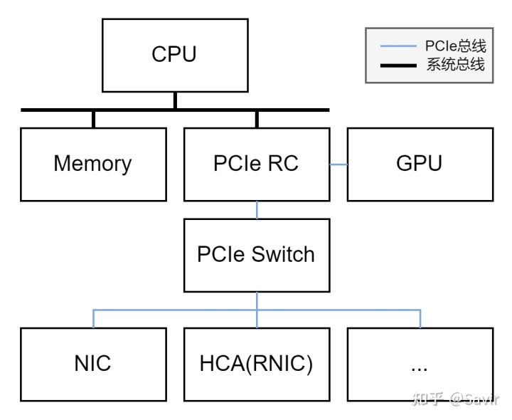

#### 优缺点

传统的 TCP/IP 软硬件架构及应用存在着网络传输和数据处理的延迟过大、存在多次数据拷贝和中断处理、复杂的 TCP/IP   协议处理等问题。RDMA(Remote Direct Memory   Access，远程直接内存访问)是一种为了解决网络传输中服务器端数据处理延迟而产生的技术。

RDMA  将用户应用中的数据直接传入服务器的存储区，通过网络将数据从一个系统快速传输到远程系统的存储器中，消除了传输过程中多次数据复制和文本交换的操作，降低了 CPU  的负载。RDMA技术的原理及其与TCP/IP架构的对比如下图所示。

[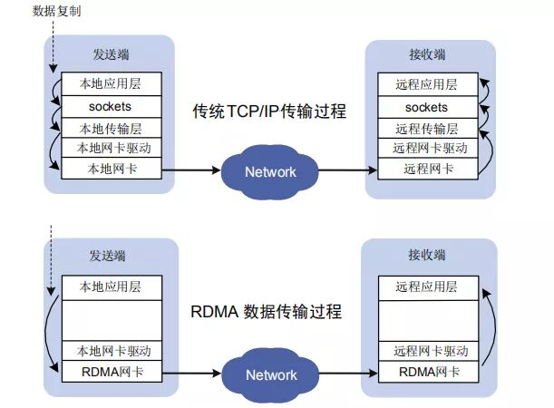](https://s3.51cto.com/oss/202103/07/3f700affd3a5452c14f19d45f86e83a3.jpg)


RDMA   技术实现了在网络传输过程中两个节点之间数据缓冲区数据的直接传递，在本节点可以直接将数据通过网络传送到远程节点的内存中，绕过操作系统内的多次内存拷贝，相比于传统的网络传输，RDMA  无需操作系统和 TCP/IP 协议的介入，可以轻易的实现超低延时的数据处理、超高吞吐量传输，不需要远程节点 CPU   等资源的介入，不必因为数据的处理和迁移耗费过多的资源。

RDMA（Remote Direct Memory Access）指的是远程直接内存访问，这是一种通过网络在两个应用程序之间搬运缓冲区里的数据的方法。

- Remote：数据通过网络与远程机器间进行数据传输。
- Direct：没有内核的参与，有关发送传输的所有内容都卸载到网卡上。 
- Memory：在用户空间虚拟内存与网卡直接进行数据传输不涉及到系统内核，没有额外的数据移动和复制。
- Access：send、receive、read、write、atomic 等操作。

RDMA 与传统的网络接口不同，因为它绕过了操作系统内核。这使得实现了 RDMA 的程序具有如下特点：

- 绝对的最低时延
- 最高的吞吐量
- 最小的 CPU 足迹 （也就是说，需要 CPU 参与的地方被最小化）

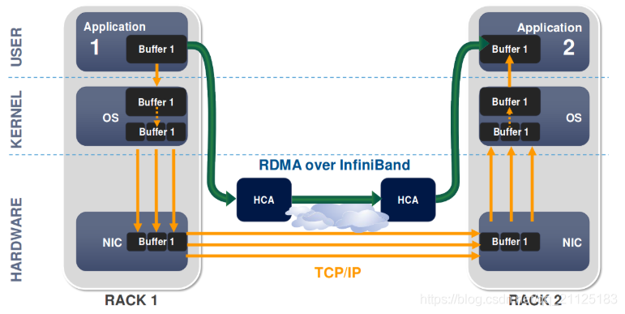

如上图，在传统模式下，两台服务器上的应用之间传输数据，过程是这样的：

- 首先要把数据从应用缓存拷贝到Kernel中的TCP协议栈缓存；
- 然后再拷贝到驱动层；
- 最后拷贝到网卡缓存。

数据发送方需要将数据从用户空间 Buffer 复制到内核空间的 Socket Buffer

数据发送方要在内核空间中添加数据包头，进行数据封装

数据从内核空间的 Socket Buffer 复制到 NIC Buffer 进行网络传输

数据接受方接收到从远程机器发送的数据包后，要将数据包从 NIC Buffer 中复制到内核空间的 Socket Buffer

经过一系列的多层网络协议进行数据包的解析工作，解析后的数据从内核空间的 Socket Buffer 被复制到用户空间 Buffer

这个时候再进行系统上下文切换，用户应用程序才被调用

### RDMA 技术有以下几个特点

- CPU Offload：无需CPU干预，应用程序可以访问远程主机内存而不消耗远程主机中的任何CPU。远程主机内存能够被读取而不需要远程主机上的进程（或CPU)参与。远程主机的CPU的缓存(cache)不会被访问的内存内容所填充
- Kernel Bypass：RDMA 提供一个专有的 Verbs interface 而不是传统的TCP/IP Socket interface。应用程序可以直接在用户态执行数据传输，不需要在内核态与用户态之间做上下文切换
- Zero Copy：每个应用程序都能直接访问集群中的设备的虚拟内存，这意味着应用程序能够直接执行数据传输，在不涉及到网络软件栈的情况下，数据能够被直接发送到缓冲区或者能够直接从缓冲区里接收，而不需要被复制到网络层。
- 消息基于事务(Message based transactions) - 数据被处理为离散消息而不是流，消除了应用程序将流切割为不同消息/事务的需求。
- 支持分散/聚合条目(Scatter/gather entries support) - RDMA原生态支持分散/聚合。也就是说，读取多个内存缓冲区然后作为一个流发出去或者接收一个流然后写入到多个内存缓冲区里去。

缺点：

- rdma设计本身是为了高性能低延时，这个目标使得rdma对网络有苛刻的要求，就是网络不丢包，否则性能下降会很大，这对底层网络硬件提出更大的挑战，同时也限制了rdma的网络规模；相比而言，tcp对于网络丢包抖动的容忍度就大很多。可以认为，如果应用需要追求一定规模内的极限性能，则考虑rdma，如果应用追求的是更好的连接保证和丢包容忍，那tcp更合适。
- RDMA是通过硬件实现高带宽低时延，对CPU的负载很小。代价是硬件的使用和管理较为复杂，应用接口是全新的。不能说某个场景不适合使用，只能说收益可能没有那么大。

下面是 RDMA 整体框架架构图，从图中可以看出，RDMA 提供了一系列 Verbs 接口，可在应用程序用户空间，操作RDMA硬件。RDMA绕过内核直接从用户空间访问RDMA 网卡。RNIC(RDMA 网卡，RNIC（NIC=Network Interface Card ，网络接口卡、网卡，RNIC即 RDMA Network Interface Card）中包括 Cached Page Table Entry，用来将虚拟页面映射到相应的物理页面。


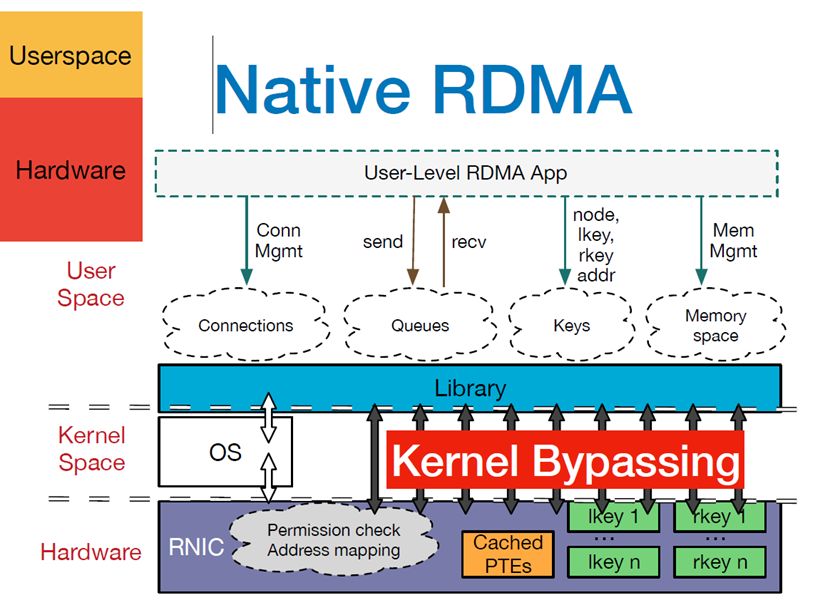

### 支持 RDMA 的网络协议 

RDMA 作为一种 host-offload，host-bypass 技术，使低延迟、高带宽的直接的内存到内存的数据通信成为了可能。目前支持 RDMA 的网络协议有： 

- InfiniBand（IB）：从一开始就支持 RDMA 的新一代网络协议。由于这是一种新的网络技术，因此需要支持该技术的网卡和交换机。 
- RDMA 过融合以太网（RoCE）：即 RDMA over Converged Ethernet，允许通过以太网执行 RDMA 的网络协议。这允许在标准以太网基础架构（交换机）上使用 RDMA，只不过网卡必须是支持 RoCE 的特殊的网卡。  
- 互联网广域 RDMA 协议（iWARP）：即 Internet Wide Area RDMA Protocol，其实也就是 RDMA over  TCP，允许通过 TCP 执行 RDMA  的网络协议。这允许在标准以太网基础架构（交换机）上使用RDMA，只不过网卡要求是支持iWARP（如果使用 CPU offload  的话）的网卡。否则，所有 iWARP 栈都可以在软件中实现，但是失去了大部分的 RDMA 性能优势。

**需要注意的是，上述几种协议都需要专门的硬件（网卡）支持**

[详谈RDMA技术原理和三种实现方式](https://www.51cto.com/article/648715.html)

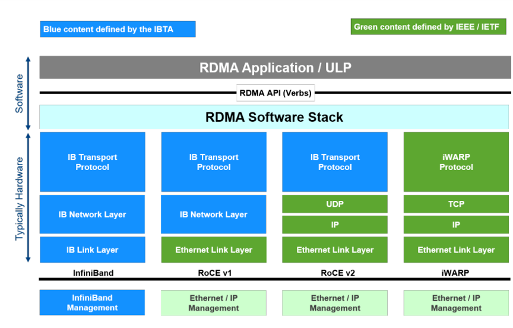

RoCE和iWARP，一个是基于无连接协议UDP，一个是基于面向连接的协议(如TCP)。RoCEv1只能局限在一个二层广播域内，而RoCEv2和iWARP都能够支持三层路由。相比RoCE，在大型组网的情况下，iWARP的大量TCP连接会占用大量的额内存资源，对系统规格要求更高。另外，RoCE支持组播，而iWARP还没有相关的标准定义。

#### RoCE适配器可以与其他适配器类型（例如iWARP）通信吗？

RoCE适配器只能与其他RoCE适配器通信，如果混合适配器类型配置的话，例如RoCE适配器与iWARP适配器组合，都可能会恢复为传统的TCP / IP连接。

[浅析RoCE网络技术](https://cloud.tencent.com/developer/article/1771431)

#### RoCE出现的背景

InfiniBand 架构获得了极好的性能，但是其不仅要求在服务器上安装专门的 InfiniBand 网卡，还需要专门的交换机硬件，成本十分昂贵。而在企业界大量部署的是以太网络，为了复用现有的以太网，同时获得 InfiniBand 强大的性能，IBTA 组织推出了 RoCE（RDMA over Converged Ethernet）。RoCE 支持在以太网上承载 IB 协议，实现 RDMA over Ethernet，这样一来，仅需要在服务器上安装支持 RoCE 的网卡，而在交换机和路由器仍然使用标准的以太网基础设施。

#### RoCE和IB网络层和链路层协议区别

RoCE协议存在RoCEv1 （RoCE）和RoCEv2 （RRoCE）两个版本，主要区别RoCEv1是基于以太网链路层（L2）实现的RDMA协议(交换机需要支持PFC等流控技术，在物理层保证可靠传输)，而RoCEv2是以太网TCP/IP协议中UDP层(L3)实现。

在以太链路层之上用IB网络层代替了TCP/IP网络层，所以不支持IP路由功能。而v2使用了UDP+IP作为网络层，使得数据包也可以被路由。RoCE可以被认为是IB的“低成本解决方案”，将IB的报文封装成以太网包进行收发。由于RoCE v2可以使用以太网的交换设备，所以现在在企业中应用也比较多，但是相同场景下相比IB性能要有一些损失。
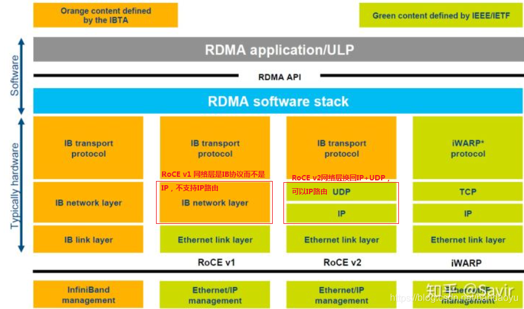

#### [RDMA 、InfiniBand、IBoE、RoCE、iWARP、IB卡、IB驱动的关系](https://blog.csdn.net/ljlfather/article/details/102930714)

1、RDMA 是一种技术（远程直接内存访问技术），如何实现这种技术呢？

2、实现这种技术你可以选择用 Infiniband 协议、也可以使用其他协议：roce、iwarp

支持Infiniband 协议 或 roce、iwarp 等RDMA协议的网卡，就叫RDMA网卡，当你在服务器上安装RDMA网卡之后，你还得安装RDMA驱动，才能使用RDMA网卡 。

在Infiniband/RoCE规范中，将RDMA网卡称为HCA，全称为Host Channel Adapter，即主机通道适配器；而在iWARP协议族中，将RDMA网卡称为RNIC，全称为RDMA enabled Network Interface Controller，即支持RDMA的网络接口控制器。

支持Infiniband 协议的网卡又称IB网卡，当你在服务器上安装了IB卡之后，你还得安装 IB驱动，才能使用 infiniband 。

3、如果你使用 Infiniband 协议，这个协议作为一个新一代网络协议。它必须依靠专门的硬件才能实现。(专用INC（网卡）—— IB卡+专用交换机===>专用网络）。

如果你使用roce、iwarp,需要专用网卡，但不需要专用网络（RDMA会转成以太网协议，继续用以太网传输）

https://link.zhihu.com/?target=https%3A//github.com/linux-rdma/)

## SEND & RECV

SEND & RECV 是双端操作，需要CPU的参与。

WR全称为Work Request，意为工作请求；WC全称Work Completion，意为工作完成。这两者其实是WQE和CQE在用户层的“映射”。因为APP是通过调用协议栈接口来完成RDMA通信的，WQE和CQE本身并不对用户可见，是驱动中的概念。用户真正通过API下发的是WR，收到的是WC。

用户通过API把WR放到WQ上面就成了WQE，WQE被网卡执行完后生产WC。

WR/WC和WQE/CQE是相同的概念在不同层次的实体，他们都是“任务书”和“任务报告”。

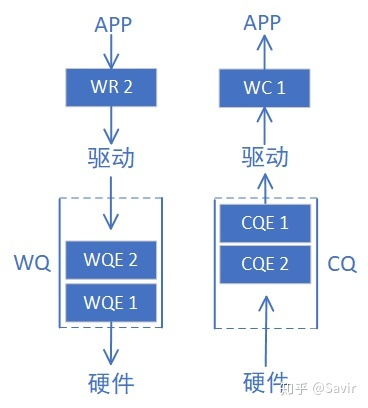

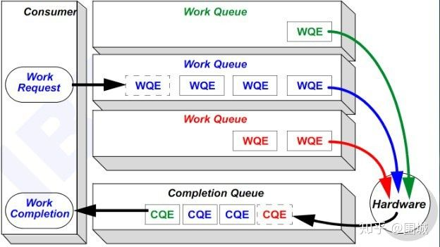

**RDMA一共支持三种队列，发送队列(SQ)和接收队列(RQ)，完成队列(CQ)。其中，SQ和RQ通常成对创建，被称为Queue Pairs(QP)。**

RDMA是基于消息的传输协议，数据传输都是异步操作。 RDMA操作其实很简单，可以理解为：

- Host提交工作请求(WR)到工作队列(WQ): 工作队列包括发送队列(SQ)和接收队列(RQ)。工作队列的每一个元素叫做WQE, 也就是用户下发的WR。
- Host从完成队列(CQ）中获取工作(WQ)完成(WC，用户层面): 完成队列里的每一个叫做CQE, 也就是WC。
- 具有RDMA引擎的硬件(hardware)就是一个队列元素处理器。 RDMA硬件不断地从工作队列(WQ)中去取工作请求(WR)来执行，执行完了就给完成队列(CQ)中放置工作完成(WC)。

从生产者-消费者的角度理解就是：

- Host生产WR, 把WR放到WQ中去
- RDMA硬件消费WR
- RDMA硬件生产WC, 把WC放到CQ中去
- Host消费WC

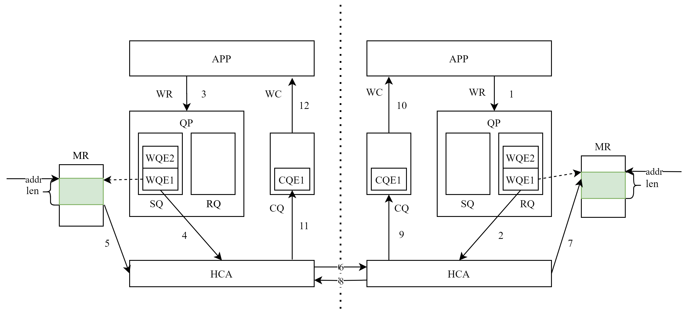


接收端APP以WQE的形式下发一次接收任务。

- 接收端硬件从RQ中拿到任务书，准备接收数据（发送端并不知道发送的数据会放到哪里，每次发送数据，接收端都要提前准备好接收Buffer）。
- 发送端APP以WQE的形式下发一次SEND任务。
- 发送端硬件从SQ中拿到任务书，从内存中拿到待发送数据，组装数据包。（步骤5）
- 发送端网卡将数据包通过物理链路发送给接收端网卡。
- 接收端收到数据，进行校验后回复ACK报文给发送端。
- 接收端硬件将数据放到WQE中指定的位置，然后生成“任务报告”CQE，放置到CQ中。
- 接收端APP取得任务完成信息。
- 发送端网卡收到ACK后，生成CQE，放置到CQ中。
- 发送端APP取得任务完成信息。

至此，通过WQ和CQ这两种媒介，两端软硬件共同完成了一次收发过程。

【注意】收发端的步骤未必是图中这个顺序，比如步骤⑧⑪⑫和步骤⑨⑩的先后顺序就是不一定的。

### WRITE 和 READ

#### WRITE

WRITE全称是RDMA WRITE操作，是本端主动写入远端内存的行为，除了准备阶段，远端CPU不需要参与，也不感知何时有数据写入、数据在何时接收完毕。所以这是一种单端操作。

本端在准备阶段通过数据交互，获取了对端某一片可用的内存的地址和“钥匙”，相当于获得了这片远端内存的读写权限。拿到权限之后，本端就可以像访问自己的内存一样直接对这一远端内存区域进行读写，这也是RDMA——远程直接地址访问的内涵所在。

WRITE/READ操作中的目的地址和钥匙是通过我们SEND-RECV操作来完成（拿到钥匙这个过程总归是要由远端内存的控制者CPU允许）。虽然准备工作比较复杂， 但是一旦完成准备工作，RDMA就可以发挥其优势，对大量数据进行读写。一旦远端的CPU把内存授权给本端使用，它便不再会参与数据收发的过程，这就解放了远端CPU，也降低了通信的时延。

【注意】本端是通过**虚拟地址**来读写远端内存的，上层应用可以非常方便的对其进行操作。实际的虚拟地址—物理地址的转换是由RDMA网卡完成的。

忽略准备阶段key和addr的获取过程，下面我们描述一次WRITE操作的流程，此后我们不再将本端称为“发送”和“接收”端，而是改为“请求”和“响应”端，这样对于描述WRITE和READ操作都更恰当一些，也不容易产生歧义。

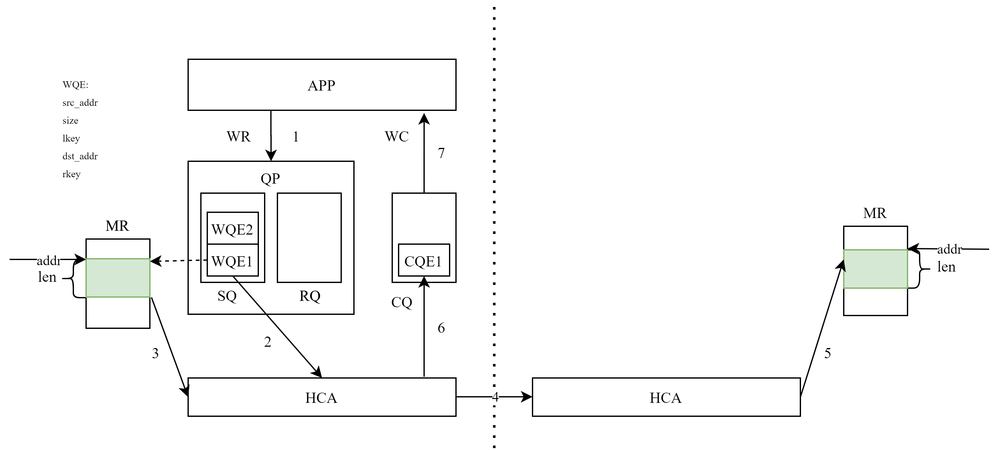

- 请求端APP以WQE（WR）的形式下发一次WRITE任务。
- 请求端硬件从SQ中取出WQE，解析信息。
- 请求端网卡根据WQE中的虚拟地址，转换得到物理地址，然后从内存中拿到待发送数据，组装数据包。
- 请求端网卡将数据包通过物理链路发送给响应端网卡。
- 响应端收到数据包，解析目的虚拟地址，转换成本地物理地址，解析数据，将数据放置到指定内存区域。
- 响应端回复ACK报文给请求端。
- 请求端网卡收到ACK后，生成CQE，放置到CQ中。
- 请求端APP取得任务完成信息。

#### READ

顾名思义，READ跟WRITE是相反的过程，是本端主动读取远端内存的行为。同WRITE一样，远端CPU不需要参与，也不感知数据在内存中被读取的过程。

获取key和虚拟地址的流程也跟WRITE没有区别，需要注意的是“读”这个动作所请求的数据，是在对端回复的报文中携带的。

下面描述一次READ操作的流程，注意跟WRITE只是方向和步骤顺序的差别。

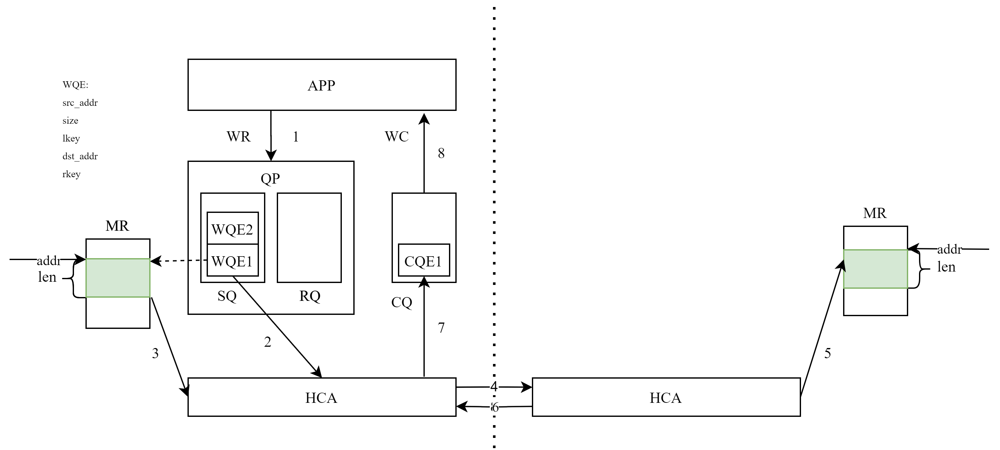

- 请求端APP以WQE的形式下发一次READ任务。
- 请求端硬件从SQ中取出WQE，解析信息。
- 请求端网卡将READ请求包通过物理链路发送给响应端网卡。
- 响应端收到数据包，解析目的虚拟地址，转换成本地物理地址，解析数据，从指定内存区域取出数据。
- 响应端硬件将数据组装成回复数据包发送到物理链路。
- 请求端硬件收到数据包，解析提取出数据后放到READ WQE指定的内存区域中。
- 请求端网卡生成CQE，放置到CQ中。
- 请求端APP取得任务完成信息。

### 连接

**IBA支持基于连接和数据报的服务**。对于基于连接的服务来说，每个QP都和另一个远端节点相关联。在这种情况下，QP Context中包含有远端节点的QP信息。在建立通信的过程中，两个节点会交换包括稍后用于通信的QP在内的对端信息。

QP Context（简称QPC）可以简单理解为是记录一个QP相关信息的表格。我们知道QP是两个队列，除了这两个队列之外，我们还需要把关于QP的信息记录到一张表里面，这些信息可能包括队列的深度，队列的编号等等。

#### 连接阶段获取的对端信息

本端是无法直接获得对端基本信息的，所以需要通过某些方式，让两端建立通信交换基本信息。有两种方式：TCP/IP和RDMA CM


以socket交换方式为例，双方约定号消息格式，将需要传递的信息通过socket交换就好了。图3.8中LID是本端RDMA适配器激活后分配的ID，在本端唯一，而PSN是本端发送到对端第一个数据包序号，可以随机指定。信息交换完毕后即可关闭上述连接。

至此，目的集合已经准备好，有raddr、rkey、rGID、rQPN，加r表示远端（对端）的意思。万事具备只欠东风。

#### 基于连接

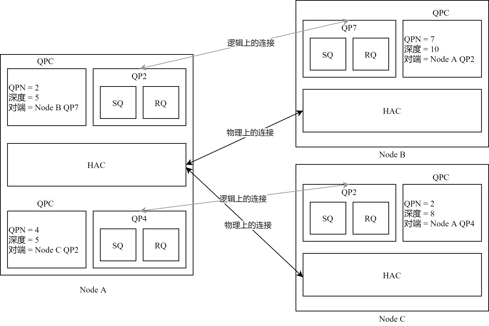

A、B和A、C节点的网卡在物理上是连接在一起的，A上面的QP2和B上面的QP7、A上面的QP4和B上面的QP2建立了逻辑上的连接，或者说“绑定到了一起”。在连接服务类型中的每个QP，都和唯一的另一个QP建立了连接，也就是说QP下发的每个WQE的目的地都是唯一的。拿上图来说，对于A的QP2下发的每个WQE，硬件都可以通过QPC得知其目的为B的QP7，就会把组装好的数据包发送给B，然后B会根据QP7下发的RQ WQE来存放数据；同理，对于A的QP4下发的每个WQE，A的硬件都知道应该把数据发给Node C的QP2。
**“连接”其实就是在QPC里面的一个记录而已。如果A的QP2想断开与B的QP7的“连接”然后与其他QP相“连接”，只需要修改QPC就可以了。**两个节点在建立连接的过程中，会交换稍后用于数据交互的QP Number，然后分别记录在QPC中。

#### 基于数据报

与连接相反，发端和收端间不需要“建立管道”的步骤，只要发端到收端物理上是可以到达的，那么我就可能从任何路径发给任意的收端节点。

“对于数据报服务来说，QP不会跟一个唯一的远端节点绑定，而是通过WQE来指定目的节点。和连接类型的服务一样，建立通信的过程也需要两端交换对端信息，但是数据报服务对于每个目的节点都需要执行一次这个交换过程。”

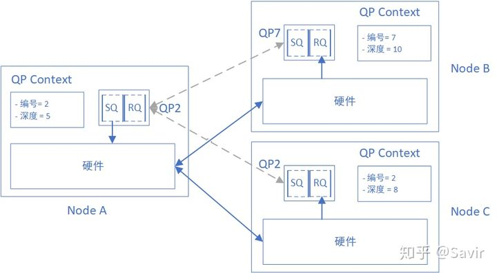

在数据报类型的QP的Context中，不包含对端信息，即每个QP不跟另一个QP绑定。QP下发给硬件的每个WQE都可能指向不同的目的地。

比如节点A的QP2下发的第一个WQE，指示给节点C的QP2发数据；而下一个WQE，可以指示硬件发给节点B的QP7。

**与连接服务类型一样，本端QP可以和哪个对端QP发送数据，是在准备阶段提前通过某些方式相互告知的**。这也是上文“数据报服务对于每个目的节点都需要执行一次这个交换过程”的含义。

#### 服务类型

上面介绍的两个维度两两组合就形成了IB的四种基本服务类型：

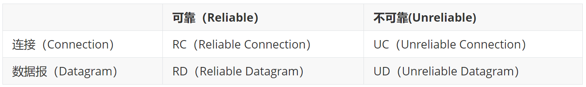

RC和UD是应用最多也是最基础的两种服务类型，我们可以将他们分别类比成TCP/IP协议栈传输层的TCP和UDP。

#### 资源消耗

RC用于对数据完整性和可靠性要求较高的场景，更TCP一样，因为需要各种机制来保证可靠，所以开销自然会大一些。另外由于RC服务类型和每个节点间需要各自维护一个QP，假设有N个节点需要相互通信，那么需要N * (N - 1)个QP，而QP和QPC本身是需要占用网卡资源或者内存的，当节点数很多时，存储资源消耗将会非常大。

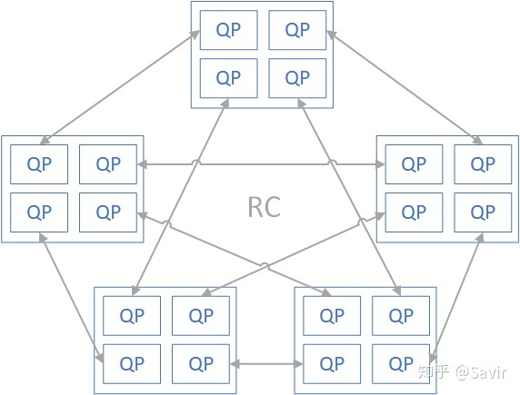


UD硬件开销小并且节省存储资源，比如N个节点需要相互通信，只需要创建**N**个QP就可以了，但是可靠性跟UDP一样没法保证。

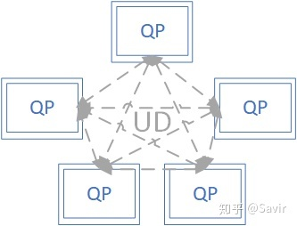


### 内存注册

MR全称为Memory Region，指的是由RDMA软件层在内存中规划出的一片区域，用于存放收发的数据。只能通过RDMA api 申请。

A节点想要通过IB协议向B节点的内存中写入一段数据，上层应用给本节点的RDMA网卡下发了一个WQE，WQE中包含了源内存地址、目的内存地址、数据长度和秘钥等信息，然后硬件会从内存中取出数据，组包发送到对端网卡。B节点的网卡收到数据后，解析到其中的目的内存地址，把数据写入到本节点的内存中。

APP在WQE中提供的地址是虚拟地址（Virtual Address，VA），经过MMU的转换才能得到真实的物理地址（Physical Address，PA），我们的RDMA网卡是如何得到PA从而去内存中拿到数据的呢？就算网卡知道上哪去取数据，如果用户恶意指定了一个非法的VA，那网卡岂不是有可能被“指使”去读写关键内存？

为了解决上面的问题，IB协议提出了MR的概念。

因为HCA访问的内存地址来自于用户，如果用户传入了一个非法的地址（比如系统内存或者其他进程使用的内存），HCA对其进行读写可能造成信息泄露或者内存覆盖。所以我们需要一种机制来确保HCA只能访问已被授权的、安全的内存地址。IB协议中，APP在为数据交互做准备的阶段，需要执行注册MR的动作。

而用户注册MR的动作会产生两个钥匙——L_KEY（Local Key）和R_KEY（Remote Key），说是钥匙，它们的实体其实就是一串序列而已。它们将分别用于保障对于本端和远端内存区域的访问权限。下面两张图分别是描述L_Key和R_Key的作用的示意图：

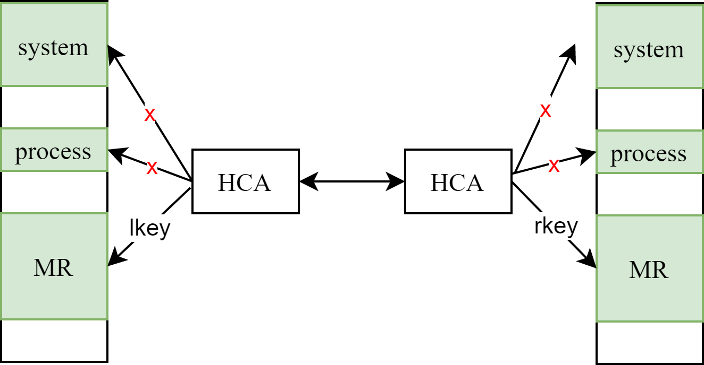

#### MR可以避免换页

因为物理内存是有限的，所以操作系统通过换页机制来暂时把某个进程不用的内存内容保存到硬盘中。当该进程需要使用时，再通过缺页中断把硬盘中的内容搬移回内存，这一过程几乎必然导致VA-PA的映射关系发生改变。

由于HCA经常会绕过CPU对用户提供的VA所指向的物理内存区域进行读写，如果前后的VA-PA映射关系发生改变，那么我们在前文提到的VA->PA映射表将失去意义，HCA将无法找到正确的物理地址。

为了防止换页所导致的VA-PA映射关系发生改变，注册MR时会"Pin"住这块内存（亦称“锁页”），即锁定VA-PA的映射关系。也就是说，MR这块内存区域会长期存在于物理内存中不被换页，直到完成通信之后，用户主动注销这片MR。

### Protection Domain

在RDMA中，PD像是一个容纳了各种资源（QP、MR等）的“容器”，将这些资源纳入自己的保护范围内，避免他们被未经授权的访问。一个节点中可以定义多个保护域，各个PD所容纳的资源彼此隔离，无法一起使用。

一个用户可能创建多个QP和多个MR，每个QP可能和不同的远端QP建立了连接，比如下图这样（灰色箭头表示QP间的连接关系），这是没有PD概念的RDMA资源。

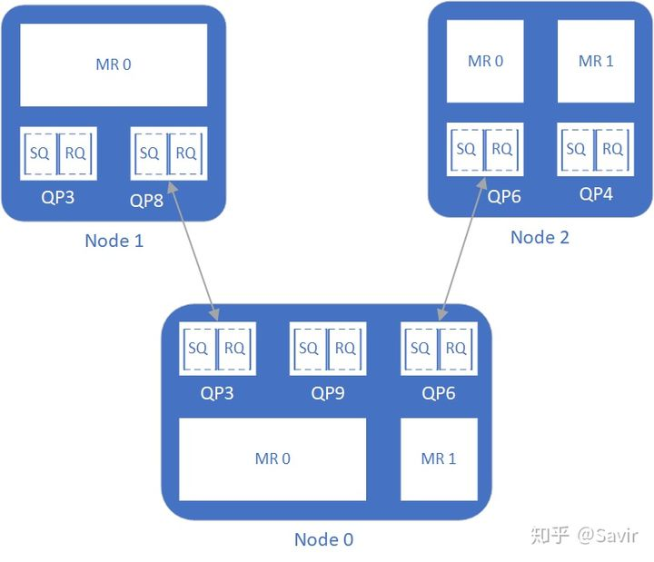

由于MR和QP之间并没有绑定关系，这就意味着一旦某个远端的QP与本端的一个QP建立了连接，具备了通信的条件，那么理论上远端节点只要知道VA和R_key（甚至可以靠不断的猜测直到得到一对有效的值），就可以访问本端节点某个MR的内容。

其实一般情况下，MR的虚拟地址VA和秘钥R_Key是很难猜到的，已经可以保证一定的安全性了。但是为了更好的保护内存中的数据，把各种资源的权限做进一步的隔离和划分，我们在又在每个节点中定义了PD，如下图所示：
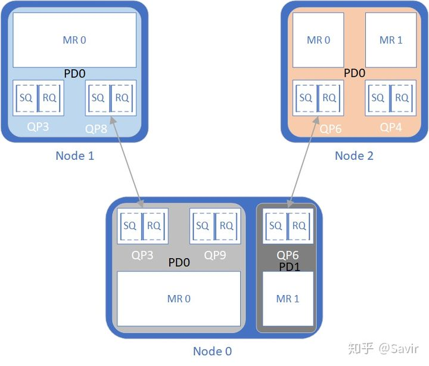

图中Node 0上有两个PD，将3个QP和2个MR分为了两组，此外Node 1和Node 2中各有一个PD包含了所有QP和MR。Node 0上的两个PD中的资源不可以一起使用，也就是说QP3和QP9不能访问MR1的数据，QP6也不可以访问MR0的数据。如果我们在数据收发时，指定硬件使用QP3和MR1，那么硬件校验他们不属于同一个PD后，会返回错误。

PD就像是一个容器，将一些RDMA资源（QP、MR、Address Handle，Memory Window）保护起来，彼此隔离，以提高安全性。

IB协议中规定：**每个节点都至少要有一个PD，每个QP都必须属于一个PD，每个MR也必须属于一个PD。**

一个**节点上划分多少个PD完全是由用户决定的**，**如果想提高安全性，那么对每个连接到远端节点的QP和供远端访问的MR都应该尽量通过划分PD做到隔离；如果不追求更高的安全性，那么创建一个PD，囊括所有的资源也是可以的**

【注意】**PD是本地概念，仅存在于节点内部**，对其他节点是不可见的；而MR是对本端和对端都可见的。

### Address Handle

在传统TCP-IP协议栈中，使用了家喻户晓的IP地址来标识网络层的每个节点。而IB协议中的这个标识被称为**GID（Global Identifier，全局ID）**，是一个128 bits的序列。

**AH全称为Address Handle**，直译为“地址句柄”。这里的地址，指的是**一组用于找到某个远端节点的信息的集合**，在IB协议中，地址指的是GID、端口号等等信息；而所谓句柄，我们可以理解为一个指向某个对象的指针。

对于UD来说，QP间没有连接关系，用户想发给谁，就在WQE中填好对端的地址信息就可以了。**用户不是直接把对端的地址信息填到WQE中的，而是提前准备了一个“地址薄”，每次通过一个索引来指定对端节点的地址信息，而这个索引就是AH**（对于每一个目的节点，本端都会创建一个对应的AH，而同一个AH可以被多个QP共同使用）。

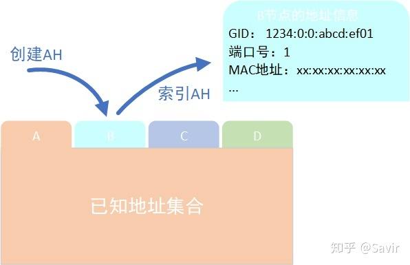

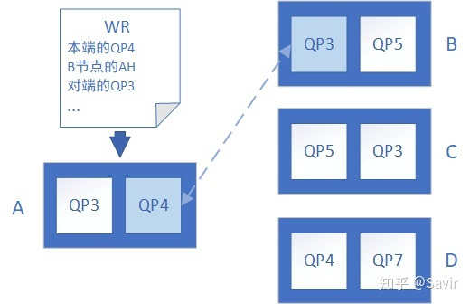

每次进行UD服务类型的通信之前，用户都需要先通过IB框架提供的接口，来为每一个可能的对端节点创建一个AH，然后这些AH会被驱动放到一个“安全”的区域，并返回一个索引（指针/句柄）给用户。用户真正下发WR（Work Request）时，就把这个索引传递进来就可以了。

上述过程如下图所示，A节点收到用户的这样一个任务——使用本端的QP4与B节点（通过AH指定）的QP3进行数据交换。

### QPC

QPC全称是Queue Pair Context，用于存储QP相关属性。驱动程序里面是有储存QP的软件属性的，既然我们可以在软件里储存QP的属性，为什么还要用使用QPC呢？因为QPC主要是给硬件看的，也会用来在软硬件之间同步QP的信息。

QP在硬件上的实体只是一段存储空间而已，硬件除了知道这段空间的起始地址和大小之外，对其他信息一无所知，甚至连QP服务类型都不知道。还有很多其他的重要信息，比如某个QP中包含了若干个WQE，硬件怎么知道有多少个，当前应该处理第几个呢？

所有上述的这些信息，软件是可以设计一定的数据结构并为其申请内存空间的，但是软件看到的都是虚拟地址，这些内存空间在物理上是离散的，硬件并不知道这些数据存放到了哪里。所以就需要软件通过操作系统提前申请好一大片连续的空间，即QPC来承载这些信息给硬件看。网卡及其配套的驱动程序提前约定好了QPC中都有哪些内容，这些内容分别占据多少空间，按照什么顺序存放。这样驱动和硬件就可以通过通过QPC这段空间来读写QP的状态等等信息。
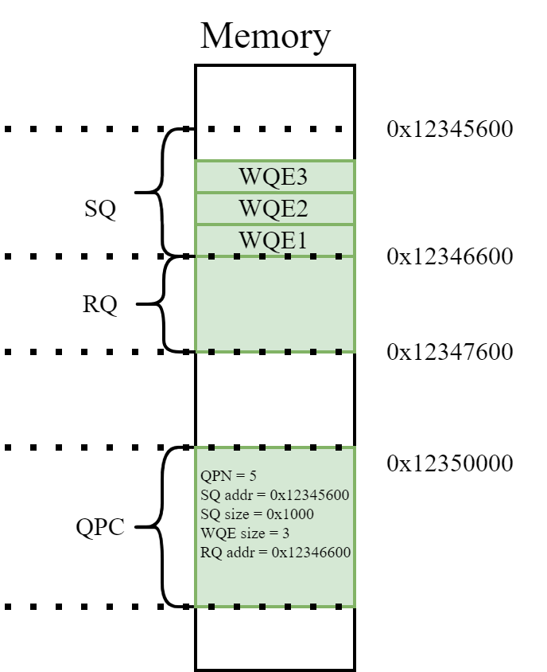


如上图所示，硬件其实只需要知道QPC的地址0x12350000就可以了，因为它可以解析QPC的内容，从而得知QP的位置，QP序号，QP大小等等信息。进而就能找到QP，知道应该取第几个WQE去处理。

### CQ & CQC

#### CQC

同QP一样，CQ只是一段存放CQE的队列内存空间。硬件除了知道首地址以外，对于这片区域可以说是一无所知。所以需要提前跟软件约定好格式，然后驱动将申请内存，并按照格式把CQ的基本信息填写到这片内存中供硬件读取，这片内存就是CQC。CQC中包含了CQ的容量大小，当前处理的CQE的序号等等信息。所以把QPC的图稍微修改一下，就能表示出CQC和CQ的关系。

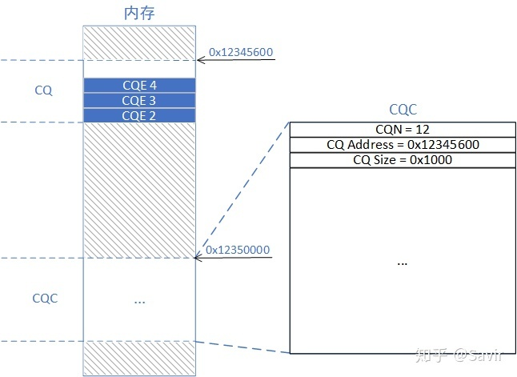

#### CQ

#### 可靠服务RC的CQE产生过程

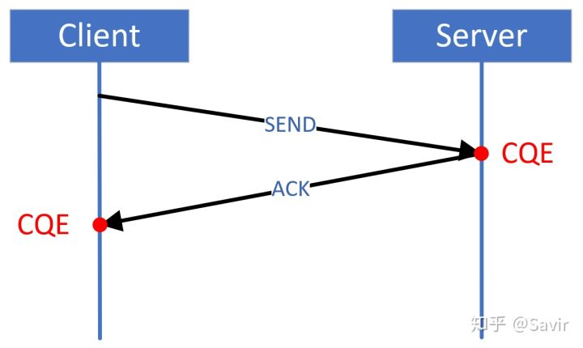

**SEND**

SEND操作需要硬件从内存中获取数据，然后组装成数据包通过物理链路发送到对端。对SEND来说，Client端产生CQE表示**对端已准确无误的收到数据**，对端硬件收到数据并校验之后，会回复ACK包给发送方。发送方收到这ACK之后才会产生CQE，从而告诉用户这个任务成功执行了。如图所示，左侧Client端在红点的位置产生了本次任务的CQE。

**RECV**

 RECV操作需要硬件将收到的数据放到用户WQE中指定的内存区域，完成校验和数据存放动作后，硬件就会产生CQE。如上图右侧Server端所示。

**READ**

READ和RECV有点像，Client端发起READ操作后，对端会回复我们想读取的数据，然后本端校验没问题后，会把数据放到WQE中指定的位置。完成上述动作后，本端会产生CQE。**READ同样是RDMA操作，对端用户不感知，自然也没有CQE产生**。这种情况上图变成了这样：

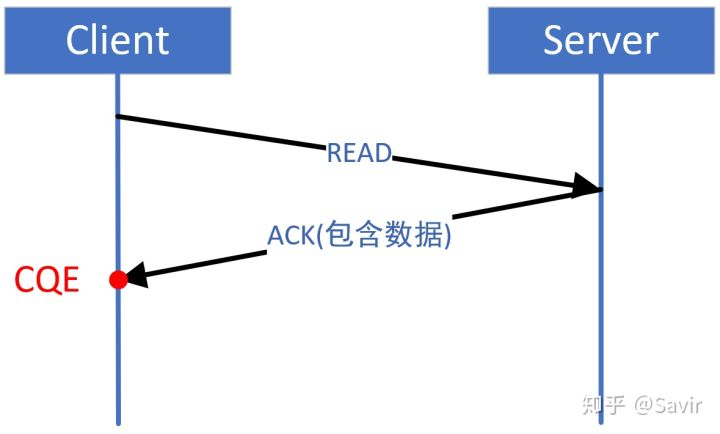

**WRITE**

对于Client端来说，WRITE操作和SEND操作是一样的，硬件会从内存中取出数据，并等待对端回复ACK后，才会产生CQE。差别在于，因为WRITE是RDMA操作，对端CPU不感知，自然用户也不感知，如下图所示

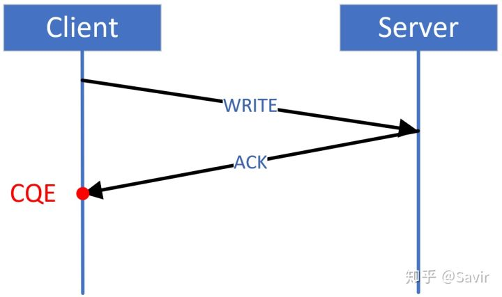

#### 不可靠服务UD的CQE产生过程

因为不可靠的服务类型没有重传和确认机制，所以产生CQE表示硬件**已经将对应WQE指定的数据发送出去了**。以前说过UD只支持SEND-RECV操作，不支持RDMA操作。所以对于UD服务的两端，CQE产生时机如下图所示。

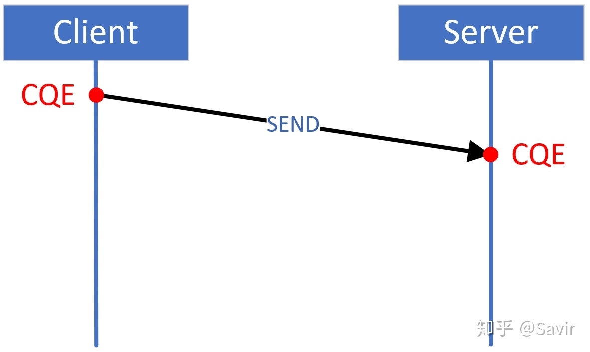


#### CQ的保序

**同一个WQ中的WQE，其对应的CQE间是保序的**

WQE1先放进去，就会先被完成产生CQE1

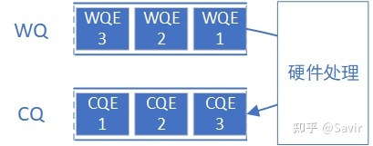

**不同WQ中的WQE，其对应的CQE间是不保序的**

有可能WQE1先被放到WQ1中，WQE2后被放到WQ2中，但CQE2先产生。这很正常，因为，WQ1与WQ2是不同的任务队列。

但是同一个任务队列里的CQE是保序的。如1,3,4和2,5,6。

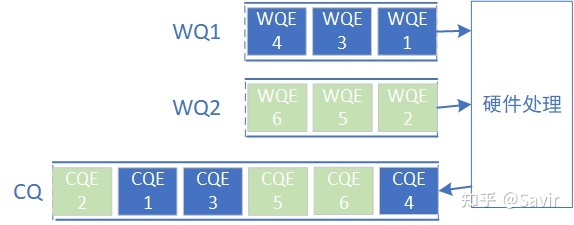

### 用户态与内核态的交互

Verbs API分为用户态和内核态，分别以`ibv_`和`ib_`作为前缀。RDMA技术的最大的优势就在于用户态可以绕过内核，直接控制硬件收发数据，减少了系统调用和内存拷贝次数，所以大部分的RDMA应用都是用户态应用，即使用以ibv_为前缀的用户态Verbs API。

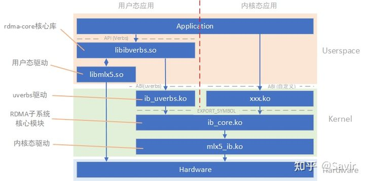


#### ABI

ABI（Application Binary Interface）是应用程序间的二进制接口，本文中RDMA软件栈架构图中的Userspace和Kernel之间的uverbs接口就是一种ABI。ABI定义了运行时的程序之间交流的格式，比如参数以什么形式传递（分别写到指定的寄存器/使用栈）、以什么格式传递以及返回值放到哪里等等。

### MW

是一种由用户申请的，用于让远端节点访问本端内存区域的RDMA资源。每个MW都会绑定（称为bind）在一个已经注册的MR上，但是它相比于MR可以提供更灵活的权限控制。MW可以粗略理解为是MR的子集，一个MR上可以划分出很多MW，每个MW都可以设置自己的权限。MW和MR的关系如下图所示

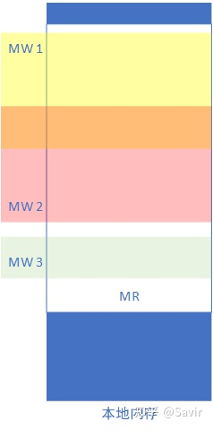

## Verbs 编程步骤


## RDMA 环境部署

### 安装 rdma 依赖包

```shell
# ubuntu系统
sudo apt install libibverbs-dev librdmacm-dev ibverbs-utils ibverbs-providers rdma-core opensm infiniband-diags -y
sudo apt install autoconf automake libtool libibumad-dev libpci-dev -y
sudo apt install perftest -y	#perftest

#rdma-core
sudo apt-get install build-essential cmake gcc libudev-dev libnl-3-dev libnl-route-3-dev ninja-build pkg-config valgrind python3-dev cython3 python3-docutils pandoc

# centos系统
sudo yum -y install libibverbs libibverbs-devel libibverbs-utils librdmacm librdmacm-devel librdmacm-utils elfutils-libelf-devel
sudo yum -y install cmake gcc libnl3-devel libudev-devel make pkgconfig valgrind-devel

#在 Ubuntu 中想安装一个软件包的一个特别指定的版本？你可以通过下面的方式来轻松地完成：
sudo apt install package_name=package_version
#你如何知道某个软件包有哪些可用的版本？可以使用这个命令：
apt list --all-versions package_name
dpkg -l package_name #建议使用这一个
```

### 查看动态库属于哪一个包的工具

```shell
sudo apt-get install apt-file
apt update # 初次使用需要执行该命令记录索引
sudo apt-file search libibverbs.so #查找动态库属于哪一个包，打印的结果，左边是包名
# $ sudo apt-file search libibverbs.so
# libibverbs-dev: /usr/lib/x86_64-linux-gnu/libibverbs.so
# libibverbs1: /usr/lib/x86_64-linux-gnu/libibverbs.so.1
# libibverbs1: /usr/lib/x86_64-linux-gnu/libibverbs.so.1.1.17.1
```

## 常用命令

```shell
ibstat # 查看端口信息
ibstatus # 查看状态，带宽，类似 ibstat
ibv_devinfo
ibv_devices # 查看设备
sudo iblinkinfo # 查看IB交换模块的所有端口的连接状态。此命令会将集群内所有的IB交换模块都进行列举。
sudo ibswitches # 显示拓扑中的 IB 交换机节点
sudo ibnodes # 显示拓扑中的 IB 节点
```

### 性能测试

```shell
# 读端测试
ib_read_bw  -a -F -c RC -d mlx5_0 -i 1
ib_read_bw  -a -F -c RC -d mlx5_0 -i 1 192.168.49.81

# 写端测试
ib_write_bw  -a -F -c RC -d mlx5_0 -i 1			
ib_write_bw  -a -F -c RC -d mlx5_0 -i 1 服务端ip			


ib_read_bw  -a -F -c RC -d ibp59s0 -i 1
```

### 查看 ib 端口

```shell
[root@node2 ~]# ibv_devinfo
hca_id:	mlx4_0
	transport:			InfiniBand (0)
	fw_ver:				2.35.5100
	node_guid:			248a:0703:005d:07f0
	sys_image_guid:			248a:0703:005d:07f3
	vendor_id:			0x02c9
	vendor_part_id:			4099
	hw_ver:				0x1
	board_id:			MT_1090120019
	phys_port_cnt:			2
		port:	1
			state:			PORT_ACTIVE (4)
			max_mtu:		4096 (5)
			active_mtu:		4096 (5)
			sm_lid:			4
			port_lid:		4
			port_lmc:		0x00
			link_layer:		InfiniBand
 
		port:	2
			state:			PORT_ACTIVE (4)
			max_mtu:		4096 (5)
			active_mtu:		4096 (5)
			sm_lid:			8
			port_lid:		12
			port_lmc:		0x00
			link_layer:		InfiniBand
 
 ------------------------------
phys_port_cnt: 2 说明含有两个端口可用，分别是 port 1 和 port 2
```

### 用lspci查看ib的带宽等硬件信息

```shell
lspci -v | grep -i mella
sudo lspci -vvs b3:00.0
```

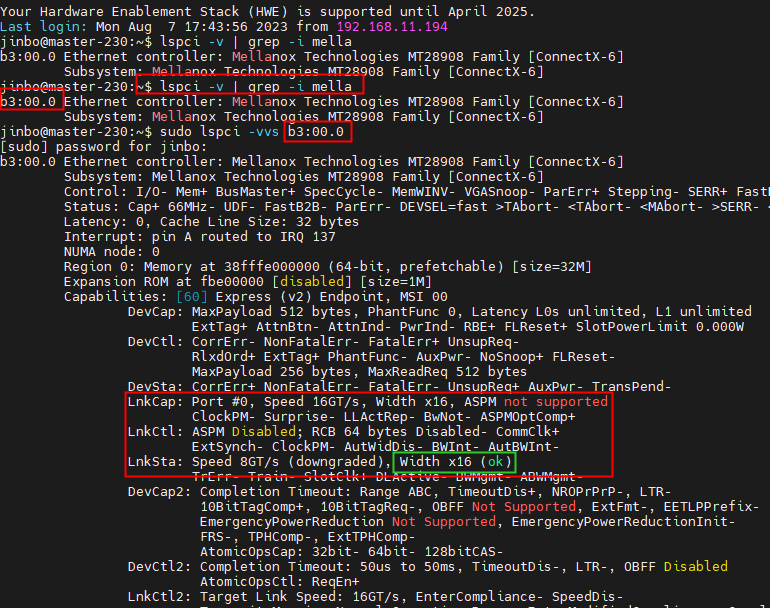

### 修改速率

```shell
ibportstate  1 1  disable
ibportstate  1 1 speed 2
mlxconfig -d /dev/mst/mt4119_pciconf0 set KEEP_IB_LINK_UP_P1=0
```

## 错误处理

### 常见错误码

```shell
IBV_WC_SUCCESS = 0,
IBV_WC_LOC_LEN_ERR, # 0x1
IBV_WC_LOC_QP_OP_ERR,
IBV_WC_LOC_EEC_OP_ERR,

IBV_WC_LOC_PROT_ERR,  # 0x4
#这种错误通常意味着用户对内存的操作权限不够，需要检测在ibv_post_recv和ibv_post_send时scatter/gather list 中传入的内存地址与长度是否正确，或者ibv_reg_mr操作是否成功。
# 还有一种情况是 Send 后 Poll 成功了，就把内存取消注册了，导致对端 Recv 这个内存区域时，无访问权限，也导致对端收到 0x1b 的错误。因此用户必须获取到CQE并确认其内容之后才能认为消息收发任务已经完成，单纯的确认CQE并不一定代表任务完成

IBV_WC_WR_FLUSH_ERR,  # 0x5
# 在flush的时候出现错误，通常是因为前一个操作出现了错误，接下来的一系列操作都会出现   

IBV_WC_MW_BIND_ERR,
IBV_WC_BAD_RESP_ERR,
IBV_WC_LOC_ACCESS_ERR,
IBV_WC_REM_INV_REQ_ERR, # 0x9
# 0x9 send/recv 不匹配可能导致该错误

IBV_WC_REM_ACCESS_ERR,    # 0xa = 10
# 无访问权限：远程内存访问越界或无效，远程权限问题

IBV_WC_REM_OP_ERR,  #  0xb = 11 
#远程操作错误:响应程序无法成功完成操作。可能的原因包括与响应方QP相关的错误导致响应方无法完成请求，或者接收队列中的WQE格式不正确。与RC QPs相关

IBV_WC_RETRY_EXC_ERR,   # 0xc = 12
# 一般地，对端清理了资源，而本端还在操作，就会导致 0xc 错误码
#机器翻译：超过传输重试计数器:尝试发送此邮件时，超过了本地传输超时重试计数器。这意味着远程端没有发送任何Ack或Nack。如果在发送第一条消息时发生这种情况，通常意味着连接属性是错误的，或者远程端不处于可以响应消息的状态。如果在发送第一条消息后出现这种情况，通常意味着远程QP不再可用。与RC QPs相关。

IBV_WC_RNR_RETRY_EXC_ERR, # 0xd = 13
# 这种错误一般是因为本地post数据过快。在infiniband传输数据过程中，接收端首选需要注册内存并ibv_post_recv将此内存放入receive queue中然后发送端才能发送数据，如果接受端来不及完成这些操作发送端就发送数据，就会出现上述错误。

IBV_WC_LOC_RDD_VIOL_ERR,
IBV_WC_REM_INV_RD_REQ_ERR,
IBV_WC_REM_ABORT_ERR,
IBV_WC_INV_EECN_ERR,
IBV_WC_INV_EEC_STATE_ERR,
IBV_WC_FATAL_ERR,
IBV_WC_RESP_TIMEOUT_ERR,
IBV_WC_GENERAL_ERR,
IBV_WC_TM_ERR,
IBV_WC_TM_RNDV_INCOMPLETE,
```

### PORT DOWN问题

大概率是光纤没插好

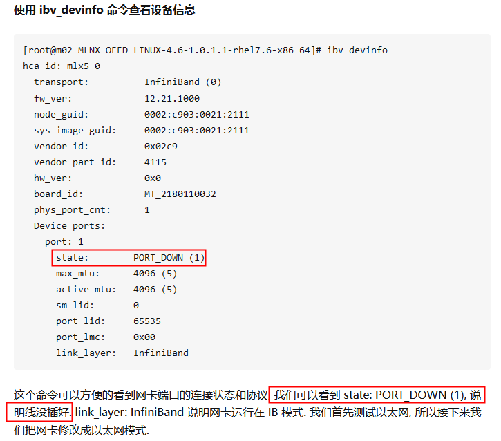

### PORT INIT 问题

```shell
sudo systemctl restart opensm
# 或者命令
sudo systemctl start opensmd 
sudo systemctl enable opensmd
```

### 解除锁定的内存最大为 64MB 的限制

ubuntu 18.04默认锁住内存的限制是64MB，用 `ulimit -a` 查看限制。

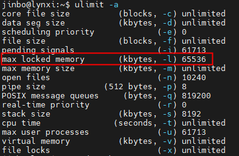

要解除该限制，使用以下方法

```shell
$ vim /etc/security/limits.conf
# 在文件的最后添加：
your_user_name                hard    memlock         unlimited  # set to "unlimited"
your_user_name                soft    memlock         unlimited  # set to "unlimited"
# 其中 your_user_name 换成你的账户名，或者用 * 代替，表示针对所有账户有效。

# 最后重启使设置有效
```

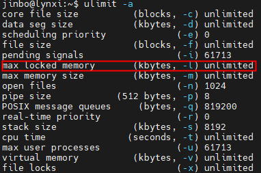

如果上述配置依旧不能解决问题，再修改文件`/etc/systemd/user.conf`，更改字段`DefaultLimitMEMLOCK`的值

```shell
$ vim /etc/systemd/user.conf
```

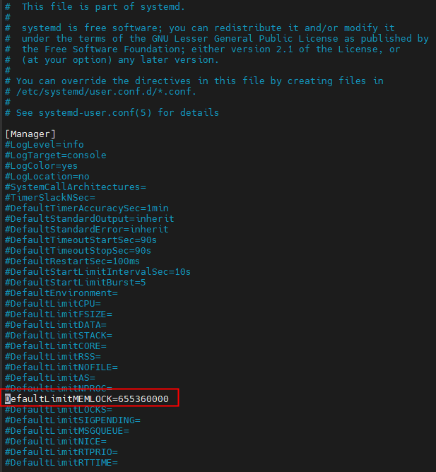

