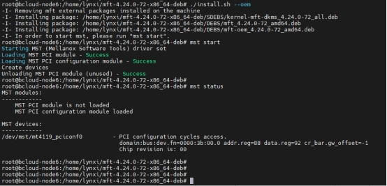
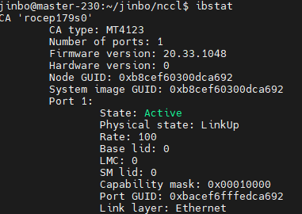
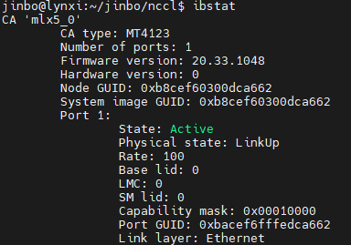

# ROCE

## RoCE与InfiniBand 切换

RoCEv2 是基于无连接协议的UDP 协议，相比面向连接的 TCP 协议，UDP 协议更加快速、占用 CPU 资源更少，但其不像 TCP 协议那样有滑动窗口、确认应答等机制来实现可靠传输，一旦出现丢包，RoCEv2 需要依靠上层应用检查到了再做重传，会大大降低 RDMA 的传输效率。

###  [RoCE和InfiniBand比较](https://support.huawei.com/enterprise/zh/doc/EDOC1100203347)

|        | InfiniBand | iWARP             | RoCE             |
| ------ | ---------- | ----------------- | ---------------- |
| 性能   | 最好       | 稍差（受TCP影响） | 与InfiniBand相当 |
| 成本   | 高         | 中                | 低               |
| 稳定性 | 好         | 差                | 较好             |
| 交换机 | IB交换机   | 以太网交换机      | 以太网交换机     |

由上表可知，三种RDMA网络的特点总结如下：

- InfiniBand：设计之初就考虑了 RDMA，从硬件级别保证可靠传输，提供更高的带宽和更低的时延。但是成本高，需要支持IB网卡和交换机。
- RoCE：基于 Ethernet 做 RDMA，消耗的资源比 iWARP 少，支持的特性比 iWARP 多。可以使用普通的以太网交换机，但是需要支持RoCE的网卡。
- iWARP：基于TCP的RDMA网络，利用TCP达到可靠传输。相比RoCE，在大型组网的情况下，iWARP的大量TCP连接会占用大量的内存资源，对系统规格要求更高。可以使用普通的以太网交换机，但是需要支持iWARP的网卡。

### 分布式存储中常用的网络协议

- IB：常用于DPC场景中的存储前端网络。
- RoCE：常用于存储后端网络。
- TCP/IP：常用于业务网络。

###  MFT 工具

#### 安装 MFT 工具

需要安装MFT工具 [Firmware for ConnectX®-5 VPI (nvidia.com)](https://network.nvidia.com/support/firmware/connectx5ib/)，完了后就可以做切换步骤：

1. mst start
2. mst status 获取 mst devices
3. 查询当前端口信息：mlxconfig -d /dev/mst/<mst_dev> q | grep LINK_TYPE_
4. 切换模式：mlxconfig -d /dev/mst/<mst_dev> set LINK_TYPE_P1=2

 

#### 查看当前端口等信息

```shell
mlxconfig -d /dev/mst/<mst_dev> q | grep LINK_TYPE_

# LINK_TYPE_P1 IB(1) 
# 1是指ib模式，2是指eth模式
```


#### 修改网卡的工作模式为RoCE：

```shell
mlxconfig -d /dev/mst/<mst_dev> set LINK_TYPE_P1=2
```

修改网卡的工作模式为RoCE,，网卡已修改为Ethernet模式，修改后需要重启机器后才生效，因为修改的是下一次（Next boot）的网卡启动的工作模式。

```shell
 $ mlxconfig -d /dev/mst/mt4119_pciconf0 set LINK_TYPE_P1=2
Device #1:
----------
Device type:    ConnectX5
Name:           N/A
Description:    N/A
Device:         /dev/mst/mt4119_pciconf0

Configurations:                                      Next Boot       New
LINK_TYPE_P1                                IB(1)           ETH(2)

Apply new Configuration? (y/n) [n] : y
Applying... Done!
-I- Please reboot machine to load new configurations.
root@bcloud-node6:/home/lynxi/mft-4.24.0-72-x86_64-deb#
```

## PORT_DOWN 

两台服务器直连，一台Link layer是InfiniBand，另一台是Ethernet，那么用ibstat查看，两台的状态就会都是PORT_DOWN (1)，如果当两台都切换为Ethernet，就会同时变为Active






 
