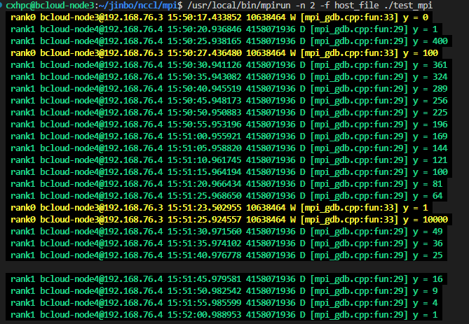

# MPI

## 基本概念

MPI 主要有两大类库：OpenMPI和MPICH（包括MPICH、MPICH2、MPICH3、IntelMPI、MVAPICH、MVAPICH2）

### 编译器

1、OpenMPI、MPICH、MVAPICH等编译命令（不分编译器）：
mpicc、mpicxx、mpif77、mpif90、mpic++、mpiCC

2、IntelMPI 编译命令（分编译器）：
GNU编译器：mpicc、mpicxx、mpifc（mpigcc、mpigcc、mpif77、mpif90）
Intel编译器：mpiicc、mpiicpc、mpiifort

### mpich、mvapich、openmpi 之间的区别

MPICH、MVAPICH和OpenMPI是三种常见的开源MPI（消息传递接口）实现。虽然它们都用于在并行计算中进行进程间通信，但它们有一些区别：

1. MPICH：
   - MPICH是最早的开源MPI实现之一。
   - 它专注于提供基本的MPI功能，以便在不同系统上可移植。
   - MPICH支持多种网络设备和传输层协议。
2. MVAPICH：
   - MVAPICH是基于MPICH的MPI实现的分支，专注于使用InfiniBand和RoCE等高性能网络设备。
   - 它针对高性能计算（HPC）环境进行了优化，提供了与高速网络和互连技术紧密集成的特性。
   - MVAPICH支持基于RDMA（远程直接内存访问）的通信，并提供了一些性能优化和扩展功能。
3. OpenMPI：
   - OpenMPI是一个综合性的开源MPI实现，旨在提供高性能、灵活性和可扩展性。
   - 它整合了来自不同MPI实现的各种特性，并提供了许多高级功能，如动态进程管理和线程支持。
   - OpenMPI支持多种网络设备和传输层协议，包括InfiniBand、Ethernet和Myrinet等。

总的来说，MPICH是一种基本的、可移植的MPI实现，MVAPICH专注于高性能网络设备的优化，而OpenMPI提供了丰富的功能和灵活性。

## 资料

[mpi 教程](https://mpitutorial.com/)

官网：

- MPI standard : [http://www.mpi-forum.org/docs/docs.html](

- [MPICH](https://www.mpich.org/)

- [MPICH on InfiniBand](http://mvapich.cse.ohio-state.edu/)
- [Open MPI ](http://www.open-mpi.org/)

资料

- [mpich 用户文档](https://www.mpich.org/documentation/manpages/)

- [mvapich 用户文档](http://mvapich.cse.ohio-state.edu/support/) Full User Guide MVAPICH2 2.3.7 ([HTML](http://mvapich.cse.ohio-state.edu/static/media/mvapich/mvapich2-userguide.html), [PDF](http://mvapich.cse.ohio-state.edu/static/media/mvapich/mvapich2-userguide.pdf))        

- [openmpi 用户文档](https://docs.open-mpi.org/en/v5.0.x/man-openmpi/index.html)

- [INVAID 里的 MVAPICH 资料](https://developer.nvidia.com/mvapich)

### 使用 gdb 调试 mpi 程序

```C
int gNodeNum;  // 节点总数
int gRank;     // 当前的节点

int fun(int x)
{
    int y = x * x;
    if (gRank)
    {
        logd("y = %d", y);
    }
    else
    {
        logw("y = %d", y);
    }

    return y;
}

int main(int argc, char **argv)
{
    int ret = 0;

    std::string ip = get_local_ip();
    // printf("ip = %s\n", ip.c_str());
    if (std::string("192.168.76.3") == ip)
    {
        gRank = 0;
    }
    else
    {
        gRank = 1;
    }
    gNodeNum = 2;

    fun(gRank);

    printf("\n");
    int flag = 10;
    while (flag)   // 为了有时间 gdb attach 上来，方便调试，让程序在该处停留一段时间
    {
        sleep(10);
        fun(flag--);
    }

    fun(100 + gRank);

    return 0;
}
```

首先运行程序 ./test_mpi

```shell
$ /usr/local/bin/mpirun -n 2 -f host_file ./test_mpi
```

根据名字获得进程的id

```shell
$ ~/jinbo/nccl$ pgrep test_mpi
999754
```

使用 gdb 调试

```shell
$ sudo gdb attach 999754
```

```shell
Attaching to process 999754
Reading symbols from /home/cxhpc/jinbo/nccl/mpi/test_mpi...
Reading symbols from /lib/x86_64-linux-gnu/libstdc++.so.6...
(No debugging symbols found in /lib/x86_64-linux-gnu/libstdc++.so.6)
Reading symbols from /lib/x86_64-linux-gnu/libgcc_s.so.1...
(No debugging symbols found in /lib/x86_64-linux-gnu/libgcc_s.so.1)
Reading symbols from /lib/x86_64-linux-gnu/libc.so.6...
Reading symbols from /usr/lib/debug/.build-id/18/78e6b475720c7c51969e69ab2d276fae6d1dee.debug...
Reading symbols from /lib/x86_64-linux-gnu/libm.so.6...
Reading symbols from /usr/lib/debug/.build-id/fe/91b4090ea04c1559ff71dd9290062776618891.debug...
Reading symbols from /lib64/ld-linux-x86-64.so.2...
Reading symbols from /usr/lib/debug/.build-id/45/87364908de169dec62ffa538170118c1c3a078.debug...
0x00007f9900c521b4 in __GI___clock_nanosleep (clock_id=<optimized out>, clock_id@entry=0, flags=flags@entry=0, req=req@entry=0x7ffe77c95ff0, rem=rem@entry=0x7ffe77c95ff0)
    at ../sysdeps/unix/sysv/linux/clock_nanosleep.c:78
78      ../sysdeps/unix/sysv/linux/clock_nanosleep.c: No such file or directory.
(gdb) n
80      in ../sysdeps/unix/sysv/linux/clock_nanosleep.c
(gdb) n
117     in ../sysdeps/unix/sysv/linux/clock_nanosleep.c
(gdb) n
__GI___nanosleep (requested_time=requested_time@entry=0x7ffe77c95ff0, remaining=remaining@entry=0x7ffe77c95ff0) at nanosleep.c:28
28      nanosleep.c: No such file or directory.
(gdb) n
__sleep (seconds=0) at ../sysdeps/posix/sleep.c:62
62      ../sysdeps/posix/sleep.c: No such file or directory.
(gdb) n
64      in ../sysdeps/posix/sleep.c
(gdb) n
main (argc=1, argv=0x7ffe77c961a8) at mpi_gdb.cpp:62
62              fun(flag--);
(gdb) p flag=1 ############## 通过修改 flag 让程序退出 while 循环
$1 = 1
(gdb) n
59          while (flag)
(gdb) n
65          fun(100 + gRank);
(gdb) n
83          return 0;
(gdb) n
43          std::string ip = get_local_ip();
(gdb) n
84      }
(gdb) n
__libc_start_main (main=0x5566462d8eee <main(int, char**)>, argc=1, argv=0x7ffe77c961a8, init=<optimized out>, fini=<optimized out>, rtld_fini=<optimized out>,
    stack_end=0x7ffe77c96198) at ../csu/libc-start.c:342
342     ../csu/libc-start.c: No such file or directory.
(gdb) q
A debugging session is active.

        Inferior 1 [process 999754] will be detached.

Quit anyway? (y or n) y
Detaching from program: /home/cxhpc/jinbo/nccl/mpi/test_mpi, process 999754
[Inferior 1 (process 999754) detached]

```

终端输出结果如下图，可以看到服务器76.3打印y=100的时候，gdb attach 上去，此时另一台服务器 76.4 依旧在运行，因为是在服务器 76.3 上 attach  进程的，导致该进程被 gdb 接管。现在修改服务器 76.3 上的进程的 flag=1，使其退出 while 循环，可以看到76.3 上的进程比76.4上的进程先执行完。

