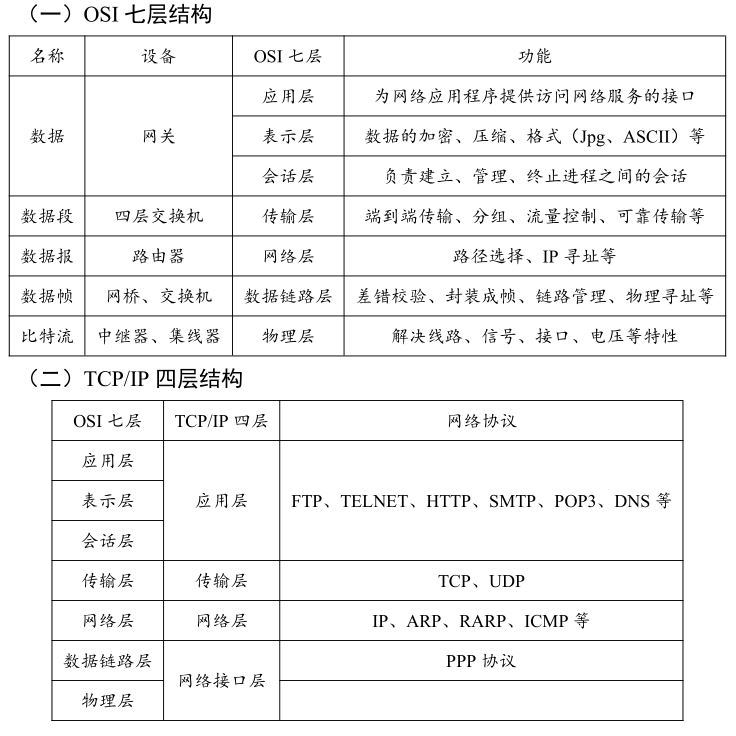
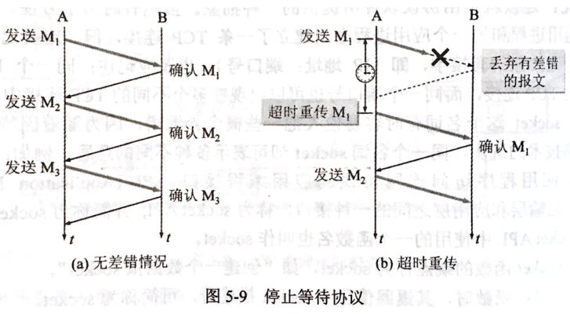
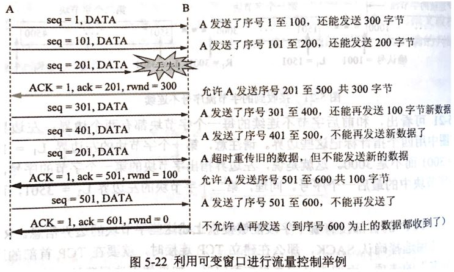
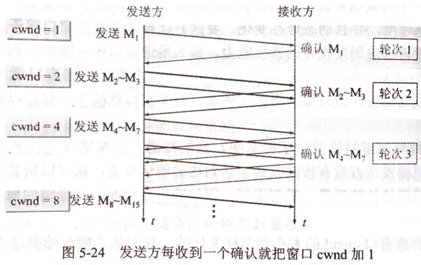
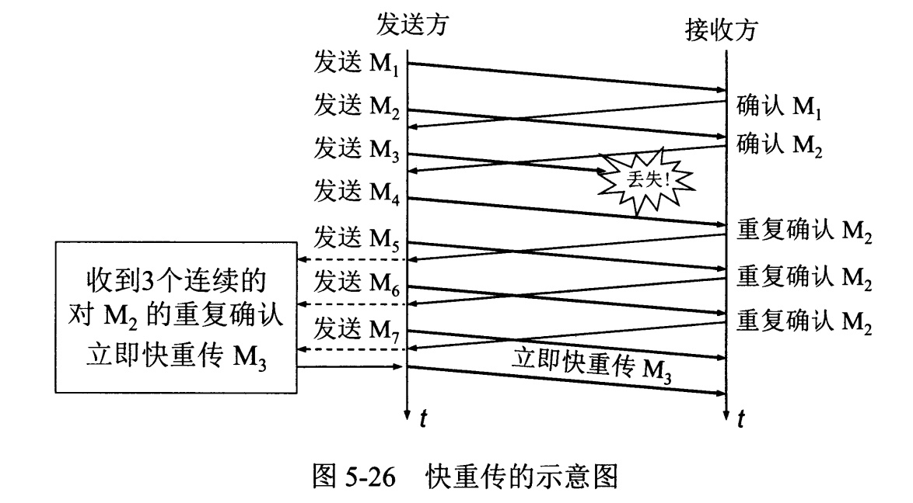
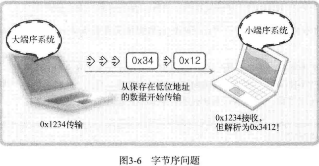
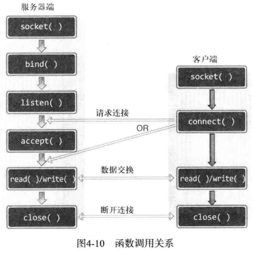
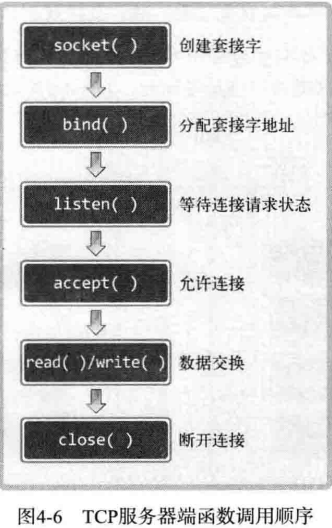

## 七层网络概念




协议就是计算机与计算机之间通信时事先达成的一种“约定”。这种“约定”使不同厂商的设备、不同的 CPU 以及不同的操作系统组成的计算机之间，只要遵循相同的协议就能够实现通信。

### 应用层

**应用层(application-layer）的任务是通过应用进程间的交互来完成特定网络应用。应用层协议定义的是应用进程（进程：主机中正在运行的程序）间的通信和交互的规则**。对于不同的网络应用需要不同的应用层协议。在互联网中应用层协议很多，如**域名系统DNS**，支持万维网应用的 **HTTP协议**，支持电子邮件的 **SMTP协议**等等。我们把应用层交互的数据单元称为报文。

#### 域名系统DNS

DNS作为可以将域名和IP地址相互映射的一个分布式数据库，能够使人更方便的访问互联网，而不用去记住能够被机器直接读取的IP数串。

简单的说就是域名是网址，比如百度`www.baidu.com`，其IP为`183.232.231.172`(命令 `Ping www.baidu.com`)。

DNS的作用就是将百度网址解析为 IP 地址。

计算机内置的DNS服务器并不知道网络上所有域名的IP地址信息。若该DNS服务器无法解析，则会询问其他DNS服务器，并提供给用户。

##### [为什么 DNS 用 UDP 而不是 TCP](https://blog.csdn.net/jason_cuijiahui/article/details/86712107)

DNS在进行区域传输的时候使用TCP，普通的查询使用UDP。

衡量计算机通信快慢的指标是“响应时间”，即从用户发出通信指令（输入网址敲回车键）开始，到用户看到完整页面为止，所流逝的时间。响应时间（ResponseTime）以浏览器为例，这个响应时间大体分为三部分：

```shell
响应时间= DNS域名解析时间 + TCP 连接建立时间 + HTTP交易时间
```

如果让响应时间尽可能小，只有让等号右侧的三者尽可能小。

- TCP连接是固定的三次握手，所以很难有进一步缩小的空间。
- HTTP交易，基于Request / Response，也很难有提升的空间。

所以，只能让DNS域名解析的时间越小越好。

域名解析采用TCP传输，则域名解析时间为：`DNS域名解析时间 = TCP连接时间 + DNS交易时间`

采用[UDP](https://so.csdn.net/so/search?q=UDP&spm=1001.2101.3001.7020)传输，则域名解析时间为：`DNS域名解析时间 = DNS交易时间`

很显然，采用UDP传输，DNS域名解析时间更小。

不就多一次TCP连接时间吗？NO! 在很多时候，用户在访问一些冷门网站时，由于DNS服务器没有冷门网站的解析缓存，需要到域名根服务器、一级域名服务器、二级域名服务器迭代查询，直到查询到冷门网站的权威服务器，这中间可能涉及到多次的查询。如果使用TCP传输，多几次查询，就多几次TCP连接时间，这多出来的时间不容小觑。

#### HTTP协议与HTTPS协议的区别

- HTTP：超文本传输协议。HTTPS：安全套接字层超文本传输协议HTTP+SSL

   SSL (Secure Sockets Layer [安全套接层](https://baike.baidu.com/item/安全套接层))，及其继任者传输层安全（Transport Layer Security，TLS）是为网络通信提供安全及数据完整性的一种安全协议。TLS 与 SSL 在传输层与应用层之间对网络连接进行加密 

- HTTP 的URL 以http:// 开头，而HTTPS 的URL 以https:// 开头

- HTTP 是不安全的，而 HTTPS 是安全的（没有绝对的安全，只有相对的安全）

- HTTP：无法加密（客户端和服务器端传递的是明文的消息）。HTTPS：对传输的数据进行加密（将明文进行加密后再在客户端和服务器之前进行传递）

  HTTPS 采用非对称加密和对称加密两种加密方式来保证传输信息的安全性：

  非对称加密：用公钥和私钥来加解密。对称加密：加密解密都用同一套秘钥

- 在OSI 网络模型中，**HTTP工作于应用层，而 HTTPS 的安全传输机制工作在传输层**

- HTTP采用80端口，而HTTPS采用443端口

- HTTPS需要申请证书

**HTTPS 优点：** 

- HTTPS 传输数据过程中使用密钥进行加密，所以安全性更高；
- HTTPS 协议可以认证用户和服务器，确保数据发送到正确的用户和服务器；

**HTTPS 缺点：** 

- HTTPS 握手阶段延时较高：由于在进行 HTTP 会话之前还需要进行 SSL 握手，因此 HTTPS 协议握手阶段延时增加；
- HTTPS 部署成本高：一方面 HTTPS 协议需要使用证书来验证自身的安全性，所以需要购买 CA 证书；另一方面由于采用 HTTPS 协议需要进行加解密的计算，占用 CPU 资源较多，需要的服务器配置更高。

#### TELNET 远程登录

TELNET 利用 TCP 的一条连接，通过这一行连接向主机发送文字命令并在主机上执行。本地用户好像直接与远端主机内部的 shell 相连似的，直接在本地进行操作。

仿真终端所用的界面控制信息通过选项功能发送出去，TELNET 的选项功能有行模式和透明模式两种模式的设置。

- 行模式，每从键盘输入一个换行，就将该行的数据作为一整行发送给远程服务端；
- 透明模式，每输入一个字符就要发送给远程服务端。

远程登录主要使用 TELNET 和 SSH 两种协议。

其中 SSH 是加密的远程登录系统。TELNET 中登录时无需输入密码就可以发送，容易造成通信窃听和非法入侵的危险，使用 SSH 可以加密通信内容。

#### FTP 文件传输

FTP 通过远程登录到对方的计算机后才能进行相应的操作，有一种 FTP 服务器是允许任何人访问的，称之为匿名服务器（anonymous ftp）。

**FTP 的文件传输是通过两条 TCP 连接来实现的，一条用来控制，一条用于数据（文件）的传输。**

用于控制的 TCP 主要是用来登录用户名和密码的验证、发送文件的名称、发送方式的设置等，用于传输数据的 TCP 专门用来传输数据（端口号 21）。

**通常传输数据的 TCP 连接是按照与控制用的 TCP 连接相反的方向建立。**

用于控制的 TCP 在用户要求断开之前会一直保持连接状态，绝大多数 FTP 服务器都会对长时间没有任何新命令输入的用户强制断开连接。

#### 邮件协议

早期的电子邮件 ，发送端主机与接收端主机之间通过 TCP 进行连接，发件人将邮件存储到硬盘，然后发送到接收端主机硬盘，如果对方计算机电源关闭或者无法联网，会导致发送失败，即使不断重发。

改进方法：在发送端和接收端之间引入一个一直开机且联网的邮件服务器，发送和接收端通过邮件服务器进行收发邮件，接收端通过 POP3（Post Office Protocol，端口号 110） 协议从邮件服务器接收邮件。

简单邮件传输协议 SMTP（Simple Mail Transfer Protocol，端口号 25）是发送电子邮件的协议，它支持的是发送端主机的行为，而不是根据接收端的请求发送邮件。此时需要引入 POP3 协议。

交互式邮件存取协议 IMAP（Internet Mail Access Protocol，端口 143） 协议和 POP3 协议类似，也是接收电子邮件的协议。在 POP 中邮件由客户端进行管理，在 IMAP 中邮件由服务器管理。

POP 在每个设备各自的客户端进行管理，无法同步。IMAP 在服务器上对未读/已读信息进行分类管理，因此，即使在不同设备上打开邮箱，也能保持同步。

若一封邮件含 10 个附件，只需要下载第 5 个，POP 不得不下载所有的附件，而 IMAP 却可以只下载其中的第 5 个。

[应用层常见的协议及对应的端口号](https://blog.csdn.net/mellymengyan/article/details/51115521)

[C/S 和 B/C](https://blog.csdn.net/lrtcsdn/article/details/81035908)

### 运输层

**运输层(transport layer)的主要任务是为两台主机进程之间的通信提供通用的数据传输服务**。应用进程利用该服务传送应用层报文。“通用的”是指并不针对某一个特定的网络应用，而是多种应用可以使用同一个运输层服务。由于一台主机可同时运行多个线程，因此运输层有复用和分用的功能。所谓复用就是指多个应用层进程可同时使用下面运输层的服务，分用和复用相反，是运输层把收到的信息分别交付上面应用层中的相应进程。

#### 运输层主要使用的两种协议TCP/UDP

- **传输控制协议** TCP（Transmisson Control Protocol）--提供**面向连接**的，**可靠的**数据传输服务。

- **用户数据报协议** UDP（User Datagram Protocol）--**提供无连接**的，尽最大努力的数据传输服务（**不保证数据传输的可靠性**）。

两个计算机进程间的通信不仅仅要知道对方的 IP 地址（为了找到对方的计算机），也要知道对方的端口号（找到对方计算机中的应用进程）

**TCP报文段的首部格式**


1. **源端口和目的端口**。各占2字节（1字节等于8位）。
2. **序号**: TCP每个一个字节都是按顺序编号。
3. **确认号**: 期望收到对方下一个报文段的第一个数据字节的序号。
4. **数据偏移**：占用4字节，指出TCP报文段数据处距离TCP报文段的起始处有多远。
5. **保留**: 占用6位，留以后使用。
6. **紧急URG**: URG=1表示紧急，告诉系统有紧急数据，应尽快传送，而不按原来的排队顺序来传送。
7. **确认ACK**：只有ACK=1时，确认号ack才有效。
8. **推送PSH**: 希望立即能够收到对方的响应。
9. **复位RST**：RST=1,表明连接中出现严重差错，必须释放连接，然后再重新建立运输连接。
10. **同步SYN**: 在连接建立时用来同步序号。当SYN=1，ACK=0时表示连接请求报文段。如果对方同意则响应报文中使用SYN=1,ACK=1.
11. **终止FIN**: 用来释放连接。
12. **窗口**：占两字节，窗口值作为接收方让发送方设置发送窗口的依据。
13. **校验和**：占2字节，校验和字段校验的范围包括首部和数据两部分。
14. **紧急指针**：占两字节，只有URG=1时才有意义，紧急指针指出紧急数据的末尾在报文段中的位置。
15. **选项**：长度可变，最长40字节。

**UDP报文段首部格式**


- **源端口**: 源端口号，在需要对方回信时选用，不需要时可用全0.
- **目的端口**: 目的端口号，在终点交付报文时必须使用
- **长度**: UDP用户数据报的长度，其最小值是8字节(仅有头部)。
- **校验和**: 检测UDP用户数据报在传输中是否有错。有错就丢弃。

#### TCP与UDP的区别

- TCP**面向连接**的，**可靠的**数据传输服务；UDP面向**无连接的**，尽最大努力的数据传输服务，**不保证数据传输的可靠性**
- **TCP面向字节流，UDP面向报文**
  - 应用进程交给 UDP 多长的报文， UDP 就照样发送，一次发送一个报文
  - TCP 在发送时采取的方式完全不同：TCP 根据对方给出的窗口值和当前网络拥塞的程度来决定一个报文段应该包含多少个字节。如果报文太长，TCP会将其拆分再发送，如果报文太短，TCP会等待积累足够多的字节后再构成报文段发送出去
- TCP数据传输慢，UDP数据传输快
- TCP有**拥塞控制**，UDP没有拥塞控制，因此网络出现拥塞不会使源主机的发送速率降低（对实时应用很有效，如直播，实时视频会议等）
- TCP 只能是一对一的通信（TCP连接的端点是套接字socket），而 UDP 支持一对一、一对多、多对一和多对多的通信
- TCP 的首部开销大，有 20 个字节，比 UDP 的 8 个字节的首部要长。
- TCP提供可靠**全双功**的通信服务。UDP是半双功，只能单向传播。

**TCP与UDP的区别很大一部分来自于流控制。也就是说 TCP 的生命在于流控制。**

【注意】

TCP面向字节流中的“流”（Stream）指的是流入进程或从进程流出的字节序列。“面向字节流”的含义是：虽然应用程序和 TCP 的交互是一次一个数据块（大小不等），但 TCP 把应用程序交下来的数据仅仅看成是一连串的无结构的字节流。

另外TCP 提供全双工通信。TCP 允许通信双方的应用进程在任何时候都能发送数据。TCP 连接的两端都设有发送缓存和接收缓存，用来临时存放双方通信的数据；

套接字 socket = (IP地址：端口号)

TCP 连接定义为 {socket1, socket2} = { (IP1: port1), (IP2: port2) }

#### TCP与UDP的适用场景

- TCP 适用于效率要求相对低，但对准确性要求相对高的场景。因为传输中需要对数据确认、重发、排序等操作，相比之下效率没有UDP高。TCP 适用于电子邮件（SMTP）、远程终端接入（TELNET）、万维网（HTTP）、文件传送（FTP）
- UDP 适用于效率要求相对高，对准确性要求相对低的场景。如视频直播、QQ语音电话等即时通讯、广播通信。开销小（因为提供可靠的、面向连接的运输服务，会多很多开销比如确认、流量控制、计时器、连接管理等），也适用于简单文件传送（TFTP）、路由选择协议（RIP）、域名系统（DNS）等

魔兽世界用 TCP，英雄联盟、射击类对延迟要求特别高用 UDP，实际上英雄联盟是 TCP 和 UDP 混合使用的，比如创建房间用 TCP，团战中的伤害计算用 UDP。

**如果收发数据量小但需要频繁连接时，UDP 比 TCP 更高效。**

传递压缩文件时要用TCP，因为只要丢失一部分，压缩文件就很难解压了。

#### 为什么视频直播网站和迅雷适用UDP？

TCP协议需要通过三次握手确保数据正确送达，但在保证数据正确送达的同时，也因为出错时的数据重传、拥塞时的慢启动等因素导致效率降低，延迟增加。

UDP协议不存在三次握手，所以可以避免数据重传过程，可以提高数据包传输效率，降低延迟，但会有丢包现象存在。即接收的UDP数据不一定是完整的。

对于视频应用，视频编码算法可以容许一定程度的数据差错，所以UDP更为适合。这一方面通过编码算法保证了存在丢包状态下的视频观看体验，另一方面可以获得高效传输低延迟。

#### TCP与UDP对应的协议

**TCP对应的协议**

 - **FTP(21)**：定义了**文件传输协议**，使用21端口。常说某某计算机开了FTP服务便是启动了文件传输服务。下载文件，上传主页，都要用到FTP服务。
 - **ssh(22)**: 专为**远程登录会话**和其他网络服务提供安全性的协议
 - **Telnet(23)**：(远程登陆协议)它是一种用于**远程登陆**的端口，用户可以以自己的身份远程连接到计算机上，通过这种端口可以提供一种基于DOS模式下的通信服务。如以前的BBS是-纯字符界面的，支持BBS的服务器将23端口打开，对外提供服务。
 - **SMTP(25)**：定义了**简单邮件传送协议**，现在很多邮件服务器都用的是这个协议，用于发送邮件。如常见的免费邮件服务中用的就是这个邮件服务端口，所以在电子邮件设置-中常看到有这么SMTP端口设置这个栏，服务器开放的是25号端口。
 - **POP3(110)**：它是和SMTP对应，POP3用于**接收邮件**。通常情况下，POP3协议所用的是110端口。也是说，只要你有相应的使用POP3协议的程序（例如Fo-xmail或Outlook），就可以不以Web方式登陆进邮箱界面，直接用邮件程序就可以收到邮件（如是163邮箱就没有必要先进入网易网站，再进入自己的邮-箱来收信）。
 - **HTTP(80)协议**：是从Web服务器传输超文本到本地浏览器的传送协议。

**UDP对应的协议**

- **DNS(53)**：用于域名解析服务，将域名地址转换为IP地址。DNS用的是53号端口。
- **RIP(520)**:路由信息协议，端口520
- **SNMP(161)**：简单网络管理协议，使用161号端口，是用来管理网络设备的。由于网络设备很多，无连接的服务就体现出其优势。
- **TFTP(69)(Trival File Transfer Protocal)**，简单文件传输协议，该协议在熟知端口69上使用UDP服务。

#### TCP与UDP的数据边界的理解

《TCP/IP网络编程》P109

TCP 数据传输中不存在数据边界，这表示「数据传输过程中调用 I/O 函数的次数不具有任何意义」

相反，UDP 是具有数据边界的协议，传输中调用 I/O 函数的次数非常重要。因此，输入函数的调用次数和输出函数的调用次数完全一致，这样才能保证接收全部已经发送的数据。

UDP是面向报文的，一次发送的报文，必须一次接受，不可分多次。

而TCP为了保证传输的安全，会把数据分组，分多次接受，没有接收到，还会超时重传。

### 网络层

**网络层(network layer)负责地址管理与路由选择。** 在发送数据时，网络层把运输层产生的报文段或用户数据报封装成分组和包进行传送。在 TCP/IP 体系结构中，由于网络层使用 **IP 协议**，因此分组也叫 **IP 数据报** ，简称 **数据报**。

网络层向上只提供简单灵活的、无连接的、尽最大努力交付的数据报服务。网络层不提供服务质量的承诺，也即是说，所传送的分组可能出错、丢失、重复和失序，当然也不保证分组交付的时限。如果进程之间的通信被要求为可靠的，就么就由运输层负责（包括差错处理、流量控制等）。

这里要注意：**不要把运输层的“用户数据报 UDP ”和网络层的“ IP 数据报”弄混**。另外，无论是哪一层的数据单元，都可笼统地用“分组”来表示。

网络层的另一个任务就是选择合适的路由，使源主机运输层所传下来的分组，能通过网络层中的路由器找到目的主机。

这里强调指出，网络层中的“网络”二字已经不是我们通常谈到的具体网络，而是指计算机网络体系结构模型中第三层的名称.

互联网是由大量的异构（heterogeneous）网络通过路由器（router）相互连接起来的。互联网使用的网络层协议是无连接的网际协议（Intert Prococol）和许多路由选择协议，因此互联网的网络层也叫做**网际层**或**IP层**。

#### IP地址的分类

- A类地址：以0开头， 第一个字节范围：0~126（1.0.0.0 - 126.255.255.255）；(00000000 和 01111111 是保留地址)
- B类地址：以10开头， 第一个字节范围：128~191（128.0.0.0 - 191.255.255.255）；
- C类地址：以110开头， 第一个字节范围：192~223（192.0.0.0 - 223.255.255.255）；
- D类1110
- E类1111

10.0.0.0—10.255.255.255， 172.16.0.0—172.31.255.255， 192.168.0.0—192.168.255.255。（Internet上保留地址用于内部）IP地址与子网掩码相与得到网络号

[IPv4编址；A类、B类、C类、D类、E类IP地址](https://blog.csdn.net/qq_22238021/article/details/80480687)

**IPv6 特点**

IPv6 地址长度为 128 位，地址空间扩大了 2 的 96 次方倍（128-32）。

IPv6的128位地址通常写成8组，每组为四个 十六进制数 的形式。比如：`AD80:0000:0000:0000:ABAA:0000:00C2:0002` 是一个合法的IPv6地址。

#### 地址解析协议 ARP

网络层使用的是 IP 地址，但在实际网络的链路上传送数据帧时，最终还是得使用该网络的硬件地址（MAC地址）。地址解析协议 ARP 解决这个问题的方法是在主机 ARP 高速缓存中存放一个从 IP 地址到硬件地址的映射表，并且这个映射表还动态更新。（由于网络上经常会有主机加入或撤走）

**反向地址转换协议 RARP **
反向地址转换协议（RARP）是局域网的物理机器从网关服务器的 ARP 表或者缓
存上根据 MAC 地址请求 IP 地址的协议，其功能与地址解析协议相反。

###  数据链路层

**数据链路层(data link layer)通常简称为链路层。两台主机之间的数据传输，总是在一段一段的链路上传送的，这就需要使用专门的链路层的协议。** 在两个相邻节点之间传送数据时，**数据链路层将网络层交下来的 IP 数据报组装成帧**，在两个相邻节点间的链路上传送帧。每一帧包括数据和必要的控制信息（如同步信息，地址信息，差错控制等）。

在接收数据时，控制信息使接收端能够知道一个帧从哪个比特开始和到哪个比特结束。这样，数据链路层在收到一个帧后，就可从中提出数据部分，上交给网络层。
控制信息还使接收端能够检测到所收到的帧中有无差错。如果发现差错，数据链路层就简单地丢弃这个出了差错的帧，以避免继续在网络中传送下去白白浪费网络资源。如果需要改正数据在链路层传输时出现差错（这就是说，数据链路层不仅要检错，而且还要纠错），那么就要采用可靠性传输协议来纠正出现的差错。这种方法会使链路层的协议复杂些。

### 物理层

在物理层上所传送的数据单位是比特。
**物理层(physical layer)的作用是实现相邻计算机节点之间比特流的透明传送，尽可能屏蔽掉具体传输介质和物理设备的差异。** 使其上面的数据链路层不必考虑网络的具体传输介质是什么。“透明传送比特流”表示经实际电路传送后的比特流没有发生变化，对传送的比特流来说，这个电路好像是看不见的。

在互联网使用的各种协议中最重要和最著名的就是 TCP/IP 两个协议。现在人们经常提到的TCP/IP并不一定单指TCP和IP这两个具体的协议，而往往表示互联网所使用的整个TCP/IP协议族。

## 了解交换机、路由器、网关的概念，并知道各自的用途

两者简介：

 - **路由器**是具有多个输入输出端口的专用计算机，**工作在网络层**，**其任务是连接不同的网络并完成路由转发**。当源主机向目标主机发送数据报时，路由器先检查源主机与目标主机是否连接在一个网络上。如果源主机和目标主机在一个网络上则直接交付而无需通过路由器。但如果源主机和目标主机不在同一个网络上，则路由器转发表指出路由将数据报转发给下一个路由器，即间接交付。路由器隔离了广播域。

 - **交换机**：是多个端口的**网桥**，工**作在数据链路层**，**将两个或多个以太网连接起来成为更大的以太网。它能将网络分成小的冲突域，为每个工作站提供更高的带宽**。其原理是，检测从以太端口来的数据帧的源和目的地的MAC地址，然后与系统内部的动态查找表进行比较。若数据帧的MAC地址不在查找表中，则将该地址加入查找表中，并将数据帧发送给相应的端口。

区别：

 - **路由器**：工作在网络层，是能够连接不同的广域网形成更大的广域网。连接的是异构网络。根据IP地址转发。
 - **交换机**：工作在数据链路层，是将以太网连接形成更大的以太网，同一个网络。根据MAC地址进行转发。
 - **网关(Gateway)**又称网间连接器、协议转换器。网关在网络层以上实现网络互连，是最复杂的网络互连设备，**仅用于两个高层协议不同的网络互连**。网关既可以用于广域网互连，也可以用于局域网互连。 网关是一种充当转换重任的计算机系统或设备。使用在不同的通信协议、数据格式或语言，甚至体系结构完全不同的两种系统之间，网关是一个翻译器。

网卡：使计算机联网的设备（任何一台计算机连接网络都需要网卡）

## 运输层重要知识点

### 可靠传输的工作原理

#### **停止等待协议**



停止等待即每发送一个分组就停止发送，等待对方的确认。

**一、无差错情况**

图5-9 (a)

如果收到对方的确认，就继续发送下一个

**二、出现差错**

图5-9 (b)

- B 确实没有收到 A 发送的 M1；
- B 接收 M1 时检测出了差错，就丢弃 M1，其它的什么都不做（不通知 A 收到差错的分组）

如果没有收到对方的确认，就超时重传（每发送完一个分组设置一个超时计时器，如果在超时计时器到期之前收到对方的确认，就撤销已设置的超时计时器）

**三、确认丢失和确认迟到**


**确认丢失**

B 收到 A 发送的 M1，向 A 发送确认，但确认丢失，A在设置的超时重传时间内没有收到确认，但无法知道是自己发送的分组出错、丢失还是 B 发送的确认丢失，此时 A 只能超时重传。

假设 B 又收到了 A 重传的 M1，这时应采取两个行动：

- 丢弃重复的 M1，不向上交付
- 向 A 发送确认

**确认迟到**

A 收到重复的确认，丢弃；B 收到重复的 M1，丢弃并重传确认。

像上述的可靠传输协议常称为**自动重传请求 ARQ**(Automatic Repeat reQuest)

#### 连续ARQ协议


停止等待协议的优点是简单但缺点是信道利用率太低。

连续 ARQ 规定，发送方每收到一个确认，就把发送窗口向前滑动一个分组的位置；接收方一般都采用**累积确认**的方式，就是说接收方不必对接收到的每一个分组发送确认，而是在收到几个分组后，**对按序到达的最后一个分组发送确认**，这就表明前面的分组都已经收到了。

累积确认的优点是，容易实现，即使确认丢失也不必重传；缺点是不能向发送方反映出接收方已经正确收到的所有分组的信息。

**回退 N(Go-back-N)**

假设发送方发送了前 5 个分组，而中间的第三个分组丢失了。这时候接收方只能对前两个分组发出确认。发送方无法知道后面三个分组的下落，而只好把后面的三个分组都再重传一次。这就叫回退 N，表示需要再退回来重传已发送过的 N 个分组。可见当通信线路质量不好时，连续 ARQ 协议会带来负面的影响。

【简单总结】**TCP如何保证可靠传输**

数据到达接收方，接收方需要发出一个确认应答，表示已经收到该数据段，并且确认序号会说明了它下一次需要接收的数据序列号。如果发送迟迟未收到确认应答，那么可能是发送的数据丢失，也可能是确认应答丢失，这时发送方会自动超时重传(ARQ 协议)。

考虑到传输效率，TCP会利用窗口控制来提高传输速度，此时使用连续 ARQ 协议。

如果把窗口设置很大，发送端连续发送大量的数据，可能会造成网络的拥堵（吞吐量有限），甚至造成网络的瘫痪。TCP 为了防止这种情况需要进行拥塞控制。 

### 滑动窗口

- TCP 利用滑动窗口实现流量控制。
- 滑动窗口（Sliding window）是一种流量控制技术。早期的网络通信中，通信双方不会考虑网络的拥挤情况直接发送数据。由于大家不知道网络拥塞状况，同时发送数据，导致中间节点阻塞掉包，谁也发不了数据，所 以就有了滑动窗口机制来解决此问题。
- TCP 中采用滑动窗口来进行传输控制，滑动窗口的大小意味着接收方还有多大的缓冲区可以用于接收数据。发送方可以通过滑动窗口的大小来确定应该发送多少字节的数据。当滑动窗口为 0 时，发送方一般不能再发送数据报，但有两种情况除外，一种情况是可以发送紧急数据，例如，允许用户终止在远端机上的运行进程。另一种情况是发送方可以发送一个 1 字节的数据报来通知接收方重新声明它希望接收的下一字节及发送方的滑动窗口大小。

### TCP流量控制

流量控制（flow control）就是让发送方的发送速率不要太快，要让接收方来得及接收。

下图中假设初始时 B 的接收窗口 rwnd = 400 字节，一个报文段为 100 字节长。



- TCP 利用滑动窗口实现流量控制。
- 流量控制是为了控制发送方发送速率，保证接收方来得及接收。
- 接收方发送的确认报文中的窗口字段可以用来控制发送方窗口大小，从而影响发送方的发送速率。将窗口字段设置为 0，则发送方不能发送数据。

假设 B 向 A 发送了零窗口的报文不久后，B 的接收缓存又有了一些空间，于是向 A 再次发送接收窗口为 400 的报文，然而这个报文在传送过程中丢失了。A 一直等待收到 B 的非零窗口的报文，而 B 也一直等待 A 发送的数据, 这样将导致死锁。

为了解决该死锁，TCP 为每一个连接设有一个持续的计数器，只要 TCP  的一方收到对方的零窗口通知,就启动计数器。如果计数器的时间到期，就发送一个零窗口探测报文段(携带1字节数据)，而对方就在确认这个报文段时给出现在的窗口值。

#### Nagle 算法

**在数据传输过程中，通常会遇到一些小分组的传输（比如 41 bit的数据分组，除去TCP首部和IP首部真正传输的数据只有1 bit），像这种小分组多的话，在网络上传输就加大了造成网络拥塞的可能。为了提高传输效率，提出了Nagle算法。**  

**这个算法要求一个TCP连接最多只能有一个未被确认的分组，在未收到该分组之前不能发送下一个分组。然后，TCP会缓存这些小分组，并在确认到来时以一个分组的方式发送出去，这样就可以有效的减少网络中的小分组数量。**


图中展示了通过 `Nagle` 算法发送字符串 `Nagle` 和未使用 `Nagle` 算法的差别。可以得到一个结论。

**只有接收到前一数据的 ACK 消息， `Nagle` 算法才发送下一数据。**

TCP 套接字默认使用 `Nagle` 算法交换数据，因此最大限度的进行缓冲，直到收到 ACK 。左图也就是说一共传递 4 个数据包以传输一个字符串。从右图可以看出，发送数据包一共使用了 10 个数据包。由此可知，不使用 `Nagle` 算法将对网络流量产生负面影响。即使只传输一个字节的数据，其头信息都可能是几十个字节。因此，为了提高网络传输效率，必须使用 `Nagle` 算法。

 `Nagle` 算法并不是什么情况下都适用，网络流量未受太大影响时，不使用 `Nagle` 算法要比使用它时传输速度快。最典型的就是「传输大文数据」。将文件数据传入输出缓冲不会花太多时间，因此，不使用 `Nagle` 算法，也会在装满输出缓冲时传输数据包。这不仅不会增加数据包的数量，反而在无需等待 ACK 的前提下连续传输，因此可以大大提高传输速度。

所以，未准确判断数据性质时不应禁用 `Nagle` 算法。

在一些对实时性要求比较高的场景下（比如 FPS 游戏），采用了Nagle算法会让用户感觉到时延，所以我们可以选择关闭Nagle算法。TCP默认是使用nagle算法 Socket API 可以用 TCP_NODELAY 选项来关闭，nginx上的 tcp_nodely也是采用的这个系统调用。

```c
// 如果正在使用 Nagle 算法，那么 opt_val 值为 0，如果禁用则为 1.
int opt_val = 1;
setsockopt(sock, IPPROTO_TCP, TCP_NODELAY, (void *)&opt_val, sizeof(opt_val));
```

**nagle算法包括以下特点来提高传输的效率**：

- 如果长度达到MSS（网络最大传输报文段一般为1460），则允许发送
- 如果数据包中包含FIN（断开连接标致），则允许发送
- 当设置了TCP_NODELAY选项，则允许发送，禁止Nagle算法
- 未设置TCP_CORK选项时，若所有发送的小数据包（包含长度小于MSS）均被确认，则设置该选项后，内核会尽力把小的数据包拼成一个大的数据包（一个MTU）在发送出去，**若到指定时间，一般为200ms，仍未组成一个MTU，也要立刻发送**。（所以打FPS游戏时，不禁用nagle算法会有时延）

[禁用*Nagle*算法解决FPS游戏卡顿](https://zhuanlan.zhihu.com/p/90652476)

### TCP拥塞控制

为了更好对TCP进行拥塞控制，因特网建议标准定义了以下四种算法：**慢开始，拥塞避免，快重传，快恢复**。
首先在TCP要求发送端维护两个窗口：

 - **接收窗口 rwnd**: 接收方根据当前缓存大小所许诺的最新窗口值.
 - **拥塞窗口 cwnd**: 发送方根据自己估算的网络拥塞程度而设置的窗口值。(congestion window)

**发送窗口的上限是取这两者(接收窗口、拥塞窗口)的最小值**。

**发送方如何知道网络发生了拥塞？**

答：当网络发生拥塞时，路由器就要丢弃分组，只要当发送方没有收到按时到达的确认报文，就可以猜想网络出现了拥塞。


 - **慢开始**： TCP刚连接好时，先令拥塞窗口cwnd =1 ,在每次收到一个对新报文段的确认时将cwnd加1（因此是成倍增长2的n次方)。cwnd的大小呈指数增长。（见下图 5-24）

 - **拥塞避免算法**： 当cwnd大于等于慢开始门限**ssthresh**时，cwnd窗口每次加 1 而不是加倍，这是因为线性规律增长，使网络不容易出现拥塞。当发送方检测到**超时事件**的发生时，**就将慢开始门限ssthresh设置为当前cwnd的一半，同时将cwnd设置为1**. 这样的目的是迅速减少主机发送到网络的分组数，使得发生拥塞的路由器有足够的时间把队列中积压的分组处理完毕。

 - **快重传**：接收方每收到一个**失序的报文段**后就立即发出重复确认（为的是使发送方及早知道有报文段没有到达对方）当发送方连续收到**三个重复的ACK报文时**，就立即进行重传。直接重传对方尚未收到的报文段，而不必等待那个报文段设置的重传计时器超时。（见下图 5-26）

 - **快恢复**：当发送端收到连续三个冗余的ACK时，发送端调整门限值 **cwnd = ssthresh = cwnd / 2**, 即发送端口、阈值都等于当前窗口的一半。

   因为收到失序的报文并不能认为网络发生拥塞（如果发生了拥塞，就不会有连续几个报文段连续到达接收方，使发送方连续收到三个确认了），所以这个时候不是执行慢开始算法，而是把 cwnd 值设置为门限 ssthresh 的一半，然后执行拥塞避免算法。
   
   



### TCP的可靠性如何保证？

在TCP的连接中，数据流必须以正确的顺序送达对方。TCP的可靠性是通过确认机制来保证安全的到达，即采用顺序编号、确认（ACK）、超时重传等来实现的。TCP在开始传送一个段时，为准备重传而首先将该段插入到发送队列之中，同时启动时钟。其后，如果收到了接受端对该段的ACK信息，就将该段从队列中删去。如果在时钟规定的时间内，ACK未返回，那么就从发送队列中再次送出这个段。TCP在协议中就对数据可靠传输做了保障，握手与断开都需要通讯双方确认，数据传输也需要双方确认成功，在协议中还规定了：分包、重组、重传等规则；而UDP主要是面向不可靠连接的，不能保证数据正确到达目的地。 

### TCP的三次握手与四次挥手过程，各个状态名称与含义

- ACK：确认标志

- SYN：同步标志

- FIN：结束标志

#### 三次握手(建立连接)


- **第一次握手**：客户机首先向服务器的TCP发送一个连接请求报文段，这个特殊的报文段不含应用层数据，其首部中**同步位SYN**被设置为1。另外，客户机会随机选择一个**起始序号seq**=x(连接请求报文不携带数据，但要消耗一个序号)；

- **第二次握手**：服务器的TCP收到连接请求报文段后，如果同意建立连接，就向客户机发回确认，并为该TCP连接分配TCP缓存和变量。在确认报文段中，SYN和ACK位都被设置为1，**确认号字段**值为ack=x+1,并且服务器随机产生起始序号seq=y. 确认包同样不包含应用层数据。

- **第三次握手**：当客户机收到确认报文段后，还要向服务器给出确认，并且也要给该连接**分配缓存和变量**。这个报文段的确认位ACK被设置为1，序号段被设置为seq=x+1,确认号字段ack=y+1. 该报文段可以携带数据，如果不携带数据则不消耗序号。

**简单版本的三次握手**

- 第一次握手：客户端给服务器发送一个 SYN 报文。
- 第二次握手：服务器收到 SYN 报文之后，会应答一个 SYN+ACK 报文。
- 第三次握手：客户端收到 SYN+ACK 报文之后，会回应一个 ACK 报文。服务器收到 ACK 报文之后，三次握手建立完成。

### 为什么会采用三次握手，二次握手可以吗？

**采用三次握手是为了防止失效的连接请求报文段再次传到服务器**，因而产生错误。如果由于网络不稳定，虽然客户端以前发送的连接请求已到达服务器，但服务器的同意连接的应答未能到达客户端。则客户端要重新发送连接请求，**若采用二次握手，服务方收到客户端重传的失效请求连接后，会以为是新的请求，就会发送同意连接报文，并新开进程提供服务**，这样会造成服务方资源的无谓浪费。如果采用三次握手，即使收到了客户端重传的请求连接，服务端即使以为是新的连接请求，发送了确认连接报文，但由于客户端不会向服务端的确认发送确认，服务端收不到客户端的确认，就知道客户端没有要求建立连接（就知道收到的是失效的连接请求）。

**另外的作用是为了确认双方的接收与发送能力是否正常。**

> 这里我顺便解释一下为啥只有三次握手才能确认双方的接受与发送能力是否正常，而两次却不可以：
> 第一次握手：客户端发送网络包，服务端收到了。
>
> 这样服务端就能得出结论：客户端的发送能力、服务端的接收能力是正常的。
> 第二次握手：服务端发包，客户端收到了。
>
> 这样客户端就能得出结论：服务端的接收、发送能力，客户端的接收、发送能力是正常的。不过此时服务器并不能确认客户端的接收能力是否正常。
> 第三次握手：客户端发包，服务端收到了。
>
> 这样服务端就能得出结论：客户端的接收、发送能力正常，服务器自己的发送、接收能力也正常。
>
> 因此，需要三次握手才能确认双方的接收与发送能力是否正常。
>
> 理想状态下，TCP连接一旦建立，在通信双方中的任何一方主动关闭连接之前，TCP 连接都将被一直保持下去。因为TCP提供全双工通信，因此双方任何时候都可以发送数据。

#### 三次握手的作用

- 确认双方的接受能力、发送能力是否正常。
- 指定自己的初始化序列号，**为后面的可靠传送做准备**。
- 如果是 HTTPS 协议的话，三次握手这个过程，还会进行数字证书的验证以及加密密钥的生成。

#### 三次握手过程中可以携带数据吗

很多人可能会认为三次握手都不能携带数据，其实第三次握手的时候，是可以携带数据的。

也就是说，第一次、第二次握手不可以携带数据，而第三次握手是可以携带数据的。

为什么这样呢?大家可以想一个问题，**假如第一次握手可以携带数据的话，如果有人要恶意攻击服务器，那他每次都在第一次握手中的 SYN 报文中放入大量的数据。**

因为攻击者根本就不理服务器的接收、发送能力是否正常，然后疯狂着重复发 SYN 报文的话，这会让服务器花费很多时间、内存空间来接收这些报文。

也就是说，第一次握手可以放数据的话，其中一个简单的原因就是会让服务器更加容易受到攻击了。

而对于第三次的话，此时客户端已经处于 established 状态，也就是说，对于客户端来说，他已经建立起连接了，并且也已经知道服务器的接收、发送能力是正常的了，所以能携带数据。

#### 四次挥手


- **第一次挥手**：客户机打算关闭连接，就向其TCP发送一个连接释放报文，并停止再发送数据，主动关闭TCP连接。该报文段的结束标志位FIN被设置为1，seq=u,它等于前面已经发送过的数据的最后一个字节的序号加1。
- **第二次挥手**：服务器收到连接释放报文段后即发出确认，确认号是ack=u+1,序号为v,等于它前面已经发送过的数据的最后一个字节序号加1。此时客户机到服务器这个方向的连接就释放了，TCP处于半关闭状态。ACK=1，seq=v，ack=u+1
- **第三次挥手**：若服务器已经没有要向客户机发送的数据，就通知TCP释放连接，此时发出FIN=1，确认号ack=u+1，序号seq=w，已经发送过的数据最后一个字节加1。确认为ACK=1。(FIN=1，ACK=1，seq=w，ack=u+1) 
- **第四次挥手**：客户机收到连接释放报文段后，必须发出确认。在确认报文段中，确认位ACK=1，序号seq=u+1，确认号ack=w+1。此时连接还没有释放掉，必须经过时间等待计时器设置的时间2MSL(Max Segment Lifetime，报文最大生存时间),后，客户机才进入连接关闭状态。(ACK=1，seq=u+1，ack=w+1)

[TCP的三次握手(建立连接）和四次挥手(关闭连接）](https://www.cnblogs.com/Jessy/p/3535612.html) 

### [TIME_WAIT的作用](https://www.zhihu.com/question/36930631)

（为什么四次挥手，主动方要等待２MSL后才关闭连接）MSL是最长报文段寿命（Maximum Segment Lifetime），MSL 时长 2 分钟，但是实际中30秒、1分钟、2分钟都在使用

- 一、保证TCP协议的全双工连接能够可靠关闭（重要）

  主要是为了确保客户端发送的最后一个 ACK 报文段能够到达服务器。这个 ACK 报文段可能会丢失，如果客户端直接关闭了，导致服务端没有收到客户端最后回复的 ACK。那么服务端就会在超时之后继续发送FIN+ACK报文段，此时由于客户端已经关闭了，最后服务器就会收到RST而不是ACK，服务器就会以为是连接错误把问题报告给高层。所以，客户端不是直接进入CLOSED，而是要保持 2MSL，如果在这个时间内又收到了服务器的关闭请求，就可以进行重传，否则说明服务器已经收到确认，此时客户端可以关闭.

- 二、保证这次连接的重复数据段从网络中消失

  如果客户端直接CLOSED，**恰好**新连接和老连接的端口号是相同的。如果前一次连接的某些数据仍然滞留在网络中，这些延迟数据在建立新连接之后才到达服务器，于是，TCP 协议就认为那个延迟的数据是属于新连接的，这样就和真正的新连接的数据包发生混淆了。所以 TCP 连接还要在 TIME_WAIT 状态等待 2MSL，以保证本次连接的所有数据都从网络中消失，使下一个新连接中不会出现旧连接的数据。

## 面向连接和非面向连接的服务的特点是什么？

面向连接的服务：通信双方进行通信之前，必须先建立连接，在通信过程中，整个连接情况一直都是被实时地监控和管理。当通信结束后，则应释放这个连接。
无连接服务：两个实体之间的通信不需要先建立好连接，需要通信的时候，直接将信息发送到”网络”中，让该信息的传递在网络上尽力而为地往目的地传送。

## 端口及对应的服务

 - FTP 21    
 - SSH 22    
 - telnet 23    
 - SMTP 25   
 - Domain(域名服务器) 53    
 - HTTP 80
 - POP3 110   
 - NTP（网络时间协议）123    
 - MySQL数据库服务3306 
 - https 443 
 - SNMP(161) 
 - TFTP(69)
 - Shell或 cmd 514     
 - POP-2  109    
 - SQL Server 1433 

## 各种协议

- **ICMP协议**： 因特网控制报文协议。它是TCP/IP协议族的一个子协议，用于在IP主机、路由器之间传递控制消息。
- **TFTP协议**： 是TCP/IP协议族中的一个用来在客户机与服务器之间进行简单文件传输的协议，提供不复杂、开销不大的文件传输服务。
- **HTTP协议**： 超文本传输协议，是一个属于应用层的面向对象的协议，由于其简捷、快速的方式，适用于分布式超媒体信息系统。
- **DHCP协议**： 动态主机配置协议，是一种让系统得以连接到网络上，并获取所需要的配置参数手段。
- **NAT协议**：网络地址转换属接入广域网(WAN)技术，是一种将私有（保留）地址转化为合法IP地址的转换技术，
- **DHCP协议**：一个局域网的网络协议，使用UDP协议工作，用途：给内部网络或网络服务供应商自动分配IP地址，给用户或者内部网络管理员作为对所有计算机作中央管理的手段。

## Linux TCP/IP编程中的一些知识点

### [sockaddr和sockaddr_in的区别](https://blog.csdn.net/mijichui2153/article/details/80881957)

这两个结构体大小一样，都是16个字节，而且都有family属性，不同的是：

sockaddr用其余14个字节来表示sa_data，而sockaddr_in把14个字节拆分成sin_port,sin_addr和sin_zero。分别表示端口、ip地址。sin_zero用来填充字节使sockaddr_in和sockaddr保持一样大小。

也就是说sockaddr和sockaddr_in包含的数据都是一样的，两者的主要区别其实就是在使用“场景”不同而已。

sockaddr是给操作系统用的，程序员不应操作；

程序员要做的是用sockaddr_in来表示地址，sockaddr_in区分了地址和端口，使用更方便。

一般的用法为：

程序员把类型、ip地址、端口填充sockaddr_in结构体，然后强制转换成sockaddr，作为参数传递给系统调用函数。

**一句话：二者无本质区别只不过sockaddr_in便于程序员操作，调用函数的时候转换成sockaddr就行了。**

### 字节序和网络字节序

CPU 保存数据的方式有两种，这意味着 CPU 解析数据的方式也有 2 种：

- 大端序（Big Endian）：高位字节存放到低位地址
- 小端序（Little Endian）：高位字节存放到高位地址


两台字节序不同的计算机在数据传递的过程中可能出现的问题：



因为这种原因，所以在通过网络传输数据时必须约定统一的方式，这种约定被称为网络字节序（Network Byte Order），非常简单，统一为大端序。即，先把数据数组转化成大端序格式再进行网络传输。

帮助转换字节序的函数：

```c
unsigned short htons(unsigned short);
unsigned short ntohs(unsigned short);
unsigned long htonl(unsigned long);
unsigned long ntohl(unsigned long);
```

通过函数名称掌握其功能，只需要了解：

- htons 的 h 代表主机（host）字节序。
- htons 的 n 代表网络（network）字节序。
- s 代表两个字节的 short 类型，因此以 s 为后缀的函数用于端口转换
- l 代表四个字节的 long 类型，所以以 l 为后缀的函数用于 IP 地址转换

### 端口号

端口号是在统一操作系统内为区分不同套接字而设置的。无法将一个端口号分配给不同套接字。端口号是16位，取值范围0~65535。0~1023是知名端口号，自己的程序不要占用它。

TCP套接字和UDP套接字不会共用端口号。如TCP使用了9190端口，UDP依旧可以使用9190端口。

### 基于 TCP 的服务端/客户端

关系图如下所示：



- 客户端只能等到服务端调用 listen 函数后才能调用 connect 函数
- 服务器端可能会在客户端调用 connect 之前调用 accept 函数，这时服务器端进入阻塞（blocking）状态，直到客户端调用 connect 函数后接收到连接请求。

#### TCP服务端的函数调用



调用 socket 函数创建套接字，声明并初始化地址信息的结构体变量，调用 bind 函数向套接字分配地址。

**进入等待连接请求状态**

已经调用了 bind 函数给套接字分配地址，接下来就是要通过调用 listen 函数进入等待链接请求状态。只有调用了 listen 函数，客户端才能进入可发出连接请求的状态。客户端可以调用 connect 函数，向服务端请求连接，对于客户端发来的请求，先进入连接请求等待队列，等待服务端受理请求。

```c
#include <sys/socket.h>
int listen(int sockfd, int backlog);
//成功时返回0，失败时返回-1
//sock: 希望进入等待连接请求状态的套接字文件描述符，传递的描述符套接字参数称为服务端套接字
//backlog: 连接请求等待队列的长度，若为5，则队列长度为5，表示最多使5个连接请求进入队列            
```

**受理客户端连接请求**

调用 listen 函数后，套接字应该按序受理客户端发起的连接请求。受理请求就是服务端处理一个连接请求，进入可接受客户端数据的状态。进入这种状态所需的部件是**套接字**，但是此时使用的不是服务端套接字，此时需要另一个套接字，但是没必要亲自创建，下面的函数将自动创建套接字。

```c
#include <sys/socket.h>
int accept(int sockfd, struct sockaddr *addr, socklen_t *addrlen);
/*
成功时返回文件描述符，失败时返回-1
sock: 服务端套接字的文件描述符
addr: 受理的请求中，客户端地址信息会保存到该指针指向的地址
addrlen: 该指针指向的地址中保存第二个参数的结构体长度
*/
```

accept 函数受理连接请求队列中待处理的客户端连接请求。函数调用成功后，accept 内部将产生用于数据 I/O 的套接字，并返回其文件描述符。需要强调的是套接字是自动创建的，并自动与发起连接请求的客户端建立连接。

注意：accept 函数返回的套接字不等于服务端套接字，也需要通过 close 函数关闭。

**梳理一下流程如下**：

1. 服务端实现过程中首先要创建套接字，此时的套接字并非是真正的服务端套接字
2. 为了完成套接字地址的分配，初始化结构体变量并调用 bind 函数。
3. 调用 listen 函数进入等待连接请求状态。连接请求状态队列的长度设置为5.此时的套接字才是服务端套接字。
4. 调用 accept 函数从队头取 1 个连接请求与客户端建立连接，并返回创建的套接字文件描述符。另外，调用 accept 函数时若等待队列为空，则 accept 函数不会返回，直到队列中出现新的客户端连接。
5. 调用 write 函数向客户端传送数据，调用 close 关闭连接

#### TCP客户端的函数调用


与服务端相比，区别就在于「请求连接」，它是创建客户端套接字后向服务端发起的连接请求。服务端调用 listen 函数后创建连接请求等待队列，之后客户端即可请求连接。

```c
#include <sys/socket.h>
int connect(int sock, struct sockaddr *servaddr, socklen_t addrlen);
/*
成功时返回0，失败返回-1
sock:客户端套接字文件描述符
servaddr: 保存目标服务器端地址信息的变量地址值
addrlen: 第二个结构体参数 servaddr 变量的字节长度
*/
```

客户端调用 connect 函数后，发生以下函数之一才会返回（完成函数调用）:

- 服务端接受连接请求
- 发生断网等异常状况而中断连接请求

注意：**接受连接**不代表服务端调用 accept 函数，其实只是服务器端把连接请求信息记录到等待队列。因此 connect 函数返回后并不应该立即进行数据交换。

**梳理流程**

1. 创建准备连接服务器的套接字，此时创建的是 TCP 套接字
2. 结构体变量 serv_addr 中初始化IP和端口信息。初始化值为目标服务器端套接字的IP和端口信息。
3. 调用 connect 函数向服务端发起连接请求
4. 完成连接后，接收服务端传输的数据
5. 接收数据后调用 close 函数关闭套接字，结束与服务器端的连接。(对套接字调用close函数，对应于向建立连接的对应套接字发送EOF。即，如果客户端的套接字调用了close函数，服务端read时候会返回0)

##### 客户端套接字何时、何地、如何分配地址？

何时：调用connect函数时。

何地：操作系统，更准确的说，是在内核中。

如何：IP用计算机的IP，端口随机。

**客户端在调用connect函数时自动分配主机的IP，随机分配端口。无需调用bind函数进行分配。**

### 基于 UDP 的服务端/客户端

#### UDP 中的服务端和客户端没有连接

UDP 中的服务端和客户端不像 TCP 那样在连接状态下交换数据，因此与 TCP 不同，无需经过连接过程。也就是说，不必调用 TCP 连接过程中调用的 listen 和 accept 函数。UDP 中只有创建套接字和数据交换的过程。

#### UDP 服务器和客户端均只需一个套接字

TCP 中，套接字之间应该是一对一的关系。若要向 10 个客户端提供服务，除了守门的服务器套接字之外，还需要 10 个服务器套接字(从accept返回的套接字，用于写数据到客户端)。但在 UDP 中，不管事服务器端还是客户端都只需要 1 个套接字。只需要一个 UDP 套接字就可以向任意主机传输数据，如图所示：


图中展示了 1 个 UDP 套接字与 2 个不同主机交换数据的过程。也就是说，只需 1 个 UDP 套接字就能和多台主机进行通信。

#### 基于 UDP 的数据 I/O 函数

创建好 TCP 套接字以后，传输数据时无需加上地址信息。因为 TCP 套接字将保持与对方套接字的连接。换言之，TCP 套接字知道目标地址信息。但 UDP 套接字不会保持连接状态（UDP 套接字只有简单的邮筒功能，故每次写上收件人地址），因此每次传输数据时都需要添加目标的地址信息。UDP 发送数据的函数：

```c
#include <sys/socket.h>
ssize_t sendto(int sock, void *buff, size_t nbytes, int flags,
               struct sockaddr *to, socklen_t addrlen);
/*
成功时返回传输的字节数，失败是返回 -1
sock: 用于传输数据的 UDP 套接字
buff: 保存待传输数据的缓冲地址值
nbytes: 待传输的数据长度，以字节为单位
flags: 可选项参数，若没有则传递 0
to: 存有目标地址的 sockaddr 结构体变量的地址值
addrlen: 传递给参数 to 的地址值结构体变量长度
*/
```

上述函数与之前的 TCP 输出函数最大的区别在于，此函数需要向它传递目标地址信息。

对于接收 UDP 数据的函数。因为 UDP 数据的发送端并不固定，因此该函数在接收数据的同时，也能得到发送端的地址信息。

```c
#include <sys/socket.h>
ssize_t recvfrom(int sock, void *buff, size_t nbytes, int flags,
                 struct sockaddr *from, socklen_t *addrlen);
/*
成功时返回传输的字节数，失败是返回 -1
sock: 用于传输数据的 UDP 套接字
buff: 保存待传输数据的缓冲地址值
nbytes: 待传输的数据长度，以字节为单位
flags: 可选项参数，若没有则传递 0
from: 存有发送端地址信息的 sockaddr 结构体变量的地址值
addrlen: 保存参数 from 的结构体变量长度的变量地址值。
*/
```

编写 UDP 程序的最核心的部分就在于上述两个函数，这也说明二者在 UDP 数据传输中的地位。

#### UDP 客户端何时分配IP地址和端口号

仔细观察 UDP 客户端可以发现，UDP 客户端缺少了把IP和端口分配给套接字的过程。TCP 客户端调用 connect 函数自动完成此过程，而 UDP 中连接能承担相同功能的函数调用语句都没有。究竟在什么时候分配IP和端口号呢？

UDP 程序中，调用 sendto 函数传输数据前应该完成对套接字的地址分配工作，因此调用 bind 函数。当然，bind 函数在 TCP 程序中出现过，但 **bind 函数不区分 TCP 和 UDP**，也就是说，在 UDP 程序中同样可以调用。另外，**如果调用 sendto 函数尚未分配地址信息，则在首次调用 sendto 函数时给相应套接字自动分配 IP 和端口。而且此时分配的地址一直保留到程序结束为止，因此也可以用来和其他 UDP 套接字进行数据交换。当然，IP 用主机IP，端口号用未选用的任意端口号。**

综上所述，调用 sendto 函数时自动分配IP和端口号，因此，UDP 客户端中通常无需额外的地址分配过程。所以之前的示例中省略了该过程。这也是普遍的实现方式。

#### 已连接（connect）UDP 套接字与未连接（unconnected）UDP 套接字

TCP 套接字中需注册待传传输数据的目标IP和端口号，而在 UDP 中无需注册。因此通过 sendto 函数传输数据的过程大概可以分为以下 3 个阶段：

- 第 1 阶段：向 UDP 套接字注册目标 IP 和端口号
- 第 2 阶段：传输数据
- 第 3 阶段：删除 UDP 套接字中注册的目标地址信息。

每次调用 sendto 函数时重复上述过程。每次都变更目标地址，因此可以重复利用同一 UDP 套接字向不同目标传递数据。这种未注册目标地址信息的套接字称为未连接套接字，反之，注册了目标地址的套接字称为连接 connected 套接字。显然，UDP 套接字默认属于未连接套接字。当一台主机向另一台主机传输很多信息时，上述的三个阶段中，第一个阶段和第三个阶段占整个通信过程中近三分之一的时间，缩短这部分的时间将会大大提高整体性能。

##### 在 UDP 中调用 connect 函数的好处

TCP 客户端必须调用 connect 函数，而 UDP 可以选择性调用。那么，在 UDP 中调用 connect 函数有哪些好处？ 

答：要与同一个主机进行长时间通信时，将 UDP 套接字变成已连接套接字会提高效率。因为三个阶段中，第一个阶段和第三个阶段占用了一大部分时间，调用 connect 函数可以节省这些时间。

#### 创建已连接 UDP 套接字

创建已连接 UDP 套接字过程格外简单，只需针对 UDP 套接字调用 connect 函数。

```c
sock = socket(PF_INET, SOCK_DGRAM, 0);
memset(&adr, 0, sizeof(adr));
adr.sin_family = AF_INET;
adr.sin_addr.s_addr = inet_addr(argv[1]);
adr.sin_port = htons(atoi(argv[2]));
connect(sock, (struct sockaddr *)&adr, sizeof(adr));
```

上述代码看似与 TCP 套接字创建过程一致，但 socket 函数的第二个参数分明是 SOCK_DGRAM 。也就是说，创建的的确是 UDP 套接字。**当然针对 UDP 调用 connect 函数并不是意味着要与对方 UDP 套接字连接，这只是向 UDP 套接字注册目标IP和端口信息。**

之后就与 TCP 套接字一致，每次调用 sendto 函数时只需传递信息数据。因为已经指定了收发对象，所以不仅可以使用 sendto、recvfrom 函数，还可以使用 write、read 函数进行通信。

程序[uecho_con_client.c](./src/udp_server/uecho_con_client.c)将未连接的udp改成连接的udp。

具体体现在使用了connect以及用 write、read 函数代替了 sendto、recvfrom 函数。

#### **UDP 数据报向对方主机的 UDP 套接字传递过程中，IP 和 UDP 分别负责哪些部分？**

答：IP的作用就是让离开主机的 UDP 数据包准确传递到另一个主机。但把 UDP 包最终交给主机的某一 UDP 套接字的过程则是由 UDP 完成的。UDP 的最重要的作用就是根据端口号将传到主机的数据包交付给最终的 UDP 套接字。

## 半关闭

**什么是半关闭？针对输出流执行半关闭的主机处于何种状态？半关闭会导致对方主机接收什么消息？**

答：半关闭就是把输入流或者输出流关了。针对输出流执行半关闭的主机处于可以接收数据而不能发送数据。**半关闭会导致对方主机接收一个 EOF 文件结束符。对方就知道你的数据已经传输完毕**(比如服务端向客户端传输文件结束后就半关闭，客户端就知道文件传输结束了)。

单方面断开连接就是两台主机正在通信，其中一台主机关闭了所有连接，那么一台主机向另一台主机传输的数据可能会没有接收到而损毁。传输文件的服务器只需连续传输文件数据即可，而客户端不知道需要接收数据到何时。客户端也没有办法无休止的调用输入函数。现在需要一个 EOF 代表数据已经传输完毕，那么这时就需要半关闭，服务端把自己的输出流关了，这时客户端就知数据已经传输完毕，因为服务端的输入流还没关，客户端可以给服务器汇报，接收完毕。

## I/O复用

### select

select模型是以条件触发的方式工作的。【TCP/IP网络编程P277】

#### 基于 select 的 I/O 复用技术速度慢的原因

[select服务端代码](./src/select/echo_selectserv.c)其中有不合理的设计如下：

- 调用 select 函数后常见的针对所有文件描述符的循环语句
- 每次调用 select 函数时都需要向该函数传递监视对象信息

调用 select 函数后，并不是把发生变化的文件描述符单独集中在一起，而是通过作为监视对象的 fd_set 变量的变化，找出发生变化的文件描述符，因此无法避免针对所有监视对象的循环语句。而且，作为监视对象的 fd_set 会发生变化，所以调用 select 函数前应该复制并保存原有信息，并在每次调用 select 函数时传递新的监视对象信息。

select 性能上最大的弱点是：每次传递监视对象信息，准确的说，select 是监视套接字变化的函数。而套接字是操作系统管理的，所以 select 函数要借助操作系统才能完成功能。应用程序向操作系统传递数据将对程序造成很大的负担，而且无法通过代码优化来解决，这也是性能上最大的缺点。select 函数的这一缺点可以通过如下方式弥补：

**仅向操作系统传递一次监视对象，监视范围或内容发生变化时只通知发生变化的事项**

这样就无需每次调用 select 函数时都向操作系统传递监视对象信息，但是前提操作系统支持这种处理方式。Linux 的支持方式是 epoll ，Windows 的支持方式是 IOCP。

**select 也有优点：**

select 的兼容性比较高，这样就可以支持很多的操作系统，不受平台的限制，使用 select 函数满足以下两个条件：

- 服务器接入者少
- 程序应该具有兼容性
- select 适用于少连接，高并发的场景。连接少意味着不会超过select 1024的上限，高并发意味着一次wait每一个连接都会来数据。把扫描有事件连接时的O(n)复杂度降至位O(1)。select的差距主要体现在每次内核O(n)的去遍历fd，用户也需要去遍历fd，造成效率低下。

### epoll

参考代码[echo_epollserv.c](./src/epoll/echo_epollserv.c)

- epoll采用链表的方式替换原有select 的fd_set数据结构，而使其没有连接数的限制。epoll 所支持的FD上限是最大可以打开文件的数目，这个数字一般远大于1024。举个例子，在1GB内存的机器上大约是10万左右，具体数目可以下面语句查看，一般来说这个数目和系统内存关系很大。

  ```shell
  # 系统最大打开文件描述符数
  jinbo@fang:media$ cat /proc/sys/fs/file-max
  9223372036854775807
  # 进程最大打开文件描述符数
  jinbo@fang:media$ ulimit -n
  1024
  ```

- select 对socket进行扫描时是线性扫描，即采用轮询的方法，效率较低。epoll 只接收活动的socket的通知。
- select 需要把fd集合从用户态拷贝到内核态，这非常消耗资源，而epoll在调用epoll_wait()获得就绪文件描述符时，返回的是一个代表就绪描述符数量的值，然后去epoll指定的event数组中依次取得相应数量的文件描述符即可，这里采用的是内存映射 mmap，彻底省掉了这些文件描述符在系统调用时复制的开销。
- epoll在Linux内核中构建了一个文件系统，该文件系统采用红黑树来构建，红黑树在增加和删除上面的效率极高，因此是epoll高效的原因之一。

epoll提供了两种触发模式，水平触发(LT)和边沿触发(ET)。当然，涉及到I/O操作也必然会有阻塞和非阻塞两种方案。目前效率相对较高的是 epoll+ET+非阻塞I/O 模型，在具体情况下应该合理选用当前情形中最优的搭配方案。

参考：

- [深入了解epoll模型（特别详细）](https://zhuanlan.zhihu.com/p/427512269)
- [条件触发和边缘触发 及 epoll 的长处](http://t.zoukankan.com/claireyuancy-p-7372230.html)
- [epoll原理_细说select、poll和epoll之间的区别与优缺点](https://blog.csdn.net/weixin_39611666/article/details/111218061?spm=1001.2101.3001.6661.1&utm_medium=distribute.pc_relevant_t0.none-task-blog-2%7Edefault%7ECTRLIST%7Edefault-1-111218061-blog-73718969.pc_relevant_multi_platform_whitelistv1_exp2&depth_1-utm_source=distribute.pc_relevant_t0.none-task-blog-2%7Edefault%7ECTRLIST%7Edefault-1-111218061-blog-73718969.pc_relevant_multi_platform_whitelistv1_exp2&utm_relevant_index=1)
- [关于Linux下几种并发服务器的总结](https://blog.csdn.net/weixin_52622200/article/details/113125675)

### epoll一定优于select吗？

尽管如此，epoll 的性能并不必然比 select 高，对于 fd 数量较少并且 fd IO 都非常繁忙的情况 select 在性能上反而有优势。

### 条件触发和边缘触发比较

- 水平触发(`level-triggered`。也被称为条件触发):**仅仅要满足条件，就触发一个事件**(例如，对于socket 只要输入缓冲有数据，内核就不断发出`write ready notification`通知) 
- 边缘触发(`edge-triggered`): **每当状态变化时，触发一个事件**。（输入缓冲收到数据时仅注册1次该事件。即使输入缓冲中还留有数据，也不会再进行注册。所以当是边缘触发的时候，需要一次性读完所有的数据）

## HTTP

web服务器端就是要基于 HTTP 协议，将网页对应文件传输给客户端的服务器端。

HTTP 是无状态的 Stateless 协议


从上图可以看出，服务器端相应客户端请求后立即断开连接。换言之，服务器端不会维持客户端状态。即使同一客户端再次发送请求，服务器端也无法辨认出是原先那个，而会以相同方式处理新请求。因此，HTTP 又称「无状态的 Stateless 协议」

### 请求消息（Request Message）的结构

下面是客户端向服务端发起请求消息的结构：


从图中可以看出，请求消息可以分为请求头、消息头、消息体 3 个部分。其中，请求行含有请求方式（请求目的）信息。典型的请求方式有 GET 和 POST ，GET 主要用于请求数据，POST 主要用于传输数据。为了降低复杂度，我们实现只能响应 GET 请求的 Web 服务器端，下面解释图中的请求行信息。其中「GET/index.html HTTP/1.1」 具有如下含义：

> 请求（GET）index.html 文件，通常以 1.1 版本的 HTTP 协议进行通信。

请求行只能通过  1 行（line）发送，因此，服务器端很容易从 HTTP 请求中提取第一行，并分别分析请求行中的信息。

请求行下面的消息头中包含发送请求的浏览器信息、用户认证信息等关于 HTTP 消息的附加信息。最后的消息体中装有客户端向服务端传输的数据，为了装入数据，需要以 POST 方式发送请求。但是我们的目标是实现 GET 方式的服务器端，所以可以忽略这部分内容。另外，消息体和消息头与之间以空行隔开，因此不会发生边界问题。

### 响应消息（Response Message）的结构

下面是 Web 服务器端向客户端传递的响应信息的结构。从图中可以看出，该响应消息由状态行、头信息、消息体等 3 个部分组成。状态行中有关于请求的状态信息，这是与请求消息相比最为显著的区别。


第一个字符串状态行中含有关于客户端请求的处理结果。例如，客户端请求 index.html 文件时，表示 index.html 文件是否存在、服务端是否发生问题而无法响应等不同情况的信息写入状态行。图中的「HTTP/1.1 200 OK」具有如下含义：

- 200 OK : 成功处理了请求!
- 404 Not Found : 请求的文件不存在!
- 400 Bad Request : 请求方式错误，请检查！

消息头中含有传输的数据类型和长度等信息。图中的消息头含有如下信息：

> 服务端名为 SimpleWebServer ，传输的数据类型为 text/html。数据长度不超过 2048 个字节。

最后插入一个空行后，通过消息体发送客户端请求的文件数据。以上就是实现 Web 服务端过程中必要的 HTTP 协议。

### 浏览器上输入http://www.baidu.com发生了什么？

- 1) 浏览器分析连接指向的页面URL(http://www.baidu.com)
- 2) 浏览器向DNS请求www.baidu.com.的IP地址
- 3) 域名系统DNS解析出百度官网的服务器IP地址
- 4) 浏览器与该服务器建立TCP连接（默认端口80）
- 5) 浏览器发出HTTP请求，获取指定页面。
- 6) 服务器通过HTTP响应把文件对应页面发送给浏览器。
- 7) TCP连接释放。
- 8) 浏览器将文件进行解析，并将web网页显示给用户。

[搜索baidu，会用到计算机网络中的什么层？每层是干什么的](https://www.nowcoder.com/ta/review-c/review?page=101)

### http常见错误码

 - 2xx 成功：
   - **200 OK**：一切正常
 - 3xx 重定向：
   -  301 Moved Permanently: 客户请求的文档在其他地方
 - 4xx  客户机中出现的错误 
   - **400 Bad Request**: 请求出现语法错误。 
   - **401 Unauthorized**: 客户试图未经授权访问受密码保护的页面。
   - **403 Forbidden**: 资源不可用，服务器理解客户的请求，但拒绝处理它。通常由于服务器上文件或目录的权限设置导致。
   - **404 Not Found**: 无法找到指定位置的资源。这也是一个常用的应答。 
 - 5xx  服务器中出现的错误:
   - **500 Internal Server Error**: 服务器遇到了意料不到的情况，不能完成客户的请求。
   - **501 Not Implemented** 服务器不支持实现请求所需要的功能。例如，客户发出了一个服务器不支持的PUT请求。 
   - **502 Bad Gateway**: 服务器作为网关或者代理时，为了完成请求访问下一个服务器，但该服务器返回了非法的应答。
   - **503 Service Unavailable**: 服务器由于维护或者负载过重未能应答。
   - **504 Gateway Timeout**: 由作为代理或网关的服务器使用，表示不能及时地从远程服务器获得应答。
   - **505 HTTP Version Not Supported**:服务器不支持请求中所指明的HTTP版本。（HTTP 1.1新）

## 参考

- [路人甲：常见面试题整理--计算机网络篇（每位开发者必备）](https://zhuanlan.zhihu.com/p/24001696)
- [面试官，请别再问我3次握手与4次挥手了！](https://zhuanlan.zhihu.com/p/73467254)
- [计算机网络入门基础篇：](https://zhuanlan.zhihu.com/p/22516664)