# 操作系统

## 内存空间

### [进程空间地址划分](https://www.cnblogs.com/yizhanwillsucceed/p/13578076.html)

以Linux 64位系统为例。理论上，64bit内存地址可用空间为0x0000000000000000 ~ 0xFFFFFFFFFFFFFFFF（16位十六进制数），这是个相当庞大的空间，Linux实际上只用了其中一小部分（256T）。

Linux64位操作系统仅使用低47位，高17位做扩展（只能是全0或全1）。所以，实际用到的地址为空间为**0x0000000000000000 ~ 0x00007FFFFFFFFFFF**（user space）和**0xFFFF800000000000 ~ 0xFFFFFFFFFFFFFFFF**（kernel space）,其余的都是unused space

user space 也就是用户区由以下几部分组成：**代码段，数据段，BSS段，heap，stack**

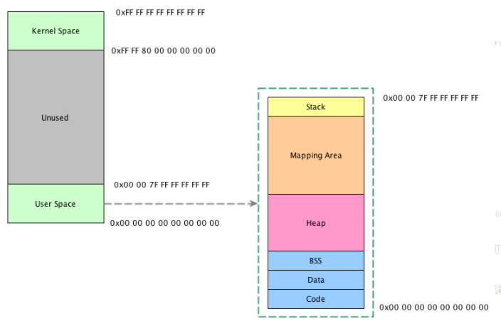

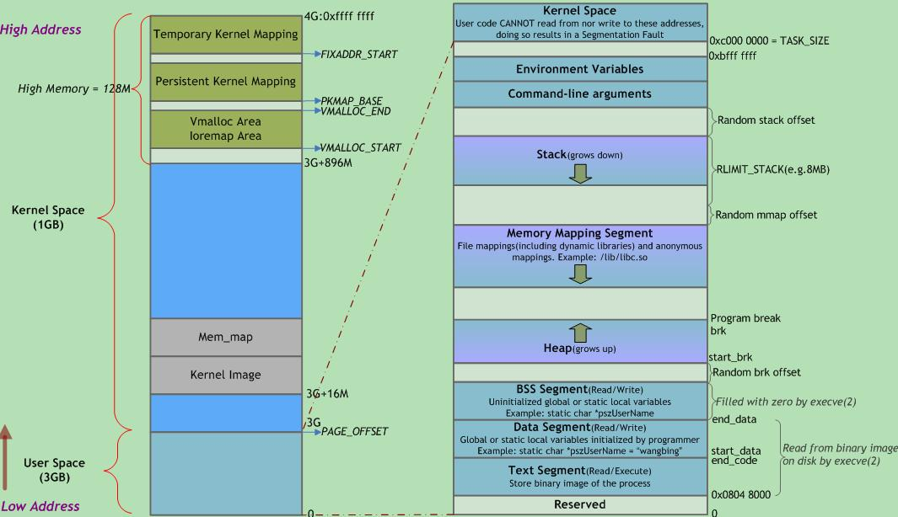

由下文的程序打印结果来看，stack空间变量地址，往变小处增长，堆空间地址往变大处增长。但栈地址大于堆地址。

```C++
#include <iostream>

void show_address(int *p) { std::cout << std::hex << p << std::endl; }

int main()
{
    int a = 1;
    int b = 2;
    int c = 3;

    int *d = new int(4);
    int *e = new int(5);
    int *f = new int(6);

    show_address(&a);
    show_address(&b);
    show_address(&c);
    show_address(d);
    show_address(e);
    show_address(f);

    delete d;
    delete e;
    delete f;

    return 0;
}

/*
打印：
0xffa8e950
0xffa8e94c
0xffa8e948
0x92d0b70
0x92d0b80
0x92d0b90
*/
```

#### 理解栈溢出

`a[100] = 0` 这次写操作，覆盖的是什么数据？

```c
static int cnt = 0;

void fun() {
    int a[10];
    a[100] = 0;          // 明显越界

    if (cnt >= 10)
        return;
    else {
        ++cnt;
        return fun();    // 递归调用
    }
}
```

`a` 只有 10 个元素，合法下标是 `0..9`；`a[100] = 0;` 是越界写，属于未定义行为（undefined behavior）。

可能覆盖当前栈帧里的任意东西，导致程序崩溃或产生不可预期结果。

从“典型的栈布局”角度继续往下思考，在“典型高地址向低地址生长”的栈上，大概率覆盖什么？

假设经典 64 位 Linux + System V ABI，栈从高地址往低地址长；大致的单次调用的栈帧可以抽象成：

```text
高地址
  调用者的局部变量...
  [返回地址]         <-- 调用 fun 前由 call 指令压入
  [旧的栈帧指针FP]    <-- prologue 里保存
  [当前函数的局部变量：int a[10]; 可能还有别的]
低地址
```

`int a[10];` 占 10×4 = 40 字节。`a[0]` 到 `a[9]` 合法，`a[100]` 距离 `a[0]` 有 `100 * sizeof(int) = 400` 字节。

在数组内部，元素地址总是按下标递增：`&a[1] > &a[0]`，`&a[100]` 远高于 `&a[0]`。所以 `a[100] = 0` 会向“更高的地址”写东西。

而在“栈从高往低扩展”的布局里：

- 当前函数局部变量通常在“栈帧底部”（低地址）；
- 保存的 FP、返回地址、调用者的局部变量在它“上面”（高地址）。

因此，在典型实现里，`a[100] = 0`：

- 很可能会：
  - 先越过 `a` 自己那 40 字节的区域，
  - 再越过一点栈帧中的对齐/临时空间，
  - 然后开始覆盖当前栈帧里的控制信息——保存的 FP、返回地址，
  - 甚至继续往上写到调用者（或上层递归）的局部变量、返回地址。

换句话说：它覆盖的通常不是某个“合法的 C 对象”，而是当前或上层栈帧里各种数据的原始字节，包括控制流信息。

每次递归调用都会：

- 在更低的地址再开一个新的栈帧（栈整体继续向低地址扩展）；
- 在新栈帧里又定义一个 `int a[10];`，然后又 `a[100] = 0;`，继续在各层栈帧往“上方”乱写。

结果是：

- 多层栈帧的返回地址、旧 FP、局部变量都会被破坏；
- 某一层从 `fun` 返回时，拿到的是已经被你改坏的返回地址；
- 要么直接跳飞，触发 `segmentation fault`；
- 要么跳到某段“看起来还能执行的指令”，产生各种诡异行为。

从安全角度来看，这就是典型的 栈溢出漏洞模式

#### 理解函数调用与栈内存

用如下代码为例，说明在典型 64 位 Linux 环境下，一个简单的函数调用链在栈上的布局情况。

```cpp
int fun_pow(int x);

int fun(int a, int b)
{
    int c = a + b;
    c = fun_pow(c);
    return c;
}

int fun_pow(int x)
{
    int y = x * x;
    return y;
}

int main()
{
    return fun(1, 2);
}
```

运行过程中，这段程序的调用链是：`main -> fun -> fun_pow -> 返回 -> fun -> 返回 -> main`，每一次函数调用，都会在栈上创建一个栈帧（stack frame）。在 `fun_pow` 内部执行 `int y = x * x;` 的瞬间，从高地址到低地址可以把栈理解为：

```
main 的栈帧：
  返回地址（从 main 回到启动代码/OS）
  main 的 saved RBP
  main 的局部变量和临时空间

fun 的栈帧：
  返回到 main 的地址
  fun 的 saved RBP
  （可能）参数 a、b 的栈上副本
  局部变量 c
  临时空间

fun_pow 的栈帧（当前栈顶）：
  返回到 fun 的地址
  fun_pow 的 saved RBP
  （可能）参数 x 的栈上副本
  局部变量 y
  临时空间
```

随着函数一层层返回，这个底部的栈帧会被一层层弹出，最终只剩下 `main` 的栈帧，最后 `main` 返回，整个进程结束。

函数返回时，当前函数的栈帧会被弹出，栈顶回到调用者的栈帧。

函数栈帧中常见的数据项：

```
高地址

返回地址
  函数结束时 CPU 要跳转回去继续执行的指令地址。

旧的栈帧指针（saved frame pointer，如 RBP）
  用于恢复上层栈帧，并方便调试器回溯调用栈。


参数的副本
  形参（例如 a, b, x）在某些 ABI 下会在栈上保留一份，
  或者在需要时从寄存器溢出（spill）到栈上。

局部变量
  函数体内定义的非静态局部变量（如 c, y）一般放在当前栈帧中。

编译器需要的临时空间和对齐填充
  用于保存被调用者需要保护的寄存器、临时中间结果、栈对齐等。

低地址
```

对上文**返回地址**和**旧的栈帧指针**的理解：

“返回地址”就是函数干完活以后，要回去接着从哪一行继续往下执行的那个位置。

好比说：`x = fun(1, 2);` 这一行执行到 `fun` 时，“返回地址”就是 `x = fun(1, 2);` 这行后面那条指令的位置。

函数 `fun` 结束执行，执行 `ret` 指令时，就会从栈里把这个地址拿出来，跳回这个位置继续往下跑程序。

对保存旧的栈帧指针的理解：当前的函数运行结束后，要回到上一个返回地址的位置继续执上一个任务，因此需要上一个任务的上下文，旧的栈帧指针的作用就是回到上一层函数的栈环境；同时这一串链表式的 RBP 还能让调试器顺藤摸瓜，找出谁调用了谁。

不同函数的栈帧结构类似，只是包含的参数和局部变量不同。

总结栈里有什么：

- 每调用一个函数，就在栈上建立一个新的栈帧；
- 每个栈帧中，都保存：
  - 返回地址；
  - 旧的栈帧指针（用于恢复调用者环境）；
  - 该函数的参数（可能保存在栈上）；
  - 该函数的局部变量（如 `c`、`y`）；
  - 为实现调用约定和优化而需要的临时和对齐空间。

理解了这一点，再看诸如栈溢出越界会覆盖什么，递归太深会怎样等问题时，就能更清楚地知道：它们实际上是在破坏或压缩这些栈帧中的数据和控制信息。

### 父子进程共享文件描述符

1. 父进程和子进程可以共享打开的文件描述符。

2. 父子进程共享文件描述符的条件：在fork之前打开文件。

3. **对于两个完全不相关的进程，文件描述符不能共享。**

4. 父子进程文件描述符是共享的，但是关闭的时候可以分别关闭，也可以同时在公有代码中关闭

其他:

在数据类型为全局变量时，父子进程之间的数据不共享

当数据类型为局部变量的时候，父子进程之间的数据不共享

当数据类型是动态开辟时，父子进程的数据不共享

进程间通信时需要创建管道，管道并非属于进程的资源而是和套接字一样，属于操作系统，也就不是fork函数的复制对象。【TCP/IP网络编程P184】

**对于数据类型为文件时，父子进程之间共享数据，具体而言是共享了文件偏移量。**子进程通过文件描述符修改文件会影响父进程的文件偏移量。

补充：TCP/IP网络编程P177中

**调用 fork 函数时会复制父进程的所有资源，但是套接字不是归进程所有，而是归操作系统所有，只是进程拥有代表相应套接字的文件描述符。**

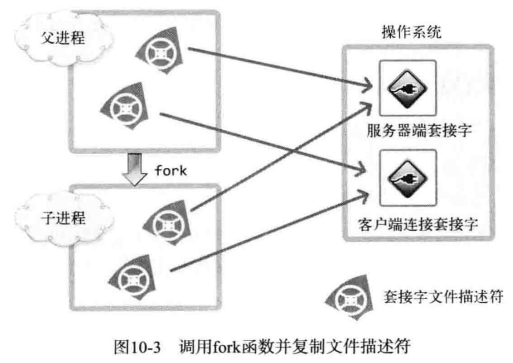

如图所示，1 个套接字存在 2 个文件描述符时，只有 2 个文件描述符都终止（销毁）后，才能销毁套接字。如果维持图中的状态，即使子进程销毁了与客户端连接的套接字文件描述符，也无法销毁套接字（服务器套接字同样如此）。因此调用 fork 函数后，要将无关紧要的套接字文件描述符关掉，如图所示：

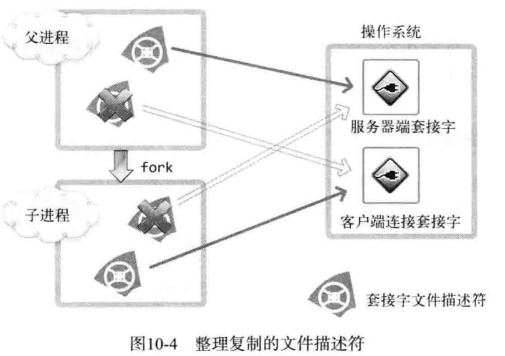

### 缓存与缓冲

区别：两者操作的对象不一样。

- buffer(缓冲)：是为了提高内存和硬盘或其他I/0设备 之间的数据交换的速度而设计的。
  当创建buffer对象时，会先创建一个缓冲区数组。然后当我们读一个文件时，先从硬盘中读到缓冲区，待缓冲区满后再进行传送，这样会大大减少读写次数，节省时间，提高效率。

- cache(缓存)：是为了提高 cpu 和内存之间的数据交换速度而设计
  高速缓冲存储器，读写速度很快，几乎与CPU一样。由于CPU的运算速度太快，内存的数据存取速度无法跟上CPU的速度，所以在cpu与内存间设置了cache 为 cpu 的数据快取区。当计算机执行程序时，数据与地址管理部件会预测可能要用到的数据和指令，并将这些数据和指令预先从内存中读出送到Cache。一旦需要时，先检查Cache，若有就从Cache中读取，若无再访问内存，现在的CPU还有一级cache，二级cache。简单来说，Cache 就是用来解决 CPU 与内存之间速度不匹配的问题，避免内存与辅助内存频繁存取数据，这样就提高了系统的执行效率。设置缓存的理论基础，是程序访问的局部性原理。缓存的功能均由硬件实现，对程序员是透明的。

总之，buffer偏重于写，而cache偏重于读。

相同点：两者都加快了系统的反应速度。

参考：

- [缓冲和缓存原文链接](https://blog.csdn.net/dangkun321/article/details/107161248)
- [什么是缓冲区（buffer），什么是缓存（cache）](https://fuhanghang.blog.csdn.net/article/details/109756207?spm=1001.2101.3001.6661.1&utm_medium=distribute.pc_relevant_t0.none-task-blog-2%7Edefault%7ECTRLIST%7Edefault-1-109756207-blog-113246221.pc_relevant_multi_platform_whitelistv2&depth_1-utm_source=distribute.pc_relevant_t0.none-task-blog-2%7Edefault%7ECTRLIST%7Edefault-1-109756207-blog-113246221.pc_relevant_multi_platform_whitelistv2&utm_relevant_index=1)

## 堆与栈的区别

主要有6点区别：

**1、管理方式不同：**
对于栈来讲，是由编译器自动管理，无需我们手工控制；对于堆来说，释放工作由程序员控制，容易产生memory leak。

**2、空间大小不同：**

一般来讲在32位系统下，堆内存可以达到4G的空间，从这个角度来看堆内存几乎是没有什么限制的。但是对于栈来讲，一般都是有一定的空间大小的，例如，在VC6下面，默认的栈空间大小是1M（好像是，记不清楚了）。当然，我们可以修改： 打开工程，依次操作菜单如下：Project->Setting->Link，在Category 中选中Output，然后在Reserve中设定堆栈的最大值和commit。 注意：reserve最小值为4Byte；commit是保留在虚拟内存的页文件里面，它设置的较大会使栈开辟较大的值，可能增加内存的开销和启动时间。

**3、产生碎片不同：**
对于堆来讲，频繁的new/delete势必会造成内存空间的不连续，从而造成大量的碎片，使程序效率降低。对于栈来讲，则不会存在这个问题，因为栈是先进后出，他们是如此的一一对应，以至于永远都不可能有一个内存块从栈中间弹出，在它弹出之前，在他上面的后进的栈内容已经被弹出，详细的可以参考数据结构，这里我们就不再一一讨论了。

**4、生长方向不同：**
对于堆来讲，生长方向是向上的，也就是向着内存地址增加的方向；对于栈来讲，它的生长方向是向下的，是向着内存地址减小的方向增长。

**5、分配方式不同：**
堆都是动态分配的，没有静态分配的堆。栈有2种分配方式：静态分配和动态分配。静态分配是编译器完成的，比如局部变量的分配。动态分配由alloca函数进行分配，但是栈的动态分配和堆是不同的，它的动态分配是由编译器进行释放，无需我们手工实现。

**6、分配效率不同：**
栈是机器系统提供的数据结构，计算机会在底层对栈提供支持：分配专门的寄存器存放栈的地址，压栈出栈都有专门的指令执行，这就决定了栈的效率比较高。堆则是C/C++函数库提供的，它的机制是很复杂的，例如为了分配一块内存，库函数会按照一定的算法（具体的算法可以参考数据结构/操作系统）在堆内存中搜索可用的足够大小的空间，如果没有足够大小的空间（可能是由于内存碎片太多），就有可能调用系统功能去增加程序数据段的内存空间，这样就有机会分到足够大小的内存，然后进行返回。显然，堆的效率比栈要低得多。

从这里我们可以看到，堆和栈相比，由于大量new/delete的使用，容易造成大量的内存碎片；由于没有专门的系统支持，效率很低；由于可能引发用户态和核心态的切换，内存的申请，代价变得更加昂贵。所以栈在程序中是应用最广泛的，就算是函数的调用也利用栈去完成，函数调用过程中的参数，返回地址，EBP和局部变量都采用栈的方式存放。所以，我们推荐大家尽量用栈，而不是用堆。 虽然栈有如此众多的好处，但是由于和堆相比不是那么灵活，有时候分配大量的内存空间，还是用堆好一些。

## 栈空间

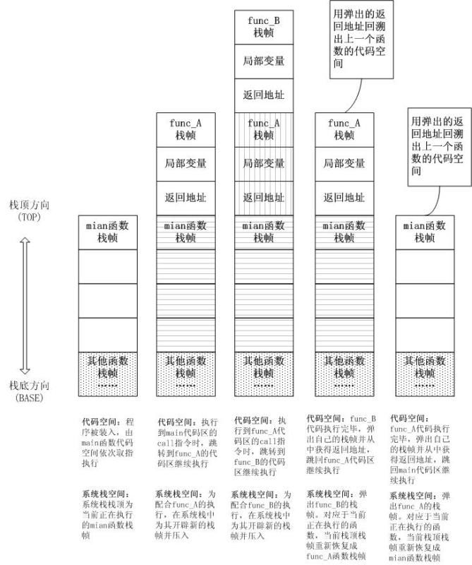

参看：

https://www.zhihu.com/question/22444939/answer/22200552

## 缓存一致性协议 MESI

### CPU的缓存结构

在计算机中，存储体系是一个典型的金字塔结构，按照速度排列从上到下依次是：CPU 寄存器、CPU Cache（L1/L2/L3）、内存(主存)、SSD 固态硬盘以及 HDD 传统机械硬盘。越上层的存储设备速度越快，当然价格也更贵，容量也越小。

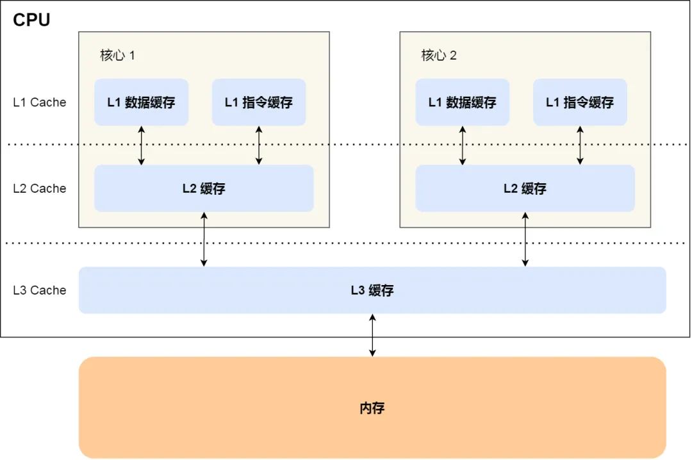

CPU缓存和内存之间是通过映射的策略进行关联的。CPU缓存从内存读取到的数据是一块一块存储的，这一块可以理解为 CPU Cache 的最小缓存单位，它有一个专门的名字：Cache Line，一般它的大小为 64 Byte。

```shell
$ cat /sys/devices/system/cpu/cpu0/cache/index0/coherency_line_size
64
```

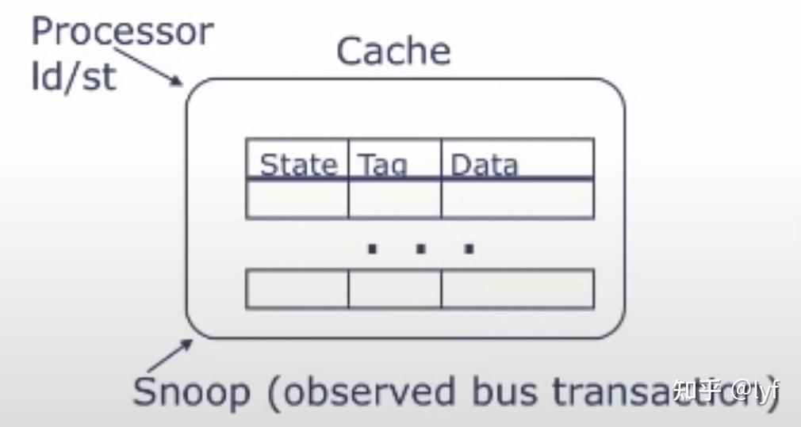

如上图所示，对于每个CPU的cache，cache中包含了很多的cache line，之所以叫cache line，应该也是因为看起来是一行一行的数据；

每个cache line中有state,tag,data等，tag一般是数据的地址，data中是对应的值；

每个cache有个专门的硬件叫cache controller，cache控制器同时和CPU以及**总线**打交道。

关于**缓存控制器**(cache controller)，它是一个硬件，在CPU和共享总线之间协作:

- 将主存中的code指令或者数据读到cache中；
- 处理CPU的load和store指令，发送和处理总线消息（缓存命中、不命中）。

### 如何保证缓存一致

带有高速缓存的CPU执行计算的流程:

1. 程序以及数据被加载到主内存；
2. 指令和数据被加载到CPU的高速缓存；
3. CPU执行指令，把结果写到高速缓存；
4. 高速缓存中的数据写回主内存。

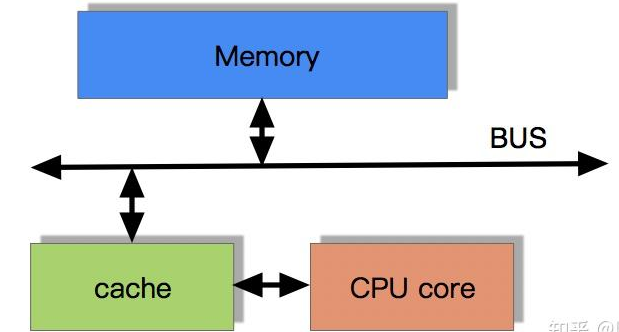

将数据从cache中写入到内存中有2种方式:

- Write through，直写法，CPU在写cache的同时也会立即去写主存；
- Write back，写回法，只写cache，标记cache line 为 dirty，然后在延后的“合适的时间”再去写主存。

Write through每次都要把数据更新到主存中，在有些场景下是不需要的(例如单线程程序或者多线程的私有数据)，影响效率。

总而言之，Write through 效率低，但是系统设计起来会更简单一些。而Write back是为了提升CPU的效率而做的一些优化，使得系统会更复杂。从上面我们可以看出，在多核CPU上的多线程编程，在牵扯到**多线程之间有共享变量时**，这个变量的最新值可能在主存中，可能在某个CPU的cache中，此时缓存的“一致性”就变的非常重要，因为如果不一致，我们可能就读取了错误的值。

要达到缓存一致性的目的，学术上有2个必须的要求:

- **Write Propagation**，写传播，某个CPU核心里的cache数据更新时，必须要传播到其他核心的cache；

-  **Transaction Serialization**，事务串行化。Reads/Writes to a single memory location must be seen by all processors in the same  order，对一个内存地址的读/写，对所有的CPU，其执行顺序是一致的。假如有个4核的CPU，在每个核心的cache上都缓存了i，当CPU0和CPU1同时对自己缓存中的i执行写操作时(store，这个“同时”指的是同一个时间点，这对多核CPU理论上是存在可能的，CPU0写入i=1，CPU1写入i=2)，对CPU2和CPU3缓存中的i的值应该如何去更新，是1->2还是2->1？Transaction  Serialization就是对这点做了约束，必须保证这种情况下，缓存的一致性。不同的缓存一致性协议，例如MESI等，通过自己的协议机制，规定了如何将事务串行化。

  我的理解，事务串行化保证不存在真正并行的对变量i的写操作。

目前有2种主流的处理缓存一致性的机制：

1. Snooping，基于总线嗅探(**本文介绍的内容都是基于Snooping**)，

> First introduced in 1983,snooping is a process where  the individual caches monitor address lines for accesses to memory  locations that they have cached.The write-invalidate protocols and  write-update protocols make use of this mechanism.

基于总线嗅探的技术，其核心是cache控制器随时关注自己和其他CPU对自己缓存中的数据的操作，然后做出对应的反应。

2. Directory-based，基于目录

> In a directory-based system, the data being shared is placed in a common directory that maintains the coherence between  caches. The directory acts as a filter through which the processor must  ask permission to load an entry from the primary memory to its cache.  When an entry is changed, the directory either updates or invalidates  the other caches with that entry.

### 基于总线嗅探的写传播

写传播的原则就是当某个 CPU 核心更新了 Cache 中的数据，要把该事件广播通知到其他核心。最常见实现的方式是**总线嗅探（\*Bus Snooping\*）**。

当 A 号 CPU 核心修改了 L1 Cache 中 i  变量的值，通过总线把这个事件广播通知给其他所有的核心，然后每个 CPU 核心都会监听总线上的广播事件，并检查是否有相同的数据在自己的 L1  Cache 里面，如果 B 号 CPU 核心的 L1 Cache 中有该数据，那么也需要把该数据更新到自己的 L1 Cache。

可以发现，总线嗅探方法很简单， CPU 需要每时每刻监听总线上的一切活动，但是不管别的核心的 Cache 是否缓存相同的数据，都需要发出一个广播事件，这无疑会加重总线的负载。

另外，**总线嗅探只是保证了某个 CPU 核心的 Cache 更新数据这个事件能被其他 CPU 核心知道，但是并不能保证事务串形化**。

于是，有一个协议基于总线嗅探机制实现了事务串形化，也用状态机机制降低了总线带宽压力，这个协议就是 MESI 协议，这个协议就做到了 CPU 缓存一致性。

### 缓存一致性协议

- 单机多核 CPU（x86、ARM 等）里最主流的是基于 MESI 的失效（Invalidate）协议
  - 基本版：MESI（Modified / Exclusive / Shared / Invalid）
  - 常见变种：
    - MOESI（多了 Owned，AMD/部分 ARM 常见）
    - MESIF（多了 Forward，Intel 常见）
- 大规模多处理器 / 集群系统
  - 仍然是 MESI/MOESI 这一类状态机为基础，但实现方式多为基于目录（Directory-based）的一致性协议，而不是纯粹的总线嗅探（Snooping）。

下文只讨论 MESI。

MESI 协议其实是 4 个状态单词的开头字母缩写，分别是：

- *Modified*，已修改
- *Exclusive*，独占
- *Shared*，共享
- *Invalidated*，已失效

这四个状态来标记 Cache Line 四个不同的状态。

「已修改」状态就是我们前面提到的脏标记，代表该 Cache Block 上的数据已经被更新过，但是还没有写到内存里。而「已失效」状态，表示的是这个 Cache Block 里的数据已经失效了，不可以读取该状态的数据。

「独占」和「共享」状态都代表 Cache Block 里的数据是干净的，也就是说，这个时候 Cache Block 里的数据和内存里面的数据是一致性的。

「独占」和「共享」的差别在于，独占状态的时候，数据只存储在一个 CPU 核心的 Cache 里，而其他 CPU 核心的 Cache 没有该数据。这个时候，如果要向独占的 Cache  写数据，就可以直接自由地写入，而不需要通知其他 CPU 核心，因为只有你这有这个数据，就不存在缓存一致性的问题了，于是就可以随便操作该数据。

另外，在「独占」状态下的数据，如果有其他核心从内存读取了相同的数据到各自的 Cache ，那么这个时候，独占状态下的数据就会变成共享状态。

那么，「共享」状态代表着相同的数据在多个 CPU 核心的 Cache 里都有，所以当我们要更新 Cache 里面的数据的时候，不能直接修改，而是要先向所有的其他 CPU  核心广播一个请求，要求先把其他核心的 Cache 中对应的 Cache Line 标记为「无效」状态，然后再更新当前 Cache 里面的数据。

举个具体的例子来看看这四个状态的转换：

1. 当 A 号 CPU 核心从内存读取变量 i 的值，数据被缓存在 A 号 CPU 核心自己的 Cache 里面，此时其他 CPU 核心的 Cache 没有缓存该数据，于是标记 Cache Line 状态为「独占」，此时其 Cache 中的数据与内存是一致的；
2. 然后 B 号 CPU 核心也从内存读取了变量 i 的值，此时会发送消息给其他 CPU 核心，由于 A 号 CPU  核心已经缓存了该数据，所以会把数据返回给 B 号 CPU 核心。在这个时候， A 和 B 核心缓存了相同的数据，Cache Line  的状态就会变成「共享」，并且其 Cache 中的数据与内存也是一致的；
3. 当 A 号 CPU 核心要修改 Cache 中 i 变量的值，发现数据对应的 Cache Line 的状态是共享状态，则要向所有的其他 CPU  核心广播一个请求，要求先把其他核心的 Cache 中对应的 Cache Line 标记为「无效」状态，然后 A 号 CPU 核心才更新  Cache 里面的数据，同时标记 Cache Line 为「已修改」状态，此时 Cache 中的数据就与内存不一致了。
4. 如果 A 号 CPU 核心「继续」修改 Cache 中 i 变量的值，由于此时的 Cache Line 是「已修改」状态，因此不需要给其他 CPU 核心发送消息，直接更新数据即可。
5. 如果 A 号 CPU 核心的 Cache 里的 i 变量对应的  Cache Line 要被「替换」，发现  Cache Line 状态是「已修改」状态，就会在替换前先把数据同步到内存。

所以，可以发现当 Cache Line 状态是「已修改」或者「独占」状态时，修改更新其数据不需要发送广播给其他 CPU 核心，这在一定程度上减少了总线带宽压力。

事实上，整个 MESI 的状态可以用一个有限状态机来表示它的状态流转。还有一点，对于不同状态触发的事件操作，可能是来自本地 CPU 核心发出的广播事件，也可以是来自其他 CPU 核心通过总线发出的广播事件。下图即是 MESI 协议的状态图：

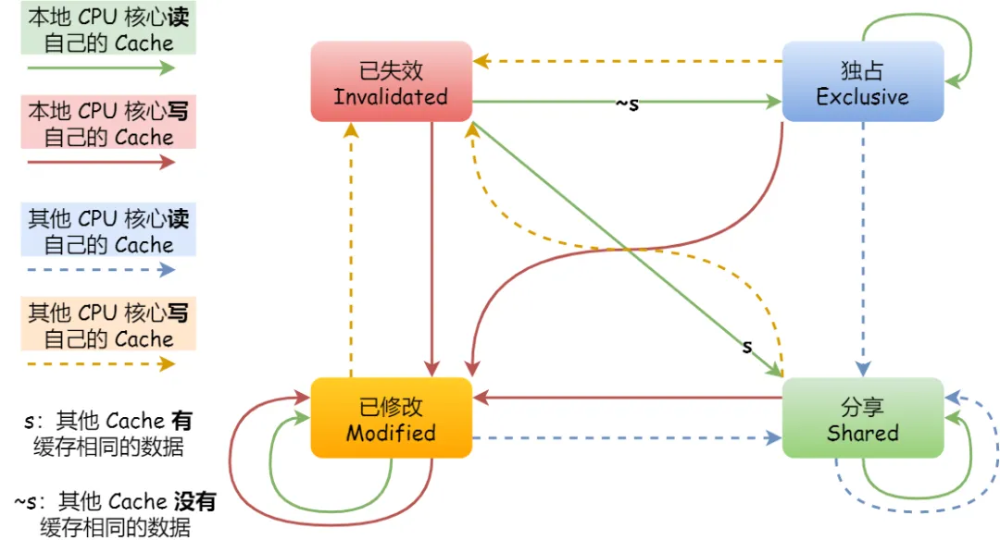

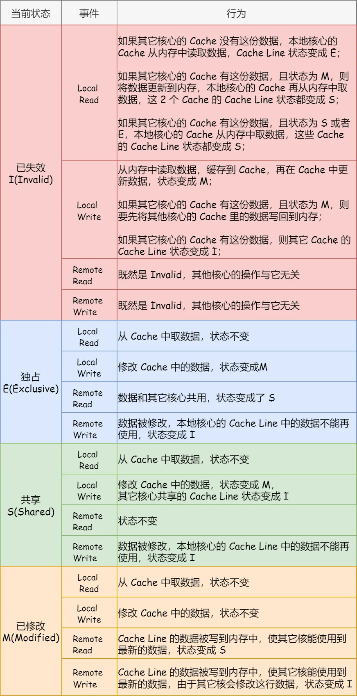

**参考**

- [缓存一致性协议MESI](https://zhuanlan.zhihu.com/p/696813060)：比较全，涉及到了 Store buffer 。
- [10 张图打开 CPU 缓存一致性的大门](https://mp.weixin.qq.com/s?__biz=MzUxODAzNDg4NQ==&mid=2247486479&idx=1&sn=433a551c37a445d068ffbf8ac85f0346&chksm=f98e48a5cef9c1b3fadb691fee5ebe99eb29d83fd448595239ac8a2f755fa75cacaf8e4e8576&scene=21#wechat_redirect)
- [[CPU缓存#3]-MESI和内存屏障](https://zhuanlan.zhihu.com/p/1894335116790178620)：讲解了使用**StoreBuffer优化**Cache。

- [**在线体验 MESI 协议状态转换**](https://www.scss.tcd.ie/Jeremy.Jones/VivioJS/caches/MESIHelp.htm)

## atomic 原子操作底层原理

### 原子变量和普通变量的功能区别

- 相比普通变量，原子变量有如下两个基本特性：原子变量的所有操作（fetch_add、store、load、compare_exchange_strong、exchange等）都具有原子性；

- 原子变量可以解决内存序问题，使多个变量的可见性保持一定的一致性。

原子性相对比较好理解：一个线程在进行某个原子变量操作时，系统中的所有线程，不可能观察到原子变量操作完成了一半；要么都完成了，要么都没开始。与通过互斥锁访问同一个数据的效果一样。

内存序问题，简单来说，由于受到编译器的指令重排和CPU的微指令流水线乱序执行的影响，程序的代码顺序，可能与实际生效的顺序不一样。 

在x86-64 CPU环境下，普通变量和std::memory_order类型简单对比如下：

|  memory_order   | 清空Store Buffer | 编译重排限制 | 读写直接操作内存 | 原子性 |
| :-------------: | :--------------: | :----------: | :--------------: | :----: |
|    普通变量     |        否        |    不限制    |        否        |   否   |
|     relaxed     |        否        |    不限制    |        是        |   是   |
|     seq_cst     |        是        |   完全限制   |        是        |   是   |
| acquire/release |        否        |   部分限制   |        是        |   是   |

### 内存乱序问题原因

为什么编译器和CPU会引入内存乱序问题呢？原因是为了增加单个执行流的执行速度。

#### 编译乱序

编译器根据目标平台的CPU特性，适当调整指令顺序，使得单个线程中的执行速度更快。测试代码：

```cpp
__declspec(noinline)
bool submit(int32_t& data, int32_t& data2) {
  g_data2 = data2 - data;
  g_data1 = data;
  g_has_data = true;
  return true;
}
```

```asm
data2 - data:
mov         eax,dword ptr [rdx]
sub         eax,r8d

g_data1 = data:  # 全局变量g_data1和g_data2的赋值顺序反了
mov         dword ptr [g_data1 (07FF68F9A462Ch)],r8d

g_data2 = data2 - data:
mov         dword ptr [g_data2 (07FF68F9A4630h)],eax

return true:
mov         al,1

g_has_data = true: # 返回值和全局变量g_has_data的赋值顺序反了
mov         byte ptr [g_has_data (07FF68F9A4628h)],1
```

对比 [章节 std::memory_order_acquire/release](# std::memory_order_acquire/release) 可以看到解决了汇编指令乱序的问题

#### CPU乱序

对于CPU来说，我们输入的是一条一条的汇编指令和数据，但CPU会将汇编指令进行译码，成为一系列的微指令。多条汇编指令形成的微指令会在CPU的流水线中进行执行。指令流水示意图如下：

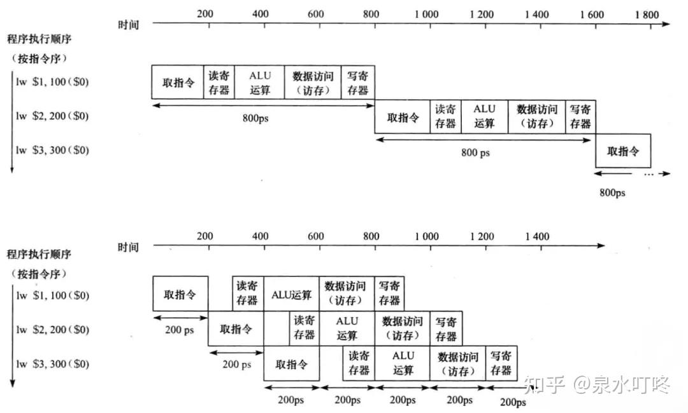

即使在cache存在的情况下，写入操作仍然是比较耗时的。如果在微指令中存在写内存的操作，CPU会先将待写入的数据放入一个叫做Store Buffer的队列中，直到MESI协议将其它core中的该数据完成作废以后，再向cache/memory写入。

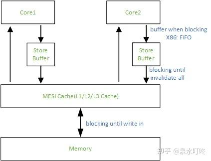

当数据进入Store  Buffer后，CPU会继续执行后续的微指令，即使此时的数据还没有写入cache/memory。Store  Buffer中的数据写入cache/memory就交给了MESI协议系统，对于CPU来说，就是一个异步的后台任务。于是产生了CPU的指令乱序执行。在大部分情况下，乱序执行是没有问题的，但是在多线程环境下，一些关键变量如果无法保证原来的顺序，就会出现不预期的运行结果。

#### 内存乱序解决方法

- 关闭编译器优化，在实际项目中，基本不可能。
- 使用volatile关键字，保证编译器不会优化变量，变量每次读写都会从存储器完成。
- 主要用在嵌入式开发场景。使用操作系统提供的内存屏障机制，内存屏障也是std::memory_order的底层实现。内存屏障对CPU微指令的影响，本质上是间接操作Store Buffer。
- 对关键代码加锁

### memory order 分析

std::memory_order是在内存屏障的基础上，进行的上层抽象设计。以使得多线程读写多个变量时，达到一定程度的可见顺序保证。下面依次介绍std::memory_order的四个常用类型。

#### std::memory_order_relaxed

std::memory_order_relaxed是比较容易理解的一个类型。它**只保证该变量本身的原子性，不保证解决多个变量之间的读写乱序。**由于保证原子性，因此变量修改直达内存/cache。不会先读到寄存器，然后计算，最后写回内存。**由于不解决多个变量之间的读写乱序问题，因此理论上不影响编译器指令重排**。 std::memory_order_relaxed在四个类型中，性能开销也是最小的。测试代码：

```cpp
__declspec(noinline)
bool relaxed_test(int32_t& data) {
  g_data1.store(data, std::memory_order_relaxed);
  return g_has_data.load(std::memory_order_relaxed);
}
```

```asm
g_data1.store(data, std::memory_order_relaxed):
mov         eax,dword ptr [rcx]
mov         dword ptr [g_data1 (07FF73D7E464Ch)],eax

return g_has_data.load(std::memory_order_relaxed):
movzx       eax,byte ptr [g_has_data (07FF73D7E4648h)]
```

从汇编代码可以看出，std::memory_order_relaxed使用的是基本的mov指令和movzx，并不会清空Store Buffer。

#### std::memory_order_seq_cst

std::memory_order_seq_cst理解起来也比较容易，**保证顺序一致**（sequentially-consistent）。

具体如下：如果两个变量都使用std::memory_order_seq_cst进行读写，其中两个变量的写操作记为W1和W2。当任意线程的读操作观测到W1先于W2，那么其它线程的读操作也会观测到W1先于W2。在x86-64 CPU环境下，进行W1操作和W2操作后，**都会立即清空Store Buffer，该操作本质上就是全局的数据同步，从而保证了顺序一致**。编译器也会保证指令的顺序。std::memory_order_seq_cst是最强的顺序一致保证，也是c++原子变量的默认参数。但性能是四个类型中最低的。 测试代码：

```cpp
__declspec(noinline)
bool seq_test(int32_t& data) {
  g_data1.store(data, std::memory_order_seq_cst);
  return g_has_data.load(std::memory_order_seq_cst);
}
```

```asm
g_data1.store(data, std::memory_order_seq_cst):
mov         eax,dword ptr [rcx]
xchg        eax,dword ptr [g_data1 (07FF61820464Ch)]

return g_has_data.load(std::memory_order_seq_cst):
movzx       eax,byte ptr [g_has_data (07FF618204648h)]
```

从汇编代码可以看出，std::memory_order_seq_cst写入使用的是xchg指令，xchg指令会清空Store Buffer。

**xchg指令的清空Store Buffer行为是CPU内存一致性模型的关键设计，它确保了原子操作的全局可见性。**

##### 理解 xchg 指令的清空 Store Buffer 过程

**xchg** 即 **Exchange**，单指令完成数据交换。

```cpp
// 没有Store Buffer的情况（性能差）
void write_shared_data() {
    shared_data = 42;  // CPU必须等待写入完成才能继续执行
    // 这里会停顿几十个时钟周期...
    flag = true;       // 才能执行下一条指令
}

// 有Store Buffer的情况（性能好）
void write_shared_data() {
    shared_data = 42;  // 写入放入Store Buffer，立即返回
    flag = true;       // 可以立即执行这条指令
    // Store Buffer在后台异步将数据写入缓存
}
```

**Store Buffer的作用**：让CPU不等写入完成就继续执行

**引入问题**：其他CPU可能看不到最新的写入顺序

```shell
CPU执行lock xchg [mem], reg:
1. 获取缓存行的独占权（锁总线或缓存锁）
2. 清空自己的Store Buffer → 确保之前的写入全局可见
3. 执行原子交换：[mem]↔reg
4. 释放独占权
5. 后续写入可以继续使用Store Buffer
```

#### std::memory_order_acquire/release

std::memory_order_acquire和std::memory_order_release是同时出现的。对内存的顺序保证介于std::memory_order_relaxed和std::memory_order_seq_cst之间。高性能编程用得比较多。

std::memory_order_acquire用于读操作，std::memory_order_release用于写操作。

一个操作既包含读又包含写，则可以使用 std::memory_order_acq_rel，std::memory_order_acq_rel = std::memory_order_acquire + std::memory_order_release。

acquire/release 的顺序保证具体如下：

对同一个变量进行两个操作：读操作R、写操作W。两个操作可以在同一个线程内，也可以在不同线程内。如果读操作R读取了写操作W写入的新值，那么R后续的所有其它变量的读操作，都能读取到W操作之前所有其它变量的写入值。

```cpp
__declspec(noinline)
bool submit(int32_t& data, int32_t& data2) {
  g_data2 = data2 - data;
  g_data1.store(data, std::memory_order_release);
  g_has_data.store(true, std::memory_order_release);
  return true;
}
```

```asm
g_data2 = data2 - data:
sub         eax,r8d
mov         dword ptr [g_data2 (07FF77AF15648h)],eax

g_data1.store(data, std::memory_order_release):
mov         dword ptr [g_data1 (07FF77AF15644h)],r8d

g_has_data.store(true, std::memory_order_release):
mov         byte ptr [g_has_data (07FF77AF15640h)],1

return true:
mov         al,1
```

与 [章节 编译乱序](# 编译乱序) 对比分析，可以发现使用std::memory_order_release内存序，可以保证写入操作汇编代码的顺序，乱序无法穿透使用了std::memory_order_release参数的写入操作。

对于读取代码：

```cpp
__declspec(noinline)
int32_t get_data() {
  while (!g_has_data.load(std::memory_order_acquire)) {
  } // 循环结束，代表读取到了新值
  int32_t tmp = g_data1.load(std::memory_order_acquire);
  return g_data2 + tmp;
}
```

```asm
while (!g_has_data.load(std::memory_order_acquire)):
movzx       eax,byte ptr [g_has_data (07FF7B7BA4640h)]  
test        al,al  
je          get_data+2h (07FF7B7BA1032h)

int32_t tmp = g_data1.load(std::memory_order_acquire):
mov         ecx,dword ptr [g_data1 (07FF7B7BA4644h)]

return g_data2 + tmp:
mov         eax,dword ptr [g_data2 (07FF7B7BA4648h)]
add         eax,ecx
```

循环读，每次都读取内存。读取的汇编代码顺序和C++代码一致。在x86-64 CPU环境下，不需要编译器插入额外的内存屏障指令或者使用xchg这类清空Store Buffer的指令。操作不会发生穿越读操作R和写操作W的重排。  

普通变量和原子变量对比

在x86-64 CPU环境下，普通变量和以上std::memory_order类型简单对比如下：memory_order清空Store Buffer编译重排限制读写直接操作内存原子性普通变量否不限制否否relaxed否不限制是是seq_cst是完全限制是是acquire/release否部分限制是是

### 解析原子操作

```cpp
int main()
{
    int i ;
    i ++;
    return 0;
}
```

```asm
# g++ -O0 -S test_normal.cpp -o test_normal_O0.s # 开启 -O0，不然 i会被优化掉
main:
.LFB295:
	.cfi_startproc
	endbr64
	pushq	%rbp
	.cfi_def_cfa_offset 16
	.cfi_offset 6, -16
	movq	%rsp, %rbp
	.cfi_def_cfa_register 6
	movl	$0, -4(%rbp)
	addl	$1, -4(%rbp) # add 指令
	movl	$0, %eax
	popq	%rbp
	.cfi_def_cfa 7, 8
	ret
	.cfi_endproc
```

这里最核心的操作就是**addl    $1, -4(%rbp)，**这一个语句完成了自增1的操作。

这个过程可以拆分成三步：

- Load data : 从主存当中将 data 加载到 cpu 的缓存。
- data+1 : 执行 data + 1 操作。
- Store data : 将 data 的值写回主存。

了解了这三步操作之后，就可以分析出，这种自增1的操作不是线程安全的。

如果换成 atomic 变量，可以看出，**所谓的安全操作，在底层是通过汇编的lock指令来保证的**，lock指令保证了CPU的 load-add-store 的不可分割。

```cpp
#include <atomic>
int main()
{
    std::atomic<int> i ;
    i ++;
    return 0;
}
```

```asm
# g++ -O2 -S test.cpp -o test_O2.s  # 直接开启 -O2 优化也无妨

main:
.LFB337:
	.cfi_startproc
	endbr64
	subq	$24, %rsp
	.cfi_def_cfa_offset 32
	movq	%fs:40, %rax
	movq	%rax, 8(%rsp)
	xorl	%eax, %eax
	movl	$0, 4(%rsp)
	lock addl	$1, 4(%rsp) # 带 lock 的 add 指令
	movq	8(%rsp), %rax
	subq	%fs:40, %rax
	jne	.L5
	xorl	%eax, %eax
	addq	$24, %rsp
	.cfi_remember_state
	.cfi_def_cfa_offset 8
	ret
```

#### lock 指令分析

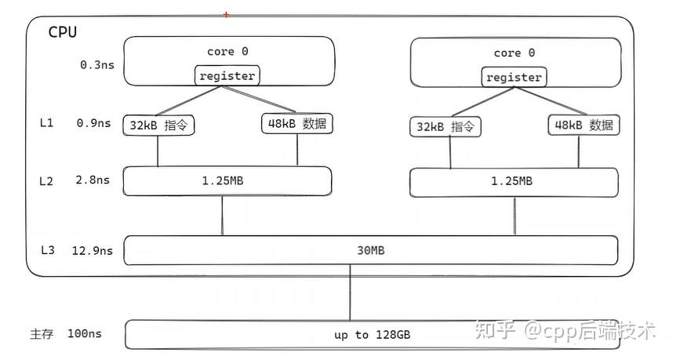

cpu在执行任务的时候并不是直接从内存中加载数据，而是会先将数据加载到`L1`和`L2` cache中（典型的是两层缓存，甚至可能更多），然后再从cache中读取数据进行运算。

可以看出L1和L2是每个核心都会有的。L3是一个处理器下的核心共有的。主存（常规语境下所指的内存）是所有核心共有的。越往下容量越大，同时读取速度越慢。Cpu访问缓存的时候会有一个最小的读取单位，叫做cache line，一般是64个字节。Flag标识的是当前的缓存是否可用。Tag标识的是当前的缓存是否命中。Data是缓存数据。


而现在的计算机通常都是多核处理器，多核之间的缓存数据同步是cpu框架设计的重要部分，`MESI`是比较常用的多核缓存同步方案。

当我们在单线程内执行 `atomic++`操作，自然是不会发生多核之间数据不同步的问题，但是我们在多线程多核的情况下，cpu是如何保证`Lock`特性的？硬件层面支持的lock一般有两种方式：

- 锁总线
- 锁缓存行

##### 锁总线（bus lock)

CPU总线是所有CPU与芯片组连接的主干道，负责CPU与外界所有部件的通信，包括高速缓存、内存、北桥，其控制总线向各个部件发送控制信号、通过地址总线发送地址信号指定其要访问的部件、通过数据总线双向传输。在CPU1要做  i++操作的时候，其在总线上发出一个LOCK#信号，其他处理器就不能操作缓存了该共享变量内存地址的缓存，也就是阻塞了其他CPU，**使该处理器可以独享此共享内存**。

等原子操作结束，释放Bus。这样后续的内存操作就可以进行。这个方法可以实现原子操作，但是锁住Bus会导致后续无关内存操作都不能继续。实际上，我们只关心我们操作的地址数据。只要我们操作的地址锁住即可，而其他无关的地址数据访问依然可以继续。所以我们引入另一种解决方法。

##### 锁缓存行（cache line lock)

现代的CPU一般都是采用锁缓存行的方式来进行实现lock指令，除非是当要 lock 的内存跨越了缓存行时才会在总线上发 LOCK# 信号。所以 lock 的内存最好在一个缓存行内，64 位的数据类型按 64 位对齐，32 位的数据类型按 32 位对齐即可满足要求。

为了实现多核Cache一致性，现在的硬件基本采用MESI协议（或者MESI变种）维护一致性。因此可以借助多核Cache一致性协议MESI实现原子操作。

针对缓存行锁，可以分为以下两种情况进行讨论：具体细节可参考https://zhuanlan.zhihu.com/p/649646816。

### 参考

- 论文综述 [Memory Barriers: a Hardware View for Software Hackers](http://www.puppetmastertrading.com/images/hwViewForSwHackers.pdf)
- 

## mmap

### 通过CPU虚拟地址直接读写设备物理内存的过程

用户程序通过CPU虚拟地址直接读写设备物理内存，无需数据拷贝，从mmap调用到设备访问的过程。

阶段1：驱动初始化（建立内核映射）

```
┌─────────────────────────────────────────────────────┐
│             驱动加载时：ioremap建立内核窗口          │
├─────────────────────────────────────────────────────┤
│ 步骤1：获取设备内存信息                              │
│   pci_resource_start() → 设备物理地址(PA_device)    │
│   pci_resource_len()   → 内存大小                   │
│                                                     │
│ 步骤2：ioremap到内核空间                            │
│   void __iomem *regs = ioremap(PA_device, size);   │
│                                                     │
│ 步骤3：配置IOMMU                                    │
│   [系统PA窗口] ←→ [设备PA] 映射关系建立             │
│   例：0x40000000-0x400FFFFF ←→ 0xA0000000-0xA00FFFFF│
└─────────────────────────────────────────────────────┘
```

阶段2：用户调用mmap（建立用户映射）

```
用户程序：                                           驱动：
┌────────────────────┐    ┌────────────────────────────┐
│void *ptr = mmap(   │    │static int device_mmap(    │
│    NULL,           │    │    struct file *filp,     │
│    size,           │    │    struct vm_area_struct  │
│    PROT_READ|      │    │        *vma) {            │
│      PROT_WRITE,   │    │                           │
│    MAP_SHARED,     │    │    // 1. 计算"伪"页帧号   │
│    fd,             │    │    unsigned long pfn =    │
│    offset);        │    │        virt_to_pfn(regs + │
│                    │    │        offset);           │
│                    │    │                           │
│                    │    │    // 2. 建立用户映射     │
│                    │    │    remap_pfn_range(vma,   │
│                    │    │        vma->vm_start,     │
│                    │    │        pfn,              │
│                    │    │        vma->vm_end -     │
│                    │    │        vma->vm_start,    │
│                    │    │        vma->vm_page_prot);│
│                    │    │                           │
│                    │    │    // 3. 标记特殊区域     │
│                    │    │    vma->vm_flags |=       │
│                    │    │        VM_IO | VM_PFNMAP; │
│                    │    │    return 0;              │
│                    │    │}                          │
└────────────────────┘    └────────────────────────────┘
```

阶段3：CPU访问设备内存（硬件执行路径）

```
┌─────────────────────────────────────────────────────────────┐
│             纯设备内存访问路径（无RAM参与）                   │
├─────────────────────────────────────────────────────────────┤
│ 步骤1：CPU发起访问                                           │
│   MOV [VA_user], 0xAA    # VA_user = mmap返回的地址         │
│   ↓                                                         │
│ 步骤2：CPU MMU转换                                         │
│   VA_user → 查询进程页表 → "伪"系统物理地址(PA_sys)         │
│   （PA_sys指向ioremap建立的"窗口"，如0x40000000）           │
│   ↓                                                         │
│ 步骤3：识别内存类型                                         │
│   CPU发现PA_sys对应UC（Uncacheable）内存                    │
│   → 绕过所有CPU缓存层级                                     │
│   → 生成特殊内存访问事务                                    │
│   ↓                                                         │
│ 步骤4：IOMMU转换                                           │
│   PA_sys → 查询IOMMU页表 → 真实设备地址(PA_device)         │
│   （IOMMU将0x40000000转换为0xA0000000）                     │
│   ↓                                                         │
│ 步骤5：生成PCIe事务                                         │
│   Memory Write TLP包：                                      │
│   ├─ 目标地址：PA_device (0xA0000000)                      │
│   ├─ 数据：0xAA                                            │
│   ├─ 路由：BDF(总线/设备/功能号)                            │
│   └─ 属性：Non-Posted（需要响应）                          │
│   ↓                                                         │
│ 步骤6：设备执行                                             │
│   设备内存控制器：                                          │
│   ├─ 接收TLP包                                             │
│   ├─ 解码地址 → 对应内部位置                                │
│   ├─ 执行写入                                              │
│   └─ 返回完成响应（Completion）                            │
│   ↓                                                         │
│ 步骤7：CPU继续执行                                         │
│   收到完成响应 → 继续下一条指令                            │
└─────────────────────────────────────────────────────────────┘
```

**关键数据结构与映射关系**

1.三级地址空间关系

```
用户视角：               内核视角：               硬件视角：
[虚拟地址空间]           [系统物理地址空间]       [设备物理地址空间]
0x7F000000-0x7F0FFFFF ←→ 0x40000000-0x400FFFFF ←→ 0xA0000000-0xA00FFFFF
     ↑                         ↑                         ↑
  用户VA                   伪系统PA                  真实设备PA
  (mmap返回)            (ioremap窗口)            (设备内存实际地址)
```

2. 页表项关键标志位

```
进程页表项(PTE)内容：
┌─────────────────────────────────────────────┐
│ PTE for 0x7F000000 (用户VA)                 │
├─────────────────────────────────────────────┤
│ 物理页帧号：0x40000    (伪系统PA >> 12)     │
│ 权限位：R/W=1, U/S=1   (用户可读写)         │
│ 内存类型：UC           (Uncacheable)        │
│ 其他标志：Present=1, Accessed=1, Dirty=0   │
└─────────────────────────────────────────────┘

IOMMU页表项(IOPTE)内容：
┌─────────────────────────────────────────────┐
│ IOPTE for 0x40000000 (伪系统PA)             │
├─────────────────────────────────────────────┤
│ 目标地址：0xA0000000    (真实设备PA)        │
│ 权限位：R/W=1           (可读写)            │
│ 设备ID：BDF=1:0.0       (PCI设备标识)       │
│ 其他标志：Present=1, Cacheable=0            │
└─────────────────────────────────────────────┘
```

### mmap原理

1. remap_pfn_range的"欺骗"艺术

```
c// 关键：pfn不是真正的RAM页帧号！
// 而是从ioremap返回的内核虚拟地址转换而来

unsigned long pfn = virt_to_pfn(regs + offset);
// 实际等价于：
// pfn = (ioremap返回的VA对应的PA) >> PAGE_SHIFT
// 这个PA是"伪"的，对应ioremap建立的窗口地址

remap_pfn_range(vma, vma->vm_start, pfn, size, prot);
// 效果：建立用户VA → 伪系统PA的映射
```

2. VM标志位的意义

```
cvma->vm_flags |= VM_IO | VM_PFNMAP | VM_DONTEXPAND;

// VM_IO: 这是I/O内存区域，不是普通RAM
//        → 内核不会尝试换出这些页面
//        → 缺页异常处理不同

// VM_PFNMAP: 使用页帧号直接映射，不通过标准页缓存
//        → pfn直接来自驱动，不是alloc_pages分配
//        → 没有struct page关联

// VM_DONTEXPAND: 禁止通过mremap扩展
//        → 区域大小固定
```

## 进程与线程

### 进程有哪几种状态？

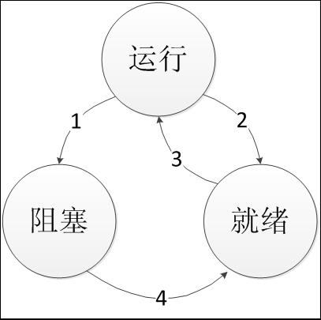

- 运行状态：占用 CPU 资源正在运行；
- 就绪状态：可运行，但因为其他进程正在运行而暂时停止；
- 阻塞状态： 进程等待某种条件，在条件满足之前无法执行 (比如等待用户键盘输入)

#### 进程之间的转换

进程的三种状态之间有四种可能的转换关系：

- 1.运行->阻塞（进程等待输入而进入阻塞）
- 4.阻塞->就绪（出现有效输入，但调度程度选择了另一个进程）
- 3.就绪->运行（调度程序选择这个进程）
- 2.运行->就绪（调度程序选择另一个进程）

### 进程与线程的区别与联系

**区别**

- **调度**：**线程作为调度和分配的基本单位，进程作为拥有资源的基本单位。**

  进程是操作系统的概念，每当我们执行一个程序时，对于操作系统来讲就创建了一个进程，在这个过程中，伴随着资源的分配和释放。**可以认为进程是程序的一次执行过程，是资源分配的最小单位**。**线程是进程中执行运算的最小单位，是进程中的一个实体，是操作系统调度的基本单位**。

- **并发性**：不仅进程之间可以并发执行，同一个进程的多个线程之间也可并发执行；

- **拥有资源**：线程自己不拥有系统资源，只拥有一点在运行中必不可少的资源，但它可与同属一个进程的其它线程共享进程所拥有的全部资源。进程所维护的是程序所包含的资源（静态资源）， 如：**地址空间，打开的文件句柄集，文件系统状态，信号处理handler等**；线程所维护的运行相关的资源（动态资源），如：**运行栈，调度相关的控制信息，待处理的信号集等**；

- **系统开销**：在创建或撤消进程时，由于系统都要为之分配和回收资源，导致系统的开销明显大于创建或撤消线程时的开销。但是进程有独立的地址空间，一个进程崩溃后，在保护模式下不会对其它进程产生影响，而线程只是一个进程中的不同执行路径。线程有自己的堆栈和局部变量，但线程之间没有单独的地址空间，一个进程死掉就等于所有的线程死掉，所以**多进程的程序要比多线程的程序健壮，但在进程切换时，耗费资源较大，效率要差一些。**

##### **联系**

- 一个线程只能属于一个进程，而一个进程可以有多个线程，但至少有一个线程；
- 资源分配给进程，同一进程的所有线程共享该进程的所有资源；
- 处理机分给线程，即**真正在处理机上运行的是线程**；
- 线程在执行过程中，需要协作同步。不同进程的线程间要利用消息通信的办法实现同步。

 #### 为什么有了多线程还要用多进程？ 

 进程是一个程序实体，多个程序需要多个进程。此外，进程地址空间相互隔离，安全。 

#### 为什么有了多进程还要多线程？

- **并发**：每个进程有一个地址空间和一个控制线程，多线程并行实体共享同一个地址空间和所有可用数据的能力，这是多进程模型（具有不同的地址空间）无法做到的（跨进程通信太麻烦）。
- **开销少**：线程比进程更轻量级，比进程更容易创建，更容易撤销。易于调度。
- 性能方面，若多个线程都是 CPU 密集型的，则不能获得性能上的增强，若是存在大量的计算和 IO 处理，多线程允许这些活动彼此重叠进行，从而会加快程序执行的速度。

[什么是CPU密集型、IO密集型？](https://www.cnblogs.com/aspirant/p/11441353.html)

[进程、线程和协程之间的区别和联系](https://blog.csdn.net/daaikuaichuan/article/details/82951084)

#### 什么时候用进程？什么时候用线程？

 进程与线程的选择取决以下几点：

- 需要频繁创建销毁的优先使用线程；因为对进程来说创建和销毁一个进程代价是很大的。
- 线程的切换速度快，所以在需要大量计算，切换频繁时用线程，还有耗时的操作使用线程可提高应用程序的响应
- 因为对CPU系统的效率使用上线程更占优，所以可能要发展到多机分布的用进程，多核分布用线程；
- 并行操作时使用线程，如C/S架构的服务器端并发线程响应用户的请求；
- **需要更稳定安全时，适合选择进程（一个进程的崩溃通常不会影响其他进程，但线程崩溃会导致整个进程崩溃）；需要速度时，选择线程更好**。 

[进程和线程的区别？什么时候用进程？什么时候用线程？](https://blog.csdn.net/hua15617159775/article/details/86889716)

#### 协程

- **协程是一种比线程更加轻量级的存在。**正如一个进程可以拥有多个线程一样，一个线程也可以拥有多个协程。
- 最重要的是，协程不是被操作系统内核所管理，而完全是由程序所控制（也就是在**用户态执行**）。这样带来的好处就是性能得到了很大的提升，不会像线程切换那样消耗资源。
- **极高的执行效率**：因为**子程序切换不是线程切换，而是由程序自身控制**，因此，**没有线程切换的开销**，和多线程比，线程数量越多，协程的性能优势就越明显；
- **不需要多线程的锁机制**：因为只有一个线程，也不存在同时写变量冲突，**在协程中控制共享资源不加锁**，只需要判断状态就好了，所以执行效率比多线程高很多。

#### 线程池的好处

- 第一：降低资源消耗。通过重复利用已创建的线程降低线程创建和销毁造成的消耗。 
- 第二：提高响应速度。当任务到达时，任务可以不需要等到线程创建就能执行。 
- 第三：提高线程的可管理性，线程是稀缺资源，如果无限制地创建，不仅会消耗系统资源，还会降低系统的稳定性，使用线程池可以进行统一分配、调优和监控。

#### 进程与程序的区别

- 进程是程序的一次运行活动，属于一种**动态**的概念。程序是一组有序的静态指令，是一种**静态**的概念。
- 一个进程可以执行一个或多个程序。
- 程序可以作为一种软件资源**长期**保持着,而进程则是一次执行过程,它是**暂时**的,是动态地产生和终止的。
- 进程更能真实地描述并发,而程序不能。
- 进程由程序和数据两部分组成，进程是竞争计算机系统有限资源的基本单位
- 进程具有创建其他进程的功能；而程序没有。
- 进程还具有**并发性和交往性**，这也与程序的**封闭性**不同

#### 线程同步的方式

（对共享内存进行访问的程序片段称作临界区域）

- 互斥量：采用互斥对象机制，只有拥有互斥对象的线程才有访问公共资源的权限。因为互斥对象只有一个，所以可以保证公共资源不会被多个线程同时访问。

  互斥量只有两种状态：0，1，其中0表示解锁。当一个线程需要访问临界区时，如果该互斥量当前是解锁的（即临界区可用），则调用线程可进入临界区。

- 信号量：它允许同一时刻多个线程访问同一资源，但是需要控制同一时刻访问此资源的最大线程数量。

- 事件（信号）：（允许一个线程在处理完一个任务后，主动唤醒另外一个线程执行任务）通过通知操作的方式来保持多线程同步，还可以方便的实现多线程优先级的比较操作。

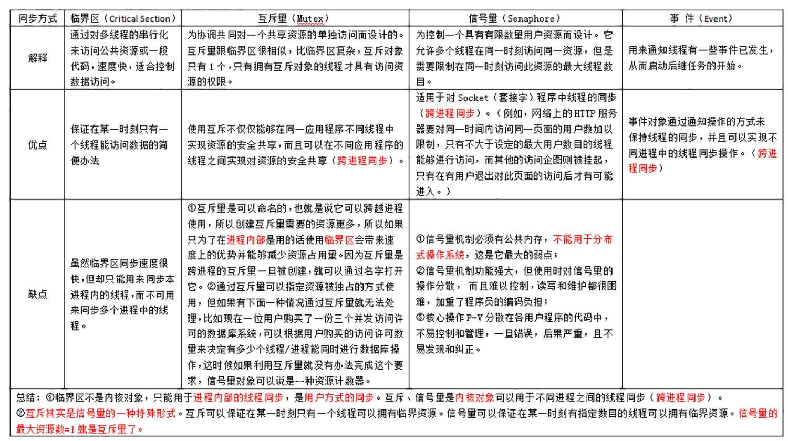

[进程与线程之间的一种简单解释](http://www.ruanyifeng.com/blog/2013/04/processes_and_threads.html)

#### 进程同步的方式

信号量，互斥量，管程，文件锁

### 进程/线程之间的亲缘性

亲缘性的意思是进程/线程只在某个cpu上运行（多核系统），比如：

```C
BOOL WINAPI SetProcessAffinityMask(
  _In_ HANDLE    hProcess,
  _In_ DWORD_PTR dwProcessAffinityMask
);
/*
dwProcessAffinityMask 如果是 0 , 代表当前进程只在cpu0 上工作;
如果是 0x03 , 转为2进制是 00000011 . 代表只在 cpu0 或 cpu1上工作;
*/
```

使用CPU亲缘性的好处：设置CPU亲缘性是为了防止进程/线程在CPU的核上频繁切换，从而避免因切换带来的CPU的L1/L2 cache失效，cache失效会降低程序的性能。

### 进程线程协程上下文切换的性能比较

进程上下文包含了进程执行所需要的所有信息。

用户地址空间：包括程序代码，数据，用户堆栈等；

控制信息：进程描述符，内核栈等；

硬件上下文：进程恢复前，必须装入寄存器的数据统称为硬件上下文。

线程上下文切换和进程上下文切换一个最主要的区别是线程的切换虚拟内存空间依然是相同的，但是进程切换是不同的。这两种上下文切换的处理都是通过操作系统内核来完成的。内核的这种切换过程伴随的最显著的性能损耗是将寄存器中的内容切换出。

另外一个隐藏的损耗是上下文的切换会扰乱处理器的缓存机制。简单的说，一旦去切换上下文，处理器中所有已经缓存的内存地址一瞬间都作废了。

**线程切换不需要切换数据区和堆，只需要切换线程自己的栈区域。**

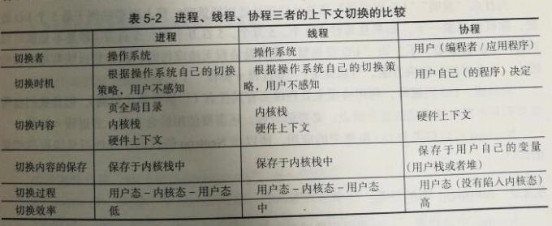

### 进程间的通信方式

(**Inter Process Communication,  IPC** 几种通信方式)

- **共享内存( shared memory )**：共享内存就是映射一段能被其他进程所访问的内存，这段共享内存由一个进程创建，但多个进程都可以访问。共享内存是最快的IPC方式，它是针对其他进程间通信方式运行效率低而专门设计的。它往往与其他通信机制，如信号量配合使用，来实现进程间的同步和通信。
  MySQL内部通信也使用了共享内存的方式，可以通过配置文件添加 --shared-memory实现
  
- **信号量( semophore )**： 信号量是一个计数器，可以用来控制多个进程对**共享资源**的访问。它常作为一种**锁机制**，防止某进程正在访问共享资源时，其他进程也访问该资源。因此，主要作为进程间以及同一进程内不同线程之间的同步手段。

- **信号 ( sinal )**：信号是一种比较复杂的通信方式，用于通知接收进程某个事件已经发生。除了用于进程通信外，进程还可以发送信号给进程本身。

- **管道( pipe )**：管道是一种**半双工的通信**方式，数据只能单向流动，而且只能在**具有亲缘关系**的进程间使用。进程的亲缘关系通常是指父子进程关系。

  管道是单向的、先进先出的、无结构的、固定大小的字节流，它把一个进程的标准输出和另一个进程的标准输入连接在一起。写进程在管道的尾端写入数据，读进程在管道的首端读出数据。数据读出后将从管道中移走，其它读进程都不能再读到这些数据。

  管道有三种：

  ① 普通管道：有两个限制：一是只支持半双工通信方式，即只能单向传输；二是只能在具有亲缘关系间的进程（父子进程）之间使用；

  ② 流管道：去除第一个限制，支持双向传输；

  ③ 命名管道：去除第二个限制，可以在不相关进程之间进行通信。

  - **命名管道 (named pipe)**： 命名管道也是半双工的通信方式，它克服了管道没有名字的限制，并且它允许**无亲缘关系进程间**的通信。命令管道在文件系统中有对应的文件名，命名管道通过命令mkfifo或系统调用mkfifo来创建。  Microsoft SQL Server数据库默认安装后的本地连接使用的就是命名管道。 MySQL在 Window环境下，如果需要两个进程在同一台服务器上通信可以使用命名管道，通过 --enable-named-pipe选项设置。

- **消息队列( message queue )**： 消息队列是由**消息的链表**结构实现，存放在内核中并由消息队列标识符标识。有足够权限的进程可以向队列中添加消息，被赋予读权限的进程则可以读走队列中的消息。消息队列克服了信号传递信息少、管道只能承载无格式字节流以及缓冲区大小受限等缺点。

- **套接字( socket )**： 也是一种进程间通信机制，与其他通信机制不同的是，它可用于不同机器间的进程通信。

[进程间通信——几种方式的比较和详细实例](https://blog.csdn.net/qq_38880380/article/details/78527115)

[关于 fork 和父子进程的理解](https://blog.csdn.net/helloo_jerry/article/details/77336724)

### 什么是缓冲区溢出？有什么危害？其原因是什么？

缓冲区溢出是指当计算机向缓冲区填充数据时超出了缓冲区本身的容量，溢出的数据覆盖在合法数据上。 

危害有以下两点：

- 程序崩溃，导致拒绝服务
- 跳转并且执行一段恶意代码

造成缓冲区溢出的主要原因是程序中没有仔细检查用户输入。

 [缓冲区溢出攻击](https://link.zhihu.com/?target=http%3A//www.cnblogs.com/fanzhidongyzby/archive/2013/08/10/3250405.html) 

## 作业(进程)调度算法

### **进程与作业的联系和区别**

**一、联系**

- 一个作业通常包括几个进程，几个进程共同完成一个任务，即作业。
- 用户提交作业以后，当作业被调度，系统会为作业创建进程，一个进程无法完成时，系统会为这个进程创建子进程。

**二、区别**

- 进程是一个程序在一个数据集上的一次执行，而作业是用户提交给系统的一个任务。

- 一个作业可由多个进程组成，且必须至少由一个进程组成，反过来则不成立。

### 调度算法

- **先来先服务调度算法(FCFS)**
  每次调度都是从后备作业队列中选择第一个进入该队列的作业，将它们调入内存，为它们分配资源、创建进程，然后放入就绪队列。

- **最短作业(进程)优先调度算法(SPF)（非抢占式）**
  最短作业优先(SJF)的调度算法总是选择剩余运行时间最短的那个作业(进程)进行。缺点:长作业的运行得不到保证。
  
- **最短剩余时间优化算法（抢占式）**

  先运行剩余时间最短的那个进程A，此时，如果来了一个新的进程B，剩余时间最短，当前运行的进程A就被挂起，而运行新的进程B。这种方式可以使新的短作业获得良好的服务。

- **轮转调度（RR）**
  在早期的时间片轮转法中，系统将所有的就绪进程按先来先服务的原则排成一个队列。每个进程被分配一个时间段，称为时间片。每次调度时，把CPU分配给队首进程，并令其执行一个时间片。如果在时间片结束时，该进程还在运行，则将剥夺CPU并分配给另一个进程。如果该进程在时间片结束前阻塞或结束，则CPU立即进行切换。

- **多级反馈队列调度算法**
  它是目前被公认的一种较好的进程调度算法。

  (1) 应设置多个就绪队列，并为各个队列赋予不同的优先级。第一个队列的优先级最高，第二个队列次之，其余各队列的优先权逐个降低。该算法赋予各个队列中进程执行时间片的大小也各不相同，在优先权愈高的队列中，为每个进程所规定的执行时间片就愈小。例如，第二个队列的时间片要比第一个队列的时间片长一倍，……，第i+1个队列的时间片要比第i个队列的时间片长一倍。

  (2) 当一个新进程进入内存后，首先将它放入第一队列的末尾，按FCFS原则排队等待调度。当轮到该进程执行时，如它能在该时间片内完成，便可准备撤离系统；如果它在一个时间片结束时尚未完成，调度程序便将该进程转入第二队列的末尾，再同样地按FCFS原则等待调度执行；如果它在第二队列中运行一个时间片后仍未完成，再依次将它放入第三队列，……，如此下去，当一个长作业(进程)从第一队列依次降到第n队列后，在第n 队列便采取按时间片轮转的方式运行。

  (3) 仅当第一队列空闲时，调度程序才调度第二队列中的进程运行；仅当第1～(i-1)队列均空时，才会调度第i队列中的进程运行。如果处理机正在第i队列中为某进程服务时，又有新进程进入优先权较高的队列(第1～(i-1)中的任何一个队列)，则此时新进程将抢占正在运行进程的处理机，即由调度程序把正在运行的进程放回到第i队列的末尾，把处理机分配给新到的高优先权进程。

[几个常用的操作系统进程调度算法](http://blog.csdn.net/luyafei_89430/article/details/12971171)

## 死锁

**死锁**：是指两个或两个以上的进程在执行过程中，**由于竞争资源或者由于彼此通信而造成的一种阻塞的现象**，若无外力作用，它们都将无法推进下去。

（在两个或者多个并发进程中，如果每个进程持有某种资源而又等待其它进程释放它们现在保持着的资源，在未改变这种状态之前都不能向前推进，称这一组进程产生了**死锁**。通俗的讲就是两个或多个进程无限期的阻塞、相互等待的一种状态）

**活锁**：指的是任务或者执行者没有被阻塞，由于某些条件没有满足，导致一直重复尝试，失败，尝试，失败。

### 死锁产生的条件？

 死锁产生的四个条件（四个条件必定是同时满足的，有一个条件不成立，则不会产生死锁）

- 互斥条件：一个资源一次只能被一个进程使用；
- 请求与保持条件(占有且等待)：一个进程因请求资源而阻塞时，对已获得资源保持不放；
- 不剥夺条件：进程获得的资源，在未完全使用完之前，不能被其它进程强行剥夺；
- 循环等待条件：死锁发生时，系统中一定由两个或两个以上的进程组成的一个环路，该环路中的每一个进程都在都在等待着下一个进程所占有的资源

当以上四个条件均满足，必然会造成死锁，发生死锁的进程无法进行下去，它们所持有的资源也无法释放。这样会导致CPU的吞吐量下降。所以死锁情况是会浪费系统资源和影响计算机的使用性能的。那么，解决死锁问题就是相当有必要的了 。

### 怎么解决死锁

四点：预防死锁、避免死锁、检测死锁、解除死锁 

#### 死锁预防

死锁预防——确保系统永远不会进入死锁状态。

产生死锁需要四个条件，那么，只要这四个条件中至少有一个条件得不到满足，就不可能发生死锁了。由于互斥条件是非共享资源所必须的，不仅不能改变，还应加以保证，所以，主要是破坏产生死锁的其他三个条件。

**破坏请求与保持（占有且等待）条件**

方法1：所有的进程在开始运行之前，必须一次性地申请其在整个运行过程中所需要的全部资源， 这样就不会再有请求了 。
优点：简单易实施且安全。

- 缺点：因为某项资源不满足，进程无法启动，而其他已经满足了的资源也不会得到利用，严重降低了资源的利用率，造成资源浪费。使进程经常发生饥饿现象。

方法2：该方法是对第一种方法的改进，允许进程只获得运行初期需要的资源，便开始运行，在运行过程中逐步释放掉分配到的已经使用完毕的资源，然后再去请求新的资源。这样的话，资源的利用率会得到提高，也会减少进程的饥饿问题。

**破坏不剥夺条件**

当一个已经持有了一些资源的进程在提出新的资源请求没有得到满足时，它必须释放已经保持的所有资源，待以后需要使用的时候再重新申请。这就意味着进程已占有的资源会被短暂地释放或者说是被抢占了。

该种方法实现起来比较复杂，且代价也比较大。释放已经保持的资源很有可能会导致进程之前的工作失效等，反复的申请和释放资源会导致进程的执行被无限的推迟，这不仅会延长进程的周转周期，还会影响系统的吞吐量。

**破坏循环等待条件**

可以通过定义资源类型的线性顺序来预防，可将每个资源编号，当一个进程占有编号为 i 的资源时，那么它下一次申请资源只能申请编号大于 i 的资源。【哲学家就餐问题

这样虽然避免了循环等待，但是这种方法是比较低效的，资源的执行速度会变慢，并且可能在没有必要的情况下拒绝资源的访问，比如说，进程 3 想要申请资源 1，如果资源 1 并没有被其他进程占有，此时将它分配个进程 3 是没有问题的，但是为了避免产生循环等待，该申请会被拒绝，这样就降低了资源的利用率。

#### 死锁的避免

死锁的避免—— 在使用前进行判断，只允许不会产生死锁的进程申请资源 。

**银行家算法**：该算法需要检查申请者对资源的最大需求量，如果系统现存的各类资源可以满足申请者的请求，就满足申请者的请求。这样申请者就可很快完成其计算，然后释放它占用的资源，从而保证了系统中的所有进程都能完成，所以可避免死锁的发生。

#### 死锁的检测

1. 首先为每个进程和每个资源指定一个唯一的号码；
2. 然后建立资源分配表和进程等待表。

略，面试不会问。

#### 死锁的解除

一旦检测出死锁，就应立即釆取相应的措施，以解除死锁。
死锁解除的主要方法有：

- **资源剥夺法**。挂起某些死锁进程，并抢占它的资源，将这些资源分配给其他的死锁进程。但应防止被挂起的进程长时间得不到资源，而处于资源匮乏的状态。

- **撤销进程法**。强制撤销部分、甚至全部死锁进程并剥夺这些进程的资源。撤销的原则可以按进程优先级和撤销进程代价的高低进行。

  终止所有的死锁进程。这种方式简单粗暴，但是代价很大，很有可能会导致一些已经运行了很久的进程前功尽弃。

  逐个终止进程，直至死锁状态解除。该方法的代价也很大，因为每终止一个进程就需要使用死锁检测来检测系统当前是否处于死锁状态。

- **进程回退法**。让一（多）个进程回退到足以回避死锁的地步，进程回退时自愿释放资源而不是被剥夺。要求系统保持进程的历史信息，设置还原点。

[死锁的四个必要条件和解决办法](https://blog.csdn.net/guaiguaihenguai/article/details/80303835)

[4 个生活场景详解 BAT 面试中的死锁问题](https://zhuanlan.zhihu.com/p/78135409)

## **什么是活锁？与死锁的区别？**

活锁指的是 **任务或者执行者没有被阻塞，由于某些条件没有满足，导致一直重复尝试，失败，尝试，失败**。 活锁和死锁的区别在于，处于活锁的实体是在不断的改变状态，所谓的“活”， 而处于死锁的实体表现为等待；**活锁有可能自行解开，死锁则不能**。

活锁应该是一系列进程在轮询地等待某个不可能为真的条件为真。活锁的时候进程是不会blocked，这会导致耗尽CPU资源。

为解决活锁可以引入一些随机性，例如如果检测到冲突，那么就暂停随机的一定时间进行重试。这回大大减少碰撞的可能性。典型的例子是以太网的CSMA/CD检测机制。

## 虚拟内存

**虚拟内存** 使得应用程序认为它拥有连续的可用的内存（一个连续完整的地址空间），而实际上，它通常是被分隔成多个物理内存碎片，还有部分暂时存储在外部磁盘存储器上，在需要时进行数据交换。与没有使用虚拟内存技术的系统相比，使用这种技术的系统使得大型程序的编写变得更容易，对真正的物理内存（例如RAM）的使用也更有效率。目前，大多数操作系统都使用了虚拟内存，如Windows家族的“虚拟内存”；Linux的“交换空间”等。

参考[什么是虚拟内存？| 一分钟系列](https://zhuanlan.zhihu.com/p/85760403)

**物理内存**:在应用中，自然是顾名思义，物理上，真实的插在板子上的内存是多大就是多大了。而在CPU中的概念，物理内存就是CPU的地址线可以直接进行寻址的内存空间大小。

### 虚拟地址、逻辑地址、线性地址、物理地址的区别。 

**虚拟地址**：指的是由程序产生的由段选择符和段内偏移地址两个部分组成的地址。为什么叫它是虚拟的地址呢？因为这两部分组成的地址并没有直接访问物理内存，而是要通过分段地址的变换机构处理或映射后才会对应到相应的物理内存地址。

**逻辑地址**：指由程序产生的与段相关的偏移地址部分。不过有些资料是直接把逻辑地址当成虚拟地址，两者并没有明确的界限。

**线性地址**：指的是虚拟地址到物理地址变换之间的中间层，是处理器可寻指的内存空间（称为线性地址空间）中的地址。程序代码会产生逻辑地址，或者说是**段中的偏移地址，加上相应段的基地址就生成了一个线性地址**。如果启用了分页机制，那么线性地址可以再经过变换产生物理地址。若是没有采用分页机制，那么线性地址就是物理地址。

**物理地址**：指的是现在CPU外部地址总线上的寻址物理内存的地址信号，是地址变换的最终结果！

### 分页和分段

- 段是信息的逻辑单位，它是根据用户的需要划分的，因此段对用户是可见的 ；页是信息的物理单位，是为了管理主存的方便而划分的，对用户是透明的。
- 段的大小不固定，有它所完成的功能决定；页大大小固定，由系统决定
- 段向用户提供二维地址空间；页向用户提供的是一维地址空间
- 段是信息的逻辑单位，便于存储保护和信息的共享，页的保护和共享受到限制。

```
在网上找到了一个比较形象的比喻，挺不错的，呵呵，列出来如下：
 
打个比方，比如说你去听课，带了一个纸质笔记本做笔记。笔记本有100张纸，课程有语文、数学、英语三门，对于这个笔记本的使用，为了便于以后复习方便，你可以有两种选择。

第一种是，你从本子的第一张纸开始用，并且事先在本子上做划分：第2张到第30张纸记语文笔记，第31到60张纸记数学笔记，第61到100张纸记英语笔记，最后在第一张纸做个列表，记录着三门笔记各自的范围。这就是分段管理，第一张纸叫段表。

第二种是，你从第二张纸开始做笔记，各种课的笔记是连在一起的：第2张纸是数学，第3张是语文，第4张英语……最后呢，你在第一张纸做了一个目录，记录着语文笔记在第3、7、14、15张纸……，数学笔记在第2、6、8、9、11……，英语笔记在第4、5、12……。这就是分页管理，第一张纸叫页表。你要复习哪一门课，就到页表里查寻相关的纸的编号，然后翻到那一页去复习 
```

[分段和分页](https://blog.csdn.net/wangrunmin/article/details/7967293)

## 磁盘调度算法：

1.**先来先服务（FCFS）**，按访问请求到达的先后顺序服务。简单，公平，但是效率不高，相临两次请求可能会造成最内到最外柱面寻道，使磁头反复移动，增加了服务时间，对机器不利。

2.**最短寻道时间优先(SSTF)**，优先选择距当前磁头最近的访问请求进行服务，主要考虑寻道优先。改善了磁盘平均服务时间，但是造成某些访问请求长期等待得不到服务。

3.**扫描算法（SCAN）**，当设备无访问请求时，磁头不动；当有访问请求时，磁头按一个方向移动，在移动过程中对遇到的访问请求进行服务，然后判断该方向上是否还有访问请求，如果有则继续.

4.**循环扫描算法（CSCAN）**：循环扫描调度算法是在扫描算法的基础上改进的。磁臂改为单项移动，由外向里。当前位置开始沿磁臂的移动方向去选择离当前磁臂最近的哪个柱面的访问者。如果沿磁臂的方向无请求访问时，再回到最外，访问柱面号最小的作业请求。

[节选自路人甲: 常见面试题整理--操作系统篇（每位开发者必备）](https://zhuanlan.zhihu.com/p/23755202?refer=passer)

[内核中各种同步机制（自旋锁大内核锁顺序锁等）](https://blog.csdn.net/FreeeLinux/article/details/54267446)

## 文件

### read

read函数只是一个通用的读文件设备的接口。是否阻塞需要由设备的属性和设定所决定。

一般来说，读字符终端、网络的socket描述字，管道文件等，这些文件的缺省read都是阻塞的方式。

如果是读磁盘上的文件，一般不会是阻塞方式的。但使用锁和fcntl设置取消文件O_NOBLOCK状态，也会产生阻塞的read效果。
