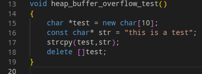
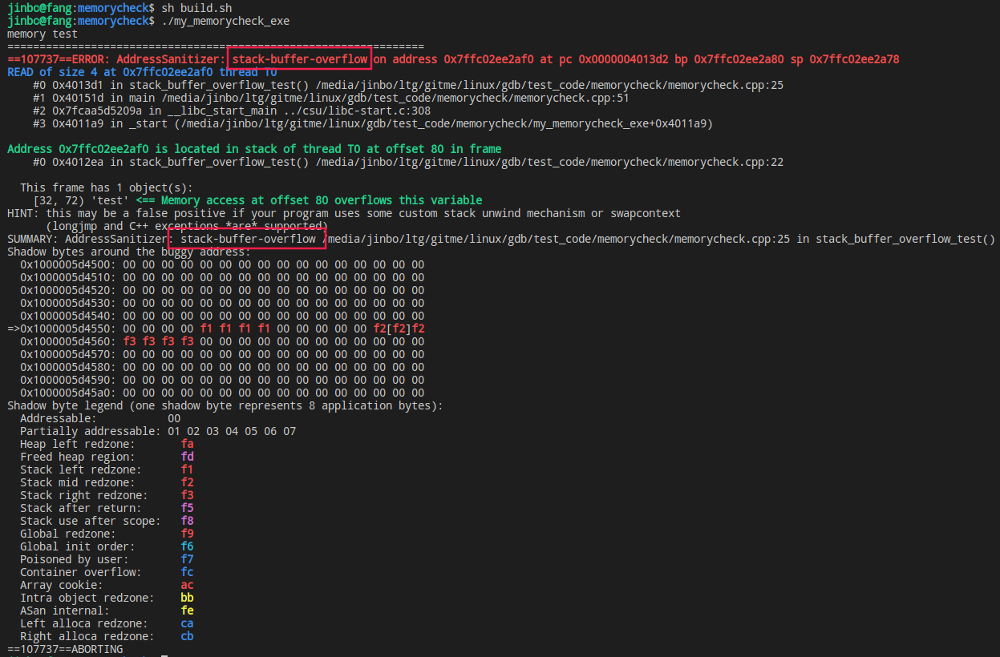
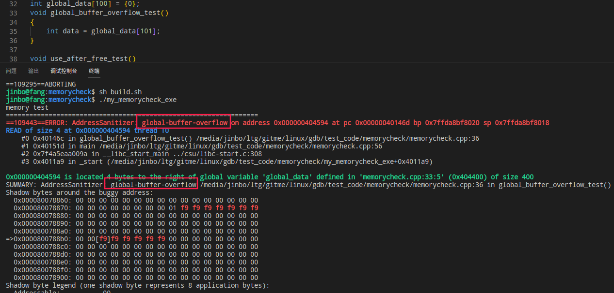
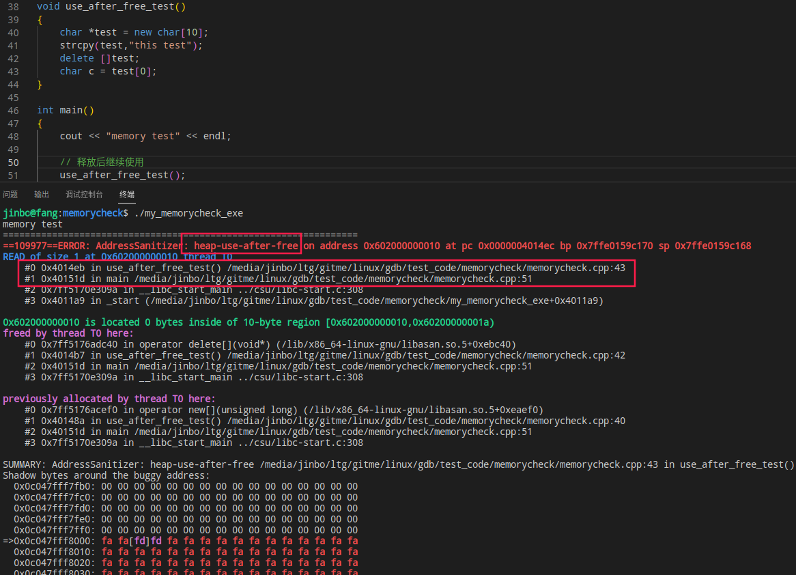

## 基本操作

### 编译

使用gdb，编译时前面需要加-g参数

```shell
g++ -g chapter_3.3.cpp -o main -std=c++14 -lpthread
```

### 查看断点

info break，其中info 和 break分别可以简写为 i 和 b

则 `i b` 就可以查看断点信息

### 显示源代码

- `set listsize n`：设置每次显示的代码行数。如 n = 20，则显示断点处的前后10行（只对当前gdb有效） 
- `list 或者 l`：显示当前暂停处的源代码，继续按l，则显示后面n行的源代码
- `l -`：注意空格，显示当前暂停处的前n行源代码
- `l 函数名`：显示函数处的源代码
- `l 文件名:行号` ：显示文件的指定行数的源代码，如果是当前文件，可以省略文件名即 `l 行号`
- `search/forward-search 正则表达式`：向后/向前搜索源代码
- `layout src`：用于显示源代码窗口。其他的窗口如汇编是`layout asm`，一般用不上。想关闭所有的窗口使用`tui disable`。刷新屏幕`refresh`，更新源代码窗口`update`。

## 断点管理

### 为文件设置断点

```shell
(gdb) break chapter_3.3.cpp:249
Breakpoint 1 at 0x401ae4: file chapter_3.3.cpp, line 249.
```

运行到断点后按l可以查看源代码，可多次按l，用 p 命令来查看变量的值，或者指针指向的对象里的值

```shell
Breakpoint 1, main (argc=1, argv=0x7fffffffca38) at chapter_3.3.cpp:249
249             node_head = (struct NODE *)malloc(sizeof(NODE));
(gdb) l
244             printf("传入的参数信息为:\n");
245             for (int i = 0; i < argc; i++)
246             {
247                     printf("参数 %d=%s\n", i, argv[i]);
248             }
249             node_head = (struct NODE *)malloc(sizeof(NODE));
250             node_head->next = node_head->prev = NULL;
251             printf("会员管理系统\n1:录入会员信息\nq:退出\n");
252             while (true)
253             {
(gdb) p
The history is empty.
(gdb) p argc
$1 = 1
(gdb) p argv
$2 = (char **) 0x7fffffffca38
(gdb) p argv[0]
$3 = 0x7fffffffcd94 "/home/jinbo/gitme/linux/gdb/book_debug/chapter_3.3/myexe"
(gdb) p
$4 = 0x7fffffffcd94 "/home/jinbo/gitme/linux/gdb/book_debug/chapter_3.3/myexe"
```

```shell
Breakpoint 2, add_member () at chapter_3.3.cpp:20
20              struct NODE *new_node = (NODE *)malloc(sizeof(NODE));
(gdb) p new_node
$6 = (NODE *) 0x41b330
(gdb) p *new_node
$7 = {ID = 4211456, Name = "\000\000\000\000\n\000\000\000d", '\000' <repeats 11 times>, "Q", '\000' <repeats 18 times>, age = 0, prev = 0x0, next = 0x0}
(gdb) p node_head
$8 = (NODE *) 0x41b350
(gdb) p *node_head
$9 = {ID = 0, Name = '\000' <repeats 39 times>, age = 0, prev = 0x41b7b0, next = 0x41b7b0}
(gdb) p *node_head->next
$10 = {ID = 0, Name = "qw", '\000' <repeats 37 times>, age = 12, prev = 0x41b350, next = 0x0}
```

### 为函数设置断点

break 或者 b 加函数名

```shell
# break 或者 b 加函数名
```

这会给所有的同名函数设置断点，即使它们的参数不同，作用域是全局或者属于不同的类，或者是虚函数。

如果想为指定函数设置断点，可以写清楚类名和参数。如：

```shell
b test_1::test_fun 	# 指定类内的函数
b test_fun(int)  	# 全局的带int形参的函数
```

### 使用正则表达式设置断点

`rb 表达式 或者 rbreak 表达式`

```shell
(gdb) rb test_fun*
Note: breakpoints 3, 4, 5, 6, 7 and 8 also set at pc 0x401d68.
Breakpoint 9 at 0x401d68: file chapter_3.3.cpp, line 54.
void test_1::test_fun();
Note: breakpoints 3, 4, 5, 6, 7 and 8 also set at pc 0x401e18.
Breakpoint 10 at 0x401e18: file chapter_3.3.cpp, line 72.
void test_2::test_fun();
Breakpoint 11 at 0x401dfe: file chapter_3.3.cpp, line 68.
void test_2::test_fun2();
Note: breakpoints 3, 6, 7 and 8 also set at pc 0x401428.
Breakpoint 12 at 0x401428: file chapter_3.3.cpp, line 81.
void test_fun(char const*);
Note: breakpoints 3, 6, 7 and 8 also set at pc 0x401405.
Breakpoint 13 at 0x401405: file chapter_3.3.cpp, line 77.
void test_fun(int);
Breakpoint 14 at 0x401445: file chapter_3.3.cpp, line 85.
void test_fun_x();
```

### 通过偏移量设置断点

想在当前断点的前后某一行设置断点，使用b加减偏移量

```shell
b +偏移量
b -偏移量
```

### 条件断点

b 断点 条件

```shell
# 当 i == 900时，命中断点
(gdb) b chapter_3.3.cpp:91 if i == 900
Breakpoint 1 at 0x40146a: file chapter_3.3.cpp, line 91.
省略很多...
i is 895
i is 896
i is 897
i is 898
i is 899

Breakpoint 1, test_loop () at chapter_3.3.cpp:91
91                      printf("i is %d\n", i);
(gdb) l
86      }
87      void test_loop()
88      {
89              for (int i = 0; i < 1000; i++)
90              {
91                      printf("i is %d\n", i);
92              }
93              printf("exit the loop\n");
94      }
95
(gdb) p i  # 查看变量 i 的值确实是 900
$1 = 900
```

同样的可以为函数设置条件断点

`b cond_fun_test if a== 10`

如何希望在str等于"test"的时候命中断点，可以设置为

`b cond_fun_test if str=="test"`

```shell
(gdb) b cond_fun_test if a== 10
Breakpoint 1 at 0x4014a0: file chapter_3.3.cpp, line 98.
(gdb) r
Starting program: 
省略很多...

Breakpoint 1, cond_fun_test (a=10, str=0x40410c "test") at chapter_3.3.cpp:98
98              int x = a * a;
(gdb) l
93              printf("exit the loop\n");
94      }
95
96      void cond_fun_test(int a, const char *str)
97      {
98              int x = a * a;
99              printf("a is %d,x is %d,str is %s\n", a, x, str);
100             x *= 2;
101             printf("quit fun\n");
102     }
(gdb) p a
$1 = 10
```

### 临时断点

`tbreak 断点 或者 tb 断点`：这个断点是临时的，只会命中一次，然后就会被删除，后续多次调用也不会再次命中

### 数据断点

### 禁用/启用断点

- disable + 断点编号。断点编号可以是一个范围，例如 disable 2-4，禁用断点2~4
- enable + 断点编号
- info b：查看断点信息

```shell
(gdb) b test_fun
Breakpoint 1 at 0x401405: test_fun. (4 locations)
(gdb) info b
Num     Type           Disp Enb Address            What
1       breakpoint     keep y   <MULTIPLE>         
1.1                         y     0x0000000000401405 in test_fun(int) at chapter_3.3.cpp:77
1.2                         y     0x0000000000401428 in test_fun(char const*) at chapter_3.3.cpp:81
1.3                         y     0x0000000000401d6e in test_1::test_fun() at chapter_3.3.cpp:54
1.4                         y     0x0000000000401e1e in test_2::test_fun() at chapter_3.3.cpp:72
(gdb) disable 1.3
(gdb) info b
Num     Type           Disp Enb Address            What
1       breakpoint     keep y   <MULTIPLE>         
1.1                         y     0x0000000000401405 in test_fun(int) at chapter_3.3.cpp:77
1.2                         y     0x0000000000401428 in test_fun(char const*) at chapter_3.3.cpp:81
1.3                         n     0x0000000000401d6e in test_1::test_fun() at chapter_3.3.cpp:54
1.4                         y     0x0000000000401e1e in test_2::test_fun() at chapter_3.3.cpp:72
(gdb) enable 1.3
(gdb) info b
Num     Type           Disp Enb Address            What
1       breakpoint     keep y   <MULTIPLE>         
1.1                         y     0x0000000000401405 in test_fun(int) at chapter_3.3.cpp:77
1.2                         y     0x0000000000401428 in test_fun(char const*) at chapter_3.3.cpp:81
1.3                         y     0x0000000000401d6e in test_1::test_fun() at chapter_3.3.cpp:54
1.4                         y     0x0000000000401e1e in test_2::test_fun() at chapter_3.3.cpp:72
```

### 启用断点一次

`enable once 断点编号`

即第一次命中会暂停，后续不再命中，用info b去查看，发现Enb状态从 y 变成 n

### 启用断点但命中一次后就删除

相当于把一个被禁用的断点转换成一个临时断点。

`enable delete 断点编号`

### 启用断点并命中N次

即该断点从禁用状态切换到启用状态后，命中N次后，该断点就会自动被禁用

`enable count 数量 断点编号`

```shell
enable count 5 1 # 重新启用断点 1，命中 5 次后禁用 
```

### 忽略断点前N次命中

`ignore 断点编号 次数`

如希望对某个函数的前7次调用都忽略，从第8次开始都开始命中，假设断点编号是1，用命令如下：

```shell
ignore 1 7
```

### 删除断点

- delete：删除所有断点
- delete 编号1 [编号2] ... [编号N]：删除指定编号断点
- delete m-n a-b：删除多个范围的断点，如从m~n，a~b
- clear test_fun：删除函数断点，多个同名函数都会被删除
- clear xxx.cpp:108：删除xxx.cpp的第108行的断点

## 程序执行

### 启用程序和继续执行程序

run 或者 r 是启动程序，只会执行一次。如果程序带有参数，再 r 后加参数，如

```shell
# 用 gdb 启动的时候不需要加参数
r -p 19668 -i 1 -l 0 -d mlx5_0 192.168.49.230
```

或者在运行可执行文件的时候加参数，如

```shell
# 用 gdb 启动的时候加参数
gdb --args ./myexe -p 19668 -i 1 -l 0 -d mlx5_0 192.168.49.230
```

continue 或者 c 是遇到断点后继续执行，直到遇到下一个断点为止。

continue n，可以设置跳过当前断点n次，注意是当前断点。如某一个for循环里执行test_fun_x函数10次，第一次命中后，想忽略掉接下来的6次命中，可以使用命令continue 7

```shell
(gdb) c 7
Will ignore next 6 crossings of breakpoint 6.  Will ignore next 6 crossings of breakpoint 7.  Continuing.
execute test_fun_x
test fun x
execute test_fun_x
test fun x
execute test_fun_x
test fun x
execute test_fun_x
test fun x
execute test_fun_x
test fun x
execute test_fun_x
test fun x
execute test_fun_x
test fun x

Breakpoint 6, main (argc=1, argv=0x7fffffffca38) at chapter_3.3.cpp:233
233                     printf("execute test_fun_x\n");
(gdb) c
Continuing.
execute test_fun_x
test fun x

Breakpoint 6, main (argc=1, argv=0x7fffffffca38) at chapter_3.3.cpp:233
233                     printf("execute test_fun_x\n");
(gdb) c
Continuing.
execute test_fun_x
test fun x

Breakpoint 6, main (argc=1, argv=0x7fffffffca38) at chapter_3.3.cpp:233
233                     printf("execute test_fun_x\n");
(gdb) c
Continuing.
execute test_fun_x
test fun x
i is 10
```

可以看到执行了10次循环，其中在第一次命中后剩下的6次被忽略。

### 单步执行

`setp 或者 s`

### 逐过程执行

`next 或者 n`

## 查看变量

### 查看变量类型

`p [可选参数] 变量或者类型`：

其中可选参数可以是

`/o` 打印结构体或类字段的偏移量和大小 

`/m` 只显示成员变量 

`/M`只显示成员方法

```shell
(gdb) ptype TEST_NODE 
type = struct TEST_NODE {
    char gender[3];
    int ID;
    char name[7];
}
(gdb) ptype /o TEST_NODE 
/* offset    |  size */  type = struct TEST_NODE {
/*    0      |     3 */    char gender[3];
/* XXX  1-byte hole */
/*    4      |     4 */    int ID;
/*    8      |     7 */    char name[7];
/* XXX  1-byte padding */

                           /* total size (bytes):   16 */
                         }
(gdb) ptype test_2
type = class test_2 : public test_1 {
  public:
    test_2(void);
    ~test_2();
    virtual void test_fun2(void);
    virtual void test_fun(void);
}
```

### 查看函数的参数、变量值以及修改变量值

`info args 或者 i args`

`print 变量名 或者 p变量名`：用于查看变量值。

```shell
Breakpoint 3, cond_fun_test (a=10, str=0x40410c "test") at chapter_3.3.cpp:100
100             x *= 2;
(gdb) l
95
96      void cond_fun_test(int a, const char *str)
97      {
98              int x = a * a;
99              printf("a is %d,x is %d,str is %s\n", a, x, str);
100             x *= 2;
101             printf("quit fun\n");
102     }
103
104     void print_arr_test()
(gdb) n
101             printf("quit fun\n");
(gdb) i args    # 打印函数形参
a = 10
str = 0x40410c "test"
(gdb) p x # 打印调试的变量值
$1 = 200
```

如果想要修改变量的值，则 `p 变量名=xxx`就修改了变量值。如下面的例子，第一次i = 0，设置i=8后，再执行一次，打印i=9

```shell
Breakpoint 1, main (argc=1, argv=0x7fffffffca38) at chapter_3.3.cpp:233
233                     printf("execute test_fun_x: i = %d\n", i);
(gdb) l
229             //test_loop();
230
231             for (int i = 0; i < 10; i++)
232             {
233                     printf("execute test_fun_x: i = %d\n", i);
234                     test_fun_x();
235             }
236
237             test_fun(10);
238             test_fun("test");
(gdb) p i
$6 = 0
(gdb) n
execute test_fun_x: i = 0
234                     test_fun_x();
(gdb) p i=8
$7 = 8
(gdb) c
Continuing.
test fun x

Breakpoint 1, main (argc=1, argv=0x7fffffffca38) at chapter_3.3.cpp:233
233                     printf("execute test_fun_x: i = %d\n", i);
(gdb) n
execute test_fun_x: i = 9
234                     test_fun_x();
```

### 查看结构体/类的值

如 new_node 是一个指针，则 p new_node只会显示地址。p *new_node才会显示内容。

`set print pretty`：让数据成员的显示更好看一些

`set print null-stop`：输出字符串时不显示空字符

```shell
Breakpoint 2, add_member () at chapter_3.3.cpp:41
41              printf("添加新会员成功\n");
(gdb) l
36              printf("请输入会员姓名,然后按回车\n");
37              scanf("%s", new_node->Name);
38              printf("请输入会员年龄,然后按回车\n");
39              scanf("%d", &new_node->age);
40
41              printf("添加新会员成功\n");
42      }
43      class test_1
44      {
45      public:
(gdb) p *new_node
$9 = {ID = 0, Name = "qqq", '\000' <repeats 36 times>, age = 12, prev = 0x41b350, next = 0x0}
(gdb) set print pretty
(gdb) p *new_node
$10 = {
  ID = 0, 
  Name = "qqq", '\000' <repeats 36 times>, 
  age = 12, 
  prev = 0x41b350, 
  next = 0x0
}
(gdb) set print null-stop
(gdb) p *new_node
$11 = {
  ID = 0, 
  Name = "qqq", 
  age = 12, 
  prev = 0x41b350, 
  next = 0x0
}
```

### 查看数组

`set print array on`：使用该命令更好看的显示数组，其中 on 可以省略。

```shell
Breakpoint 3, print_arr_test () at chapter_3.3.cpp:106
106             int iarr[] = {0, 1, 2, 3, 4, 5, 6, 7, 8, 9};
(gdb) l
101             printf("quit fun\n");
102     }
103
104     void print_arr_test()
105     {
106             int iarr[] = {0, 1, 2, 3, 4, 5, 6, 7, 8, 9};
107             const char *strarr[] = {"this", "is", "a", "test", "string"};
108             for (unsigned long i = 0; i < sizeof(iarr) / sizeof(int); i++)
109             {
110                     printf("%d ", iarr[i]);
(gdb) n
107             const char *strarr[] = {"this", "is", "a", "test", "string"};
(gdb) n
108             for (unsigned long i = 0; i < sizeof(iarr) / sizeof(int); i++)
(gdb) p iarr 
$12 = {0, 1, 2, 3, 4, 5, 6, 7, 8, 9}
(gdb) p strarr 
$13 = {0x404102 "this", 0x404107 "is", 0x40410a "a", 0x40410c "test", 0x404111 "string"}
(gdb) set print array on
(gdb) p iarr 
$14 =   {0,
  1,
  2,
  3,
  4,
  5,`thread apply 1 2 i locals`
  6,
  7,
  8,
  9}
(gdb) p strarr 
$15 =   {0x404102 "this",
  0x404107 "is",
  0x40410a "a",
  0x40410c "test",
  0x404111 "string"}
```

### 自动显示变量的值

每次用print 或者 p显示变量太麻烦，可以用`display 变量名`，当程序暂停时自动显示变量值。

- `i dispaly`：可以查看有哪些变量是自动显示的

- undisplay：禁用所有的自动显示
- disable display 序号：禁用指定的序号的自动显示
- enable display 序号：重新显示指定的序号的自动显示
- delete display：删除所有的自动显示
- delete display 序号：删除指定序号的自动显示

```shell
(gdb) i display
Auto-display expressions now in effect:
Num Enb Expression
1:   y  strarr (cannot be evaluated in the current context)
2:   y  i
```

### 查看内存信息

`x /选项 地址`：可以查看某个地址处的值。其实用 p 查看更方便一些，只不过用x查看可以用【选项】格式化输出。

```shell
# 处理数字
(gdb) x /4x &number
0x7fffffffc8c4: 0x78    0x56    0x34    0x12
(gdb) p &number
$3 = (int *) 0x7fffffffc8c4
(gdb) x 0x7fffffffc8c4
0x7fffffffc8c4: 0x78
(gdb) x /4x 0x7fffffffc8c4
0x7fffffffc8c4: 0x78    0x56    0x34    0x12
# 处理字符串
(gdb) x str
0x40410c:       0x74736574
(gdb) p str
$1 = 0x40410c "test"
(gdb) x /s str
0x40410c:       "test"
```

当然用x命令可以查看结构体和类的内存对齐问题，暂略。

## 调用堆栈

每一个栈帧包含调用函数的参数、局部变量。所有栈帧组成调用栈，或称为调用堆栈。

### 查看栈帧

`backtrace 或者 bt`：打印调用栈，即打印全部栈帧。

`bt n`：打印范围`0~n-1`的栈帧。

`bt m~n`：打印范围`m~n-1`的栈帧

示例：在 call_fun_test_2 处打断点，命中后用 backtrace 打印调用栈。可以看出mian函数(230行)调用call_fun_test_1(165行)，再调用call_fun_test_2(154行)。

```shell
Breakpoint 1, call_fun_test_2 (level=2, str=0x404169 "call_fun_test_2") at base.cpp:154
154             int number = 102;
(gdb) l
149             delete node;
150     }
151
152     int call_fun_test_2(int level, const char *str)
153     {
154             int number = 102;
155             const char *name = "call_fun_test_2";
156             printf("level is %d,str is %s,name is %s\n", level, str, name);
157             return 2;
158     }
(gdb) backtrace
#0  call_fun_test_2 (level=2, str=0x404169 "call_fun_test_2") at base.cpp:154
#1  0x00000000004016c4 in call_fun_test_1 (level=1, str=0x4041a2 "call_fun_test_1") at base.cpp:165
#2  0x00000000004019cf in main (argc=1, argv=0x7fffffffca28) at base.cpp:230
(gdb) l 165
160     int call_fun_test_1(int level, const char *str)
161     {
162             int number = 101;
163             const char *name = "call_fun_test_1";
164             printf("level is %d,str is %s,name is %s\n", level, str, name);
165             call_fun_test_2(level + 1, "call_fun_test_2");
166             return 1;
167     }
168(gdb) b call_fun_test_2
Breakpoint 1 at 0x401646: file base.cpp, line 154.
(gdb) r
Starting program: /media/jinbo/ltg/gitme/linux/gdb/test_code/base/myexe 
[Thread debugging using libthread_db enabled]
Using host libthread_db library "/lib/x86_64-linux-gnu/libthread_db.so.1".
name is test_try_catch,10
throw
catch ...
level is 1,str is call_fun_test_1,name is call_fun_test_1
169     int count = 0;
(gdb) 
```

### 切换栈帧

因为每个栈帧的局部变量都不一样，要查这些变量的值，就得切换到指定栈帧。

`frame id`：或者简写为 `f id`。id是栈帧的编号

`f 帧地址`：如果程序崩溃了，没有帧编号，只能通过帧地址来切换到指定栈帧。

`info locals`：显示当前栈帧所有的函数参数、局部变量，可以简写为`i locals`

`info frame id`：查看栈帧信息，可以简写为 `i f id`

```shell
(gdb) backtrace
#0  call_fun_test_2 (level=2, str=0x404169 "call_fun_test_2") at base.cpp:154
#1  0x00000000004016c4 in call_fun_test_1 (level=1, str=0x4041a2 "call_fun_test_1") at base.cpp:165
#2  0x00000000004019cf in main (argc=1, argv=0x7fffffffca28) at base.cpp:230
(gdb) f 0
#0  call_fun_test_2 (level=2, str=0x404169 "call_fun_test_2") at base.cpp:156
156             printf("level is %d,str is %s,name is %s\n", level, str, name);
(gdb) p name
$15 = 0x404169 "call_fun_test_2"
(gdb) f 1
#1  0x00000000004016c4 in call_fun_test_1 (level=1, str=0x4041a2 "call_fun_test_1") at base.cpp:165
165             call_fun_test_2(level + 1, "call_fun_test_2");
(gdb) p name
$16 = 0x4041a2 "call_fun_test_1"
(gdb) f 2
#2  0x00000000004019cf in main (argc=1, argv=0x7fffffffca28) at base.cpp:230
230             call_fun_test_1(1, "call_fun_test_1");
(gdb) p name
$17 = 0x404233 "main"
(gdb) info locals
t1 = 0x0
t3 = {x = 2, y = 0}
number = 100
name = 0x404233 "main"
test = 0x7ffff7fe45b0 <_dl_fini>
test2 = 0x403645 <__libc_csu_init+69>
test3 = {<test_1> = {_vptr.test_1 = 0x7fffffffc900, x = 4201146, y = 0}, <No data fields>}
(gdb) i f 2  # 查看指定帧信息
Stack frame at 0x7fffffffc950:
 rip = 0x4019cf in main (base.cpp:230); saved rip = 0x7ffff7ad209b
 caller of frame at 0x7fffffffc8e0
 source language c++.
 Arglist at 0x7fffffffc940, args:(gdb) i threads
  Id   Target Id                                 Frame 
* 1    Thread 0x7ffff7aa9740 (LWP 32194) "myexe" start_threads (thread_num=3) at base.cpp:191
  2    Thread 0x7ffff7aa8700 (LWP 32195) "myexe" 0x00007ffff7fa1bf0 in __GI___nanosleep (requested_time=0x7ffff7aa7d70, remaining=0x7ffff7aa7d70)
    at ../sysdeps/unix/sysv/linux/nanosleep.c:28
  3    Thread 0x7ffff72a7700 (LWP 32196) "myexe" 0x00007ffff7fa1bf0 in __GI___nanosleep (requested_time=0x7ffff72a6d70, remaining=0x7ffff72a6d70)
    at ../sysdeps/unix/sysv/linux/nanosleep.c:28
  4    Thread 0x7ffff6aa6700 (LWP 32197) "myexe" 0x00007ffff7fa1bf0 in __GI___nanosleep (requested_time=0x7ffff6aa5d70, remaining=0x7ffff6aa5d70)
    at ../sysdeps/unix/sysv/linux/nanosleep.c:28
(gdb) i locals
thread = @0x40520a: {_M_id = {_M_thread = 8751184979258729844}}
__for_range = <error reading variable: Cannot access memory at address 0xa00000009>
__for_begin = {_M_id = {_M_thread = 1}}
__for_end = {_M_id = {_M_thread = 9892260835563793713}}
threads = std::vector of length 3, capacity 4 = {{_M_id = {_M_thread = 140737348536064}}, {_M_id = {_M_thread = 140737340143360}}, {_M_id = {_M_thread = 140737331750656}}}
(gdb) thread 2
[Switching to thread 2 (Thread 0x7ffff7aa8700 (LWP 32195))]
#0  0x00007ffff7fa1bf0 in __GI___nanosleep (requested_time=0x7ffff7aa7d70, remaining=0x7ffff7aa7d70) at ../sysdeps/unix/sysv/linux/nanosleep.c:28
28      ../sysdeps/unix/sysv/linux/nanosleep.c: 没有那个文件或目录.
(gdb) i locals
resultvar = 18446744073709551100
sc_cancel_oldtype = 0
sc_ret = <optimized out>
(gdb) finish
Run till exit from #0  0x00007ffff7fa1bf0 in __GI___nanosleep (requested_time=0x7ffff7aa7d70, remaining=0x7ffff7aa7d70) at ../sysdeps/unix/sysv/linux/nanosleep.c:28
std::this_thread::sleep_for<long, std::ratio<1l, 1l> > (__rtime=...) at /usr/include/c++/8/thread:379
379             while (::nanosleep(&__ts, &__ts) == -1 && errno == EINTR)
Value returned is $1 = 0
(gdb) finish
Run till exit from #0  std::this_thread::sleep_for<long, std::ratio<1l, 1l> > (__rtime=...) at /usr/include/c++/8/thread:379
do_work (arg=0x7fffffffc87c) at base.cpp:178
178             std::cout << "thread id = " << std::this_thread::get_id() << " finish" << std::endl;
(gdb) i locals
local_data = 0
(gdb) l
173             std::cout << "thread id = " << std::this_thread::get_id() << " start" << std::endl;
174             //模拟做一些事情
175             int local_data = count;
176             count++;
177             std::this_thread::sleep_for(std::chrono::seconds(3));
178             std::cout << "thread id = " << std::this_thread::get_id() << " finish" << std::endl;
179     }
180
181     int start_threads(int thread_num)
182     { argc=1, argv=0x7fffffffca28
 Locals at 0x7fffffffc940, Previous frame's sp is 0x7fffffffc950
 Saved registers:
  rbx at 0x7fffffffc938, rbp at 0x7fffffffc940, rip at 0x7fffffffc948
(gdb) f 0x7fffffffc950 # 通过栈帧地址切换栈帧
#2  0x00000000004019cf in main (argc=1, argv=0x7fffffffca28) at base.cpp:230
230             call_fun_test_1(1, "call_fun_test_1");
(gdb) p name
$19 = 0x404233 "main"
```

## 线程管理

- `info threads`：查看线程信息，可以简写为 `i threads`
- `thread th_id`：切换到指定id的线程（可以将thread 简写为t）。这样就能查看该线程的调用栈信息(bt)和当前栈帧的局部变量信息(i locals)
- `b line thread th1 [th2 ...]`：为线程th1，th2 ...的在代码第line行设置断点。
- `thread apply th1 [th2...] command`：为线程 th1 th2 ...应用命令 command（可以将thread 简写为t），这样就不用切换线程。如查看编号为 1，2线程的局部变量，可以用命令`thread apply 1 2 i locals`。如果是查看所有线程的局部变量信息，可以用`thread apply all i locals`
- `finish`：立即执行完当前的函数，但是并不是执行完整个应用程序。

```shell
(gdb) i threads # 因为有三个线程都在sleep中，所以 in __GI___nanosleep。主线程 at base.cpp:191
  Id   Target Id                                 Frame 
* 1    Thread 0x7ffff7aa9740 (LWP 32194) "myexe" start_threads (thread_num=3) at base.cpp:191
  2    Thread 0x7ffff7aa8700 (LWP 32195) "myexe" 0x00007ffff7fa1bf0 in __GI___nanosleep (requested_time=0x7ffff7aa7d70, remaining=0x7ffff7aa7d70)
    at ../sysdeps/unix/sysv/linux/nanosleep.c:28
  3    Thread 0x7ffff72a7700 (LWP 32196) "myexe" 0x00007ffff7fa1bf0 in __GI___nanosleep (requested_time=0x7ffff72a6d70, remaining=0x7ffff72a6d70)
    at ../sysdeps/unix/sysv/linux/nanosleep.c:28
  4    Thread 0x7ffff6aa6700 (LWP 32197) "myexe" 0x00007ffff7fa1bf0 in __GI___nanosleep (requested_time=0x7ffff6aa5d70, remaining=0x7ffff6aa5d70)
    at ../sysdeps/unix/sysv/linux/nanosleep.c:28
(gdb) i locals  # 显示当前线程（主线程）的局部变量信息
thread = @0x40520a: {_M_id = {_M_thread = 8751184979258729844}}
__for_range = <error reading variable: Cannot access memory at address 0xa00000009>
__for_begin = {_M_id = {_M_thread = 1}}
__for_end = {_M_id = {_M_thread = 9892260835563793713}}
threads = std::vector of length 3, capacity 4 = {{_M_id = {_M_thread = 140737348536064}}, {_M_id = {_M_thread = 140737340143360}}, {_M_id = {_M_thread = 140737331750656}}}
(gdb) thread 2 #切换到线程 2 
[Switching to thread 2 (Thread 0x7ffff7aa8700 (LWP 32195))]
#0  0x00007ffff7fa1bf0 in __GI___nanosleep (requested_time=0x7ffff7aa7d70, remaining=0x7ffff7aa7d70) at ../sysdeps/unix/sysv/linux/nanosleep.c:28
28      ../sysdeps/unix/sysv/linux/nanosleep.c: 没有那个文件或目录.
(gdb) i locals # 显示线程 2 的局部变量信息，由于当前线程在系统 __GI___nanosleep 中 sleep，所以显示的信息是该文件里的局部变量，用命令finish退出sleep。
resultvar = 18446744073709551100
sc_cancel_oldtype = 0
sc_ret = <optimized out>
(gdb) finish # 如何立即执行完当前的函数，但是并不是执行完整个应用程序。退出了sleep。
Run till exit from #0  0x00007ffff7fa1bf0 in __GI___nanosleep (requested_time=0x7ffff7aa7d70, remaining=0x7ffff7aa7d70) at ../sysdeps/unix/sysv/linux/nanosleep.c:28
std::this_thread::sleep_for<long, std::ratio<1l, 1l> > (__rtime=...) at /usr/include/c++/8/thread:379
379             while (::nanosleep(&__ts, &__ts) == -1 && errno == EINTR)
Value returned is $1 = 0
(gdb) i locals # 显示线程 2 的局部变量信息。即 local_data 的值
local_data = 0
(gdb) l
173             std::cout << "thread id = " << std::this_thread::get_id() << " start" << std::endl;
174             //模拟做一些事情
175             int local_data = count;
176             count++;
177             std::this_thread::sleep_for(std::chrono::seconds(3));
178             std::cout << "thread id = " << std::this_thread::get_id() << " finish" << std::endl;
179     }
180
181     int start_threads(int thread_num)
182     {
(gdb) thread apply 1 2 i locals # 查看线程 1 2 的局部变量，其中 th1 是主线程，而 th2 是子线程

Thread 1 (Thread 0x7ffff7aa9740 (LWP 32194)):
__tid = 32195
_buffer = {__routine = 0x7ffff7f992a0 <cleanup>, __arg = 0x7ffff7aa8d28, __canceltype = 4231488, __prev = 0x0}
oldtype = 0
pd = 0x7ffff7aa8700
self = <optimized out>
result = 0

Thread 2 (Thread 0x7ffff7aa8700 (LWP 32195)):
local_data = 0
```

## 观察点

观察点用来监控一个变量或者表达式的值，当这个值或者表达式的值发生变化时程序会暂停而不用提前在某些地方设置断点。

在某些系统里，gdb是以软观察点的方式实现的。即每执行一步就检查值是否发生变化。这样造成了程序执行比正常执行要慢上百倍。

而在linux系统，gdb是以硬件方式实现观察点，这并不会降低程序执行的速度。

`watch 变量或者表达式的值`：设置观察点

`rwatch 变量或者表达式的值`：读观察点，该值被读时就中断

`awatch 变量或者表达式的值`：读写观察点，该值无论是被读还是写，都中断

`info watchpoints`：查看所有观察点。当然观察点也是断点，可以用`i b`查看

`disable/enable/delete 观察点编号`：禁用/启用/删除观察点

如当有多个线程会访问count，并且修改它时，当count的值等于2时，程序中断：

```shell
(gdb) watch count==2
Hardware watchpoint 1: count==2
...
(gdb) i b
Num     Type           Disp Enb Address            What
1       hw watchpoint  keep y                      count==2
        breakpoint already hit 1 time
```

```shell
(gdb) i b
Num     Type           Disp Enb Address            What
1       breakpoint     keep y   0x0000000000402d0a in test_1::test_1() at base.cpp:50
2       hw watchpoint  keep y                      count
3       acc watchpoint keep y                      count
(gdb) i watchpoint
Num     Type           Disp Enb Address    What
2       hw watchpoint  keep y              count
3       acc watchpoint keep y              count
```

## 捕获点

`catch 事件`：捕获程序正在发生的某些事件，并中断程序。

`tcatch 事件`：类似与临时断点 tb，`tcatch`是临时捕捉，即只捕捉一次，命中后会自动删除该断点

事件可以是

- throw
- catch
- exec、fork、vfork等系统函数
- load、unload：加载、卸载动态库

```shell
(gdb) catch catch
Catchpoint 5 (catch)
(gdb) catch throw
Catchpoint 6 (throw)
(gdb) i b
Num     Type           Disp Enb Address            What
1       breakpoint     keep y   0x0000000000402d0a in test_1::test_1() at base.cpp:50
2       hw watchpoint  keep y                      count
3       acc watchpoint keep y                      count
5       breakpoint     keep y   0x00007ffff7e9da4f exception catch
6       breakpoint     keep y   0x00007ffff7e9eafd exception throw
        breakpoint already hit 1 time
```

## 跳转执行

`jump 位置`：位置可以是代码行或者某个函数的地址。注意，不要任意跳转，否则程序可能会崩溃。

如 jump test_func跳转到函数test_func，jump 229跳转到代码第229行。

下面是一个例子：

```shell
(gdb) b test_jump(int) 
Breakpoint 1 at 0x402a00: file base.cpp, line 227.
(gdb) r
Starting program: /media/jinbo/ltg/gitme/linux/gdb/test_code/base/myexe 
[Thread debugging using libthread_db enabled]
Using host libthread_db library "/lib/x86_64-linux-gnu/libthread_db.so.1".

Breakpoint 1, test_jump (cnt=0) at base.cpp:227
227                     if (cnt == 100)
(gdb) l
222
223     void test_jump(int cnt)
224     {
225             while (true)
226             {
227                     if (cnt == 100)
228                     {
229                             printf("in if, cnt = %d\n", cnt);
230                             break;
231                     }
(gdb) l
232                     else
233                     {
234                             printf("in else, cnt = %d\n", cnt);
235                             ++cnt;
236                     }
237             }
238     }
239
240     int main(int argc, char *argv[])
241     {
(gdb) n
234                             printf("in else, cnt = %d\n", cnt);
(gdb) n
in else, cnt = 0
235                             ++cnt;
(gdb) p cnt=88 #强行修改cnt值为88
$1 = 88
(gdb) c
Continuing.

Breakpoint 1, test_jump (cnt=89) at base.cpp:227
227                     if (cnt == 100)
(gdb) c
Continuing.
in else, cnt = 89

Breakpoint 1, test_jump (cnt=90) at base.cpp:227
227                     if (cnt == 100)
(gdb) jump 229 # 强行进入299行，即 if (cnt == 100)中，虽然此时cnt不是等于100。
Continuing at 0x402a06.
in if, cnt = 90 # cnt不是100，但也通过jump强行让它执行了该语句
[Inferior 1 (process 69687) exited normally]
```

## 使用shell命令

`shell command或者 !command`：在shell命令前加`shell`或者`!`

```shell
(gdb) shell ls
base.cpp  build.sh  Makefile  myexe  no_myexe
(gdb) !ls
base.cpp  build.sh  Makefile  myexe  no_myexe
(gdb) date
Undefined command: "date".  Try "help".
(gdb) !date
2022年 07月 06日 星期三 15:56:03 CST
```

## 利用assert调试

假设main函数里含有如下语句：

```C++
test_1 *t1 = NULL;
assert(t1 != NULL);
```

一个示例：

```shell
Thread 1 "myexe" received signal SIGABRT, Aborted.
__GI_raise (sig=sig@entry=6) at ../sysdeps/unix/sysv/linux/raise.c:50
50      ../sysdeps/unix/sysv/linux/raise.c: 没有那个文件或目录.
(gdb) bt  #出错后首先打印调用栈
#0  __GI_raise (sig=sig@entry=6) at ../sysdeps/unix/sysv/linux/raise.c:50
#1  0x00007ffff7ad0535 in __GI_abort () at abort.c:79
#2  0x00007ffff7ad040f in __assert_fail_base (fmt=0x7ffff7c32ef0 "%s%s%s:%u: %s%sAssertion `%s' failed.\n%n", assertion=0x405263 "t1 != NULL", file=0x40525a "base.cpp", line=252, 
    function=<optimized out>) at assert.c:92
#3  0x00007ffff7ade1a2 in __GI___assert_fail (assertion=0x405263 "t1 != NULL", file=0x40525a "base.cpp", line=252, function=0x4052b0 <main::__PRETTY_FUNCTION__> "int main(int, char**)")
    at assert.c:101
#4  0x0000000000402abd in main (argc=1, argv=0x7fffffffca68) at base.cpp:252
(gdb) i locals #由于处于栈帧1所以打印的局部变量不是我们想要的。那么切换到栈帧4，即main函数在的那个地方
set = {__val = {0, 4310864, 0, 140737349051815, 71776123283668992, 4310864, 4310864, 4310864, 4310864, 4310939, 4310964, 4310864, 4310964, 0, 0, 0}}
pid = <optimized out>
tid = <optimized out>
ret = <optimized out>
(gdb) i threads
  Id   Target Id                                 Frame 
* 1    Thread 0x7ffff7aa9740 (LWP 78287) "myexe" __GI_raise (sig=sig@entry=6) at ../sysdeps/unix/sysv/linux/raise.c:50
(gdb) f 4 #切换到栈帧4
#4  0x0000000000402abd in main (argc=1, argv=0x7fffffffca68) at base.cpp:252
252             assert(t1 != NULL);
(gdb) i locals #打印局部变量
t1 = 0x0 #发现 t1 确实为空，所以assert中断
t3 = {x = 2, y = 0}
number = 100
name = 0x405255 "main"
__PRETTY_FUNCTION__ = "int main(int, char**)"
test = 0x7ffff7fe45b0 <_dl_fini>
test2 = 0x404815 <__libc_csu_init+69>
test3 = {<test_1> = {_vptr.test_1 = 0x7fffffffc940, x = 4205480, y = 0}, <No data fields>}
```

## 死锁调试

1. 当程序无输出时，ctrl+C终止，再bt查看调用堆栈
2. 切换到指定栈帧，出现`89              t1.join();`，表明t1线程未结束，初步判断是死锁。
3. `i thread`查看所有线程
4. 使用`t 2`切换到线程2，用bt查看堆栈，切换到指定栈帧，出现`65              lock_guard<mutex> locker2(_mutex2);`
5. 使用`t 3`切换到线程3，用bt查看堆栈，切换到指定栈帧，出现`78              lock_guard<mutex> locker1(_mutex1);`
6. 对应代码，大致就能判断出来是两个线程互相等待对方释放锁

```shell
(gdb) r
The program being debugged has been started already.
Start it from the beginning? (y or n) y
Starting program: /media/jinbo/ltg/gitme/linux/gdb/test_code/deadlock/my_deadlock_exe 
[Thread debugging using libthread_db enabled]
Using host libthread_db library "/lib/x86_64-linux-gnu/libthread_db.so.1".
[New Thread 0x7ffff7aa8700 (LWP 92920)]
[New Thread 0x7ffff72a7700 (LWP 92921)]
线程函数do_work_1开始
线程函数do_work_2开始
^C
Thread 1 "my_deadlock_exe" received signal SIGINT, Interrupt.
0x00007ffff7f99495 in __GI___pthread_timedjoin_ex (threadid=140737348536064, thread_return=0x0, abstime=0x0, block=<optimized out>) at pthread_join_common.c:89
89      pthread_join_common.c: 没有那个文件或目录.
(gdb) bt
#0  0x00007ffff7f99495 in __GI___pthread_timedjoin_ex (threadid=140737348536064, thread_return=0x0, abstime=0x0, block=<optimized out>) at pthread_join_common.c:89
#1  0x00007ffff7ec7d53 in std::thread::join() () from /lib/x86_64-linux-gnu/libstdc++.so.6
#2  0x0000000000401493 in main () at deadlock.cpp:89
(gdb) f 2
#2  0x0000000000401493 in main () at deadlock.cpp:89
89              t1.join();
(gdb) l
84
85      int main()
86      {
87              thread t1(do_work_1);
88              thread t2(do_work_2);
89              t1.join();
90              t2.join();
91              cout << "线程运行结束" << endl;
92              return 0;
93      }
(gdb) i threads
  Id   Target Id                                           Frame 
* 1    Thread 0x7ffff7aa9740 (LWP 92919) "my_deadlock_exe" 0x0000000000401493 in main () at deadlock.cpp:89
  2    Thread 0x7ffff7aa8700 (LWP 92920) "my_deadlock_exe" __lll_lock_wait () at ../sysdeps/unix/sysv/linux/x86_64/lowlevellock.S:103
  3    Thread 0x7ffff72a7700 (LWP 92921) "my_deadlock_exe" __lll_lock_wait () at ../sysdeps/unix/sysv/linux/x86_64/lowlevellock.S:103
(gdb) t 2
[Switching to thread 2 (Thread 0x7ffff7aa8700 (LWP 92920))]
#0  __lll_lock_wait () at ../sysdeps/unix/sysv/linux/x86_64/lowlevellock.S:103
103     ../sysdeps/unix/sysv/linux/x86_64/lowlevellock.S: 没有那个文件或目录.
(gdb) bt
#0  __lll_lock_wait () at ../sysdeps/unix/sysv/linux/x86_64/lowlevellock.S:103
#1  0x00007ffff7f9a714 in __GI___pthread_mutex_lock (mutex=0x406240 <_mutex2>) at ../nptl/pthread_mutex_lock.c:80
#2  0x00000000004015c2 in __gthread_mutex_lock (__mutex=0x406240 <_mutex2>) at /usr/include/x86_64-linux-gnu/c++/8/bits/gthr-default.h:748
#3  0x0000000000401698 in std::mutex::lock (this=0x406240 <_mutex2>) at /usr/include/c++/8/bits/std_mutex.h:103
#4  0x0000000000401724 in std::lock_guard<std::mutex>::lock_guard (this=0x7ffff7aa7de0, __m=...) at /usr/include/c++/8/bits/std_mutex.h:162
#5  0x00000000004012e4 in do_work_1 () at deadlock.cpp:65
#6  0x0000000000401b9b in std::__invoke_impl<int, int (*)()> (__f=@0x418e78: 0x401268 <do_work_1()>) at /usr/include/c++/8/bits/invoke.h:60
#7  0x00000000004019b9 in std::__invoke<int (*)()> (__fn=@0x418e78: 0x401268 <do_work_1()>) at /usr/include/c++/8/bits/invoke.h:95
#8  0x0000000000402042 in std::thread::_Invoker<std::tuple<int (*)()> >::_M_invoke<0ul> (this=0x418e78) at /usr/include/c++/8/thread:244
#9  0x0000000000402018 in std::thread::_Invoker<std::tuple<int (*)()> >::operator() (this=0x418e78) at /usr/include/c++/8/thread:253
#10 0x0000000000401ffc in std::thread::_State_impl<std::thread::_Invoker<std::tuple<int (*)()> > >::_M_run (this=0x418e70) at /usr/include/c++/8/thread:196
#11 0x00007ffff7ec7b2f in ?? () from /lib/x86_64-linux-gnu/libstdc++.so.6
#12 0x00007ffff7f97fa3 in start_thread (arg=<optimized out>) at pthread_create.c:486
#13 0x00007ffff7ba760f in clone () at ../sysdeps/unix/sysv/linux/x86_64/clone.S:95
(gdb) f 5
#5  0x00000000004012e4 in do_work_1 () at deadlock.cpp:65
65              lock_guard<mutex> locker2(_mutex2);
(gdb) l
60              std::cout << "线程函数do_work_1开始" << std::endl;
61              lock_guard<mutex> locker1(_mutex1);
62              //模拟做一些事情
63              data1++;
64              std::this_thread::sleep_for(std::chrono::seconds(1));
65              lock_guard<mutex> locker2(_mutex2);
66              data2++;
67              std::cout << "线程函数do_work_1结束" << std::endl;
68              return 0;
69      }
(gdb) n

^C
Thread 1 "my_deadlock_exe" received signal SIGINT, Interrupt.
[Switching to Thread 0x7ffff7aa9740 (LWP 92919)]
0x00007ffff7f99495 in __GI___pthread_timedjoin_ex (threadid=140737348536064, thread_return=0x0, abstime=0x0, block=<optimized out>) at pthread_join_common.c:89
89      pthread_join_common.c: 没有那个文件或目录.
(gdb) t 3
[Switching to thread 3 (Thread 0x7ffff72a7700 (LWP 92921))]
#0  __lll_lock_wait () at ../sysdeps/unix/sysv/linux/x86_64/lowlevellock.S:103
103     ../sysdeps/unix/sysv/linux/x86_64/lowlevellock.S: 没有那个文件或目录.
(gdb) bt
#0  __lll_lock_wait () at ../sysdeps/unix/sysv/linux/x86_64/lowlevellock.S:103
#1  0x00007ffff7f9a714 in __GI___pthread_mutex_lock (mutex=0x406200 <_mutex1>) at ../nptl/pthread_mutex_lock.c:80
#2  0x00000000004015c2 in __gthread_mutex_lock (__mutex=0x406200 <_mutex1>) at /usr/include/x86_64-linux-gnu/c++/8/bits/gthr-default.h:748
#3  0x0000000000401698 in std::mutex::lock (this=0x406200 <_mutex1>) at /usr/include/c++/8/bits/std_mutex.h:103
#4  0x0000000000401724 in std::lock_guard<std::mutex>::lock_guard (this=0x7ffff72a6de0, __m=...) at /usr/include/c++/8/bits/std_mutex.h:162
#5  0x00000000004013de in do_work_2 () at deadlock.cpp:78
#6  0x0000000000401b9b in std::__invoke_impl<int, int (*)()> (__f=@0x418fc8: 0x401362 <do_work_2()>) at /usr/include/c++/8/bits/invoke.h:60
#7  0x00000000004019b9 in std::__invoke<int (*)()> (__fn=@0x418fc8: 0x401362 <do_work_2()>) at /usr/include/c++/8/bits/invoke.h:95
#8  0x0000000000402042 in std::thread::_Invoker<std::tuple<int (*)()> >::_M_invoke<0ul> (this=0x418fc8) at /usr/include/c++/8/thread:244
#9  0x0000000000402018 in std::thread::_Invoker<std::tuple<int (*)()> >::operator() (this=0x418fc8) at /usr/include/c++/8/thread:253
#10 0x0000000000401ffc in std::thread::_State_impl<std::thread::_Invoker<std::tuple<int (*)()> > >::_M_run (this=0x418fc0) at /usr/include/c++/8/thread:196
#11 0x00007ffff7ec7b2f in ?? () from /lib/x86_64-linux-gnu/libstdc++.so.6
#12 0x00007ffff7f97fa3 in start_thread (arg=<optimized out>) at pthread_create.c:486
#13 0x00007ffff7ba760f in clone () at ../sysdeps/unix/sysv/linux/x86_64/clone.S:95
(gdb) f 5
#5  0x00000000004013de in do_work_2 () at deadlock.cpp:78
78              lock_guard<mutex> locker1(_mutex1);
(gdb) l
73              std::cout << "线程函数do_work_2开始" << std::endl;
74              lock_guard<mutex> locker2(_mutex2);
75              //模拟做一些事情
76              data2++;
77              std::this_thread::sleep_for(std::chrono::seconds(1));
78              lock_guard<mutex> locker1(_mutex1);
79
80              data1++;
81              std::cout << "线程函数do_work_2结束" << std::endl;
82              return 0;
(gdb) 
```

## 调试动态库

略

## 内存检查

编译时设置`-fsanitize=address`，可自动检查以下的内存问题。

```shell
g++ -fsanitize=address -g *.cpp -o my_memorycheck_exe -std=c++14 -lpthread
```

### 内存泄露

```C++
void new_test()
{
	int *test = new int[80];
}
void malloc_test()
{
	int *test =(int*) malloc(100);
}
int main()
{
	cout << "memory test" << endl;
	malloc_test();
	cout << "malloc test end" << endl;
	new_test();
	cout << "new test end" << endl;
	return 0;
}
```

例子中先调用malloc分配内存，再调用new分配内存，在报内存泄露时，先报new内存泄露，再报malloc内存泄露。比较两处的#0，可以直到malloc分配内存最终调用`libasan.so` 中的`__interceptor_malloc`，new调用的是`libasan.so`中的`operator new[]`。


### 堆溢出

测试函数：




### 栈溢出

测试函数：




### 全局内存溢出



### 释放后继续使用



## 远程调试

略

## 转储文件调试

## 命令行总结


