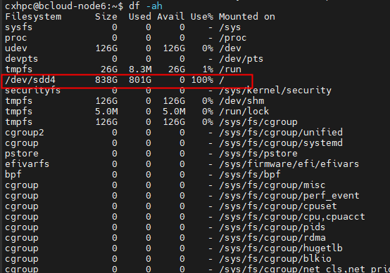
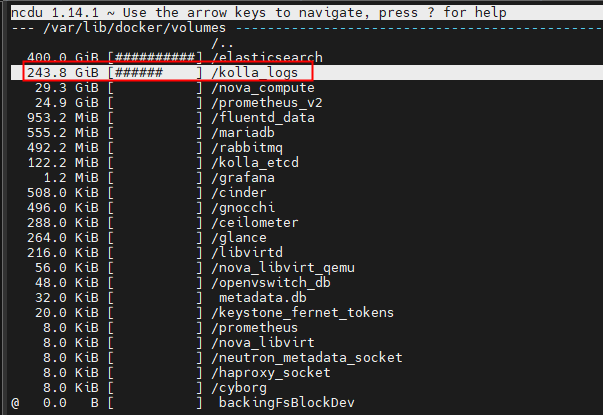

## Linux Source命令及脚本的执行方式解析

当修改了/etc/profile文件，想让它立刻生效，而不用重新登录，这时就想到用source命令，如:source /etc/profile

**source命令：**

也称为“点命令”，也就是一个点符号（.）,是bash的内部命令。

功能：使Shell读入指定的Shell程序文件并依次执行文件中的所有语句。source命令通常用于重新执行刚修改的初始化文件，使之立即生效，而不必注销并重新登录。

**用法：**

source filename 或 . filename

**source filename 与 sh filename 及./filename执行脚本的区别：**

- 当shell脚本具有可执行权限时，用sh filename与./filename执行脚本是没有区别的。./filename是因为当前目录没有在PATH中，所有"."是用来表示当前目录的。
- sh filename 重新建立一个子shell，在子shell中执行脚本里面的语句，该子shell继承父shell的环境变量，但子shell新建的、改变的变量不会被带回父shell，除非使用export。
- source filename：这个命令其实只是简单地读取脚本里面的语句依次在当前shell里面执行，没有建立新的子shell。那么脚本里面所有新建、改变变量的语句都会保存在当前shell里面。

## 简单命令

### date  

打印日期与时间

```shell
jinbo@fang:/media/jinbo/ltg/gitme/linux/command & shell$ date
2022年 01月 26日 星期三 22:29:55 CST
jinbo@fang:command & shell$ date +%F
2022-07-08
jinbo@fang:command & shell$ date +"%F %T %w"
2022-07-08 18:05:15 5
jinbo@fang:command & shell$ date +"%Y/%m/%d"
2022/07/08
jinbo@fang:command & shell$ date +"%Y-%m-%d"
2022-07-08
```

可以用date --help 查看各参数的含义

```shell
%F    完整日期格式，等价于 %Y-%m-%d
%T    时间，等于%H:%M:%S
%w    一星期中的第几日(0-6)，0 代表周一
%y    年份最后两位数位 (00-99)
%Y    年份
%m   month (01..12)
%d    按月计的日期(例如：01)
%D    按月计的日期；等于%m/%d/%y
```

### cal  

打印日历

```shell
      一月 2022         
日 一 二 三 四 五 六  
                   1  
 2  3  4  5  6  7  8  
 9 10 11 12 13 14 15  
16 17 18 19 20 21 22  
23 24 25 26 27 28 29  
30 31
```

### df 

查看磁盘驱动器的可用空间

`df -h`：以人类可读的方式显示

### history

显示最近的命令

### free 

显示内存

```shell
              total        used        free      shared  buff/cache   available
Mem:       16313240     3622176    10318124      176640     2372940    12343168
Swap:       8389628           0     8389628
```

### pwd

打印绝对路径

### watch -n 5 nvidia-smi 

查看显卡信息，每隔五秒刷新一次显示

### du

- du -h：递归打印当前目录下的文件夹及子文件大小。-h 是指以人类可读的方式显示。

- `du -h --max-depth=1`：也可以是 `du -sh *`。以当前目录为节点，只往目录树下查找一层，即当前目录下的文件夹（不包括子文件夹）的大小。

- `du -sh $file`：打印指定文件夹或文件的大小

  ```shell
  jinbo@fang:/media/jinbo/ltg/gitme/linux$ du -sh operator_system/
  28K     operator_system/
  ```

更方便更详细的命令是`ncdu`

```shell
# du 命令的参数
-a或-all：显示所有文件的大小，不仅仅是目录。
-b或-bytes：显示目录或文件大小时，以byte为单位。
-c或–total：除了显示所有目录或文件的大小外，同时也显示所有目录或文件的总和。
-k或–kilobytes：以KB(1024bytes)为单位输出。
-m或–megabytes：以MB为单位输出。
-s或–summarize：仅显示总计，只列出最后加总的值。
-h或–human-readable：以K，M，G为单位，提高信息的可读性。
-x或–one-file-xystem：以一开始处理时的文件系统为准，若遇上其它不同的文件系统目录则略过。
-L<符号链接>或–dereference<符号链接>：显示选项中所指定符号链接的源文件大小。
-S或–separate-dirs：显示个别目录的大小时，并不含其子目录的大小。
-X<文件>或–exclude-from=<文件>：在<文件>指定目录或文件。
–exclude=<目录或文件>：略过指定的目录或文件。
-D或–dereference-args ：显示指定符号链接的源文件大小。
-H或–si：与-h参数相同，但是K，M，G是以1000为换算单位。
-l或–count-links：重复计算硬件链接的文件。
```

### cd 

切换目录

- cd ：切换到主目录
- `cd -`：切换到 上次的

touch xx.md 创建空文件 xx.md

top 动态显示当前耗费资源最多的进程信息

### ls & wc

- `ls | wc -w` :查看当前目录下有多少个文件及文件夹（不包括子文件夹）
  - wc 统计文本中行数、字数、字符数，例如 `wc xx.md`（也等于 `wc -lwc xx.md`），打印 xx.md 文件里的行数、单词数、字符数
- `ls -la` 以长格式(-l)列出所有的(-a)文件夹，也可以写为 `ls -l -a`
  - `ls -laF` 用长格式列出所有的文件夹并且在每一个列出的名字后面加上类型指示符（类如是目录名字后面会加一个斜杠），也可写成 `ls -l -a -F`
- `ls -R`  连同子目录的内容一起列出（递归列出），等于该目录下的所有文件都会显示出来。也可以直接用 tree 命令(需要先安装 sudo apt install tree)。注意`ls -r` 与 ls 相同，但排序相反（--reverse）

### tree

```shell
sudo apt install tree

# 显示深度为3级：
tree -L 3

#只显示目录，不显示文件
tree -d -L 3
```

### mkdir 

创建目录

- -p 若所要建立的目录的上层目录尚未建立，则一并建立上层目录

  ```shell
  jinbo@fang:~/gitme/linux/test$ mkdir -p parent/child
  jinbo@fang:~/gitme/linux/test$ tree
  .
  ├── dir1
  │   ├── dir11
  │   ├── dir12
  │   └── f1a.md
  ├── dir2
  ├── parent
  │   └── child
  └── repo.md
  ```

- `mkdir dir1 dir2 path_to/dir3`  同时创建 dir1 dir2 path_to/dir3

  ```shell
  jinbo@fang:~/gitme/linux/test$ mkdir dir1 dir2 dir1/dir11
  jinbo@fang:~/gitme/linux/test$ tree
  .
  ├── dir1
  │   └── dir11
  ├── dir2
  ├── parent
  │   └── child
  └── repo.md
  ```

### rmdir 

删除目录

- `rmdir -p` 删除

### rm 

删除文件和目录

- `rm item...`

  - -r 递归删除目录及子目录

  - -v 操作完后显示信息性消息

  - -i 删除一个已存在的文件时，提示用户确认

    ```shell
    jinbo@fang:~/gitme/linux/test$ tree
    .
    ├── dir2
    ├── parent
    └── repo.md
    
    2 directories, 1 file
    jinbo@fang:~/gitme/linux/test$ rm -i repo.md
    rm：是否删除普通文件 'repo.md'？ y
    jinbo@fang:~/gitme/linux/test$ tree
    .
    ├── dir2
    └── parent
    
    2 directories, 0 files
    ```

### mv 

移动或者重命名

- -u 只复制那些不存在的文件或更新过的名字(虽文件名改动)
- -i 遇到重复的询问是否覆盖
- -v 移动时显示信息性消息，如 `'repo.md' -> 'dir2/repo.md'`
- -r 操作文件夹及子文件夹

- `mv item1 item2 ` 与 cp 类似，将文件（或目录）item1 移动（或重命名）为 item2
- `mv item... dir`  将一个或多个条目从一个目录移动到另一个目录下

### cp 

复制文件和目录

- `cp path_to1/file1 path_to2/file2 file2`若与 file1同名，则覆盖，加上 -i 选项，区别在于覆盖之前通知用户是否覆盖 `cp -i path_to1/file1 path_to2/file2 file2`
- `cp file1 file2 dir1` 把file1,file2复制到目录dir里，前提dir存在
- `cp -r dir1 dir2` 把文件夹dir1递归地复制到dir2（不存在则自动创建）

### chmod 

更改文件权限

八进制数字表示法

- 文件类型
- 权限属性
- 权限属性实例

```shell
drwxrwxr-x 3 jinbo jinbo  4096 11月 26 09:31 1a
---xrwxrwx 1 jinbo jinbo   482 11月 26 09:55 1a.txt
drwxrwxr-x 4 jinbo jinbo  4096 11月 26 13:53 1b
drwxrwxr-x 2 jinbo jinbo  4096 11月 26 14:17 1c
-rwxrwxrwx 1 jinbo jinbo   475 11月 26 09:56 1d.md
drwxrwxr-x 2 jinbo jinbo  4096 11月 26 14:59 1e
-rwxrwxrwx 1 jinbo jinbo 28205 9月  16 10:56 1e.jpeg
-rwxrwxrwx 1 jinbo jinbo    23 11月 26 20:32 hello.py
lrwxrwxrwx 1 jinbo jinbo     2 11月 26 15:00 link -> 1c
-rw-rw-r-- 1 jinbo jinbo   544 11月 26 16:13 ls.txt
-rw-rw-r-- 1 jinbo jinbo   960 11月 26 15:40 my_cat.txt
-rw-rw-r-- 1 jinbo jinbo     7 11月 26 20:30 sh.sh
-rw-rw-r-- 1 jinbo jinbo   800 11月 26 15:27 tree_output.txt
```

```shell
$ chmod 000 1a.txt
$ cat 1a.txt
cat: 1a.txt: 权限不够
$ chmod 777 1a.txt
cat 1a.txt  # 现在可以访问了
$ chmod 000 1a  # 改变文件夹权限
$ less 1a/1a.txt
1a/1a.txt: 权限不够  # 虽然文件的权限是 -rwxrwxrwx，但文件夹的权限是 d---------，文件夹都不能进去，文件自然访问不了
```

符号表示法
u：所有者权限

g：组权限

o：其他所有用户

a：所有用户

u+x/u-x：为文件所有者增加/删除可执行权限

+x，也即 a+x

u+x，go = rx：为文件所有者添加可执行权限，同时设置所属群组和其它用户具有读权限和可执行权限。

### type

显示命令的类型或位置

```shell
jinbo@fang:/media/jinbo/ltg/gitme/linux/t$ type ffplay
ffplay 是 /usr/bin/ffplay
jinbo@fang:/media/jinbo/ltg/gitme/linux/t$ type ls
ls 是“ls --color=auto”的别名
jinbo@fang:/media/jinbo/ltg/gitme/linux/t$ type cp
cp 已被录入哈希表 (/usr/bin/cp)
jinbo@fang:/media/jinbo/ltg/gitme/linux/t$ type type
type 是 shell 内建
```

#### which

显示可执行文件的准确位置

```shell
jinbo@fang:/media/jinbo/ltg/gitme/linux/t$ which ffplay
/usr/bin/ffplay
jinbo@fang:/media/jinbo/ltg/gitme/linux/t$ which cp
/usr/bin/cp
```

### alias & unalias

起别名

```shell
jinbo@fang:/media/jinbo/ltg/gitme/linux/t$ type foo
bash: type: foo：未找到   # 没有找到 foo 这个命令
jinbo@fang:/media/jinbo/ltg/gitme/linux$ alias foo='mkdir mydir; cd mydir; pwd' # foo 是右边一系列命令的别名
jinbo@fang:/media/jinbo/ltg/gitme/linux$ type foo
foo 是“mkdir mydir; cd mydir; pwd”的别名
jinbo@fang:/media/jinbo/ltg/gitme/linux$ foo
/media/jinbo/ltg/gitme/linux/mydir
jinbo@fang:/media/jinbo/ltg/gitme/linux/mydir$ which foo # 在环境变量里找不到 foo 这个可执行文件，所以没有输出。
```

### ln 

创建链接

- `ln file link `用来创建硬链接
- `ln -s item link` 用来创建符号链接
  硬链接不能引用与该链接不在同一个磁盘分区的文件
  硬链接无法引用目录
  符号链接指向的文件与符号链接自身几乎没有区别，当删除一个符号链接时，删除的只是符号链接而不是文件本身，如果删除了文件而符号链接依旧存在，这就是坏链接。

#### 硬链接

硬连接指通过索引节点来进行连接。在Linux的文件系统中，保存在磁盘分区中的文件不管是什么类型都给它分配一个编号，称为索引节点号(Inode  Index)。在Linux中，多个文件名指向同一索引节点是存在的。一般这种连接就是硬连接。硬连接的作用是允许一个文件拥有多个有效路径名，这样用户就可以建立硬连接到重要文件，以防止“误删”的功能。其原因如上所述，因为对应该目录的索引节点有一个以上的连接。只删除一个连接并不影响索引节点本身和其它的连接，只有当最后一个连接被删除后，文件的数据块及目录的连接才会被释放。也就是说，文件真正删除的条件是与之相关的所有硬连接文件均被删除。

#### 软链接

另外一种连接称之为符号连接（Symbolic Link），也叫软连接。软链接文件有类似于Windows的快捷方式。它实际上是一个特殊的文件。在符号连接中，文件实际上是一个文本文件，其中包含的有另一文件的位置信息。

[Linux软连接和硬链接](https://metmoon.com/2019/05/29/linux-symbolic-link/)

### 重定向

I/O 重定向功能可以指定标准输出内容发送到哪里

```shell
ls -rl > tree_output.txt  # > 表明重新写入，会清除之前写的内容
ls -rl >> tree_output.txt		# >> 表明在之前的内容后追加新内容cat
less tree_output.txt 
```

#### 将标准输出和标准错误重定向到文件

```shell
jinbo@fang:/media/jinbo/ltg/gitme/linux/t$ ls -l /no_exist_dir > err.log 2>&1 #因为没有目录 /no_exist_dir
jinbo@fang:/media/jinbo/ltg/gitme/linux/t$ cat err.log 
ls: 无法访问'/no_exist_dir': 没有那个文件或目录
```

标准输入文件，标准输出文件和标准错误文件分别对应描述符0,1,2。因为 `> err.log` 标准输出被重定向到文件`err.log`，又因为 `2>&1` 将标准错误重定向到标准输出中，所以标准错误也被重定向到文件`err.log`

注意这里`ls -l /no_exist_dir > err.log 2>&1`的顺序，`2>&1`必须在`> err.log`的后面。因为标准错误的重定向通常发生在标准输出的重定向之后，否则它将不起作用。

bash版本提供了效率更高的第二种方法来实现上述的操作：

```shell
ls -l /no_exist_dir &> err.log
# 或者
ls -l /no_exist_dir 2> err.log
```

只用了一个标记符“&>”就把标准输出和标准错误都重定向到`err.log`中。

#### 处理不想要的输出

```shell
# /dev/null 是一个被称为位桶的系统设备文件，它接受输入但是不对输出做任何处理。
# 以下命令可以用来抑制（隐藏）一个命令的错误信息
ls -l /no_exist_dir 2> /dev/null
```

#### tee

从 stdin 读取数据，并输出到 stdout 和文件

```shell
# 跟标准输出重定向有区别，它既可以在终端显示命令结果也输出结果到文件
ls -lr | tee ls.txt  
```

#### 管道

管道操作符 | 把一个命令的标准输出传送到另一个命令的标准输入中

```shell
格式 command1 | command2 
ls -lr | less
ls -lr | sort | uniq | less  # ls 的结果用 sort 排序，再取里面不重复的行，最终用 less 显示
cat 1a/2a.txt | wc -l -w  
# 1a/2a.txt 的内容是 "hello world!"，
# 该命令打印`      1       2`表示 1 行 2个单词

# 下面的命令列出 tools 文件夹下的所有文件名保存到 1.txt 中，并查找包含 md 的文件名
jinbo@fang:/media/jinbo/ltg/gitme/linux$ ls tools | tee 1.txt | grep md
developer.md
find_grep.md
gdb.md
VIM.md

# 下面的命令列出历史命令（太多了），然后使用 grep 过滤出只含有 g++ 的命令（依然太多了），再使用 tail -n 只显示最后的 5 条历史命令。
jinbo@fang:/media/jinbo/ltg/gitme/linux$ history | grep g++ | tail -n 5
 1978  g++ test.cpp -o test -std=c++11
 2180  history | grep g++
 2182  history | grep g++
 2183  history | grep g++ | tail 5
 2184  history | grep g++ | tail -n 5
 # 从上面已经知道了第 2182 行历史命令是 history | grep g++，如果我们想再次使用该命令，可以使用
 !2182
 # 让 shell 立即执行第 2182 行历史命令
```

### 打包

#### tar

tar包和gz包是两个不同的文件包，有三种不同后缀。.tar .gz .tar.gz。

tar包：使用tar命令，打包文件或者文件夹，只打包，不压缩。

gz包：使用gzip命令，只压缩文件，不打包，所以gz包操作不能对文件夹直接操作，如果要对文件夹下所有文件进行压缩，使用-r参数，gzip -r 文件夹路径。

tar.gz：使用tar加-z参数，`tar -czvf filename.tar.gz dir/file`。打包压缩文件或者文件夹。

**参数**

- -z 表示压缩操作类型是 .tar.gz
- -c 表示当前行为是打包
- -x 表示当前行为是解压文件包
- -v 参数要求显示命令执行过程
- -f 指定打包后文件名
- -C 解压到指定路径

```shell
# 常用压缩打包命令：
tar -czvf tarame.tar.gz dir/files
# 常用解压缩命令：
tar -xzvf tarname.tar.gz [-C 指定解压后文件存放地址]
```

#### zip

从本地打包上传到服务器的压缩包，一般都是zip或者rar格式，而不是tar包格式。

- -r 压缩文件夹，递归执行，压缩文件夹下所有文件

- -q 不显示压缩过程，默认会在控制台打印压缩文件过程

- -d 压缩过程中剔除指定文件(从已经存在的压缩包中剔除)， -d参数后跟随的文件不打包到压缩包里。

压缩文件夹且排除指定文件不压缩

```shell
jinbo@fang:tmp$ ls ./test
005.tar.gz  1.txt  2.txt
jinbo@fang:tmp$ zip -r testdir/1.zip test # 生成压缩包到指定路径 testdir/1.zip
  adding: test/ (stored 0%)
  adding: test/005.tar.gz (deflated 2%)
  adding: test/1.txt (stored 0%)
  adding: test/2.txt (stored 0%)
jinbo@fang:tmp$ unzip testdir/1.zip -d ./testdir # 解压压缩包到指定路径，否则是当前路径
Archive:  testdir/1.zip
   creating: ./testdir/test/
  inflating: ./testdir/test/005.tar.gz  
 extracting: ./testdir/test/1.txt    
 extracting: ./testdir/test/2.txt 
 jinbo@fang:tmp$ ls testdir/test
005.tar.gz  1.txt  2.txt
 jinbo@fang:tmp$ zip -r testdir/1.zip test -d test/005.tar.gz # 从已生成的压缩包中剔除某些文件
        zip warning: invalid option(s) used with -d; ignored.
deleting: test/
deleting: test/005.tar.gz
jinbo@fang:tmp$ rm -rf testdir/test/
jinbo@fang:tmp$ unzip testdir/1.zip -d ./testdir # 再次解压发现确实剔除了
Archive:  testdir/1.zip
 extracting: ./testdir/test/1.txt    
 extracting: ./testdir/test/2.txt  
 jinbo@fang:tmp$ ls testdir/test/
1.txt  2.txt
```

如果压缩包不存在，用 -d不会生成压缩包

```shell
jinbo@fang:tmp$ zip -r testdir/2.zip test -d test/005.tar.gz 
        zip warning: invalid option(s) used with -d; ignored.
        zip warning: testdir/2.zip not found or empty

zip error: Nothing to do! (testdir/2.zip)
```

unzip 参数

- -n 解压后不覆盖已存在文件，如果压缩包文件中与解压路径有同名文件，跳过该文件

- -v 控制台打印显示压缩包内容，但是不解压，-v参数只进行查看

- -d 指定解压后文件存放路径

unzip常直接使用，解压到当前路径，覆盖同名文件：

```shell
unzip file.zip
```

解压到指定路径，不覆盖已有同名文件：

```shell
unzip -n file.zip -d dirpath/
```

## 文件

### touch

一般用来设定或是更新文件的修改时间，如果文件不存在就创建一个空文件，文件存在就更新时间。

### stat

它是ls的增强版，该命令会将系统所掌握文件的所有信息以及属性全部显示出来

```shell
jinbo@fang:/media/jinbo/ltg/gitme/linux/command & shell$ stat command.md 
  文件：command.md
  大小：28031           块：56         IO 块：4096   普通文件
设备：805h/2053d        Inode：26872       硬链接：1
权限：(0777/-rwxrwxrwx)  Uid：( 1000/   jinbo)   Gid：( 1000/   jinbo)
最近访问：2022-01-27 00:57:53.639296100 +0800
最近更改：2022-01-28 21:53:43.614859100 +0800
最近改动：2022-01-28 21:53:43.614859100 +0800
创建时间：-
```

### xxd

`xxd file`：Linux(Windows Git Bash)下查看文件二进制命令

### nm

`nm file`：nm是name的缩写，是Linux系统中查看动态库和可执行文件导出符号的工具。

比如对于可执行文件my_deadlock_exe，导出符号可以看到main函数。

```shell
jinbo@fang:deadlock$ nm my_deadlock_exe 
00000000004060d0 B __bss_start
00000000004061f0 b completed.7325
                 U __cxa_atexit@@GLIBC_2.2.5
0000000000406268 B data1
000000000040626c B data2
000000000040145c T main
0000000000406200 B _mutex1
0000000000406240 B _mutex2
省略许多
```

其中D位于数据段，T位于代码区，B位于静态区。

| 符号类型 | 说明                                                         |
| -------- | ------------------------------------------------------------ |
| A        | 该符号的值是绝对的，在以后的链接过程中，不允许进行改变。这样的符号值，常常出现在中断向量表中，例如用符号来表示各个中断向量函数在中断向量表中的位置。 |
| B        | 该符号的值出现在非初始化数据段(bss)中。例如，在一个文件中定义全局static int test。则该符号test的类型为b，位于bss section中。其值表示该符号在bss段中的偏移。一般而言，bss段分配于RAM中 |
| C        | 该符号为common。common  symbol是未初始话数据段。该符号没有包含于一个普通section中。只有在链接过程中才进行分配。符号的值表示该符号需要的字节数。例如在一个c文件中，定义int test，并且该符号在别的地方会被引用，则该符号类型即为C。否则其类型为B。 |
| D        | 该符号位于初始话数据段中。一般来说，分配到data section中。例如定义全局int baud_table[5] = {9600, 19200, 38400, 57600, 115200}，则会分配于初始化数据段中。 |
| G        | 该符号也位于初始化数据段中。主要用于small object提高访问small data object的一种方式。 |
| I        | 该符号是对另一个符号的间接引用。                             |
| N        | 该符号是一个debugging符号。                                  |
| R        | 该符号位于只读数据区。例如定义全局const int test[] = {123,  123};则test就是一个只读数据区的符号。注意在cygwin下如果使用gcc直接编译成MZ格式时，源文件中的test对应_test，并且其符号类型为D，即初始化数据段中。但是如果使用m6812-elf-gcc这样的交叉编译工具，源文件中的test对应目标文件的test,即没有添加下划线，并且其符号类型为R。一般而言，位于rodata section。值得注意的是，如果在一个函数中定义const char *test = “abc”, const char test_int = 3。使用nm都不会得到符号信息，但是字符串“abc”分配于只读存储器中，test在rodata section中，大小为4。 |
| S        | 符号位于非初始化数据区，用于small object。                   |
| T        | 该符号位于代码区text section。                               |
| U        | 该符号在当前文件中是未定义的，即该符号的定义在别的文件中。例如，当前文件调用另一个文件中定义的函数，在这个被调用的函数在当前就是未定义的；但是在定义它的文件中类型是T。但是对于全局变量来说，在定义它的文件中，其符号类型为C，在使用它的文件中，其类型为U。 |
| V        | 该符号是一个weak object。                                    |
| W        | The symbol is a weak symbol that has not been specifically tagged as a weak object symbol. |
| -        | 该符号是a.out格式文件中的stabs symbol。                      |
| ?        | 该符号类型没有定义                                           |

## 文本处理

- grep 更适合单纯的查找或匹配文本

- sed 更适合编辑匹配到的文本

- awk 更适合格式化文本，对文本进行较复杂格式处理

### less

- less filename 可以用来查看文件内容，按 Q 可以退出 less 程序

### cat

可以在终端显示比较短的文件而不需要分页，功能像 less，但 less 操作与 vi 差不多
`cat path/xx.txt`
`cat 1.md 2.md` 把想要的文件内容连接在一起显示
`cat 1.md 2.md > my_cat.txt `将连在一起的内容写入到文本，不在终端显示

### head/tail

```shell
head -n 3 xx.txt  # 显示文件前 3 行
tail -n 2 xx.txt  # 显示文件后 2 行	
```

### diff

逐行比较文件

### uniq

删除重复内容

```shell
$ echo "123
> 123
> ab
> ab" | uniq
# 打印
123
ab # 重复的 ab 被删除了
```

### tr

字符替换

```shell
$ echo "123abc" | tr '[a-z]' '[A-Z]'
123ABC
$ echo "123abc" | tr '[1-2]' '[X-Y]'
XY3abc
```

### [cut](https://www.jianshu.com/p/292e948d10c2)

cut 以每一行为一个处理对象。它从文件的每一行剪切字节、字符和字段并将这些字节、字符和字段写至标准输出。

如果不指定 File 参数，cut 命令将读取标准输入。必须指定 -b、-c 或 -f 标志之一。

主要参数：

-b ：输入每行第n个字符（半角，注意如果有中文将乱码）。

-c ：输入每行第n个字符。

-d ：自定义分隔符，默认为制表符。

-f ：与-d一起使用，指定显示哪个区域。

-n ：取消分割多字节字符（例如中文）。仅和-b标志一起使用。

```shell
jinbo@fang:t$ ls -l
总用量 8
-rwxrwxrwx 1 jinbo jinbo  853 7月   8 11:57 00_赋值.sh
-rwxrwxrwx 1 jinbo jinbo 1616 7月   8 11:57 01_变量.sh
jinbo@fang:t$ ls -l | cut -c 1-3,7,8,9 # 取每行的1~3和第7，8，9个字符
总量
-rwxrw
-rwxrw
jinbo@fang:t$ ls -l | cut -c 1-3,8,9 #由于utf-8一个中文占3个字节，所以去掉了第7个字符就乱码
总��
-rwrw
-rwrw
```

域（fields -f）

-b和-c只能在固定格式的文档中提取信息，而对于非固定格式的信息则束手无策。这时可以用-f和-d分割域。

-d：设置分割符

-f：提取指定的域

```shell
jinbo@fang:t$ cat /etc/passwd | head -n 5
root:x:0:0:root:/root:/bin/bash
daemon:x:1:1:daemon:/usr/sbin:/usr/sbin/nologin
bin:x:2:2:bin:/bin:/usr/sbin/nologin
sys:x:3:3:sys:/dev:/usr/sbin/nologin
sync:x:4:65534:sync:/bin:/bin/sync
jinbo@fang:t$ cat /etc/passwd | head -n 5 | cut -d ":" -f 1,3 # 以 ：作为分隔符，取第一个和第三个
root:0
daemon:1
bin:2
sys:3
sync:4
```

### sed

*stream editor*的简称。用于文本过滤和转换的流编辑器

其中基本编辑指令

- a ：新增， a 的后面可以接字串，而这些字串会在新的一行出现(当前行的下一行)
- c ：取代， c 的后面可以接字串，这些字串可以取代 n1,n2 之间的行
- d ：删除，因为是删除，所以 d 后面通常不接任何内容
- i ：插入， i 的后面可以接字串，而这些字串会在新的一行出现(当前行的上一行)；
- p ：打印，亦即将某个选择的数据印出。通常 p 会与参数 sed -n 一起运行
- s ：取代，可以直接进行字符替换，通常 s 的动作可以搭配正则表达式。例如 `1,20s/old/new/g` 

```shell
$ cat 1.txt 
abc
abc
abc
# 将1.txt 里的第二行中的 b 替换为 Z, s代表的是替换，s前的数字代表的要处理第几行，比如这里就是只处理第 2 行。如果不加数字就是处理每一行。
$ sed '2s/b/Z/' 1.txt # 注意 Z 后的斜杠不要忘了，不然报错：sed：-e 表达式 #1，字符 11：未终止的“s”命令
abc
aZc
abc
# 注意 这里根本就没有改变 1.txt，因为不是就地更改，需要加 -i，可以通过 man sed 查看更多用法
$ cat 1.txt 
abc
abc
abc
# 已经更改了并保存到原始文件。
$ sed 's/b/Z/' 1.txt -i
$ cat 1.txt 
aZc
aZc
aZc
# i 指令，每行前增加内容。例如在每行前加 123
$ sed 'i123' 1.txt 
123
aZc
123
aZc
123
aZc
# a 指令，第二行后面增加新行 test
$ sed '2atest' 1.txt 
abc
abc
test
abc
# i 指令，第二行前面增加新行 test
$ sed '2itest' 1.txt 
abc
test
abc
abc
# c 指令，用 test 取代第二行
$ sed '2ctest' 1.txt 
abc
test
abc
```

### awk

注意格式化输出时用printf而不是print，不然有问题。

```shell
jinbo@fang:test_text$ cat awk.txt 
This's a test
1 C/C++ Python Java C# Go
2 Do    you    like    awk
3 There are orange,apple,mongo
4 qq, ww, ee, rr, tt, yy
5 qq,ww,ee,rr,tt,yy
jinbo@fang:test_text$ awk '{print $1, $4}' awk.txt  # 默认以空格作为分隔符，取第1列和第4列
This's 
1 Java
2 like
3 orange,apple,mongo
4 ee,
5 
# 用","作为分隔符，取第1列和第3列，'{print $1 $3}' 中的$1与$3没有用","隔开，导致输出的内容拼接在一起。
jinbo@fang:test_text$ awk -F "," '{print $1 $3}' awk.txt 
This's a test
1 C/C++ Python Java C# Go
2 Do    you    like    awk
3 There are orangemongo
4 qq ee
5 qqee
# 用","作为分隔符，取第1列和第3列，'{print $1 $3}' 中的$1与$3用","隔开
jinbo@fang:test_text$ awk -F "," '{print $1,$3}' awk.txt
This's a test
1 C/C++ Python Java C# Go 
2 Do    you    like    awk 
3 There are orange mongo
4 qq  ee
5 qq ee
# 格式化输出。特别要注意这时候用的是printf而不是print，不然格式有问题。
jinbo@fang:test_text$ awk -F " " '{printf "%-8s %-10s\n",$1,$4}' awk.txt
This's             
1        Java      
2        like      
3        orange,apple,mongo
4        ee,       
5   
```


## 查找

### 正则表达式

pattern正则表达式主要参数：

- \： 忽略正则表达式中特殊字符的原有含义。
- ^：匹配正则表达式的开始行。
- $: 匹配正则表达式的结束行。
- \<：从匹配正则表达式的行开始。
- \>：到匹配正则表达式的行结束。
- [ ]：单个字符，如[A]即A符合要求 。
- [ - ]：范围，如[A-Z]，即A、B、C一直到Z都符合要求 。
- .   ：所有的单个字符。
- \*   ：有字符，长度可以为0.

### grep

搜索文本的命令

```shell
命令格式: grep [options]... pattern [file]...
命令格式: grep 查找规则... 正则表达式 查看文件
```


#### 查找规则

| options | 解释                                   |
| ------- | -------------------------------------- |
| -i      | 不区分大 小写(只适用于单字符)          |
| -r      | 遍历匹配                               |
| -v      | 显示不包含匹配文本的所有行             |
| -s      | 不显示不存在或无匹配文本的错误信息     |
| -E      | 可用于同时匹配多关键词                 |
| -w      | 整字匹配                               |
| -l      | 查询多文件时只输出包含匹配字符的文件名 |
| -c      | 只输出匹配行的计数                     |
| -n      | 显示匹配行及行号                       |
| -h      | 查询多文件时不显示文件名               |

#### 实例

- 忽略大小写搜索

  ```shell
  grep -i "androiD"  logcat.txt   # 从logcat.txt文件中，搜索包含android的文本行，不区分大小写
  ```

- 遍历搜索，且不显示无匹配信息

  ```shell
  # 假设1.txt内容如下
  $ cat 1.txt 
  abc
  test
  abc
  ```

  ```shell
    $ grep -rs "a" .   # 从当前目录下，遍历所有的文件，搜索包含a的文本行
  ./1.txt:abc
  ./1.txt:abc
  ```

- 只列出文件名

  ```shell
  $ grep -rl "a" .  # 从当前目录下，遍历所有的文件，搜索包含a的文本行，但只列出文件名
  ./1.txt
  ```

- 整字匹配搜索

  ```shell
  grep -w "android" logcat.txt  # 从logcat.txt文件中，搜索包含单词android的文本行
  grep -w "android | ios" logcat.txt  # 从logcat.txt文件中，搜索包含单词android或者ios的文本行
  ```

- 统计字符出现次数

  ```shell
  $ grep -c "a" 1.txt
  2
  ```

- 显示字符出现所在行

  ```shell
  $ grep -n "b" 1.txt 
  1:abc
  3:abc
  ```

- 显示多条件匹配

  ```shell
  $ grep -E "a|t" 1.txt # 在文件 1.txt 搜索包含 a 和 t 字符串的行
  abc
  test
  abc
  ```

### find

这个命令用于查找文件，功能强大。例如：find ./*.txt，查找当前目录及其子目录下所有扩展名是 .txt 的文件。

```shell
命令格式  find pathname -options [ actions]
命令格式  find 查找目录  -查找规则 [执行操作]
```

```shell
# 以小写字母或数字1、2、3中的任一个结尾的任一文件
find *[[:lower:]123] 
#打印当前目录下的所有文件夹
find . -type d 
找到当前目录下大小超过 1M 的 jpg 格式图像
find . -type f -name *.jpg -size +1M
```

```shell
# 从当前目录递归寻找能匹配 *dvr*.c 的文件且该文件某一行有字符 "main"
# 即找文件 *dvr*.c 的 main 函数。该方式 find 的文件在 vscode 中可以跳转
find . -type f -name *dvr*.c | xargs grep -wnr main
```

#### 查找目录

(1) 如果不写，默认为当前路径；
(2) 支持多个路径，目录直接用空格间隔；

```shell
find . -name demo
```


```shell
find . -type f  | wc -l # 查看某目录文件个数
```

#### 查找规则

##### 根据文件名(name)

`-name`   //根据文件名查找，区分大小写
`-iname`  //根据文件名查找，不区分大小写

通配符说明：
(1)*  匹配任意的若干个字符
(2)?  匹配任意的单个字符
(3)[] 匹配括号内的任意一个字符

```shell
find /data -name dalvi*
find /data -name dalvik?cache
find /data -name dalvik-cach[abe]
```

##### 根据文件类型(type)

- f     普通文件
- d     目录文件
- l     链接文件
- b     块设备文件
- c     字符设备文件
- p     管道文件
- s     socket文件

例如：

```shell
find -type f # 查看文件类型
```

##### 根据目录深度(depth)

- -maxdepth n: 查找最大深度为n
- -mindepth m: 查找最小深度为m


##### 根据文件大小(size)

单位：c(小写), k(小写), M(大写), G(大写)

-size +10M: 查找大于10M的文件
-size -2k: 查找小于2k的文件
-empty: 查找大小为0的文件或空目录

##### 根据文件权限(perm)

例如：

```shell
find -perm 777 # 查找权限为777的文件
```

##### 根据文件所属用户和组

- -user: 根据属主来查找文件
- -group: 根据属组来查找文件

##### 根据uid和gid

- -uid  500: 查找uid是500 的文件
- -gid  1000: 查找gid是1000的文件

##### 根据时间

可以通过`stat`命令来查看文件的时间，下列是按照文件的各种时间来查找文件：

- -mtime  -n  +n: 根据更改(modify)时间，-n指n天以内，+n指n天以前
- -atime  -n  +n: 根据访问(access)时间，-n指n天以内，+n指n天以前
- -ctime  -n  +n: 根据创建(create)时间，-n指n天以内，+n指n天以前
- -mmin   -n  +n: 根据更改(modify)时间，-n指n分钟以内，+n指n分钟以前
- -amin   -n  +n: 根据访问(access)时间，-n指n分钟以内，+n指n分钟以前
- -cmin   -n  +n: 根据创建(create)时间，-n指n分钟以内，+n指n分钟以前

##### 多条件连接

- -a: 两个条件同时满足（and）
- -o: 两个条件满足其一（or）
- -not: 对条件取反（not）

例如，查找当前路径下，以a开头，并排除掉以b结尾的文件或文件夹：

```shell
find -name "a*" -not -name "*b"  # a* 和 b* 最好有引号，不然可能会出错

$ find -iname "*.sh" -not -name "0*.sh"
./10_数组.sh
./11_字符处理.sh
./2.sh
```


#### 执行操作

- `-print`   匹配文件输出到标准输出，默认操作

- `-ls`       查找到的结果，以ls方式显示

  ```shell
  find -name app -ls
  ```

- `-ok [command]`     查找完成后，执行command执行，询问执行

  ```shell
  find -name app -ok cat {} \;   //注意：{}前后有空格
  ```

- `-exec [command]`   查找完成后，执行command执行，直接执行

  ```shell
  find -name app  -exec ls {} \;
  ```

**推荐阅读**

- [linux 下 find 和 grep 的区别](https://blog.csdn.net/denghonghao/article/details/78610861)

### file 用于确定文件的种类

```shell
# 比如 1.txt 其实是 1.JPEG 重命名的，
$ file 1.txt
1.txt: JPEG image data, JFIF standard 1.01, resolution (DPI), density 72x72, segment length 16, baseline, precision 8, 440x440, frames 3
```

### file用于查看动态库是debug还是release

```shell
$ file xxx.so  # release
xxx.so: ELF 64-bit LSB shared object, x86-64, version 1 (SYSV), dynamically linked, BuildID[sha1]=d44438e1340a2aa769793480eab8debe70809d35, stripped

$ file xxx.so  # debug 版本
xxx.so: ELF 64-bit LSB shared object, x86-64, version 1 (GNU/Linux), dynamically linked, BuildID[sha1]=abc4a43105a3a9614843ba789d6e02af93e98139, with debug_info, not stripped
```

可以看到debug版本的动态库后面多了`with debug_info, not stripped`信息。

## 进程

### ps

ps 只是显示在该命令被执行的时刻机器状态的一个快照

- ps 显示**当前终端**进程

  - -L 显示线程

  - -p 显示指定 pid 进程

  - -pid 显示属于 pid 的子进程

  - `--forest` 树型显示, -f 显示进程树，但没有 --forest 直观

    ```shell
    jinbo@fang:/media/jinbo/ltg/gitme/linux/command & shell$ ps --forest
      PID TTY          TIME CMD
    13195 pts/1    00:00:00 bash
    13464 pts/1    00:00:00  \_ ps # ps 是 bash 的子进程
    ```

- ps x 显示**所有终端**所控制的进程，TTY中的?表示没有控制终端，STAT是state的缩写，显示的是当前进程的状态,S表示睡眠状态，进程不在运行，而是在等待。

```shell
 PID TTY      STAT   TIME COMMAND
 2740 pts/2    Ss     0:00 bash
 2858 ?        Sl     0:00 /usr/lib/x86_64-linux-gnu/deja-dup/deja-dup-monitor
 6990 ?        Sl     0:14 /usr/lib/firefox/firefox
 7061 ?        Sl     0:08 /usr/lib/firefox/firefox -contentproc -childID 1 -isForBrowser -prefsL
 7122 ?        Sl     0:00 /usr/lib/firefox/firefox -contentproc -childID 2 -isForBrowser -prefsL
 7153 ?        Sl     0:08 /usr/lib/firefox/firefox -contentproc -childID 3 -isForBrowser -prefsL
 8296 pts/2    R+     0:00 ps -x
```

- ps -aux 显示所有用户的进程信息，一般后面会加grep搜索，如搜索火狐进程。

  ```shell
  ps -aux | grep -w firefox
  jinbo     219412  5.2 13.1 8025636 526280 ?      Sl   7月07  77:19 /opt/apps/com.mozilla.firefox-zh/files/firefox
  ```

### top 

动态查询进程信息。它将按照进程活动的顺序，以列表形式持续更新显示系统进程的当前信息（默认每3s更新一次）。

[Linux中top命令参数详解](https://blog.csdn.net/yjclsx/article/details/81508455)

**使程序在后台运行**

```shell
$ xlogo  # 显示一个包含X标识的可缩放窗口
# 但是这样 shell 提示符没有返回，这是因为 shell 正在等待着 xlogo 程序结束，若用 Ctrl+C 关闭 xlogo，shell 提示符就返回了。
$ xlogo & # 让 xlogo 在后台运行， shell 返回 [1] 8798
$ ps
 PID TTY          TIME CMD
 2740 pts/2    00:00:00 bash
 8798 pts/2    00:00:00 xlogo
 8811 pts/2    00:00:00 ps
```

**杀死进程**

```shell
kill -2 8798  # 杀死 PID 为 8798 的进程，-2 的效果等同于 ctrl+C，-20的效果等同于 ctrl+z 暂停进程
# kill 默认执行 kill -15， -15 是终止信号
# -9：强制杀死进程，该信号不会发送给目标进程，而是由内核终止了目标进程，
# 当以这种方式被终止，目标进程将没有机会对自己进行清理或者对当前结果进行保存。
# -9 是没有办法的最后选择。
```

杀死卡死的程序

有时候程序过多，用TOP找不到卡死程序的PID，用如下命令根据程序名字搜索

```shell
# ps -aux | grep procees_name_key_word
# 如杀死 Android studio
jinbo@fang:~/gitme$ ps -aux | grep studio
jinbo    10346  0.0  0.0   4624  1616 tty2     S+   21:05   0:00 /bin/sh /home/jinbo/soft/studio/android-studio/bin/studio.sh
jinbo    10410  1.2  6.4 7177276 518056 tty2   Sl+  21:05   0:57 /home/jinbo/soft/studio/android-studio/jre/bin/java -classpath
```

## 软件包管理

每个linux的发行版，比如ubuntu，都会维护一个自己的软件仓库，我们常用的几乎所有软件都在这里面。这里面的软件绝对安全，而且绝对的能正常安装。

在ubuntu下，会维护一个源列表，源列表里面都是一些网址信息，这每一条网址就是一个源，这个地址指向的数据标识着这台源服务器上有哪些软件可以安装使用。可以使用 `sudo gedit /etc/apt/sources.list` 查看和编辑源。

在这个文件里加入或者注释（加#）掉一些源后，保存。这时候，我们的源列表里指向的软件就会增加或减少一部分。
 接一下要做的就是：

```shell
 sudo apt-get update 
```

这个命令，**会访问源列表里的每个网址，并读取软件列表，然后保存在本地电脑**。我们在软件包管理器里看到的软件列表，都是通过update命令更新的。

update后，可能需要upgrade一下。

```shell
 sudo apt-get upgrade 
```

这个命令，会把本地已安装的软件，与刚下载的软件列表里对应软件进行对比，如果发现已安装的软件版本太低，就会提示更新。

**总而言之，update是更新软件列表，upgrade是更新软件。**

### 软件包常用命令

- apt-cache search package 搜索包
-  `apt-cache show package` 获取已安装包的相关信息，如说明、大小、版本等，它已经包括了下文中的`dpkg --status package`的状态信息。
-  `sudo apt-get install package 安装包`
-  `sudo apt-get install package --reinstall 重新安装包`
-  `sudo apt-get -f install 修复安装"-f = --fix-missing"`
- `sudo apt-get remove package 删除包`
-  sudo apt-get remove package - - purge 删除包，包括删除配置文件等
-  `sudo apt-get update 更新源`
-  `sudo apt-get upgrade 更新已安装的包`
-  sudo apt-get dist-upgrade 升级系统
-  sudo apt-get dselect-upgrade 使用 dselect 升级
-  apt-cache depends package 了解使用依赖
-  apt-cache rdepends package 是查看该包被哪些包依赖
-  sudo apt-get build-dep package 安装相关的编译环境
-  apt-get source package 下载该包的源代码
-  sudo apt-get clean && sudo apt-get autoclean 清理无用的包
-  sudo apt-get check 检查是否有损坏的依赖
- `dpkg --install package 安装软件包 package`
- `dpkg --list 列出已安装的软件包`
- `dpkg --status package` 查看软件包状态，如是否安装、描述、包大小、版本、网站链接等等。

## 网络

### 拷贝远程服务器文件到本地目录

```shell
$ scp -r username@172.xx.xx.xx:~/worker/soft(远程目录) ./soft(当前目录下的 soft 目录)
```

用 scp拷贝需要输入远端计算机的密码，使用 sshpass 提前写好密码就不用输入：

```shell
sshpass -p remote_password scp -r username@172.xx.xx.xx:~/worker/soft(远程目录) ./soft(当前目录下的 soft 目录)
```

## 账号

### 创建新账号并给予sudo权限

```shell
# 只有两条命令
sudo adduser newaccount # 创建新用户 newaccount，按提示一路确认即可
sudo adduser newaccount sudo # 给用户 newaccount添加sudo权限
```

## 环境变量

### export

查看所有的环境变量

```shell
$ export ENV_TEST=1 # 设置环境变量 ENV_TEST
$ export
declare -x DBUS_SESSION_BUS_ADDRESS="unix:path=/run/user/1001/bus"
declare -x DISPLAY="localhost:13.0"
declare -x EDITOR="/usr/bin/vim"
declare -x ENV_TEST="1"
declare -x HOME="/home/jinbo"
# 省略很多的环境变量
```

### LD_LIBRARY_PATH

`LD_LIBRARY_PATH`表示可以在哪些目录中可以找到共享库。

```shell
# 第一种方式
export LD_LIBRARY_PATH=$LD_LIBRARY_PATH:/usr/local/lib # 这里使用命令直接修改LD_LIBRARY_PATH的值，当前终端有效，窗口关闭后　将失效。

# 第二种方式
# vim ~/.bashrc，在最后一行加上 export LD_LIBRARY_PATH=$LD_LIBRARY_PATH:/usr/local/lib，修改完成后 source 一下，/usr/local/lib就被添加到环境变量中。
```

## 远程命令

### [ssh 免密登录配置](https://blog.csdn.net/zhaozhao121a/article/details/125560685)

加入两台机子192.168.88.1和192.168.88.2，让它们相互之间免密登录

```shell
# 进入.ssh目录
cd ~/.ssh

# 生成一对密钥，使用rsa通用密钥算法，这时只需要三次回车（不要设置密码）
ssh-keygen -t rsa

# 发送公钥，将公钥发送给其它的服务器，如将 192.168.88.2上的公钥发送给 192.168.88.1
ssh-copy-id 192.168.88.1

# 发送结束后会生成 authorized_keys 文件，文件内容与 id_rsa.pub 内容相同
#免密登录测试
ssh 192.168.88.1 # 使用默认的账户

# 如果一个 ip 下有多个账户，想设置默认登录账户，在 .ssh 文件夹下创建一个文件 config，内容如下
account@hostName:~/.ssh$ cat config 
Host 192.168.49.238
    HostName 192.168.49.238
    User jinbo238
  
Host 192.168.49.219
    HostName 192.168.49.219
    User lynxi
```

#### 参考

- [集群机器搭建多节点MPI运行环境](https://blog.csdn.net/liu_feng_zi_/article/details/108403321)

### ssh 免密远程执行命令

```shell
sshpass -p 登录远程机器的密码 ssh -A -g 远程机器账户名@远程机器ip 在远程机器上执行的命令
# 一般地。我们把在远程机器上执行的诸多命令都写在一个脚本里，这样只需要执行这一个脚本就可以了，如
sshpass -p remote_passwd ssh -A -g jinbo@192.168.xx.xx sh /home/jinbo/execute_sh.sh
# 其中，远程机器 jinbo@192.168.xx.xx:/home/jinbo/execute_sh.sh 下的内容可以是
echo remote_passwd | sudo -S cp /home/jinbo/xx.so /usr/lib/
# 由于cp xx.so 到 /usr/lib 下需要输入密码，为了避免远程执行这个脚本还需要输入 jinbo@192.168.xx.xx 的账号密码，所以用 echo remote_passwd | sudo -S 将上一个命令（即 echo）的 stdout 接到下一个命令（cp）的 stdin
```

## Linux服务器出现“No space left on device”错误

确认查看服务器系统的磁盘使用情况是否是真的已经没有剩余空间，复制下面命令在服务器上运行，然后发现如果如下图所示那么表明sda3磁盘已经没有剩余空间存储满了。

```shell
df -lh
```



可以看到`/dev/sdd4`空间满了，对应的挂载目录是 `/`。

进入该目录，执行`sudo ncdu`查看当前目录下目录占的空间大小。找到占用空间大的文件，删除即可。



当磁盘空间未满时，依旧弹出`No space left on device`错误，这种情况下，很可能是小文件过多，导致 inode 急剧增加，消耗完 inode 区域的空间。

如果真是如此，那么即使磁盘空间有剩余，但由于无法创建新的 inode 来存储文件的元信息，也就无法创建新文件。查看 inode的占用情况使用命令`df -ih`

## 查看占用tcp端口的进程

两种查看方法（例如80端口）：

```shell
# 1、使用fuser命令，可以直接在Linux上查看指定端口被哪个进程占用了，语法为“fuser -v 80/tcp”，运行结果里会包含进程的名字和id。
$ fuser -v 80/tcp

# 2、使用lsof命令，能根据指定端口找到对应的进程信息，语法为“lsof -i:80”，可以在输出结果中查看占用80端口的进程信息。
$ lsof -i:80
```
参考[linux怎么查看端口被哪个进程占用](https://blog.csdn.net/weixin_44161444/article/details/130348488)

## linux预留端口和临时端口

在Linux上跑一个服务，需要指定一个监听端口（系统调用listen），当client请求服务时，系统为该请求建立 tcp连接，该连接的port值是一个随机数字。该数字的取值范围配置在本地临时端口配置(2个数: start, end)

```shell
# cat /proc/sys/net/ipv4/ip_local_port_range
32768  60999
```

**预留端口配置(可支持逗号分隔的多个数字，比如10000, 10005-10010)**

解决方法有2种：

(1) 修改临时端口范围 ip_local_port_range，因为一个程序的端口问题修改一个机器的临时端口范围，明显减少了临时端口的使用量，代价大。

(2) 修改预留端口ip_local_reserved_ports，即使没有发生冲突也可以预先设置，防止后续端口被占用。

使用net.ipv4.ip_local_port_range参数，规划出一段端口段预留作为服务的端口，这种方法是可以解决当前问题，但是会有个问题，端口使用量减少了，当服务器需要消耗大量的端口号的话，比如反代服务器，就存在瓶颈了。 

最好的做法是将服务监听的端口以逗号分隔全部添加到ip_local_reserved_ports中，TCP/IP协议栈从ip_local_port_range中随机选取源端口时，会排除ip_local_reserved_ports中定义的端口，因此就不会出现端口被占用了，服务无法启动。

ip_local_reserved_ports正好可以辅助解决上述问题，将服务模块需要listen的端口全部添加到 ip_local_reserved_ports中，这样Linux tcp/ip协议栈从ip_local_port_range中选端口时，会跳过ip_local_reserved_ports中定义的端口。

[【tcp】关于Linux预留端口内核参数ip_local_reserved_ports设置](https://www.jianshu.com/p/4359555fecdd)

### 设置预留端口

```shell
# 查看预留端口
cat /proc/sys/net/ipv4/ip_local_reserved_ports
30000-32767

# 修改配置文件，将预留端口范围设置为 28000-32767
/etc/sysctl.conf 
net.ipv4.ip_local_reserved_ports = 28000-32767
# 让命令生效，执行 sudo sysctl -p 命令使新的内核参数生效
sudo sysctl -p

# 再次查看预留端口
cat /proc/sys/net/ipv4/ip_local_reserved_ports
28000-32767
```

## 查看动态库里的符号

### nm

- `nm -C`：该命令会以可读的形式显示符号名称，并将其与适当的类型进行关联。使用 `-C` 选项可以解码符号名称，使其更易于理解。这对于查看函数和变量名称非常有用。
- `nm -D`：该命令会显示所有动态符号表中的符号，包括全局符号、局部符号以及其他动态符号，例如导出的符号和符号重定位等。使用 `-D` 选项时，`nm` 命令会打印所有动态符号的详细信息，包括符号类型、地址和标志等。

总结来说，`nm -C` 主要用于查看共享对象文件中的函数和变量名称，而 `nm -D` 则提供了更详细的关于所有动态符号的信息

```shell
$ nm -C libopencv_imgproc.so | grep "cv::resize("
0000000000497050 T cv::resize(cv::_InputArray const&, cv::_OutputArray const&, cv::Size_<int>, double, double, int)
0000000001e54200 d cv::resize(cv::_InputArray const&, cv::_OutputArray const&, cv::Size_<int>, double, double, int)::__cv_trace_location_fn4155
0000000001f1f358 b cv::resize(cv::_InputArray const&, cv::_OutputArray const&, cv::Size_<int>, double, double, int)::__cv_trace_location_extra_fn4155
```

```shell
$ nm -D libopencv_imgproc.so | grep "resize"
0000000000495536 T _ZN2cv3hal6resizeEiPKhmiiPhmiiddi
0000000000497050 T _ZN2cv6resizeERKNS_11_InputArrayERKNS_12_OutputArrayENS_5Size_IiEEddi
0000000000148ec6 W _ZNSt6vectorIdSaIdEE6resizeEm
00000000002f2c0c W _ZNSt6vectorIfSaIfEE6resizeEmRKf
00000000002ea1a0 W _ZNSt6vectorIhSaIhEE6resizeEm
000000000012327a W _ZNSt6vectorIiSaIiEE6resizeEm
00000000004ff0d8 W _ZNSt6vectorIlSaIlEE6resizeEm
00000000003883b4 W _ZNSt6vectorImSaImEE6resizeEm
00000000004febf6 W _ZNSt6vectorIN2cv10softdoubleESaIS1_EE6resizeEm
00000000002ea110 W _ZNSt6vectorIPhSaIS0_EE6resizeEm
0000000000123428 W _ZNSt6vectorItSaItEE6resizeEm

# T：这个标记指示符号的类型为 "Text"，即该符号是一个函数或方法
# W 是符号类型的一个标记，用于表示 "Weak"（弱）。在 C++ 中，符号可以被标记为强符号（Strong Symbol）或弱符号（Weak Symbol）。
#  强符号（Strong Symbol）：通常是全局变量、函数定义等具有明确定义和唯一实例的符号。这些符号在链接时会被解析并分配内存，且不能有多个定义。
# 弱符号（Weak Symbol）：与强符号相反，它们允许有多个定义，并且在链接时可以根据一定的优先级来决定使用哪个定义。如果有多个弱符号的定义存在，则最终只有一个定义会被选择并分配内存。
```

以`0000000000495536 T _ZN2cv3hal6resizeEiPKhmiiPhmiiddi`为例子

- `_ZN`：这是一个前缀，用于指示以下字符是一个符号的全局唯一名称。
- `2cv`：这是一个命名空间或类的名称。
- `3hal`：这是另一个命名空间或类的名称。
- `6resizeE`：这是函数或方法的名称，可能是 `resize`。
- `iPKhmiiPhmiiddi`：这是函数或方法的参数类型信息。

### c++filt

`c++filt` 是一个用于解码 C++ 符号（mangled symbols）的命令行工具。在 C++ 中，为了支持函数重载和命名空间等特性，编译器会对符号进行名称修饰，生成所谓的符号表。这些修饰后的符号表称为 mangled symbols。

`c++filt` 工具可以将这些 mangled symbols 转换回它们原始的可读形式，使得开发者能够更容易地理解和阅读这些符号。该工具通常用于调试或分析 C++ 程序，尤其是在打印崩溃堆栈信息时。

```shell
$ c++filt _ZN2cv3hal6resizeEiPKhmiiPhmiiddi
cv::hal::resize(int, unsigned char const*, unsigned long, int, int, unsigned char*, unsigned long, int, int, double, double, int)
$ c++filt _ZN2cv6resizeERKNS_11_InputArrayERKNS_12_OutputArrayENS_5Size_IiEEddi
cv::resize(cv::_InputArray const&, cv::_OutputArray const&, cv::Size_<int>, double, double, int)
```

## 共享内存

### 查看共享内存段的最大大小

```shell
$ ipcs -l

------ Messages Limits --------
max queues system wide = 32000
max size of message (bytes) = 8192
default max size of queue (bytes) = 16384

------ Shared Memory Limits --------
max number of segments = 4096
max seg size (kbytes) = 18014398509465599
max total shared memory (kbytes) = 18014398509481980
min seg size (bytes) = 1

------ Semaphore Limits --------
max number of arrays = 32000
max semaphores per array = 32000
max semaphores system wide = 1024000000
max ops per semop call = 500
semaphore max value = 32767
```

这些限制的含义如下：

- Messages Limits:
  - `max queues system wide`: 系统范围内的最大消息队列数量。
  - `max size of message (bytes)`: 消息的最大大小（以字节为单位）。
  - `default max size of queue (bytes)`: 队列的默认最大大小（以字节为单位）。
- Shared Memory Limits:
  - `max number of segments`: 共享内存段的最大数量。
  - `max seg size (kbytes)`: 单个共享内存段的最大大小（以KB为单位）。在此示例中，该值非常大，表示理论上没有明确的大小限制。
  - `max total shared memory (kbytes)`: 系统中所有共享内存段总大小的最大限制（以KB为单位）。
  - `min seg size (bytes)`: 单个共享内存段的最小大小（以字节为单位）。
- Semaphore Limits:
  - `max number of arrays`: 信号量数组的最大数量。
  - `max semaphores per array`: 每个信号量数组中的最大信号量数量。
  - `max semaphores system wide`: 系统范围内的最大信号量数量。
  - `max ops per semop call`: 在单次`semop`调用中的最大操作数。
  - `semaphore max value`: 信号量的最大值。

这些限制反映了系统对消息队列、共享内存和信号量的资源限制。不同的系统和配置可能会有不同的限制值。在这个示例输出中，共享内存段的最大大小（`max seg size`）显示为一个非常大的值，表示运行时没有明确的大小限制。

### 释放系统中的共享内存

```shell
$ free -h
              total        used        free      shared  buff/cache   available
Mem:          125Gi        44Gi       2.9Gi        12Gi        78Gi        69Gi
Swap:         8.0Gi       516Mi       7.5Gi

# 上述命令可以看到共享内存占用了 12G 空间
```

列出当前系统中的共享内存段。查找你想要释放的共享内存段的ID

```shell
$ipcs -m

------ Shared Memory Segments --------
key        shmid      owner      perms      bytes      nattch     status      
0x00000000 32791      zabbix     600        576        6          dest         
0x00000000 32792      zabbix     600        5329056    6          dest         
0xffffffff 32808      jinbo.fang 666        12884901888 1   
```

- `key`: 共享内存段的键值。它是一个用于标识共享内存的唯一值。
- `shmid`: 共享内存段的ID。系统使用这个ID来管理和识别共享内存段。
- `owner`: 拥有该共享内存段的用户。
- `perms`: 共享内存段的权限。权限以八进制表示。
- `bytes`: 共享内存段的大小（以字节为单位）。
- `nattch`: 当前附加到该共享内存段的进程数量。
- `status`: 共享内存段的状态。

根据共享内存段的ID，使用`ipcrm`命令释放该共享内存段。

```shell
$ ipcrm -m 32808
$ ipcs -m

------ Shared Memory Segments --------
key        shmid      owner      perms      bytes      nattch     status      
0x00000000 32791      zabbix     600        576        6          dest         
0x00000000 32792      zabbix     600        5329056    6          dest  

$ free -h
              total        used        free      shared  buff/cache   available
Mem:          125Gi        44Gi        14Gi        29Mi        66Gi        81Gi
Swap:         8.0Gi       516Mi       7.5Gi
```

## 平时使用到的命令积累

### 用文件作为swap分区

（场景：编译Android时内存不够用时）

1.创建要作为swap分区的文件:增加10GB大小的交换分区（原理的swap分区不变），则命令写法如下，其中的count等于想要的块的数量（bs*count=文件大小）。

```shell
sudo dd if=/dev/zero of=/root/swapfile bs=1G count=16
```

2.格式化为交换分区文件:

```shell
sudo mkswap /root/swapfile  #建立swap的文件系统
```

3.启用交换分区文件:

```shell
sudo swapon /root/swapfile   #启用swap文件
```

4.使系统开机时自启用，在文件/etc/fstab中添加一行：

```shell
/root/swapfile swap swap defaults 0 0
```

[用`free -m`查看内存使用情况](https://blog.csdn.net/makang456/article/details/78694120)

## 推荐/参考链接

- [Linux Tools Quick Tutorial](https://linuxtools-rst.readthedocs.io/zh_CN/latest/index.html) （鸟哥）
-  [ Linux命令大全(手册) ](https://www.linuxcool.com)（快速查询）
- [Linux常用命令（面试题）](https://blog.csdn.net/qq_40910541/article/details/80686362)
- [深度学习中常用的linux命令](https://blog.csdn.net/ft_sunshine/article/details/91993590)
- [linux 常用的 20 个命令](https://blog.csdn.net/q357010621/article/details/80248611)
- [linux 命令大全](https://www.runoob.com/linux/linux-command-manual.html)（菜鸟）


