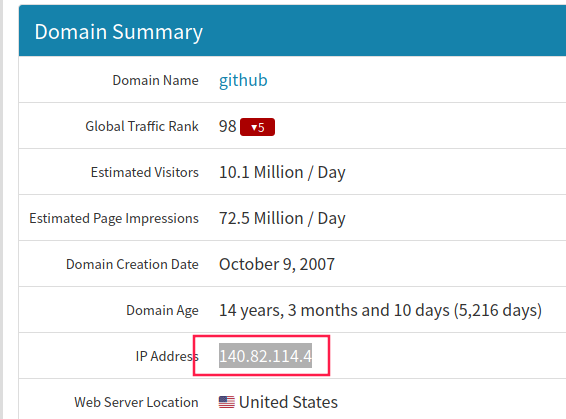

# Git 总结

## 内网无法访问`Github`的问题 

### Github能ping但打不开（即使使用VPN）

打开`C:\Windows\System32\drivers\etc\hosts`，注释掉带有`github.com`的行

```markdow
#140.82.114.4 github.com
#140.82.113.3 github.com
199.232.69.194 github.global.ssl.fastly.net
```

对于linux，打开hosts，

```shell
sudo gedit /etc/hosts
```

再将以下内容添加到最后

```shell
140.82.113.3 github.com
185.199.108.154 github.githubassets.com
185.199.109.154 github.githubassets.com
185.199.110.154 github.githubassets.com
185.199.111.154 github.githubassets.com
185.199.108.154 github.githubassets.com
185.199.109.154 github.githubassets.com
185.199.110.154 github.githubassets.com
185.199.111.154 github.githubassets.com
199.232.68.133 camo.githubusercontent.com
199.232.68.133 camo.githubusercontent.com
199.232.68.133 github.map.fastly.net
199.232.68.133 github.map.fastly.net
199.232.69.194 github.global.ssl.fastly.net
199.232.69.194 github.global.ssl.fastly.net
140.82.113.5 api.github.com
140.82.113.5 api.github.com
199.232.68.133 raw.githubusercontent.com
199.232.68.133 raw.githubusercontent.com
199.232.68.133 user-images.githubusercontent.com
199.232.68.133 user-images.githubusercontent.com
199.232.68.133 favicons.githubusercontent.com
199.232.68.133 favicons.githubusercontent.com
151.101.113.194 github.global.ssl.fastly.net
192.30.253.112 github.com
```

如果能ping但是在浏览器里打不开github，还是把刚才添加的内容删掉吧，然后关掉无线网重启后，再登录github，秒开。

[完美解决github访问速度慢]: https://zhuanlan.zhihu.com/p/93436925
[解决Linux访问Github速度慢的问题]: https://blog.csdn.net/qq_17403617/article/details/118584780

### Github访问慢

访问[该网站](https://github.com.ipaddress.com/)获得一个访问Github最快的IP地址，在浏览器直接输入该IP地址访问。



将该IP地址写入hosts文件中，然后在cmd下运行命令 `ipconfig /flushdns`刷新DNS缓存。

或者关闭无线网重连。

### git push 失败

类似如下错误

```shell
remote: Support for password authentication was removed on August 13, 2021. Please use a personal access token instead.
remote: Please see https://github.blog/2020-12-15-token-authentication-requirements-for-git-operations/ for more information.
fatal: Authentication failed for 'https://github.com/jinbooooom/git.git/'
```

可以先创建`token`,参考[关于2021年8月13日github不再支持密码身份验证的解决方案](https://blog.csdn.net/qq_42714262/article/details/119706383)，然后使用命令，设置repo。

```shell
git remote set-url origin https://your_token@github.com/your_account/your_repo_name.git
# such as
git remote set-url origin https://your_token@github.com/jinbooooom/git.git
```

## github 配置ssh key

```shell
# 如果文件夹`.ssh`下没有ssh key，可以先用如下命令生成 ssh key
ssh-keygen -t rsa -C "jinboom@foxmail.com"  # 接下来一路按回车就可以了

# 获取 ssh key
cd ~/.ssh
cat id_rsa.pub
# Ggithub 添加 ssh key
```


最后测试是否成功配置 ssh key

```shell
jinbo@fang:~/.ssh$ ssh -T git@github.com
# 出现类似的结果说明成功
Hi jinbooooom! You've successfully authenticated, but GitHub does not provide shell access.
```

## 提交规范

### 配置 gitcommit_template

`gitcommit_template`放到仓库根目录下（本仓库中已有），配置命令：

```shell
# 设置全局提交模板
git config --global commit.template gitcommit_template
# 设置文本编辑器
git config --global core.editor vim
```

每次提交时输入`git commit`会自动弹出模板，然后在模板中编辑即可。#注释部分不会展现在提交的 `commit` 中。

### commit 格式

`type(scope): subject`

`commit类型(影响范围): 具体描述`

举例：

`fix(log): fix the format error of log when printing`

`doc: increase the readme of each folder in this repo`

### type（必须）

type 指明 git commit 的类别，应该使用以下类型，也可根据团队自行增减

-   feat: 新增功能
-   fix: 修复 bug
-   doc: 仅仅修改了文档，比如 README 等等
-   test: 增加/修改测试用例，包括单元测试、集成测试等
-   style: 修改了空行、缩进格式、引用包排序等等（不改变代码逻辑）
-   perf: 优化相关内容，比如提升性能、体验、算法等
-   refactor: 代码重构，没有新功能或者bug修复
-   chore: 改变构建流程、或者增加依赖库、工具等
-   revert: 回滚到上一个版本
-   merge: 代码合并
-   analysis：分析源码时，一些必要的注释
-   tmp：临时保存

### scope（可选）

scope用于说明 commit 影响的范围，根据不同项目有不同层次描述。若没有特殊规定，也可以描述影响的哪些功能等。

### subject（必须）

subject 是 commit 目的的简短描述，不超过 50/80 个字符。
