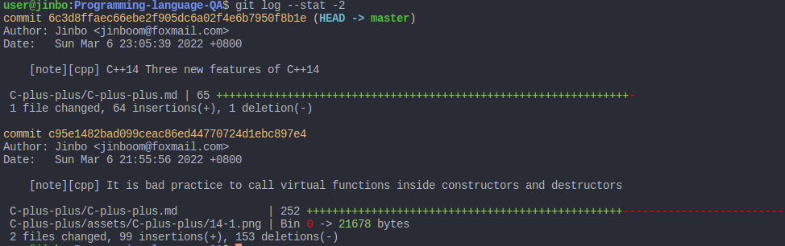
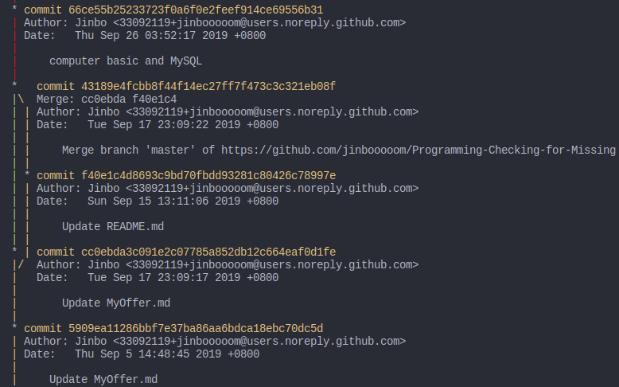
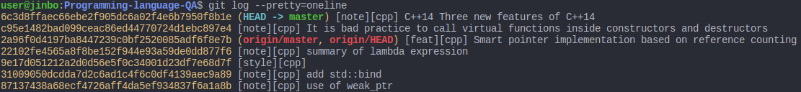
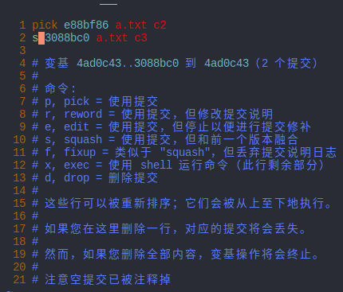
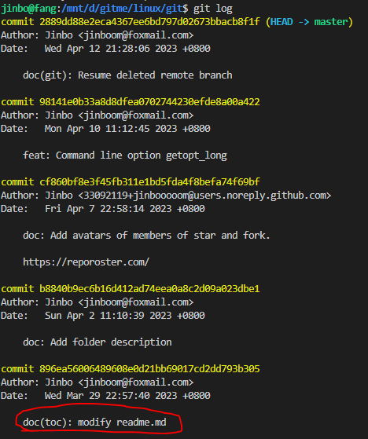
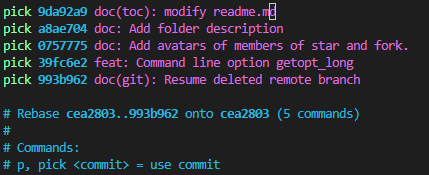
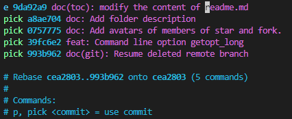
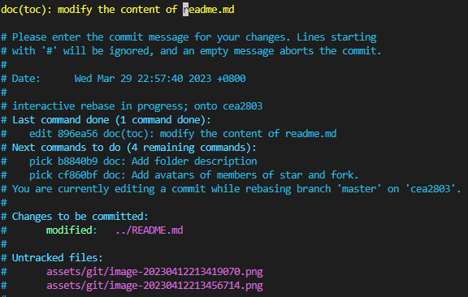
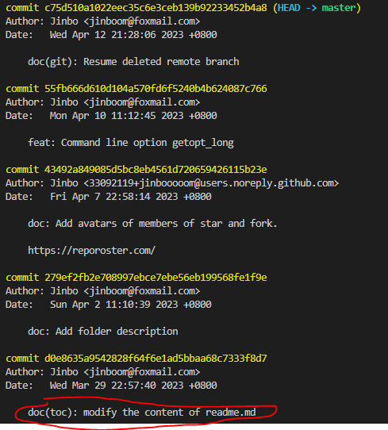
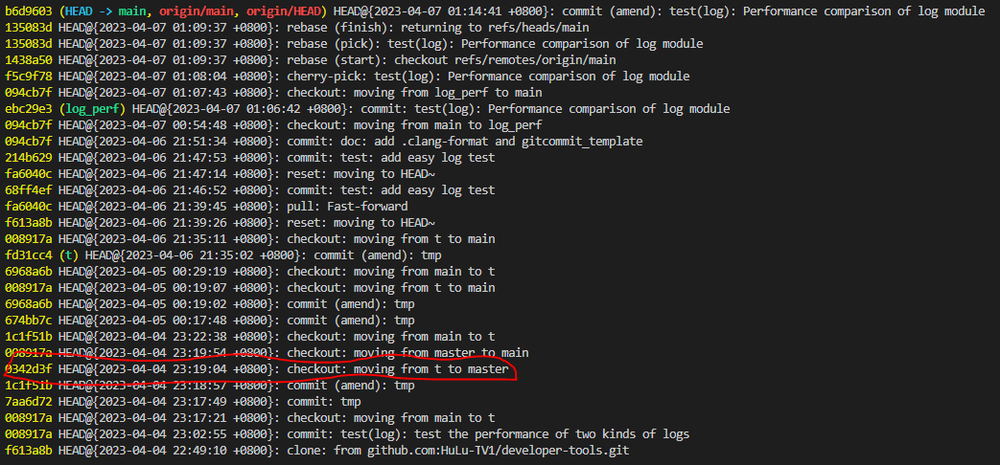

## Git 

### 一些概念

**工作区：**电脑上你能看到的目录

**版本库：**工作区的隐藏目录`.git`。含

- **暂存区：**`git add`后但未`git commit`的文件修改被添加到暂存区
- **本地分支：**`git commit`后，但未`git push`，即把暂存区的所有内容提交到本地分支

[练习 git 的在线网站](https://learngitbranching.js.org/?NODEMO=&locale=zh_CN)

## Git 基本操作

### 初始化仓库

```bash
# 下载一个 github 仓库
$ git clone [url]

# 初始化仓库
$ git init

# 新建一个目录，将其初始化为 Git 代码库
$ git init [project-name]
```

### 配置

```bash
# 显示当前的 Git 配置
$ git config --list

# 编辑 Git 配置文件
$ git config -e 
```

### 增加/删除文件

```bash
# 添加指定文件到暂存区
$ git add [file1] [file2] ...

# 添加指定目录到暂存区，包括子目录
$ git add [dir]

# 添加当前目录的所有文件到暂存区
$ git add -A 

# 提交新文件和被修改的文件，不包括被删除的文件  
$ git add .

# 提交被修改和被删除的文件，不包括新文件  
$ git add -u

# 停止跟踪指定文件，该文件会保留在工作区
# 停止跟踪后修改了停止跟踪的文件，并且 git add 到暂存区，又会再次跟踪
$ git rm --cached [file1] [file2]...

# 停止跟踪指定文件夹（可含子文件夹），该文件会保留在工作区
$ git rm --cached -r [dir]

# 删除工作区文件，使用 git 的这个命令不如用 shell 的 rm 命令,递归文件夹删除用 -rf
$ git rm -f [file1] [file2] ...

# 重命名暂存区文件（同时重命名工作区的文件名），重命名的文件被放入暂存区
$ git mv [file-original] [file-renamed]
```

### 代码提交

```bash
# 提交暂存区文件到本地仓库
$ git commit -m [message]

# 提交暂存区的指定文件到仓库区
$ git commit [file1] [file2] ... -m [message]

# 使用一次新的 commit，替代上一次提交
# 如果代码没有任何新变化，则用来改写上一次 commit 的提交信息
$ git commit --amend -m [message]
```

### 分支

```bash
# 列出所有本地分支
$ git branch

# 列出所有远程分支
$ git branch -r

# 列出所有本地分支和远程分支
$ git branch -a

# 新建一个分支，但依然停留在当前分支
$ git branch [branch-name]

# 新建一个分支，并切换到该分支
$ git checkout -b [branch-name]

# 新建一个分支，与指定的远程分支建立追踪关系
$ git branch --track [branch-name] [remote-branch-name]

# 切换到指定分支，并更新工作区
$ git checkout [branch-name]

# 合并指定分支到当前分支
$ git merge [branch-name]

# 推送分支到远程
$ git push origin [branch-name]

# 删除分支
$ git branch -d [branch-name]
$ git branch -D [branch-name]

# 删除远程仓库上的分支，其他协作者无法再访问该分支
$ git push origin --delete <branch-name>

# 只删除本地的远程分支引用，本地不再跟踪该远程分支，远程仓库中的分支仍然存在
$ git branch -dr <remote/branch>

# 修改本地分支名字
git branch -m old-name new-name
```

### 查看信息

```bash
# 查看暂存区状态
$ git status

# 显示当前分支的版本历史
$ git log

# 显示commit历史，以及每次commit发生变更的文件
$ git log --stat

# 显示暂存区和工作区的差异
$ git diff

# 显示工作区与当前分支最新commit之间的差异
$ git diff HEAD

# 显示某次提交的数据和内容变化
$ git show [commit]

# 显示某次提交时，某个文件的内容
$ git show [commit]:[filename]

# 显示当前分支的最近几次提交
$ git reflog
```

### 远程同步

```bash
# 下载远程仓库的所有变动
$ git fetch [remote]

# 显示所有远程仓库
$ git remote -v

# 获取远程的最新提交，并合并到本地工作目录，而且在合并过程中不会经过我们的审查，如果不仔细检查，这样很容易遇到冲突
$ git pull [remote] [branch]

# 把远程提交拉取到本地仓库，而不是本地工作目录，它不会自行将这些新数据合并到当前工作目录中，我们需要继续执行git merge才会把这些变动合并到当前工作目录。相比之下，git fetch是一个更安全的选择，因为它从你的远程仓库拉入所有的提交，但不会对你的本地文件做任何修改。
$ git fetch [remote] [branch]

# 上传本地指定分支到远程仓库
$ git push [remote] [branch]

# 强行推送当前分支到远程仓库，即使有冲突
$ git push [remote] --force

# 推送所有分支到远程仓库
$ git push [remote] --all
```

### 撤销

```bash
# 撤销工作区的所有修改
$ git checkout .

# 恢复暂存区的指定文件到工作区
$ git checkout [file]

# 恢复某个 commit 的指定文件到工作区
$ git checkout [commit] [file]

# 恢复上一个 commit 的所有文件到工作区,即撤销工作区的所有修改
$ git checkout .

# 重置暂存区的指定文件，与上一次 commit 保持一致，但工作区不变
$ git reset [file]

# 重置暂存区与工作区，与上一次 commit 保持一致
$ git reset --hard

# 重置当前分支的指针为指定 commit，同时重置暂存区，但工作区不变
$ git reset [commit]

# 重置当前分支的 HEAD 为指定 commit，同时重置暂存区和工作区，与指定commit 一致
$ git reset --hard [commit]

# 重置当前 HEAD 为指定 commit，但保持暂存区和工作区不变
$ git reset --keep [commit]

# 新建一个 commit，用来撤销指定 commit
# 后者的所有变化都将被前者抵消，并且应用到当前分支
$ git revert [commit]
```

### 标签

```shell
# 查看当前仓库中已经存在的标签：
$ git tag

# 创建轻量标签（Lightweight Tag）,轻量标签只是一个指向特定提交的引用，不包含额外的信息。
$ git tag [tagname]

# 创建带注释的标签（Annotated Tag）,带注释的标签包含更多的信息，如标签的创建者、日期、注释等。
$ git tag -a [tagname] -m "标签描述信息"
# 例如： git tag -a v1.0.0 -m "发布版本 1.0.0"

# 为历史提交打标签, 使用 git tag 加上提交的哈希值。
$ git tag [tagname] [commit_hash]
# 例如：git tag v1.0.0 abc1234

# 推送标签到远程仓库：默认情况下，git push 不会推送标签到远程仓库。需要显式地推送标签：
$ git push origin [tagname]

# 一次性推送所有标签
$ git push origin --tags

#  删除本地标签
$ git tag -d [tagname]

#  删除远程标签
$ git push origin --delete <tagname>

# 查看标签的详细信息
$ git show [tagname]
```

## 更改历史

```bash
# 删除历史里的文件path-to-your-remove-file。
# 注意一点，这里的文件或文件夹，都不能以 '/' 开头，否则文件或文件夹会被认为是从 git 的安装目录开始。
# 如果你要删除的目标不是文件，而是文件夹，那么请在 `git rm --cached' 命令后面添加 -r 命令，表示递归的删除（子）文件夹和文件夹下的文件，类似于 `rm -rf` 命令。
$ git filter-branch --force --index-filter 'git rm --cached --ignore-unmatch path-to-your-remove-file' --prune-empty --tag-name-filter cat -- --all
```

## 查看改动

`git diff`命令可以查看当前工作区（add前）与暂存区（add后commit前）的差别。也就是说可以查看到当前我们修改或者是添加的，但是还没有add进暂存区的代码。它会列出改动前后的对比，方便我们进行查看和修改。

```
user@jinbo:t$ git diff
diff --git a/a.txt b/a.txt
index a801aea..84692d5 100644
--- a/a.txt
+++ b/a.txt
@@ -1,2 +1,2 @@
 a.txt commit1
-a.txt commit2
\ No newline at end of file
+a.txt commit2 -
\ No newline at end of file
```

由于`git diff`是显示所有的文件改动，当改动量较大时，不方便看你呢，所以可以通过 `git diff + 文件路径`查看某一个文件的具体改动，如 `git diff path/file.cpp`

`git diff --cached`:在不加任何参数的情况下查看的是工作区（add命令之前）的代码和暂存区的差别，如果已经把所有代码都add进来了，那么当运行`git diff`是不会显示任何内容的，这是因为我们已经把代码提交到暂存区了，不加参数的时候是比较的工作区和暂存区的差别。这个时候我们再想看`diff`，想看的其实是暂存区和本地git仓库的差别。这时可以通过`--cached`参数来实现，`--cached`参数后面同样可以跟上文件路径，查看某一个具体文件的改动。

## 查看提交

`git log -p -n`：运行git log的时候只会展示提交相关的信息，是不会把每一次改动的内容都展示出来的，一则没有必要，二则未免太多了。但是有的时候我们会希望看到每一个commit当中改动的究竟是什么，如果通过git diff一个一个查看也太麻烦了。这个时候就可以用上参数来实现这点，只需要在git log后面加上-p，它就会展示出每一个commit中的改动。由于commit当中的改动量可能很大，所以我们这样查看到的内容也会非常多。我们可以在-p后面再加上一个-n表示我们想要查看的最近几条commit信息，比如`git log -p -2`查看的就是最近两条提交信息。后面还可以接grep查看指定关键字的修改。

`git log --stat -n`：有的时候只想查看每一次commit到底有多少改动量，而不想知道具体的改动是什么，可以使用`--stat`参数。如果只想查看最近几次的commit的改动量，只需要再加 `-n`。如果想把改动的内容显示处理，可以加 `-p`。



`git log --graph`：可以展示提交的一个树形分支结构



`git log --pretty`：支持DIY自己想要的log展示，比如常用的是`git log --pretty=oneline`，这里的`oneline`是一种格式，表示单行展示，也就是会把commit展示的信息压缩成一行。关于`--pretty`更多用法有需求的时候再查，这里不再记录了。



参考[学会这三个命令，你就不再是git只会用三板斧的菜鸟了](https://www.cnblogs.com/techflow/p/13856483.html)

## 合并多次commit为一次

`git rebase -i HEAD~n`：可以将从最后一次提交往前的`n`次提交合并为一次。

如最近的三次提交是

```shell
user@jinbo:t$ git log --pretty=oneline
3088bc081cf8fd9c36a117085877e9ec7e38e3cc (HEAD -> master) a.txt c3
e88bf8637ca31fd95a36a47d20837bb3d3b650c3 a.txt c2
4ad0c43bd8d1cfb91542f1d09e47ebdefe825c25 a.txt commit1
```

希望合并最近的两次提交，使用命令`git rebase -i HEAD~2`，将除了第一个`pick`外的其它`pick`改为`s`，即`squash`。之后保存退出。



再次查看commit记录，发现commit第一次记录3088bc和第二次记录 e88bf8 合并为一次提交7d988f。

```shell
user@jinbo:t$ git log --pretty=oneline
7d988f2cfa02fd013d5dde9de03368f6aa01a5f6 (HEAD -> master) a.txt c2
4ad0c43bd8d1cfb91542f1d09e47ebdefe825c25 a.txt commit1
```

参考https://www.jianshu.com/p/66cece71b41d

`git rebase -i commit_id1 commit_id2`：可以合并从`commit_id1`之后到`commit_id2`（含）之间的`commit`。

例如：

```shell
user@jinbo:t$ git log --pretty=oneline
d82301239211e6bd474356c22d6efc1f2d28e75d (HEAD -> master) c8
a649ba5230038f8fdc7785a360604ef45c6e98ec merge branch new
42d747cc69ee9424a5c4cc4df1dc0124b2774c0c c5
e86db72752ab56086b18ed6c4912e820dbe05376 c7
a12595a769124c371d3a023ff82c2f58db150741 c6
c80902f12e12f1e0206667ca7c5d94f88ddd9510 c5
1feb2001fb0b947860b6e052c00269eba52d09f8 c4
7d988f2cfa02fd013d5dde9de03368f6aa01a5f6 a.txt c2
4ad0c43bd8d1cfb91542f1d09e47ebdefe825c25 a.txt commit1
```

`git rebase -i c80902 d82301`会合并主题是c5，c6，c7，c5，merge branch new，c8的这些提交。然后将除了第一个`pick`外的其它`pick`改为`s`，即`squash`。再保存退出。

保存上面提交后，查看分支信息，当前分支并不在master上了，这个分支并不会保存，只是我们压缩提交记录后的一个临时分支。所以要基于当前临时分支创建新分支。

```shell
user@jinbo:t$ git checkout -b branch_c6_c8
切换到一个新分支 'branch_c6_c8'
user@jinbo:t$ git branch
* branch_c6_c8
  master
```

在切换到`master`，合并`branch_c6_c8`到`master`

```shell
user@jinbo:t$ git checkout master 
切换到分支 'master'
user@jinbo:t$ git merge branch_c6_c8 
自动合并 a.txt
冲突（内容）：合并冲突于 a.txt
自动合并失败，修正冲突然后提交修正的结果。
```

合并冲突后，再重新提交。

参考：

 [GIT压缩多次提交记录为一次](https://blog.csdn.net/qq122516902/article/details/116060977)

[git将多次commit提交合并为一次](https://blog.csdn.net/Misnice/article/details/112252755)

## [修改最近的commit](https://www.jianshu.com/p/aec07ed7a052#:~:text=%E4%BF%AE%E6%94%B9commit%E4%BF%A1%E6%81%AF%E4%B8%BB%E8%A6%81%E6%9C%89%E8%BF%99%E5%87%A0%E7%A7%8D%E6%83%85%E5%86%B5%201.%E5%88%9A%E5%88%9Acommit%EF%BC%8C%E8%BF%98%E6%B2%A1%E6%9C%89push%EF%BC%8C%E4%BD%BF%E7%94%A8%20git%20commit%20--amend%3B%202.%E5%88%9A%E5%88%9Apush%EF%BC%8C%E8%A6%81%E4%BF%AE%E6%94%B9%E6%9C%80%E8%BF%91%E4%B8%80%E4%B8%AApush%E7%9A%84commit%E4%BF%A1%E6%81%AF%EF%BC%8C%E4%BD%BF%E7%94%A8%20git%20commit,--amend%20%EF%BC%9B%203.%E4%BF%AE%E6%94%B9%E5%8E%86%E5%8F%B2push%E7%9A%84commit%E4%BF%A1%E6%81%AF%EF%BC%8C%E4%BD%BF%E7%94%A8%20git%20rebase%20-i%20HEAD~n%20%E3%80%90%E5%85%B6%E4%B8%AD%E7%9A%84n%E4%B8%BA%E8%AE%B0%E5%BD%95%E6%95%B0%E3%80%91%EF%BC%8C%E9%85%8D%E5%90%882%E4%B8%AD%E7%9A%84%E5%91%BD%E4%BB%A4)

修改commit信息主要有这几种情况

1. 刚刚commit，还没有push，使用git commit --amend;
2. 刚刚push，要修改最近一个push的commit信息，使用git commit --amend；
3. 修改历史push的commit信息，使用`git rebase -i HEAD~n`(其中n为记录数)，配合2中的命令

注意：

其中1、2两种情况的修改方式是一样的，但是git log的记录是不同的

第三种方式也是把需要修改的记录调整为最新的提交，然后使用2的方式修改，示例如下：



我们希望修改之前的第五个提交：`git rebase -i HEAD~5`





在弹出的界面中，将第一个 pick 改成 e，wq保持退出后，终端打印

```shell
jinbo@fang:/mnt/d/gitme/linux/git$ git rebase -i HEAD~5
Stopped at 896ea56...  doc(toc): modify the content of readme.md
You can amend the commit now, with

  git commit --amend 

Once you are satisfied with your changes, run

  git rebase --continue
```

按照指示添加 commit

```shell
git commit --amend
```

弹出如下界面，我们修改commit记录如下图所示



再输入命令

```shell
jinbo@fang:/mnt/d/gitme/linux/git$ git rebase --continue
Successfully rebased and updated refs/heads/master.
```

此时 log 内容为




## 打 patch

### 对未提交的代码打 patch

```shell
# 对指定的文件的修改打 patch
git diff 文件名 > test.patch

# 由于没有指定修改的文件，所以默认把所有修改的文件都打 patch，同时还需要注意，这里是本地修改的没有执行add缓存的
git diff > test.patch  

# 如果已经执行git add，再想打 patch 可以使用
git diff --cached >  test.patch
```

### 对提交的代码打 patch

```shell
git format-patch commit_id1 commit_id2  
# 也可以使用 git format-patch -1 ，指为最近 1 次提交的代码打 patch,-2 指为最近的两次提交打 patch，会生成两个文件，分别是两次提交的 patch)
```

### 应用 patch

```shell
git am xxx.patch
```

## 恢复删除的远程分支

实际工作中，可能既删除了本地代码，也删除了远程分支，但还是可以恢复的。

查看`reflog`，找到最后一次`commit id`

```shell
git reflog --date=iso
```

reflog是reference log的意思，也就是引用log，记录HEAD在各个分支上的移动轨迹。选项  --date=iso，表示以标准时间格式展示。这里

为什么不用git log？git log是用来记录当前分支的commit  log，分支都删除了，找不到commit log了。但可以找到目标分支最后一次的`commit id`



比如这里，我们将远程分支`master`删除了，但是我们找到了从分支`t`切换到`master`的这个移动轨迹`0342d3f HEAD@{2023-04-04 23:19:04 +0800}: checkout: moving from t to master`，那么可以根据`0342d3f`切出分支:

```shell
git checkout -b recovery 0342d3f
Switched to a new branch 'recovery'
```

切出分支后，本地有分支了，再push到远程仓库就可以了

```shell
 git push origin recovery 
```

## 临时/全局配置账号与邮箱

**临时配置（仅对当前仓库有效）**

```shell
# 配置用户名
git config user.name "您的用户名"

# 配置邮箱
git config user.email "您的邮箱@example.com"
```

**全局配置（对所有仓库有效）**

```shell
# 全局配置用户名
git config --global user.name "您的用户名"

# 全局配置邮箱
git config --current user.email "您的邮箱@example.com"
```

**仅对当前提交配置**

```shell
# 在提交时临时指定作者信息
git commit -m "提交信息" --author="用户名 <邮箱@example.com>"
```

**查看当前配置**

```shell
# 查看当前仓库配置
git config user.name
git config user.email

# 查看全局配置
git config --global user.name
git config --global user.email
```

**临时环境变量（推荐用于临时切换）**

```shell
# 设置环境变量（仅对当前终端会话有效）
export GIT_AUTHOR_NAME="临时用户名"
export GIT_AUTHOR_EMAIL="临时邮箱@example.com"
export GIT_COMMITTER_NAME="临时用户名"
export GIT_COMMITTER_EMAIL="临时邮箱@example.com"

# 然后正常提交
git commit -m "提交信息"
```

## `commit.template` 配置

检查 Git `commit.template` 配置：

```shell
git config --get commit.template
```

如果没有输出，说明没设置。此时需要设置模板路径，例如：

```bash
git config --global commit.template ~/.gitcommit_template
```

或者对单个仓库设置（在仓库根目录下）：

```bash
git config commit.template .gitcommit_template
```

仓库级配置覆盖全局配置，cat `.git/config`（仓库配置） 和 `~/.gitconfig`（全局配置） 文件可以查看各种 git 配置。

加载模板：

- `git commit`（无参数）才会打开编辑器并加载模板内容。
- 如果你用 `git commit -m "xxx"`，模板不会生效。
- 如果你用 `git commit --allow-empty-message -m ""`，同样不会弹出模板。编辑器设置

## 设置 GIT 编辑器

```shell
# 加上 ----global 为全局配置
git config --global core.editor "vim" # 设置为  vim
git config --global core.editor "nano"
# 设置为 Notepad++（Windows
git config --global core.editor "'C:/Program Files/Notepad++/notepad++.exe' -multiInst -notabbar -nosession -noPlugin" ）

# 去掉 ----global 只对当前仓库有效
git config core.editor "vim" # 设置当前仓库使用  vim 编辑器

# 查看当前的全局编辑器
git config --global --get core.editor

# 查看当前仓库使用的编辑器
git config --get core.editor
```

## 推荐阅读

- http://gityuan.com/2015/06/27/git-notes/
- [**Git Magic**](http://www-cs-students.stanford.edu/~blynn/gitmagic/intl/zh_cn/pr01.html)